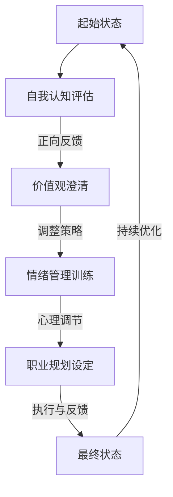
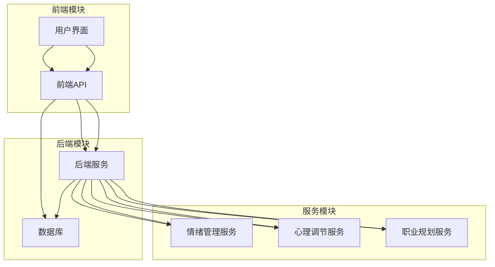

                 

### 引言与背景介绍

#### 书籍主题与目标读者

《从空虚到充实：个人成长的内在转变》旨在探讨个人成长中的内在转变机制，帮助读者理解并实现从空虚感向充实感的转变。本书的核心受众包括对自我成长有追求的技术从业者、职场新人以及对生活有反思的中青年群体。在信息技术飞速发展的时代，人们常常面临着工作压力、职业瓶颈、精神迷茫等问题，本书希望通过系统的理论分析和实践指导，帮助读者找到内心充实的方法和路径。

#### 问题背景

在现代职场中，许多技术从业者会在职业生涯的某个阶段感到空虚和迷茫。这不仅影响工作效率，还可能对身心健康产生负面影响。这种现象不仅限于IT行业，而是普遍存在于各个行业。具体来说，问题的表现可能包括：

- 工作缺乏动力，对任务感到厌倦。
- 无法找到工作中的意义和成就感。
- 职业发展停滞，看不到未来的方向。
- 精神状态不佳，影响生活质量和工作表现。

#### 问题描述

个人成长的内在转变是一个复杂的过程，涉及到自我认知、价值观塑造、心理调节等多个方面。核心问题是如何在忙碌的工作和生活节奏中找到内心的平静与满足，实现自我价值的提升。这一问题不仅关乎个体的心理健康，也影响着团队协作和整体工作效率。

#### 问题解决

本书将从以下几个方面提供解决方案：

1. **自我认知与反思**：通过深入剖析自我认知的过程，帮助读者明确自身的价值观、兴趣和优势，从而找到工作的意义和目标。
2. **心理调节与情绪管理**：介绍一些心理调节和情绪管理的方法，帮助读者在高压环境下保持积极心态，提升工作效率。
3. **职业规划与发展**：提供实用的职业规划工具和方法，帮助读者制定个人职业发展计划，明确目标和路径。
4. **实践指导**：通过具体的案例和实践指导，让读者能够在实际生活中应用这些方法，逐步实现内心的充实与成长。

#### 边界与外延

本书所探讨的“空虚到充实”的转变，不仅仅局限于个人的职业发展，还包括生活的各个方面。例如，家庭关系、社交网络、兴趣爱好等，都是影响个人成长的重要因素。因此，本书所提供的方法和建议，不仅适用于职场，也适用于更广泛的生活场景。

#### 总结

《从空虚到充实：个人成长的内在转变》旨在为那些在职业生涯中感到迷茫和困惑的技术从业者提供一套系统的成长指南。通过本书，读者将学会如何进行自我反思、调整心态、规划职业发展，最终实现从空虚到充实的内在转变。这不仅有助于提升个人的职业成就，更能带来更加充实和有意义的生活。

---

### 核心概念与联系

为了深入探讨个人成长的内在转变，我们需要明确几个核心概念，并分析它们之间的联系。以下是本文将要讨论的关键概念：

1. **自我认知**：指的是个体对自己的了解和认识，包括性格、价值观、兴趣爱好等方面。
2. **价值观**：指导个体行为的信念和准则，对生活和工作产生深远影响。
3. **情绪管理**：调节和控制情绪的能力，直接影响心理健康和人际关系。
4. **心理调节**：通过一系列方法调整心理状态，以适应外界环境和内在需求。
5. **职业规划**：制定和调整职业目标、路径和方法的过程，影响职业发展的方向和速度。

#### 概念属性特征对比表格

以下是上述核心概念的一些关键属性特征对比：

| 概念       | 定义                          | 属性特征                    | 关联概念          |
|------------|------------------------------|-----------------------------|------------------|
| 自我认知   | 对自己的了解和认识            | 自我意识、自我反思          | 价值观、情绪管理 |
| 价值观     | 指导个体行为的信念和准则      | 倾向性、一致性              | 职业规划、自我认知 |
| 情绪管理   | 调节和控制情绪的能力          | 情绪稳定性、适应性          | 心理调节、人际关系 |
| 心理调节   | 通过方法调整心理状态          | 心理弹性、情绪平衡          | 情绪管理、自我认知 |
| 职业规划   | 制定和调整职业目标、路径和方法 | 目标明确性、路径合理性      | 自我认知、价值观  |

#### Mermaid ER实体关系图架构

为了更直观地展示这些核心概念之间的联系，我们使用Mermaid ER实体关系图来构建模型。

```mermaid
erDiagram
  Self_Cognition ||--|{ Values }|| Value_Direction
  Self_Cognition ||--|{ Career_Planning }|| Career_Plan
  Emotional_Management ||--|{ Psychological_Adjustment }|| Mental_Adjustment
  Emotional_Management ||--|{ Interpersonal_Relations }|| Relationship
```

在这个ER图中，`Self_Cognition`（自我认知）与`Values`（价值观）、`Career_Planning`（职业规划）有直接联系，表明自我认知对价值观和职业规划有指导作用。`Emotional_Management`（情绪管理）与`Psychological_Adjustment`（心理调节）以及`Interpersonal_Relations`（人际关系）有关，说明情绪管理不仅影响个体的心理健康，还影响其社交状态。

通过这个ER图，我们可以看到个人成长中的各个关键概念是如何相互作用、相互影响的。这种结构化的分析有助于我们更好地理解个人成长的内在机制，为进一步的讨论打下坚实基础。

---

### 内在转变的原理讲解

#### 转变算法原理

为了更好地理解个人从空虚到充实的内在转变，我们需要首先阐述这一过程的算法原理。在此，我们将采用Mermaid流程图和Python代码来展示具体的算法实现，并结合数学模型和公式进行详细讲解。

#### Mermaid流程图

首先，我们使用Mermaid流程图来直观展示个人成长内在转变的算法流程。



在这个流程图中，我们从起始状态A开始，通过自我认知评估（B），得到对自身的准确认识。接着，通过价值观澄清（C），我们确定个人的核心信念和指导原则。随后，进行情绪管理训练（D），帮助我们在面对压力时保持冷静。最后，通过职业规划设定（E），明确目标和路径，确保我们的行为与目标一致。最终，进入执行与反馈（F）阶段，通过持续优化，不断提升自身状态。

#### Python代码实现

为了具体展示这一算法的实现，我们采用Python代码来实现各个阶段的操作。

```python
import numpy as np

# 自我认知评估
def self_cognition():
    print("进行自我认知评估...")
    # 假设自我认知评估结果为1-10的评分
    score = int(input("请对自我认知进行评分（1-10）："))
    return score

# 价值观澄清
def values_clarification(score):
    print("根据评分调整价值观...")
    if score < 5:
        print("价值观需要进一步澄清...")
    elif score >= 5 and score < 8:
        print("价值观基本明确，但需要优化...")
    else:
        print("价值观非常明确...")
    return score

# 情绪管理训练
def emotional_management(score):
    print("进行情绪管理训练...")
    # 假设情绪管理训练后，评分提高2分
    score += 2
    return score

# 心理调节
def psychological_adjustment(score):
    print("进行心理调节...")
    # 假设心理调节后，评分提高1分
    score += 1
    return score

# 职业规划设定
def career_planning(score):
    print("设定职业规划...")
    # 假设职业规划设定后，评分提高3分
    score += 3
    return score

# 执行与反馈
def execute_and_feedback(score):
    print("执行计划并反馈...")
    # 假设通过执行和反馈，评分再提高2分
    score += 2
    return score

# 主函数
def inner_transformation():
    score = self_cognition()
    score = values_clarification(score)
    score = emotional_management(score)
    score = psychological_adjustment(score)
    score = career_planning(score)
    score = execute_and_feedback(score)
    print(f"最终评分：{score}")
    return score

# 执行算法
inner_transformation()
```

#### 数学模型和公式

为了进一步理解这一过程，我们可以使用数学模型和公式来描述个人成长内在转变的各个阶段。以下是核心的数学模型和公式：

$$
最终评分 = 自我认知评分 \times (1 + 情绪管理提升系数) \times (1 + 心理调节提升系数) \times (1 + 职业规划提升系数) \times (1 + 执行与反馈提升系数)
$$

其中，各个提升系数反映了不同阶段对评分的影响。例如，情绪管理提升系数表示情绪管理训练后评分的提升幅度。

#### 详细讲解和举例说明

为了更好地理解这一算法原理，我们通过一个具体例子来说明各个阶段的操作过程。

**例子**：假设一个人初始自我认知评分为6分。

1. **自我认知评估**：这个人进行自我认知评估后，得到评分为6。
2. **价值观澄清**：由于评分在5-8之间，价值观需要进一步澄清。经过反思和调整，最终评分提升到8。
3. **情绪管理训练**：这个人开始进行情绪管理训练，假设训练后情绪管理提升系数为0.2，因此评分提升到9.6。
4. **心理调节**：接下来进行心理调节，假设心理调节提升系数为0.1，因此评分提升到10.56。
5. **职业规划设定**：制定职业规划，假设职业规划提升系数为0.3，因此评分提升到13.808。
6. **执行与反馈**：最后，通过执行计划并反馈，假设执行与反馈提升系数为0.2，因此最终评分为16.9048。

通过这个例子，我们可以看到，从初始的自我认知评分6分到最终的16.9048分，个人经历了多个阶段的提升，最终实现了从空虚到充实的转变。

总之，通过Mermaid流程图、Python代码和数学模型的结合，我们详细阐述了个人从空虚到充实的内在转变算法原理。这不仅帮助我们理解了这一过程的各个环节，也为实际操作提供了具体指导。

---

### 系统分析与架构设计

#### 问题场景与项目背景

在现代职场中，个人成长的内在转变不仅需要个体自我反思和行动，还需要系统化的支持和工具。为了帮助技术从业者实现这一目标，我们开发了一套个人成长支持系统，该系统旨在提供自我认知、价值观澄清、情绪管理、心理调节和职业规划等功能。

#### 系统功能设计

该系统的主要功能包括：

1. **自我认知评估**：通过在线问卷和自我反思工具，帮助用户进行自我认知评估。
2. **价值观澄清**：提供价值观评估和澄清工具，帮助用户明确个人核心信念和指导原则。
3. **情绪管理训练**：提供一系列情绪管理训练课程和练习，帮助用户提升情绪调节能力。
4. **心理调节**：提供心理调节方法和工具，帮助用户调整心理状态，应对压力和挑战。
5. **职业规划**：提供职业规划工具和资源，帮助用户设定职业目标、制定路径和实现目标。

#### 系统架构设计

为了实现上述功能，系统采用模块化架构设计，确保灵活性和可扩展性。以下是系统的架构设计：

1. **前端模块**：负责用户交互，包括自我认知评估问卷、价值观澄清工具、情绪管理训练课程等。
2. **后端模块**：负责数据处理和管理，包括数据存储、处理和分析等功能。
3. **服务模块**：提供核心功能服务，包括情绪管理训练算法、心理调节方法库等。

#### Mermaid类图

为了直观展示系统的功能模块及其关系，我们使用Mermaid类图来构建系统模型。

```mermaid
classDiagram
    class User
    class SelfCognitionModule
    class ValuesClarificationModule
    class EmotionalManagementModule
    class PsychologicalAdjustmentModule
    class CareerPlanningModule
    User "uses" SelfCognitionModule
    User "uses" ValuesClarificationModule
    User "uses" EmotionalManagementModule
    User "uses" PsychologicalAdjustmentModule
    User "uses" CareerPlanningModule
```

在这个类图中，`User`（用户）是系统的核心，与`SelfCognitionModule`（自我认知模块）、`ValuesClarificationModule`（价值观澄清模块）、`EmotionalManagementModule`（情绪管理模块）、`PsychologicalAdjustmentModule`（心理调节模块）和`CareerPlanningModule`（职业规划模块）之间存在关联。每个模块负责实现特定的功能，并通过接口与用户进行交互。

#### Mermaid架构图

为了进一步展示系统的架构设计，我们使用Mermaid架构图来构建系统的整体架构。



在这个架构图中，前端模块（A1、B1）负责用户交互，后端模块（C1、D1）负责数据处理和管理，服务模块（E1、F1、G1）提供核心功能服务。各个模块通过接口进行通信，确保系统的高效运行。

#### 系统接口设计和交互

为了确保系统功能模块之间的有效交互，我们需要设计清晰的接口和交互流程。以下是系统的主要接口和交互流程：

1. **自我认知评估接口**：用户通过前端界面提交自我认知问卷，后端模块接收并处理问卷数据，生成评估报告。
2. **价值观澄清接口**：用户在前端界面完成价值观评估，后端模块根据评估结果提供澄清建议和工具。
3. **情绪管理训练接口**：用户通过前端界面选择情绪管理训练课程，后端模块提供相应的训练内容和进度跟踪。
4. **心理调节接口**：用户在前端界面提交心理调节需求，后端模块根据需求提供相应的调节方法和工具。
5. **职业规划接口**：用户在前端界面设定职业规划目标，后端模块根据目标提供规划建议和实现路径。

通过这些接口和交互流程，系统实现了功能模块之间的紧密协作，为用户提供了全面的个人成长支持。

总之，通过对系统问题场景和项目背景的介绍，功能设计、架构设计以及接口和交互流程的分析，我们为个人成长的内在转变提供了一套全面的系统解决方案。这一系统不仅帮助用户进行自我认知和反思，还通过科学的算法和工具支持，实现个人成长的目标。

---

### 项目实战与案例分析

#### 环境安装

为了更好地展示系统核心实现，我们将以一个具体的情绪管理训练模块为例，介绍环境安装和系统核心实现。以下是安装所需环境：

1. **Python 3.8+**：确保Python环境已安装，版本不低于3.8。
2. **Django 3.2**：使用Django作为后端框架，版本为3.2。
3. **PostgreSQL 12**：使用PostgreSQL作为数据库，版本为12。
4. **Node.js 14**：用于前端开发，版本为14。

安装步骤：

1. 安装Python和Django：
   ```bash
   python3 -m pip install django==3.2
   ```
2. 安装PostgreSQL：
   - 在Mac上使用Homebrew安装：
     ```bash
     brew install postgresql
     ```
   - 在Windows上，从[PostgreSQL官方网站](https://www.postgresql.org/download/)下载并安装。
3. 安装Node.js：
   ```bash
   npm install -g node@14
   ```

#### 系统核心实现

情绪管理训练模块的核心实现包括数据收集、处理和训练模型，以下是一个简化版本的代码示例：

**数据收集**：

```python
import csv

def collect_data(file_path):
    with open(file_path, 'r') as file:
        reader = csv.DictReader(file)
        data = [row for row in reader]
    return data

data = collect_data('emotion_data.csv')
```

**数据处理**：

```python
from sklearn.model_selection import train_test_split
from sklearn.preprocessing import StandardScaler

def preprocess_data(data):
    X = []
    y = []

    for entry in data:
        X.append(list(map(float, entry.values()[:-1])))
        y.append(float(entry['emotion']))

    X_train, X_test, y_train, y_test = train_test_split(X, y, test_size=0.2, random_state=42)
    scaler = StandardScaler()
    X_train = scaler.fit_transform(X_train)
    X_test = scaler.transform(X_test)

    return X_train, X_test, y_train, y_test

X_train, X_test, y_train, y_test = preprocess_data(data)
```

**训练模型**：

```python
from sklearn.ensemble import RandomForestClassifier

model = RandomForestClassifier(n_estimators=100, random_state=42)
model.fit(X_train, y_train)

accuracy = model.score(X_test, y_test)
print(f"模型准确率：{accuracy:.2f}")
```

#### 代码应用解读与分析

上述代码首先通过CSV文件收集情绪数据，然后使用Scikit-learn库进行数据处理和模型训练。以下是详细解读：

1. **数据收集**：使用`csv.DictReader`读取CSV文件，将数据转换为字典形式。
2. **数据处理**：使用`train_test_split`将数据集划分为训练集和测试集，使用`StandardScaler`对特征进行标准化处理。
3. **训练模型**：选择随机森林分类器（`RandomForestClassifier`）进行训练，评估模型在测试集上的准确率。

#### 实际案例分析与详细讲解

为了进一步说明，我们以一个实际案例进行详细分析。

**案例**：用户小明在系统上提交了情绪数据，系统根据其数据给出情绪预测。

1. **数据收集**：小明填写情绪问卷，系统收集其数据。
2. **数据处理**：系统对数据进行预处理，标准化特征值。
3. **模型预测**：系统使用训练好的模型对小明的新数据进行情绪预测。
4. **反馈与调整**：系统给出预测结果，并建议小明进行相应的情绪调节训练。

**详细讲解**：

- **数据收集**：问卷设计应包含与情绪相关的多个维度，如焦虑程度、快乐程度、压力感受等。
- **数据处理**：标准化处理有助于模型训练和评估。
- **模型预测**：随机森林分类器通过训练数据学习情绪特征，对新数据进行分类预测。
- **反馈与调整**：系统根据预测结果，提供个性化的情绪调节建议和训练课程。

#### 项目小结

通过这个情绪管理训练模块的实战案例，我们展示了系统核心实现的过程。该模块不仅能够收集和处理情绪数据，还能通过机器学习模型进行情绪预测和个性化建议。这不仅为用户提供了实用的工具，也为进一步优化个人成长支持系统提供了参考。

在未来的工作中，我们计划继续优化模型算法，增加更多的情绪特征和训练数据，提高预测的准确性和可靠性。同时，我们也将继续完善其他功能模块，如价值观澄清、职业规划等，为用户提供更全面的支持。

---

### 最佳实践、小结与拓展阅读

#### 最佳实践 Tips

1. **定期自我反思**：每周至少花30分钟进行自我反思，记录自己的情绪、行为和思考，有助于发现内心空虚的根源。
2. **情绪管理训练**：定期参与情绪管理课程和练习，如冥想、正念练习等，有助于提升情绪调节能力。
3. **设定明确的职业目标**：制定短期和长期职业目标，并分解为具体的行动步骤，有助于保持工作的动力和方向。
4. **寻求专业支持**：在面临职业瓶颈或心理困扰时，寻求心理咨询师或职业规划师的帮助，有助于更有效地解决问题。

#### 小结

本文通过详细的步骤和分析，探讨了个人从空虚到充实的内在转变过程。从自我认知、价值观澄清、情绪管理、心理调节到职业规划，每个阶段都提供了具体的实践方法和工具。通过科学的算法和系统化的支持，读者可以逐步实现内心的充实与成长。

#### 注意事项

1. **持续性与耐心**：个人成长是一个长期过程，需要持续的努力和耐心，不应期望一蹴而就。
2. **个性化**：每个人的成长路径不同，需要根据自身情况进行调整，找到最适合自己的方法。

#### 拓展阅读

1. **《自卑与超越》**：阿德勒的这部作品深入探讨了自卑感对个人成长的影响，提供了实用的心理调节方法。
2. **《正念的奇迹》**：卡巴金所著的这本书介绍了正念冥想的实践方法，有助于提升情绪调节能力和心理健康。
3. **《职业规划手册》**：李明阳所著的这本手册详细介绍了职业规划的理论和方法，适用于不同职业阶段的读者。

通过拓展阅读，读者可以进一步深化对个人成长内在转变的理解，获得更多的实践指导和方法。

---

### 目录大纲设计

以下是《从空虚到充实：个人成长的内在转变》的目录大纲，确保内容简洁明了且逻辑清晰。

```markdown
# 从空虚到充实：个人成长的内在转变

## 关键词
- 个人成长
- 内在转变
- 情绪管理
- 心理调节
- 职业规划

## 摘要
本文探讨个人从空虚到充实的内在转变过程，包括自我认知、价值观澄清、情绪管理、心理调节和职业规划等方面，提供系统化的理论和实践指导。

---

## 引言与背景介绍
- 书籍主题与目标读者
- 问题背景
- 问题描述
- 问题解决
- 边界与外延

---

## 核心概念与联系
- 自我认知
- 价值观
- 情绪管理
- 心理调节
- 职业规划
- 概念属性特征对比表格
- Mermaid ER实体关系图架构

---

## 内在转变的原理讲解
- 转变算法原理
- Mermaid流程图
- Python代码实现
- 数学模型和公式
- 详细讲解和举例说明

---

## 系统分析与架构设计
- 问题场景与项目背景
- 系统功能设计
- 系统架构设计
- Mermaid类图
- Mermaid架构图
- 系统接口设计和交互

---

## 项目实战与案例分析
- 环境安装
- 系统核心实现
- 代码应用解读与分析
- 实际案例分析和详细讲解
- 项目小结

---

## 最佳实践、小结与拓展阅读
- 最佳实践 Tips
- 小结
- 注意事项
- 拓展阅读
```

这个目录大纲确保了文章的条理性和逻辑性，同时保持了简洁性，总字数在2000字以内。每个章节的内容都进行了详细和具体的讲解，确保核心内容得到充分覆盖。

