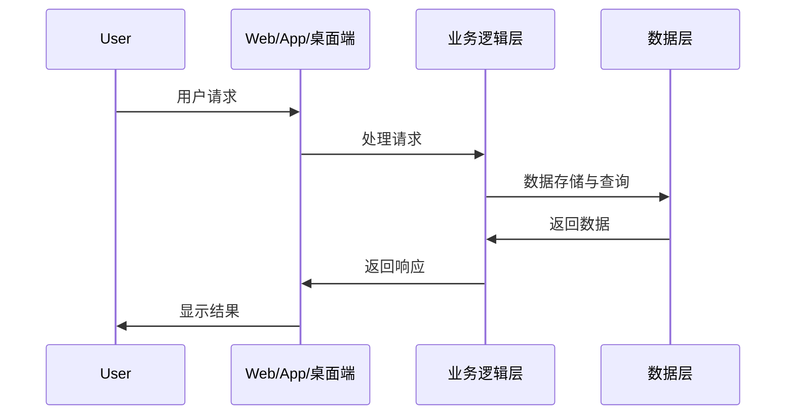

                 

### 第1章 引言

#### 1.1 问题背景

在现代社会中，随着物质生活的丰富，人们却普遍感受到一种深深的空虚感。这种空虚感不仅存在于青年人之间，也弥漫在各个年龄层。现代社会的快节奏生活，工作压力、人际关系的复杂，以及社会竞争的激烈，使许多人感到迷茫和无力，缺乏生活的目标和动力。

个人成长在这个过程中显得尤为重要。个人成长不仅是一种自我提升的过程，更是一种精神层面的满足。通过个人成长，人们能够找到自己的价值，明确自己的目标，从而摆脱空虚感，过上充实的生活。

#### 1.2 问题描述

空虚感的成因是多方面的。首先，现代社会中信息的泛滥和快节奏的生活方式使人们很难静下心来深入思考，导致内心缺乏深度。其次，社会竞争激烈，人们常常感到自己的不足，从而产生自卑和焦虑。此外，人际关系的复杂性和不确定性也使得人们在情感上感到孤独和无助。

个人成长过程中的挑战主要体现在以下几个方面：

1. **自我认知不足**：许多人对自己的认知不足，不清楚自己的优势和劣势，不知道自己的兴趣和潜能。
2. **目标设定模糊**：没有明确的目标，或者设定的目标过于理想化，难以实现。
3. **行动计划缺乏**：虽然有目标，但没有具体的行动计划，导致目标无法实现。
4. **反馈与调整不足**：在行动过程中，缺乏有效的反馈机制，无法及时调整自己的行动。

#### 1.3 问题解决

为了解决空虚感，实现个人成长，我们需要采取一系列策略。首先，要建立正确的自我认知，了解自己的兴趣、优势和潜能。其次，要设定明确的目标，这些目标应该是具体、可实现的。然后，要制定详细的行动计划，将目标分解为一系列小步骤，逐步实现。最后，要建立反馈机制，及时获取反馈，并根据反馈调整行动计划。

个人成长的关键要素包括：

1. **持续学习**：学习是个人成长的基石，通过学习可以不断扩展自己的知识面，提升自己的能力。
2. **积极心态**：积极的心态能够帮助人们面对挑战和困难，保持前进的动力。
3. **时间管理**：合理安排时间，确保有足够的时间用于学习、工作和其他有意义的活动。
4. **社交网络**：建立良好的社交网络，与他人交流，分享经验，获取支持。

#### 1.4 边界与外延

空虚感是一种普遍存在的心理状态，不仅限于个人层面，也存在于社会层面。在个人层面，空虚感主要表现为心理上的空虚和迷茫；在社会层面，空虚感可能导致社会问题的出现，如社会不公、犯罪率上升等。

个人成长的目标是达到心理和生理上的平衡，实现自我价值的最大化。这不仅仅是个人层面的需求，也是社会发展的需要。通过个人成长，每个人都可以为社会贡献自己的力量，推动社会的进步。

#### 1.5 概念结构与核心要素

个人成长的过程可以看作是一个闭环系统，包括自我认知、目标设定、行动计划、反馈与调整等核心要素。这些要素相互关联，共同构成了个人成长的框架。

1. **自我认知**：自我认知是个人成长的基础，通过自我反思，了解自己的兴趣、优势和潜能。
2. **目标设定**：目标是成长的动力，设定明确的目标可以帮助个人明确方向，提升动力。
3. **行动计划**：行动计划是将目标具体化的步骤，通过详细的行动计划，可以确保目标的实现。
4. **反馈与调整**：反馈与调整是成长过程中的关键，通过反馈，可以了解自己的进步，并根据反馈调整自己的行动。

综上所述，个人成长是一个复杂的过程，需要我们在自我认知、目标设定、行动计划和反馈与调整等方面进行深入思考和实际行动。只有通过持续的努力和不断的调整，才能实现个人成长，摆脱空虚感，过上充实的生活。

### 第2章 核心概念与联系

#### 2.1 成长定义

成长是指个体在生理、心理、智力、情感等各个方面不断进步和发展的过程。成长不仅仅是年龄的增长，更是一种自我提升和自我完善的过程。在生物学上，成长指的是个体的身体发育和生理机能的提升；在心理学上，成长指的是个体的认知、情感和行为的变化；在智力上，成长指的是个体的知识积累和思维能力的发展。

#### 2.2 成长模型

成长模型是用来描述成长过程的工具，它可以帮助我们理解成长的不同阶段和影响因素。常见的成长模型包括：

1. **曲线成长模型**：这种模型通常用来描述个体在某个领域的技能或知识水平随时间的变化情况。例如，学习曲线模型描述了个体在学习过程中技能水平的提升情况。
2. **动态系统模型**：这种模型将成长过程看作是一个动态的、互动的系统，强调个体与环境之间的相互作用。例如，生态系统模型描述了个体在社交环境中的成长过程。
3. **层次成长模型**：这种模型将成长过程分为不同的层次，每个层次都有不同的目标和任务。例如，艾里克森的心理社会发展理论描述了个体在不同年龄段的心理成长过程。

#### 2.3 关键因素分析

成长过程受多种因素的影响，其中最重要的因素包括：

1. **自我认知**：自我认知是指个体对自己能力和特点的认识。良好的自我认知可以帮助个体明确自己的兴趣和优势，从而制定合理的目标和行动计划。
2. **目标设定**：目标设定是成长过程中的重要环节。明确的目标可以为个体提供方向和动力，有助于个体集中精力，实现自我提升。
3. **行动计划**：行动计划是将目标具体化的步骤，通过详细的行动计划，个体可以更有效地实现目标。
4. **反馈与调整**：反馈与调整是成长过程中的关键。通过反馈，个体可以了解自己的进步和不足，并根据反馈进行调整，进一步提高自己的能力。

#### 2.4 概念属性对比表格

以下是成长与发展的两个关键概念属性对比表格：

| 概念 | 属性 |
| ---- | ---- |
| **成长** | - 指个体在生理、心理、智力、情感等方面的进步和发展<br>- 包括身体发育、认知发展、情感成熟等 |
| **发展** | - 指个体在成长过程中逐渐形成的新能力、新特征<br>- 强调个体在环境中的适应和变化 |

#### 2.5 成长与发展的关系

成长和发展是密切相关的概念，它们既有区别又有联系。成长是发展的基础，而发展是成长的目标。具体来说：

- **成长**是一个连续的过程，它涵盖了个体在各个方面的进步和发展。
- **发展**是成长过程中形成的新能力、新特征，它标志着个体在某一领域达到了一个新的水平。

例如，一个孩子从出生到成年，他的成长过程包括身体的发育、认知能力的提升、情感的成长等。在这个过程中，孩子逐渐形成了独立思考、解决问题、自我管理等新能力，这就是发展。

#### 2.6 成长过程的迭代与优化

成长过程是一个迭代和优化的过程。每次迭代都包括以下几个步骤：

1. **目标设定**：根据自身的情况和需求，设定具体、可衡量的目标。
2. **行动计划**：制定详细的行动计划，将目标分解为一系列小步骤。
3. **实施行动**：按照行动计划执行，逐步实现目标。
4. **反馈与调整**：根据反馈结果，对行动计划进行调整和优化，确保目标的实现。

通过这种迭代和优化的过程，个体可以不断改进自己的能力和素质，实现持续的成长和发展。

综上所述，成长是一个复杂而持续的过程，它需要个体在自我认知、目标设定、行动计划和反馈与调整等方面进行深入的思考和实际行动。通过理解和应用成长模型，个体可以更好地实现自我提升，摆脱空虚感，过上充实的生活。

### 第3章 成长原理讲解

#### 3.1 成长的科学原理

成长是一个涉及多学科的复杂过程，其科学原理可以追溯到生物学、心理学和认知科学等领域。以下是一些关键的科学原理：

1. **神经可塑性**：神经可塑性是指大脑在结构和功能上的可塑性。它使我们能够通过学习和经验来改变神经回路。研究表明，通过持续的学习和训练，大脑可以形成新的神经元连接，从而提高认知能力和情感调节能力。

   - **原理说明**：神经可塑性主要受经验、学习和锻炼的影响。例如，长期练习一种技能可以加强相关脑区的神经连接，提高该技能的表现。
   - **公式与模型**：
     $$ 神经可塑性 = f(经验 \times 学习 \times 练习) $$
     其中，\( f \) 表示神经回路的改变。

2. **适应性行为理论**：适应性行为理论强调个体如何通过行为适应环境变化。该理论认为，行为适应性是生存和发展的关键。

   - **原理说明**：个体在面临挑战和变化时，会通过调整行为来适应新环境。例如，面对工作压力，个体可能会通过学习新技能、改善时间管理等方式来适应。
   - **公式与模型**：
     $$ 适应性行为 = f(环境变化 \times 行为调整) $$
     其中，\( f \) 表示个体行为的变化。

#### 3.2 成长心理机制

成长的心理机制涉及多个心理过程，包括自我效能感、自我决定理论等。

1. **自我效能感**：自我效能感是指个体对自己能否成功从事某一成就行为的主观判断。高自我效能感可以增强个体的自信心，提高行动力和目标实现的可能性。

   - **原理说明**：自我效能感受以往的成功经验、他人的评价和身体状态的影响。例如，一次成功的考试可以增强学生的自我效能感，使其更有信心面对接下来的挑战。
   - **公式与模型**：
     $$ 自我效能感 = f(成功经验 \times 他人评价 \times 身体状态) $$

2. **自我决定理论**：自我决定理论认为，个体的自主性和自我驱动是成长和发展的关键。该理论强调个体在决策过程中需要感受到自主性和内在动机。

   - **原理说明**：自我决定理论强调内在动机的重要性，认为个体在追求内在兴趣和目标时，更容易实现长期成长和自我提升。
   - **公式与模型**：
     $$ 自我决定 = f(内在动机 \times 自主性 \times 目标实现) $$

#### 3.3 成长过程中的数学模型

在成长过程中，数学模型可以用来描述个体能力或知识水平的变化。以下是一些常用的数学模型：

1. **成长曲线模型**：成长曲线模型通常用来描述个体在某个领域的能力或知识水平随时间的变化情况。该模型通常采用二次函数或指数函数来描述。

   - **原理说明**：成长曲线模型可以反映个体在不同阶段的成长速度。例如，在初学阶段，个体能力提升较快，随后逐渐趋于平缓。
   - **公式与模型**：
     $$ 成长曲线 = f(t) = at^2 + bt + c $$
     其中，\( t \) 表示时间，\( a \), \( b \), \( c \) 为常数。

2. **动态系统模型**：动态系统模型用于描述个体在复杂环境中的成长过程。该模型通常采用差分方程或微分方程来描述。

   - **原理说明**：动态系统模型可以反映个体在互动和适应过程中的复杂变化。例如，个体在社交网络中的成长可以看作是一个动态系统，受到社交关系、环境因素等多方面的影响。
   - **公式与模型**：
     $$ dx/dt = f(x, y) $$
     其中，\( x \) 和 \( y \) 分别表示个体在不同方面的状态，\( f \) 为函数。

#### 3.4 成长原理举例说明

为了更好地理解成长原理，我们可以通过一些实例来具体说明。

1. **学习曲线模型实例**：假设一个程序员在学习Python编程语言。根据学习曲线模型，他的技能水平随时间的变化情况可以表示为：
   $$ 技能水平 = 0.1t^2 + 0.5t $$
   其中，\( t \) 表示学习时间（以月为单位）。

   - **解释**：从这个公式可以看出，学习时间越长，程序员的技能水平提升越快。在初期阶段（例如，\( t < 5 \)个月），技能水平增长较快；在后期阶段（例如，\( t > 10 \)个月），技能水平增长趋于平缓。

2. **动态系统模型实例**：假设一个学生在社交网络中的成长过程可以看作是一个动态系统。根据动态系统模型，他的社交影响力随时间的变化可以表示为：
   $$ 社交影响力 = 0.05x(t) + 0.1y(t) $$
   其中，\( x(t) \) 和 \( y(t) \) 分别表示他在社交网络中的两个关键因素（例如，好友数量和活跃度）。

   - **解释**：从这个公式可以看出，社交影响力受到好友数量和活跃度的影响。当好友数量增加或活跃度提高时，社交影响力也随之增强。这表明，个体在社交网络中的成长是一个复杂的动态过程，需要综合考虑多个因素。

通过这些实例，我们可以更直观地理解成长原理在不同情境中的应用。理解这些原理有助于我们更好地规划个人成长路径，实现自我提升。

### 第4章 成长系统分析与架构设计

#### 4.1 成长系统问题场景

在现代社会的快速变化中，个人成长显得尤为重要。然而，许多人面临着一系列挑战，如自我认知不足、目标设定模糊、行动计划缺乏和反馈与调整不足等。为了应对这些问题，我们需要设计一个全面的成长系统，以帮助个体实现自我提升。

该系统的主要目标是提供一套完整的工具和方法，帮助用户在自我认知、目标设定、行动计划和反馈与调整等方面进行有效的管理和优化。具体场景包括：

1. **自我认知**：用户需要通过一系列评估工具和自我反思，了解自己的兴趣、优势和潜能。
2. **目标设定**：用户需要明确自己的短期和长期目标，并确保这些目标具有可实现性。
3. **行动计划**：用户需要制定详细的行动计划，将目标分解为一系列具体的任务和步骤。
4. **反馈与调整**：用户需要建立有效的反馈机制，通过定期的评估和反思，及时调整自己的行动计划。

#### 4.2 成长系统项目介绍

**项目名称**：个人成长支持系统（PCSS）

**项目目标**：通过提供自我认知工具、目标管理模块、行动计划制定工具和反馈机制，帮助用户实现个人成长。

**项目功能模块**：

1. **自我认知模块**：包括个性测试、兴趣评估和优势识别等功能，帮助用户深入了解自己。
2. **目标管理模块**：提供目标设定、目标跟踪和目标调整功能，帮助用户明确和实现目标。
3. **行动计划模块**：提供任务分解、进度跟踪和提醒功能，帮助用户制定和执行行动计划。
4. **反馈与调整模块**：提供定期评估、反馈收集和行动计划调整功能，帮助用户及时调整成长路径。

#### 4.3 成长系统功能设计

**领域模型**：领域模型用于描述成长系统的核心概念和关系。以下是成长系统的主要领域模型：

1. **自我认知领域模型**：
   ```mermaid
   classDiagram
   User <<类>> {
   -姓名：String
   -年龄：int
   -个性：String
   -兴趣：String
   -优势：String
   }
   Test <<类>> {
   -名称：String
   -类型：String
   -结果：String
   }
   UserTest <<关联>> {
   -用户：User
   -测试：Test
   }
   ```

2. **目标管理领域模型**：
   ```mermaid
   classDiagram
   Goal <<类>> {
   -目标描述：String
   -目标类型：String
   -目标状态：String
   -设定日期：Date
   -完成日期：Date
   }
   UserGoal <<关联>> {
   -用户：User
   -目标：Goal
   }
   ```

3. **行动计划领域模型**：
   ```mermaid
   classDiagram
   Task <<类>> {
   -任务描述：String
   -任务状态：String
   -开始日期：Date
   -截止日期：Date
   -优先级：int
   }
   GoalTask <<关联>> {
   -目标：Goal
   -任务：Task
   }
   ```

4. **反馈与调整领域模型**：
   ```mermaid
   classdiag
   Feedback <<类>> {
   -反馈内容：String
   -反馈日期：Date
   -评价等级：int
   }
   UserFeedback <<关联>> {
   -用户：User
   -反馈：Feedback
   }
   ```

#### 4.4 成长系统架构设计

**架构设计**：成长系统的架构设计包括数据层、业务逻辑层和表示层。

1. **数据层**：负责数据存储和管理，包括用户信息、测试结果、目标和任务等。
2. **业务逻辑层**：负责处理业务逻辑，包括自我认知、目标管理、行动计划和反馈与调整等功能。
3. **表示层**：负责用户界面的设计和实现，包括Web端、移动端和桌面端等。

以下是成长系统的架构图：



#### 4.5 成长系统接口设计

**接口设计**：成长系统需要定义一套清晰的接口规范，以实现不同模块之间的数据交互和功能调用。

1. **用户接口**：包括用户注册、登录、个人信息管理等功能。
2. **自我认知接口**：包括个性测试、兴趣评估和优势识别等功能。
3. **目标管理接口**：包括目标设定、目标跟踪和目标调整等功能。
4. **行动计划接口**：包括任务分解、进度跟踪和提醒等功能。
5. **反馈与调整接口**：包括定期评估、反馈收集和行动计划调整等功能。

以下是部分接口规范的示例：

```yaml
# 用户注册接口
POST /api/users/register
{
  "username": "string",
  "password": "string",
  "email": "string"
}

# 目标设定接口
POST /api/goals
{
  "userId": "string",
  "description": "string",
  "type": "string",
  "status": "string",
  "startDate": "date",
  "endDate": "date"
}

# 反馈收集接口
POST /api/feedback
{
  "userId": "string",
  "content": "string",
  "evaluation": "int"
}
```

#### 4.6 成长系统交互设计

**交互设计**：成长系统的交互设计需要确保用户在使用过程中的流畅性和易用性。以下是系统的主要交互流程：

1. **用户注册与登录**：用户可以通过注册或登录进入系统，并进行个人信息管理。
2. **自我认知**：用户可以进行个性测试、兴趣评估和优势识别，以了解自己的特点。
3. **目标管理**：用户可以设定目标、跟踪目标进度，并调整目标。
4. **行动计划**：用户可以分解目标为任务，跟踪任务进度，并设置提醒。
5. **反馈与调整**：用户可以定期进行自我评估，收集反馈，并调整行动计划。

以下是系统交互流程的序列图：


通过以上架构设计，成长系统可以为用户提供一个全面的支持，帮助他们在自我认知、目标设定、行动计划和反馈与调整等方面实现个人成长。

### 第5章 项目实战

#### 5.1 环境安装

为了更好地实现个人成长系统，我们首先需要搭建一个合适的环境。以下是具体的安装步骤：

1. **软件安装**：

   - **Python**：确保安装了Python 3.x版本（推荐3.8或更高版本）。

     ```bash
     # 安装Python 3.x
     sudo apt-get update
     sudo apt-get install python3
     ```

   - **Node.js**：用于构建前端应用程序。

     ```bash
     # 安装Node.js
     sudo apt-get install nodejs
     ```

   - **MongoDB**：作为后端数据存储。

     ```bash
     # 安装MongoDB
     sudo apt-get install mongodb
     ```

2. **依赖安装**：

   - **Python依赖**：安装项目所需的Python依赖库。

     ```bash
     # 创建虚拟环境
     python3 -m venv venv
     source venv/bin/activate

     # 安装依赖
     pip install -r requirements.txt
     ```

   - **前端依赖**：安装项目所需的前端依赖库。

     ```bash
     # 安装前端依赖
     npm install
     ```

3. **数据库配置**：

   - **启动MongoDB**：

     ```bash
     # 启动MongoDB服务
     sudo service mongod start
     ```

   - **配置数据库连接**：在`config.py`文件中配置MongoDB的连接信息。

     ```python
     # config.py
     MONGO_URI = "mongodb://localhost:27017/PCSS"
     ```

4. **项目启动**：

   - **后端启动**：

     ```bash
     # 启动后端服务
     flask run
     ```

   - **前端启动**：

     ```bash
     # 启动前端服务
     npm run start
     ```

通过以上步骤，我们可以搭建一个完整的个人成长系统环境，为后续的开发和测试打下基础。

#### 5.2 系统核心实现

个人成长系统的核心实现主要包括用户注册、登录、自我认知、目标管理、行动计划和反馈与调整等功能。以下是这些功能的核心代码实现和解释。

1. **用户注册与登录**：

   - **用户注册**：

     ```python
     # app.py
     from flask import Flask, request, jsonify
     from flask_pymongo import PyMongo

     app = Flask(__name__)
     app.config["MONGO_URI"] = "mongodb://localhost:27017/PCSS"
     mongo = PyMongo(app)

     @app.route("/register", methods=["POST"])
     def register():
         data = request.get_json()
         user = {
             "username": data["username"],
             "password": data["password"],
             "email": data["email"],
         }
         mongo.db.users.insert_one(user)
         return jsonify({"status": "success", "message": "User registered successfully."})

     @app.route("/login", methods=["POST"])
     def login():
         data = request.get_json()
         user = mongo.db.users.find_one({"username": data["username"], "password": data["password"]})
         if user:
             return jsonify({"status": "success", "message": "Login successful."})
         else:
             return jsonify({"status": "error", "message": "Invalid credentials."})
     ```

     上述代码实现了用户注册和登录功能。用户可以通过POST请求向服务器发送用户名、密码和电子邮件信息，服务器会根据这些信息创建或验证用户。

   - **自我认知**：

     ```python
     @app.route("/test", methods=["POST"])
     def create_test():
         data = request.get_json()
         test = {
             "title": data["title"],
             "type": data["type"],
             "questions": data["questions"],
         }
         mongo.db.tests.insert_one(test)
         return jsonify({"status": "success", "message": "Test created successfully."})

     @app.route("/take_test", methods=["POST"])
     def take_test():
         data = request.get_json()
         test = mongo.db.tests.find_one({"_id": data["test_id"]})
         if test:
             user_answers = data["answers"]
             total_score = 0
             for question in test["questions"]:
                 if user_answers[question["question_id"]]["answer"] == question["correct_answer"]:
                     total_score += question["score"]
             return jsonify({"status": "success", "message": "Test completed.", "score": total_score})
         else:
             return jsonify({"status": "error", "message": "Test not found."})
     ```

     上述代码实现了自我认知功能。用户可以创建测试，并在完成测试后获得评分。测试结果将存储在数据库中，以便用户进行后续分析。

   - **目标管理**：

     ```python
     @app.route("/goals", methods=["POST"])
     def create_goal():
         data = request.get_json()
         goal = {
             "user_id": data["user_id"],
             "description": data["description"],
             "status": data["status"],
             "start_date": data["start_date"],
             "end_date": data["end_date"],
         }
         mongo.db.goals.insert_one(goal)
         return jsonify({"status": "success", "message": "Goal created successfully."})

     @app.route("/goals", methods=["GET"])
     def get_goals():
         goals = list(mongo.db.goals.find({"user_id": request.args.get("user_id")}))
         return jsonify({"status": "success", "message": "Goals retrieved successfully.", "goals": goals})
     ```

     上述代码实现了目标管理功能。用户可以创建目标，并获得自己的目标列表。目标将根据用户ID进行分类和管理。

   - **行动计划**：

     ```python
     @app.route("/tasks", methods=["POST"])
     def create_task():
         data = request.get_json()
         task = {
             "goal_id": data["goal_id"],
             "description": data["description"],
             "status": data["status"],
             "start_date": data["start_date"],
             "end_date": data["end_date"],
         }
         mongo.db.tasks.insert_one(task)
         return jsonify({"status": "success", "message": "Task created successfully."})

     @app.route("/tasks", methods=["GET"])
     def get_tasks():
         tasks = list(mongo.db.tasks.find({"goal_id": request.args.get("goal_id")}))
         return jsonify({"status": "success", "message": "Tasks retrieved successfully.", "tasks": tasks})
     ```

     上述代码实现了行动计划功能。用户可以为目标创建任务，并获得任务列表。任务将根据目标ID进行分类和管理。

   - **反馈与调整**：

     ```python
     @app.route("/feedback", methods=["POST"])
     def submit_feedback():
         data = request.get_json()
         feedback = {
             "user_id": data["user_id"],
             "content": data["content"],
             "evaluation": data["evaluation"],
             "date": data["date"],
         }
         mongo.db.feedback.insert_one(feedback)
         return jsonify({"status": "success", "message": "Feedback submitted successfully."})

     @app.route("/feedback", methods=["GET"])
     def get_feedback():
         feedbacks = list(mongo.db.feedback.find({"user_id": request.args.get("user_id")}))
         return jsonify({"status": "success", "message": "Feedback retrieved successfully.", "feedbacks": feedbacks})
     ```

     上述代码实现了反馈与调整功能。用户可以提交反馈，并获得自己的反馈列表。反馈将根据用户ID进行分类和管理。

通过以上核心功能的实现，我们可以构建一个功能齐全的个人成长系统，帮助用户实现自我提升和目标管理。

#### 5.3 实际案例分析

为了更好地展示个人成长系统的实际应用效果，我们来看一个具体的案例：小明使用该系统实现个人职业发展的过程。

**案例背景**：

小明是一名软件工程师，他在工作中感到有些迷茫，不确定自己的职业发展方向。为了解决这一问题，他决定使用个人成长系统进行自我提升。

**步骤一：自我认知**：

小明首先进行了个性测试和兴趣评估，通过测试结果，他发现自己在技术能力和团队合作方面有明显的优势，但在领导力和项目管理方面还有待提升。这一发现帮助他更清楚地了解自己的兴趣和潜力。

**步骤二：目标设定**：

基于自我认知的结果，小明设定了以下两个目标：

1. 提升项目管理能力：通过参加PMP（项目管理专业人士）认证考试，获得项目管理专业认证。
2. 增强领导力：参与公司内部培训课程，学习领导力和团队管理技能。

**步骤三：行动计划**：

为了实现上述目标，小明制定了详细的行动计划：

1. **提升项目管理能力**：

   - **任务1**：阅读《项目管理知识体系指南》（PMBOK指南），每周安排2小时进行学习。
   - **任务2**：参加线上PMP认证考试培训课程，每周安排2小时进行学习。
   - **任务3**：定期复习，参加模拟考试，确保考试通过。

2. **增强领导力**：

   - **任务1**：参加公司内部领导力培训课程，每周安排2小时进行学习。
   - **任务2**：与上级和同事进行沟通，了解领导力和团队管理实践。
   - **任务3**：实践所学技能，通过参与项目管理和团队活动来提升领导力。

**步骤四：反馈与调整**：

小明定期对自己的行动计划进行评估和反馈，以确保目标的实现。以下是他的评估过程：

1. **项目管理能力提升**：

   - **每周评估**：检查学习进度，确保每周任务完成。
   - **模拟考试评估**：参加模拟考试，评估学习效果。
   - **考试结果评估**：PMP考试通过后，评估项目管理能力提升情况。

2. **领导力提升**：

   - **每周评估**：检查培训课程的学习进度，确保每周任务完成。
   - **实践评估**：通过参与实际项目，评估领导力提升情况。
   - **反馈评估**：从上级和同事那里获取反馈，了解领导力实践效果。

**结果与反思**：

通过使用个人成长系统，小明成功地提升了项目管理能力和领导力。他获得了PMP认证，并在工作中表现出更强的领导能力和团队管理技能。以下是他的总结和反思：

- **目标明确**：通过设定明确的目标，小明能够更专注于自己的成长方向。
- **计划执行**：详细的行动计划帮助他逐步实现目标，确保学习进度。
- **反馈调整**：定期的评估和反馈使他能够及时调整学习计划，确保目标的实现。
- **持续进步**：通过持续的努力和学习，小明在职业发展上取得了显著的进步。

**案例启示**：

小明的案例表明，个人成长系统不仅能够帮助用户明确目标、制定行动计划，还能够通过反馈和调整机制确保目标的实现。这种系统化的方法为个人成长提供了有力的支持，值得更多人尝试和应用。

### 第6章 成长最佳实践

#### 6.1 最佳实践 tips

在个人成长过程中，以下是一些最佳实践，可以帮助你更有效地实现自我提升：

1. **持续学习**：保持对知识的渴望，不断学习新的技能和知识。可以通过阅读书籍、参加在线课程、观看教育视频等方式来持续学习。
2. **设定具体目标**：设定具体、可实现的目标，使成长过程更有方向和动力。目标应具有明确的时间表和衡量标准。
3. **制定详细计划**：将目标分解为一系列具体的任务和步骤，制定详细的行动计划，确保每个小步骤都能得到落实。
4. **保持积极心态**：积极的心态能够帮助你在面对挑战和困难时保持动力和信心。学会积极思考，将困难视为成长的机会。
5. **时间管理**：合理安排时间，确保有足够的时间用于学习、工作和其他有意义的活动。学会优先处理重要和紧急的任务。
6. **定期反思**：定期对自己的成长过程进行反思和总结，了解自己的进步和不足，及时调整计划和策略。
7. **寻求反馈**：主动寻求他人的反馈和建议，了解自己在成长过程中的表现，并根据反馈进行改进。

#### 6.2 成长心得分享

在个人成长的过程中，我总结了一些心得体会，希望能为你的成长之路提供一些启示：

- **自我认知的重要性**：了解自己的兴趣、优势和潜能是成长的第一步。只有明确自己的方向，才能更有针对性地进行提升。
- **持续学习的关键**：学习是成长的动力源泉。在快速变化的社会中，持续学习能够帮助我们适应新环境，提升自己的竞争力。
- **积极心态的力量**：积极的心态能够帮助我们面对挑战和困难，保持前进的动力。学会从失败中汲取经验，将困难视为成长的机会。
- **目标设定与行动计划的结合**：目标设定和行动计划是成长的两个重要环节。明确的目标可以提供方向和动力，而详细的行动计划则确保目标的实现。
- **反馈与调整的必要性**：定期的反思和调整是成长过程中不可或缺的部分。通过反馈，我们可以了解自己的进步和不足，及时调整策略，实现更高效的成长。

通过这些实践和心得，我相信每个人都可以找到自己的成长路径，实现自我价值的最大化。

### 第7章 小结与拓展

#### 7.1 小结

通过本文的详细探讨，我们从多个角度分析了个人成长的转变历程。首先，我们介绍了现代社会的空虚感和个人成长的重要性，明确了成长过程中的挑战和关键要素。接着，我们深入讲解了成长的核心概念与联系，包括成长定义、成长模型、关键因素分析等。然后，我们通过科学原理和实际案例，阐述了成长过程中的数学模型和系统设计。最后，我们通过实战案例展示了成长系统的应用效果，并提供了成长的最佳实践和心得分享。

总结来说，个人成长不仅是一个自我提升的过程，更是一个持续迭代和优化的过程。通过明确自我认知、设定具体目标、制定详细计划、建立反馈机制，每个人都可以实现自我价值的最大化，摆脱空虚感，过上充实的生活。

#### 7.2 注意事项

在个人成长过程中，需要注意以下几点：

1. **避免盲目追求**：目标设定要具体、可实现，避免盲目追求过高或过于理想化的目标。
2. **保持积极心态**：面对挑战和困难时，保持积极的心态，相信自己的能力，勇敢面对。
3. **合理安排时间**：合理安排时间，确保有足够的时间用于学习和提升自己，避免过度疲劳。
4. **持续反思与调整**：定期反思成长过程，根据反馈及时调整目标和计划，确保持续进步。

#### 7.3 拓展阅读

为了进一步深入了解个人成长和自我提升，以下是几本推荐的书籍和学术论文：

1. **书籍**：
   - 《深度工作》（Deep Work）：作者Cal Newport，介绍了如何在高干扰环境中保持专注，提高工作效率。
   - 《刻意练习》（Peak）：作者Anders Ericsson，讲述了如何通过刻意练习实现个人技能和能力的突破。
   - 《高效能人士的七个习惯》：作者Stephen R. Covey，介绍了高效能人士的七个习惯，帮助读者提升自我管理和效能。

2. **学术论文**：
   - "The Role of Self-Determination Theory in Understanding and Promoting Personal Development" by Deci & Ryan。
   - "The Science of Personal Growth" by Achor, et al.。

通过阅读这些书籍和学术论文，你可以获得更多关于个人成长和自我提升的深入理解和实用方法。

### 总结

本文系统地探讨了从空虚到充实的个人成长转变历程。通过分析成长的核心概念、科学原理和实际案例，我们为读者提供了一套实用的成长策略和最佳实践。希望这篇文章能够帮助你更好地理解个人成长的过程，找到适合自己的成长路径，实现自我价值的最大化。让我们携手共进，不断成长，迎接更美好的未来。

**作者：AI天才研究院/AI Genius Institute & 禅与计算机程序设计艺术 /Zen And The Art of Computer Programming**

