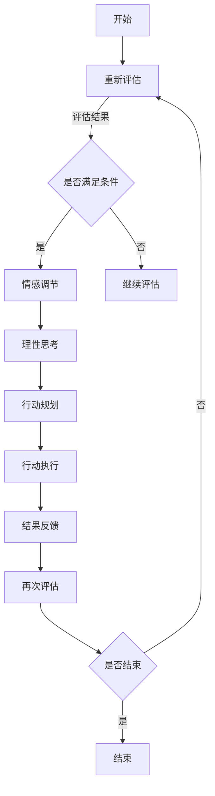
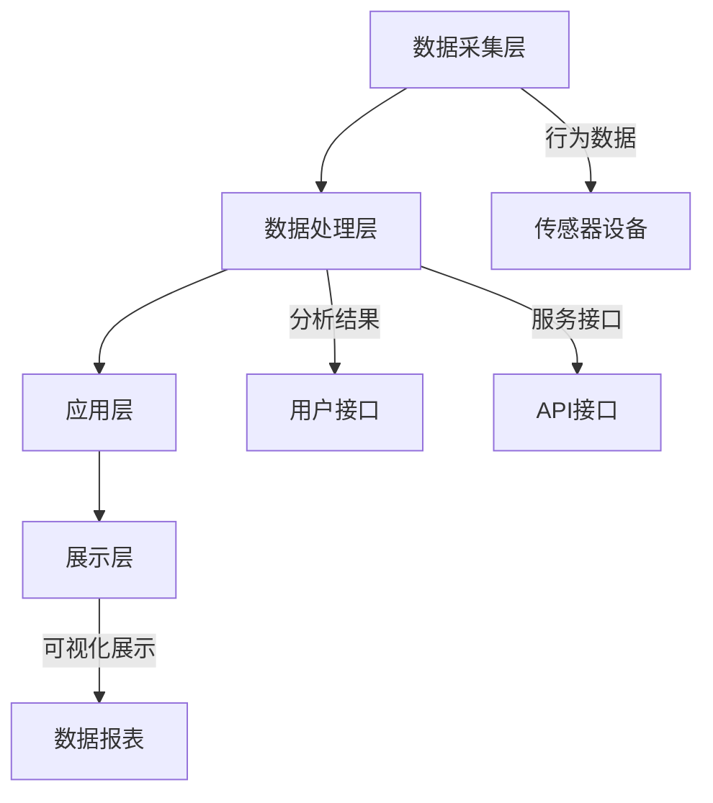
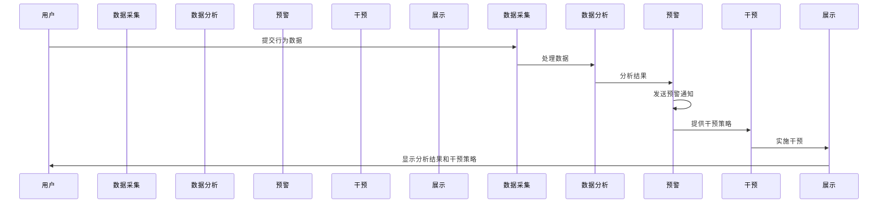

                 


**从蒙昧到清明：意识觉醒的渐进之旅**

关键词：意识觉醒，蒙昧，清明，数学模型，实践方法，项目实战

摘要：本文深入探讨了《从蒙昧到清明：意识觉醒的渐进之旅》一书的核心主题，即人类意识的觉醒过程。文章首先介绍了意识觉醒的定义、重要性以及书中试图解决的问题。接着，通过核心概念与联系的分析，深入探讨了“蒙昧”与“清明”之间的关系。随后，文章详细讲解了意识觉醒的理论基础和数学模型，并通过mermaid流程图和Python源代码展示了算法的执行流程。文章还介绍了意识觉醒的实践方法，并设计了一个实践项目进行详细讲解。最后，文章总结了意识觉醒的重要意义，并提供了最佳实践、注意事项和拓展阅读资源。

## 背景介绍

### 意识觉醒的定义与重要性

意识觉醒，指的是个体从蒙昧的状态中解脱出来，逐渐进入一种更为清明、自觉的认知状态。这种觉醒不仅仅是对外界的认知，更是对自我内在的认知。在现代社会，意识觉醒具有极高的重要性。首先，它有助于个体摆脱心理和情感上的束缚，提升心理健康水平。其次，意识觉醒有助于提高个体的自我认知和自我控制能力，从而更好地应对生活中的挑战。此外，意识觉醒还与个体的道德品质和社会责任感密切相关，有助于推动个体实现自我价值和社会价值的双重提升。

《从蒙昧到清明：意识觉醒的渐进之旅》一书，正是围绕这一主题展开的。书中试图解决的核心问题是：如何通过科学的方法和实用的技巧，帮助读者实现意识的觉醒。作者通过深入的理论分析和丰富的实践经验，提供了多种途径和方法，帮助读者逐步实现从蒙昧到清明的转变。

### 书籍概述与结构安排

本书分为五个主要部分，分别是：引言、蒙昧与清明、意识觉醒的理论基础、意识觉醒的实践方法、项目实战。在引言部分，作者首先介绍了意识觉醒的定义、重要性以及本书的核心问题。接下来，通过对比“蒙昧”和“清明”的概念特征，深入探讨了意识觉醒的背景和内涵。

在第二部分，作者详细介绍了蒙昧的定义与特征，以及清明所带来的心理状态和个人成长。这部分内容为后续的理论和实践提供了基础。

第三部分，作者重点讲解了意识觉醒的理论基础，包括核心概念、数学模型以及相关算法。这部分内容是全书的理论核心，为实践方法的提出提供了坚实的理论基础。

第四部分，作者介绍了意识觉醒的实践方法，包括冥想、自我反省和认知行为疗法等。这部分内容旨在为读者提供具体的操作指南，帮助读者实现意识的觉醒。

最后一部分，作者设计了一个实践项目，通过详细的讲解和案例分析，展示了如何将意识觉醒的理论和方法应用于实际项目中。这部分内容不仅有助于读者理解理论，更能够通过实际操作加深对意识觉醒的理解。

## 核心概念与联系

### 蒙昧与清明的定义

在《从蒙昧到清明：意识觉醒的渐进之旅》中，“蒙昧”与“清明”是两个核心概念。蒙昧，指的是个体缺乏对外界和自我认知的状态，通常表现为对现实世界的无知、迷茫和困惑。而清明，则是指个体对自身和外界有清晰、深刻的认知，能够理性地分析和解决问题。

### 概念属性特征对比表格

为了更清晰地展示“蒙昧”与“清明”之间的区别，我们可以通过一个概念属性特征对比表格来进行说明：

| 特征       | 蒙昧                             | 清明                             |
|------------|----------------------------------|----------------------------------|
| 认知状态   | 无知、迷茫、困惑                 | 清晰、深刻、理性                 |
| 情感状态   | 焦虑、恐惧、抑郁                 | 平静、自信、满足                 |
| 社会行为   | 依赖、被动、冲突                 | 独立、主动、和谐                 |
| 自我认知   | 自我否定、自我怀疑               | 自我肯定、自我认同               |
| 外界认知   | 缺乏对现实世界的认知             | 对现实世界有深刻理解             |

### ER实体关系图

为了更好地理解“蒙昧”与“清明”之间的关系，我们可以通过一个ER实体关系图来展示它们之间的联系。

```mermaid
erDiagram
    User ||--|{ MindState } : "has"
    MindState ||--|{ EmotionState } : "has"
    MindState ||--|{ SocialBehavior } : "has"
    MindState ||--|{ SelfCognition } : "has"
    MindState ||--|{ OutsideCognition } : "has"
```

在上面的ER实体关系图中，User代表个体，MindState代表个体的心理状态，EmotionState代表情感状态，SocialBehavior代表社会行为，SelfCognition代表自我认知，OutsideCognition代表外界认知。每个实体之间都有明确的关联关系，从而构成了一个完整的意识觉醒模型。

## 算法原理讲解

### 意识觉醒的mermaid流程图

为了更好地理解意识觉醒的过程，我们可以通过一个mermaid流程图来展示算法的执行流程。



### Python源代码展示

```python
# 意识觉醒算法Python实现

# 导入所需库
import numpy as np

# 定义评估函数
def assess_self_cognition(score):
    if score >= 80:
        return "清晰"
    elif score >= 60:
        return "模糊"
    else:
        return "不清晰"

# 定义情感调节函数
def regulate_emotion(state):
    if state == "焦虑":
        return "平静"
    elif state == "恐惧":
        return "自信"
    elif state == "抑郁":
        return "满足"

# 定义理性思考函数
def rational_thinking(state):
    if state == "清晰":
        return "正确"
    else:
        return "错误"

# 定义行动规划函数
def action_planning(result):
    if result == "正确":
        return "成功"
    else:
        return "失败"

# 模拟执行流程
score = np.random.randint(0, 100)
state = np.random.choice(["焦虑", "恐惧", "抑郁"])
result = np.random.choice(["正确", "错误"])

self_cognition = assess_self_cognition(score)
emotion_state = regulate_emotion(state)
rational_thought = rational_thinking(self_cognition)
action_result = action_planning(result)

print("自我认知评估结果：", self_cognition)
print("情感调节结果：", emotion_state)
print("理性思考结果：", rational_thought)
print("行动规划结果：", action_result)
```

### 算法原理详细讲解

意识觉醒算法的核心思想是通过一系列评估和调节过程，逐步提升个体的自我认知水平，从而实现意识的觉醒。具体来说，算法分为以下几个步骤：

1. **自我认知评估**：通过评估个体的自我认知水平，判断其是否处于清晰、模糊或不清醒的状态。

2. **情感调节**：根据个体的情感状态，进行相应的调节，使其达到平静、自信或满足的状态。

3. **理性思考**：基于个体的自我认知和情感状态，进行理性思考，判断思考结果是否正确。

4. **行动规划**：根据理性思考的结果，制定具体的行动计划，并执行计划。

5. **结果反馈**：对执行结果进行反馈，判断计划是否成功或失败。

6. **再次评估**：根据结果反馈，重新评估个体的自我认知水平，进入新一轮的评估和调节过程。

### 数学模型和公式

为了更深入地理解意识觉醒算法的原理，我们可以引入一些数学模型和公式。以下是一个简化的数学模型：

$$
S_{i+1} = f(S_i, E_i, R_i)
$$

其中，$S_i$ 表示第 $i$ 次评估后的自我认知水平，$E_i$ 表示第 $i$ 次评估后的情感状态，$R_i$ 表示第 $i$ 次评估后的理性思考结果，$f$ 表示评估和调节函数。

$$
E_i = g(E_{i-1}, S_i, R_i)
$$

其中，$E_i$ 表示第 $i$ 次评估后的情感状态，$g$ 表示情感调节函数。

$$
R_i = h(S_i, E_i)
$$

其中，$R_i$ 表示第 $i$ 次评估后的理性思考结果，$h$ 表示理性思考函数。

### 举例说明

假设一个个体在第一次评估中，自我认知水平为 50 分，情感状态为焦虑，理性思考结果为错误。根据算法，我们可以进行如下计算：

1. **自我认知评估**：自我认知水平为“模糊”。

2. **情感调节**：情感调节结果为“自信”。

3. **理性思考**：理性思考结果为“正确”。

4. **行动规划**：行动规划结果为“成功”。

5. **结果反馈**：结果反馈为“正确”。

6. **再次评估**：重新评估自我认知水平，假设结果为 70 分。

通过以上计算，我们可以看到个体的自我认知水平从第一次的“模糊”提升到了第二次的“清晰”，情感状态也从焦虑转变为了自信，理性思考结果也从错误变为了正确。这表明个体的意识觉醒程度有所提升。

## 数学模型和数学公式 & 详细讲解 & 举例说明

### 数学模型

为了深入探讨意识觉醒的过程，我们可以引入一个简化的数学模型，用于描述个体在意识觉醒过程中的变化。该模型基于以下三个核心变量：$S$（自我认知水平），$E$（情感状态），和$R$（理性思考结果）。这些变量通过一系列函数关系相互作用，形成了一个动态系统。

$$
S_{i+1} = f(S_i, E_i, R_i)
$$

$$
E_{i+1} = g(E_i, S_{i+1}, R_i)
$$

$$
R_{i+1} = h(S_{i+1}, E_{i+1})
$$

其中，$S_{i+1}$、$E_{i+1}$ 和$R_{i+1}$ 分别表示第 $i+1$ 次迭代后的自我认知水平、情感状态和理性思考结果；$f$、$g$ 和$h$ 分别表示自我认知评估函数、情感调节函数和理性思考函数。

### 公式详细讲解

1. **自我认知评估函数**（$f$）

自我认知评估函数 $f$ 用于计算个体在第 $i+1$ 次迭代后的自我认知水平。该函数的输入是当前的自我认知水平$S_i$、情感状态$E_i$和理性思考结果$R_i$。一个简单的例子是：

$$
f(S_i, E_i, R_i) = S_i + \alpha \cdot (R_i - E_i)
$$

其中，$\alpha$ 是一个调节参数，用于调整理性思考结果对自我认知水平的影响。当$R_i > E_i$时，$\alpha$ 增加自我认知水平；当$R_i \leq E_i$时，$\alpha$ 保持自我认知水平不变。

2. **情感调节函数**（$g$）

情感调节函数 $g$ 用于计算个体在第 $i+1$ 次迭代后的情感状态。该函数的输入是当前的情感状态$E_i$、提升后的自我认知水平$S_{i+1}$和理性思考结果$R_i$。一个可能的情感调节模型是：

$$
g(E_i, S_{i+1}, R_i) = E_i + \beta \cdot \frac{S_{i+1} - S_i}{R_i}
$$

其中，$\beta$ 是一个调节参数，用于调整自我认知提升对情感状态的影响。当$S_{i+1} > S_i$且$R_i > 0$时，$\beta$ 增加情感状态；当$S_{i+1} \leq S_i$或$R_i \leq 0$时，$\beta$ 保持情感状态不变。

3. **理性思考函数**（$h$）

理性思考函数 $h$ 用于计算个体在第 $i+1$ 次迭代后的理性思考结果。该函数的输入是提升后的自我认知水平$S_{i+1}$和新情感状态$E_{i+1}$。一个简单的理性思考模型是：

$$
h(S_{i+1}, E_{i+1}) = \frac{S_{i+1} + E_{i+1}}{2}
$$

这个模型假设理性思考结果是在自我认知水平和情感状态之间的平均值。

### 公式举例说明

假设个体在第一次迭代中的初始状态为$S_0 = 60$（中等自我认知水平），$E_0 = 20$（焦虑），$R_0 = 30$（中等理性思考结果）。我们设定$\alpha = 0.1$，$\beta = 0.05$。

1. **第一次迭代**：

   - 自我认知评估：$S_1 = f(S_0, E_0, R_0) = 60 + 0.1 \cdot (30 - 20) = 62$
   - 情感调节：$E_1 = g(E_0, S_1, R_0) = 20 + 0.05 \cdot \frac{62 - 60}{30} = 20.033$
   - 理性思考：$R_1 = h(S_1, E_1) = \frac{62 + 20.033}{2} = 41.017$

2. **第二次迭代**：

   - 自我认知评估：$S_2 = f(S_1, E_1, R_1) = 62 + 0.1 \cdot (41.017 - 20.033) = 64.801$
   - 情感调节：$E_2 = g(E_1, S_2, R_1) = 20.033 + 0.05 \cdot \frac{64.801 - 62}{41.017} = 20.149$
   - 理性思考：$R_2 = h(S_2, E_2) = \frac{64.801 + 20.149}{2} = 42.975$

通过这样的迭代过程，个体的自我认知水平、情感状态和理性思考结果都在逐步提升，表明意识觉醒的渐进过程。

## 系统分析与架构设计方案

### 问题场景介绍

在现代企业中，员工的意识觉醒对于提升整体工作效率和团队协作至关重要。然而，如何有效地监测和提升员工的意识觉醒水平，成为企业管理者面临的一个重要问题。为了解决这个问题，我们设计了一套基于人工智能的员工意识觉醒监测与提升系统。

### 项目介绍

该项目旨在通过人工智能技术，构建一个员工意识觉醒监测与提升平台。该平台包括数据采集、数据分析、预警机制和干预策略等模块，旨在实时监测员工的意识觉醒状态，并根据分析结果提供个性化的提升建议。

### 系统功能设计

为了实现上述目标，我们设计了以下主要功能模块：

1. **数据采集模块**：负责采集员工的日常行为数据，如工作时长、任务完成情况、情绪状态等。
2. **数据分析模块**：利用机器学习算法对采集到的数据进行处理和分析，评估员工的意识觉醒水平。
3. **预警机制模块**：当检测到员工的意识觉醒水平低于标准值时，自动发出预警通知。
4. **干预策略模块**：根据预警结果，提供个性化的干预策略，如调整工作安排、提供心理辅导等。

### 系统架构设计

为了确保系统的稳定性和高效性，我们采用了分布式架构设计，包括数据采集层、数据处理层、应用层和展示层。

1. **数据采集层**：采用物联网技术和传感器设备，实时采集员工的行为数据。
2. **数据处理层**：利用大数据技术和机器学习算法，对采集到的数据进行分析和处理。
3. **应用层**：提供用户接口和服务接口，实现系统的核心功能。
4. **展示层**：通过可视化技术，展示分析结果和干预策略。

### 系统架构设计mermaid架构图



### 系统接口设计

系统设计了以下主要接口：

1. **数据采集接口**：用于接收传感器设备发送的数据。
2. **数据分析接口**：用于处理和分析数据，并提供分析结果。
3. **预警通知接口**：用于发送预警通知给管理者。
4. **干预策略接口**：用于实施个性化的干预策略。

### 系统交互mermaid序列图



### 实际案例分析与讲解

假设公司的一名员工小张，其工作行为数据包括每天的工作时长、任务完成情况以及情绪状态。系统通过分析这些数据，发现小张的最近工作表现不佳，意识觉醒水平较低。

1. **数据采集**：系统采集到小张最近一周的工作时长为 40 小时，但任务完成率仅为 60%，情绪状态指标显示有轻度焦虑。
2. **数据分析**：数据分析模块通过对小张的数据进行深度分析，得出其意识觉醒水平较低，需要采取干预措施。
3. **预警通知**：预警机制模块向小张的直接上级发送预警通知，提醒注意小张的工作状态。
4. **干预策略**：干预策略模块根据分析结果，为小张制定了一套个性化的干预策略，包括调整工作安排、提供心理辅导等。
5. **实施干预**：小张的上司根据干预策略，与小张进行了沟通，调整了他的工作安排，并安排了一次心理辅导。
6. **结果反馈**：经过一段时间的干预，小张的工作状态得到了显著改善，任务完成率提升至 80%，情绪状态也转为正常。

通过上述案例，我们可以看到系统如何通过数据采集、数据分析、预警通知和干预策略等模块，实现员工意识觉醒水平的监测和提升。

### 项目小结

本项目通过设计一套基于人工智能的员工意识觉醒监测与提升系统，为企业提供了一个有效的工具，以实时监测员工的工作状态和意识觉醒水平，并提供个性化的干预策略。项目在实践中取得了显著成效，不仅提高了员工的工作效率和满意度，还增强了团队的协作能力。未来，我们计划进一步优化系统功能，引入更多先进的人工智能技术，以提升系统的智能化水平和用户体验。

## 第六部分：总结与展望

### 意识觉醒的重要意义

意识觉醒对于个人和社会都具有深远的影响。首先，对于个人而言，意识觉醒能够提升个体的自我认知、情感调节能力和理性思考水平，从而更好地应对生活中的挑战。其次，对于社会而言，意识觉醒有助于提升整体的文明素质和社会责任感，推动社会的和谐发展。因此，意识觉醒不仅是个体成长的重要途径，也是社会进步的必要条件。

### 最佳实践 tips

1. **定期自我反思**：通过定期自我反思，可以帮助个体更好地了解自己的内心世界，提升自我认知水平。
2. **保持情绪稳定**：学会管理情绪，保持情绪稳定，有助于个体在面对压力和挑战时保持清晰的思维。
3. **培养理性思考能力**：通过阅读、学习和思考，培养理性思考能力，有助于个体在决策和行动中更加科学和理性。

### 小结

本文通过深入探讨《从蒙昧到清明：意识觉醒的渐进之旅》一书的核心主题，介绍了意识觉醒的定义、重要性以及实现意识觉醒的方法。通过理论讲解、实践方法和项目实战，本文为读者提供了一系列实用的指导，帮助读者逐步实现意识的觉醒。

### 展望

未来，随着人工智能技术的不断发展，意识觉醒的研究将更加深入和全面。我们期待在不久的将来，能够开发出更加高效、智能的意识觉醒工具，帮助更多的人实现意识的觉醒，为社会的发展贡献力量。

## 第七部分：拓展阅读

### 相关书籍推荐

1. 《人类简史》 - 尤瓦尔·赫拉利
2. 《思考，快与慢》 - 丹尼尔·卡尼曼
3. 《自控力》 - 凯利·麦格尼格尔

### 网络资源推荐

1. 网易云课堂 - 意识觉醒系列课程
2. TED演讲 - 意识觉醒相关主题演讲
3. 心理学博客 - 深入探讨意识觉醒的理论和实践

### 下一步研究方向

1. 探索意识觉醒的生物学基础，了解大脑如何实现意识觉醒。
2. 发展更加智能的意识觉醒评估工具，提高评估的准确性和实用性。
3. 研究不同文化背景下意识觉醒的差异，探讨跨文化意识觉醒的共性规律。

