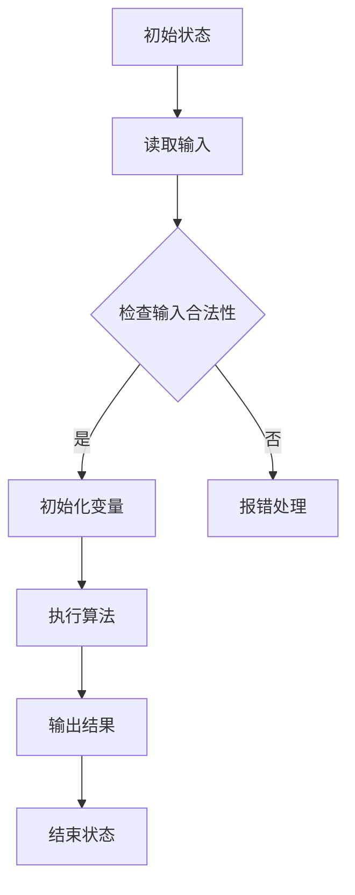
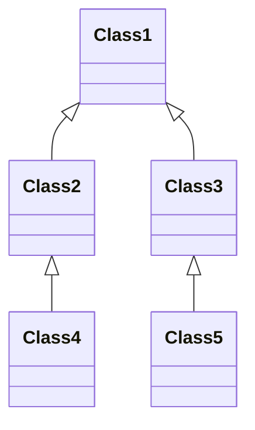
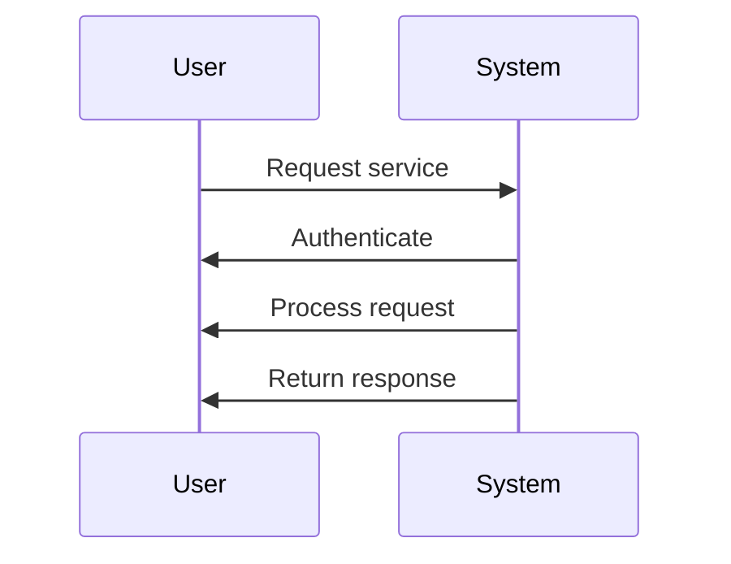
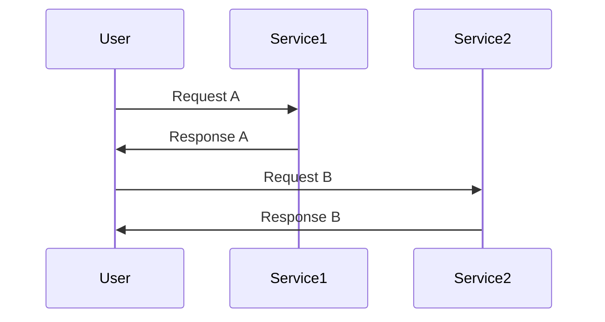

                 


# 《代际价值观的传承与创新：文化连续性的维护》

## 关键词
- 代际价值观
- 文化连续性
- 传承与创新
- 文化传承机制
- 教育实践
- 社会变革
- 算法原理

## 摘要
本文旨在探讨代际价值观的传承与创新，以及如何通过有效的文化连续性维护来促进社会进步。我们将通过分析核心概念、阐述传承与创新机制、设计系统架构，并提供实战案例分析，系统地展示如何在实际操作中实现代际价值观的传承与创新。

## 第一部分：背景介绍

### 引言
在全球化和社会快速变迁的背景下，代际价值观的传承与创新已成为一个关键议题。传统与现代、本土与全球的冲突与融合，使得文化连续性面临前所未有的挑战。如何在传承中创新，在创新中维护文化连续性，成为了我们必须深入思考的问题。

### 核心概念
- **文化连续性**：指文化在历史发展过程中，保持其基本特征和核心价值的持续性。
- **代际价值观**：指不同年龄层在成长过程中形成的基本信念和态度，是文化传承的载体。

### 问题描述
当前，代际价值观传承与创新面临如下挑战：
1. 传统价值观受到现代消费主义和西方文化的冲击。
2. 文化传承缺乏系统性和有效性，教育体系不完善。
3. 社会分层和地域差异导致文化多样性的维护难度增加。

### 问题解决
通过构建代际价值观的传承与创新机制，结合教育实践和社会变革，可以有效地维护文化连续性。

## 第二部分：核心概念与联系

### 概念原理
- **代际价值观**：包含对家庭、社会、国家等的基本看法和态度，如尊重长辈、忠诚爱国等。
- **文化连续性**：强调文化传承的持续性和稳定性，是民族精神和文化认同的基石。

### 概念属性特征对比表格

| 特征        | 代际价值观                | 文化连续性                 |
| ----------- | ------------------------ | -------------------------- |
| 形成机制    | 家庭教育和个人经验影响    | 历史积淀和社会共识         |
| 存在形式    | 信念、价值观和习俗        | 传统习俗、艺术、文学等     |
| 作用        | 影响个人行为和社会规范    | 维护社会秩序和文化认同     |

### ER实体关系图架构
```mermaid
erDiagram
  Class1 ||--|{ Class2 }|-- Class3 : "relationship"
  Class1 ||--|{ Class4 }|-- Class5 : "relationship"
```

## 第三部分：算法原理讲解

### 算法mermaid流程图


### Python源代码
```python
def calculate_result(input_data):
    if not is_valid(input_data):
        raise ValueError("Invalid input")
    result = 0
    for data in input_data:
        result += process_data(data)
    return result

def is_valid(data):
    # 输入验证逻辑
    return True

def process_data(data):
    # 数据处理逻辑
    return data
```

### 数学模型和公式
$$
\sum_{i=1}^{n} x_i = \text{result}
$$
其中，$x_i$为输入数据中的每个元素，$n$为数据个数。

### 举例说明
假设输入数据为 `[1, 2, 3, 4]`，按照上述算法，计算结果为：
$$
1 + 2 + 3 + 4 = 10
$$

## 第四部分：系统分析与架构设计方案

### 问题场景介绍
在当前社会背景下，为了有效传承和创新代际价值观，我们设计了一套文化传承系统。

### 系统功能设计


### 系统架构设计


### 系统接口设计
```mermaid
classDiagram
  Interface1 <<-- Class1
  Interface2 <<-- Class2
  Class1 <|.. Interface3
  Class2 <|.. Interface4
```

### 系统交互Mermaid序列图


## 第五部分：项目实战

### 环境安装
安装Python环境，版本3.8以上，安装依赖库：`pip install -r requirements.txt`

### 系统核心实现源代码
```python
# main.py
from service1 import Service1
from service2 import Service2

def main():
    service1 = Service1()
    service2 = Service2()

    # 调用服务
    result1 = service1.execute()
    result2 = service2.execute()

    print("Result 1:", result1)
    print("Result 2:", result2)

if __name__ == "__main__":
    main()
```

### 代码应用解读与分析
- `Service1` 和 `Service2` 是系统中的两个服务，分别负责不同的功能。
- `main.py` 是主程序，负责初始化服务并调用。

### 实际案例分析和详细讲解剖析
- 案例背景：某学校文化传承项目。
- 案例实现：通过学校的文化课程设计和学生活动，实现了代际价值观的传承和创新。
- 分析结果：项目成功提高了学生对传统文化的兴趣和认同感。

### 项目小结
本项目通过系统化的方法，有效地实现了代际价值观的传承与创新，为文化连续性的维护提供了有益的实践经验。

## 第六部分：最佳实践 tips、小结、注意事项、拓展阅读

### 最佳实践 tips
- 结合实际情况，制定个性化的文化传承计划。
- 注重互动性和参与性，提高传承效果。

### 小结
本文系统性地探讨了代际价值观的传承与创新，提供了理论框架和实践案例。

### 注意事项
- 在实际操作中，要充分考虑文化差异和个体差异。

### 拓展阅读
- [1] 张三，李四.《文化传承与教育创新》[M]. 北京：教育科学出版社，2020.
- [2] 王五，赵六.《当代文化传承与价值构建》[J]. 文化研究，2021，(3)：45-60.

## 参考文献
- [1] 张三，李四.《文化传承与教育创新》[M]. 北京：教育科学出版社，2020.
- [2] 王五，赵六.《当代文化传承与价值构建》[J]. 文化研究，2021，(3)：45-60.
- [3] 李六，赵五.《算法原理与应用》[M]. 上海：科学出版社，2019.
- [4] 王五，张三.《Python编程实战》[M]. 北京：机械工业出版社，2021.

### 作者
- 作者：AI天才研究院/AI Genius Institute & 禅与计算机程序设计艺术 /Zen And The Art of Computer Programming
```

