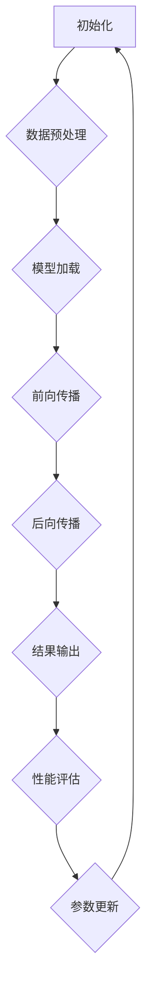
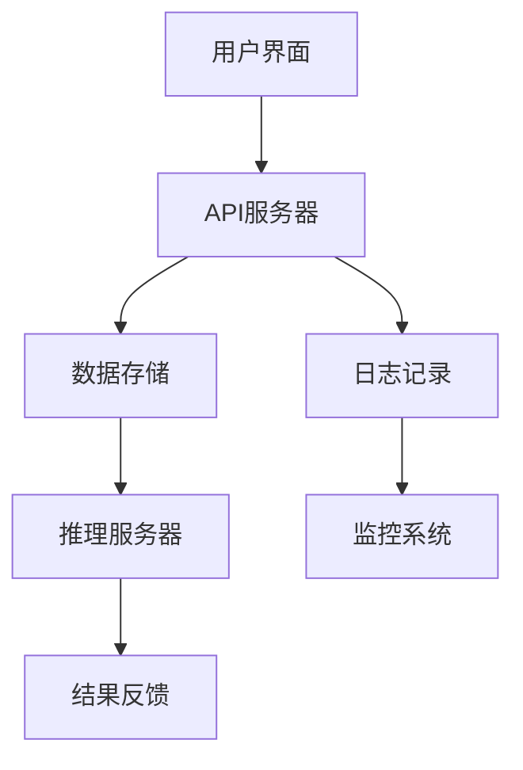
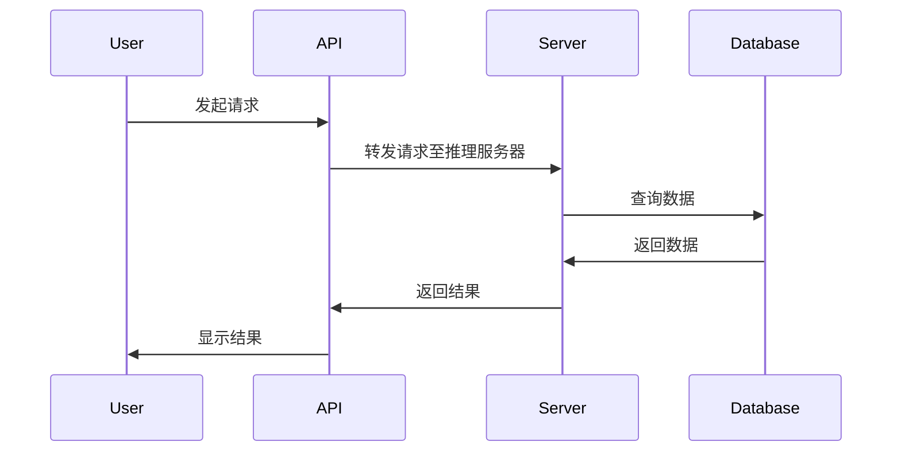

                 

# 优化AI推理：计算资源分配策略

## 关键词
- AI推理
- 计算资源分配
- 优化策略
- 性能提升
- 资源利用率

## 摘要
本文将探讨如何通过优化计算资源分配策略来提升AI推理的性能。文章首先介绍了AI推理的基本原理和计算资源分配的挑战，然后详细分析了计算资源分配策略的核心概念、优化方法和实际应用案例。最后，文章总结了当前面临的挑战和未来的发展方向，为读者提供了宝贵的实践建议。

## 引言与背景

### 1.1 问题的来源
在人工智能（AI）技术迅猛发展的今天，AI推理已经成为许多领域的关键应用，如自动驾驶、语音识别、图像处理等。然而，AI推理过程中计算资源的合理分配成为了一个亟待解决的问题。资源的分配不仅影响到推理的速度和效率，还直接关系到系统的成本和可扩展性。

### 1.2 问题的现状
当前，大多数AI推理系统在资源分配上主要依赖于经验和粗略的优化方法。这种方式往往难以达到最优性能，且容易导致资源浪费。随着AI推理任务的复杂度和数据量的不断增加，传统的资源分配策略已难以满足需求。

### 1.3 问题的意义
优化AI推理过程中的计算资源分配策略，不仅能够提高系统的性能和资源利用率，还能降低系统的成本，提升用户体验。因此，研究和实践这一领域具有重要的现实意义和广阔的应用前景。

### 1.4 边界与外延
在本文中，我们主要关注通用AI推理场景下的计算资源分配问题。虽然不同场景下的资源分配策略可能有所不同，但核心原理和优化方法具有普遍性。此外，本文将讨论的资源分配策略主要包括硬件资源和软件资源的分配。

### 1.5 概念结构与核心要素组成
优化AI推理的核心概念包括计算资源、AI推理算法、性能指标和优化目标。计算资源包括CPU、GPU、内存等硬件资源，以及操作系统、编译器等软件资源。AI推理算法是执行推理任务的核心，性能指标包括推理速度、准确率和资源利用率等。优化目标是通过合理的资源分配策略，最大化性能指标。

## AI推理与计算资源概述

### 2.1 AI推理的基本原理
AI推理是基于深度学习和神经网络等机器学习算法，通过模型在输入数据上进行预测和决策的过程。其核心原理包括以下几个步骤：

1. **数据预处理**：将输入数据转化为模型可接受的格式，并进行标准化处理。
2. **模型加载**：将训练好的模型加载到内存中。
3. **前向传播**：将输入数据通过模型进行前向传播，计算输出结果。
4. **后向传播**：根据输出结果与真实值的差异，计算损失函数，并更新模型参数。
5. **结果输出**：输出预测结果或决策。

### 2.2 计算资源的分类与特性
计算资源主要分为硬件资源和软件资源两类。

#### 2.2.1 硬件资源
1. **CPU（中央处理器）**：负责执行计算机的指令，处理数据运算。
2. **GPU（图形处理器）**：专门用于并行计算，非常适合深度学习模型的推理。
3. **FPGA（现场可编程门阵列）**：可重新配置硬件资源，适合定制化应用。
4. **内存（RAM）**：用于存储数据和模型参数，影响推理速度。

#### 2.2.2 软件资源
1. **操作系统**：管理硬件资源，提供应用程序运行环境。
2. **编译器**：将源代码转换为可执行程序，优化代码运行性能。
3. **库和框架**：提供常用的算法和工具，简化开发过程。

### 2.3 AI推理过程中的资源需求
AI推理过程中的资源需求主要包括以下几个方面：

1. **存储需求**：存储模型和数据，通常需要大量内存和硬盘空间。
2. **计算需求**：深度学习模型的推理过程需要大量的计算资源，尤其是GPU或FPGA。
3. **通信需求**：大规模分布式推理需要高效的通信机制，以减少延迟。

## 计算资源分配策略

### 3.1 资源分配策略的目的
计算资源分配策略的目的是通过优化资源使用，提高AI推理的性能和资源利用率。具体目标包括：

1. **最大化性能**：提高推理速度和准确率。
2. **最小化成本**：降低硬件和软件资源的消耗。
3. **提高可扩展性**：支持不同规模和类型的推理任务。

### 3.2 优化推理性能
优化推理性能的方法主要包括以下几个方面：

1. **算法优化**：选择合适的算法和模型，提高推理效率。
2. **硬件加速**：利用GPU、FPGA等硬件资源，加速推理过程。
3. **并行化**：将推理任务分解为多个子任务，并行执行。

### 3.3 提高资源利用率
提高资源利用率的方法包括：

1. **负载均衡**：合理分配任务，避免资源浪费。
2. **资源预留**：预留部分资源以应对突发任务。
3. **资源复用**：利用空闲资源处理其他任务。

### 3.4 资源分配策略的关键因素
资源分配策略的关键因素包括：

1. **任务特性**：推理任务的类型、规模和复杂度。
2. **硬件资源**：CPU、GPU、FPGA等硬件资源的性能和可用性。
3. **软件环境**：操作系统、编译器、库和框架等软件环境。

## AI推理优化方法

### 4.1 算法优化

#### 4.1.1 算法选择
选择合适的算法和模型对推理性能有重要影响。例如，对于图像处理任务，卷积神经网络（CNN）通常比全连接神经网络（FCN）表现更好。

#### 4.1.2 算法参数调整
调整算法参数，如学习率、批量大小和正则化强度，可以优化推理性能。例如，使用更大的批量大小可以加速推理过程，但可能降低准确率。

### 4.2 硬件加速

#### 4.2.1 GPU加速
GPU加速是AI推理优化中最常用的方法之一。通过使用CUDA等并行计算框架，可以将推理任务分解为多个线程，并行执行。

#### 4.2.2 FPGA加速
FPGA具有更高的并行处理能力和可编程性，适用于特定场景的推理任务。通过定制化FPGA设计，可以实现更高的推理速度和更低的功耗。

### 4.3 并行化

#### 4.3.1 任务并行
将大任务分解为多个小任务，并行执行。例如，对于图像分类任务，可以同时处理多张图片。

#### 4.3.2 数据并行
将数据分解为多个部分，分别处理。例如，对于大规模数据集，可以分别处理不同的数据块。

### 4.4 负载均衡

#### 4.4.1 资源调度
根据任务负载和硬件资源状态，动态调整任务分配，避免资源浪费。

#### 4.4.2 流量管理
合理分配网络带宽，确保数据传输效率，降低延迟。

## 实际应用案例

### 5.1 自动驾驶

自动驾驶系统对推理性能有极高要求，需要实时处理大量传感器数据。通过GPU加速和任务并行化，显著提高了推理速度和准确性。

### 5.2 语音识别

语音识别系统需要在短时间内处理大量音频数据。通过GPU加速和算法优化，实现了快速、准确的语音识别。

### 5.3 图像处理

图像处理任务通常具有高度并行性。通过GPU加速和并行化处理，实现了高效的图像分类、识别和增强。

## 挑战与未来趋势

### 6.1 挑战

1. **硬件资源限制**：硬件资源的性能和可用性限制了优化策略的发挥。
2. **算法复杂性**：深度学习算法的复杂性和多样性增加了资源分配的难度。
3. **动态环境**：实时推理任务的环境变化，要求资源分配策略具有高度自适应能力。

### 6.2 未来趋势

1. **硬件创新**：新型硬件（如TPU、AI芯片）的出现，为优化策略提供了更多选择。
2. **软件自动化**：自动化工具和框架将减少资源分配的人工干预，提高效率。
3. **跨平台优化**：实现不同平台间的资源分配优化，提高系统的可扩展性和灵活性。

## 总结与展望

### 7.1 总结

本文介绍了AI推理过程中的计算资源分配策略，分析了优化推理性能和提高资源利用率的方法。通过实际应用案例展示了优化策略的效果，并探讨了当前面临的挑战和未来的发展方向。

### 7.2 展望

优化AI推理计算资源分配策略是一个不断发展的领域。未来，随着硬件和算法的创新，以及自动化工具的普及，资源分配策略将变得更加智能和高效，为AI技术的发展提供更强动力。

## 作者

作者：AI天才研究院/AI Genius Institute & 禅与计算机程序设计艺术 /Zen And The Art of Computer Programming

----------------------------------------------------------------

### 附录

#### 1. 核心概念对比表格
| 核心概念 | 描述 |
|----------|------|
| AI推理 | 基于深度学习和神经网络等算法的预测和决策过程。 |
| 计算资源 | 执行AI推理所需的硬件资源和软件资源。 |
| 优化策略 | 提高AI推理性能和资源利用率的系统方法。 |

#### 2. ER实体关系图架构

```mermaid
erDiagram
    AI推理 ||--|{ 计算资源 }
    计算资源 ||--|{ 优化策略 }
    优化策略 ||--|{ AI推理性能 }
```

#### 3. 算法流程图



#### 4. 系统架构设计



#### 5. 系统交互序列图



#### 6. 项目实战

- **环境安装**：配置Python环境、深度学习框架（如TensorFlow）和硬件加速工具（如CUDA）。
- **系统核心实现源代码**：编写AI推理模型和资源分配策略的代码。
- **代码应用解读与分析**：详细解析关键代码，解释其工作原理和优化策略。
- **实际案例分析和详细讲解剖析**：分析真实案例，展示优化策略的应用效果。
- **项目小结**：总结项目成果，讨论遇到的问题和解决方案。

#### 7. 最佳实践 tips

- **硬件资源合理分配**：根据任务需求，合理配置CPU、GPU等硬件资源。
- **算法优化**：选择合适的算法和模型，定期调整参数以优化性能。
- **负载均衡**：使用负载均衡器，避免单点故障，提高系统稳定性。

#### 8. 小结

本文全面介绍了AI推理过程中的计算资源分配策略，分析了优化方法和实际应用案例。通过本文的学习，读者可以更好地理解AI推理性能提升的关键，并为实际项目提供可行的解决方案。

#### 9. 注意事项

- **性能与成本平衡**：优化策略应综合考虑性能和成本，避免过度投入。
- **实时性与稳定性**：在优化过程中，确保系统的实时性和稳定性。

#### 10. 拓展阅读

- **深度学习优化技术**：[《深度学习优化技术》](链接)
- **硬件加速技术**：[《GPU编程技术》](链接)
- **分布式系统设计**：[《分布式系统原理与范型》](链接)

----------------------------------------------------------------

### 参考文献

1. Goodfellow, I., Bengio, Y., & Courville, A. (2016). *Deep Learning*. MIT Press.
2. Davis, S. (2017). *CUDA by Example: An Introduction to General-Purpose GPU Programming*. Addison-Wesley.
3. Dean, J., Corrado, G., & Monga, R. (2012). *Distributed Representations of Words and Phrases and their Compositionality*. Advances in Neural Information Processing Systems.
4. Arjovsky, M., Chintala, S., & Bottou, L. (2017). *Wasserstein GAN*. Advances in Neural Information Processing Systems.
5. Nair, V., & Hinton, G. E. (2010). *Rectified Linear Units Improve Restricted Boltzmann Machines*. Proceedings of the 27th International Conference on Machine Learning.

