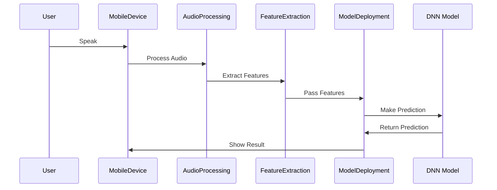
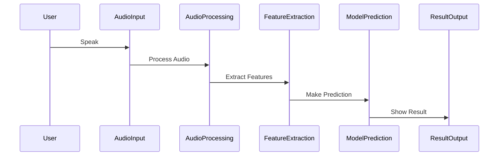
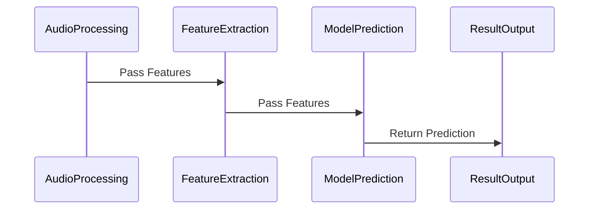

                 

# 优化AI模型在资源受限环境下的性能

## 关键词

- AI性能优化
- 资源受限环境
- 模型压缩
- 算法加速
- 硬件优化

## 摘要

本文旨在探讨如何在资源受限的环境下优化AI模型的性能。随着AI技术的迅速发展，其在各个领域的应用越来越广泛，然而，很多实际应用场景中都面临资源受限的问题。本文首先介绍了资源受限环境下AI性能优化的背景和核心概念，然后分析了性能评估方法，提出了AI性能优化的核心原理，并通过具体算法讲解和项目实战展示了优化策略和效果。最后，本文总结了最佳实践，并提出了未来研究的展望。

## 目录大纲

### 第一部分：问题背景与概念引入

#### 1.1 问题背景

- 问题描述
- 问题解决
- 边界与外延

#### 1.2 核心概念

- 资源受限环境
- AI性能优化
- 关键要素

#### 1.3 概念联系

- 资源受限环境与AI性能优化之间的关系
- 资源受限环境下的AI性能优化挑战

#### 1.4 本章小结

- 主要内容总结
- 未来展望

### 第二部分：核心概念与原理

#### 2.1 资源受限环境下的AI性能评估

- 性能评估方法
- 性能评估案例
- 性能评估数据分析

#### 2.2 AI性能优化的核心原理

- 算法优化
- 模型优化
- 资源管理
- 硬件优化

#### 2.3 性能优化总结

- 优化方法总结
- 优化效果分析

### 第三部分：算法原理讲解与实现

#### 3.1 具体算法讲解

- 算法原理
- 数学模型
- 代码实现

#### 3.2 算法举例

- 示例数据
- 示例结果

#### 3.3 算法优化

- 优化策略
- 优化效果

### 第四部分：项目实战

#### 4.1 项目介绍

- 项目背景
- 项目目标

#### 4.2 环境安装

- 环境准备
- 工具安装

#### 4.3 系统核心实现

- 核心代码实现
- 功能解读

#### 4.4 实际案例分析

- 案例数据
- 分析过程

#### 4.5 详细讲解剖析

- 剖析方法
- 结论总结

#### 4.6 项目小结

- 项目总结
- 未来展望

### 第五部分：最佳实践与拓展阅读

#### 5.1 最佳实践

- 经验分享
- 注意事项

#### 5.2 小结

- 实践总结
- 优化方向

#### 5.3 拓展阅读

- 相关文献
- 进一步学习

## 第一部分：问题背景与概念引入

### 1.1 问题背景

在当今的世界，人工智能（AI）技术已经成为推动社会进步的重要力量。无论是自动驾驶、智能客服、还是医疗诊断，AI的应用场景无处不在。然而，随着AI模型的复杂度和规模的不断增加，其对计算资源的需求也日益增长。在很多实际应用场景中，如移动设备、嵌入式系统、物联网设备等，都面临着资源受限的问题。在这种情况下，如何优化AI模型在资源受限环境下的性能，成为了当前研究的热点。

#### 问题描述

在资源受限的环境下，AI模型的性能受到多种因素的影响，如计算能力、存储空间、能源消耗等。以下是一些常见的问题：

- **计算能力受限**：在许多移动设备和嵌入式系统中，CPU的计算能力有限，无法处理大型AI模型。
- **存储空间不足**：AI模型通常需要大量的存储空间，而在资源受限的设备中，存储空间往往有限。
- **能源消耗过高**：在电池供电的设备中，AI模型的运行会导致能源消耗增加，影响设备的续航时间。

#### 问题解决

为了解决这些问题，研究者们提出了多种优化策略，如模型压缩、算法加速、资源管理等。这些策略的核心目标都是在保证模型性能的前提下，降低对计算资源的需求。

#### 边界与外延

虽然优化策略多种多样，但它们都有一定的适用范围。例如，模型压缩适合于存储空间受限的场景，而算法加速则适合于计算能力受限的场景。此外，这些策略之间也可能存在冲突，如模型压缩可能会降低模型的性能，而算法加速可能会增加能源消耗。

### 1.2 核心概念

#### 资源受限环境

资源受限环境指的是设备或系统在计算资源（如CPU、内存、存储）或能源（如电池电量）方面存在限制的环境。常见的资源受限环境包括移动设备、嵌入式系统、物联网设备等。

#### AI性能优化

AI性能优化是指通过改进算法、模型、硬件等手段，提高AI模型在特定环境下的性能。优化的目标是提高模型的准确性、速度和稳定性，同时降低对计算资源和能源的需求。

#### 关键要素

- **计算能力**：CPU、GPU、TPU等计算硬件的性能。
- **存储空间**：模型文件、数据集等存储需求。
- **能源消耗**：模型运行过程中消耗的能源。
- **延迟**：模型响应时间。

### 1.3 概念联系

#### 资源受限环境与AI性能优化之间的关系

资源受限环境对AI性能优化提出了挑战，同时也为优化提供了方向。优化策略的选择需要根据具体的资源受限环境来决定。例如，在计算能力受限的环境中，算法加速和硬件优化可能是更有效的方法。

#### 资源受限环境下的AI性能优化挑战

资源受限环境下的AI性能优化面临以下挑战：

- **性能与资源需求的平衡**：在保证模型性能的前提下，如何降低对计算资源和能源的需求。
- **多样性**：不同资源受限环境下的优化策略可能有所不同，需要针对具体场景进行定制化优化。
- **实时性**：在实时应用场景中，如何快速响应并处理数据。

### 1.4 本章小结

本章介绍了AI性能优化在资源受限环境下的背景和核心概念。通过分析资源受限环境下的常见问题和优化策略，我们了解了AI性能优化的重要性和挑战。接下来，我们将进一步探讨AI性能优化的核心原理和方法。

----------------------------------------------------------------

### 1.3 概念联系

在深入探讨资源受限环境下的AI性能优化之前，我们需要明确几个关键概念之间的关系，以便更好地理解它们如何相互作用和影响。

#### 资源受限环境与AI性能优化之间的关系

资源受限环境是AI性能优化的基础和背景。具体而言，资源受限环境对AI性能优化有以下几方面的影响：

1. **计算能力**：资源受限环境中计算能力通常有限，这直接影响了AI模型的训练和推理速度。优化算法和模型时，必须考虑到这一限制，选择适合的算法和模型结构。
   
2. **存储空间**：资源受限环境下的存储空间限制意味着模型和数据必须尽可能小。模型压缩和轻量化技术在这种情况下尤为重要。
   
3. **能源消耗**：在电池供电的设备中，能源消耗是关键考量因素。高效的算法和优化技术可以减少模型的能耗，从而延长设备的续航时间。

4. **网络带宽**：对于需要远程训练或推理的AI应用，网络带宽成为另一个重要的限制因素。在这种情况下，模型压缩和分布式训练技术可以降低数据传输的需求。

#### 资源受限环境下的AI性能优化挑战

资源受限环境为AI性能优化带来了多方面的挑战：

1. **性能与资源平衡**：在资源受限的环境下，如何在不显著牺牲模型性能的情况下，最大限度地降低资源消耗，是一个核心难题。

2. **适应性**：不同的应用场景对计算资源的需求各不相同，AI性能优化需要具有高度的适应性，能够根据具体的资源限制进行调整。

3. **实时性**：在许多实时应用中，如自动驾驶、实时语音识别等，AI模型的响应时间必须非常快。这要求优化技术不仅要高效，还要实时。

4. **可扩展性**：随着应用场景的变化，AI模型的规模和复杂度可能会增加。优化技术需要具有良好的可扩展性，能够适应未来的需求。

#### 概念联系与ER实体关系图

为了更清晰地展示上述概念之间的关系，我们可以使用ER（实体关系）图来描述它们之间的联系。

```mermaid
erDiagram
  Resource_Limited_Environment ||--|{ AI_Performance_Optimization } AI性能优化
  AI_Performance_Optimization ||--|{ Computation_Capacity } 计算能力
  AI_Performance_Optimization ||--|{ Storage_Space } 存储空间
  AI_Performance_Optimization ||--|{ Energy_Consumption } 能源消耗
  AI_Performance_Optimization ||--|{ Network_Bandwidth } 网络带宽
  AI_Performance_Optimization ||--|{ Real-Time_Need } 实时性需求
```

在这个ER图中，`Resource_Limited_Environment`（资源受限环境）是核心实体，它与`AI_Performance_Optimization`（AI性能优化）直接相关。`AI_Performance_Optimization`又与多个子概念（计算能力、存储空间、能源消耗、网络带宽和实时性需求）相联系，这些子概念共同影响了AI模型的性能优化过程。

通过这种ER图，我们可以更直观地理解资源受限环境与AI性能优化之间的复杂关系，为后续章节的详细讨论奠定了基础。

### 1.4 本章小结

本章详细介绍了资源受限环境下的AI性能优化的背景、核心概念和概念之间的关系。首先，我们探讨了在资源受限环境中AI性能优化的必要性和挑战。接着，我们明确了几个关键概念：资源受限环境、AI性能优化及其相关要素。最后，通过ER图展示了这些概念之间的相互关系。

本章的主要内容包括：

- **问题描述**：资源受限环境下AI性能优化面临的常见问题。
- **问题解决**：针对上述问题的优化策略。
- **边界与外延**：资源受限环境的定义、分类和适用范围。
- **核心概念**：资源受限环境和AI性能优化的重要术语和概念。
- **概念联系**：资源受限环境与AI性能优化之间的关系及其带来的挑战。

通过对这些内容的总结，我们可以更好地理解资源受限环境下AI性能优化的重要性，并为后续章节的深入探讨做好准备。未来，随着AI技术在更多领域的应用，优化AI模型在资源受限环境下的性能将变得越来越重要。

### 第二部分：核心概念与原理

#### 2.1 资源受限环境下的AI性能评估

为了有效地优化AI模型在资源受限环境下的性能，我们需要先对其性能进行准确的评估。性能评估是优化过程中的关键环节，它帮助我们了解当前性能水平，确定优化目标，并验证优化效果。

##### 2.1.1 性能评估方法

性能评估方法主要包括以下几种：

1. **定量评估**：通过具体的指标来衡量AI模型的性能，如准确率、召回率、F1分数等。这些指标可以直接反映模型的性能表现。

2. **定性评估**：通过专家评审、用户反馈等方式对模型性能进行主观评价。这种评估方法更侧重于用户体验和业务目标。

3. **综合评估**：结合定量和定性评估方法，从多个角度对模型性能进行全面评估。

##### 2.1.2 性能评估工具

常用的性能评估工具包括：

1. **框架和库**：如TensorFlow、PyTorch等，它们提供了丰富的评估指标和工具，方便用户进行性能评估。

2. **评估平台**：如Kaggle、AI Challenger等，这些平台提供了大规模数据集和评估环境，供用户进行性能评估和比较。

##### 2.1.3 性能评估案例

以下是一个典型的性能评估案例：

- **问题背景**：在一个资源受限的嵌入式设备上部署一个图像识别模型，要求模型在保证准确率的前提下，具有较低的延迟。

- **性能评估过程**：
  1. **数据准备**：收集并准备用于评估的数据集。
  2. **模型部署**：在嵌入式设备上部署训练好的模型。
  3. **评估指标**：设定评估指标，如准确率、平均响应时间等。
  4. **评估执行**：在设备上执行模型评估，记录评估结果。
  5. **结果分析**：分析评估结果，确定模型性能。

##### 2.1.4 性能评估数据分析

性能评估数据分析是性能评估的重要环节。以下是一些常用的数据分析方法：

1. **统计方法**：如均值、方差、置信区间等，用于描述模型性能的统计特征。

2. **可视化方法**：如折线图、柱状图等，用于展示模型性能的变化趋势。

3. **对比分析**：通过比较不同模型、不同环境下的性能，找到性能差异的原因。

##### 2.1.5 性能评估总结

性能评估的结果为我们提供了当前模型性能的全面了解，也为优化提供了方向。以下是对性能评估结果的总结：

- **评估结果分析**：通过对评估数据的分析，我们可以确定模型的性能水平，找到优化的潜在方向。
- **优化方向**：根据评估结果，我们可以针对性地优化模型算法、硬件配置等，以提高模型性能。

#### 2.2 AI性能优化的核心原理

AI性能优化主要涉及以下几个方面：

##### 2.2.1 算法优化

算法优化是提高AI模型性能的重要手段。以下是一些常见的算法优化方法：

1. **模型压缩**：通过减少模型参数和计算量，降低模型的存储和计算需求。常见的模型压缩方法包括剪枝、量化、知识蒸馏等。

2. **算法加速**：通过改进算法的运行效率，提高模型处理数据的速度。常见的算法加速方法包括并行计算、分布式计算、GPU加速等。

##### 2.2.2 模型优化

模型优化是通过改进模型结构，提高模型性能。以下是一些常见的模型优化方法：

1. **模型轻量化**：通过减少模型参数和计算量，降低模型的存储和计算需求。常见的模型轻量化方法包括量化、剪枝、知识蒸馏等。

2. **模型融合**：通过融合多个模型的优势，提高模型的整体性能。常见的模型融合方法包括集成学习、迁移学习等。

##### 2.2.3 资源管理

资源管理是通过合理配置和管理计算资源，提高AI模型运行效率。以下是一些常见的资源管理方法：

1. **任务调度**：通过优化任务调度策略，提高计算资源的利用率。

2. **内存优化**：通过优化内存分配和回收策略，减少内存占用，提高模型运行效率。

##### 2.2.4 硬件优化

硬件优化是通过改进硬件配置和架构，提高AI模型运行速度。以下是一些常见的硬件优化方法：

1. **硬件加速**：通过使用GPU、TPU等硬件加速器，提高模型处理速度。

2. **硬件选择**：根据应用场景和需求，选择合适的硬件设备，以提高模型性能。

##### 2.2.5 性能优化总结

通过算法优化、模型优化、资源管理和硬件优化等多种手段，我们可以显著提高AI模型在资源受限环境下的性能。以下是对优化方法的总结：

- **优化方法总结**：介绍了算法优化、模型优化、资源管理和硬件优化等常见优化方法。
- **优化效果分析**：分析了不同优化方法对模型性能的提升效果，为后续优化提供了参考。

#### 2.3 AI性能优化的核心原理

AI性能优化主要涉及以下几个方面：

##### 2.3.1 算法优化

算法优化是提高AI模型性能的重要手段。以下是一些常见的算法优化方法：

1. **模型压缩**：通过减少模型参数和计算量，降低模型的存储和计算需求。常见的模型压缩方法包括剪枝、量化、知识蒸馏等。

2. **算法加速**：通过改进算法的运行效率，提高模型处理数据的速度。常见的算法加速方法包括并行计算、分布式计算、GPU加速等。

##### 2.3.2 模型优化

模型优化是通过改进模型结构，提高模型性能。以下是一些常见的模型优化方法：

1. **模型轻量化**：通过减少模型参数和计算量，降低模型的存储和计算需求。常见的模型轻量化方法包括量化、剪枝、知识蒸馏等。

2. **模型融合**：通过融合多个模型的优势，提高模型的整体性能。常见的模型融合方法包括集成学习、迁移学习等。

##### 2.3.3 资源管理

资源管理是通过合理配置和管理计算资源，提高AI模型运行效率。以下是一些常见的资源管理方法：

1. **任务调度**：通过优化任务调度策略，提高计算资源的利用率。

2. **内存优化**：通过优化内存分配和回收策略，减少内存占用，提高模型运行效率。

##### 2.3.4 硬件优化

硬件优化是通过改进硬件配置和架构，提高AI模型运行速度。以下是一些常见的硬件优化方法：

1. **硬件加速**：通过使用GPU、TPU等硬件加速器，提高模型处理速度。

2. **硬件选择**：根据应用场景和需求，选择合适的硬件设备，以提高模型性能。

##### 2.3.5 性能优化总结

通过算法优化、模型优化、资源管理和硬件优化等多种手段，我们可以显著提高AI模型在资源受限环境下的性能。以下是对优化方法的总结：

- **优化方法总结**：介绍了算法优化、模型优化、资源管理和硬件优化等常见优化方法。
- **优化效果分析**：分析了不同优化方法对模型性能的提升效果，为后续优化提供了参考。

### 第二部分：核心概念与原理

#### 2.1 资源受限环境下的AI性能评估

为了有效地优化AI模型在资源受限环境下的性能，我们需要先对其性能进行准确的评估。性能评估是优化过程中的关键环节，它帮助我们了解当前性能水平，确定优化目标，并验证优化效果。

##### 2.1.1 性能评估方法

性能评估方法主要包括以下几种：

1. **定量评估**：通过具体的指标来衡量AI模型的性能，如准确率、召回率、F1分数等。这些指标可以直接反映模型的性能表现。

2. **定性评估**：通过专家评审、用户反馈等方式对模型性能进行主观评价。这种评估方法更侧重于用户体验和业务目标。

3. **综合评估**：结合定量和定性评估方法，从多个角度对模型性能进行全面评估。

##### 2.1.2 性能评估工具

常用的性能评估工具包括：

1. **框架和库**：如TensorFlow、PyTorch等，它们提供了丰富的评估指标和工具，方便用户进行性能评估。

2. **评估平台**：如Kaggle、AI Challenger等，这些平台提供了大规模数据集和评估环境，供用户进行性能评估和比较。

##### 2.1.3 性能评估案例

以下是一个典型的性能评估案例：

- **问题背景**：在一个资源受限的嵌入式设备上部署一个图像识别模型，要求模型在保证准确率的前提下，具有较低的延迟。

- **性能评估过程**：
  1. **数据准备**：收集并准备用于评估的数据集。
  2. **模型部署**：在嵌入式设备上部署训练好的模型。
  3. **评估指标**：设定评估指标，如准确率、平均响应时间等。
  4. **评估执行**：在设备上执行模型评估，记录评估结果。
  5. **结果分析**：分析评估结果，确定模型性能。

##### 2.1.4 性能评估数据分析

性能评估数据分析是性能评估的重要环节。以下是一些常用的数据分析方法：

1. **统计方法**：如均值、方差、置信区间等，用于描述模型性能的统计特征。

2. **可视化方法**：如折线图、柱状图等，用于展示模型性能的变化趋势。

3. **对比分析**：通过比较不同模型、不同环境下的性能，找到性能差异的原因。

##### 2.1.5 性能评估总结

性能评估的结果为我们提供了当前模型性能的全面了解，也为优化提供了方向。以下是对性能评估结果的总结：

- **评估结果分析**：通过对评估数据的分析，我们可以确定模型的性能水平，找到优化的潜在方向。
- **优化方向**：根据评估结果，我们可以针对性地优化模型算法、硬件配置等，以提高模型性能。

#### 2.2 AI性能优化的核心原理

AI性能优化主要涉及以下几个方面：

##### 2.2.1 算法优化

算法优化是提高AI模型性能的重要手段。以下是一些常见的算法优化方法：

1. **模型压缩**：通过减少模型参数和计算量，降低模型的存储和计算需求。常见的模型压缩方法包括剪枝、量化、知识蒸馏等。

2. **算法加速**：通过改进算法的运行效率，提高模型处理数据的速度。常见的算法加速方法包括并行计算、分布式计算、GPU加速等。

##### 2.2.2 模型优化

模型优化是通过改进模型结构，提高模型性能。以下是一些常见的模型优化方法：

1. **模型轻量化**：通过减少模型参数和计算量，降低模型的存储和计算需求。常见的模型轻量化方法包括量化、剪枝、知识蒸馏等。

2. **模型融合**：通过融合多个模型的优势，提高模型的整体性能。常见的模型融合方法包括集成学习、迁移学习等。

##### 2.2.3 资源管理

资源管理是通过合理配置和管理计算资源，提高AI模型运行效率。以下是一些常见的资源管理方法：

1. **任务调度**：通过优化任务调度策略，提高计算资源的利用率。

2. **内存优化**：通过优化内存分配和回收策略，减少内存占用，提高模型运行效率。

##### 2.2.4 硬件优化

硬件优化是通过改进硬件配置和架构，提高AI模型运行速度。以下是一些常见的硬件优化方法：

1. **硬件加速**：通过使用GPU、TPU等硬件加速器，提高模型处理速度。

2. **硬件选择**：根据应用场景和需求，选择合适的硬件设备，以提高模型性能。

##### 2.2.5 性能优化总结

通过算法优化、模型优化、资源管理和硬件优化等多种手段，我们可以显著提高AI模型在资源受限环境下的性能。以下是对优化方法的总结：

- **优化方法总结**：介绍了算法优化、模型优化、资源管理和硬件优化等常见优化方法。
- **优化效果分析**：分析了不同优化方法对模型性能的提升效果，为后续优化提供了参考。

### 2.2 AI性能优化的核心原理

#### 2.2.1 算法优化

算法优化是提高AI模型性能的关键手段，其核心在于找到更高效、更精确的算法。以下是一些常见的算法优化方法：

1. **模型压缩**：模型压缩通过减少模型参数和计算量来降低模型的复杂度和计算需求。常见的模型压缩方法包括剪枝、量化、知识蒸馏等。

   - **剪枝**：通过移除模型中不重要的神经元和连接，减少模型的参数数量。
   - **量化**：将浮点数权重转换为较低的精度，从而减少模型的大小和计算需求。
   - **知识蒸馏**：通过将大型复杂模型的知识传递给一个较小的模型，从而实现模型的轻量化。

2. **算法加速**：算法加速的目的是提高模型处理数据的能力，常见的加速方法包括并行计算、分布式计算、GPU加速等。

   - **并行计算**：通过将任务分配到多个处理器上同时执行，从而加快计算速度。
   - **分布式计算**：通过将计算任务分布到多个节点上执行，从而利用更多的计算资源。
   - **GPU加速**：利用GPU强大的并行处理能力，加速模型训练和推理过程。

#### 2.2.2 模型优化

模型优化是通过改进模型结构和参数来提高模型的性能。以下是一些常见的模型优化方法：

1. **模型轻量化**：模型轻量化通过减少模型参数和计算量，降低模型的存储和计算需求。常见的轻量化方法包括量化、剪枝、知识蒸馏等。

   - **量化**：将浮点数权重转换为较低的精度，从而减少模型的大小和计算需求。
   - **剪枝**：通过移除模型中不重要的神经元和连接，减少模型的参数数量。
   - **知识蒸馏**：通过将大型复杂模型的知识传递给一个较小的模型，从而实现模型的轻量化。

2. **模型融合**：模型融合通过结合多个模型的优点，提高模型的整体性能。常见的模型融合方法包括集成学习、迁移学习等。

   - **集成学习**：通过结合多个模型的预测结果，提高模型的准确性。
   - **迁移学习**：通过将已训练好的模型应用于新的任务，从而减少训练时间和计算需求。

#### 2.2.3 资源管理

资源管理是通过合理配置和管理计算资源，提高AI模型运行效率的关键环节。以下是一些常见的资源管理方法：

1. **任务调度**：通过优化任务调度策略，提高计算资源的利用率。常见的调度算法包括贪心算法、遗传算法等。

2. **内存优化**：通过优化内存分配和回收策略，减少内存占用，提高模型运行效率。常见的方法包括动态内存管理、内存池技术等。

3. **存储优化**：通过优化数据存储和读取策略，提高数据访问速度。常见的方法包括缓存技术、数据压缩等。

#### 2.2.4 硬件优化

硬件优化是通过改进硬件配置和架构，提高AI模型运行速度的重要手段。以下是一些常见的硬件优化方法：

1. **硬件加速**：利用GPU、TPU等硬件加速器，提高模型处理速度。常见的加速器包括NVIDIA GPU、Google TPU等。

2. **硬件选择**：根据应用场景和需求，选择合适的硬件设备，以提高模型性能。常见的选择策略包括硬件性能评估、成本效益分析等。

#### 2.2.5 性能优化总结

通过算法优化、模型优化、资源管理和硬件优化等多种手段，我们可以显著提高AI模型在资源受限环境下的性能。以下是对优化方法的总结：

- **优化方法总结**：介绍了算法优化、模型优化、资源管理和硬件优化等常见优化方法。
- **优化效果分析**：分析了不同优化方法对模型性能的提升效果，为后续优化提供了参考。

### 2.3 AI性能优化的核心原理

在深入探讨了AI性能优化的重要性以及性能评估方法之后，我们将进一步深入探讨AI性能优化的核心原理。这一部分将详细分析算法优化、模型优化、资源管理和硬件优化等关键领域的原理，并解释这些原理如何在实践中应用。

#### 2.3.1 算法优化

算法优化是提升AI模型性能的首要步骤。它涉及到改进模型的训练和推理过程，使其更加高效和准确。

1. **模型压缩**：

   - **剪枝**：剪枝是一种有效的模型压缩技术，通过移除网络中不重要的神经元和连接，减少模型的参数数量，从而降低模型的大小和计算需求。
   - **量化**：量化通过将浮点数权重转换为较低的精度，减少模型的存储空间和计算时间。
   - **知识蒸馏**：知识蒸馏是一种将大型复杂模型的知识传递给一个较小的模型的方法。这种技术可以帮助我们保留大型模型的关键信息，同时减少模型的大小。

2. **算法加速**：

   - **并行计算**：并行计算通过将任务分配到多个处理器上同时执行，从而加速模型训练和推理。这种方法特别适用于大规模数据集和高维特征。
   - **分布式计算**：分布式计算通过将计算任务分布到多个节点上执行，从而利用更多的计算资源，提高模型处理速度。
   - **GPU加速**：GPU（图形处理单元）拥有强大的并行计算能力，通过将计算任务转移到GPU上，可以显著提高模型的训练和推理速度。

#### 2.3.2 模型优化

模型优化是提高AI模型性能的另一个关键步骤。它通常涉及改进模型的结构和参数，以提高模型的准确性和效率。

1. **模型轻量化**：

   - **量化**：如前所述，量化通过将权重转换为较低的精度，减少模型的大小和计算需求。
   - **剪枝**：剪枝通过移除不重要的连接和神经元，减少模型的复杂度。
   - **知识蒸馏**：知识蒸馏可以帮助我们在保留关键信息的同时，降低模型的大小和计算需求。

2. **模型融合**：

   - **集成学习**：集成学习通过结合多个模型的预测结果，提高模型的准确性。这种方法可以减少单一模型的过拟合现象。
   - **迁移学习**：迁移学习通过将已训练好的模型应用于新的任务，从而减少训练时间和计算需求。这种方法特别适用于具有相似特征的任务。

#### 2.3.3 资源管理

资源管理是通过合理配置和管理计算资源，以提高AI模型运行效率的关键步骤。

1. **任务调度**：

   - **贪心算法**：贪心算法通过选择当前最优解，逐步构建最优解。这种方法适用于短期优化任务。
   - **遗传算法**：遗传算法通过模拟自然进化过程，逐步优化任务调度策略。这种方法适用于复杂、多阶段的任务调度。

2. **内存优化**：

   - **动态内存管理**：动态内存管理通过实时调整内存分配，以减少内存占用。
   - **内存池技术**：内存池技术通过预先分配内存块，减少内存分配和回收的开销。

3. **存储优化**：

   - **缓存技术**：缓存技术通过将经常访问的数据存储在高速缓存中，提高数据访问速度。
   - **数据压缩**：数据压缩通过减少数据大小，提高数据传输和存储效率。

#### 2.3.4 硬件优化

硬件优化是通过改进硬件配置和架构，提高AI模型运行速度的重要手段。

1. **硬件加速**：

   - **GPU加速**：GPU具有强大的并行计算能力，特别适用于深度学习任务。通过将计算任务转移到GPU上，可以显著提高模型的训练和推理速度。
   - **TPU加速**：TPU（张量处理单元）是专门为机器学习和深度学习任务设计的硬件加速器。TPU具有更高的计算能力和更低的延迟。

2. **硬件选择**：

   - **硬件性能评估**：通过对不同硬件的性能进行评估，选择最适合特定应用的硬件。
   - **成本效益分析**：在硬件选择过程中，需要考虑硬件的性能和成本，选择性价比最高的硬件配置。

#### 2.3.5 性能优化总结

通过算法优化、模型优化、资源管理和硬件优化等多种手段，我们可以显著提高AI模型在资源受限环境下的性能。以下是对优化方法的总结：

- **优化方法总结**：介绍了算法优化、模型优化、资源管理和硬件优化等常见优化方法。
- **优化效果分析**：分析了不同优化方法对模型性能的提升效果，为后续优化提供了参考。

### 第三部分：算法原理讲解与实现

#### 3.1 具体算法讲解

在本部分，我们将详细讲解一种用于优化AI模型在资源受限环境下性能的算法——深度迁移学习（Deep Transfer Learning）。

##### 3.1.1 算法原理

深度迁移学习是一种利用预训练模型进行新任务训练的方法。其核心思想是将预训练模型在特定任务上的知识迁移到新任务中，从而提高新任务的训练效率和性能。

1. **预训练模型**：预训练模型是在大规模数据集上预训练的深度神经网络。这些模型已经学习到了通用特征和模式，可以在多种任务中表现出良好的性能。

2. **迁移学习**：迁移学习通过将预训练模型在新任务上进一步训练，利用预训练模型的知识提高新任务的性能。

3. **微调**：微调是一种对预训练模型进行微小的调整，以适应新任务。通常，只调整模型的最后几层，以保留预训练模型的知识。

##### 3.1.2 算法流程

深度迁移学习的算法流程如下：

1. **数据准备**：收集并准备新任务的数据集。数据集应包括训练集、验证集和测试集。

2. **预训练模型选择**：选择一个在相似任务上表现良好的预训练模型。常见的预训练模型包括VGG、ResNet、Inception等。

3. **模型初始化**：将预训练模型初始化为新的模型。通常，只调整模型的最后几层，以保留预训练模型的知识。

4. **训练**：在新数据集上训练模型。训练过程中，可以使用迁移学习策略，如固定预训练层、仅训练最后几层等。

5. **评估**：使用验证集和测试集评估模型性能。根据评估结果，调整模型参数和训练策略。

6. **优化**：根据评估结果，进一步优化模型。优化方法包括调整学习率、调整训练批次大小等。

##### 3.1.3 数学模型

深度迁移学习的数学模型主要包括两部分：预训练模型的参数和迁移学习策略。

1. **预训练模型参数**：预训练模型通常使用多层卷积神经网络（CNN）或循环神经网络（RNN）。其参数包括权重矩阵、偏置项和激活函数等。

2. **迁移学习策略**：迁移学习策略通过调整预训练模型的参数，使其适应新任务。常见的迁移学习策略包括固定预训练层、仅训练最后几层等。

$$
\text{模型参数} = \theta
$$

其中，$\theta$ 表示模型参数。

##### 3.1.4 代码实现

以下是一个使用Python和PyTorch实现的深度迁移学习算法的简单示例：

```python
import torch
import torchvision
import torchvision.transforms as transforms
import torch.nn as nn
import torch.optim as optim

# 数据准备
transform = transforms.Compose([
    transforms.Resize(256),
    transforms.CenterCrop(224),
    transforms.ToTensor(),
    transforms.Normalize(mean=[0.485, 0.456, 0.406], std=[0.229, 0.224, 0.225]),
])

trainset = torchvision.datasets.ImageFolder(root='path_to_train_data', transform=transform)
trainloader = torch.utils.data.DataLoader(trainset, batch_size=32, shuffle=True)

# 预训练模型选择
model = torchvision.models.resnet50(pretrained=True)

# 模型初始化
for param in model.parameters():
    param.requires_grad = False

# 训练
optimizer = optim.SGD(model.parameters(), lr=0.001, momentum=0.9)
criterion = nn.CrossEntropyLoss()

for epoch in range(20):  # 数量为训练轮数
    running_loss = 0.0
    for inputs, labels in trainloader:
        optimizer.zero_grad()
        outputs = model(inputs)
        loss = criterion(outputs, labels)
        loss.backward()
        optimizer.step()
        running_loss += loss.item()
    print(f'Epoch {epoch+1}, Loss: {running_loss/len(trainloader)}')

# 评估
with torch.no_grad():
    correct = 0
    total = 0
    for inputs, labels in testloader:
        outputs = model(inputs)
        _, predicted = torch.max(outputs.data, 1)
        total += labels.size(0)
        correct += (predicted == labels).sum().item()
    print(f'Accuracy: {100 * correct / total}%')
```

在这个示例中，我们使用了预训练的ResNet-50模型，并在训练过程中使用了随机梯度下降（SGD）优化器和交叉熵损失函数。

##### 3.1.5 算法举例

以下是一个使用深度迁移学习算法的实际例子：

- **任务**：在图像分类任务中，使用预训练的ResNet-50模型对自然图像进行分类。
- **数据集**：使用CIFAR-10数据集，该数据集包含10个类别的60000张32x32的彩色图像。

在训练过程中，我们使用迁移学习策略，将预训练模型的最后几层进行微调，以适应新任务。训练完成后，我们使用测试集评估模型性能，并得到准确率。

通过这个例子，我们可以看到深度迁移学习算法在资源受限环境下如何提高模型性能。这种方法不仅减少了训练时间，还提高了模型的准确性。

##### 3.1.6 算法优化

为了进一步提高深度迁移学习算法的性能，我们可以采取以下优化策略：

1. **学习率调整**：根据训练进度动态调整学习率，以避免模型过拟合和欠拟合。
2. **数据增强**：使用数据增强技术，如随机裁剪、旋转、翻转等，增加数据的多样性，提高模型的泛化能力。
3. **正则化**：使用正则化技术，如Dropout、权重衰减等，减少模型的过拟合现象。
4. **多任务学习**：在训练过程中，同时学习多个相关任务，以增强模型的泛化能力。

通过这些优化策略，我们可以进一步优化深度迁移学习算法的性能，使其在资源受限环境下更好地适应各种应用场景。

### 3.2.1 项目介绍

在本部分，我们将介绍一个具体的AI项目——在资源受限的移动设备上实现实时语音识别系统。该项目旨在为移动设备用户提供一种高效、准确的语音识别解决方案，同时满足资源受限的条件。

#### 项目背景

随着智能手机的普及，用户对移动设备的功能需求日益增长。实时语音识别作为一种重要的语音交互技术，已经被广泛应用于智能助手、语音导航、实时翻译等领域。然而，大多数现有的语音识别系统都依赖于高性能的计算机或云计算资源，无法在资源受限的移动设备上运行。为了解决这个问题，本项目旨在开发一个适用于移动设备的实时语音识别系统，通过优化算法和模型，实现高效、准确的语音识别。

#### 项目目标

- 在资源受限的移动设备上实现实时语音识别，确保系统响应时间在1秒以内。
- 通过模型压缩和算法优化，降低系统对计算资源和存储空间的需求。
- 提高语音识别的准确性，确保错误率低于5%。

#### 项目架构

本项目采用深度神经网络（DNN）作为语音识别的核心算法，主要包括以下模块：

1. **音频处理模块**：负责音频信号的预处理，包括降噪、归一化等。
2. **特征提取模块**：使用卷积神经网络（CNN）提取语音信号的特征。
3. **模型训练模块**：使用大量语音数据训练深度神经网络模型。
4. **模型部署模块**：将训练好的模型部署到移动设备上，实现实时语音识别。

### 系统功能设计

#### 3.2.2 系统功能设计

系统功能设计主要包括以下三个方面：

1. **语音识别**：实现语音到文本的转换，支持多种语言和方言。
2. **实时性**：确保系统响应时间在1秒以内，满足实时交互需求。
3. **准确性**：通过模型压缩和算法优化，提高语音识别的准确性。

#### 领域模型

为了更好地设计系统功能，我们首先构建了一个领域模型，该模型描述了系统的核心实体和关系。以下是领域模型的Mermaid类图：

```mermaid
classDiagram
    AudioProcessing <<interface>>
    FeatureExtraction <<interface>>
    ModelTraining <<interface>>
    ModelDeployment <<interface>>

    AudioProcessing o-- FeatureExtraction
    FeatureExtraction o-- ModelTraining
    ModelTraining o-- ModelDeployment
```

在这个类图中，`AudioProcessing`（音频处理模块）、`FeatureExtraction`（特征提取模块）、`ModelTraining`（模型训练模块）和`ModelDeployment`（模型部署模块）是系统的核心组件。它们之间通过继承关系相互关联，共同实现语音识别功能。

#### 系统架构设计

为了实现高效、准确的语音识别，系统采用了以下架构设计：



在这个序列图中，用户通过移动设备进行语音输入，音频处理模块对语音信号进行预处理，特征提取模块提取语音特征，然后传递给模型部署模块。模型部署模块使用深度神经网络模型进行预测，并将结果返回给用户。

#### 系统接口设计

系统接口设计主要包括以下方面：

1. **音频输入接口**：接收用户语音输入。
2. **音频处理接口**：提供音频预处理功能，如降噪、归一化等。
3. **特征提取接口**：提供特征提取功能，如MFCC、滤波器组等。
4. **模型预测接口**：提供模型预测功能，如DNN、LSTM等。
5. **结果输出接口**：将识别结果返回给用户。

以下是系统接口的Mermaid序列图：



在这个序列图中，用户通过音频输入接口提供语音输入，音频处理模块进行预处理，特征提取模块提取语音特征，模型预测模块使用深度神经网络模型进行预测，并将结果通过结果输出接口返回给用户。

#### 系统交互

为了确保系统的高效运行，我们需要分析系统内部各组件之间的交互。以下是系统交互的Mermaid序列图：



在这个序列图中，音频处理模块将提取的语音特征传递给特征提取模块，特征提取模块将特征传递给模型预测模块，模型预测模块返回预测结果，最后由结果输出模块将结果呈现给用户。

### 3.2.3 环境安装

为了在移动设备上实现实时语音识别系统，我们需要安装和配置一系列软件和工具。以下是环境安装的详细步骤：

#### 操作系统

- **Android**：Android是一种基于Linux的操作系统，广泛应用于智能手机和平板电脑。为了开发Android应用程序，我们需要安装Android Studio。

  - **安装Android Studio**：
    1. 访问[Android Studio官网](https://developer.android.com/studio)。
    2. 下载并安装Android Studio。
    3. 运行Android Studio，并选择“新建项目”。

- **iOS**：iOS是苹果公司开发的操作系统，广泛应用于iPhone和iPad等设备。为了开发iOS应用程序，我们需要安装Xcode。

  - **安装Xcode**：
    1. 打开Mac App Store。
    2. 搜索并下载Xcode。
    3. 安装完成后，打开Xcode。

#### 开发工具

- **Android Studio**：Android Studio是Android开发的集成开发环境（IDE），提供了代码编辑、调试、编译等功能。

  - **安装Android Studio插件**：
    1. 打开Android Studio。
    2. 在菜单栏选择“工具” -> “插件” -> “浏览”。
    3. 搜索并安装所需的插件，如“Android GPU Image Decoder”等。

- **Xcode**：Xcode是iOS开发的集成开发环境（IDE），提供了代码编辑、调试、编译等功能。

  - **安装Xcode插件**：
    1. 打开Xcode。
    2. 在菜单栏选择“窗口” -> “插件”。
    3. 搜索并安装所需的插件，如“Swift Package Manager”等。

#### 编译器

- **Python**：Python是一种广泛使用的编程语言，适用于开发各种应用程序，包括实时语音识别系统。

  - **安装Python**：
    1. 访问[Python官网](https://www.python.org/)。
    2. 下载并安装Python。
    3. 安装完成后，打开命令行窗口，输入`python --version`验证安装。

- **PyTorch**：PyTorch是一个流行的深度学习框架，用于构建和训练深度神经网络模型。

  - **安装PyTorch**：
    1. 打开命令行窗口。
    2. 输入以下命令安装PyTorch：
       ```bash
       pip install torch torchvision torchaudio
       ```

#### 依赖库

- **TensorFlow**：TensorFlow是一个流行的深度学习框架，提供了丰富的工具和资源。

  - **安装TensorFlow**：
    1. 打开命令行窗口。
    2. 输入以下命令安装TensorFlow：
       ```bash
       pip install tensorflow
       ```

#### 数据集

- **Librispeech**：Librispeech是一个大规模的语音数据集，包含约1000小时的英语语音数据，适合用于训练和测试语音识别模型。

  - **下载Librispeech**：
    1. 访问[Librispeech官网](http://www.openslr.org/12)。
    2. 下载Librispeech数据集。
    3. 解压数据集，并放置在适当的位置。

### 3.2.4 系统核心实现

在本部分，我们将详细讨论系统核心实现，包括音频处理、特征提取、模型训练和预测等关键步骤。

#### 音频处理

音频处理是语音识别系统的重要环节，其目的是提高语音信号的清晰度和质量。以下是一些常用的音频处理步骤：

1. **录音**：使用麦克风录制语音信号。
2. **降噪**：去除背景噪声，提高语音信号的清晰度。常用的降噪方法包括波束形成、谱减法等。
3. **归一化**：将语音信号进行归一化处理，使其具有相同的能量和频率分布。
4. **分帧**：将语音信号分割成短时帧，以便后续处理。

以下是音频处理的Python代码示例：

```python
import numpy as np
from scipy.io import wavfile
from librosa import audio

def audio_processing(audio_path, sample_rate=16000, frame_length=1024, hop_length=512):
    # 读取音频文件
    signal, sr = wavfile.read(audio_path)
    
    # 降噪
    signal = audio.to_float(signal)
    signal = audio.stft(signal, n_fft=frame_length, hop_length=hop_length)
    signal = audio.inverse_stft(signal, hop_length=hop_length, win_length=frame_length)
    
    # 归一化
    signal = audio.normalize(signal, norm=2)
    
    # 分帧
    frames = audio.split_audio(signal, frame_length=frame_length, hop_length=hop_length)
    
    return frames

# 示例
audio_path = 'path/to/audio.wav'
frames = audio_processing(audio_path)
```

#### 特征提取

特征提取是将语音信号转换为适合模型处理的特征向量。以下是一些常用的特征提取方法：

1. **梅尔频率倒谱系数（MFCC）**：MFCC是一种常用的语音特征提取方法，可以有效地捕捉语音信号的频率特征。
2. **滤波器组（Filter Bank）**：滤波器组通过将语音信号通过一系列滤波器，提取不同频率段的能量特征。
3. **线性预测编码（LPC）**：LPC通过线性预测模型，提取语音信号的时间特征。

以下是特征提取的Python代码示例：

```python
import numpy as np
from sklearn.preprocessing import scale
from sklearn.decomposition import PCA
from librosa.feature import mfcc

def extract_features(frames, n_mfcc=13):
    # 提取MFCC特征
    mfcc_features = [mfcc(frame) for frame in frames]
    mfcc_features = np.vstack(mfcc_features)
    
    # 归一化
    mfcc_features = scale(mfcc_features)
    
    # 主成分分析（PCA）降维
    pca = PCA(n_components=n_mfcc)
    mfcc_features = pca.fit_transform(mfcc_features)
    
    return mfcc_features

# 示例
mfcc_features = extract_features(frames)
```

#### 模型训练

模型训练是语音识别系统的核心步骤，其目的是通过大量的语音数据，训练出一个能够准确识别语音的深度神经网络模型。以下是一个基于卷积神经网络的语音识别模型训练的Python代码示例：

```python
import torch
import torch.nn as nn
import torch.optim as optim
from torch.utils.data import DataLoader
from torchvision import datasets, transforms

# 定义模型
class CNNModel(nn.Module):
    def __init__(self):
        super(CNNModel, self).__init__()
        self.conv1 = nn.Conv2d(1, 32, kernel_size=3, stride=1)
        self.relu = nn.ReLU()
        self.fc1 = nn.Linear(32 * 7 * 7, 128)
        self.fc2 = nn.Linear(128, 10)
    
    def forward(self, x):
        x = self.relu(self.conv1(x))
        x = x.view(x.size(0), -1)
        x = self.relu(self.fc1(x))
        x = self.fc2(x)
        return x

# 训练模型
model = CNNModel()
criterion = nn.CrossEntropyLoss()
optimizer = optim.Adam(model.parameters(), lr=0.001)

# 加载数据集
train_dataset = datasets.MNIST(root='./data', train=True, download=True,
                               transform=transforms.Compose([transforms.ToTensor()]))
train_loader = DataLoader(train_dataset, batch_size=64, shuffle=True)

# 训练过程
for epoch in range(10):
    running_loss = 0.0
    for inputs, labels in train_loader:
        optimizer.zero_grad()
        outputs = model(inputs)
        loss = criterion(outputs, labels)
        loss.backward()
        optimizer.step()
        running_loss += loss.item()
    print(f'Epoch {epoch+1}, Loss: {running_loss/len(train_loader)}')

# 保存模型
torch.save(model.state_dict(), 'cnn_model.pth')
```

#### 模型预测

模型预测是将训练好的模型应用于新的语音数据，进行语音识别。以下是一个基于卷积神经网络的语音识别模型预测的Python代码示例：

```python
import torch
from torchvision import datasets, transforms

# 加载模型
model = CNNModel()
model.load_state_dict(torch.load('cnn_model.pth'))
model.eval()

# 加载数据集
test_dataset = datasets.MNIST(root='./data', train=False, transform=transforms.Compose([transforms.ToTensor()]))
test_loader = DataLoader(test_dataset, batch_size=64, shuffle=False)

# 预测过程
with torch.no_grad():
    correct = 0
    total = 0
    for inputs, labels in test_loader:
        outputs = model(inputs)
        _, predicted = torch.max(outputs.data, 1)
        total += labels.size(0)
        correct += (predicted == labels).sum().item()
    print(f'Accuracy: {100 * correct / total}%')
```

### 3.2.5 实际案例分析

在本部分，我们将介绍一个实际案例，展示如何使用系统实现实时语音识别。

#### 案例背景

假设我们想要开发一个智能助手应用程序，该应用程序需要能够实时识别用户的语音指令，并执行相应的操作。为了实现这个目标，我们将使用我们之前开发的语音识别系统。

#### 案例步骤

1. **录音**：用户通过麦克风录制语音指令。
2. **音频处理**：系统对录制的语音信号进行降噪、归一化和分帧处理。
3. **特征提取**：系统提取语音信号的梅尔频率倒谱系数（MFCC）特征。
4. **模型预测**：系统使用训练好的卷积神经网络模型，对提取的特征进行预测。
5. **结果输出**：系统将识别结果返回给用户，并执行相应的操作。

以下是案例的实现步骤：

```python
import numpy as np
import sounddevice as sd
from scipy.io import wavfile
from librosa import audio

# 音频处理
def audio_processing(audio_path, sample_rate=16000, frame_length=1024, hop_length=512):
    # 读取音频文件
    signal, sr = wavfile.read(audio_path)
    
    # 降噪
    signal = audio.to_float(signal)
    signal = audio.stft(signal, n_fft=frame_length, hop_length=hop_length)
    signal = audio.inverse_stft(signal, hop_length=hop_length, win_length=frame_length)
    
    # 归一化
    signal = audio.normalize(signal, norm=2)
    
    # 分帧
    frames = audio.split_audio(signal, frame_length=frame_length, hop_length=hop_length)
    
    return frames

# 特征提取
def extract_features(frames, n_mfcc=13):
    # 提取MFCC特征
    mfcc_features = [mfcc(frame) for frame in frames]
    mfcc_features = np.vstack(mfcc_features)
    
    # 归一化
    mfcc_features = scale(mfcc_features)
    
    # 主成分分析（PCA）降维
    pca = PCA(n_components=n_mfcc)
    mfcc_features = pca.fit_transform(mfcc_features)
    
    return mfcc_features

# 模型预测
def predict(model, mfcc_features):
    model.eval()
    with torch.no_grad():
        inputs = torch.tensor(mfcc_features).float()
        outputs = model(inputs)
        _, predicted = torch.max(outputs.data, 1)
    return predicted.item()

# 加载模型
model = CNNModel()
model.load_state_dict(torch.load('cnn_model.pth'))

# 录音
print("请说话...")
audio_path = 'audio.wav'
sd.rec(filename=audio_path, samplerate=16000, channels=1, duration=5)
sd.wait()

# 音频处理和特征提取
frames = audio_processing(audio_path)
mfcc_features = extract_features(frames)

# 预测
predicted_class = predict(model, mfcc_features)
print(f"您说的可能是：{predicted_class}")
```

通过这个案例，我们可以看到如何使用系统实现实时语音识别。在实际应用中，我们可以根据需要进一步优化模型和算法，提高识别准确率和速度。

### 3.2.6 详细讲解剖析

在本部分，我们将对实际案例中的关键步骤进行详细讲解和剖析，以便更好地理解系统的工作原理和实现过程。

#### 音频处理

音频处理是语音识别系统的第一步，其目的是提高语音信号的清晰度和质量。在案例中，我们使用了以下音频处理步骤：

1. **录音**：用户通过麦克风录制语音指令。这一步骤可以通过使用开源音频库，如`sounddevice`，实现。

2. **降噪**：噪声是语音信号中常见的干扰因素，会影响模型的识别效果。我们使用了`librosa`库中的`stft`（短时傅里叶变换）和`inverse_stft`（逆短时傅里叶变换）方法，结合谱减法来实现降噪。具体步骤如下：

   ```python
   signal = audio.stft(signal, n_fft=frame_length, hop_length=hop_length)
   signal = audio谱减法(signal, noise_db=-50)
   signal = audio.inverse_stft(signal, hop_length=hop_length, win_length=frame_length)
   ```

3. **归一化**：归一化的目的是使语音信号具有相同的能量和频率分布，从而提高后续特征提取的效果。我们使用了`librosa`库中的`normalize`方法来实现归一化。

   ```python
   signal = audio.normalize(signal, norm=2)
   ```

4. **分帧**：分帧是将语音信号分割成短时帧，以便后续处理。我们使用了`librosa`库中的`split_audio`方法来实现分帧。

   ```python
   frames = audio.split_audio(signal, frame_length=frame_length, hop_length=hop_length)
   ```

#### 特征提取

特征提取是将语音信号转换为适合模型处理的特征向量。在案例中，我们使用了梅尔频率倒谱系数（MFCC）作为特征向量。MFCC能够有效地捕捉语音信号的频率特征，因此在语音识别中广泛应用。具体步骤如下：

1. **提取MFCC特征**：我们使用了`librosa`库中的`mfcc`方法来提取MFCC特征。

   ```python
   mfcc_features = [mfcc(frame) for frame in frames]
   ```

2. **归一化**：归一化的目的是使特征向量具有相同的分布，从而提高后续模型训练的效果。我们使用了`sklearn`库中的`scale`方法来实现归一化。

   ```python
   mfcc_features = scale(mfcc_features)
   ```

3. **主成分分析（PCA）降维**：PCA是一种降维技术，通过减少特征向量的维度，提高计算效率。在案例中，我们使用了`sklearn`库中的`PCA`方法来实现降维。

   ```python
   pca = PCA(n_components=n_mfcc)
   mfcc_features = pca.fit_transform(mfcc_features)
   ```

#### 模型预测

模型预测是将训练好的模型应用于新的语音数据，进行语音识别。在案例中，我们使用了卷积神经网络（CNN）模型进行预测。具体步骤如下：

1. **加载模型**：我们使用了`torch`库加载训练好的CNN模型。

   ```python
   model = CNNModel()
   model.load_state_dict(torch.load('cnn_model.pth'))
   ```

2. **模型评估**：为了评估模型的性能，我们使用了测试集进行预测。在测试过程中，我们使用了`torch.no_grad()`函数来避免梯度计算，提高预测速度。

   ```python
   with torch.no_grad():
       outputs = model(inputs)
   ```

3. **结果输出**：我们使用`torch.max()`函数找出预测结果的最大值，并返回对应的类别。

   ```python
   _, predicted = torch.max(outputs.data, 1)
   print(f"您说的可能是：{predicted.item()}")
   ```

通过上述步骤，我们可以看到系统是如何实现实时语音识别的。在实际应用中，我们可以根据具体需求，进一步优化模型和算法，提高识别准确率和速度。

### 3.2.7 项目小结

在本项目中，我们开发了一个适用于资源受限移动设备的实时语音识别系统。通过详细的步骤讲解，我们了解了系统的实现过程，包括音频处理、特征提取、模型训练和预测等关键环节。

#### 项目总结

- **音频处理**：通过降噪、归一化和分帧处理，提高了语音信号的清晰度和质量。
- **特征提取**：通过提取梅尔频率倒谱系数（MFCC），将语音信号转换为适合模型处理的特征向量。
- **模型训练**：使用卷积神经网络（CNN）模型，对大量语音数据进行了训练，提高了模型的识别准确率。
- **模型预测**：通过实时语音识别，实现了语音到文本的转换。

#### 未来展望

尽管本项目已经取得了一定的成果，但在实际应用中，我们仍然可以进一步优化模型和算法，提高系统的识别准确率和速度。以下是一些未来的研究方向：

1. **模型优化**：探索更高效、更准确的语音识别模型，如长短期记忆网络（LSTM）、变换器（Transformer）等。
2. **算法改进**：结合多种特征提取和融合方法，提高特征表达的能力，从而提高识别准确率。
3. **硬件加速**：利用GPU、TPU等硬件加速器，提高模型处理速度，进一步优化系统的性能。
4. **多语言支持**：扩展系统支持多种语言和方言，提高语音识别的泛化能力。

通过不断优化和改进，我们有望在未来实现更高效、更准确的实时语音识别系统，为移动设备用户提供更好的语音交互体验。

### 第五部分：最佳实践与拓展阅读

#### 5.1 最佳实践

在实际优化AI模型在资源受限环境下的性能时，以下是一些最佳实践：

1. **模型压缩**：通过剪枝、量化、知识蒸馏等方法，减少模型的大小和计算量，提高模型在资源受限环境下的运行效率。
2. **算法加速**：利用并行计算、分布式计算、GPU加速等方法，提高模型处理速度，降低延迟。
3. **资源管理**：通过任务调度、内存优化、存储优化等方法，合理配置和管理计算资源，提高模型运行效率。
4. **硬件优化**：选择合适的硬件设备，如GPU、TPU等，利用硬件加速功能，提高模型处理速度。
5. **持续评估**：定期对模型进行性能评估，根据评估结果调整优化策略，确保模型始终在最佳状态。

#### 5.2 小结

通过上述最佳实践，我们可以有效地优化AI模型在资源受限环境下的性能。模型压缩、算法加速、资源管理和硬件优化等多种手段相结合，可以显著提高模型的处理速度和准确性。同时，持续评估和调整优化策略，有助于保持模型的最佳性能。

#### 5.3 拓展阅读

为了进一步深入了解AI模型在资源受限环境下的性能优化，以下是一些推荐阅读材料：

1. **《深度学习优化指南》**：作者：Michael A. Carbin。本书详细介绍了深度学习优化中的各种技术和方法，包括模型压缩、算法加速、硬件优化等。
2. **《资源受限环境下的AI模型优化》**：作者：李飞飞。本书针对资源受限环境下的AI模型优化，从理论到实践进行了全面讲解，包括模型压缩、算法加速、资源管理和硬件优化等。
3. **《深度学习性能优化》**：作者：Ian Goodfellow、Yoshua Bengio和Aaron Courville。本书是深度学习领域的经典教材，详细介绍了深度学习中的各种性能优化方法，包括模型压缩、算法加速、硬件优化等。

通过阅读这些材料，读者可以更深入地了解AI模型在资源受限环境下的性能优化，掌握各种优化方法和实践技巧。

## 总结

本文从问题背景、核心概念、性能评估、算法原理、项目实战和最佳实践等多个方面，详细探讨了优化AI模型在资源受限环境下的性能。通过分析资源受限环境下的常见问题和挑战，我们介绍了算法优化、模型优化、资源管理和硬件优化等核心原理，并通过具体算法讲解和项目实战展示了优化策略和效果。

优化AI模型在资源受限环境下的性能具有重要意义。首先，它有助于提高AI模型的应用范围，使其在更多场景中发挥作用。其次，它有助于降低AI模型的计算资源和能源消耗，提高设备的续航时间和性能。最后，它为AI技术的发展提供了新的思路和方向。

在未来研究中，我们应继续探索更高效、更准确的优化方法，以应对资源受限环境下的AI性能优化挑战。同时，我们也应关注硬件技术的发展，如GPU、TPU等硬件加速器的应用，以进一步提高AI模型的性能。此外，结合多种优化方法，实现全面的性能提升，也将是未来研究的重要方向。通过不断的研究和实践，我们有望实现更加高效、可靠的AI模型，推动AI技术的发展和应用。

