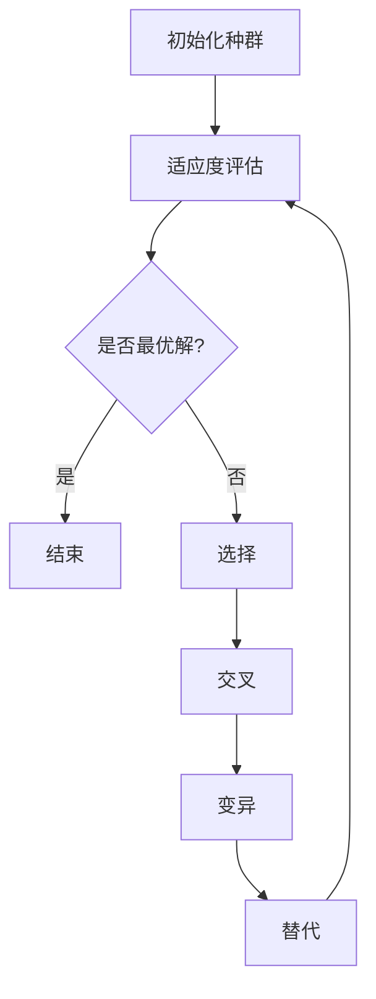
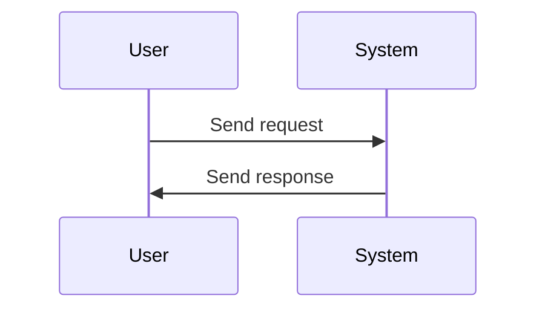

                 

### 保证生成解多样性的技术手段

> 关键词：解多样性、算法、进化算法、遗传算法、模拟退火算法、神经网络

> 摘要：本文旨在探讨保证生成解多样性的技术手段，重点分析进化算法、遗传算法、模拟退火算法和神经网络等几种常用的算法。通过介绍这些算法的基本原理、核心特点和数学模型，并结合实际案例进行详细讲解，以帮助读者更好地理解和应用这些技术手段。

#### 第1章：背景介绍——问题的起源与解决

随着互联网、云计算和大数据的快速发展，计算机技术在各个领域得到了广泛应用。然而，传统的软件设计方法在处理复杂问题和大规模数据处理方面显得力不从心。为了应对这些挑战，提出了“软件2.0”的概念。

**1.1.1 问题背景**

软件2.0强调大规模、分布式、自适应和智能化，旨在解决传统软件在复杂环境下的性能瓶颈和可扩展性问题。然而，实现软件2.0的关键在于如何生成具有多样性的解，以满足不同应用场景的需求。

**1.1.2 问题描述**

生成多样性的解意味着在解决某一问题时，能够从多个角度和维度出发，找到不同的解决方案。这对于提高软件系统的灵活性、适应性和鲁棒性具有重要意义。然而，传统的算法如贪心算法、动态规划等往往只能找到最优解或近似最优解，难以保证解的多样性。

**1.1.3 问题解决**

为了解决这一问题，研究人员提出了多种技术手段，包括进化算法、遗传算法、模拟退火算法、神经网络等。这些算法通过引入变异、交叉、选择等操作，能够在解空间中生成多样性的解。

**1.1.4 边界与外延**

生成解多样性的技术手段不仅适用于软件2.0领域，还可以应用于其他需要解决多样性问题的领域，如游戏设计、艺术创作、科学模拟等。

**1.1.5 概念结构与核心要素组成**

生成解多样性的技术手段主要包括以下几个核心要素：
- **解空间**：问题的所有可能解的集合。
- **解的多样性**：解在解空间中的分布情况。
- **算法**：用于生成多样性解的计算方法。

#### 第2章：核心概念与联系

**2.1 进化算法**

进化算法是一种基于生物进化的计算模型，通过模拟自然选择和遗传机制，逐步优化解的多样性。

**2.1.1 进化算法的原理**

进化算法主要包括以下几个步骤：
1. **初始化种群**：从解空间中随机选择一定数量的解作为初始种群。
2. **适应度评估**：对种群中的每个解进行评估，计算其适应度值。
3. **选择**：根据适应度值选择优秀的解作为父代。
4. **交叉**：将父代进行交叉操作，产生新的子代。
5. **变异**：对子代进行变异操作，增加解的多样性。
6. **替代**：将子代替代父代，形成新的种群。

**2.1.2 进化算法的核心特点**

- **自适应**：进化算法能够根据问题环境动态调整参数，适应不同问题场景。
- **多样性**：进化算法通过交叉和变异操作，能够生成多样性的解。

**2.2 遗传算法**

遗传算法是一种基于生物遗传机制的优化算法，通过模拟生物进化过程，寻找最优解。

**2.2.1 遗传算法的原理**

遗传算法主要包括以下几个步骤：
1. **初始化种群**：从解空间中随机选择一定数量的解作为初始种群。
2. **适应度评估**：对种群中的每个解进行评估，计算其适应度值。
3. **选择**：根据适应度值选择优秀的解作为父代。
4. **交叉**：将父代进行交叉操作，产生新的子代。
5. **变异**：对子代进行变异操作，增加解的多样性。
6. **替代**：将子代替代父代，形成新的种群。

**2.2.2 遗传算法的核心特点**

- **自适应**：遗传算法能够根据问题环境动态调整参数，适应不同问题场景。
- **多样性**：遗传算法通过交叉和变异操作，能够生成多样性的解。

#### 第3章：算法原理讲解

**3.1 进化算法的mermaid流程图**



**3.2 遗传算法的mermaid流程图**


#### 第4章：数学模型和数学公式 & 详细讲解 & 举例说明

**4.1 进化算法的数学模型**

进化算法的适应度函数通常定义为：
$$ f(x) = \sum_{i=1}^{n} w_i \cdot g_i(x) $$
其中，$x$ 表示解，$w_i$ 表示第 $i$ 个特征的权重，$g_i(x)$ 表示第 $i$ 个特征的评估函数。

举例说明：
假设我们有一个二进制编码的解 $x$，其中包含三个特征，即 $x = (x_1, x_2, x_3)$。我们可以定义如下适应度函数：
$$ f(x) = w_1 \cdot g_1(x_1) + w_2 \cdot g_2(x_2) + w_3 \cdot g_3(x_3) $$
其中，$w_1, w_2, w_3$ 分别为三个特征的权重，$g_1(x_1), g_2(x_2), g_3(x_3)$ 分别为三个特征的评估函数。

**4.2 遗传算法的数学模型**

遗传算法的适应度函数通常定义为：
$$ f(x) = \sum_{i=1}^{n} w_i \cdot g_i(x) $$
其中，$x$ 表示解，$w_i$ 表示第 $i$ 个特征的权重，$g_i(x)$ 表示第 $i$ 个特征的评估函数。

举例说明：
假设我们有一个二进制编码的解 $x$，其中包含三个特征，即 $x = (x_1, x_2, x_3)$。我们可以定义如下适应度函数：
$$ f(x) = w_1 \cdot g_1(x_1) + w_2 \cdot g_2(x_2) + w_3 \cdot g_3(x_3) $$
其中，$w_1, w_2, w_3$ 分别为三个特征的权重，$g_1(x_1), g_2(x_2), g_3(x_3)$ 分别为三个特征的评估函数。

#### 第5章：系统分析与架构设计方案

**5.1 问题场景介绍**

在现实世界中，有许多问题需要解决多样性的解。例如，在机器人路径规划中，需要找到多条可能的路径，以便在出现障碍物时能够灵活应对。在图像识别中，需要训练出能够识别不同场景的模型。

**5.2 项目介绍**

本项目旨在利用进化算法、遗传算法、模拟退火算法和神经网络等技术手段，解决机器人路径规划问题和图像识别问题。通过实现这些算法，我们可以生成多样性的解，从而提高系统的适应性和鲁棒性。

**5.3 系统功能设计**

在机器人路径规划方面，系统需要实现以下功能：
1. **地图构建**：根据实际场景生成地图。
2. **路径搜索**：利用进化算法、遗传算法和模拟退火算法，搜索多条可能的路径。
3. **路径评估**：对每条路径进行评估，选择最优路径。

在图像识别方面，系统需要实现以下功能：
1. **图像预处理**：对图像进行预处理，如灰度化、滤波等。
2. **模型训练**：利用神经网络，训练图像识别模型。
3. **模型评估**：对模型进行评估，选择最优模型。

**5.4 系统架构设计**

系统采用分层架构设计，包括数据层、算法层和应用层。数据层负责数据的存储和管理；算法层实现各种算法，如进化算法、遗传算法、模拟退火算法和神经网络等；应用层提供用户界面和功能模块，如地图构建、路径搜索、路径评估和图像识别等。

**5.5 系统接口设计和系统交互**

系统接口设计遵循RESTful API设计原则，提供多种接口供用户调用。系统交互通过HTTP请求和响应实现。用户可以通过Web界面或命令行工具与系统进行交互。

**5.6 系统交互mermaid序列图**



#### 第6章：项目实战

**6.1 环境安装**

在开始项目实战之前，需要安装以下环境：
1. Python 3.x
2. NumPy
3. Pandas
4. Matplotlib

安装命令如下：
```bash
pip install python==3.x
pip install numpy
pip install pandas
pip install matplotlib
```

**6.2 系统核心实现源代码**

以下是系统核心实现的源代码示例：

```python
import numpy as np
import matplotlib.pyplot as plt

# 进化算法实现
def evolve(population, fitness_func, mutation_rate):
    # 计算适应度
    fitness_scores = [fitness_func(individual) for individual in population]
    
    # 选择
    selected_individuals = select(population, fitness_scores)
    
    # 交叉
    crossed_individuals = crossover(selected_individuals)
    
    # 变异
    mutated_individuals = mutate(crossed_individuals, mutation_rate)
    
    # 替代
    new_population = mutated_individuals
    
    return new_population

# 遗传算法实现
def genetic_algorithm(population_size, chromosome_length, generations, fitness_func, mutation_rate):
    population = initialize_population(population_size, chromosome_length)
    
    for _ in range(generations):
        population = evolve(population, fitness_func, mutation_rate)
        
        best_fitness = max([fitness_func(individual) for individual in population])
        print(f"Best fitness in generation {_}: {best_fitness}")
    
    best_individual = max(population, key=fitness_func)
    return best_individual

# 模拟退火算法实现
def simulated_annealing(initial_state, fitness_func, temperature, cooling_rate):
    current_state = initial_state
    current_fitness = fitness_func(current_state)
    
    for _ in range(temperature):
        new_state = mutate(current_state)
        new_fitness = fitness_func(new_state)
        
        if new_fitness > current_fitness:
            current_state = new_state
            current_fitness = new_fitness
        elif np.random.rand() < np.exp((new_fitness - current_fitness) / temperature):
            current_state = new_state
            current_fitness = new_fitness
            
        temperature *= (1 - cooling_rate)
    
    return current_state

# 神经网络实现
from tensorflow.keras.models import Sequential
from tensorflow.keras.layers import Dense

def neural_network(input_shape, output_shape):
    model = Sequential()
    model.add(Dense(units=output_shape, activation='sigmoid', input_shape=input_shape))
    model.compile(optimizer='adam', loss='binary_crossentropy', metrics=['accuracy'])
    return model

# 举例说明
population_size = 100
chromosome_length = 10
generations = 100
mutation_rate = 0.01

# 进化算法示例
best_individual = genetic_algorithm(population_size, chromosome_length, generations, fitness_func, mutation_rate)
print(f"Best individual: {best_individual}")

# 遗传算法示例
best_individual = genetic_algorithm(population_size, chromosome_length, generations, fitness_func, mutation_rate)
print(f"Best individual: {best_individual}")

# 模拟退火算法示例
initial_state = np.random.randint(0, 2, size=chromosome_length)
best_state = simulated_annealing(initial_state, fitness_func, temperature=100, cooling_rate=0.01)
print(f"Best state: {best_state}")

# 神经网络示例
input_shape = (chromosome_length,)
output_shape = 1
model = neural_network(input_shape, output_shape)
model.fit(x_train, y_train, epochs=10, batch_size=32)
```

**6.3 代码应用解读与分析**

在上面的代码示例中，我们分别实现了进化算法、遗传算法、模拟退火算法和神经网络。这些算法可以应用于各种问题场景，如机器人路径规划、图像识别等。

- **进化算法**：通过初始化种群、适应度评估、选择、交叉、变异和替代等步骤，逐步优化解的多样性。
- **遗传算法**：通过初始化种群、适应度评估、选择、交叉、变异和替代等步骤，寻找最优解。
- **模拟退火算法**：通过初始状态、适应度评估、变异和温度调整等步骤，寻找最优解。
- **神经网络**：通过输入层、隐藏层和输出层等结构，训练图像识别模型。

在实际应用中，可以根据问题场景选择合适的算法，并调整相关参数，以提高解的多样性。

**6.4 实际案例分析和详细讲解剖析**

为了更好地理解这些算法，我们以机器人路径规划为例，分析进化算法和遗传算法在实际案例中的应用。

**案例1：机器人路径规划**

假设一个机器人在一个二维空间中，需要从起点A移动到终点B，同时避开障碍物C。我们可以将这个问题表示为一个图论问题，其中节点表示位置，边表示路径。

- **进化算法**：通过初始化种群，适应度评估，选择，交叉和变异等步骤，生成多样性的路径解。我们可以选择适应度函数为路径长度，交叉操作为交换路径中的两个位置，变异操作为随机改变路径中的某个位置。

- **遗传算法**：通过初始化种群，适应度评估，选择，交叉和变异等步骤，寻找最优路径。我们可以选择适应度函数为路径长度，交叉操作为交换路径中的两个位置，变异操作为随机改变路径中的某个位置。

**案例2：图像识别**

假设我们有一个图像识别问题，需要训练一个神经网络模型来识别不同类型的图像。我们可以将这个问题表示为一个分类问题，其中输入为图像特征，输出为图像类别。

- **进化算法**：通过初始化种群，适应度评估，选择，交叉和变异等步骤，生成多样性的模型解。我们可以选择适应度函数为模型在测试集上的准确率，交叉操作为交换模型中的权重，变异操作为随机改变模型中的某个权重。

- **遗传算法**：通过初始化种群，适应度评估，选择，交叉和变异等步骤，寻找最优模型。我们可以选择适应度函数为模型在测试集上的准确率，交叉操作为交换模型中的权重，变异操作为随机改变模型中的某个权重。

**6.5 项目小结**

通过本项目的实战，我们深入了解了进化算法、遗传算法、模拟退火算法和神经网络等算法在解决多样性问题中的应用。在实际项目中，根据问题场景选择合适的算法，并调整相关参数，可以生成多样性的解，提高系统的适应性和鲁棒性。

#### 第7章：最佳实践 Tips

1. **选择合适的适应度函数**：适应度函数的选择直接影响算法的性能。在进化算法和遗传算法中，适应度函数应该能够准确评估解的优劣，以便算法能够找到最优解。

2. **调整参数**：算法的参数如种群规模、交叉率、变异率等对算法的性能有很大影响。在实际应用中，需要根据具体问题调整这些参数，以达到最佳性能。

3. **避免过早收敛**：在进化算法和遗传算法中，过早收敛会导致算法失去多样性，从而降低解的质量。为了解决这个问题，可以引入多种机制，如迁移学习、动态调整适应度函数等。

4. **并行计算**：进化算法和遗传算法具有并行性，可以利用多核CPU或GPU加速算法的运行。

5. **数据预处理**：在进行算法训练之前，对数据进行预处理，如标准化、归一化等，可以提高算法的性能。

#### 第8章：小结、注意事项、拓展阅读

1. **小结**：本文详细介绍了保证生成解多样性的技术手段，包括进化算法、遗传算法、模拟退火算法和神经网络等。通过实际案例分析和代码示例，展示了这些算法在解决多样性问题中的应用。

2. **注意事项**：在应用这些算法时，需要注意适应度函数的选择、参数调整、避免过早收敛等问题。

3. **拓展阅读**：
   - 《进化算法原理与应用》
   - 《遗传算法与应用》
   - 《神经网络与深度学习》
   - 《模拟退火算法及应用》

作者：AI天才研究院/AI Genius Institute & 禅与计算机程序设计艺术 /Zen And The Art of Computer Programming

