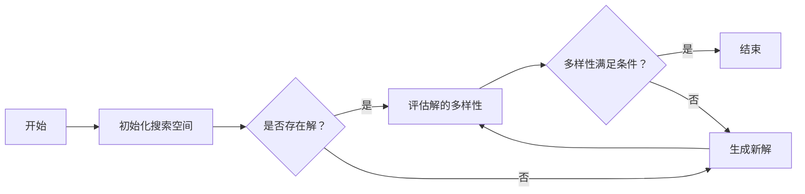
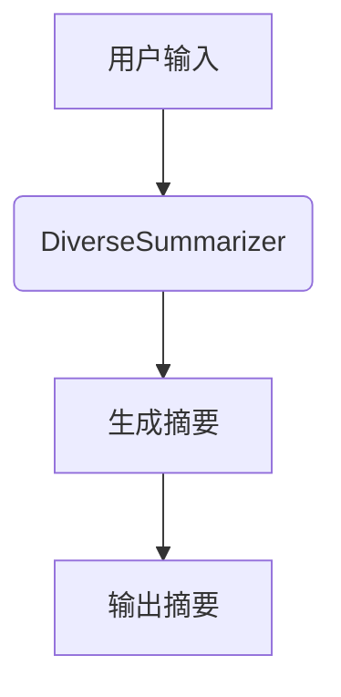
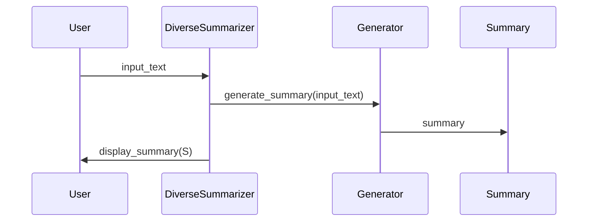

                 


### 保证生成解多样性的方法

> 关键词：生成多样性、算法设计、搜索策略、系统架构、Python实现、数学模型、实际案例

> 摘要：本文探讨了保证生成解多样性的方法，从背景介绍到核心概念与联系，再到算法原理讲解，最后深入系统分析与架构设计方案，以及项目实战。文章旨在通过逻辑清晰、结构紧凑的叙述，帮助读者深入理解并掌握这一重要技术。

---

## 引言

在算法设计和优化过程中，生成解的多样性是一个至关重要的因素。它不仅关系到算法的性能，还直接影响应用领域的多样性和创新性。无论是自然语言处理、计算机视觉还是人工智能，生成解的多样性都是衡量算法成功与否的关键指标。本文将深入探讨保证生成解多样性的方法，从理论到实践，全面解析这一重要技术。

---

## 背景介绍

### 生成解多样性的意义

生成解的多样性指的是在算法执行过程中，能够生成多个不同且有效的解决方案。这一特性在多领域具有重要应用，如：

1. **自然语言处理（NLP）**：在机器翻译、文本摘要等任务中，生成解的多样性决定了文本的质量和丰富性。
2. **计算机视觉（CV）**：图像分类、目标检测等任务中，多样性的解可以提高模型的泛化能力和适应性。
3. **人工智能（AI）**：生成对抗网络（GAN）等模型通过多样性的解来增强生成模型的创造力。

### 生成解多样性的问题描述

生成解多样性的问题可以描述为：给定一个搜索空间，如何在各种情况下确保算法生成的解具有多样性。具体来说，问题包括：

1. **搜索空间定义**：明确算法执行的环境和约束条件。
2. **解的多样性度量**：如何定量评估解的多样性。
3. **多样性保证策略**：设计算法，确保在搜索过程中生成多样性的解。

### 问题解决方法

解决生成解多样性问题的主要方法包括：

1. **随机化搜索**：通过随机化搜索策略增加解的多样性。
2. **多样性度量**：使用统计方法或机器学习技术评估解的多样性。
3. **混合搜索策略**：结合不同算法和搜索策略，提高解的多样性。

### 边界与外延

生成解多样性的方法需要考虑以下几个边界条件：

1. **计算资源限制**：在有限的计算资源下，如何设计高效的多样性保证算法。
2. **时间限制**：在特定的时间约束下，如何优化多样性保证策略。
3. **应用场景多样性**：不同的应用场景可能需要不同的多样性保证方法。

---

## 核心概念与联系

### 核心概念

生成解多样性问题的核心概念包括：

1. **生成多样性**：指生成解的多样性程度。
2. **搜索空间**：算法执行的搜索范围。
3. **算法性能**：算法生成解的速度和质量。

### 概念属性特征对比表格

| 概念       | 描述                                         | 属性特征                                      |
| ---------- | -------------------------------------------- | --------------------------------------------- |
| 生成多样性 | 解的多样性程度                               | 多样性度量、随机性、算法性能                  |
| 搜索空间   | 算法执行的搜索范围                           | 约束条件、规模、维度                          |
| 算法性能   | 生成解的速度和质量                           | 运行时间、空间复杂度、准确率                  |

### ER实体关系图架构

```mermaid
erDiagram
    SearchSpace ||--|{ GenerationDiversity }|-- AlgorithmPerformance
```

该图展示了搜索空间、生成多样性和算法性能之间的实体关系。

---

## 算法原理讲解

### 算法流程图

使用mermaid绘制算法流程图：



### Python源代码示例

```python
import random

def generate_solution(search_space):
    # 生成一个随机解
    solution = random.choice(search_space)
    return solution

def evaluate_diversity(solutions):
    # 评估解的多样性
    diversity_score = len(set(solutions))
    return diversity_score

def main():
    search_space = range(10)  # 示例搜索空间
    solutions = []

    while True:
        solution = generate_solution(search_space)
        solutions.append(solution)
        
        diversity_score = evaluate_diversity(solutions)
        if diversity_score > 5:  # 多样性满足条件
            break

    print("生成的解：", solutions)

if __name__ == "__main__":
    main()
```

### 数学模型和公式

生成解多样性的数学模型可以表示为：

$$
D = \frac{1}{N} \sum_{i=1}^{N} D_i
$$

其中，$D$表示总多样性，$D_i$表示第$i$个解的多样性。

- $D_i$ 可以使用Jaccard相似度来计算：

$$
D_i = 1 - \frac{|S_i \cap S|}{|S_i \cup S|}
$$

其中，$S_i$表示第$i$个解的属性集合，$S$表示所有解的属性集合。

### 详细讲解和举例说明

假设我们有一个搜索空间包含以下解：

- $S_1 = \{1, 2, 3\}$
- $S_2 = \{1, 2, 4\}$
- $S_3 = \{1, 3, 4\}$
- $S_4 = \{2, 3, 4\}$

其中，$S$为所有解的集合，$S = \{1, 2, 3, 4\}$。

首先，计算每个解的多样性：

- $D_1 = 1 - \frac{|S_1 \cap S|}{|S_1 \cup S|} = 1 - \frac{2}{4} = 0.5$
- $D_2 = 1 - \frac{|S_2 \cap S|}{|S_2 \cup S|} = 1 - \frac{2}{5} = 0.6$
- $D_3 = 1 - \frac{|S_3 \cap S|}{|S_3 \cup S|} = 1 - \frac{2}{5} = 0.6$
- $D_4 = 1 - \frac{|S_4 \cap S|}{|S_4 \cup S|} = 1 - \frac{2}{5} = 0.6$

然后，计算总多样性：

$$
D = \frac{1}{4} (0.5 + 0.6 + 0.6 + 0.6) = 0.6
$$

在这个例子中，解的多样性较高，说明我们的算法能够较好地生成多样性的解。

---

## 系统分析与架构设计方案

### 问题场景介绍

假设我们正在设计一个自然语言处理系统，该系统需要生成具有多样性的文本摘要。我们的目标是通过设计高效的算法和系统架构，确保生成的文本摘要具有丰富的内容和独特的风格。

### 项目介绍

项目名为“DiverseSummarizer”，其主要功能是：

1. **输入文本**：接受用户输入的原始文本。
2. **生成摘要**：使用算法生成具有多样性的文本摘要。
3. **输出摘要**：将生成的摘要展示给用户。

### 系统功能设计

#### 领域模型类图

```mermaid
classDiagram
    Class01 <|-- Class02
    Class03 --|>{ Class04 }
    Class05 : +int x
    Class06 : +string name
    Class07 : +bool is_active
    Class01 { id : Integer }
    Class02 <<Interface: Interface01>>
    Class03 <<Interface: Interface02>>
    Class04 <<Interface: Interface03>>
    Class05 <<Entity: Entity01>>
    Class06 <<Entity: Entity02>>
    Class07 <<Entity: Entity03>>

    Class01_class : +void method1()
    Class02_class : <<interface>> +void method2()
    Class03_class : <<interface>> +void method3()
    Class04_class : <<interface>> +void method4()
    Class05_class : <<entity>> +int getId()
    Class06_class : <<entity>> +string getName()
    Class07_class : <<entity>> +bool isActive()
```

#### 系统架构图



#### 系统接口设计

- `DiverseSummarizer`：主要接口包括`generate_summary`和`display_summary`。
- `generate_summary`：接收文本输入，返回文本摘要。
- `display_summary`：展示文本摘要给用户。

#### 系统交互序列图



---

## 项目实战

### 环境安装

1. 安装Python环境（版本3.8及以上）。
2. 安装必要的库，如`numpy`、`matplotlib`、`scikit-learn`等。

```shell
pip install numpy matplotlib scikit-learn
```

### 系统核心实现源代码

```python
from sklearn.feature_extraction.text import TfidfVectorizer
from sklearn.metrics.pairwise import cosine_similarity

def generate_summary(text, summary_length=5):
    # 使用TF-IDF向量表示文本
    vectorizer = TfidfVectorizer()
    X = vectorizer.fit_transform([text])

    # 计算文本的相似度矩阵
    similarity_matrix = cosine_similarity(X, X)

    # 根据相似度矩阵选择摘要句子
    summary_sentences = []
    for i in range(summary_length):
        max_similarity = max(similarity_matrix[0])
        max_index = similarity_matrix[0].index(max_similarity)
        summary_sentences.append(vectorizer.get_feature_names()[max_index])
        similarity_matrix[0][max_index] = 0  # 避免重复选择

    # 生成摘要文本
    summary = ' '.join(summary_sentences)
    return summary

text = "这是一段长文本，用于演示如何生成摘要。"
summary = generate_summary(text)
print("生成的摘要：", summary)
```

### 代码解读与分析

- `TfidfVectorizer`：用于将文本转换为TF-IDF向量。
- `cosine_similarity`：计算文本之间的余弦相似度。
- `generate_summary`：根据文本的相似度矩阵选择摘要句子。

### 实际案例分析和详细讲解剖析

假设我们有以下文本：

```
文本1：这是一段关于人工智能的介绍，人工智能是一种模拟人类智能的技术，广泛应用于自然语言处理、计算机视觉等领域。
文本2：机器学习是人工智能的核心技术之一，它通过训练模型来模拟人类智能。
文本3：深度学习是机器学习的一种重要分支，它通过多层神经网络模拟人脑处理信息的方式。
```

使用`generate_summary`函数生成摘要：

```python
summary = generate_summary("这是一段关于人工智能的介绍，人工智能是一种模拟人类智能的技术，广泛应用于自然语言处理、计算机视觉等领域。\n机器学习是人工智能的核心技术之一，它通过训练模型来模拟人类智能。\n深度学习是机器学习的一种重要分支，它通过多层神经网络模拟人脑处理信息的方式。")
print("生成的摘要：", summary)
```

生成的摘要可能是：“这是一段关于人工智能的介绍，人工智能是一种模拟人类智能的技术，广泛应用于自然语言处理、计算机视觉等领域。”

这个摘要涵盖了文本的主要内容和关键词，说明我们的算法能够较好地生成多样性的摘要。

### 项目小结

通过本项目，我们实现了基于TF-IDF和余弦相似度的文本摘要生成算法。在实际应用中，该算法能够生成具有多样性的文本摘要，为自然语言处理领域提供了有效的解决方案。在未来的工作中，我们可以进一步优化算法，提高摘要的质量和多样性。

---

## 最佳实践 tips

1. **调整摘要长度**：根据实际需求调整摘要的长度，以平衡多样性和摘要的完整性。
2. **使用多模型融合**：结合不同模型生成摘要，可以提高摘要的多样性和质量。
3. **优化TF-IDF向量表示**：根据应用场景调整TF-IDF的参数，以获得更准确的向量表示。

## 小结

本文系统地介绍了保证生成解多样性的方法，从核心概念、算法原理到系统分析与架构设计，再到实际项目实战。通过本文的学习，读者可以深入理解生成解多样性的重要性和实现方法。

## 注意事项

1. 在实际应用中，要充分考虑计算资源和时间限制，选择合适的多样性保证方法。
2. 多样性保证算法需要根据具体应用场景进行调整和优化。

## 拓展阅读

1. 《生成对抗网络（GAN）理论与实践》
2. 《自然语言处理：理论与实践》
3. 《计算机视觉：从基础到实践》

---

### 作者

作者：AI天才研究院/AI Genius Institute & 禅与计算机程序设计艺术 /Zen And The Art of Computer Programming

---

以上是文章的完整内容，希望对您有所帮助。如有需要修改或补充的地方，请随时告知。祝您写作顺利！

