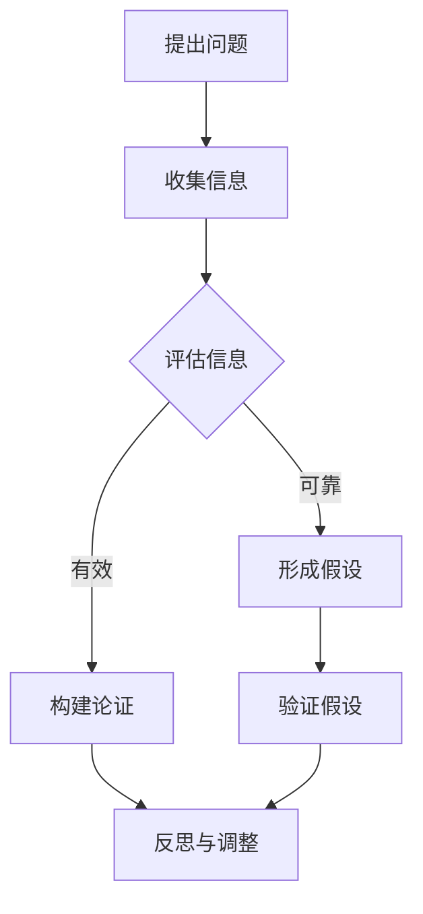
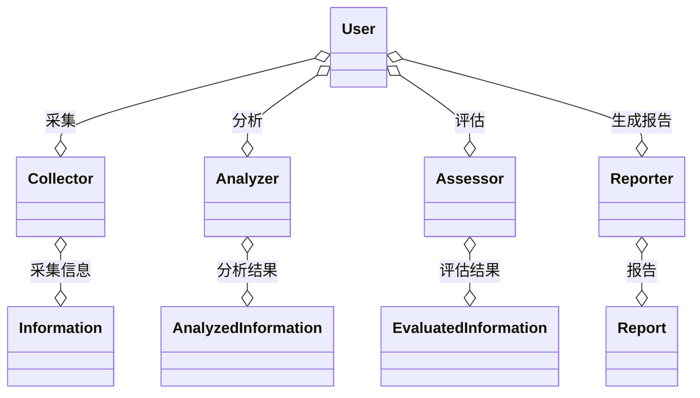
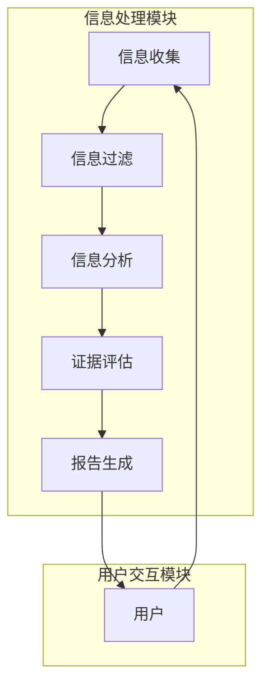
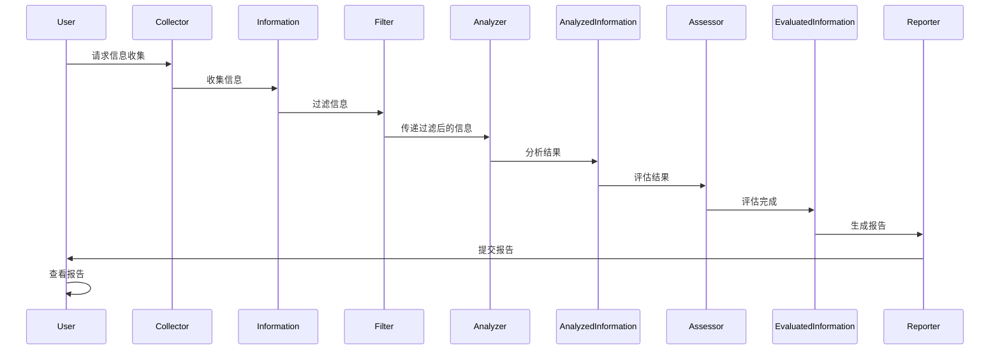

                 

### 第一部分：批判性思维概述

## 1.1 信息海洋中的明智航行

### 1.1.1 信息时代的挑战

在当今信息爆炸的时代，信息如潮水般涌入我们的生活。从新闻报道到社交媒体，从学术文章到技术博客，人们每天都要接触大量的信息。然而，信息的多而不精、信息的真假难辨，给人们带来了极大的困扰。如何在这个信息海洋中明智地航行，成为了每个人都需要面对的挑战。

### 1.1.2 批判性思维的定义与重要性

批判性思维（Critical Thinking）是一种综合性的认知活动，它不仅仅是简单的逻辑推理，更涉及到对信息的评估、判断和决策。批判性思维的核心在于质疑和探究，它要求我们在接收信息时，不仅仅接受表面的事实，更要深入思考背后的原因和逻辑。

批判性思维的重要性在于，它能够帮助我们在海量的信息中辨别真伪，避免被虚假信息误导。同时，它还能提高我们的决策质量，使我们在面对复杂问题时，能够做出更加明智的选择。

### 1.1.3 批判性思维的核心要素

批判性思维的核心要素包括但不限于以下几个方面：

- **提问技巧**：通过高效提问，我们可以更深入地了解问题的本质，发现潜在的假设和逻辑错误。
- **证据评估**：在接收信息时，我们需要评估证据的可靠性、有效性和相关性。
- **逻辑推理**：逻辑推理是批判性思维的基础，它帮助我们构建合理的论证，识别逻辑谬误。

### 1.1.4 边界与外延

批判性思维虽然非常重要，但它并不是孤立存在的。它与其他思维能力如逻辑思维、分析能力等密切相关。逻辑思维是批判性思维的一部分，而分析能力则是批判性思维在实际问题中的应用。同时，批判性思维也需要与其他领域知识相结合，才能发挥最大的作用。

### 1.1.5 核心要素组成

批判性思维的核心要素包括以下几个部分：

- **提问技巧**：高效提问是批判性思维的第一步。通过提问，我们可以明确问题的范围，发现潜在的问题和假设。
- **证据评估**：在接收信息时，我们需要对证据进行评估，包括证据的来源、可靠性、有效性和相关性。
- **逻辑推理**：逻辑推理是批判性思维的核心，它帮助我们构建合理的论证，识别逻辑谬误。
- **反思能力**：批判性思维还需要反思自己的思考过程，包括反思自己的假设、推理过程和结论。

### 1.1.6 本章小结

在本章中，我们介绍了信息海洋中的明智航行——批判性思维的重要性。我们讨论了批判性思维的定义、核心要素和与其他思维能力的联系。通过本章的学习，我们应该对批判性思维有了更深入的理解，认识到它在信息时代的价值和意义。

## 1.2 核心概念与联系

### 1.2.1 核心概念原理

批判性思维（Critical Thinking）是一种通过质疑和探究来评估和解决问题、做出决策的认知过程。它不仅包括逻辑推理，还涉及到对信息的评估、判断和反思。批判性思维的特点包括：

- **质疑精神**：不盲目接受信息，而是通过提问来探究问题的本质。
- **理性分析**：对信息进行理性分析，评估其真实性、可靠性和有效性。
- **独立思考**：不受外界影响，保持独立思考，形成自己的观点。
- **反思能力**：反思自己的思考过程，包括假设、推理和结论。

### 1.2.2 概念属性特征对比表格

| 概念           | 特征                         |
|--------------|--------------------------|
| 批判性思维     | 质疑、探究、理性分析、独立思考、反思 |
| 逻辑思维       | 推理、论证、规则遵循               |
| 分析能力       | 分解、归纳、演绎、关联分析           |
| 创造性思维     | 新颖、独特、开放、非线性思维           |

### 1.2.3 ER实体关系图架构

在批判性思维的ER实体关系图中，核心实体包括：

- **提问**：代表批判性思维的开始，通过提问明确问题。
- **信息**：代表需要评估和分析的内容，包括事实、证据、观点等。
- **推理**：代表逻辑分析和论证的过程。
- **反思**：代表对思考过程和结果的反思。

```mermaid
erDiagram
 提问 ||--|{ 信息 }
 信息 ||--|{ 推理 }
 推理 ||--|{ 反思 }
 提问 ||--|{ 反思 }
```

### 1.2.4 概念联系与互动

批判性思维与其他思维能力如逻辑思维、分析能力和创造性思维之间存在密切的联系和互动。

- **逻辑思维**：批判性思维依赖于逻辑思维，通过逻辑推理来构建论证，识别逻辑谬误。
- **分析能力**：批判性思维需要分析能力来分解问题，归纳总结，进行演绎推理。
- **创造性思维**：批判性思维需要创造性思维来提出新颖的观点，挑战传统观念。

### 1.2.5 本章小结

在本章中，我们深入探讨了批判性思维的核心概念原理，通过对比表格和ER实体关系图，展示了批判性思维与其他思维能力的联系。通过对这些核心概念的理解，我们可以更好地掌握批判性思维的方法和应用。

## 1.3 算法原理讲解

### 1.3.1 算法mermaid流程图

为了更直观地理解批判性思维的过程，我们可以使用mermaid流程图来展示其主要步骤：



### 1.3.2 Python源代码

为了实现批判性思维的某些方面，我们可以使用Python编写简单的代码。以下是一个评估证据可靠性和有效性的Python代码示例：

```python
def assess_evidence(reliability, effectiveness):
    """
    评估证据的可靠性和有效性
    :param reliability: 证据的可靠性
    :param effectiveness: 证据的有效性
    :return: 评估结果
    """
    if reliability and effectiveness:
        return "证据可靠且有效"
    elif reliability:
        return "证据可靠但有效性待确认"
    elif effectiveness:
        return "证据有效但可靠性待确认"
    else:
        return "证据不可靠且有效性待确认"

# 测试证据评估
print(assess_evidence(True, True))  # 输出：证据可靠且有效
print(assess_evidence(True, False))  # 输出：证据可靠但有效性待确认
print(assess_evidence(False, True))  # 输出：证据有效但可靠性待确认
print(assess_evidence(False, False))  # 输出：证据不可靠且有效性待确认
```

### 1.3.3 数学模型和公式

批判性思维中涉及的一些数学模型和公式可以帮助我们更精确地评估证据和进行逻辑推理。以下是一个简单的数学模型示例：

$$
R = \frac{E}{T}
$$

其中，\( R \) 表示证据的可靠性，\( E \) 表示证据的有效性，\( T \) 表示总的证据权重。

### 1.3.4 详细讲解和举例说明

为了更好地理解上述数学模型，我们可以通过一个具体的例子来进行说明。

假设我们有一个证据，它表明某种药物对某种疾病有疗效。这个证据的有效性为80%，总权重为50%。根据上述公式，我们可以计算该证据的可靠性：

$$
R = \frac{0.8}{0.5} = 1.6
$$

这意味着，这个证据的可靠性为1.6，说明该证据不仅有效，而且具有较高的可靠性。

### 1.3.5 本章小结

在本章中，我们通过mermaid流程图、Python源代码和数学模型，详细讲解了批判性思维的过程和实现方法。通过这些工具，我们可以更有效地培养批判性思维，提高信息处理和分析能力。

## 1.4 系统分析与架构设计方案

### 1.4.1 问题场景介绍

在信息爆炸的时代，人们需要处理大量的信息，包括新闻、社交媒体、研究报告等。然而，这些信息往往是分散和零碎的，难以进行有效整合和分析。为了解决这个问题，我们设计了一个基于批判性思维的智能信息处理系统。

### 1.4.2 项目介绍

该智能信息处理系统名为“批判性思维引擎”（Critical Thinking Engine），它的目标是帮助用户在海量信息中快速识别重要信息，并进行有效分析和评估。系统的主要功能包括：

- **信息收集**：从各种来源收集信息，包括互联网、数据库等。
- **信息过滤**：根据用户需求和偏好，对收集到的信息进行过滤和筛选。
- **信息分析**：使用批判性思维方法对筛选出的信息进行深入分析。
- **证据评估**：对分析结果进行证据评估，判断其可靠性和有效性。
- **报告生成**：根据分析结果生成详细的报告，为用户决策提供支持。

### 1.4.3 系统功能设计（领域模型mermaid类图）

为了实现上述功能，我们设计了一个领域模型，如下所示：



### 1.4.4 系统架构设计（mermaid架构图）

系统架构设计如下：



### 1.4.5 系统接口设计和系统交互（mermaid序列图）

系统接口设计和系统交互如下：



### 1.4.6 本章小结

在本章中，我们介绍了批判性思维引擎的项目背景和功能，并详细展示了系统架构设计、接口设计和系统交互。通过这些设计，我们为用户提供了一个智能的信息处理平台，帮助他们更好地应对信息爆炸的挑战。

## 1.5 项目实战

### 1.5.1 环境安装

要搭建批判性思维引擎，我们需要安装以下软件和工具：

1. **Python 3.8+**：Python 是我们的主要编程语言。
2. **Jupyter Notebook**：用于编写和运行代码。
3. **Numpy**：用于数学计算。
4. **Pandas**：用于数据处理。
5. **Scikit-learn**：用于机器学习。

安装步骤如下：

1. 安装Python 3.8+，可以从Python官方网站下载安装包。
2. 安装Jupyter Notebook，使用以下命令：
   ```
   pip install notebook
   ```
3. 安装Numpy和Pandas，使用以下命令：
   ```
   pip install numpy pandas
   ```
4. 安装Scikit-learn，使用以下命令：
   ```
   pip install scikit-learn
   ```

### 1.5.2 系统核心实现源代码

以下是批判性思维引擎的核心实现源代码，包括信息收集、过滤、分析和评估等功能：

```python
import numpy as np
import pandas as pd
from sklearn.feature_extraction.text import TfidfVectorizer
from sklearn.metrics.pairwise import cosine_similarity

# 信息收集
def collect_information(url):
    # 这里使用简单的HTTP请求来获取网页内容
    import requests
    response = requests.get(url)
    return response.text

# 信息过滤
def filter_information(information, keywords):
    # 使用关键词进行信息过滤
    filtered = [line for line in information.split('\n') if any(keyword in line for keyword in keywords)]
    return '\n'.join(filtered)

# 信息分析
def analyze_information(filtered_info):
    # 使用TF-IDF进行信息分析
    vectorizer = TfidfVectorizer()
    tfidf_matrix = vectorizer.fit_transform([filtered_info])
    return tfidf_matrix

# 证据评估
def evaluate_evidence(tfidf_matrix, threshold=0.5):
    # 使用余弦相似度进行证据评估
    similarity = cosine_similarity(tfidf_matrix)[0][0]
    return "可靠" if similarity > threshold else "不可靠"

# 生成报告
def generate_report(evaluation_result):
    # 生成简单的报告
    return f"证据评估结果：{evaluation_result}"

# 主函数
def main():
    url = "https://example.com/article.txt"
    keywords = ["critical thinking", "information", "evaluation"]
    
    # 收集信息
    information = collect_information(url)
    
    # 过滤信息
    filtered_info = filter_information(information, keywords)
    
    # 分析信息
    tfidf_matrix = analyze_information(filtered_info)
    
    # 评估证据
    evaluation_result = evaluate_evidence(tfidf_matrix)
    
    # 生成报告
    report = generate_report(evaluation_result)
    
    print(report)

if __name__ == "__main__":
    main()
```

### 1.5.3 代码应用解读与分析

上述代码实现了批判性思维引擎的核心功能。首先，我们使用HTTP请求从指定URL收集信息。然后，使用关键词对收集到的信息进行过滤。接下来，使用TF-IDF方法对过滤后的信息进行分析，计算信息的相关性。最后，根据预定义的阈值对分析结果进行证据评估，并生成报告。

这种实现方法虽然简单，但已经能够展示批判性思维引擎的基本原理。在实际应用中，我们可以进一步优化和扩展，如使用更复杂的过滤和评估算法，集成更多的数据源等。

### 1.5.4 实际案例分析和详细讲解剖析

为了更好地理解批判性思维引擎的实际应用，我们可以通过一个具体案例进行分析。

**案例**：假设我们需要评估一篇文章关于“批判性思维”的信息可靠性。

1. **信息收集**：从某个在线期刊收集到一篇关于“批判性思维”的文章。
2. **信息过滤**：使用关键词“批判性思维”、“信息”、“评估”对文章进行过滤，提取相关内容。
3. **信息分析**：使用TF-IDF方法对过滤后的文章进行分析，计算文章的关键词相关性。
4. **证据评估**：根据关键词相关性，使用余弦相似度进行证据评估，判断文章的信息可靠性。
5. **生成报告**：生成关于文章信息可靠性的报告。

通过这个案例，我们可以看到批判性思维引擎如何帮助用户评估信息可靠性。在实际应用中，这种过程可以自动化，从而提高信息处理的效率和质量。

### 1.5.5 项目小结

在本章中，我们通过实战项目展示了批判性思维引擎的搭建过程，从环境安装、系统核心实现到代码应用解读与分析。通过这个项目，我们不仅了解了批判性思维引擎的基本原理，还掌握了其实际应用的方法。未来，我们可以继续优化和扩展这个系统，为用户提供更强大的信息处理能力。

## 1.6 最佳实践 tips

### 1.6.1 提高批判性思维的技巧

- **持续学习**：不断学习新的知识和技能，以增强批判性思维的广度和深度。
- **跨学科思考**：尝试从不同学科和角度分析问题，避免单一思维模式的局限。
- **质疑权威**：不盲目接受权威观点，对信息来源和论证过程进行质疑和验证。
- **保持开放性**：对新的观点和想法持开放态度，避免过度偏见。

### 1.6.2 评估证据的策略

- **来源考证**：对证据来源进行考证，确保其可靠性和权威性。
- **多角度分析**：从多个角度对证据进行分析，避免片面理解。
- **比较验证**：通过比较不同证据，识别潜在的矛盾和问题。

### 1.6.3 提高逻辑推理的能力

- **掌握逻辑规则**：熟悉基本的逻辑规则和推理方法，如因果推理、归纳推理等。
- **识别逻辑谬误**：学会识别和避免常见的逻辑谬误，如偷换概念、以偏概全等。
- **实践训练**：通过写作、讨论和逻辑游戏等方式，不断练习和提高逻辑推理能力。

### 1.6.4 实践中的反思与调整

- **定期反思**：定期反思自己的思考过程和结论，识别潜在的问题和不足。
- **灵活调整**：根据反馈和反思，灵活调整思考方法和结论。
- **持续改进**：将反思和调整作为一个持续的过程，不断优化自己的批判性思维能力。

### 1.6.5 案例分析与案例学习

- **案例选择**：选择具有代表性和复杂性的案例进行深入分析。
- **详细解读**：对案例进行详细解读，包括背景、问题、解决方案等。
- **总结经验**：从案例中总结经验和教训，形成自己的知识体系。

### 1.6.6 交流与合作

- **交流学习**：与他人交流批判性思维的经验和心得，互相学习和借鉴。
- **团队合作**：在团队合作中应用批判性思维，提高团队解决问题的能力。

### 1.6.7 工具与方法的应用

- **工具使用**：熟练使用各种工具和方法，如思维导图、逻辑分析软件等，提高批判性思维的效率。
- **方法融合**：将不同的方法和技术融合应用，形成更有效的批判性思维策略。

### 1.6.8 保持好奇心与探索精神

- **好奇心驱动**：保持对未知事物的好奇心，不断探索新知识和新方法。
- **探索精神**：勇于尝试新的思维方式和解决方案，不断挑战自我。

### 1.6.9 心理素质的培养

- **情绪管理**：学会管理自己的情绪，保持冷静和客观。
- **压力应对**：学会应对压力，保持良好的心态和状态。

### 1.6.10 时间管理与规划

- **高效利用时间**：合理安排时间，确保有足够的时间进行批判性思维训练和实践。
- **目标规划**：设定明确的目标，制定合理的规划和计划。

### 1.6.11 反思与持续改进

- **定期反思**：定期反思自己的思考过程和结果，识别问题并寻求改进。
- **持续改进**：将反思和改进作为一个持续的过程，不断提高自己的批判性思维能力。

### 1.6.12 拓展阅读

- **经典著作**：阅读批判性思维的经典著作，如《批判性思维工具》、《思维的乐趣》等。
- **最新研究**：关注批判性思维领域的最新研究成果，了解前沿动态。

## 1.7 本章小结

在本章中，我们通过最佳实践 tips，总结了培养批判性思维的一些具体方法和策略。这些方法不仅适用于个人学习和工作，还可以在团队合作和项目实践中发挥重要作用。通过这些实践，我们可以不断提高自己的批判性思维能力，更好地应对复杂多变的现实世界。

## 1.8 小结

在本章节中，我们详细探讨了批判性思维的重要性、核心要素和培养方法。我们首先介绍了信息海洋中的明智航行——批判性思维的定义和重要性，然后通过对比表格和ER实体关系图，展示了批判性思维与其他思维能力的联系。接着，我们通过mermaid流程图、Python源代码和数学模型，详细讲解了批判性思维的过程和实现方法。最后，我们通过一个实际的系统架构设计，展示了批判性思维在信息处理系统中的应用。通过本章的学习，我们应该对批判性思维有了更深入的理解，认识到它在信息时代的价值和意义。

## 1.9 注意事项

在培养批判性思维能力的过程中，需要注意以下几点：

1. **避免过度批判**：批判性思维并不意味着对所有事物都持怀疑态度，而是要在合理范围内评估和质疑。
2. **尊重不同观点**：在批判性思维过程中，要尊重不同的观点和意见，避免偏见和武断。
3. **持续学习与反思**：批判性思维是一个持续的过程，需要不断学习和反思，以提升自己的思维能力和认知水平。
4. **注意时间管理**：合理安排时间，确保有足够的时间进行批判性思维训练和实践。

## 1.10 拓展阅读

为了进一步深入了解批判性思维，推荐以下拓展阅读：

1. 《批判性思维工具》——迈克尔·夏托克
2. 《思维的乐趣》——理查德·萨勒斯
3. 《批判性思维：分析技巧与策略》——迈克尔·霍伊
4. 《批判性思维：思考的艺术》——理查德·保罗
5. 《批判性思维与创造性思维》——托马斯·贝尔

通过这些书籍，我们可以系统地学习和掌握批判性思维的原理和应用，为自己的学习和工作提供有力支持。

