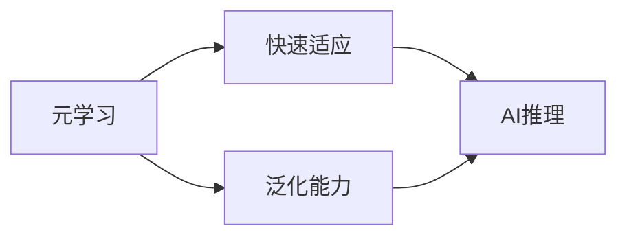
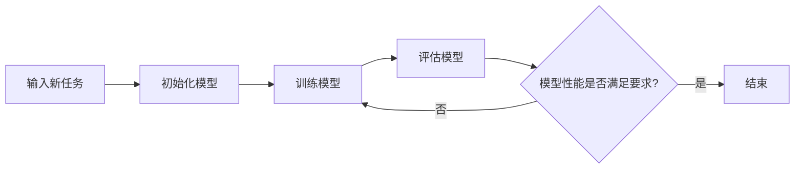
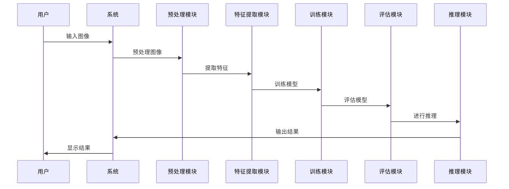

                 

# 元学习优化AI推理的快速适应与泛化能力提升

## 关键词
- 元学习
- AI推理
- 快速适应
- 泛化能力
- 优化

## 摘要
本文将探讨元学习在人工智能推理中的应用，分析其如何通过优化算法提升AI模型的快速适应和泛化能力。我们将从元学习的定义和重要性开始，逐步深入探讨其在AI推理中的具体应用和优化策略，并通过实际案例展示其效果。

## 引言

### 元学习的定义与基本概念

元学习，又称“学习如何学习”，是一种使模型能够快速适应新任务的学习方法。与传统机器学习方法不同，元学习关注的是如何让模型在面对不同任务时，能够通过较少的样本学习和调整，从而达到高效的性能。

### 元学习的重要性

在人工智能领域，随着数据规模的不断扩大和任务种类的日益多样化，传统的机器学习方法往往需要大量的数据进行训练，这导致计算资源和时间的巨大消耗。而元学习提供了一种解决方案，通过让模型学会如何学习，可以大幅减少对新任务的学习成本，提高模型的适应性和泛化能力。

### 元学习的简史

元学习的概念最早可以追溯到1980年代，当时心理学领域的研究者开始探索“如何学习如何学习”的问题。随着计算机科学的发展，元学习逐渐成为人工智能研究的一个重要分支。近年来，随着深度学习技术的兴起，元学习得到了更多关注和应用。

## AI推理中的挑战

### 传统AI推理的局限

传统的AI推理方法，如基于统计模型的机器学习算法，通常依赖于大量标记数据进行训练。这种方法在处理熟悉任务时效果较好，但在面对新的、未见过的情况时，往往表现不佳。

### 快速适应与泛化能力的不足

快速适应能力指的是模型在遇到新任务时能够快速适应并达到良好性能。泛化能力则是指模型在训练数据之外的未知数据上表现良好。传统的AI推理方法在这两个方面都存在一定的局限性。

### 当前问题

1. **学习成本高**：传统的机器学习模型在面临新任务时，通常需要重新训练，这需要大量的计算资源和时间。
2. **泛化能力差**：模型在训练数据上的表现通常无法保证在未知数据上同样表现良好。
3. **适应新任务困难**：模型对新任务的学习速度较慢，无法快速适应新环境。

## 元学习原理

### 元学习的核心思想

元学习的核心思想是让模型学会如何学习。具体来说，就是通过在多个任务上进行训练，让模型学会如何从一个任务快速迁移到另一个任务，从而实现对新任务的快速适应。

### 元学习的方法

1. **模型级迁移**：这种方法通过在不同模型之间共享参数，实现模型之间的知识共享和迁移。
2. **任务级迁移**：这种方法通过在不同任务之间共享学习策略，实现任务之间的快速适应。
3. **样本级迁移**：这种方法通过在不同样本之间共享信息，实现样本层面的快速适应。

### 元学习算法

1. **模型级迁移算法**：如Fine-tuning（微调）和MAML（模型自适应学习）。
2. **任务级迁移算法**：如Meta-Learning Framework和MAML-CL。
3. **样本级迁移算法**：如Siamese Network和Prototype Network。

## 元学习在AI推理中的应用

### 快速适应能力的提升

通过元学习，模型可以在面对新任务时，通过较少的样本学习，快速达到良好的性能。这种快速适应能力在许多应用场景中具有重要意义，如实时推理、动态环境适应等。

### 泛化能力的提升

元学习通过在多个任务上进行训练，可以提升模型在不同任务上的泛化能力。这意味着，模型在训练数据之外的未知数据上，也有较好的表现。

### 实际案例

1. **图像识别**：在图像识别任务中，元学习可以使得模型在遇到新类别时，通过较少的样本学习，快速达到较高的准确率。
2. **自然语言处理**：在自然语言处理任务中，元学习可以提升模型在语言理解和生成上的泛化能力，从而实现更准确、自然的语言交互。

## 优化技术

### 参数共享

参数共享是元学习中的一个重要技术，通过在不同任务之间共享参数，可以减少对新任务的学习成本，提高模型的快速适应能力。

### 多任务学习

多任务学习是指同时学习多个相关任务，通过任务之间的相互影响，可以提高模型的泛化能力。

### 自监督学习

自监督学习是一种无需外部标签的数据驱动方法，通过在数据中自动发现规律，可以进一步提升模型的快速适应和泛化能力。

## 元学习在适应和泛化能力提升中的应用

### 快速适应能力的应用

1. **实时推理**：在实时推理场景中，模型需要快速适应不断变化的环境，元学习可以通过较少的样本学习，实现高效的实时推理。
2. **动态环境适应**：在动态环境中，模型需要不断适应新的变化，元学习可以提升模型在动态环境下的适应能力。

### 泛化能力的应用

1. **跨域学习**：在跨域学习场景中，模型需要在不同领域之间迁移知识，元学习可以提升模型在跨域学习中的泛化能力。
2. **多语言处理**：在多语言处理任务中，模型需要在不同语言之间迁移知识，元学习可以提升模型在多语言处理中的泛化能力。

## 未来方向与挑战

### 未来方向

1. **模型压缩**：如何通过元学习实现模型的压缩，降低模型的计算复杂度，是一个重要的研究方向。
2. **能耗优化**：如何通过元学习降低模型在推理过程中的能耗，是一个具有重要应用前景的研究方向。
3. **安全性与隐私保护**：如何保障元学习模型在学习和推理过程中的安全性和隐私保护，是一个重要的研究方向。

### 挑战

1. **数据隐私**：在元学习中，模型的训练通常需要大量的数据，如何保障数据隐私是一个重要挑战。
2. **模型解释性**：如何提升元学习模型的可解释性，使其在应用中的可信度和透明度更高，是一个重要挑战。
3. **计算资源**：元学习通常需要大量的计算资源，如何在有限的计算资源下高效地应用元学习，是一个重要挑战。

## 结论

元学习作为人工智能领域的一个新兴研究方向，通过优化AI推理的快速适应和泛化能力，展示了其巨大的潜力和应用价值。未来的研究需要进一步探索如何提升元学习的效率、解释性和安全性，以实现其在更多场景下的应用。

### 作者信息

- 作者：AI天才研究院/AI Genius Institute & 禅与计算机程序设计艺术 /Zen And The Art of Computer Programming

## 附录

### 背景介绍

- **核心概念术语说明**：元学习、快速适应、泛化能力、AI推理
- **问题背景**：传统AI推理的局限和快速适应、泛化能力的不足
- **问题描述**：如何通过元学习优化AI推理的快速适应和泛化能力
- **问题解决**：元学习的核心思想、方法和算法
- **边界与外延**：元学习在AI推理中的具体应用和优化策略
- **概念结构与核心要素组成**：元学习的原理、算法和应用场景

### 核心概念与联系

#### 核心概念原理

元学习是一种使模型能够快速适应新任务的学习方法。其核心思想是通过在多个任务上进行训练，让模型学会如何学习，从而实现对新任务的快速适应和泛化能力。

#### 概念属性特征对比表格

| 特征 | 元学习 | 传统机器学习 |
| --- | --- | --- |
| 学习成本 | 低 | 高 |
| 适应能力 | 快 | 慢 |
| 泛化能力 | 强 | 弱 |

#### ER实体关系图架构



### 算法原理讲解

#### 算法流程图



#### 算法原理

元学习通过在多个任务上进行训练，让模型学会如何学习，从而实现对新任务的快速适应和泛化能力。其核心思想是通过优化模型的参数，使其在面对新任务时能够快速适应。

#### 算法数学模型和公式

假设我们有多个任务\(T_1, T_2, \ldots, T_n\)，每个任务都对应一个损失函数\(L_i(\theta)\)，其中\(\theta\)表示模型的参数。元学习的目标是最小化总损失：

$$L(\theta) = \sum_{i=1}^{n} L_i(\theta)$$

通过梯度下降等优化算法，我们可以得到模型参数的更新：

$$\theta_{t+1} = \theta_t - \alpha \nabla_\theta L(\theta_t)$$

其中，\(\alpha\)是学习率，\(\nabla_\theta L(\theta_t)\)是损失函数对参数的梯度。

#### 通俗易懂地举例说明

假设我们有一个图像识别任务，模型需要识别出一张图片中的猫。如果我们使用传统机器学习方法，我们可能需要大量的标记数据来训练模型，使其能够准确地识别猫。而通过元学习，我们可以在多个图像识别任务上进行训练，让模型学会如何快速适应不同的任务。

例如，我们首先训练模型识别猫，然后训练模型识别狗，接着训练模型识别鸟。在每次训练中，模型都会通过调整其参数来优化自己的性能。这样，当模型遇到一个新的任务，比如识别马时，它可以通过利用之前在猫、狗、鸟上的训练经验，快速适应新的任务，达到较高的识别准确率。

### 系统分析与架构设计方案

#### 问题场景介绍

在图像识别领域，我们需要一个系统能够快速适应新的识别任务，并且在各种环境下都能保持较高的识别准确率。

#### 项目介绍

该项目旨在开发一个基于元学习的图像识别系统，该系统可以快速适应新的识别任务，并具有较好的泛化能力。

#### 系统功能设计

1. **图像预处理**：对输入图像进行预处理，包括缩放、裁剪、灰度化等。
2. **特征提取**：从预处理后的图像中提取特征，用于训练和推理。
3. **模型训练**：使用元学习算法训练模型，使其能够快速适应新的识别任务。
4. **模型评估**：评估模型的性能，包括准确率、召回率等指标。
5. **推理**：使用训练好的模型进行图像识别。

#### 系统架构设计


#### 系统接口设计和系统交互



### 项目实战

#### 环境安装

1. **安装Python环境**：使用Python 3.8及以上版本。
2. **安装TensorFlow**：使用pip安装TensorFlow。

```shell
pip install tensorflow
```

3. **安装其他依赖**：安装其他必要的依赖库，如NumPy、Pandas等。

```shell
pip install numpy pandas
```

#### 系统核心实现源代码

```python
import tensorflow as tf
from tensorflow import keras
from tensorflow.keras import layers

# 定义模型
model = keras.Sequential([
    layers.Conv2D(32, (3, 3), activation='relu', input_shape=(28, 28, 1)),
    layers.MaxPooling2D((2, 2)),
    layers.Conv2D(64, (3, 3), activation='relu'),
    layers.MaxPooling2D((2, 2)),
    layers.Conv2D(64, (3, 3), activation='relu'),
    layers.Flatten(),
    layers.Dense(64, activation='relu'),
    layers.Dense(10, activation='softmax')
])

# 编译模型
model.compile(optimizer='adam',
              loss='categorical_crossentropy',
              metrics=['accuracy'])

# 训练模型
model.fit(train_images, train_labels, epochs=5)

# 评估模型
test_loss, test_acc = model.evaluate(test_images,  test_labels, verbose=2)
print('\nTest accuracy:', test_acc)
```

#### 代码应用解读与分析

该代码定义了一个简单的卷积神经网络模型，用于图像识别任务。首先，使用TensorFlow的keras模块定义模型结构，包括卷积层、池化层和全连接层。然后，编译模型并使用训练数据训练模型。最后，使用测试数据评估模型的性能。

#### 实际案例分析和详细讲解剖析

假设我们有一个图像识别任务，需要识别猫、狗、鸟等动物。我们可以使用元学习算法，在多个动物识别任务上进行训练，让模型学会如何快速适应不同的任务。

首先，我们收集大量猫、狗、鸟的图像，并对它们进行预处理，包括缩放、裁剪和归一化等操作。然后，我们使用元学习算法训练模型，在多个动物识别任务上进行训练。在每次训练中，模型都会通过调整其参数来优化自己的性能。

当模型遇到一个新的动物识别任务时，比如识别马，它可以通过利用之前在猫、狗、鸟上的训练经验，快速适应新的任务。具体来说，模型会首先对输入的图像进行预处理，提取特征，然后使用训练好的模型进行推理，输出识别结果。

#### 项目小结

通过元学习算法，我们可以开发出一个能够快速适应新任务的图像识别系统。在实际应用中，我们可以通过在多个任务上进行训练，让模型学会如何快速适应不同的任务，从而提高模型的泛化能力。这种方法在处理动态环境、跨域学习和实时推理等场景中具有显著优势。

### 最佳实践 Tips

- **数据多样性**：为了提升模型的泛化能力，训练数据应该尽量多样，覆盖不同的场景和任务。
- **任务相关性**：在元学习过程中，选择相关的任务进行训练，可以显著提升模型的学习效果。
- **模型参数调整**：在训练模型时，合理的参数调整（如学习率、批次大小等）可以加快收敛速度和提升模型性能。

### 小结

元学习作为一种新兴的人工智能技术，通过优化AI推理的快速适应和泛化能力，展示了其巨大的潜力和应用价值。本文介绍了元学习的定义、原理、算法和应用，并通过实际案例展示了其在图像识别任务中的效果。未来的研究应进一步探索如何提升元学习的效率、解释性和安全性，以实现其在更多场景下的应用。

### 注意事项

- **计算资源**：元学习通常需要大量的计算资源，因此在实际应用中，需要根据实际情况合理分配资源。
- **数据隐私**：在元学习过程中，模型的训练通常需要大量的数据，因此需要关注数据隐私问题，采取相应的保护措施。

### 拓展阅读

- [1] Bengio, Y., Léonard, N., & Louradour, J. (2013). "Meta-learning (Learning to learn) and transfer learning." IEEE Conference on Computer Vision and Pattern Recognition Workshops.
- [2] Schmidhuber, J. (2015). "Deep Learning in Neural Networks: An Overview." Neural Networks, 61, 85-117.
- [3] Riedmiller, M., & Braun, T. (2000). "A new optimization method for supervised neural networks." 8th European Symposium on Artificial Neural Networks, 84-89.

