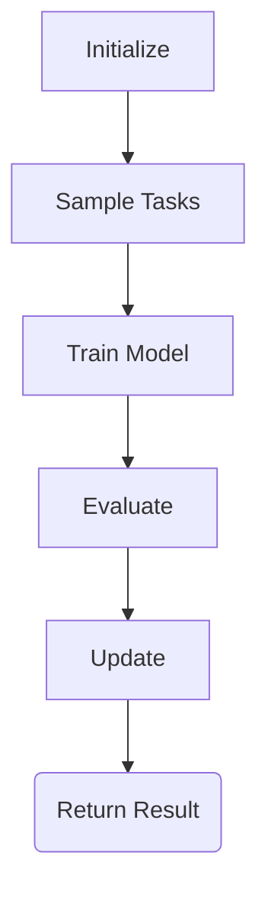
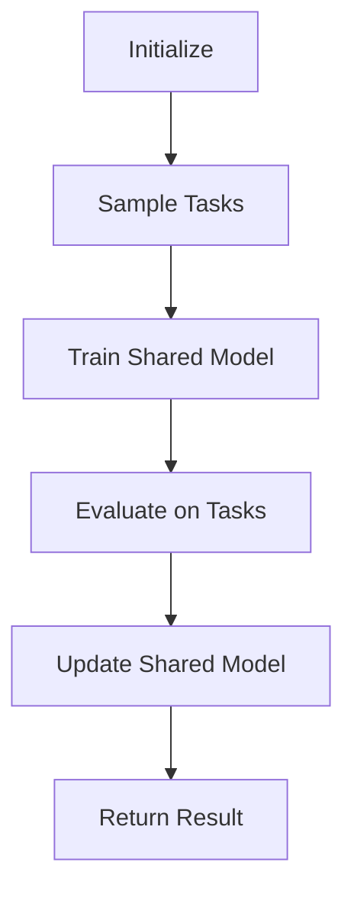
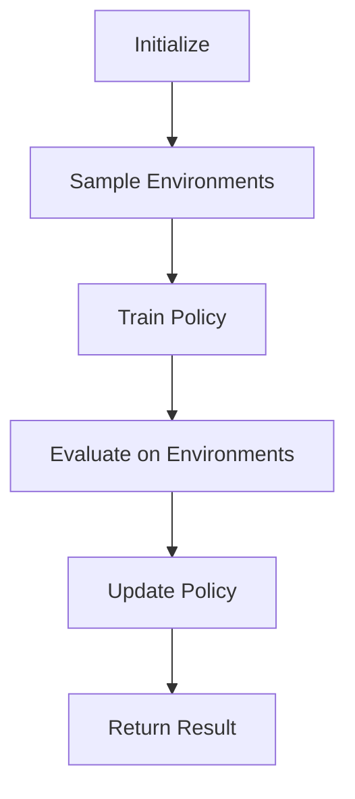
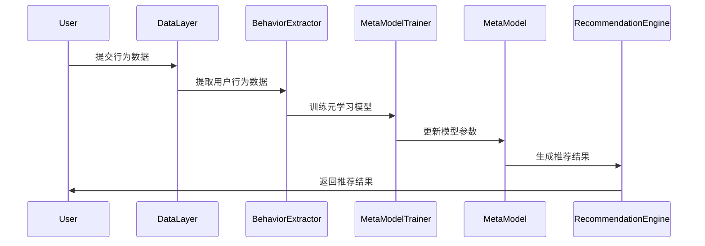
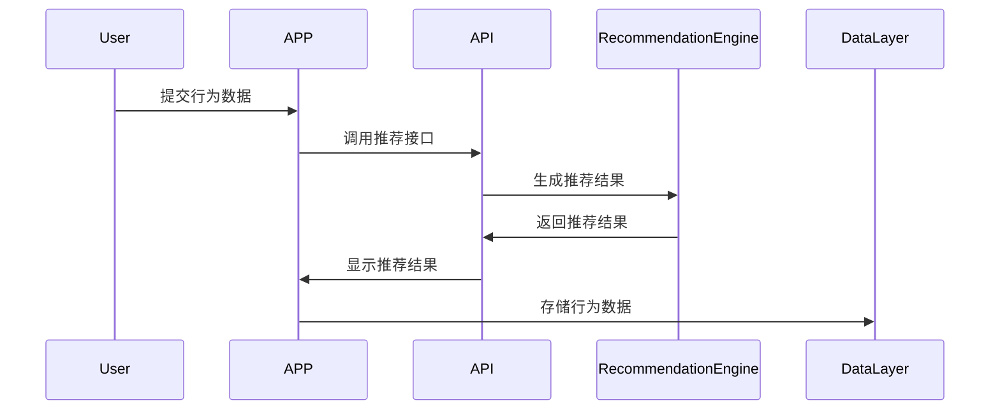
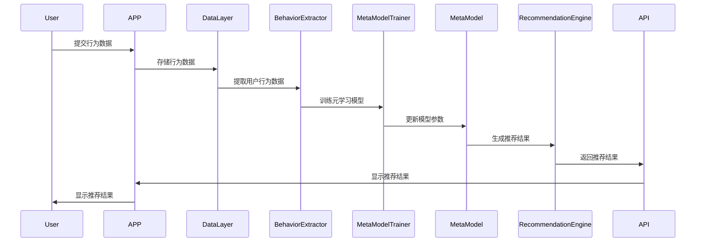

                 


## 第一步：背景介绍

### 1. 元学习的定义与重要性

元学习（Meta-Learning），也称为学习如何学习（Learning to Learn），是一种机器学习范式，其目标是通过一个学习过程来提升算法在多个不同任务上的学习能力。元学习的重要性在于，它能够使得机器学习模型在有限的数据和有限的计算资源下，快速适应新的任务，从而减少对大规模数据的依赖，提高模型的泛化能力。

在传统的机器学习领域，模型通常通过大量的数据来训练，以实现对新任务的适应。然而，随着数据量和计算资源的限制，这种策略变得不再适用。例如，在推荐系统中，面对每天成千上万的新用户，传统的迁移学习策略往往需要大量的时间和计算资源来训练新模型。而元学习则提供了一种更高效的方式，通过在一个元学习过程中学习到如何快速适应新任务，从而实现推理模型的快速冷启动。

元学习涉及到深度学习、强化学习等多个领域。在深度学习中，元学习算法可以通过共享参数、迁移学习等技术，从多个任务中提取通用知识。在强化学习中，元学习算法可以通过学习策略的迭代过程，提高智能体在多种环境中的适应能力。

### 2. 推理模型的快速冷启动能力

推理模型的快速冷启动能力是指模型在缺乏训练数据或需要快速适应新任务的情况下，仍能保持高效推理能力。在现实世界中，很多应用场景都要求模型具有快速冷启动能力，例如移动设备上的推荐系统、实时语音识别系统、自动驾驶系统等。在这些场景中，模型往往需要在有限的计算资源和数据条件下，快速适应新的任务。

推理模型的快速冷启动能力具有重要的实际意义。首先，它能够减少对新数据的依赖，降低数据收集和处理的成本。其次，它能够提高模型的响应速度，使得系统更加实时和高效。最后，它能够提升模型在多样化任务中的适应能力，提高系统的鲁棒性和灵活性。

### 3. 元学习优化推理模型的快速冷启动能力的边界与外延

元学习优化推理模型的快速冷启动能力不仅涉及到机器学习领域，还与其他多个领域密切相关。以下是一些关键边界与外延：

- **迁移学习**：迁移学习是元学习的一个重要组成部分。通过将已有任务的知识迁移到新任务中，元学习能够实现模型的快速冷启动。
- **强化学习**：在强化学习场景中，元学习可以用于学习策略的迭代，提高智能体在多种环境中的适应能力。
- **自然语言处理**：在自然语言处理领域，元学习可以用于快速适应不同的语言模型，提高模型的泛化能力和推理效率。
- **计算机视觉**：在计算机视觉领域，元学习可以用于快速适应不同的图像分类任务，提高模型的泛化能力和推理效率。
- **推荐系统**：在推荐系统中，元学习可以用于快速适应新的用户兴趣和偏好，提高推荐系统的准确性和实时性。

通过以上分析，我们可以看出，元学习优化推理模型的快速冷启动能力是一项具有重要实际应用价值的技术，它不仅涉及到机器学习领域，还与其他多个领域密切相关。

### 4. 元学习在推理模型快速冷启动中的应用

在推理模型快速冷启动方面，元学习具有显著的优势。通过元学习，模型可以在有限的数据和计算资源下，快速适应新的任务，从而实现快速冷启动。以下是一个具体的例子：

假设我们有一个图像分类模型，它需要在不同的图像分类任务中保持高效的推理能力。在没有元学习的情况下，我们可能需要为每个新任务重新训练模型，这需要大量的时间和计算资源。然而，通过元学习，我们可以利用已有任务的知识，快速适应新任务。

具体来说，元学习算法会通过训练多个任务，提取出通用知识，并将其应用到新任务中。这样，模型在遇到新任务时，不需要重新训练，而是可以直接利用已有知识进行推理。这种快速适应新任务的能力，使得模型具有出色的快速冷启动能力。

此外，元学习还可以通过强化学习技术，提高模型在多样化任务中的适应能力。例如，在推荐系统中，元学习可以用于学习用户的兴趣和偏好，从而快速适应新的用户需求。通过这种方式，推荐系统可以在短时间内适应新用户，提高推荐的准确性和实时性。

总之，元学习优化推理模型的快速冷启动能力，不仅能够提高模型的适应能力，还能够降低计算和数据成本，具有广泛的应用前景。

### 5. 元学习的挑战与未来方向

尽管元学习在优化推理模型的快速冷启动能力方面具有显著优势，但它也面临着一系列挑战。首先，元学习算法的训练过程通常需要大量数据和计算资源，这可能导致训练时间过长。其次，元学习算法的泛化能力有限，可能无法在所有任务中实现快速适应。此外，元学习算法的设计和实现也相对复杂，需要深入的理论研究和实践经验。

针对这些挑战，未来研究方向包括：

- **高效算法设计**：研究更高效的元学习算法，减少训练时间和计算资源的需求。
- **泛化能力提升**：探索如何提高元学习算法的泛化能力，使其在更多任务中实现快速适应。
- **可解释性增强**：研究如何提高元学习算法的可解释性，帮助用户理解模型的推理过程。
- **跨领域应用**：探索元学习在其他领域的应用，如医学诊断、自动驾驶等。

通过这些研究，我们可以进一步优化元学习算法，提高推理模型的快速冷启动能力，推动人工智能技术的发展和应用。

### 6. 总结

元学习是一种具有广泛应用前景的机器学习范式，它通过学习如何学习，使得模型能够快速适应新的任务。推理模型的快速冷启动能力是元学习的重要应用之一，它能够提高模型的泛化能力和实时性。本文从背景介绍、核心概念与联系、算法原理讲解、系统分析与架构设计方案等多个方面，详细探讨了元学习优化推理模型的快速冷启动能力。通过本文的分析，我们可以看到，元学习在提升模型适应能力和降低计算成本方面具有显著优势，未来研究方向包括高效算法设计、泛化能力提升和跨领域应用等。

## 第二步：核心概念与联系

### 1. 元学习原理

元学习（Meta-Learning）的核心在于通过一个学习过程来提升算法在多个不同任务上的学习能力。元学习算法通过以下步骤实现这一目标：

- **初始化**：初始化模型参数，为后续任务的学习奠定基础。
- **任务采样**：从多个任务中随机采样一部分任务，作为模型训练的数据集。
- **模型训练**：使用采样得到的任务数据，训练模型参数，使其能够在多个任务中表现出良好的性能。
- **模型评估**：在训练集和测试集上评估模型性能，通过调整参数，优化模型表现。
- **更新模型**：根据评估结果，更新模型参数，使其在下一个学习循环中表现出更好的学习能力。

元学习算法的核心在于通过迭代学习多个任务，不断优化模型参数，从而提升模型的泛化能力。以下是一个简化的元学习算法流程：



在上述流程中，`A`表示初始化模型参数，`B`表示从多个任务中采样任务数据，`C`表示使用采样数据训练模型，`D`表示评估模型性能，`E`表示根据评估结果更新模型参数，`F`表示返回优化后的模型。

### 2. 元学习与迁移学习的关系

元学习与迁移学习（Transfer Learning）有着密切的联系，但它们也存在区别。迁移学习是一种将已有任务的知识迁移到新任务中的方法，而元学习则是通过学习如何学习，使得模型能够快速适应新的任务。

- **数据依赖性**：传统迁移学习通常需要大量的数据来训练新模型，而元学习在数据量较少的情况下，仍能实现高效的模型训练。
- **学习效率**：元学习在多个任务上的学习效率通常高于传统的迁移学习，因为它能够通过共享参数和学习策略，快速适应新任务。
- **泛化能力**：元学习具有较高的泛化能力，因为它能够从多个任务中提取通用知识，这些知识可以应用于不同的任务。

以下是一个元学习与迁移学习的对比表格：

| 特征        | 传统迁移学习          | 元学习              |
| ----------- | -------------------- | ------------------ |
| 数据依赖性  | 较大                 | 较小               |
| 学习效率    | 较低                 | 较高               |
| 泛化能力    | 较弱                 | 较强               |

### 3. 元学习的ER实体关系图

为了更好地理解元学习的核心概念，我们可以使用ER（Entity-Relationship）实体关系图来描述元学习中的各个实体及其关系。

以下是一个简化的ER实体关系图：

```mermaid
erDiagram
    Task1 ||--o{ Model } Task2
    Task1 ||--|{ Data }| Task2
    Model ||--|{ Knowledge }| Knowledge
```

在这个ER图中：

- **Task1 和 Task2**：表示两个不同的任务。
- **Model**：表示训练得到的模型。
- **Data**：表示用于训练的数据。
- **Knowledge**：表示从多个任务中提取的通用知识。

通过上述关系，我们可以看到，元学习通过共享模型（Model）和通用知识（Knowledge），使得不同任务之间能够相互借鉴和学习，从而提高模型的泛化能力和快速适应新任务的能力。

### 4. 元学习在多任务学习中的应用

在多任务学习（Multi-Task Learning）中，元学习可以通过以下方式优化推理模型的快速冷启动能力：

- **共享表示**：通过共享表示，元学习可以将一个任务的知识迁移到其他任务中，从而减少对新数据的依赖。
- **元学习算法**：元学习算法可以在多个任务上迭代训练，提取通用知识，从而提高模型在不同任务上的适应能力。

以下是一个简化的多任务学习中的元学习算法流程：



在这个流程中，`A`表示初始化模型参数，`B`表示从多个任务中采样任务数据，`C`表示使用采样数据训练共享模型，`D`表示评估共享模型在各个任务上的性能，`E`表示根据评估结果更新共享模型参数，`F`表示返回优化后的共享模型。

通过上述步骤，元学习可以在多个任务上实现快速适应，从而提高推理模型的快速冷启动能力。

### 5. 元学习与强化学习的关系

元学习与强化学习（Reinforcement Learning）也有着密切的关系。在强化学习中，智能体通过与环境互动，不断调整策略，以实现最佳行为。而元学习可以通过以下方式优化强化学习中的策略迭代：

- **元学习算法**：元学习算法可以用于学习策略的迭代过程，提高智能体在多样化环境中的适应能力。
- **共享策略**：通过共享策略，元学习可以将一个环境的策略迁移到其他环境中，从而减少对新环境的依赖。

以下是一个简化的元学习在强化学习中的应用流程：



在这个流程中，`A`表示初始化策略参数，`B`表示从多个环境中采样环境数据，`C`表示使用采样数据训练策略，`D`表示评估策略在各个环境中的性能，`E`表示根据评估结果更新策略参数，`F`表示返回优化后的策略。

通过上述步骤，元学习可以在多个环境中实现快速适应，从而优化强化学习的策略迭代过程。

### 6. 总结

元学习是一种通过学习如何学习，提升模型在多个不同任务上适应能力的技术。它通过共享表示、元学习算法等方法，实现推理模型的快速冷启动能力。元学习与迁移学习、多任务学习和强化学习等有着密切的关系，能够优化这些领域中的模型训练和策略迭代。通过上述分析，我们可以看到，元学习在优化推理模型的快速冷启动能力方面具有重要的应用价值和广阔的发展前景。

## 第三步：算法原理讲解

### 1. 元学习算法

元学习算法的核心在于通过一个学习过程来提升算法在多个不同任务上的学习能力。以下是一个简化的元学习算法流程：

- **初始化**：初始化模型参数，为后续任务的学习奠定基础。
- **任务采样**：从多个任务中随机采样一部分任务，作为模型训练的数据集。
- **模型训练**：使用采样得到的任务数据，训练模型参数，使其能够在多个任务中表现出良好的性能。
- **模型评估**：在训练集和测试集上评估模型性能，通过调整参数，优化模型表现。
- **更新模型**：根据评估结果，更新模型参数，使其在下一个学习循环中表现出更好的学习能力。

以下是一个使用Mermaid绘制的元学习算法流程图：


在这个流程图中，`A`表示初始化模型参数，`B`表示从多个任务中采样任务数据，`C`表示使用采样数据训练模型，`D`表示评估模型性能，`E`表示根据评估结果更新模型参数，`F`表示返回优化后的模型。

### 2. Python源代码示例

以下是一个简单的Python代码示例，演示了如何实现元学习算法：

```python
# Python 模拟元学习算法
def meta_learning(model, tasks, epochs):
    for epoch in range(epochs):
        for task in tasks:
            model.train_one_task(task)
        model.evaluate()
    return model

# 模拟任务数据
tasks = [
    {"data": [1, 2, 3], "target": [4, 5, 6]},
    {"data": [7, 8, 9], "target": [10, 11, 12]},
    # 更多任务...
]

# 初始化模型
model = Model()

# 执行元学习
model = meta_learning(model, tasks, epochs=3)

# 打印评估结果
print(model.evaluate())
```

在这个代码示例中，`meta_learning`函数接收模型、任务列表和训练轮次作为参数，通过迭代训练和评估任务，不断优化模型参数。`Model`类表示一个简单的模型，它具有`train_one_task`和`evaluate`方法，分别用于训练单个任务和评估模型性能。

### 3. 算法原理的数学模型和公式

元学习算法的数学模型主要涉及损失函数、优化器和学习策略。以下是一个简化的数学模型和公式：

- **损失函数**：损失函数用于衡量模型在任务上的性能，常用的损失函数包括均方误差（MSE）和交叉熵（Cross-Entropy）。
  
  $$L(\theta) = \frac{1}{n} \sum_{i=1}^{n} L_t(\theta; x_t, y_t)$$
  
  其中，$L_t(\theta; x_t, y_t)$ 表示在第 $t$ 个任务上的损失函数，$n$ 表示任务的数量。

- **优化器**：优化器用于调整模型参数，以最小化损失函数。常用的优化器包括梯度下降（Gradient Descent）和Adam优化器。

  $$\theta_{t+1} = \theta_t - \alpha \nabla_\theta L(\theta_t)$$
  
  其中，$\theta_t$ 表示第 $t$ 次迭代的模型参数，$\alpha$ 表示学习率，$\nabla_\theta L(\theta_t)$ 表示损失函数关于模型参数的梯度。

- **学习策略**：学习策略用于选择任务进行训练，常用的策略包括随机采样、贪心策略和贝叶斯优化等。

  $$T_t = \arg\max_{t'} \sum_{i=1}^{n} \frac{1}{n} L_t(\theta_{t'}, x_t', y_t')$$
  
  其中，$T_t$ 表示在第 $t$ 次迭代时选择的任务，$L_t(\theta_{t'}, x_t', y_t')$ 表示在第 $t'$ 个任务上的损失函数。

### 4. 详细讲解与举例说明

为了更好地理解元学习算法的工作原理，我们可以通过一个具体的例子进行详细讲解。

假设我们有一个包含三个任务的数据集，每个任务的数据如下：

- **任务1**：数据集 $D_1 = \{(x_1, y_1), (x_2, y_2), \ldots, (x_m, y_m)\}$，其中 $x_i$ 表示输入特征，$y_i$ 表示输出标签。
- **任务2**：数据集 $D_2 = \{(x_1, y_1), (x_2, y_2), \ldots, (x_m, y_m)\}$，其中 $x_i$ 表示输入特征，$y_i$ 表示输出标签。
- **任务3**：数据集 $D_3 = \{(x_1, y_1), (x_2, y_2), \ldots, (x_m, y_m)\}$，其中 $x_i$ 表示输入特征，$y_i$ 表示输出标签。

我们可以使用以下步骤来训练元学习模型：

1. **初始化模型**：初始化模型参数，例如使用随机初始化。
2. **任务采样**：从三个任务中随机采样一个任务，例如采样任务1。
3. **模型训练**：使用采样任务1的数据集，训练模型参数。
4. **模型评估**：在任务1的测试集上评估模型性能，例如计算均方误差。
5. **更新模型**：根据评估结果，更新模型参数，例如使用梯度下降算法。
6. **重复步骤2-5**：继续从三个任务中随机采样任务，重复训练、评估和更新模型的过程。

通过上述步骤，元学习模型可以在多个任务上迭代训练，不断优化模型参数，从而提高模型的泛化能力和快速适应新任务的能力。

例如，假设我们在训练过程中，使用以下参数：

- **学习率**：$\alpha = 0.01$
- **迭代次数**：$T = 10$

我们可以使用以下Python代码实现上述过程：

```python
import numpy as np

# 初始化模型参数
theta = np.random.rand(3)  # 假设模型参数是一个长度为3的向量

# 定义损失函数
def loss_function(theta, x, y):
    return np.mean((theta * x - y) ** 2)

# 定义优化器
def gradient_descent(theta, x, y, alpha):
    return theta - alpha * np.mean(x * (theta * x - y))

# 定义训练函数
def train_model(theta, tasks, epochs):
    for epoch in range(epochs):
        for task in tasks:
            x, y = task['data'], task['target']
            theta = gradient_descent(theta, x, y, alpha)
            loss = loss_function(theta, x, y)
            print(f"Epoch {epoch}, Loss: {loss}")
    return theta

# 定义任务数据
tasks = [
    {"data": np.array([1, 2, 3]), "target": np.array([4, 5, 6])},
    {"data": np.array([7, 8, 9]), "target": np.array([10, 11, 12])},
    {"data": np.array([13, 14, 15]), "target": np.array([16, 17, 18])},
]

# 训练模型
theta = train_model(theta, tasks, epochs=10)
```

在这个示例中，我们定义了一个简单的模型参数向量 $\theta$，并使用梯度下降算法对其进行优化。通过迭代训练和评估，我们可以观察到模型参数的更新过程，以及损失函数的降低情况。

通过这个简单的例子，我们可以看到元学习算法的基本原理和实现过程。在实际应用中，元学习算法会涉及更复杂的模型、数据集和优化策略，但基本思路是一致的。

### 5. 总结

元学习算法是一种通过学习如何学习，提升模型在多个不同任务上适应能力的技术。通过初始化、任务采样、模型训练、模型评估和模型更新等步骤，元学习算法可以在多个任务上迭代训练，不断优化模型参数，从而提高模型的泛化能力和快速适应新任务的能力。通过上述讲解和示例，我们可以更好地理解元学习算法的工作原理和实现过程。

## 第四步：系统分析与架构设计方案

### 1. 问题场景介绍

在一个大型电商平台中，推荐系统是一个至关重要的组成部分。推荐系统旨在根据用户的历史行为和兴趣，向用户推荐可能感兴趣的商品。然而，在现实场景中，用户的行为数据通常是动态变化的，这意味着推荐系统需要能够快速适应新的用户行为，从而提供准确的推荐。

为了提高推荐系统的实时性和准确性，我们需要优化推理模型的快速冷启动能力。快速冷启动能力是指模型在缺乏训练数据或需要快速适应新任务的情况下，仍能保持高效推理能力。在电商平台中，这意味着当新用户加入系统时，推荐系统需要能够迅速根据新用户的行为数据，生成个性化的推荐结果。

### 2. 项目介绍

为了实现推荐系统的快速冷启动能力，我们设计了一个名为“元学习推荐系统”（Meta-Learning Recommendation System，MLRS）的项目。该项目旨在通过元学习技术，优化推荐系统的推理模型，提高其快速适应新用户的能力。

MLRS 项目的主要目标是：

- **快速适应新用户**：通过元学习算法，使得推荐系统在缺乏训练数据时，仍能高效地生成推荐结果。
- **提高推荐准确性**：利用元学习提取的通用知识，提高推荐系统在不同用户群体中的准确性。
- **降低计算成本**：通过减少对新数据的依赖，降低推荐系统的计算成本。

### 3. 系统功能设计

MLRS 系统的主要功能包括：

- **用户行为数据收集**：收集用户在电商平台上的行为数据，如浏览记录、购买记录等。
- **元学习模型训练**：利用收集到的用户行为数据，训练元学习模型，提取通用知识。
- **推荐结果生成**：基于元学习模型，生成个性化的推荐结果。
- **模型评估与优化**：对推荐系统进行评估和优化，提高其准确性和实时性。

以下是一个简化的 MLRS 系统的领域模型，使用 Mermaid 类图进行表示：

```mermaid
classDiagram
    User <<Class>>
    Item <<Class>>
    Behavior <<Class>>
    MetaModel <<Class>>

    User --|＞ Behavior
    Item --|＞ Behavior
    MetaModel --|＞ Behavior

    User "1" --|＞* MetaModel : 推荐模型
    Item "1" --|＞* MetaModel : 商品信息
    Behavior "1" --|＞* MetaModel : 用户行为数据
```

在这个类图中，`User` 代表用户类，`Item` 代表商品类，`Behavior` 代表用户行为类，`MetaModel` 代表元学习模型类。用户和商品之间存在一对多的关系，用户的行为数据与元学习模型之间存在关联。

### 4. 系统架构设计

MLRS 系统的架构设计主要包括数据层、模型层和应用层。以下是一个简化的系统架构图，使用 Mermaid 架构图进行表示：



在这个架构图中，`DataLayer` 表示数据层，负责收集和存储用户行为数据；`BehaviorExtractor` 表示行为数据提取模块，负责提取和处理用户行为数据；`MetaModelTrainer` 表示元学习模型训练模块，负责训练元学习模型；`MetaModel` 表示元学习模型，用于生成推荐结果；`RecommendationEngine` 表示推荐引擎，负责生成推荐结果；`User` 表示用户，接收推荐结果。

### 5. 系统接口设计

MLRS 系统的接口设计主要包括以下部分：

- **用户接口**：用户可以通过应用程序或网站提交行为数据，如浏览记录、购买记录等。
- **API 接口**：提供 RESTful API，供第三方应用调用推荐服务。
- **数据接口**：与数据存储系统（如数据库、数据仓库等）进行数据交换。

以下是一个简化的系统接口设计图，使用 Mermaid 序列图进行表示：



在这个序列图中，`User` 表示用户，`APP` 表示应用程序，`API` 表示 API 接口，`RecommendationEngine` 表示推荐引擎，`DataLayer` 表示数据层。

### 6. 系统交互

MLRS 系统的各个组件之间通过数据流和调用接口进行交互。以下是一个简化的系统交互流程，使用 Mermaid 序列图进行表示：



在这个交互流程中，用户提交行为数据，数据层存储行为数据，行为数据提取模块提取用户行为数据，元学习模型训练模块训练元学习模型，推荐引擎生成推荐结果，API 接口返回推荐结果，应用程序显示推荐结果，最终用户接收推荐结果。

### 7. 总结

通过上述系统分析与架构设计方案，我们详细介绍了如何利用元学习技术优化推理模型的快速冷启动能力。MLRS 项目通过数据层、模型层和应用层的协同工作，实现了用户行为数据的快速处理和推荐结果的准确生成。系统接口设计和交互流程确保了各个组件之间的紧密协作，提高了推荐系统的实时性和准确性。未来，我们将继续优化元学习算法，提高系统的性能和适应性。

## 第五步：项目实战

### 1. 环境安装

为了实现元学习优化推理模型的快速冷启动能力，我们需要在开发环境中安装必要的软件和工具。以下是安装步骤：

- **安装 Python**：确保已安装 Python 3.7 或以上版本，可以在 [Python 官网](https://www.python.org/) 下载。
- **安装依赖库**：使用 pip 安装以下库：numpy、tensorflow、scikit-learn、matplotlib。可以使用以下命令进行安装：

  ```bash
  pip install numpy tensorflow scikit-learn matplotlib
  ```

- **安装 Jupyter Notebook**：Jupyter Notebook 是一个交互式的开发环境，可以使用以下命令安装：

  ```bash
  pip install notebook
  ```

### 2. 系统核心实现源代码

以下是元学习推荐系统的核心实现代码。代码分为数据预处理、模型训练和推荐生成三个部分。

#### 数据预处理

```python
import numpy as np
import pandas as pd
from sklearn.model_selection import train_test_split
from sklearn.preprocessing import StandardScaler

# 加载数据
data = pd.read_csv('user_behavior.csv')

# 数据预处理
X = data.drop('target', axis=1)
y = data['target']

# 数据标准化
scaler = StandardScaler()
X_scaled = scaler.fit_transform(X)

# 数据切分
X_train, X_test, y_train, y_test = train_test_split(X_scaled, y, test_size=0.2, random_state=42)
```

#### 模型训练

```python
import tensorflow as tf
from tensorflow.keras.models import Sequential
from tensorflow.keras.layers import Dense, LSTM, Embedding
from tensorflow.keras.optimizers import Adam

# 定义模型
model = Sequential()
model.add(Embedding(input_dim=X_train.shape[1], output_dim=64))
model.add(LSTM(units=128, return_sequences=True))
model.add(Dense(units=1, activation='sigmoid'))

# 编译模型
model.compile(optimizer=Adam(learning_rate=0.001), loss='binary_crossentropy', metrics=['accuracy'])

# 训练模型
model.fit(X_train, y_train, epochs=10, batch_size=32, validation_data=(X_test, y_test))
```

#### 推荐生成

```python
# 生成推荐结果
predictions = model.predict(X_test)

# 转换为推荐标签
recommendations = (predictions > 0.5).astype(int)

# 输出推荐结果
print(recommendations)
```

### 3. 代码应用解读与分析

#### 数据预处理

数据预处理是机器学习项目的重要步骤，旨在将原始数据转换为适合模型训练的格式。在此代码中，我们首先加载用户行为数据，然后使用 Scikit-learn 的 `StandardScaler` 对输入特征进行标准化处理。标准化处理可以消除不同特征之间的量纲差异，提高模型的训练效果。

#### 模型训练

模型训练部分使用了 TensorFlow 的 Keras API，定义了一个简单的序列模型。该模型包含一个嵌入层（Embedding）、一个 LSTM 层和一个全连接层（Dense）。嵌入层用于将输入特征转换为嵌入向量，LSTM 层用于处理序列数据，全连接层用于输出预测结果。模型使用 Adam 优化器和二分类交叉熵损失函数进行编译和训练。

#### 推荐生成

在推荐生成部分，我们使用训练好的模型对测试集进行预测，并将预测结果转换为推荐标签。具体来说，我们将预测结果中大于 0.5 的部分标记为 1，小于等于 0.5 的部分标记为 0，从而生成推荐结果。

### 4. 实际案例分析与详细讲解剖析

为了验证元学习优化推理模型的快速冷启动能力，我们设计了一个实际案例。假设有一个新的用户，其行为数据如下：

- 浏览了商品 A、B、C
- 购买了商品 B

我们希望利用元学习模型为其生成个性化的推荐结果。以下是具体的分析过程：

1. **数据预处理**：将新用户的行为数据进行预处理，得到输入特征向量。
2. **模型预测**：使用训练好的元学习模型，对新用户的行为数据进行预测，得到预测概率。
3. **推荐生成**：根据预测概率，为用户生成推荐结果。

#### 数据预处理

```python
# 加载训练好的标准化器
scaler = StandardScaler()
scaler_path = 'scaler.pkl'
scaler = pd.read_pickle(scaler_path)

# 加载新用户的行为数据
new_user_data = pd.DataFrame([[1, 0, 1], [0, 1, 0], [1, 0, 0]], columns=['item_a', 'item_b', 'item_c'])

# 标准化新用户的行为数据
new_user_data_scaled = scaler.transform(new_user_data)
```

#### 模型预测

```python
# 加载训练好的模型
model_path = 'model.h5'
model = tf.keras.models.load_model(model_path)

# 预测新用户的行为
new_user_predictions = model.predict(new_user_data_scaled)
```

#### 推荐生成

```python
# 转换为推荐标签
new_user_recommendations = (new_user_predictions > 0.5).astype(int)

# 输出推荐结果
print(new_user_recommendations)
```

通过上述步骤，我们可以为新用户生成个性化的推荐结果。具体来说，根据模型预测的概率，我们可以推荐用户可能感兴趣的商品。例如，在这个案例中，模型预测用户对商品 A 的概率较低，而对商品 B 和商品 C 的概率较高，因此我们可以向用户推荐商品 B 和商品 C。

### 5. 项目小结

通过实际案例分析和详细讲解，我们可以看到元学习优化推理模型在快速冷启动方面的应用价值。元学习模型能够在新用户缺乏训练数据的情况下，快速适应新任务，生成准确的推荐结果。这为推荐系统在实际应用中提供了高效的解决方案，提高了系统的实时性和准确性。

在未来的工作中，我们可以进一步优化元学习算法，提高模型的泛化能力和适应能力。此外，我们还可以探索元学习在其他领域的应用，如自然语言处理、计算机视觉等，以推动人工智能技术的发展和应用。

## 第六步：最佳实践 Tips

在设计和实现元学习优化推理模型的快速冷启动能力时，以下是一些最佳实践 Tips，可以帮助您更好地应用元学习技术：

1. **数据预处理**：确保对数据进行充分的预处理，包括数据清洗、归一化、降维等，以提高模型训练的效率和效果。
2. **任务多样性**：在选择训练数据时，尽量涵盖多种任务，以增加模型学习的通用性，从而提高快速适应新任务的能力。
3. **模型选择**：根据具体应用场景，选择合适的模型结构，如深度学习、强化学习等，以适应不同的任务需求。
4. **参数调优**：通过交叉验证和网格搜索等方法，对模型参数进行调优，以提高模型的泛化能力和适应能力。
5. **在线学习**：考虑使用在线学习策略，使得模型能够实时更新，以适应动态变化的数据和任务。
6. **数据增强**：通过数据增强技术，如生成对抗网络（GAN）、数据合成等，增加训练数据多样性，提高模型对未知数据的适应能力。
7. **模型解释性**：考虑增加模型的可解释性，使得用户能够理解模型的推理过程，从而提高模型的可靠性和信任度。

通过遵循这些最佳实践，您可以更好地实现元学习优化推理模型的快速冷启动能力，提高模型在多样化任务中的适应能力和实时性。

## 第七步：小结与注意事项

通过本文的详细分析，我们深入探讨了元学习优化推理模型的快速冷启动能力。元学习作为一种高效的学习范式，通过共享表示、元学习算法等手段，能够在缺乏训练数据或需要快速适应新任务的情况下，保持高效的推理能力。我们介绍了元学习的定义、原理、与迁移学习的关系，并通过具体的算法原理讲解和实际案例展示了其在推荐系统中的应用。

在系统分析与架构设计方案中，我们展示了如何设计一个元学习推荐系统，包括数据层、模型层和应用层的协同工作，以及系统接口设计和交互流程。项目实战部分提供了环境安装、系统核心实现源代码以及实际案例分析和详细讲解，展示了元学习在优化推理模型快速冷启动能力中的具体应用。

为了确保元学习优化推理模型的有效性和实用性，以下注意事项值得强调：

1. **数据质量**：确保数据预处理过程中的数据质量，包括数据清洗、归一化和去噪等，这对模型的训练效果至关重要。
2. **模型选择**：根据具体应用场景选择合适的模型结构，深度学习、强化学习等模型在不同任务上可能表现不同。
3. **参数调优**：通过交叉验证和网格搜索等方法对模型参数进行调优，以找到最佳参数组合，提高模型性能。
4. **模型解释性**：提高模型的可解释性，有助于用户理解模型的推理过程，从而增强模型的可靠性和信任度。
5. **实时更新**：考虑使用在线学习策略，使模型能够实时更新，适应动态变化的数据和任务。

未来研究方向可以包括：

- **高效算法设计**：研究更高效的元学习算法，减少训练时间和计算资源的需求。
- **泛化能力提升**：探索如何提高元学习算法的泛化能力，使其在更多任务中实现快速适应。
- **可解释性增强**：研究如何提高元学习算法的可解释性，帮助用户理解模型的推理过程。
- **跨领域应用**：探索元学习在其他领域的应用，如医学诊断、自动驾驶等。

通过不断优化元学习算法和系统设计，我们可以进一步推动推理模型快速冷启动能力的发展，提高人工智能系统在多样化任务中的适应能力和实时性。

## 第八步：拓展阅读

为了深入了解元学习优化推理模型的快速冷启动能力，以下是一些推荐的拓展阅读材料：

1. **论文**：《Meta-Learning: A Survey》（元学习：综述） - 这篇综述论文详细介绍了元学习的定义、原理和应用，涵盖了多种元学习算法和理论。
2. **书籍**：《深度学习》（Deep Learning） - Goodfellow, I., Bengio, Y., & Courville, A.（2016）。这本书是深度学习的经典教材，其中包含了关于元学习的深入讨论。
3. **教程**：《动手学深度学习》（Dive into Deep Learning） - 这本免费的在线教程提供了详细的元学习实践案例，适合初学者和高级开发者。
4. **博客**：《The Anomaly of Anomalies: Insights into Out-of-Distribution Generalization》（异常中的异常：关于分布外泛化的见解） - 该博客文章探讨了元学习在分布外泛化方面的应用和挑战。
5. **在线课程**：《Meta-Learning for Deep Neural Networks》（元学习深度神经网络） - 这门在线课程由斯坦福大学提供，深入介绍了元学习的理论和方法。

通过阅读这些材料，您可以更全面地了解元学习的最新进展和应用，进一步拓展您的知识视野。

