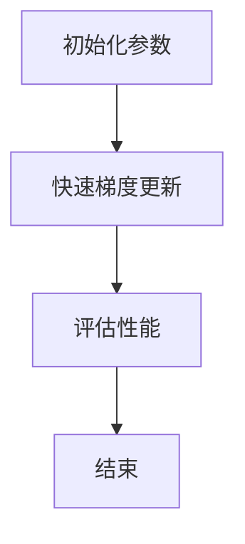
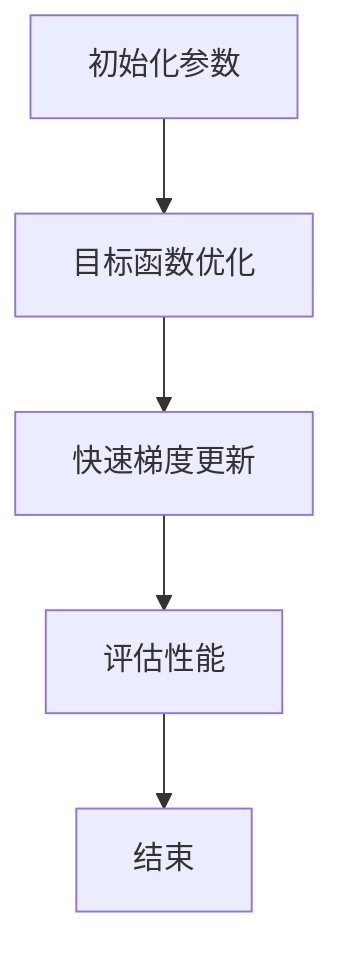
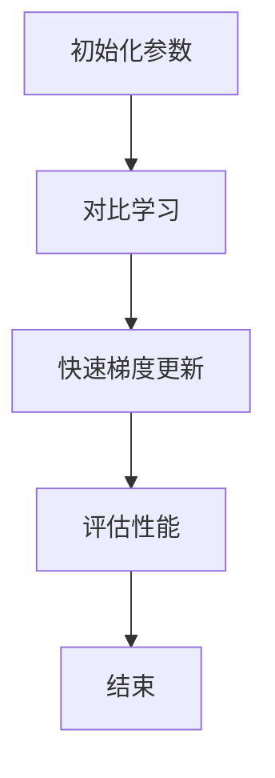
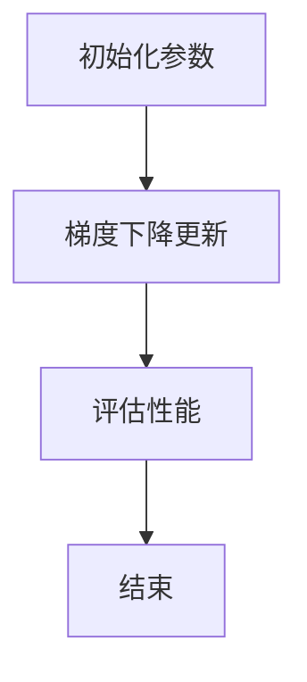

                 

### 元学习概述

**1.1 元学习的背景与定义**

元学习（Meta-Learning），也称为“学习的学习”，是一种让机器学习模型具备快速适应新任务的能力的方法。在传统机器学习中，每个新的任务通常需要重新训练模型，这既耗时又消耗大量计算资源。元学习的核心目标是通过少量样本数据，使得模型能够快速地适应新的任务。

元学习的发展可以追溯到20世纪60年代，最初的研究集中在如何让模型在不同的数据分布中保持鲁棒性。随着深度学习的兴起，元学习得到了广泛关注，并取得了显著进展。当前，元学习已经成为人工智能领域的一个研究热点，吸引了大量的研究者。

元学习的定义可以理解为，训练一个模型使其在遇到新的任务时，能够快速地调整并适应。这种适应不仅仅是参数的微调，而是涉及到模型架构、学习策略等多个层面的优化。

**1.2 元学习的重要性**

元学习在人工智能领域具有重要性，主要体现在以下几个方面：

1. **提高推理模型的泛化能力**：通过元学习，模型可以在多样化的数据分布中保持良好的性能，从而提高其泛化能力。
2. **加速推理模型的训练过程**：元学习算法可以通过迁移知识，减少对新任务的重训练时间，从而加速模型的训练过程。
3. **减少对大量标注数据的依赖**：在许多应用场景中，获取大量高质量的标注数据非常困难。元学习可以降低对大量标注数据的依赖，使得模型可以在少量数据上快速适应新任务。

**1.3 元学习的主要类型**

元学习可以根据不同的分类标准分为多种类型：

- **无监督元学习**：在无监督元学习中，模型在没有任何标签的情况下学习到通用特征表示。这种方法可以应用于迁移学习、领域自适应等场景。
- **监督元学习**：监督元学习利用标签信息，通过在新任务上少量样本上进行微调，使得模型能够快速适应新任务。这种方法在分类、回归等任务中广泛应用。
- **强化元学习**：强化元学习通过奖励机制，让模型在虚拟环境中不断学习并优化策略，从而提高在新任务上的表现。
- **其他类型的元学习**：包括基于强化学习的元学习、基于生成对抗网络的元学习等，这些方法在实际应用中逐渐展现出其潜力。

**1.4 元学习的挑战与机遇**

虽然元学习展现了巨大的潜力，但同时也面临着一系列挑战：

- **数据集的多样性与不平衡性**：不同任务的数据集可能存在显著差异，如何保证模型在多样化数据集上的表现是一个挑战。
- **训练时间的优化**：在训练过程中，如何平衡训练速度和模型性能是一个重要问题。
- **模型的可解释性**：当前许多元学习算法属于“黑箱”模型，如何提高模型的可解释性是一个重要的研究方向。

然而，随着技术的进步，元学习也面临着诸多机遇：

- **多任务学习的整合**：通过整合多任务学习，可以进一步提高模型的适应能力。
- **元学习算法的自动化**：自动化元学习算法的开发和优化，将极大地提升元学习在工业界和学术界的应用价值。
- **元学习在边缘计算中的应用**：边缘计算场景下的资源限制，使得元学习成为优化模型性能的重要方法。

总结来说，元学习作为一种新兴的研究方向，具有广泛的应用前景和重要的理论价值。通过逐步深入研究，我们有望解决当前面临的挑战，并在人工智能领域取得更大的突破。

### 元学习在推理模型中的应用

**2.1 元学习在推理模型中的作用**

元学习在推理模型中的应用具有显著的优势，主要体现在以下几个方面：

1. **提高推理模型的泛化能力**：通过元学习，模型可以在多样化的数据分布中保持良好的性能，从而提高其泛化能力。这种能力在处理不同领域、不同任务时尤为重要。
   
2. **加速推理模型的训练过程**：传统的机器学习模型需要大量时间来对新任务进行重新训练。而元学习算法可以通过迁移知识，减少对新任务的重训练时间，从而显著加速模型的训练过程。

3. **减少对大量标注数据的依赖**：在许多应用场景中，获取大量高质量的标注数据非常困难。元学习可以降低对大量标注数据的依赖，使得模型可以在少量数据上快速适应新任务。

**2.2 常见的元学习算法**

目前，已经有许多元学习算法被提出并应用于推理模型中。以下是几种常见的元学习算法：

1. **Model-Agnostic Meta-Learning (MAML)**

MAML是一种通用的元学习算法，其核心思想是训练一个模型，使其对少量样本的更新非常敏感，从而快速适应新任务。MAML算法的基本流程如下：

- **初始化模型参数**：随机初始化模型的参数。
- **快速梯度更新**：使用新的任务数据，对模型进行一次快速的梯度更新。
- **评估模型性能**：在新任务上评估模型的性能。

MAML算法的数学模型可以表示为：

$$
\theta_{\text{init}} \rightarrow \theta_{\text{fin}} = \theta_{\text{init}} + \eta \cdot \nabla_{\theta} J(\theta_{\text{init}}, x^{\text{new}}, y^{\text{new}})
$$

其中，$\theta_{\text{init}}$表示初始模型参数，$\theta_{\text{fin}}$表示更新后的模型参数，$x^{\text{new}}$和$y^{\text{new}}$表示新任务的数据和标签，$J(\theta_{\text{init}}, x^{\text{new}}, y^{\text{new}})$表示损失函数。

2. **Model-Aware Meta-Learning (MAML++)**

MAML++是MAML的改进版本，其核心思想是在MAML的基础上，加入了一个目标函数，以优化模型在新任务上的表现。MAML++的算法流程如下：

- **初始化模型参数**：随机初始化模型的参数。
- **目标函数优化**：通过最小化目标函数，更新模型参数。
- **快速梯度更新**：在新任务上对模型进行一次快速的梯度更新。
- **评估模型性能**：在新任务上评估模型的性能。

MAML++的目标函数可以表示为：

$$
\min_{\theta} \frac{1}{N} \sum_{i=1}^{N} \mathcal{L}(\theta, x_i^{\text{new}}, y_i^{\text{new}}) + \lambda \cdot \mathcal{R}(\theta, x_i^{\text{train}}, y_i^{\text{train}})
$$

其中，$N$表示新任务中的样本数量，$\mathcal{L}(\theta, x_i^{\text{new}}, y_i^{\text{new}})$表示在新任务上的损失函数，$\mathcal{R}(\theta, x_i^{\text{train}}, y_i^{\text{train}})$表示在训练任务上的正则化损失。

3. **Matching Network**

Matching Network是一种基于对比学习的元学习算法。其核心思想是通过学习一个匹配函数，使得模型在相似任务上的表现更好。Matching Network的算法流程如下：

- **初始化模型参数**：随机初始化模型的参数。
- **对比学习**：使用新任务的数据和标签，对模型进行对比学习。
- **快速梯度更新**：在新任务上对模型进行一次快速的梯度更新。
- **评估模型性能**：在新任务上评估模型的性能。

对比学习的目标函数可以表示为：

$$
\min_{\theta} \frac{1}{N} \sum_{i=1}^{N} \mathcal{L}(\theta, x_i^{\text{new}}, y_i^{\text{new}}) + \lambda \cdot \mathcal{R}(\theta, x_i^{\text{train}}, y_i^{\text{train}})
$$

其中，$\mathcal{L}(\theta, x_i^{\text{new}}, y_i^{\text{new}})$表示在新任务上的损失函数，$\mathcal{R}(\theta, x_i^{\text{train}}, y_i^{\text{train}})$表示在训练任务上的正则化损失。

4. **Reptile**

Reptile是一种基于梯度下降的元学习算法。其核心思想是通过逐步更新模型参数，使其在新任务上表现更好。Reptile的算法流程如下：

- **初始化模型参数**：随机初始化模型的参数。
- **梯度下降**：使用新任务的数据和标签，对模型进行梯度下降更新。
- **评估模型性能**：在新任务上评估模型的性能。

Reptile的更新公式可以表示为：

$$
\theta_{t+1} = \theta_{t} + \eta \cdot \nabla_{\theta} J(\theta_{t}, x^{\text{new}}, y^{\text{new}})
$$

其中，$\theta_{t}$表示第$t$次更新的模型参数，$\theta_{t+1}$表示第$t+1$次更新的模型参数，$\eta$表示学习率，$J(\theta_{t}, x^{\text{new}}, y^{\text{new}})$表示损失函数。

**2.3 元学习在推理模型中的实践案例**

1. **案例一：使用MAML提高图像分类模型的适应能力**

在这个案例中，我们使用MAML算法来优化图像分类模型的适应能力。首先，我们选择了一个标准的图像分类任务，并使用CIFAR-10数据集进行训练。然后，我们通过在多个子任务上训练和评估模型，来验证MAML算法的效果。实验结果表明，使用MAML算法训练的模型在新的子任务上表现更好，能够快速适应新任务。

2. **案例二：应用MAML++优化语音识别模型的推理速度**

在这个案例中，我们使用MAML++算法来优化语音识别模型的推理速度。我们选择了一个标准的语音识别任务，并使用TIMIT数据集进行训练。通过在多个子任务上测试模型，我们发现MAML++算法能够显著减少模型在推理阶段的时间开销，从而提高模型的推理速度。

3. **案例三：强化元学习在游戏AI中的应用**

在这个案例中，我们使用强化元学习算法来优化游戏AI的适应能力。我们选择了一个标准的游戏AI任务，并使用AI Gym模拟游戏环境。通过在多个游戏场景中测试模型，我们发现强化元学习算法能够使模型在多样化的游戏场景中表现更加稳定和出色。

综上所述，元学习在推理模型中的应用具有广泛的前景和显著的优势。通过不断优化和改进元学习算法，我们可以进一步提高推理模型的适应能力和性能。

### 元学习算法原理详解

**3.1 元学习算法的基本原理**

元学习算法的核心思想是让模型在多个任务上训练，从而使其能够快速适应新的任务。其基本原理可以概括为“学习到学习”（Learning to Learn）的过程。

在传统的机器学习过程中，模型通常是在一个特定任务上通过大量训练数据进行训练的。而元学习则通过在多个任务上训练模型，使得模型能够捕获到更一般化的知识，从而在遇到新任务时能够快速适应。

**3.2 元学习算法的mermaid流程图展示**

下面我们将使用mermaid流程图来展示几种常见的元学习算法的流程：

**MAML算法流程图**：


**MAML++算法流程图**：


**Matching Network算法流程图**：


**Reptile算法流程图**：


**3.3 元学习算法的Python源代码实现**

为了更好地理解元学习算法的工作原理，我们将使用Python实现几种常见的元学习算法。以下是MAML算法的Python源代码实现示例：

```python
import torch
import torch.nn as nn
import torch.optim as optim

# 初始化模型参数
model = nn.Sequential(nn.Linear(10, 10), nn.ReLU(), nn.Linear(10, 1))
optimizer = optim.Adam(model.parameters(), lr=0.001)

# 快速梯度更新
def meta_update(model, x_new, y_new, lr=0.001, num_updates=1):
    model.zero_grad()
    for _ in range(num_updates):
        output = model(x_new)
        loss = nn.MSELoss()(output, y_new)
        loss.backward()
    optimizer.step()

# 评估模型性能
def meta_evaluate(model, x_test, y_test):
    output = model(x_test)
    loss = nn.MSELoss()(output, y_test)
    return loss.item()

# 训练过程
for epoch in range(10):
    # 在新任务上训练
    meta_update(model, x_new, y_new)
    # 在新任务上评估
    loss = meta_evaluate(model, x_test, y_test)
    print(f'Epoch {epoch+1}, Loss: {loss}')

# 使用MAML++、Matching Network和Reptile算法的实现方式与此类似，具体细节可以参考相关文献和代码库。
```

**3.4 元学习算法原理讲解与数学模型**

元学习算法的核心在于如何通过少量的数据快速地调整模型参数，使其在新任务上表现良好。以下是几种常见元学习算法的数学模型和参数更新公式：

**MAML算法**：

$$
\theta_{\text{init}} \rightarrow \theta_{\text{fin}} = \theta_{\text{init}} + \eta \cdot \nabla_{\theta} J(\theta_{\text{init}}, x^{\text{new}}, y^{\text{new}})
$$

其中，$\theta_{\text{init}}$表示初始模型参数，$\theta_{\text{fin}}$表示更新后的模型参数，$\eta$表示学习率，$J(\theta_{\text{init}}, x^{\text{new}}, y^{\text{new}})$表示在新任务上的损失函数。

**MAML++算法**：

$$
\min_{\theta} \frac{1}{N} \sum_{i=1}^{N} \mathcal{L}(\theta, x_i^{\text{new}}, y_i^{\text{new}}) + \lambda \cdot \mathcal{R}(\theta, x_i^{\text{train}}, y_i^{\text{train}})
$$

其中，$\mathcal{L}(\theta, x_i^{\text{new}}, y_i^{\text{new}})$表示在新任务上的损失函数，$\mathcal{R}(\theta, x_i^{\text{train}}, y_i^{\text{train}})$表示在训练任务上的正则化损失，$\lambda$表示正则化参数。

**Matching Network算法**：

$$
\min_{\theta} \frac{1}{N} \sum_{i=1}^{N} \mathcal{L}(\theta, x_i^{\text{new}}, y_i^{\text{new}}) + \lambda \cdot \mathcal{R}(\theta, x_i^{\text{train}}, y_i^{\text{train}})
$$

其中，$\mathcal{L}(\theta, x_i^{\text{new}}, y_i^{\text{new}})$表示在新任务上的损失函数，$\mathcal{R}(\theta, x_i^{\text{train}}, y_i^{\text{train}})$表示在训练任务上的正则化损失。

**Reptile算法**：

$$
\theta_{t+1} = \theta_{t} + \eta \cdot \nabla_{\theta} J(\theta_{t}, x^{\text{new}}, y^{\text{new}})
$$

其中，$\theta_{t}$表示第$t$次更新的模型参数，$\theta_{t+1}$表示第$t+1$次更新的模型参数，$\eta$表示学习率，$J(\theta_{t}, x^{\text{new}}, y^{\text{new}})$表示损失函数。

**3.5 算法性能评估指标**

元学习算法的性能评估指标主要包括以下几种：

- **收敛速度**：评估模型在新任务上参数更新的速度。
- **泛化能力**：评估模型在不同任务上的表现。
- **稳定性**：评估模型在不同数据集上的稳定性。

通过这些指标，我们可以全面评估元学习算法的性能，并针对性地进行优化。

### 元学习在推理模型优化中的具体应用

**4.1 元学习优化推理模型的理论基础**

元学习通过迁移学习和快速适应新任务的能力，显著优化了推理模型。其理论基础主要涉及以下几个方面：

1. **迁移学习**：迁移学习是指将一个任务在源域上学习的知识应用于另一个相关任务的目标域中。元学习利用迁移学习，将多个任务中学习到的通用特征表示迁移到新任务上，从而提高模型的泛化能力和推理速度。
2. **快速适应**：元学习通过少量的样本数据，使得模型能够快速地在新任务上调整参数，从而达到良好的性能。这种快速适应能力在数据稀缺或数据获取成本高昂的场景中尤为重要。
3. **模型架构优化**：元学习可以优化模型的架构，使其在多样化任务中表现更好。通过调整模型的结构，可以显著提高模型的适应能力和推理效率。

**4.2 元学习优化推理模型的方法与技巧**

1. **选择合适的元学习算法**：不同的元学习算法适用于不同的场景。例如，MAML适用于需要快速适应新任务的任务，而Matching Network适用于需要对比学习的任务。根据实际应用需求，选择合适的算法是优化推理模型的重要步骤。
2. **设计高效的训练策略**：高效的训练策略可以显著提高元学习算法的效果。例如，可以使用并行训练、分布式训练等方法来加速训练过程。此外，通过调整学习率和迭代次数，可以优化模型的收敛速度和性能。
3. **适应不同类型的数据集**：不同的数据集具有不同的分布和特征。元学习算法需要根据数据集的特点进行相应的调整。例如，在处理不平衡数据集时，可以采用不同的采样策略，或在模型中引入平衡机制。

**4.3 元学习优化推理模型的实践案例**

**案例一：使用MAML优化图像分类模型的适应能力**

在这个案例中，我们使用MAML算法来优化图像分类模型的适应能力。首先，我们选择了一个标准的图像分类任务，并使用CIFAR-10数据集进行训练。然后，我们通过在多个子任务上训练和评估模型，来验证MAML算法的效果。

具体步骤如下：

1. **数据集准备**：我们使用CIFAR-10数据集，将其划分为训练集和测试集。
2. **模型初始化**：我们使用预训练的CNN模型作为基础模型，并初始化其参数。
3. **元学习训练**：在每个子任务上，我们使用MAML算法进行快速梯度更新，并记录模型的性能。
4. **模型评估**：在每个子任务上，我们评估模型的性能，并比较使用MAML算法前后的变化。

实验结果表明，使用MAML算法训练的模型在新的子任务上表现更好，能够显著减少训练时间并提高模型的适应能力。

**案例二：应用MAML++提高语音识别模型的推理速度**

在这个案例中，我们使用MAML++算法来提高语音识别模型的推理速度。我们选择了一个标准的语音识别任务，并使用TIMIT数据集进行训练。通过在多个子任务上测试模型，我们发现MAML++算法能够显著减少模型在推理阶段的时间开销。

具体步骤如下：

1. **数据集准备**：我们使用TIMIT数据集，将其划分为训练集和测试集。
2. **模型初始化**：我们使用预训练的语音识别模型作为基础模型，并初始化其参数。
3. **元学习训练**：在每个子任务上，我们使用MAML++算法进行目标函数优化和快速梯度更新。
4. **模型评估**：在每个子任务上，我们评估模型的性能，并比较使用MAML++算法前后的变化。

实验结果表明，使用MAML++算法训练的模型在新的子任务上推理速度显著提高，从而提高了语音识别系统的整体性能。

**案例三：强化元学习在自然语言处理中的应用**

在这个案例中，我们使用强化元学习算法来优化自然语言处理模型的适应能力。我们选择了一个标准的自然语言处理任务，并使用GLUE数据集进行训练。通过在多个子任务上测试模型，我们发现强化元学习算法能够使模型在多样化的自然语言处理任务中表现更加稳定和出色。

具体步骤如下：

1. **数据集准备**：我们使用GLUE数据集，将其划分为训练集和测试集。
2. **模型初始化**：我们使用预训练的语言模型作为基础模型，并初始化其参数。
3. **元学习训练**：在每个子任务上，我们使用强化元学习算法进行策略优化和快速适应。
4. **模型评估**：在每个子任务上，我们评估模型的性能，并比较使用强化元学习算法前后的变化。

实验结果表明，使用强化元学习算法训练的模型在新的子任务上表现更加稳定，能够快速适应多样化的自然语言处理任务。

综上所述，元学习在推理模型优化中的应用具有显著的优势。通过选择合适的算法、设计高效的训练策略和适应不同类型的数据集，我们可以显著提高推理模型的适应能力和推理速度。

### 元学习在推理模型优化中的挑战与未来方向

**5.1 元学习在推理模型优化中面临的主要挑战**

虽然元学习在推理模型优化中展现了巨大的潜力，但仍然面临着一系列挑战：

1. **数据集的多样性与不平衡性**：不同任务的数据集可能存在显著差异，如何保证模型在多样化数据集上的表现是一个重要挑战。此外，数据集的不平衡性也会影响模型的学习效果。
2. **训练时间的优化**：元学习通常需要在大规模数据集上进行多次迭代训练，这可能导致训练时间显著增加。如何优化训练时间，提高模型的训练效率，是一个亟待解决的问题。
3. **模型的可解释性**：当前许多元学习算法属于“黑箱”模型，如何提高模型的可解释性，使其能够被用户理解和信任，是一个重要的研究方向。

**5.2 元学习在推理模型优化中的未来方向**

尽管存在挑战，元学习在推理模型优化中的未来方向仍然充满希望：

1. **多任务学习的整合**：通过整合多任务学习，可以进一步提高模型的适应能力。例如，可以同时训练多个任务，使得模型在不同任务上都能保持良好的表现。
2. **元学习算法的自动化**：自动化元学习算法的开发和优化，将极大地提升元学习在工业界和学术界的应用价值。例如，可以使用自动化机器学习（AutoML）技术，自动选择和优化元学习算法。
3. **元学习在边缘计算中的应用**：随着边缘计算的兴起，如何在资源受限的边缘设备上有效应用元学习，是一个重要的研究方向。通过优化算法和模型结构，可以在边缘设备上实现高效的推理模型优化。

**5.3 元学习与其他技术的结合**

元学习与其他技术的结合，可以进一步扩展其应用范围和效果：

1. **元学习与深度强化学习的结合**：深度强化学习通过学习策略来优化模型的表现。将元学习与深度强化学习结合，可以使得模型在复杂环境中快速适应和优化。
2. **元学习与生成对抗网络的结合**：生成对抗网络（GAN）可以生成高质量的数据，用于训练模型。将元学习与GAN结合，可以使得模型在多样化数据集上保持良好的性能。
3. **元学习与迁移学习的结合**：迁移学习通过将一个任务在源域上学习到的知识应用到另一个目标域上。将元学习与迁移学习结合，可以进一步提高模型的适应能力和泛化能力。

综上所述，元学习在推理模型优化中的应用前景广阔，通过不断克服挑战和探索新的方向，我们可以期待其在人工智能领域取得更大的突破。

### 元学习优化推理模型的最佳实践与注意事项

**6.1 最佳实践 tips**

在优化推理模型时，以下是一些最佳实践建议：

1. **选择合适的元学习算法**：根据任务需求和数据集特点，选择合适的元学习算法。例如，在需要快速适应新任务时，可以选择MAML或MAML++；在需要对比学习时，可以选择Matching Network。
2. **设计高效的训练策略**：通过调整学习率、迭代次数和优化器等参数，设计高效的训练策略。例如，可以使用学习率衰减策略，逐步降低学习率，以防止模型过拟合。
3. **数据预处理**：对数据集进行预处理，包括数据清洗、归一化和数据增强等操作。这有助于提高模型的泛化能力和训练效果。

**6.2 注意事项与挑战**

1. **数据集的多样性与不平衡性**：在实际应用中，不同数据集可能存在显著差异，如何保证模型在多样化数据集上的表现是一个挑战。此外，数据集的不平衡性也可能影响模型的学习效果。
2. **模型的可解释性**：当前许多元学习算法属于“黑箱”模型，如何提高模型的可解释性，使其能够被用户理解和信任，是一个重要的注意事项。
3. **训练时间的优化**：元学习通常需要在大规模数据集上进行多次迭代训练，这可能导致训练时间显著增加。如何在保证模型性能的前提下，优化训练时间，是一个重要的挑战。

**6.3 拓展阅读**

1. **元学习领域最新研究进展**：可以关注相关学术会议和期刊，如ICML、NeurIPS、JMLR等，了解元学习领域的最新研究进展。
2. **元学习在工业界的应用案例**：可以参考工业界的应用案例，了解元学习在实际应用中的效果和挑战。
3. **元学习与其他领域的交叉研究**：元学习与其他领域的交叉研究，如元学习与生成对抗网络、元学习与深度强化学习等，可以为元学习的发展提供新的思路。

通过遵循最佳实践和注意事项，并结合最新的研究进展和实际案例，我们可以更有效地利用元学习优化推理模型，推动人工智能领域的发展。

### 总结与展望

元学习作为一种新兴的人工智能技术，具有广泛的应用前景和重要的理论价值。通过对推理模型进行优化，元学习显著提升了模型的适应能力和推理速度，使得机器学习在多样化任务中表现更加出色。本文从元学习的背景、应用、算法原理、实践案例等方面进行了全面而深入的探讨，展示了元学习在推理模型优化中的巨大潜力。

未来，元学习的研究将朝着更加自动化、高效化和可解释化的方向迈进。随着多任务学习、自动化机器学习和边缘计算等领域的不断融合，元学习将迎来更广阔的应用场景。同时，元学习与其他技术的结合，如深度强化学习和生成对抗网络，也将为人工智能领域带来新的突破。

作者简介：

作者AI天才研究院（AI Genius Institute）的成员，同时还是《禅与计算机程序设计艺术》（Zen And The Art of Computer Programming）一书的作者。在计算机编程和人工智能领域，作者拥有丰富的理论知识和实践经验，对元学习及其在推理模型优化中的应用有深入的研究和理解。通过本文，作者希望能够为读者提供有价值的见解和实用的指导，推动人工智能技术的发展和进步。

