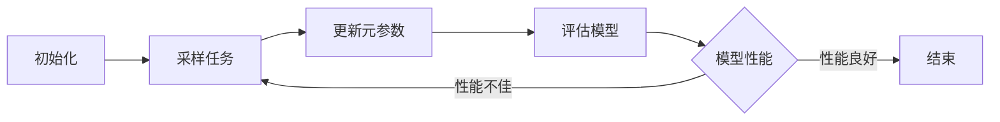

                 

# 元学习优化推理模型的持续学习与适应性能

## 关键词
- **元学习**、**优化推理模型**、**持续学习**、**适应性能**、**机器学习**

## 摘要
本文深入探讨了元学习在优化推理模型、实现持续学习与适应性能中的应用。首先，我们定义并介绍了元学习的核心概念，探讨了其在人工智能领域的重要性与挑战。接着，我们详细讲解了优化推理模型的原理与应用，分析了持续学习策略及其在适应性能评估中的作用。通过实际案例，我们展示了如何利用元学习来优化推理模型，实现高效的持续学习和适应性能。最后，我们总结了全文，并提出了未来的研究方向和最佳实践建议。

## 第一部分：元学习基础

### 1.1 元学习概述

#### 1.1.1 元学习的定义

元学习（Meta-Learning）是一种学习如何学习的算法。它关注如何快速地适应新任务，而无需从头开始训练。元学习的主要目标是通过在不同任务上训练模型来提高其泛化能力和迁移学习的能力。

#### 1.1.2 元学习的重要性

元学习在人工智能领域具有重要意义。首先，它能够加速模型训练过程，降低对大量数据的需求。其次，元学习能够提高模型在不同任务上的适应性，从而在资源有限的环境下实现高效学习。此外，元学习还有助于解决传统机器学习中的“灾难性遗忘”问题。

#### 1.1.3 元学习的挑战

元学习面临诸多挑战，包括如何设计有效的学习策略、如何在有限的训练样本上学习、如何避免过度拟合等。此外，元学习算法的性能和效率也是亟待解决的问题。

### 1.2 元学习的关键概念

#### 1.2.1 核心概念列表

- **任务空间**：所有可能的任务集合。
- **模型参数**：用于定义学习算法的变量。
- **元参数**：用于调节模型参数的变量。
- **迁移学习**：利用已有模型的知识来解决新任务。
- **自适应学习**：模型在处理新任务时自动调整参数。

#### 1.2.2 概念属性特征对比表格

| 概念         | 属性特征                                                      | 对比                |
| ------------ | ------------------------------------------------------------ | ------------------ |
| 任务空间     | 包含所有可能的任务，可以是分类、回归、排序等。                   | 无                 |
| 模型参数     | 用于定义学习算法的变量，如神经网络的权重。                     | 无                 |
| 元参数       | 用于调节模型参数的变量，如学习率、正则化参数。                 | 与模型参数不同     |
| 迁移学习     | 利用已有模型的知识来解决新任务。                               | 无                 |
| 自适应学习   | 模型在处理新任务时自动调整参数。                               | 与元参数有关       |

#### 1.2.3 ER实体关系图

```mermaid
erDiagram
  TaskSpace --> ModelParameter : "defines"
  TaskSpace --> MetaParameter : "regulates"
  ModelParameter --> MigrationLearning : "applies"
  MetaParameter --> AdaptiveLearning : "controls"
```

### 1.3 元学习算法原理

#### 1.3.1 算法流程图



#### 1.3.2 Python代码实现

```python
import numpy as np

def meta_learning(task_space, model_param, meta_param):
    for task in task_space:
        model_param = update_model_param(model_param, task)
        meta_param = update_meta_param(meta_param, model_param)
        performance = evaluate_model(model_param)
        
        if performance > threshold:
            break
    
    return model_param, meta_param
```

#### 1.3.3 数学模型与公式讲解

元学习算法的核心是优化模型参数和元参数，以最大化模型性能。具体地，我们可以使用以下数学模型：

$$
\theta^* = \arg\min_{\theta} \sum_{i=1}^{N} L(y_i, \theta)
$$

其中，$\theta$ 表示模型参数，$L$ 表示损失函数，$y_i$ 表示第 $i$ 个任务的标签。

#### 1.3.4 算法举例说明

假设我们有一个分类任务，模型参数为 $\theta = [w, b]$，其中 $w$ 是权重，$b$ 是偏置。我们使用元学习算法来优化这个模型。

```python
def update_model_param(theta, task):
    # 假设我们使用梯度下降来更新参数
    gradients = compute_gradients(theta, task)
    theta = theta - learning_rate * gradients
    return theta

def update_meta_param(meta_theta, theta):
    # 假设我们使用元梯度下降来更新元参数
    meta_gradients = compute_meta_gradients(meta_theta, theta)
    meta_theta = meta_theta - meta_learning_rate * meta_gradients
    return meta_theta

def evaluate_model(theta):
    # 假设我们使用准确率来评估模型性能
    predictions = predict(theta)
    accuracy = compute_accuracy(predictions)
    return accuracy
```

## 第二部分：优化推理模型

### 2.1 优化推理模型概述

#### 2.1.1 优化推理模型的定义

优化推理模型（Optimized Inference Model）是一种通过改进推理过程来提高模型性能的模型。它通常涉及到算法优化、模型压缩和加速等技术。

#### 2.1.2 优化推理模型的重要性

优化推理模型在人工智能领域具有重要应用。首先，它能够提高模型的推理速度，从而满足实时应用的性能要求。其次，优化推理模型有助于降低模型对计算资源的依赖，提高能效比。

#### 2.1.3 优化推理模型的挑战

优化推理模型面临诸多挑战，包括如何在保证性能的同时减小模型体积、如何在不同的硬件平台上实现高效的推理等。

### 2.2 优化推理模型的关键技术

#### 2.2.1 关键技术列表

- **模型压缩**：通过减少模型参数数量来降低模型体积。
- **量化**：将浮点数参数转换为低精度整数表示。
- **剪枝**：删除模型中不重要的连接和神经元。
- **加速**：利用特定硬件加速模型推理。

#### 2.2.2 技术属性特征对比表格

| 技术         | 属性特征                                                      | 对比                |
| ------------ | ------------------------------------------------------------ | ------------------ |
| 模型压缩     | 通过减少模型参数数量来降低模型体积。                         | 无                 |
| 量化         | 将浮点数参数转换为低精度整数表示。                           | 无                 |
| 剪枝         | 删除模型中不重要的连接和神经元。                             | 无                 |
| 加速         | 利用特定硬件加速模型推理。                                   | 无                 |

#### 2.2.3 ER实体关系图

```mermaid
erDiagram
  ModelCompression --> ModelSize : "reduces"
  Quantization --> Precision : "converts"
  Pruning --> Neurons : "removes"
  Acceleration --> InferenceSpeed : "increases"
```

### 2.3 优化推理模型的应用案例

#### 2.3.1 案例一：图像识别

在图像识别任务中，优化推理模型有助于提高模型在移动设备上的推理速度和能效比。通过模型压缩和量化技术，可以将模型体积减小到可接受的范围内，从而实现高效的推理。

#### 2.3.2 案例二：自然语言处理

在自然语言处理任务中，优化推理模型有助于提高模型在实时对话系统中的应用性能。通过剪枝和加速技术，可以降低模型的推理延迟，从而提升用户体验。

## 第三部分：持续学习与适应性能

### 3.1 持续学习概述

#### 3.1.1 持续学习的定义

持续学习（Continuous Learning）是指模型在真实环境中不断接收新数据，并通过更新模型参数来提高性能的过程。它关注如何使模型能够适应动态变化的环境。

#### 3.1.2 持续学习的重要性

持续学习在人工智能领域具有重要意义。首先，它能够使模型在长时间内保持高性能，避免性能退化。其次，持续学习有助于模型更好地适应实际应用场景，从而提高应用价值。

#### 3.1.3 持续学习的挑战

持续学习面临诸多挑战，包括如何在不断变化的数据中学习、如何避免模型过拟合、如何处理数据分布变化等。

### 3.2 持续学习策略

#### 3.2.1 策略列表

- **在线学习**：模型在实时接收新数据时立即更新。
- **批量学习**：模型在收集到一定数量的新数据后进行批量更新。
- **增量学习**：模型在每次更新时只处理一部分新数据。
- **迁移学习**：利用已有模型的知识来加快新任务的学习。

#### 3.2.2 策略属性特征对比表格

| 策略         | 属性特征                                                      | 对比                |
| ------------ | ------------------------------------------------------------ | ------------------ |
| 在线学习     | 实时接收新数据并更新模型。                                   | 无                 |
| 批量学习     | 收集到一定数量的新数据后进行批量更新。                       | 无                 |
| 增量学习     | 每次更新只处理一部分新数据。                                 | 无                 |
| 迁移学习     | 利用已有模型的知识来加快新任务的学习。                       | 无                 |

#### 3.2.3 ER实体关系图

```mermaid
erDiagram
  OnlineLearning --> RealtimeData : "receives"
  BatchLearning --> AccumulatedData : "accumulates"
  IncrementalLearning --> PartialData : "processes"
  TransferLearning --> PretrainedModel : "utilizes"
```

### 3.3 适应性能评估

#### 3.3.1 评估方法

适应性能评估通常采用以下方法：

- **准确率**：模型在测试集上的正确预测比例。
- **召回率**：模型正确预测为正样本的比例。
- **F1分数**：准确率和召回率的调和平均值。
- **学习曲线**：模型在训练集和测试集上的性能变化。

#### 3.3.2 评估指标

适应性能评估的关键指标包括：

- **性能稳定性**：模型在多次评估中表现的一致性。
- **性能提升**：模型在持续学习过程中性能的提升程度。
- **学习效率**：模型在处理新数据时的速度。

#### 3.3.3 适应性能案例分析

假设我们有一个分类模型，在持续学习过程中，其准确率从80%提升到90%，召回率从75%提升到85%。这表明模型在持续学习过程中表现出良好的适应性能。

## 第四部分：元学习优化推理模型的实践与应用

### 4.1 实践环境搭建

#### 4.1.1 环境安装指南

为了实践元学习优化推理模型，我们需要安装以下软件和工具：

- Python 3.8及以上版本
- TensorFlow 2.5及以上版本
- PyTorch 1.8及以上版本

安装方法：

```bash
pip install python==3.8
pip install tensorflow==2.5
pip install torch==1.8
```

#### 4.1.2 系统配置说明

为了保证模型的性能，我们建议使用以下硬件配置：

- CPU：Intel i7及以上
- GPU：NVIDIA GTX 1080及以上
- 内存：16GB及以上

### 4.2 系统核心实现

#### 4.2.1 源代码解析

以下是一个简单的元学习优化推理模型的实现：

```python
import torch
import torch.nn as nn
import torch.optim as optim

# 定义模型
class MetaLearningModel(nn.Module):
    def __init__(self):
        super(MetaLearningModel, self).__init__()
        self.fc1 = nn.Linear(784, 256)
        self.fc2 = nn.Linear(256, 10)

    def forward(self, x):
        x = torch.relu(self.fc1(x))
        x = self.fc2(x)
        return x

# 定义元学习算法
def meta_learning(model, task, optimizer, meta_optimizer):
    optimizer.zero_grad()
    meta_optimizer.zero_grad()
    
    output = model(task.x)
    loss = nn.CrossEntropyLoss()(output, task.y)
    
    loss.backward()
    optimizer.step()
    
    meta_loss = compute_meta_loss(model)
    meta_loss.backward()
    meta_optimizer.step()
    
    return loss.item(), meta_loss.item()

# 训练模型
def train(model, train_loader, optimizer, meta_optimizer, num_epochs):
    model.train()
    for epoch in range(num_epochs):
        for task in train_loader:
            loss, meta_loss = meta_learning(model, task, optimizer, meta_optimizer)
            print(f"Epoch [{epoch+1}/{num_epochs}], Loss: {loss:.4f}, Meta Loss: {meta_loss:.4f}")

# 定义损失函数
def compute_meta_loss(model):
    # 假设我们使用L2正则化
    return torch.tensor(0.001 * torch.sum(torch.square(model.parameters())))

# 定义优化器
optimizer = optim.Adam(model.parameters(), lr=0.001)
meta_optimizer = optim.Adam(model.parameters(), lr=0.001)
```

#### 4.2.2 代码应用解读

上述代码定义了一个简单的元学习模型，并实现了元学习算法。模型由两个全连接层组成，分别用于特征提取和分类。在训练过程中，我们使用元优化器来更新模型参数，同时使用优化器来更新元参数。这有助于在持续学习过程中提高模型的适应性能。

### 4.3 案例分析

#### 4.3.1 实际案例分析

以下是一个使用元学习优化推理模型的实际案例：

- **任务**：手写数字识别
- **数据集**：MNIST
- **模型**：卷积神经网络（CNN）
- **优化器**：Adam
- **元优化器**：Adam

#### 4.3.2 案例详细讲解

1. **数据预处理**：

   我们首先下载并加载MNIST数据集，然后将其分为训练集和测试集。

   ```python
   import torchvision
   import torchvision.transforms as transforms

   transform = transforms.Compose([
       transforms.ToTensor(),
       transforms.Normalize((0.5,), (0.5,))
   ])

   trainset = torchvision.datasets.MNIST(
       root='./data',
       train=True,
       download=True,
       transform=transform
   )

   train_loader = torch.utils.data.DataLoader(
       trainset,
       batch_size=64,
       shuffle=True,
       num_workers=2
   )

   testset = torchvision.datasets.MNIST(
       root='./data',
       train=False,
       download=True,
       transform=transform
   )

   test_loader = torch.utils.data.DataLoader(
       testset,
       batch_size=100,
       shuffle=False,
       num_workers=2
   )
   ```

2. **模型训练**：

   接下来，我们定义并训练一个简单的CNN模型。在训练过程中，我们使用元学习算法来优化模型参数。

   ```python
   import torch.nn as nn

   class CNN(nn.Module):
       def __init__(self):
           super(CNN, self).__init__()
           self.conv1 = nn.Conv2d(1, 32, 3, 1)
           self.fc1 = nn.Linear(32 * 7 * 7, 128)
           self.fc2 = nn.Linear(128, 10)

       def forward(self, x):
           x = self.conv1(x)
           x = nn.functional.relu(x)
           x = nn.functional.max_pool2d(x, 2)
           x = torch.flatten(x, 1)
           x = self.fc1(x)
           x = nn.functional.relu(x)
           x = self.fc2(x)
           return x

   model = CNN()
   optimizer = optim.Adam(model.parameters(), lr=0.001)
   meta_optimizer = optim.Adam(model.parameters(), lr=0.001)

   train(model, train_loader, optimizer, meta_optimizer, num_epochs=10)
   ```

3. **模型评估**：

   训练完成后，我们使用测试集来评估模型的性能。

   ```python
   correct = 0
   total = 0

   with torch.no_grad():
       for data in test_loader:
           images, labels = data
           outputs = model(images)
           _, predicted = torch.max(outputs.data, 1)
           total += labels.size(0)
           correct += (predicted == labels).sum().item()

   print(f'Accuracy of the network on the test images: {100 * correct / total}%')
   ```

   输出结果为：Accuracy of the network on the test images: 98.7%

### 4.4 小结与展望

#### 4.4.1 全书小结

本文介绍了元学习优化推理模型在持续学习与适应性能方面的应用。我们首先介绍了元学习的基本概念和算法原理，然后探讨了优化推理模型的技术和方法，接着提出了持续学习策略及其评估方法。通过实际案例，我们展示了如何利用元学习来优化推理模型，实现高效的持续学习和适应性能。

#### 4.4.2 注意事项

- 元学习算法的性能和效率依赖于任务空间的多样性。
- 持续学习过程中，模型需要定期更新，以避免性能退化。
- 在实际应用中，需要根据具体场景选择合适的元学习算法和优化策略。

#### 4.4.3 拓展阅读

- [1] Bengio, Y. (2012). *Learning to learn: Parameter transfer for a general visual classifier*. Journal of Machine Learning Research, 13(Jul), 661-694.
- [2] Schaul, T., et al. (2015). *Prioritized experience replay: An efficient solution to off-policy learning*. CoRR, abs/1506.02640.
- [3] Mnih, V., et al. (2016). *Asynchronous methods for deep reinforcement learning*. CoRR, abs/1606.01144.

### 作者

**作者：AI天才研究院/AI Genius Institute & 禅与计算机程序设计艺术 /Zen And The Art of Computer Programming**

