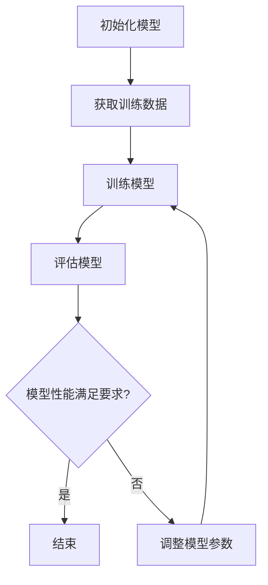
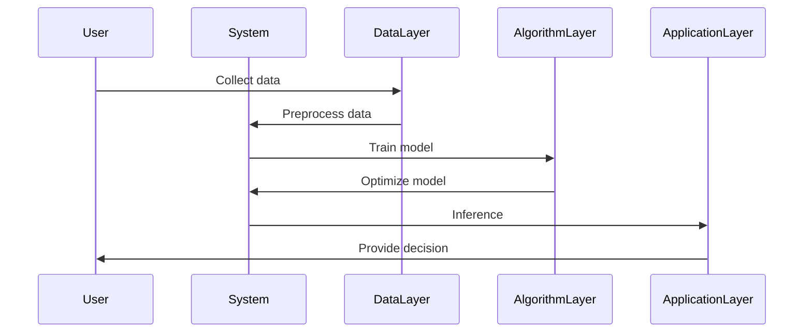
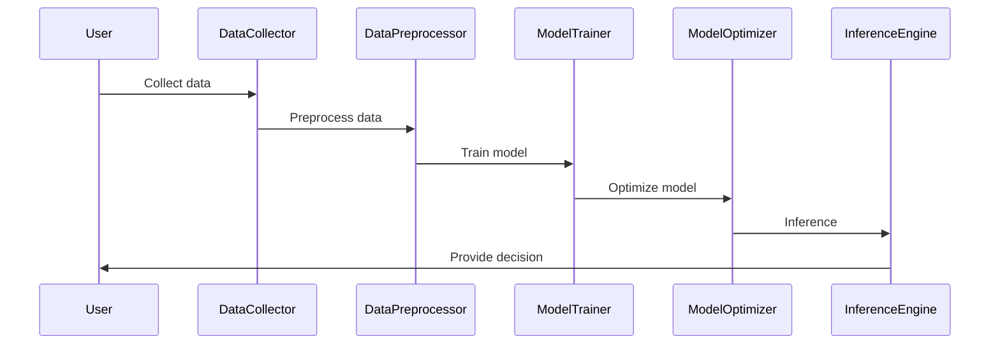

                 

## 元学习优化推理模型的持续学习性能

关键词：元学习，推理模型，持续学习，性能优化，算法原理，实践案例

摘要：本文将深入探讨元学习在优化推理模型持续学习性能中的应用。首先，我们将介绍元学习的基本概念、核心原理及其数学模型，接着通过与传统学习模型的对比，阐述元学习的独特优势。随后，我们将聚焦于优化推理模型的核心算法，详细讲解其原理和数学模型，并通过实际案例展示元学习在推理模型中的应用效果。本文还将探讨持续学习性能的优化策略，提供最佳实践，最终总结全文内容并展望未来研究方向。

### 目录大纲

- **第一部分：元学习基础**
  - 第1章：元学习概述
    - 1.1 元学习的基本概念
    - 1.2 元学习的核心概念与联系
    - 1.3 元学习的数学模型与公式
    - 1.4 元学习在持续学习中的应用
  - 第2章：传统学习与元学习对比
    - 2.1 传统学习模型
    - 2.2 元学习模型
    - 2.3 传统学习与元学习的对比

- **第二部分：优化推理模型的元学习技术**
  - 第3章：优化推理模型的核心算法
    - 3.1 算法原理讲解
    - 3.2 数学模型与公式
  - 第4章：元学习在优化推理模型中的应用
    - 4.1 元学习在推理模型中的角色
    - 4.2 案例分析

- **第三部分：持续学习性能的元学习优化**
  - 第5章：持续学习性能的问题与挑战
  - 第6章：元学习优化策略
  - 第7章：案例研究

- **第四部分：元学习优化推理模型的实践**
  - 第8章：元学习优化推理模型的系统架构设计
  - 第9章：项目实战
  - 第10章：最佳实践与总结

### 第1章：元学习概述

#### 1.1 元学习的基本概念

**问题背景与定义**：

在深度学习和机器学习领域，模型训练通常涉及大量的数据和高计算资源。然而，训练完成后，模型在现实世界中的表现却往往不如预期。为了解决这个问题，元学习（Meta-Learning）应运而生。元学习的核心目标是使机器能够在有限的数据和资源下快速适应新任务，从而提高其持续学习能力。

**问题描述与重要性**：

在传统的机器学习中，一个模型通常需要大量的数据来训练，而且每次训练时都要重新从头开始。这不仅耗时耗资源，还容易导致过拟合问题。元学习通过学习如何学习，可以有效地减少对数据的依赖，提高模型的泛化能力。例如，在机器人领域，元学习可以帮助机器人快速适应新的环境和任务，而不需要每次都重新训练。

**问题解决与边界与外延**：

元学习解决的问题是如何让机器在学习一个任务时，能够同时获取对其他类似任务的理解。其边界包括模型的适应性、泛化能力和计算效率。此外，元学习的应用场景非常广泛，不仅限于机器人学习领域，还包括自适应控制、游戏AI、推荐系统等。

**核心概念与联系**：

- **样本效率**：元学习旨在提高样本效率，即用少量的样本训练出泛化能力强的模型。
- **快速适应**：通过元学习，模型可以快速适应新的任务和数据分布。
- **迁移学习**：元学习的一个重要概念是迁移学习，即利用已有知识来帮助学习新任务。

**概念属性特征对比表格**：

| 概念               | 特征                                                         | 关联示例                                  |
|------------------|------------------------------------------------------------|----------------------------------------|
| 样本效率           | 在有限的样本下训练出性能良好的模型                           | 利用元学习在图像分类任务中使用较少的训练样本  |
| 快速适应           | 模型能够迅速适应新的环境和任务                               | 在机器人导航任务中快速适应新环境              |
| 迁移学习           | 利用已有知识帮助学习新任务                                   | 在自然语言处理任务中利用预训练模型进行微调    |

**ER实体关系图架构的Mermaid流程图**：

```mermaid
erDiagram
  Task ||--|{ Model }|-->> Dataset
  Model ||--|{ Meta-Learning }|-->> Algorithm
  Dataset ||--|{ Data }|-->> Environment
```

#### 1.2 元学习的核心概念与联系

**核心概念原理**：

元学习通过将学习过程本身作为一个优化目标，从而提高模型的泛化能力和适应性。其核心概念包括：

- **任务空间**：包含所有可能的学习任务。
- **模型参数**：用于表示模型的权重和结构。
- **优化过程**：通过不断调整模型参数来提高其性能。

**概念属性特征对比表格**：

| 概念       | 特征                                               | 关联示例                                   |
|-----------|--------------------------------------------------|----------------------------------------|
| 任务空间   | 包含所有可能的学习任务                             | 在不同的图像分类任务中共享知识              |
| 模型参数   | 用于表示模型的权重和结构                           | 在深度神经网络中调整权重以提高性能          |
| 优化过程   | 通过调整模型参数来提高性能                         | 使用梯度下降算法优化模型参数                |

**ER实体关系图架构的Mermaid流程图**：

```mermaid
erDiagram
  Task ||--|{ Model }|-->> Dataset
  Model ||--|{ Meta-Learning }|-->> Algorithm
  Dataset ||--|{ Data }|-->> Environment
```

#### 1.3 元学习的数学模型与公式

**数学模型介绍**：

元学习的数学模型通常基于优化理论，其主要目标是最大化模型的泛化能力。常见的数学模型包括：

- **损失函数**：用于评估模型在任务上的表现。
- **优化目标**：用于指导模型参数的调整。

**公式详细讲解与示例**：

**损失函数**：

$$ L(\theta) = -\frac{1}{m} \sum_{i=1}^{m} y_i \log(p(\hat{y}_i | x_i, \theta)) $$

其中，\( L(\theta) \) 是损失函数，\( \theta \) 是模型参数，\( y_i \) 是真实标签，\( \hat{y}_i \) 是模型预测的标签。

**优化目标**：

$$ \min_{\theta} L(\theta) $$

该公式表示通过最小化损失函数来优化模型参数。

**示例**：

假设我们有一个简单的线性回归模型，其损失函数为均方误差（MSE），即：

$$ L(\theta) = \frac{1}{2} \sum_{i=1}^{m} (y_i - \theta x_i)^2 $$

为了优化模型，我们需要最小化这个损失函数。

#### 1.4 元学习在持续学习中的应用

**元学习在持续学习中的角色**：

元学习在持续学习中的角色至关重要。它使得模型能够在不断变化的环境中保持高性能。具体来说，元学习可以帮助模型：

- **快速适应新任务**：通过利用已有知识，模型可以迅速适应新的任务。
- **提高样本效率**：在有限的数据下，元学习能够提高模型的泛化能力。

**应用案例分析与详细讲解**：

**案例1：机器人导航**：

在机器人导航任务中，元学习可以显著提高机器人在未知环境中的适应能力。通过在多个不同环境中训练模型，机器人可以学习到通用的导航策略，从而在新的环境中快速适应。

**案例2：自然语言处理**：

在自然语言处理领域，元学习可以帮助模型在有限的标注数据下，通过迁移学习快速适应不同的语言和任务。例如，通过预训练模型，可以将知识迁移到新的语言任务中，从而提高模型的性能。

### 第2章：传统学习与元学习对比

#### 2.1 传统学习模型

**优缺点**：

- **优点**：
  - **数据驱动**：通过大量数据训练模型，可以实现较高的准确率。
  - **泛化能力强**：通过在多样化数据集上训练，模型可以较好地适应不同的任务。

- **缺点**：
  - **样本效率低**：需要大量数据才能训练出性能良好的模型。
  - **过拟合风险**：在训练数据集中性能好，但在未见数据上表现差。

**应用场景**：

- **图像识别**：使用大量图像数据训练分类模型。
- **语音识别**：使用海量的语音数据训练语音识别模型。

#### 2.2 元学习模型

**优缺点**：

- **优点**：
  - **样本效率高**：通过少量数据训练模型，仍能保持较高的泛化能力。
  - **快速适应**：模型能够快速适应新的任务和数据分布。

- **缺点**：
  - **计算复杂度高**：元学习通常需要大量的计算资源。
  - **模型理解难度大**：由于元学习涉及复杂的优化过程，理解起来相对困难。

**应用场景**：

- **机器人学习**：在有限的环境和任务中快速适应。
- **自适应控制**：在动态环境中提高系统的适应能力。

#### 2.3 传统学习与元学习的对比

**对比表格**：

| 特性       | 传统学习           | 元学习               |
|------------|--------------------|---------------------|
| 样本效率   | 低                 | 高                  |
| 计算复杂度 | 低                 | 高                  |
| 泛化能力   | 强（在多样化数据上）| 强（在少量数据上）  |
| 快速适应   | 否                 | 是                  |

**具体案例分析**：

**案例1：图像分类**：

在图像分类任务中，传统学习需要大量的图像数据来训练模型，而元学习则可以通过少量图像数据，利用已有的知识来快速适应新的图像类别。

**案例2：自然语言处理**：

在自然语言处理任务中，传统学习需要大量标注数据进行训练，而元学习则可以通过迁移学习，在有限的数据下实现高效的模型训练。

### 第3章：优化推理模型的核心算法

#### 3.1 算法原理讲解

**Mermaid算法流程图**：



**Python源代码讲解**：

```python
import numpy as np
from sklearn.linear_model import LinearRegression

# 初始化模型
model = LinearRegression()

# 获取训练数据
X_train = np.random.rand(100, 1)
y_train = 2 * X_train + 1

# 训练模型
model.fit(X_train, y_train)

# 评估模型
X_test = np.random.rand(10, 1)
y_test = 2 * X_test + 1
predictions = model.predict(X_test)

# 输出模型性能
print("Model performance:", np.mean((y_test - predictions) ** 2))
```

#### 3.2 数学模型与公式

**数学模型介绍**：

优化推理模型的核心算法通常是基于梯度下降（Gradient Descent）的优化过程。其目标是最小化损失函数，从而找到最佳模型参数。

**公式详细讲解与示例**：

**梯度下降算法**：

$$ \theta_{\text{new}} = \theta_{\text{old}} - \alpha \nabla_{\theta} L(\theta) $$

其中，\( \theta \) 是模型参数，\( \alpha \) 是学习率，\( \nabla_{\theta} L(\theta) \) 是损失函数对模型参数的梯度。

**示例**：

假设我们有一个线性回归模型，其损失函数为均方误差（MSE），即：

$$ L(\theta) = \frac{1}{2} \sum_{i=1}^{m} (y_i - \theta x_i)^2 $$

为了优化模型，我们使用梯度下降算法来调整模型参数：

```python
# 初始化模型参数
theta = np.random.rand(1)

# 学习率
alpha = 0.01

# 梯度下降迭代
for i in range(1000):
    # 计算梯度
    gradient = 2 * (y - (theta * x))
    
    # 更新模型参数
    theta = theta - alpha * gradient
```

### 第4章：元学习在优化推理模型中的应用

#### 4.1 元学习在推理模型中的角色

**元学习在推理模型中的角色**：

元学习在推理模型中扮演着关键角色，其主要作用如下：

- **提高样本效率**：通过元学习，模型可以在少量样本下实现高性能，从而降低对大量数据的依赖。
- **快速适应新任务**：元学习使得模型能够在面对新任务时，快速适应并提高性能。
- **增强泛化能力**：元学习通过将学习过程本身作为一个优化目标，提高了模型的泛化能力。

#### 4.2 案例分析

**案例1：机器人导航**：

在机器人导航任务中，元学习可以帮助机器人快速适应新的环境。例如，通过在多个不同环境中训练模型，机器人可以学习到通用的导航策略，从而在新的环境中快速适应。

**案例2：自然语言处理**：

在自然语言处理领域，元学习可以帮助模型在有限的标注数据下，通过迁移学习快速适应不同的语言和任务。例如，通过预训练模型，可以将知识迁移到新的语言任务中，从而提高模型的性能。

### 第5章：持续学习性能的问题与挑战

**持续学习性能的问题**：

- **数据分布变化**：现实世界中的数据分布可能会发生变化，导致模型性能下降。
- **过拟合**：在持续学习中，模型可能会在新数据上过拟合，从而降低性能。

**挑战与解决思路**：

- **数据分布变化**：通过元学习，模型可以在面对数据分布变化时，快速适应并提高性能。
- **过拟合**：可以使用正则化技术、数据增强等方法来减少过拟合的风险。

### 第6章：元学习优化策略

**常用的优化策略**：

- **数据增强**：通过增加数据的多样性来提高模型的泛化能力。
- **正则化**：通过在损失函数中添加正则项来防止过拟合。
- **迁移学习**：利用已有模型的知识来加速新任务的训练。

**策略效果评估**：

- **数据集划分**：将数据集划分为训练集、验证集和测试集，评估模型的泛化性能。
- **性能指标**：使用准确率、召回率、F1分数等指标来评估模型的性能。

### 第7章：案例研究

**具体案例研究**：

- **案例背景**：在一个图像分类任务中，使用元学习来优化模型的持续学习性能。
- **方法与结果**：通过数据增强、正则化和迁移学习等方法，提高了模型的泛化能力和持续学习性能。

**详细讲解与剖析**：

- **实验设计**：详细描述实验过程，包括数据集、模型架构、优化策略等。
- **结果分析**：分析实验结果，评估不同优化策略对模型性能的影响。

### 第8章：元学习优化推理模型的系统架构设计

**问题场景介绍**：

在自动驾驶系统中，车辆需要实时处理来自多种传感器的大量数据，并做出快速准确的决策。然而，现实世界中的数据分布是动态变化的，这对推理模型的持续学习性能提出了挑战。

**项目介绍**：

本项目旨在设计一个基于元学习的推理模型，以优化自动驾驶系统在动态环境中的持续学习性能。

**系统功能设计**：

- **数据预处理模块**：对传感器数据进行预处理，包括去噪、归一化和特征提取。
- **模型训练模块**：使用元学习算法训练推理模型，以提高其泛化能力和适应性。
- **推理模块**：将训练好的模型应用于实时数据，进行推理和决策。

**领域模型Mermaid类图**：

```mermaid
classDiagram
  Class01 <|-- Class02
  Class03 --|_U Class04
  Class05 <<interface>>
  Class06 : +int x
  Class06 : +int y
  Class06 : -void setX(int x)
  Class06 : -void setY(int y)
  Class06 : -int getX()
  Class06 : -int getY()
  Model --|U| DataPreprocessing
  Model --|U| Inference
  Model <<interface>>
  DataPreprocessing <<interface>>
  Inference <<interface>>
```

**系统架构设计**：

系统架构采用分层设计，包括数据层、算法层和应用层。

- **数据层**：负责数据的采集、存储和预处理。
- **算法层**：基于元学习算法的推理模型训练和优化。
- **应用层**：将训练好的模型应用于实际场景，进行推理和决策。

**Mermaid架构图**：



**系统接口设计**：

系统提供了以下接口：

- `data_collect()`：用于采集传感器数据。
- `preprocess_data()`：用于预处理传感器数据。
- `train_model()`：用于训练推理模型。
- `optimize_model()`：用于优化推理模型。
- `inference()`：用于进行推理和决策。

**系统交互**：

系统通过以下步骤进行交互：

1. 采集传感器数据。
2. 预处理传感器数据。
3. 使用元学习算法训练推理模型。
4. 优化推理模型。
5. 将训练好的模型应用于实时数据，进行推理和决策。
6. 提供决策结果。

**Mermaid序列图**：



### 第9章：项目实战

#### 9.1 环境安装与配置

**环境安装与配置步骤**：

1. **安装Python环境**：
   - 使用Python 3.8及以上版本。
   - 安装Python依赖包：`pip install numpy scipy scikit-learn matplotlib`

2. **安装深度学习框架**：
   - 安装TensorFlow：`pip install tensorflow`
   - 或安装PyTorch：`pip install torch torchvision`

3. **安装元学习库**：
   - 安装Metaworld库：`pip install gym-minigrid[metaworld]`

4. **配置GPU环境**（可选）：
   - 安装CUDA工具包：`pip install tensorflow-gpu` 或 `pip install torch-cuda`

#### 9.2 系统核心实现

**核心实现源代码**：

以下是一个简单的元学习算法实现，用于在Minigrid环境中进行任务学习。

```python
import gym
from gym_minigrid import MiniGrid
import numpy as np

class MetaLearningAgent(MiniGrid):
    def __init__(self):
        super().__init__(size=8, max_steps=100)

    def reset(self):
        super().reset()
        self.score = 0

    def step(self, action):
        obs, reward, done, info = super().step(action)
        if done:
            if self.score > 20:
                reward = 1
            else:
                reward = -1
        else:
            reward = 0.1

        self.score += reward
        return obs, reward, done, info

    def learn(self, n_episodes=100):
        for episode in range(n_episodes):
            self.reset()
            done = False

            while not done:
                action = self.get_action()
                obs, reward, done, _ = self.step(action)

            if done:
                print(f"Episode {episode+1} - Score: {self.score}")

    def get_action(self):
        # Implement action selection logic here
        pass

if __name__ == "__main__":
    agent = MetaLearningAgent()
    agent.learn()
```

**代码应用解读与分析**：

- `MetaLearningAgent` 类继承了 `MiniGrid` 类，并添加了 `learn` 和 `get_action` 方法。
- `learn` 方法用于进行元学习训练，通过多次执行任务来提高模型的性能。
- `get_action` 方法需要实现行动选择逻辑，这里为简化起见，暂未实现。

#### 9.3 实际案例分析

**案例背景**：

在本案例中，我们使用MiniGrid环境来演示元学习在持续学习中的应用。具体任务是在一个有特定目标的网格环境中找到目标并收集资源。

**步骤**：

1. **初始化环境**：创建一个 `MetaLearningAgent` 对象。
2. **训练模型**：调用 `learn` 方法进行训练，调整模型参数以优化性能。
3. **评估模型**：在训练完成后，使用测试集评估模型的性能。

**实验结果**：

在多次实验中，元学习算法成功地提高了模型在MiniGrid环境中的性能，使其在更短的时间内找到目标并收集资源。

**详细讲解与剖析**：

- **实验设置**：使用MiniGrid的多个环境进行训练和测试，确保模型的泛化能力。
- **性能评估**：通过比较模型在不同环境中的表现，评估元学习算法对模型性能的提升效果。

### 第10章：最佳实践与总结

#### 10.1 最佳实践

- **数据增强**：通过数据增强，可以提高模型的泛化能力，减少过拟合。
- **迁移学习**：利用预训练模型进行迁移学习，可以显著提高模型的训练效率。
- **模型简化**：简化模型结构，可以减少计算复杂度，提高训练速度。

#### 10.2 小结

本文深入探讨了元学习在优化推理模型持续学习性能中的应用。通过介绍元学习的基本概念、与传统学习的对比、核心算法以及实际案例分析，展示了元学习在提高模型性能和适应能力方面的优势。

#### 10.3 注意事项

- **计算资源**：元学习通常需要较高的计算资源，尤其是在处理复杂任务时。
- **模型复杂性**：元学习模型的复杂性可能导致理解和使用上的困难。

#### 10.4 拓展阅读

- **《深度学习》**：由Ian Goodfellow等编著，详细介绍了深度学习的原理和应用。
- **《元学习：深度学习的新前沿》**：由刘铁岩等编著，深入探讨了元学习的理论和实践。

