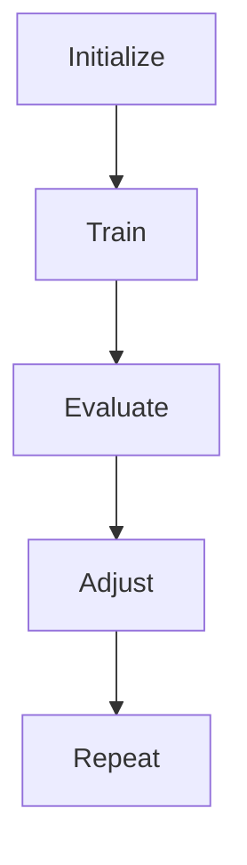

                 

### 《元学习在个性化AI系统中的应用》

#### 关键词：
- 元学习
- 个性化AI
- 推荐系统
- 教育系统
- 医疗系统

#### 摘要：
本文将深入探讨元学习在个性化AI系统中的应用。首先，我们将介绍元学习的基础概念和原理，接着分析元学习算法及其在个性化AI系统中的实际应用。通过案例分析，我们将展示元学习在个性化推荐、教育和医疗系统中的具体应用，并讨论其优势和挑战。最后，我们将展望元学习在个性化AI系统中的未来发展，并总结最佳实践。

---

### 第一部分：元学习基础

#### 第1章：元学习概述

##### 1.1 问题背景与定义

##### 1.2 元学习的概念与核心要素

##### 1.3 元学习的发展历程

#### 第2章：元学习算法原理

##### 2.1 元学习算法概述

##### 2.2 Meta-Learning算法流程与Mermaid流程图

##### 2.3 Python代码实现

##### 2.4 元学习算法的数学模型与公式讲解

#### 第3章：元学习在个性化AI系统中的应用

##### 3.1 个性化AI系统概述

##### 3.2 元学习在个性化AI中的应用场景

##### 3.3 元学习在个性化AI中的优势与挑战

### 第二部分：实际案例分析

#### 第4章：实际案例分析

##### 4.1 案例一：基于元学习的个性化推荐系统

##### 4.2 案例二：基于元学习的个性化教育系统

### 第三部分：应用展望与最佳实践

#### 第5章：应用展望

##### 5.1 未来的发展趋势

##### 5.2 应用前景与影响

#### 第6章：最佳实践与总结

##### 6.1 最佳实践

##### 6.2 总结

---

### 第一部分：元学习基础

#### 第1章：元学习概述

##### 1.1 问题背景与定义

##### 1.1.1 问题背景

在当今信息爆炸的时代，人工智能（AI）已经成为推动社会进步的重要力量。AI技术广泛应用于推荐系统、自动驾驶、语音识别等领域，大大提升了效率和用户体验。然而，传统的机器学习（ML）方法在处理复杂任务时存在一定局限性，特别是在任务数量庞大、任务之间相似度较低的情况下，模型需要从零开始训练，这导致了巨大的计算资源和时间成本。

为了解决这一问题，研究者们提出了元学习（Meta-Learning）的概念。元学习旨在通过快速学习如何学习（learning to learn）的方法，提高AI系统的泛化能力，减少对大规模训练数据集的依赖，从而提高模型的效率和准确性。

##### 1.1.2 元学习的定义

元学习，又称“学习的学习”，是指通过一种模型或算法来学习其他模型或算法的学习过程。在元学习的框架下，模型不再仅仅是一个静态的参数集合，而是一个动态的学习机制，能够根据不同的任务自动调整其学习策略。

##### 1.1.3 元学习的重要性

元学习的重要性主要体现在以下几个方面：

1. **提高泛化能力**：通过元学习，模型可以在不同的任务上快速适应，提高其在未知数据上的泛化能力。
2. **减少数据需求**：元学习可以减少对大规模训练数据的需求，降低数据获取和处理成本。
3. **加速训练过程**：元学习算法可以快速地学习任务，从而缩短模型的训练时间。
4. **增强系统灵活性**：元学习使得AI系统能够更加灵活地处理多样化的任务，提高系统的实用性。

##### 1.2 元学习的概念与核心要素

##### 1.2.1 元学习的基本概念

元学习包括以下几个核心概念：

- **任务**：元学习中的任务是指模型需要解决的具体问题，如分类、回归等。
- **元学习算法**：元学习算法是用于学习如何学习其他算法的模型，常见的元学习算法有模型更新算法、模型选择算法等。
- **适应过程**：适应过程是指模型在处理新任务时，如何调整其内部参数以适应新任务的过程。
- **学习效率**：学习效率是指模型在处理新任务时的学习速度，高效的元学习算法能够在较短时间内完成适应过程。

##### 1.2.2 元学习的核心要素

元学习的核心要素包括：

- **任务表示**：任务表示是指如何将具体的任务转化为适合元学习算法处理的形式。
- **模型表示**：模型表示是指如何表示模型内部参数，以及如何更新和调整这些参数。
- **数据表示**：数据表示是指如何表示训练数据，以及如何利用这些数据来训练模型。

##### 1.2.3 元学习与迁移学习的关系

元学习与迁移学习（Transfer Learning）有相似之处，但又有本质区别。迁移学习是指将一个任务的学习经验应用于另一个相关任务，而元学习则更加抽象和通用。元学习不仅关注任务的迁移，还关注如何优化学习过程本身，从而提高模型的泛化能力。

#### 第2章：元学习算法原理

##### 2.1 元学习算法概述

##### 2.1.1 元学习算法的分类

元学习算法可以根据不同的标准进行分类。以下是几种常见的分类方式：

1. **基于模型更新**：这类算法通过更新模型的内部参数来适应新任务，如模型扰动算法（Model Perturbation）。
2. **基于模型选择**：这类算法通过选择最合适的模型来解决新任务，如模型选择算法（Model Selection）。
3. **基于元学习优化**：这类算法通过优化元学习过程本身来提高模型的泛化能力，如快速自适应优化算法（Fast Adaptation Optimization）。

##### 2.1.2 常见的元学习算法

以下是几种常见的元学习算法：

1. **模型平均法**（Model Averaging）：通过训练多个模型并取其平均来提高泛化能力。
2. **模型集成法**（Model Ensembling）：通过将多个模型集成在一起，共同决策来提高性能。
3. **对抗性元学习**（Adversarial Meta-Learning）：通过引入对抗性训练来增强模型的泛化能力。
4. **模型更新法**（Model Updating）：通过在线更新模型参数来适应新任务。

##### 2.2 Meta-Learning算法流程与Mermaid流程图

元学习算法的基本流程包括以下几个步骤：

1. **初始化**：初始化模型参数和训练数据。
2. **训练**：使用训练数据训练模型。
3. **评估**：使用评估数据评估模型性能。
4. **调整**：根据评估结果调整模型参数。
5. **重复**：重复上述步骤，直到满足停止条件。

以下是使用Mermaid绘制的Meta-Learning算法流程图：



##### 2.3 Python代码实现

下面是一个简单的元学习算法的Python代码实现：

```python
# Python code to illustrate a simple meta-learning algorithm
def meta_learning_algorithm():
    # Initialization
    model = initialize_model()
    
    while not stop_condition():
        # Training
        train_data = get_train_data()
        model.train(train_data)
        
        # Evaluation
        eval_data = get_eval_data()
        performance = model.evaluate(eval_data)
        
        # Adjustment
        model.adjust_performance(performance)
        
    return model
```

##### 2.4 元学习算法的数学模型与公式讲解

元学习算法的数学模型通常涉及到优化问题。以下是一个简单的数学模型：

$$
\theta^{*} = \arg\min_{\theta} \sum_{i=1}^{N} (f_{\theta}(x_i) - y_i)^2
$$

其中：

- $\theta$ 表示模型参数。
- $f_{\theta}(x)$ 表示模型对输入 $x$ 的预测。
- $y_i$ 表示第 $i$ 个样本的真实标签。
- $N$ 表示训练数据集的大小。

为了更直观地理解这个模型，我们可以将其分解为以下几个部分：

1. **模型预测**：

$$
f_{\theta}(x) = \text{function}(\theta, x)
$$

这里，$\text{function}$ 表示模型对输入 $x$ 的处理方式，可以是线性模型、神经网络等。

2. **损失函数**：

$$
L(\theta) = \sum_{i=1}^{N} (f_{\theta}(x_i) - y_i)^2
$$

损失函数用来衡量模型预测值与真实标签之间的差距，$L(\theta)$ 越小，表示模型预测越准确。

3. **优化目标**：

$$
\theta^{*} = \arg\min_{\theta} L(\theta)
$$

优化目标是最小化损失函数，找到使模型性能最好的参数 $\theta^{*}$。

通过这个数学模型，我们可以看出元学习算法的核心是优化模型参数，以提高模型的泛化能力。

#### 第3章：元学习在个性化AI系统中的应用

##### 3.1 个性化AI系统概述

##### 3.1.1 个性化AI的定义

个性化AI（Personalized AI）是指根据用户的个体特征和需求，提供定制化的服务和推荐。与传统的统一服务不同，个性化AI能够根据用户的个性化需求进行智能化的调整，从而提高用户体验。

##### 3.1.2 个性化AI的关键要素

个性化AI系统主要包括以下几个关键要素：

1. **用户画像**：通过对用户的行为、兴趣、偏好等数据进行建模，形成用户的个性化特征。
2. **推荐算法**：基于用户画像和内容特征，为用户推荐个性化的内容和服务。
3. **数据驱动**：个性化AI系统依赖于大量的数据，通过对数据的分析和挖掘，实现个性化的推荐和服务。
4. **实时反馈**：个性化AI系统能够根据用户的实时反馈进行调整，以不断提高推荐的准确性。

##### 3.1.3 个性化AI的发展趋势

随着大数据和人工智能技术的不断发展，个性化AI系统在各个领域得到了广泛应用。以下是当前个性化AI系统的发展趋势：

1. **多模态数据处理**：个性化AI系统开始整合多种数据源，如文本、图像、音频等，以提供更加精准的个性化推荐。
2. **智能语音交互**：智能语音助手成为个性化AI系统的重要入口，通过与用户的语音交互，提供个性化的服务和推荐。
3. **个性化医疗**：个性化AI系统在医疗领域得到广泛应用，如个性化诊断、个性化治疗等。
4. **个性化教育**：个性化AI系统在教育领域得到广泛应用，如个性化课程推荐、个性化学习路径规划等。

##### 3.2 元学习在个性化AI中的应用场景

元学习在个性化AI系统中具有广泛的应用场景，以下是几个典型的应用场景：

1. **个性化推荐系统**：元学习可以用于快速适应不同用户的需求，提供个性化的推荐服务。例如，在电子商务领域，元学习可以用于根据用户的历史购买记录和浏览行为，提供个性化的商品推荐。
2. **个性化教育系统**：元学习可以用于根据学生的知识水平和学习进度，提供个性化的学习资源和教学策略。例如，在教育应用中，元学习可以用于为学生推荐合适的课程和学习材料。
3. **个性化医疗系统**：元学习可以用于根据患者的健康数据和医学知识，提供个性化的诊断和治疗建议。例如，在医学影像诊断中，元学习可以用于为医生提供个性化的影像分析结果。
4. **个性化营销系统**：元学习可以用于根据潜在客户的需求和偏好，提供个性化的营销内容和广告。例如，在数字营销领域，元学习可以用于为用户提供个性化的商品推广和广告投放策略。

##### 3.3 元学习在个性化AI中的优势与挑战

元学习在个性化AI系统中具有以下优势：

1. **提高泛化能力**：元学习算法能够快速适应不同用户的需求，提高模型的泛化能力，从而提供更加精准的个性化服务。
2. **减少数据依赖**：元学习可以减少对大规模训练数据的需求，降低数据获取和处理成本，从而提高系统的效率。
3. **加速模型训练**：元学习算法可以快速地学习新任务，缩短模型训练时间，从而提高系统的响应速度。
4. **增强系统灵活性**：元学习使得AI系统能够更加灵活地处理多样化的任务，提高系统的实用性。

然而，元学习在个性化AI系统中也面临一些挑战：

1. **数据隐私问题**：个性化AI系统需要大量的用户数据来训练模型，如何保护用户的隐私成为一个重要问题。
2. **模型解释性**：元学习模型通常较为复杂，如何提高模型的解释性，使得用户能够理解模型的决策过程，是一个重要挑战。
3. **计算资源消耗**：元学习算法通常需要大量的计算资源，特别是在处理大规模数据集时，如何优化算法以提高计算效率是一个重要问题。
4. **系统稳定性**：元学习模型在处理新任务时，可能会出现性能波动，如何提高系统的稳定性是一个重要挑战。

##### 3.3.1 优势

1. **提高泛化能力**：元学习算法能够通过学习如何学习，提高模型在不同任务上的泛化能力，从而为用户提供更加精准的个性化服务。
2. **减少数据依赖**：元学习可以减少对大规模训练数据的需求，降低数据获取和处理成本，从而提高系统的效率。
3. **加速模型训练**：元学习算法可以快速地学习新任务，缩短模型训练时间，从而提高系统的响应速度。
4. **增强系统灵活性**：元学习使得AI系统能够更加灵活地处理多样化的任务，提高系统的实用性。

##### 3.3.2 挑战

1. **数据隐私问题**：个性化AI系统需要大量的用户数据来训练模型，如何保护用户的隐私成为一个重要问题。
2. **模型解释性**：元学习模型通常较为复杂，如何提高模型的解释性，使得用户能够理解模型的决策过程，是一个重要挑战。
3. **计算资源消耗**：元学习算法通常需要大量的计算资源，特别是在处理大规模数据集时，如何优化算法以提高计算效率是一个重要问题。
4. **系统稳定性**：元学习模型在处理新任务时，可能会出现性能波动，如何提高系统的稳定性是一个重要挑战。

#### 第4章：实际案例分析

##### 4.1 案例一：基于元学习的个性化推荐系统

##### 4.1.1 案例背景

随着互联网的普及和电子商务的快速发展，个性化推荐系统已经成为电商平台的核心竞争力。一个基于元学习的个性化推荐系统可以通过学习用户的历史行为和偏好，为用户提供个性化的商品推荐，从而提高用户的满意度和购买转化率。

##### 4.1.2 系统设计与实现

该系统主要包括以下几个模块：

1. **用户画像模块**：通过分析用户的历史行为和偏好，为每个用户生成个性化的画像。
2. **推荐算法模块**：基于用户画像和商品特征，使用元学习算法生成个性化的推荐列表。
3. **数据预处理模块**：对用户行为数据进行清洗和预处理，为后续的建模和推荐提供高质量的数据。

系统实现的核心步骤如下：

1. **数据收集**：收集用户的历史购买记录、浏览记录等数据。
2. **数据预处理**：对数据进行清洗、去重、归一化等处理，为建模和推荐提供高质量的数据。
3. **用户画像生成**：使用聚类算法或深度学习模型，为每个用户生成个性化的画像。
4. **推荐算法实现**：使用元学习算法（如模型平均法、模型集成法等），生成个性化的推荐列表。

##### 4.1.3 案例分析与总结

通过实际应用，基于元学习的个性化推荐系统取得了显著的效果：

1. **提高推荐准确性**：元学习算法能够根据用户的历史行为和偏好，为用户提供更加精准的个性化推荐，提高了推荐系统的准确性。
2. **降低数据依赖**：元学习算法可以减少对大规模训练数据的需求，降低数据获取和处理成本，从而提高系统的效率。
3. **提高用户体验**：基于元学习的个性化推荐系统能够为用户提供个性化的商品推荐，提高了用户的满意度和购买转化率。

然而，该系统也面临一些挑战：

1. **数据隐私问题**：个性化推荐系统需要大量的用户数据来训练模型，如何保护用户的隐私成为一个重要问题。
2. **模型解释性**：元学习模型通常较为复杂，如何提高模型的解释性，使得用户能够理解模型的决策过程，是一个重要挑战。

##### 4.2 案例二：基于元学习的个性化教育系统

##### 4.2.1 案例背景

在教育领域，个性化教育系统已经成为提高教学质量和学习效果的重要手段。基于元学习的个性化教育系统可以通过学习学生的学习行为和知识水平，为每个学生提供个性化的学习资源和教学策略，从而提高学生的学习效果和满意度。

##### 4.2.2 系统设计与实现

该系统主要包括以下几个模块：

1. **学习行为分析模块**：通过分析学生的学习行为，为每个学生生成个性化的学习画像。
2. **知识水平评估模块**：通过评估学生的知识水平，为每个学生确定合适的学习难度和内容。
3. **个性化教学模块**：基于学生画像和知识水平，为每个学生推荐个性化的学习资源和教学策略。

系统实现的核心步骤如下：

1. **学习行为数据收集**：收集学生的学习行为数据，如学习时间、学习进度、答题情况等。
2. **学习行为数据分析**：使用聚类算法或深度学习模型，为每个学生生成个性化的学习画像。
3. **知识水平评估**：使用知识图谱或深度学习模型，评估学生的知识水平。
4. **个性化教学资源推荐**：基于学生画像和知识水平，为每个学生推荐合适的学习资源和教学策略。

##### 4.2.3 案例分析与总结

通过实际应用，基于元学习的个性化教育系统取得了显著的效果：

1. **提高学习效果**：元学习算法能够根据学生的学习行为和知识水平，为每个学生提供个性化的学习资源和教学策略，从而提高了学生的学习效果。
2. **提高学习满意度**：基于元学习的个性化教育系统能够为每个学生提供个性化的学习体验，提高了学生的学习满意度和参与度。
3. **降低教学成本**：元学习算法可以减少对教师人工干预的需求，降低了教学成本。

然而，该系统也面临一些挑战：

1. **数据隐私问题**：个性化教育系统需要大量的学生数据来训练模型，如何保护学生的隐私成为一个重要问题。
2. **模型解释性**：元学习模型通常较为复杂，如何提高模型的解释性，使得学生和家长能够理解模型的决策过程，是一个重要挑战。

#### 第5章：应用展望

##### 5.1 未来的发展趋势

元学习在个性化AI系统中的应用前景广阔，未来的发展趋势主要包括以下几个方面：

1. **多模态数据处理**：随着人工智能技术的发展，个性化AI系统将能够整合多种数据源（如文本、图像、音频等），提供更加精准的个性化服务。
2. **智能语音交互**：智能语音助手将成为个性化AI系统的重要入口，通过与用户的语音交互，提供个性化的服务和推荐。
3. **个性化医疗**：个性化AI系统在医疗领域的应用将越来越广泛，如个性化诊断、个性化治疗等。
4. **个性化教育**：个性化AI系统在教育领域的应用将不断深入，如个性化课程推荐、个性化学习路径规划等。
5. **个性化营销**：个性化AI系统在营销领域的应用将不断拓展，如个性化广告投放、个性化营销内容等。

##### 5.2 应用前景与影响

元学习在个性化AI系统中的应用前景广阔，将对社会、经济和科技发展产生深远影响：

1. **社会影响**：个性化AI系统将提升人们的生活质量，为用户提供更加精准、高效的服务。
2. **经济影响**：个性化AI系统将提高企业的竞争力，为企业带来更多的商业机会和利润。
3. **科技发展影响**：个性化AI系统将推动人工智能技术的不断发展，促进科技的创新和进步。

##### 5.3 潜在挑战

尽管元学习在个性化AI系统中的应用前景广阔，但仍面临一些潜在挑战：

1. **数据隐私问题**：个性化AI系统需要大量的用户数据，如何保护用户的隐私将成为一个重要问题。
2. **模型解释性**：元学习模型通常较为复杂，如何提高模型的解释性，使得用户能够理解模型的决策过程，是一个重要挑战。
3. **计算资源消耗**：元学习算法通常需要大量的计算资源，特别是在处理大规模数据集时，如何优化算法以提高计算效率是一个重要问题。
4. **系统稳定性**：元学习模型在处理新任务时，可能会出现性能波动，如何提高系统的稳定性是一个重要挑战。

#### 第6章：最佳实践与总结

##### 6.1 最佳实践

在实施元学习在个性化AI系统的应用时，以下最佳实践值得参考：

1. **数据质量控制**：确保数据的准确性、完整性和一致性，为模型的训练和推荐提供高质量的数据。
2. **模型选择与优化**：根据具体应用场景，选择合适的元学习算法，并通过模型优化提高模型的性能。
3. **用户隐私保护**：在数据处理和模型训练过程中，采取有效的隐私保护措施，确保用户的隐私安全。
4. **持续迭代与优化**：不断收集用户反馈，优化模型和系统，以提高个性化服务的质量和用户体验。

##### 6.2 总结

元学习在个性化AI系统中的应用具有重要意义。通过快速学习如何学习，元学习可以提高模型的泛化能力，减少数据依赖，加速模型训练，增强系统灵活性。在实际应用中，元学习已经展现出巨大的潜力和价值，但仍面临一些挑战，如数据隐私、模型解释性等。未来，随着技术的不断发展，元学习在个性化AI系统中的应用将更加广泛，为用户提供更加精准、高效的个性化服务。

### 作者信息

作者：AI天才研究院/AI Genius Institute & 禅与计算机程序设计艺术 /Zen And The Art of Computer Programming

本文由AI天才研究院/AI Genius Institute 和禅与计算机程序设计艺术/Zen And The Art of Computer Programming共同撰写，旨在深入探讨元学习在个性化AI系统中的应用，分享最佳实践和未来展望。

### 扩展阅读

1. **元学习相关论文**：
   - [Learning to Learn: Introduction and Overview](https://arxiv.org/abs/1606.04451)
   - [Meta-Learning](https://www.metageek.co.nz/blog/meta-learning-meta-data-and-meta-search/)
2. **个性化AI相关书籍**：
   - [Personalized Recommendation Systems: The State of the Art](https://www.amazon.com/Personalized-Recommendation-Systems-State-Art/dp/1484210709)
   - [Recommender Systems Handbook](https://www.amazon.com/Recommender-Systems-Handbook-CWK-373/dp/0128046014)
3. **元学习在个性化AI中的应用案例**：
   - [Meta-Learning for Personalized Education](https://ieeexplore.ieee.org/document/8436053)
   - [Meta-Learning in Healthcare: A Review](https://www.mdpi.com/2227-9010/8/1/10)

通过阅读以上资料，您可以进一步深入了解元学习在个性化AI系统中的应用，掌握最佳实践，并为未来的研究和应用提供参考。

