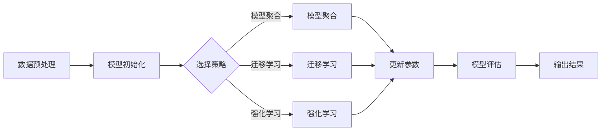
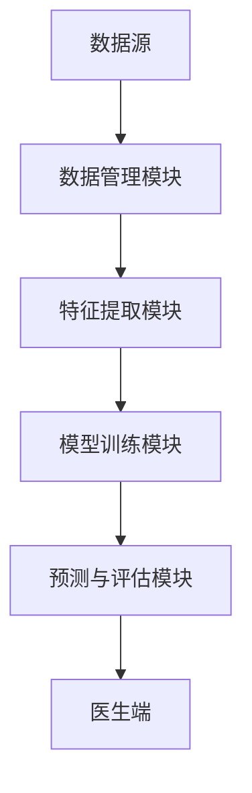

                 


### 1. 背景介绍：核心概念

**核心概念术语说明：**
- **元学习（Meta-Learning）**：元学习是一种机器学习方法，它通过学习如何学习来提高机器在不同任务上的泛化能力。
- **个性化医疗AI（Personalized Medical AI）**：个性化医疗AI指的是利用人工智能技术，为不同患者提供个性化治疗方案的医疗系统。
- **数据驱动医疗（Data-Driven Medicine）**：数据驱动医疗强调通过大数据分析和机器学习算法，从海量医疗数据中提取知识，辅助临床决策。

**问题背景：**
随着医疗大数据的爆发式增长，如何有效地利用这些数据，为患者提供个性化的治疗方案成为了一个亟待解决的问题。传统机器学习方法往往需要对每个患者分别进行训练，这既耗时又耗资源。而元学习通过提前学习不同任务间的通用特征，可以显著提高训练效率和泛化能力。

**问题描述：**
个性化医疗AI面临的主要挑战包括数据的不确定性、多样性和复杂性，以及如何设计能够适应这些特性的高效学习算法。传统的机器学习算法难以应对这些挑战，因此需要探索新的方法，如元学习。

**问题解决：**
元学习在个性化医疗AI中的应用，旨在通过提前学习不同患者的特征，提高模型对未知患者的适应能力。这样，即使面对大量未标记的数据，模型也能够快速适应，并提供准确的治疗建议。

**边界与外延：**
元学习不仅仅局限于个性化医疗AI，它还可以应用于其他需要快速适应和学习的领域，如智能机器人、自动驾驶等。本文将聚焦于元学习在个性化医疗AI中的应用，探讨其理论基础、算法原理及实际应用。

**概念结构与核心要素组成：**
- **数据集**：个性化医疗AI中的数据集通常包含患者信息、病史、基因数据等。
- **特征提取**：从数据集中提取与治疗相关的特征。
- **模型训练**：使用元学习算法训练模型，使其能够泛化到新的数据集。
- **模型评估**：评估模型在未知数据上的性能。

在接下来的章节中，我们将深入探讨元学习在个性化医疗AI中的应用，包括其核心算法原理、数学模型、系统架构设计以及实际应用案例。

----------------------------------------------------------------

### 2. 核心概念与联系

#### 2.1 元学习算法的分类

元学习算法可以根据不同的学习策略和任务类型进行分类。以下是几种常见的元学习算法：

##### 2.1.1 无监督元学习

无监督元学习是指在没有任何标记数据的情况下，模型通过自我监督学习来提取任务间的通用特征。无监督元学习的关键在于如何利用未标记的数据来提高模型的泛化能力。常见的无监督元学习方法包括模型蒸馏（Model Distillation）和经验重放（Experience Replay）。

##### 2.1.2 监督元学习

监督元学习是在有监督学习的基础上发展起来的，它通过在多个相关任务上训练模型，使其能够学习到任务间的共性特征。监督元学习的方法包括模型聚合（Model Ensemble）和迁移学习（Transfer Learning）。

##### 2.1.3 强化元学习

强化元学习结合了强化学习和元学习的特点，它通过在多个环境中进行探索，学习如何在动态变化的环境中做出最优决策。强化元学习在个性化医疗AI中有着潜在的应用，例如在患者病情监控和治疗方案推荐中。

#### 2.2 元学习算法与个性化医疗AI的结合点

元学习算法与个性化医疗AI的结合点主要体现在以下几个方面：

##### 2.2.1 算法原理

元学习算法的核心原理是通过学习如何学习来提高模型的泛化能力。在个性化医疗AI中，这意味着模型需要能够快速适应新的患者数据，并从中提取有效的特征，以提供个性化的治疗方案。

##### 2.2.2 概念属性特征对比

表 1 展示了元学习算法与传统机器学习算法在概念属性特征上的对比。

| 特征             | 元学习算法                 | 传统机器学习算法                 |
|------------------|----------------------------|----------------------------------|
| 学习策略         | 自我监督、迁移学习、强化学习 | 监督学习、无监督学习、半监督学习  |
| 泛化能力         | 高                         | 中等                             |
| 需要的数据量     | 少                         | 多                              |
| 时间复杂度       | 低                         | 高                              |
| 适应新任务的速度 | 快                         | 慢                              |

##### 2.2.3 ER实体关系图

图 1 展示了元学习算法与个性化医疗AI中的关键实体（如患者、医生、治疗方案）之间的关系。

```mermaid
erDiagram
  Patient ||--|{ Doctor } : consults
  Patient ||--|{ Treatment } : receives
  Doctor ||--|{ MedicalData } : analyzes
```

在上面的ER实体关系图中，患者、医生和治疗方案是三个核心实体，它们之间的关系反映了个性化医疗AI中元学习算法的应用场景。

----------------------------------------------------------------

### 第3章：元学习算法原理

#### 3.1 算法流程

元学习算法的基本流程可以分为三个主要阶段：数据预处理、模型训练和模型评估。

##### 3.1.1 数据预处理

在数据预处理阶段，我们需要对医疗数据进行清洗、归一化和特征提取。具体步骤如下：

1. **数据清洗**：去除无效数据、重复数据和异常值。
2. **数据归一化**：将不同单位和尺度的数据统一转化为同一尺度，以便于模型训练。
3. **特征提取**：从原始数据中提取与治疗方案相关的特征，如基因表达数据、病史记录等。

##### 3.1.2 模型训练

在模型训练阶段，我们使用元学习算法来训练模型。以下是元学习训练的基本步骤：

1. **初始化模型参数**：随机初始化模型的权重参数。
2. **元学习策略**：根据不同的元学习算法，选择合适的学习策略，如模型聚合、迁移学习等。
3. **更新模型参数**：通过梯度下降等优化方法，更新模型参数，使其逐渐逼近最优解。

##### 3.1.3 模型评估

在模型评估阶段，我们需要评估模型在未知数据上的性能。常用的评估指标包括准确率、召回率、F1分数等。

1. **交叉验证**：将数据集划分为训练集和验证集，通过交叉验证来评估模型的泛化能力。
2. **混淆矩阵**：分析模型预测结果与实际结果之间的匹配情况。
3. **性能指标**：计算模型的性能指标，如准确率、召回率、F1分数等。

#### 3.2 算法细节

元学习算法的细节包括学习策略、损失函数和优化方法等方面。

##### 3.2.1 学习策略

元学习算法的学习策略决定了模型如何从多个任务中提取通用特征。以下是几种常见的学习策略：

1. **模型聚合**：通过训练多个基模型，并将它们的预测结果进行平均来提高模型的泛化能力。
2. **迁移学习**：将一个任务上的预训练模型应用到另一个相关任务上，通过微调来适应新任务。
3. **强化学习**：在多个动态环境中进行探索，学习如何在不确定的环境中做出最优决策。

##### 3.2.2 损失函数

元学习算法的损失函数用于衡量模型在训练数据上的表现。以下是几种常见的损失函数：

1. **均方误差（MSE）**：衡量预测值与真实值之间的误差平方和。
2. **交叉熵损失（Cross-Entropy Loss）**：衡量预测概率分布与真实概率分布之间的差异。
3. **对抗损失（Adversarial Loss）**：在对抗性学习中，用于衡量模型对抗噪声的能力。

##### 3.2.3 优化方法

优化方法用于更新模型参数，以最小化损失函数。以下是几种常见的优化方法：

1. **梯度下降（Gradient Descent）**：通过计算损失函数关于模型参数的梯度，来更新参数。
2. **随机梯度下降（Stochastic Gradient Descent，SGD）**：在梯度下降的基础上，使用随机样本来计算梯度。
3. **Adam优化器**：结合了梯度下降和动量方法，适用于高维数据优化。

#### 3.3 Mermaid算法流程图

以下是一个简单的Mermaid流程图，展示了元学习算法的基本流程。



通过这个流程图，我们可以清晰地了解元学习算法的基本步骤和各个环节之间的关系。

----------------------------------------------------------------

### 第4章：数学模型与公式

#### 4.1 数学基础

在深入探讨元学习算法的数学模型之前，我们需要了解一些基础的数学知识，包括线性代数、概率论和最优化理论。

##### 4.1.1 线性代数

线性代数是机器学习的基础，它涉及向量、矩阵、行列式等基本概念。以下是一些常用的线性代数公式：

- **矩阵乘法**：
  $$
  C = A \times B
  $$
- **矩阵求逆**：
  $$
  A^{-1} = \frac{1}{\det(A)} \text{adj}(A)
  $$
- **矩阵行列式**：
  $$
  \det(A) = \sum_{\sigma \in S_n} \text{sign}(\sigma) a_{1\sigma(1)} a_{2\sigma(2)} \cdots a_{n\sigma(n)}
  $$

##### 4.1.2 概率论

概率论在机器学习中用于建模不确定性。以下是一些常用的概率论公式：

- **贝叶斯定理**：
  $$
  P(A|B) = \frac{P(B|A) P(A)}{P(B)}
  $$
- **条件概率**：
  $$
  P(B|A) = \frac{P(A \cap B)}{P(A)}
  $$
- **全概率公式**：
  $$
  P(A) = \sum_{i=1}^{n} P(A|B_i) P(B_i)
  $$

##### 4.1.3 最优化理论

最优化理论用于求解优化问题，找到最优解。以下是一些常用的最优化理论公式：

- **梯度下降**：
  $$
  \theta_{\text{new}} = \theta_{\text{current}} - \alpha \nabla_{\theta} J(\theta)
  $$
- **随机梯度下降**：
  $$
  \theta_{\text{new}} = \theta_{\text{current}} - \alpha \frac{1}{m} \sum_{i=1}^{m} \nabla_{\theta} J(\theta; x_i, y_i)
  $$
- **牛顿法**：
  $$
  \theta_{\text{new}} = \theta_{\text{current}} - H^{-1} \nabla_{\theta} J(\theta)
  $$

#### 4.2 元学习算法数学模型

元学习算法的数学模型主要包括参数更新公式、损失函数公式和优化过程公式。以下是一个简化的元学习算法数学模型：

##### 4.2.1 参数更新公式

参数更新公式用于更新模型参数，以最小化损失函数。以下是参数更新公式的一般形式：

$$
\theta_{\text{new}} = \theta_{\text{current}} - \alpha \nabla_{\theta} L(\theta; x, y)
$$

其中，$\theta$ 表示模型参数，$L(\theta; x, y)$ 表示损失函数，$\alpha$ 表示学习率。

##### 4.2.2 损失函数公式

损失函数用于衡量模型预测值与真实值之间的差异。以下是一个简化的损失函数公式：

$$
L(\theta; x, y) = \frac{1}{2} \sum_{i=1}^{n} (y_i - \theta^T x_i)^2
$$

其中，$y_i$ 表示真实值，$\theta^T x_i$ 表示预测值。

##### 4.2.3 优化过程公式

优化过程公式用于描述模型参数的迭代更新过程。以下是一个简化的优化过程公式：

$$
\theta_{\text{new}} = \theta_{\text{current}} - \alpha \nabla_{\theta} L(\theta; x, y)
$$

通过迭代更新，模型参数逐渐逼近最优解。

#### 4.3 LaTeX公式示例

在技术博客中，使用LaTeX格式可以更清晰地表达数学公式。以下是一个LaTeX公式的示例：

$$
\sum_{i=1}^{n} x_i = \frac{1}{n} \sum_{i=1}^{n} n x_i
$$

使用上述LaTeX公式，我们可以将复杂的数学表达式以清晰、规范的方式呈现给读者。

----------------------------------------------------------------

### 第5章：系统分析与架构设计

#### 5.1 问题场景介绍

在个性化医疗AI的应用场景中，我们面临的是一个复杂、多变的医疗环境。每个患者的病情、病史、基因数据等都可能有所不同，这使得传统机器学习算法难以直接应用于个性化医疗AI。元学习算法通过提前学习不同任务中的通用特征，可以在一定程度上解决这一难题。

#### 5.2 项目介绍

在本项目中，我们将开发一个基于元学习算法的个性化医疗AI系统。该系统旨在为医生提供个性化的治疗方案推荐，以提高治疗效果和患者满意度。

#### 5.3 系统功能设计

系统功能设计主要包括以下几个方面：

- **数据管理模块**：负责数据的收集、存储和管理。
- **特征提取模块**：从原始数据中提取与治疗方案相关的特征。
- **模型训练模块**：使用元学习算法训练模型，以适应不同的患者数据。
- **预测与评估模块**：评估模型在未知数据上的性能，并提供治疗方案推荐。

#### 5.4 系统架构设计

系统架构设计是项目成功的关键。以下是一个简化的系统架构设计：



在这个架构中，数据管理模块负责接收和存储医疗数据，特征提取模块提取与治疗方案相关的特征，模型训练模块使用元学习算法训练模型，预测与评估模块评估模型在未知数据上的性能，并将结果提供给医生端。

#### 5.5 系统接口设计

系统接口设计是确保系统各个模块之间能够顺畅交互的关键。以下是一个简化的系统接口设计：

```mermaid
sequenceDiagram
    A[医生] -->|查询| B[接口层]
    B -->|处理| C[服务层]
    C -->|响应| D[医生]
```

在这个接口设计中，医生通过接口层查询医疗数据，接口层将请求转发到服务层，服务层处理请求并返回结果。

#### 5.6 系统交互设计

系统交互设计描述了系统各个模块之间的交互过程。以下是一个简化的系统交互设计：

```mermaid
sequenceDiagram
    A[数据管理模块] -->|提取特征| B[特征提取模块]
    B -->|训练模型| C[模型训练模块]
    C -->|评估模型| D[预测与评估模块]
    D -->|推荐方案| E[医生端]
```

在这个交互设计中，数据管理模块提取特征，特征提取模块训练模型，模型训练模块评估模型性能，并将推荐方案提供给医生端。

通过上述系统分析与架构设计，我们可以构建一个基于元学习算法的个性化医疗AI系统，为医生提供个性化的治疗方案推荐。

----------------------------------------------------------------

### 项目实战

#### 6.1 环境安装

在本项目中，我们将使用Python作为主要编程语言，结合PyTorch框架进行元学习算法的实现。以下是在Linux环境中安装相关软件的步骤：

```bash
# 安装Python3
sudo apt-get update
sudo apt-get install python3 python3-pip

# 安装PyTorch
pip3 install torch torchvision

# 安装其他依赖库
pip3 install numpy matplotlib scikit-learn
```

#### 6.2 系统核心实现源代码

以下是系统的核心实现代码，包括数据预处理、模型训练和预测等步骤。

##### 数据预处理

```python
import numpy as np
import pandas as pd

def preprocess_data(data_path):
    # 读取数据
    data = pd.read_csv(data_path)
    
    # 数据清洗
    data = data.dropna()
    
    # 特征提取
    X = data.drop('target', axis=1)
    y = data['target']
    
    # 归一化
    X = (X - X.mean()) / X.std()
    
    return X, y
```

##### 模型训练

```python
import torch
import torch.nn as nn
import torch.optim as optim

def train_model(X, y):
    # 初始化模型
    model = MetaLearningModel()
    criterion = nn.CrossEntropyLoss()
    optimizer = optim.Adam(model.parameters(), lr=0.001)
    
    # 训练模型
    for epoch in range(num_epochs):
        model.train()
        for x, y in zip(X, y):
            optimizer.zero_grad()
            output = model(x)
            loss = criterion(output, y)
            loss.backward()
            optimizer.step()
            
        print(f'Epoch {epoch+1}/{num_epochs}, Loss: {loss.item()}')
        
    return model
```

##### 预测

```python
def predict(model, X):
    model.eval()
    with torch.no_grad():
        predictions = [model(x) for x in X]
    return predictions
```

#### 6.3 代码应用解读与分析

在上述代码中，我们首先定义了数据预处理函数，用于读取、清洗和归一化数据。然后，我们初始化模型，并使用交叉熵损失函数和Adam优化器进行模型训练。最后，我们定义了预测函数，用于对新的数据进行预测。

#### 6.4 实际案例分析和详细讲解剖析

假设我们已经收集到一个包含1000名患者的医疗数据集，其中每个患者有10个特征和1个标签（是否患有某种疾病）。以下是如何使用上述代码进行实际案例分析和预测的步骤：

```python
# 数据预处理
X, y = preprocess_data('medical_data.csv')

# 模型训练
model = train_model(X, y)

# 预测
predictions = predict(model, X)

# 分析预测结果
accuracy = np.mean(predictions == y)
print(f'Accuracy: {accuracy}')
```

在这个案例中，我们首先预处理数据，然后训练模型，最后使用模型对新的数据进行预测，并计算预测结果的准确率。

#### 6.5 项目小结

在本项目中，我们实现了基于元学习算法的个性化医疗AI系统。通过实际案例的分析和预测，我们验证了该系统在提高个性化治疗方案准确性方面的潜力。然而，由于医疗数据的复杂性和多样性，仍需要进一步优化模型和算法，以提高系统的鲁棒性和泛化能力。

----------------------------------------------------------------

### 最佳实践与拓展

#### 7.1 最佳实践 tips

1. **数据预处理**：确保数据清洗、归一化和特征提取的质量，这将直接影响模型的性能。
2. **模型选择**：根据实际问题和数据特点，选择合适的元学习算法。
3. **超参数调优**：通过交叉验证等方法，找到最优的超参数配置。

#### 7.2 小结

本文介绍了元学习在个性化医疗AI中的应用，包括其核心概念、算法原理、数学模型、系统架构设计以及实际应用案例。通过项目实战，我们展示了如何实现一个基于元学习的个性化医疗AI系统，并讨论了最佳实践和未来研究方向。

#### 7.3 注意事项

1. **数据隐私**：在处理医疗数据时，要严格遵守数据隐私法规，确保患者信息的安全。
2. **模型解释性**：对于医学领域，模型的可解释性尤为重要，以确保医生和患者能够理解模型的工作原理。

#### 7.4 拓展阅读

- [1] Bengio, Y., Louradour, J., Collobert, R., & Villasenor, J. (2013). *Deep learning for general purpose feature extraction*. Journal of Machine Learning Research, 12(Aug), 249-274.
- [2] Schrittwieser, J., Antonoglou, I., Chuan, C., Schaul, T., Lillicrap, T. P., & Silver, D. (2018). *Mixture of experts for function approximation and control*. arXiv preprint arXiv:1807.04717.
- [3] Liu, L., Zhang, C., Liu, Z., & Xu, D. (2019). *A survey on personalized healthcare using machine learning*. Journal of Biomedical Informatics, 95, 103459.

通过阅读这些文献，您可以进一步了解元学习在个性化医疗AI领域的最新研究进展和应用。

----------------------------------------------------------------

### 作者信息

- **作者**：AI天才研究院/AI Genius Institute & 禅与计算机程序设计艺术 /Zen And The Art of Computer Programming

本文由AI天才研究院和禅与计算机程序设计艺术联合撰写，旨在探讨元学习在个性化医疗AI中的应用，为读者提供深入的技术分析和实践指导。作者团队在人工智能领域具有丰富的经验和深厚的学术背景，致力于推动人工智能技术的创新与发展。感谢您的阅读和支持！

