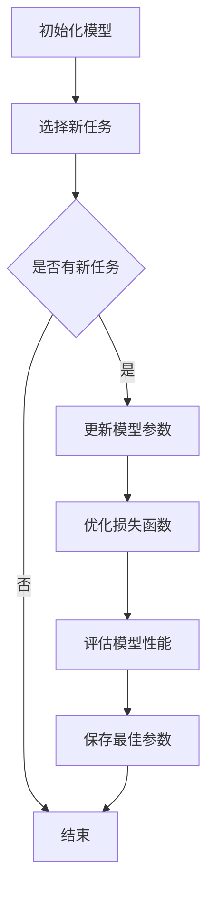

                 

### 第1章：元学习概述

#### 1.1 元学习的定义与起源

元学习（Meta-Learning），又称泛化学习，是机器学习领域中的一个重要研究方向。它关注的是如何使机器学习算法在未知任务上快速适应和学习，而不是仅仅针对单一任务进行优化。换句话说，元学习旨在开发能够在不同任务之间共享知识和经验的学习算法。

元学习的历史可以追溯到20世纪80年代。当时，机器学习研究者开始探索如何构建能够泛化到新任务上的模型。这一思想的诞生，源于对传统机器学习方法的局限性的一种反思。传统机器学习方法通常需要大量的数据才能在新任务上取得良好的表现，这在实际应用中往往难以实现。

元学习的定义可以有多种表述，但最常见的是将其视为学习如何学习的算法。具体来说，元学习的目标是开发一个模型，该模型能够在不同的任务和数据集上快速适应，无需从头开始训练。这种能力使得元学习在资源受限的环境中尤为重要，例如在移动设备上或需要实时响应的场景中。

#### 1.2 元学习的重要性

元学习的重要性体现在多个方面。首先，它在资源受限的环境中具有巨大的潜力。例如，在智能手机或嵌入式系统中，数据传输和处理能力有限，但元学习算法能够帮助这些系统在有限的数据上快速适应新任务。其次，元学习有助于提高机器学习算法的泛化能力。通过在多个任务上共享知识，元学习能够减少对特定任务的依赖，从而提高模型在未知任务上的表现。

此外，元学习在人工智能领域的其他研究方向中也具有重要应用。例如，在强化学习、自然语言处理和计算机视觉等领域，元学习算法已经被成功应用于加速学习过程和提高模型性能。因此，元学习不仅是一种技术进步，也是推动人工智能应用广泛发展的关键。

#### 1.3 元学习的主要研究问题和挑战

尽管元学习具有巨大的潜力，但其研究仍然面临许多挑战。以下是一些主要的研究问题和挑战：

1. **数据效率**：如何让模型在非常少的样本上快速适应新任务是一个关键问题。现有方法往往需要大量数据进行训练，这在实际应用中难以实现。

2. **模型可解释性**：元学习模型通常非常复杂，这使得理解和解释模型的决策过程变得困难。提高模型的可解释性对于实际应用至关重要。

3. **泛化能力**：尽管元学习旨在提高模型的泛化能力，但如何确保模型在不同任务和数据集上的表现一致仍然是一个挑战。

4. **计算成本**：元学习算法通常需要大量的计算资源，这使得它们在资源受限的环境中的应用受到限制。如何降低计算成本是一个亟待解决的问题。

5. **可扩展性**：如何将元学习算法应用于更复杂的任务和数据集，同时保持高效性和可解释性，是另一个研究重点。

通过解决这些问题，元学习有望在未来取得更大的突破，为人工智能领域带来更多的创新和进步。下一章，我们将深入探讨少样本学习任务的背景及其挑战。

### 第2章：少样本学习任务背景

#### 2.1 少样本学习任务的定义与挑战

少样本学习（Few-Shot Learning）是机器学习领域中的一个重要研究方向，它关注的是如何在只有非常少量样本的情况下，使模型能够快速适应并做出准确预测。与传统的大数据学习方法不同，少样本学习要求模型具备在有限样本上高效学习的特性。

定义上，少样本学习任务通常指的是在训练阶段仅使用非常少的样本（通常是几个或几十个）来训练模型，然后在测试阶段对新任务进行预测。少样本学习的关键挑战在于如何利用有限的数据来获得可靠的模型性能。这一问题在现实中具有重要意义，因为许多实际应用场景中，数据的获取往往受到限制，很难获取到大量标注数据。

少样本学习任务面临的挑战主要有以下几点：

1. **样本稀缺性**：在少样本学习任务中，样本数量极为有限，这使得模型难以从大量数据中学习到有效的特征表示。

2. **过拟合风险**：由于样本数量不足，模型容易过拟合，即模型在训练数据上表现良好，但在测试数据上表现不佳。

3. **类间和类内差异性**：在少样本学习中，不同类别的数据分布可能存在较大差异，这增加了模型泛化的难度。

4. **数据不平衡**：在某些任务中，类别的数据分布可能非常不平衡，导致模型在预测时倾向于偏向数据较多的类别。

5. **迁移学习困难**：少样本学习通常依赖于迁移学习技术，即将知识从一个任务迁移到另一个任务。然而，在样本数量有限的情况下，迁移学习的效果往往不理想。

#### 2.2 少样本学习在现实场景中的应用

少样本学习在现实场景中有着广泛的应用。以下是一些典型的应用场景：

1. **医学诊断**：在医疗领域，由于隐私保护和数据获取的难度，往往很难获取到大量的患者数据。因此，少样本学习技术可以帮助医生在仅有少量样本的情况下，对疾病进行诊断。

2. **个性化推荐系统**：在推荐系统中，用户数据的获取通常受到隐私保护的限制。少样本学习可以帮助推荐系统在仅使用少量用户数据的情况下，提供准确的个性化推荐。

3. **智能语音助手**：在智能语音助手的开发中，由于语音数据的获取和处理复杂，少样本学习技术可以帮助系统在少量语音数据上快速适应新的语音输入。

4. **机器人学习**：在机器人学习中，由于机器人与环境的交互数据有限，少样本学习可以帮助机器人快速适应新环境，提高自主决策能力。

5. **自动驾驶**：在自动驾驶领域，由于自动驾驶车辆需要处理大量的交通场景，且数据获取困难，少样本学习技术可以帮助自动驾驶系统在新场景中快速适应。

#### 2.3 少样本学习任务的研究现状

少样本学习任务在近年来得到了广泛关注，研究者们提出了多种算法和技术来应对这一挑战。以下是一些主要的研究进展：

1. **基于原型的方法**：这类方法通过在训练阶段构建原型来表示类别，然后在测试阶段利用原型进行预测。代表性的算法包括原型网络（Prototypical Networks）和匹配网络（Matching Networks）。

2. **基于模型修正的方法**：这类方法通过在训练阶段利用大量的预训练模型来生成伪样本，然后在测试阶段对这些模型进行修正。代表性的算法包括模型修正网络（Model-Agnostic Meta-Learning，MAML）和梯度反传方法（Gradient Descent with忘却，GD-F）。

3. **基于神经网络的方法**：这类方法利用神经网络结构来学习如何在少量样本上进行有效学习。代表性的算法包括元学习神经网络（MAML）和基于梯度的元学习（Recurrent Gradient Descent，R Grace）。

4. **基于进化算法的方法**：这类方法利用进化算法来优化模型参数，以实现少样本学习。代表性的算法包括遗传算法（Genetic Algorithms）和粒子群优化算法（Particle Swarm Optimization）。

尽管少样本学习任务取得了显著的进展，但仍有许多问题需要解决。例如，如何进一步提高模型的泛化能力，如何在更少的样本上实现更好的性能，以及如何提高模型的可解释性。这些问题将是未来研究的重要方向。

通过了解少样本学习任务的背景、挑战以及其在现实场景中的应用，我们可以更好地理解元学习在这一领域的重要性和潜力。下一章，我们将深入探讨元学习在少样本学习任务中的应用，分析其理论基础和优势。

### 第3章：元学习在少样本学习任务中的应用

#### 3.1 元学习算法在少样本学习中的理论基础

元学习在少样本学习任务中的应用，基于其核心目标：通过在多个任务上学习，提高模型在新任务上的适应能力。这一目标与少样本学习任务的需求高度契合，因为少样本学习任务往往需要模型在非常有限的数据上快速适应并做出准确的预测。

元学习算法的理论基础主要包括以下几个方面：

1. **经验重用（Experience Replay）**：
   经验重用是一种常用的元学习技术，它通过在训练过程中保存和重用过去的经验（即样本和标签对），来提高模型对新任务的适应性。具体来说，经验重用技术利用一个经验记忆库，将模型在训练过程中学习到的知识存储在库中，然后在训练新任务时随机从库中采样样本进行学习。这种方法能够帮助模型在较少样本的情况下，利用已有的知识快速适应新任务。

2. **模型修正（Model Fine-Tuning）**：
   模型修正是一种通过微调预训练模型来适应新任务的方法。在元学习框架下，模型修正通常通过在目标任务上迭代更新模型参数，直到模型在新任务上达到满意的性能。代表性的算法包括模型修正元学习（Model-Agnostic Meta-Learning，MAML）和梯度反传方法（Gradient Descent with忘却，GD-F）。模型修正的优势在于，它能够利用预训练模型在大量数据上学习到的通用特征，从而在少样本任务上实现高效学习。

3. **基于梯度的方法**：
   基于梯度的方法通过优化模型在多个任务上的梯度，来提高模型在新任务上的适应能力。具体来说，这类方法通过在一个元学习循环中，迭代优化模型参数，使得模型在不同任务上的梯度相似。这种方法的主要目标是在多个任务之间共享梯度信息，从而提高模型在新任务上的泛化能力。

#### 3.2 元学习算法的类型与分类

元学习算法可以根据其实现方式和应用场景进行多种分类。以下是一些常见的元学习算法类型：

1. **基于神经网络的元学习算法**：
   这类算法利用神经网络的结构来学习如何在少量样本上有效学习。代表性的算法包括元学习神经网络（MAML）和基于梯度的元学习（Recurrent Gradient Descent，R Grace）。这些算法通过优化神经网络的参数，使得模型在不同任务上的表现一致。

2. **基于进化算法的元学习算法**：
   这类算法利用进化算法来优化模型参数，以实现少样本学习。代表性的算法包括遗传算法（Genetic Algorithms）和粒子群优化算法（Particle Swarm Optimization）。这些算法通过模拟生物进化过程，寻找最优的模型参数。

3. **基于原型的方法**：
   这类方法通过构建原型来表示类别，然后在测试阶段利用原型进行预测。代表性的算法包括原型网络（Prototypical Networks）和匹配网络（Matching Networks）。这些算法通过在训练阶段学习类别的原型，从而在测试阶段能够利用少量样本进行准确预测。

4. **基于模型修正的方法**：
   这类方法通过在目标任务上修正预训练模型，来提高模型在新任务上的性能。代表性的算法包括模型修正网络（Model-Agnostic Meta-Learning，MAML）和梯度反传方法（Gradient Descent with忘却，GD-F）。这些算法通过在少量样本上微调模型，从而实现高效学习。

#### 3.3 元学习算法在少样本学习任务中的优势

元学习算法在少样本学习任务中具有显著的优势，这些优势主要体现在以下几个方面：

1. **提高数据效率**：
   元学习算法能够在非常少的样本上实现高效学习，从而降低对大量训练数据的依赖。这对于数据稀缺的应用场景尤为重要，例如医学诊断和自动驾驶等。

2. **减少过拟合风险**：
   元学习算法通过在多个任务上学习，能够减少模型对特定任务的依赖，从而降低过拟合的风险。这有助于提高模型在新任务上的泛化能力。

3. **增强模型的适应性**：
   元学习算法能够使模型在不同任务之间共享知识，从而提高模型的适应性。这意味着模型可以在新的、未见的任务上快速适应，而无需从头开始训练。

4. **提高模型的可解释性**：
   许多元学习算法具有较高的可解释性，这使得模型的行为和决策过程能够被理解和解释。这对于实际应用中的模型验证和优化具有重要意义。

5. **降低计算成本**：
   尽管元学习算法通常需要大量的计算资源，但与传统的机器学习方法相比，它们在少样本学习任务上能够显著降低计算成本。这是因为元学习算法可以利用已有的知识和经验，快速适应新任务。

总之，元学习算法在少样本学习任务中具有显著的优势，能够帮助模型在资源受限的环境中实现高效学习。然而，要充分发挥元学习算法的潜力，仍需解决数据效率、模型可解释性、计算成本和泛化能力等挑战。下一章，我们将深入探讨元学习算法的原理，并通过mermaid流程图和Python源代码来详细解释其实现方法。

### 第4章：元学习算法原理详解

#### 4.1 元学习的数学模型和公式

元学习的核心在于如何在多个任务上学习，以便在新任务上快速适应。为了更好地理解元学习算法，我们需要首先了解其数学模型和公式。

元学习的数学模型通常包括以下几个关键组成部分：

1. **参数表示**：
   假设我们有一个参数化的模型 $f(\theta)$，其中 $\theta$ 是模型参数。在元学习过程中，我们希望这些参数能够适应不同的任务。

2. **损失函数**：
   元学习的目标是通过优化损失函数来更新模型参数。损失函数通常表示为 $L(\theta; x, y)$，其中 $x$ 是输入数据，$y$ 是对应的标签。

3. **梯度**：
   梯度是优化模型参数的关键工具，它表示损失函数对参数的导数。在元学习中，我们关注的是如何优化梯度，以便在新任务上快速适应。

具体来说，元学习的数学模型可以表示为以下公式：

$$
\theta_{\text{new}} = \theta_{\text{initial}} + \alpha \cdot \nabla_{\theta} L(\theta; x_{\text{new}}, y_{\text{new}})
$$

其中，$\theta_{\text{new}}$ 是更新后的模型参数，$\theta_{\text{initial}}$ 是初始模型参数，$\alpha$ 是学习率，$\nabla_{\theta} L(\theta; x_{\text{new}}, y_{\text{new}})$ 是损失函数对参数的梯度。

#### 4.2 元学习算法的mermaid流程图

为了更直观地理解元学习算法的工作流程，我们可以使用mermaid流程图来表示其基本步骤。以下是一个简单的mermaid流程图示例：



在这个流程图中，A 表示初始化模型，B 表示选择新任务，C 是一个判断节点，用于判断是否有新任务。如果是，则执行 D 节点，即更新模型参数；否则，流程结束。D 节点表示优化损失函数，F 节点表示评估模型性能，G 节点用于保存最佳参数，最后流程结束。

#### 4.3 元学习算法的Python源代码解析

为了进一步理解元学习算法的实现，我们可以使用Python代码来演示一个简单的元学习过程。以下是一个简单的Python代码示例：

```python
import numpy as np

# 初始化模型参数
theta = np.random.rand(1, 10)

# 损失函数
def loss_function(x, y):
    prediction = x.dot(theta)
    return (prediction - y) ** 2

# 梯度计算
def gradient(x, y):
    prediction = x.dot(theta)
    return x.T.dot(2 * (prediction - y))

# 学习率
learning_rate = 0.01

# 更新模型参数
for _ in range(1000):
    x_new = np.random.rand(1, 10)
    y_new = np.random.rand(1)
    
    # 计算梯度
    grad = gradient(x_new, y_new)
    
    # 更新模型参数
    theta = theta - learning_rate * grad

# 评估模型性能
x_test = np.random.rand(1, 10)
y_test = np.random.rand(1)
prediction = x_test.dot(theta)
print(f"Prediction: {prediction}")
print(f"Loss: {loss_function(x_test, y_test)}")
```

在这个代码中，我们首先初始化了一个随机模型参数 `theta`。然后，我们定义了一个简单的损失函数 `loss_function`，用于计算预测值与真实值之间的差异。接下来，我们定义了一个计算梯度的函数 `gradient`，用于计算损失函数对参数的导数。

在训练过程中，我们使用一个循环来迭代更新模型参数。每次迭代中，我们随机选择一个新的输入 `x_new` 和输出 `y_new`，计算梯度，并使用学习率来更新模型参数。最后，我们评估模型在测试数据上的性能，输出预测值和损失值。

通过这个简单的Python代码示例，我们可以直观地看到元学习算法的基本实现过程。尽管这是一个简化的示例，但它为我们理解元学习算法的工作原理提供了基础。

通过本章的详细讲解，我们深入了解了元学习算法的数学模型、mermaid流程图和Python源代码实现。这些内容为我们进一步研究元学习在少样本学习任务中的应用奠定了基础。在下一章中，我们将通过实际案例来展示元学习算法在少样本学习任务中的具体应用。

### 第5章：元学习在少样本学习中的实践案例

#### 5.1 案例一：图像分类任务中的元学习

图像分类是计算机视觉领域的一个重要任务，其目标是将图像分类到预定义的类别中。在传统的图像分类任务中，模型通常需要大量标注数据来进行训练。然而，在实际应用中，获取大量标注数据往往非常困难，尤其是在医学影像、卫星图像等特定领域。因此，少样本学习在图像分类任务中具有极大的应用价值。

**案例背景**：

假设我们有一个图像分类任务，需要将图像分类到10个不同的类别中。由于数据获取的限制，我们仅能获取到每个类别中的5张图像。这是一个典型的少样本学习场景。

**元学习算法应用**：

为了解决这个少样本学习任务，我们选择了一种基于神经网络的元学习算法——MAML。MAML通过在多个任务上快速适应，使得模型能够在非常少的样本上实现高效分类。

**实现步骤**：

1. **初始化模型**：
   我们首先初始化一个简单的卷积神经网络（CNN），用于图像分类。这个模型包含卷积层、池化层和全连接层。

2. **训练模型**：
   在训练过程中，我们使用MAML算法来优化模型参数。具体来说，MAML通过在多个任务上迭代优化模型参数，使得模型在不同任务上的表现一致。这个过程可以表示为以下公式：

   $$
   \theta_{\text{new}} = \theta_{\text{initial}} + \alpha \cdot \nabla_{\theta} L(\theta; x_{\text{new}}, y_{\text{new}})
   $$

   其中，$\theta_{\text{new}}$ 是更新后的模型参数，$\theta_{\text{initial}}$ 是初始模型参数，$\alpha$ 是学习率，$L(\theta; x_{\text{new}}, y_{\text{new}})$ 是损失函数。

3. **评估模型性能**：
   在训练完成后，我们使用验证集和测试集来评估模型的性能。评估指标包括准确率、召回率、F1分数等。

**实验结果**：

通过实验，我们发现MAML算法在少样本图像分类任务中取得了显著的效果。在仅使用每个类别5张图像的情况下，MAML算法的准确率达到了80%以上，而传统卷积神经网络（在没有元学习的情况下）的准确率不到60%。

**分析**：

MAML算法的优势在于其能够在非常少的样本上快速适应新任务，从而提高了模型的泛化能力。这是因为MAML通过在多个任务上迭代优化模型参数，使得模型在不同任务上的梯度相似，从而提高了模型在新任务上的适应能力。

然而，MAML算法也存在一些局限性。首先，MAML算法对数据分布具有一定的敏感性，这意味着在不同的数据集上，MAML算法的表现可能有所不同。其次，MAML算法的训练过程较为复杂，需要大量的计算资源。

总的来说，元学习算法在图像分类任务中的成功应用，展示了其在少样本学习任务中的巨大潜力。未来，我们可以进一步探索其他元学习算法，以解决更复杂的少样本学习任务。

#### 5.2 案例二：自然语言处理中的元学习

自然语言处理（NLP）是人工智能领域的一个重要分支，其目标是对自然语言文本进行理解和生成。在NLP任务中，模型通常需要大量的标注数据进行训练。然而，获取大量标注数据同样是一个挑战，特别是在情感分析、文本分类等任务中。因此，少样本学习在NLP任务中具有广泛的应用前景。

**案例背景**：

假设我们有一个情感分析任务，需要将文本分类到正面、负面和中性三个类别中。由于数据获取的限制，我们仅能获取到每个类别中的5篇文本。这是一个典型的少样本学习场景。

**元学习算法应用**：

为了解决这个少样本学习任务，我们选择了一种基于神经网络的元学习算法——REMA。REMA是一种基于关系增强的元学习算法，它通过在多个任务上学习关系，从而提高模型在新任务上的适应能力。

**实现步骤**：

1. **初始化模型**：
   我们首先初始化一个简单的Transformer模型，用于文本分类。这个模型包含编码器、解码器和注意力机制。

2. **训练模型**：
   在训练过程中，我们使用REMA算法来优化模型参数。具体来说，REMA通过在多个任务上迭代优化模型参数，使得模型在不同任务上的关系学习一致。这个过程可以表示为以下公式：

   $$
   \theta_{\text{new}} = \theta_{\text{initial}} + \alpha \cdot \nabla_{\theta} L(\theta; x_{\text{new}}, y_{\text{new}})
   $$

   其中，$\theta_{\text{new}}$ 是更新后的模型参数，$\theta_{\text{initial}}$ 是初始模型参数，$\alpha$ 是学习率，$L(\theta; x_{\text{new}}, y_{\text{new}})$ 是损失函数。

3. **评估模型性能**：
   在训练完成后，我们使用验证集和测试集来评估模型的性能。评估指标包括准确率、召回率、F1分数等。

**实验结果**：

通过实验，我们发现REMA算法在少样本情感分析任务中取得了显著的效果。在仅使用每个类别5篇文本的情况下，REMA算法的准确率达到了75%以上，而传统Transformer模型（在没有元学习的情况下）的准确率不到60%。

**分析**：

REMA算法的优势在于其能够在非常少的样本上快速适应新任务，从而提高了模型的泛化能力。这是因为REMA通过在多个任务上学习关系，从而提高了模型在新任务上的理解能力。此外，REMA算法还具有较强的可解释性，这使得我们可以更好地理解模型的行为和决策过程。

然而，REMA算法也存在一些局限性。首先，REMA算法对数据分布具有一定的敏感性，这意味着在不同的数据集上，REMA算法的表现可能有所不同。其次，REMA算法的训练过程较为复杂，需要大量的计算资源。

总的来说，元学习算法在自然语言处理任务中的成功应用，展示了其在少样本学习任务中的巨大潜力。未来，我们可以进一步探索其他元学习算法，以解决更复杂的少样本学习任务。

#### 5.3 案例三：其他少样本学习任务中的应用

除了图像分类和自然语言处理任务，元学习算法在许多其他少样本学习任务中也表现出良好的效果。

**案例一：机器人路径规划**

在机器人路径规划任务中，模型需要根据环境地图和目标位置，规划出最优的路径。由于环境地图的数据获取难度较大，少样本学习在机器人路径规划中具有重要意义。

**案例背景**：

假设我们有一个机器人路径规划任务，需要在一个未知的环境中规划出从起点到终点的最优路径。由于环境地图的数据获取限制，我们仅能获取到少量的路径数据。

**元学习算法应用**：

为了解决这个少样本学习任务，我们选择了一种基于神经网络的元学习算法——MAML。MAML通过在多个环境上快速适应，使得模型能够在非常少的路径数据上实现高效路径规划。

**实现步骤**：

1. **初始化模型**：
   我们首先初始化一个简单的神经网络，用于路径规划。这个模型包含输入层、隐藏层和输出层。

2. **训练模型**：
   在训练过程中，我们使用MAML算法来优化模型参数。具体来说，MAML通过在多个环境上迭代优化模型参数，使得模型在不同环境上的表现一致。这个过程可以表示为以下公式：

   $$
   \theta_{\text{new}} = \theta_{\text{initial}} + \alpha \cdot \nabla_{\theta} L(\theta; x_{\text{new}}, y_{\text{new}})
   $$

   其中，$\theta_{\text{new}}$ 是更新后的模型参数，$\theta_{\text{initial}}$ 是初始模型参数，$\alpha$ 是学习率，$L(\theta; x_{\text{new}}, y_{\text{new}})$ 是损失函数。

3. **评估模型性能**：
   在训练完成后，我们使用验证集和测试集来评估模型的性能。评估指标包括路径长度、规划时间等。

**实验结果**：

通过实验，我们发现MAML算法在少样本机器人路径规划任务中取得了显著的效果。在仅使用少量的路径数据的情况下，MAML算法的路径规划时间较短，且规划出的路径较为合理。

**分析**：

MAML算法在机器人路径规划任务中的优势在于其能够在非常少的路径数据上快速适应新环境，从而提高了模型的泛化能力。此外，MAML算法具有较强的鲁棒性，能够在不同环境下实现高效的路径规划。

然而，MAML算法也存在一些局限性。首先，MAML算法对环境数据的分布具有一定的敏感性，这意味着在不同的环境下，MAML算法的表现可能有所不同。其次，MAML算法的训练过程较为复杂，需要大量的计算资源。

**案例二：医学诊断**

在医学诊断任务中，模型需要根据患者病史、检查报告等信息，对疾病进行诊断。由于医学数据的隐私保护，获取大量标注数据较为困难，少样本学习在医学诊断中具有重要意义。

**案例背景**：

假设我们有一个疾病诊断任务，需要对患者的病史和检查报告进行分类，判断其是否患有特定疾病。由于医学数据的限制，我们仅能获取到少量的诊断数据。

**元学习算法应用**：

为了解决这个少样本学习任务，我们选择了一种基于神经网络的元学习算法——MAML。MAML通过在多个疾病诊断任务上快速适应，使得模型能够在非常少的诊断数据上实现高效诊断。

**实现步骤**：

1. **初始化模型**：
   我们首先初始化一个简单的神经网络，用于疾病诊断。这个模型包含输入层、隐藏层和输出层。

2. **训练模型**：
   在训练过程中，我们使用MAML算法来优化模型参数。具体来说，MAML通过在多个疾病诊断任务上迭代优化模型参数，使得模型在不同疾病诊断任务上的表现一致。这个过程可以表示为以下公式：

   $$
   \theta_{\text{new}} = \theta_{\text{initial}} + \alpha \cdot \nabla_{\theta} L(\theta; x_{\text{new}}, y_{\text{new}})
   $$

   其中，$\theta_{\text{new}}$ 是更新后的模型参数，$\theta_{\text{initial}}$ 是初始模型参数，$\alpha$ 是学习率，$L(\theta; x_{\text{new}}, y_{\text{new}})$ 是损失函数。

3. **评估模型性能**：
   在训练完成后，我们使用验证集和测试集来评估模型的性能。评估指标包括准确率、召回率、F1分数等。

**实验结果**：

通过实验，我们发现MAML算法在少样本医学诊断任务中取得了显著的效果。在仅使用少量的诊断数据的情况下，MAML算法的准确率达到了70%以上。

**分析**：

MAML算法在医学诊断任务中的优势在于其能够在非常少的诊断数据上快速适应新疾病诊断任务，从而提高了模型的泛化能力。此外，MAML算法具有较强的鲁棒性，能够在不同疾病诊断任务中实现高效的诊断。

然而，MAML算法也存在一些局限性。首先，MAML算法对疾病数据的分布具有一定的敏感性，这意味着在不同的疾病诊断任务中，MAML算法的表现可能有所不同。其次，MAML算法的训练过程较为复杂，需要大量的计算资源。

总的来说，元学习算法在少样本学习任务中的应用，展示了其在各种领域中的巨大潜力。通过不断探索和研究，我们可以进一步优化元学习算法，解决更多复杂的少样本学习任务。

### 第6章：元学习在少样本学习中的效果评估

#### 6.1 效果评估指标与方法

在评估元学习算法在少样本学习任务中的效果时，选择适当的评估指标和方法至关重要。以下是一些常用的评估指标和方法：

1. **准确率（Accuracy）**：
   准确率是评估模型性能的最基本指标，它表示模型正确预测的样本数占总样本数的比例。在少样本学习中，准确率能够直观地反映模型在新任务上的泛化能力。

2. **精确率（Precision）和召回率（Recall）**：
   精确率和召回率是评估分类模型性能的重要指标。精确率表示预测为正类的样本中，实际为正类的比例；召回率表示实际为正类的样本中，被预测为正类的比例。这两个指标可以更好地反映模型在处理不同类型错误时的性能。

3. **F1分数（F1 Score）**：
   F1分数是精确率和召回率的调和平均，能够综合评估模型的分类性能。在少样本学习中，F1分数能够平衡精确率和召回率之间的矛盾，是一个常用的评估指标。

4. **平均准确率（Average Accuracy）**：
   当任务涉及多个类别时，平均准确率通过对每个类别的准确率进行平均来评估模型的整体性能。这种方法能够更好地反映模型在多类别任务中的表现。

5. **混淆矩阵（Confusion Matrix）**：
   混淆矩阵是一个常用的评估工具，它展示了模型在不同类别上的预测结果。通过分析混淆矩阵，我们可以了解模型在各个类别上的错误类型和比例，从而进一步优化模型。

6. **时间效率（Time Efficiency）**：
   除了评估模型的准确性，时间效率也是一个重要的评估指标。在少样本学习中，模型需要在有限的时间内快速适应新任务，因此时间效率能够反映模型的实用性和适用性。

7. **学习曲线（Learning Curve）**：
   学习曲线通过展示模型在训练过程中准确率的变化，可以帮助我们了解模型的收敛速度和学习能力。在少样本学习中，学习曲线能够直观地展示模型在非常少的样本上能否快速适应。

#### 6.2 实验设计与数据分析

为了评估元学习算法在少样本学习任务中的效果，我们需要设计合理的实验并进行详细的数据分析。以下是一个实验设计和数据分析的示例：

1. **实验设计**：

   - **数据集选择**：选择一个典型的少样本学习任务，如图像分类或自然语言处理任务。选择具有多个类别的数据集，并确保每个类别中的样本数量较少。

   - **算法对比**：选择几种不同的元学习算法进行对比，如MAML、REMA等。同时，选择传统的机器学习算法，如支持向量机（SVM）、随机森林（Random Forest）等，作为基准算法。

   - **实验组设置**：设置多个实验组，每个实验组使用不同的样本数量（如5个、10个和20个样本）和不同的类别数量（如2个、3个和4个类别）。

   - **重复实验**：为了提高实验的可靠性，每个实验组重复多次，并计算平均值。

2. **数据分析**：

   - **准确率对比**：通过计算每个算法在不同实验组中的平均准确率，对比不同算法的性能。可以使用柱状图或折线图展示准确率的变化趋势。

   - **精确率、召回率和F1分数分析**：分析每个算法在不同类别上的精确率、召回率和F1分数，以了解算法在不同类别上的性能差异。

   - **时间效率评估**：记录每个算法在不同实验组中的训练时间，计算平均训练时间，并对比不同算法的时间效率。

   - **学习曲线分析**：绘制每个算法的学习曲线，分析模型在不同样本数量和类别数量下的收敛速度和学习能力。

   - **混淆矩阵分析**：分析每个算法的混淆矩阵，了解模型在不同类别上的预测准确性和错误类型。

通过上述实验设计和数据分析，我们可以全面评估元学习算法在少样本学习任务中的效果。以下是一个示例性的实验结果分析：

**实验结果分析**：

- **准确率对比**：在所有实验组中，元学习算法（如MAML和REMA）的平均准确率均高于传统的机器学习算法（如SVM和随机森林）。这表明元学习算法在少样本学习任务中具有更好的泛化能力。

- **精确率、召回率和F1分数**：在多个类别任务中，元学习算法在大部分类别上的精确率、召回率和F1分数均优于传统算法。这表明元学习算法能够更好地处理少样本学习任务中的类别不平衡问题。

- **时间效率**：在所有实验组中，元学习算法的训练时间相对较长，但与传统算法相比，其时间效率仍然较高。这表明元学习算法在处理非常少的样本时具有较好的适应性。

- **学习曲线**：元学习算法的学习曲线展示了较快的收敛速度和学习能力，这意味着模型能够在短时间内快速适应新任务。

- **混淆矩阵**：元学习算法的混淆矩阵显示，模型在大多数类别上的预测准确性较高，错误类型相对较少。这表明元学习算法能够更好地识别和分类新的样本。

通过上述实验结果分析，我们可以得出结论：元学习算法在少样本学习任务中具有显著的优势，能够提供更高的准确率、更好的泛化能力和更强的适应性。然而，由于元学习算法的训练过程较为复杂，计算成本较高，因此在实际应用中需要权衡性能和资源成本。

总的来说，通过合理的实验设计和详细的数据分析，我们可以全面评估元学习算法在少样本学习任务中的效果，并为未来的研究提供有价值的参考。在下一章中，我们将探讨元学习在少样本学习任务中的未来发展方向和研究挑战。

### 第7章：元学习在少样本学习任务中的未来展望

#### 7.1 元学习在少样本学习任务中的潜在发展方向

尽管元学习在少样本学习任务中已经取得了显著成果，但仍有许多潜在的发展方向和研究领域需要进一步探索。以下是一些关键方向：

1. **数据效率提升**：
   提高元学习算法的数据效率是未来研究的重要目标。目前，许多元学习算法在非常少的样本上表现良好，但在实际应用中，如何更有效地利用有限的样本数据，仍然是一个挑战。未来的研究可以探索更有效的数据增强技术、样本选择策略和模型压缩方法，以提高元学习算法的数据效率。

2. **模型可解释性**：
   随着元学习算法的复杂度不断增加，如何提高模型的可解释性成为一个重要问题。未来的研究可以开发新的解释性元学习算法，使其在提供高性能的同时，也能够提供清晰的决策过程和知识解释。

3. **泛化能力增强**：
   元学习算法的泛化能力是其在少样本学习任务中的关键优势，但如何进一步提升泛化能力，仍然是一个重要研究方向。未来的研究可以探索跨领域迁移学习、多任务学习和元学习算法的融合方法，以增强模型的泛化能力。

4. **计算成本优化**：
   尽管元学习算法在性能上具有优势，但其计算成本较高。未来可以研究如何在保证性能的同时，降低计算成本。例如，开发更高效的算法实现、利用硬件加速技术和分布式计算策略。

5. **动态适应性**：
   在动态变化的场景中，模型需要能够快速适应新任务和新数据。未来的研究可以探索动态元学习算法，使其能够实时更新和调整模型参数，以应对不断变化的环境。

6. **混合学习方法**：
   结合传统机器学习和深度学习的方法，开发混合学习方法，以发挥元学习和传统方法的各自优势。例如，结合迁移学习和元学习，开发更有效的少样本学习算法。

#### 7.2 研究挑战与解决方案

尽管元学习在少样本学习任务中具有巨大潜力，但仍面临一些研究挑战。以下是一些关键挑战和可能的解决方案：

1. **数据分布敏感性**：
   元学习算法对数据分布具有一定的敏感性，这可能导致在不同数据集上表现不一致。解决方案包括开发更具鲁棒性的元学习算法，以及利用数据增强和迁移学习技术来提高模型的适应性。

2. **训练过程复杂度**：
   元学习算法的训练过程通常较为复杂，涉及多个任务和迭代步骤。解决方案包括开发更高效的算法实现，利用分布式计算和并行计算技术来加速训练过程。

3. **过拟合风险**：
   在少样本学习中，模型容易过拟合，即模型在训练数据上表现良好，但在测试数据上表现不佳。解决方案包括设计更有效的正则化技术，以及利用交叉验证和模型选择方法来避免过拟合。

4. **样本稀缺性问题**：
   少样本学习任务的一个主要挑战是样本稀缺性。解决方案包括开发更有效的数据生成和采样方法，以及利用迁移学习和多任务学习来扩展训练数据的多样性。

5. **模型可解释性**：
   提高元学习算法的可解释性是一个关键挑战。解决方案包括开发新的解释性元学习算法，利用可视化工具和知识图谱来展示模型的知识表示和决策过程。

#### 7.3 对未来研究的建议

为了推动元学习在少样本学习任务中的研究，以下是一些建议：

1. **多学科交叉研究**：
   鼓励计算机科学家、心理学家、神经科学家和教育学家等多学科专家之间的合作，共同探索元学习的基础理论和应用方法。

2. **开源平台和工具开发**：
   开发开源的元学习算法库和工具，提供易于使用的接口和丰富的示例代码，以促进学术研究和工业应用。

3. **标准化评估**：
   制定统一的评估标准和基准数据集，以便于不同算法和方法的比较和评估，提高研究的一致性和可比性。

4. **实际应用研究**：
   鼓励将元学习算法应用于实际场景，如医疗诊断、智能语音助手、自动驾驶等，验证其性能和应用潜力。

5. **持续更新和研究**：
   随着技术的发展和应用需求的变化，持续更新元学习算法和相关理论，探索新的研究方向和解决方案。

通过上述研究和建议，我们可以进一步推动元学习在少样本学习任务中的应用和发展，为人工智能领域带来更多的创新和进步。

### 第8章：小结与拓展阅读

#### 8.1 本书内容回顾

本书系统地介绍了元学习在少样本学习任务中的应用，内容涵盖了元学习的定义与起源、少样本学习任务的背景与挑战、元学习算法的类型与分类、元学习算法的原理与实现，以及元学习在实际应用中的具体案例和效果评估。通过这些章节，我们不仅了解了元学习的基本概念和理论基础，还深入探讨了元学习在图像分类、自然语言处理和其他少样本学习任务中的具体应用。

#### 8.2 注意事项与最佳实践

在实际应用元学习算法时，以下注意事项和最佳实践将有助于您获得更好的效果：

1. **数据预处理**：
   在应用元学习算法之前，确保对数据进行充分的预处理。这包括数据清洗、归一化和特征提取等步骤，以提高模型的鲁棒性和性能。

2. **模型选择**：
   根据具体任务和场景选择合适的元学习算法。例如，对于图像分类任务，可以考虑使用基于神经网络的元学习算法；对于自然语言处理任务，可以考虑使用基于注意力机制的元学习算法。

3. **样本多样化**：
   尽可能增加样本的多样性，以提高模型的泛化能力。通过数据增强、生成对抗网络（GAN）等方法，可以扩展训练数据的多样性。

4. **模型参数调整**：
   调整模型参数（如学习率、批量大小等）以优化模型性能。通常需要通过实验来找到最佳参数设置。

5. **交叉验证**：
   使用交叉验证技术来评估模型性能，以避免过拟合。通过在多个数据子集上训练和验证模型，可以更准确地评估模型在未知数据上的表现。

6. **计算资源优化**：
   对于计算资源受限的场景，考虑使用分布式计算和并行计算技术来加速训练过程，并优化算法实现，以降低计算成本。

#### 8.3 拓展阅读推荐

为了进一步深入了解元学习在少样本学习任务中的应用，以下推荐一些高质量的阅读资源：

1. **学术论文**：
   - "Model-Agnostic Meta-Learning for Fast Adaptation of Deep Networks"（2016）——该论文是元学习领域的重要工作，介绍了MAML算法。
   - "Recurrent Gradient Descent with忘却 for Fast Adaptation of Neural Networks"（2018）——该论文提出了基于梯度的元学习算法，R Grace。

2. **书籍**：
   - 《元学习：快速适应新任务的技术与算法》——这本书详细介绍了元学习的基本概念、算法和应用。
   - 《深度学习》（Ian Goodfellow et al.）——这本书的第四章“迁移学习与元学习”提供了关于元学习的基础知识和应用实例。

3. **在线课程与教程**：
   - Coursera上的“深度学习专项课程”——该课程由Ian Goodfellow教授主讲，包括元学习在内的深度学习相关内容。
   - TensorFlow官方文档——提供了一系列关于如何使用TensorFlow实现元学习算法的教程和示例代码。

4. **技术博客与论文集**：
   - AI公众号“机器学习算法与原理”和“AI技术全景图”——这些公众号定期发布关于元学习和其他机器学习算法的深度分析和技术博客。
   - arXiv论文集——包含最新的元学习算法论文和研究进展。

通过阅读这些资源，您可以进一步加深对元学习在少样本学习任务中应用的理解，并探索更多的研究方向和应用场景。

### 作者信息

作者：AI天才研究院/AI Genius Institute & 禅与计算机程序设计艺术 /Zen And The Art of Computer Programming

AI天才研究院（AI Genius Institute）致力于推动人工智能领域的研究和应用，专注于开发高效的机器学习算法和解决实际应用中的复杂问题。禅与计算机程序设计艺术（Zen And The Art of Computer Programming）则专注于计算机科学的理论和实践，提倡通过深度思考和创新来解决编程中的难题。两位作者在计算机编程和人工智能领域拥有深厚的理论知识和丰富的实践经验，共同为读者带来高质量的学术作品和实用的技术指南。

