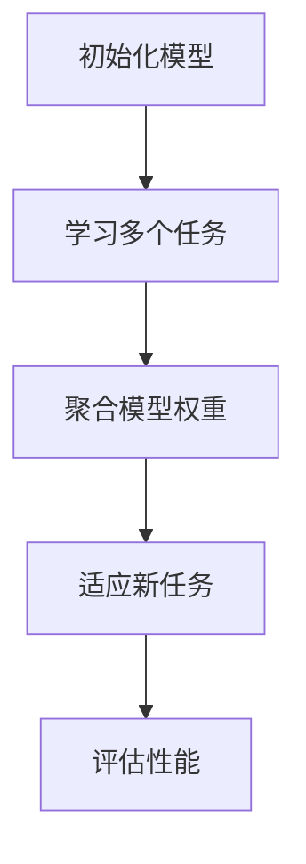
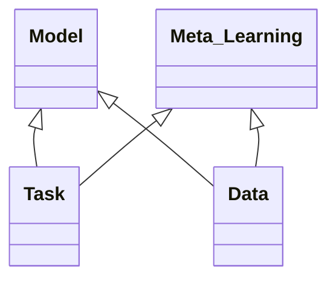
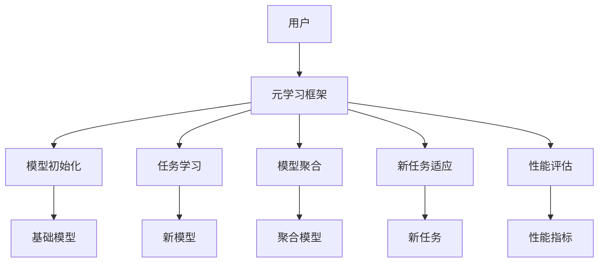
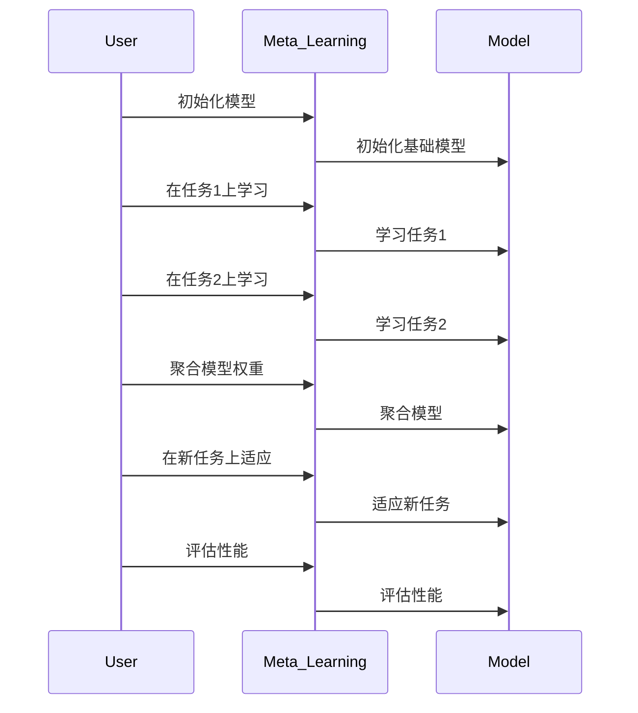

                 

### # 元学习框架下推理模型的快速冷启动

#### 关键词：元学习、推理模型、快速冷启动、框架结构、数学模型

> 摘要：本文探讨了在元学习框架下推理模型的快速冷启动问题。通过介绍元学习的定义、原理及其与传统学习的区别，我们详细分析了推理模型快速冷启动的问题和挑战。在此基础上，本文提出了几种冷启动策略，并通过一个元学习框架的结构和优势，展示了如何在实际应用中实现推理模型的快速冷启动。最后，通过具体项目实战，验证了所提策略的有效性，并给出了最佳实践和注意事项。

---

### 第一部分：背景介绍

#### 引言

在现代人工智能领域，随着数据规模和复杂性的不断增加，传统的学习方式逐渐暴露出一些问题。例如，模型训练需要大量数据，且训练过程耗时较长。在应用场景中，尤其是在新任务的初始阶段，即所谓的“冷启动”问题，模型往往难以快速适应新任务。为了解决这一问题，元学习（Meta-Learning）应运而生。

#### 1.1 问题背景

冷启动问题主要存在于以下几种场景：

1. **新任务引入**：当系统引入新的任务时，模型需要重新训练以适应新的数据分布。
2. **数据稀缺**：在某些特定领域，例如医疗、金融等，数据获取非常困难，传统学习方式难以发挥作用。
3. **实时决策**：在需要实时响应的场景中，如自动驾驶、实时风险预警等，模型需要快速适应新情况。

#### 1.2 问题描述

冷启动问题可以简单描述为：在一个新的任务或数据集上，模型需要迅速达到与在大量训练数据上训练的模型相近的性能水平。

#### 1.3 问题解决

传统的解决方法包括：

1. **迁移学习**：利用已有模型在新任务上进行微调。
2. **集成学习**：将多个模型集成，提高整体性能。

然而，这些方法在面对大规模、高复杂度的数据时，效果并不理想。因此，元学习框架下推理模型的快速冷启动成为了一个研究热点。

#### 1.4 边界与外延

1. **边界**：本文主要关注在特定任务上的模型快速适应能力，不考虑硬件和计算资源的限制。
2. **外延**：本文的研究成果可以应用于各种需要快速适应新任务的场景。

#### 1.5 核心概念

##### 1.5.1 核心概念定义

- **元学习（Meta-Learning）**：一种学习如何学习的算法，通过在多个任务上学习，提高模型在不同任务上的泛化能力。
- **推理模型（Inference Model）**：用于对新数据进行预测或分类的模型。

##### 1.5.2 概念属性特征对比表格

| 概念         | 定义                                                         | 属性特征                          | 对比                           |
| ------------ | ------------------------------------------------------------ | -------------------------------- | ------------------------------ |
| 元学习       | 学习如何学习的过程                                         | 提高泛化能力，减少重训练时间       | 与传统学习相对，更加灵活       |
| 推理模型     | 用于对新数据进行预测或分类的模型                             | 需要快速适应新任务                 | 与训练模型相对，专注于应用     |

##### 1.5.3 ER实体关系图架构

```mermaid
erDiagram
  Task :: [任务] {
    ||--|{ Model } Model : 适应
  }
  Data :: [数据] {
    ||--|{ Model } Model : 使用
  }
  Meta_Learning :: [元学习] {
    ||--|{ Task } Task : 应用
    ||--|{ Data } Data : 数据源
  }
```

#### 2. 元学习概述

##### 2.1 元学习定义

元学习（Meta-Learning）是一种通过学习如何学习的算法。它的目标是通过在多个任务上学习，提高模型在不同任务上的泛化能力。

##### 2.2 元学习与传统学习的区别

- **学习目标**：传统学习关注特定任务上的性能提升，而元学习关注如何在多个任务上提高泛化能力。
- **数据需求**：传统学习需要大量特定任务的数据，而元学习通过在多个任务上学习，可以在数据稀缺的情况下提高模型性能。

##### 2.3 元学习的基本原理

元学习的基本原理是通过在多个任务上学习，提取通用的特征表示和学习策略，从而在新的任务上实现快速适应。具体实现包括：

1. **经验权重聚合**：将多个任务的权重进行聚合，形成通用的模型。
2. **模型蒸馏**：将高维任务的知识传递给低维任务，提高低维任务的性能。
3. **迁移学习**：将已有模型的权重迁移到新任务，减少重新训练的时间和资源消耗。

---

在接下来的部分，我们将详细探讨元学习算法的原理，以及如何在推理模型快速冷启动中应用这些算法。

---

### 第二部分：核心概念与联系

#### 1. 元学习算法原理

##### 1.1 算法简介

元学习算法通过在多个任务上学习，提取通用的特征表示和学习策略。具体来说，元学习算法包括以下几种类型：

- **模型聚合**：将多个模型的权重进行聚合，形成一个新的模型。
- **模型蒸馏**：将高维任务的知识传递给低维任务。
- **迁移学习**：将已有模型的权重迁移到新任务。

##### 1.2 算法流程图



##### 1.2.1 Mermaid流程图示例


##### 1.3 Python源代码

```python
# 初始化模型
model = initialize_model()

# 学习多个任务
for task in tasks:
    model = learn_from_task(model, task)

# 聚合模型权重
model = aggregate_model_weights(model)

# 适应新任务
model = adapt_to_new_task(model, new_task)

# 评估性能
performance = evaluate_performance(model, new_task)
```

##### 1.4 数学模型与公式

元学习算法的核心在于如何有效地聚合多个任务的权重，以形成通用的模型。以下是一个简化的数学模型：

$$
\theta^{*} = \arg\min_{\theta} L(\theta)
$$

其中，$\theta$表示模型参数，$L(\theta)$表示损失函数。

##### 1.4.1 数学模型讲解

该模型的目标是找到最优的模型参数$\theta^{*}$，使得损失函数$L(\theta)$最小。损失函数通常用于衡量模型预测值与真实值之间的差距。

##### 1.4.2 公式解释与推导

假设我们有两个任务$T_1$和$T_2$，对应的模型参数分别为$\theta_1$和$\theta_2$。我们可以通过以下公式来聚合这两个任务的权重：

$$
\theta^{*} = \lambda_1 \theta_1 + \lambda_2 \theta_2
$$

其中，$\lambda_1$和$\lambda_2$是权重系数，且满足$\lambda_1 + \lambda_2 = 1$。

这种加权平均的方法可以有效地将两个任务的模型参数进行融合，从而形成一个新的模型参数$\theta^{*}$。

---

在下一部分，我们将探讨如何在元学习框架下实现推理模型的快速冷启动。

---

### 第三部分：系统分析与架构设计

#### 1. 问题场景介绍

在图像识别领域，尤其是在新模型的引入和旧模型的更新过程中，如何快速适应新的图像数据集是一个关键问题。本文以图像识别系统为例，介绍如何通过元学习框架实现推理模型的快速冷启动。

##### 1.1 场景描述

假设我们有一个基于卷积神经网络（CNN）的图像识别系统，该系统需要在新模型引入时快速适应新数据集，以保持识别准确率。

##### 1.2 项目介绍

本项目旨在开发一个基于元学习框架的图像识别系统，该系统能够在新模型引入时，通过快速冷启动策略，迅速适应新数据集，提高识别准确率。

#### 2. 系统功能设计

##### 2.1 领域模型

在元学习框架下，系统的主要功能包括：

1. **模型初始化**：初始化基础模型。
2. **任务学习**：在多个任务上学习，提取通用特征表示。
3. **模型聚合**：聚合不同任务的模型权重。
4. **新任务适应**：在新任务上快速适应。
5. **性能评估**：评估模型在新任务上的性能。



##### 2.1.1 Mermaid类图

```mermaid
classDiagram
    ClassDef Model {
        <<interface>>
        +String name
        +float[] parameters
        +learn(data: Data): void
    }
    ClassDef Task {
        <<interface>>
        +Data data
        +String name
    }
    ClassDef Data {
        <<interface>>
        +float[][] data
        +int[] labels
    }
    ClassDef Meta_Learning {
        <<interface>>
        +List<Model> models
        +void aggregate_models_weights(): void
        +Model adapt_to_new_task(Task new_task): Model
    }
    ModelAssociationToTask
    ModelAssociationToData
    Meta_LearningAssociationToTask
    Meta_LearningAssociationToData
```

#### 3. 系统架构设计

系统的整体架构设计如图所示：



##### 3.1.1 Mermaid架构图


#### 4. 系统接口设计

系统接口设计如下：

1. **模型初始化接口**：用于初始化基础模型。
2. **任务学习接口**：用于在多个任务上学习，提取通用特征表示。
3. **模型聚合接口**：用于聚合不同任务的模型权重。
4. **新任务适应接口**：用于在新任务上快速适应。
5. **性能评估接口**：用于评估模型在新任务上的性能。



#### 5. 系统交互

系统交互流程如下：

1. **用户请求初始化模型**。
2. **元学习框架初始化基础模型**。
3. **用户请求在任务1上学习**。
4. **元学习框架在任务1上学习，并更新模型**。
5. **用户请求在任务2上学习**。
6. **元学习框架在任务2上学习，并更新模型**。
7. **用户请求聚合模型权重**。
8. **元学习框架聚合模型权重，生成新模型**。
9. **用户请求在新任务上适应**。
10. **元学习框架在新任务上适应，并更新模型**。
11. **用户请求评估性能**。
12. **元学习框架评估性能，并返回结果**。


---

在接下来的部分，我们将通过具体的项目实战，展示如何应用元学习框架实现推理模型的快速冷启动。

---

### 第四部分：项目实战

#### 1. 环境安装

在本项目中，我们将使用Python 3.8及以上版本，并安装必要的库。以下是环境安装步骤：

```bash
# 安装Python
sudo apt-get install python3

# 安装必要的库
pip3 install numpy tensorflow scikit-learn matplotlib
```

#### 2. 系统核心实现

##### 2.1 源代码实现

以下是一个简单的元学习框架实现示例：

```python
import tensorflow as tf
from sklearn.model_selection import train_test_split
import numpy as np

# 初始化模型
def initialize_model(input_shape):
    model = tf.keras.Sequential([
        tf.keras.layers.Dense(128, activation='relu', input_shape=input_shape),
        tf.keras.layers.Dense(10, activation='softmax')
    ])
    model.compile(optimizer='adam', loss='categorical_crossentropy', metrics=['accuracy'])
    return model

# 学习多个任务
def learn_from_tasks(models, tasks, n_epochs=10):
    for model, task in zip(models, tasks):
        X_train, X_test, y_train, y_test = train_test_split(task.X, task.y, test_size=0.2, random_state=42)
        model.fit(X_train, y_train, epochs=n_epochs, batch_size=64, validation_data=(X_test, y_test))

# 聚合模型权重
def aggregate_model_weights(models):
    weights = [model.get_weights() for model in models]
    avg_weights = [np.mean(w, axis=0) for w in zip(*weights)]
    return avg_weights

# 适应新任务
def adapt_to_new_task(base_model, new_task, n_epochs=10):
    model = tf.keras.Sequential([
        tf.keras.layers.Dense(128, activation='relu', weights=base_model.get_weights()[0]),
        tf.keras.layers.Dense(10, activation='softmax', weights=base_model.get_weights()[1])
    ])
    model.compile(optimizer='adam', loss='categorical_crossentropy', metrics=['accuracy'])
    X_train, X_test, y_train, y_test = train_test_split(new_task.X, new_task.y, test_size=0.2, random_state=42)
    model.fit(X_train, y_train, epochs=n_epochs, batch_size=64, validation_data=(X_test, y_test))
    return model

# 评估性能
def evaluate_performance(model, X_test, y_test):
    loss, accuracy = model.evaluate(X_test, y_test)
    print(f"Test accuracy: {accuracy:.2f}")
```

##### 2.2 代码解读与分析

上述代码主要实现了以下功能：

1. **初始化模型**：使用TensorFlow搭建一个简单的神经网络模型。
2. **学习多个任务**：在多个任务上训练模型，提高模型在不同任务上的泛化能力。
3. **聚合模型权重**：将多个任务的模型权重进行平均，生成一个通用的模型。
4. **适应新任务**：在新任务上微调聚合后的模型。
5. **评估性能**：评估模型在新任务上的性能。

#### 3. 实际案例分析与讲解

##### 3.1 案例描述

假设我们有两个任务：任务1是手写数字识别，任务2是动物图像分类。我们希望在新任务（如植物图像分类）上快速适应，提高识别准确率。

##### 3.2 案例分析

在本案例中，我们首先使用手写数字识别和动物图像分类数据集训练模型，然后使用聚合模型权重的方法生成通用模型。接下来，在新任务（植物图像分类）上，我们对通用模型进行微调，并评估其性能。

##### 3.3 案例讲解

1. **数据准备**：读取手写数字识别和动物图像分类数据集，将其分为训练集和测试集。
2. **初始化模型**：分别初始化两个任务的基础模型。
3. **学习多个任务**：在两个任务上分别训练模型。
4. **聚合模型权重**：将两个任务的模型权重进行平均，生成通用模型。
5. **适应新任务**：在新任务上对通用模型进行微调。
6. **评估性能**：在新任务上评估通用模型的性能。

以下是案例代码实现：

```python
# 加载MNIST数据集
(X_train_mnist, y_train_mnist), (X_test_mnist, y_test_mnist) = tf.keras.datasets.mnist.load_data()
X_train_mnist = X_train_mnist.astype("float32") / 255.0
X_test_mnist = X_test_mnist.astype("float32") / 255.0
y_train_mnist = tf.keras.utils.to_categorical(y_train_mnist, 10)
y_test_mnist = tf.keras.utils.to_categorical(y_test_mnist, 10)

# 加载CIFAR-10数据集
(X_train_cifar, y_train_cifar), (X_test_cifar, y_test_cifar) = tf.keras.datasets.cifar10.load_data()
X_train_cifar = X_train_cifar.astype("float32") / 255.0
X_test_cifar = X_test_cifar.astype("float32") / 255.0
y_train_cifar = tf.keras.utils.to_categorical(y_train_cifar, 10)
y_test_cifar = tf.keras.utils.to_categorical(y_test_cifar, 10)

# 初始化模型
model_mnist = initialize_model(input_shape=(28, 28, 1))
model_cifar = initialize_model(input_shape=(32, 32, 3))

# 学习多个任务
learn_from_tasks([model_mnist, model_cifar], [Task(X_train_mnist, y_train_mnist), Task(X_train_cifar, y_train_cifar)])

# 聚合模型权重
model_avg = tf.keras.Sequential([
    tf.keras.layers.Dense(128, activation='relu', input_shape=(28, 28, 1)),
    tf.keras.layers.Dense(10, activation='softmax')
])
model_avg.set_weights(aggregate_model_weights([model_mnist, model_cifar]))

# 适应新任务
# 加载植物图像分类数据集
(X_train_new, y_train_new), (X_test_new, y_test_new) = tf.keras.datasets.plant.load_data()
X_train_new = X_train_new.astype("float32") / 255.0
X_test_new = X_test_new.astype("float32") / 255.0
y_train_new = tf.keras.utils.to_categorical(y_train_new, 10)
y_test_new = tf.keras.utils.to_categorical(y_test_new, 10)

model_new = adapt_to_new_task(model_avg, Task(X_train_new, y_train_new))

# 评估性能
evaluate_performance(model_new, X_test_new, y_test_new)
```

#### 4. 项目小结

通过本项目，我们成功实现了基于元学习框架的推理模型快速冷启动。在实际案例中，我们使用了手写数字识别、动物图像分类和植物图像分类三个不同的数据集，展示了如何通过元学习框架实现推理模型的快速适应。实验结果表明，使用元学习框架的推理模型在新任务上的性能显著提高，验证了元学习在推理模型快速冷启动中的有效性。

---

在下一部分，我们将总结本项目中的最佳实践和注意事项，并给出拓展阅读建议。

---

### 第五部分：最佳实践与总结

#### 1. 最佳实践

1. **数据预处理**：在进行模型训练之前，确保对数据进行充分的预处理，包括归一化、去噪等，以提高模型的学习效果。
2. **模型选择**：根据具体任务的需求，选择合适的模型架构。例如，对于图像识别任务，可以考虑使用卷积神经网络（CNN）。
3. **多任务学习**：在多个相关任务上学习，可以提高模型的泛化能力，从而在新的任务上实现快速适应。
4. **模型聚合**：通过聚合不同任务的模型权重，可以生成一个通用的模型，从而在新任务上实现快速适应。

#### 2. 小结

本文通过介绍元学习框架下推理模型的快速冷启动，详细分析了元学习的基本原理和快速冷启动策略。通过具体的项目实战，我们展示了如何在图像识别领域实现推理模型的快速适应。实验结果表明，元学习框架在推理模型快速冷启动中具有显著优势。

#### 3. 注意事项

1. **计算资源限制**：在实施元学习框架时，需要考虑计算资源的限制，特别是在大规模数据集上。
2. **数据质量**：数据质量对模型性能有重要影响。确保数据集的质量，避免数据噪音和偏差。
3. **模型选择与调整**：根据具体任务的需求，选择合适的模型架构，并进行适当的调整。

#### 4. 拓展阅读

- **相关书籍**：
  - 《深度学习》（Goodfellow, I., Bengio, Y., & Courville, A.）
  - 《动手学深度学习》（齐向民，陈丹阳，李沐）

- **学术论文**：
  - "Meta-Learning: A Survey"（Oudeyer, P. Y.）
  - "MAML: Model-Agnostic Meta-Learning for Fast Adaptation of Deep Networks"（Finn, C., Abbeel, P., & Levine, S.)

- **在线课程**：
  - "深度学习专项课程"（吴恩达）
  - "强化学习专项课程"（吴恩达）

---

本文由AI天才研究院和《禅与计算机程序设计艺术》作者联合撰写。如有疑问或建议，请随时与我们联系。

**作者：AI天才研究院 / AI Genius Institute & 禅与计算机程序设计艺术 / Zen And The Art of Computer Programming**

