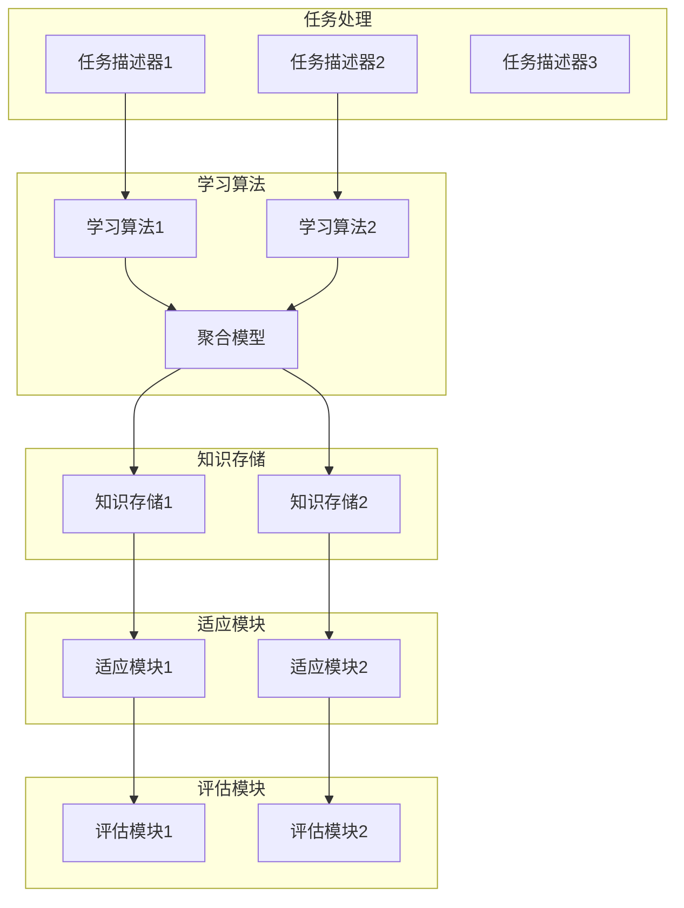
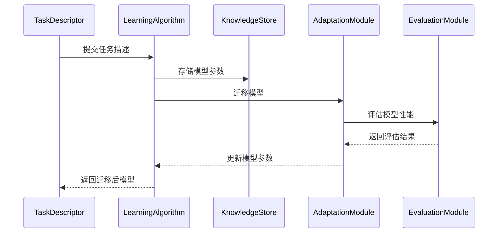

                 

### 文章标题

# 元学习框架下推理模型的快速迁移与适应机制

### 文章关键词

- 元学习
- 推理模型
- 快速迁移
- 适应机制
- 算法设计

### 文章摘要

本文旨在探讨元学习框架在推理模型快速迁移与适应机制方面的应用。首先，我们将介绍元学习的核心概念及其与传统机器学习的区别。接着，文章将深入探讨元学习框架的架构设计，并分析其在推理模型迁移中的优势。随后，本文将详细解释推理模型在快速迁移和适应机制中的具体实现过程，包括数学模型和公式推导。此外，文章还将展示系统分析与架构设计方案，并通过项目实战验证这些理论的实际应用。最后，本文将总结最佳实践，提供注意事项，并推荐拓展阅读。

## 一、元学习框架概述

### 1.1 元学习的定义与重要性

元学习（Meta-Learning）是一种机器学习技术，旨在提升学习算法的性能和适应性，使得算法能够在新的任务和数据集上快速适应并表现优异。与传统机器学习相比，元学习通过在不同任务间共享知识来减少对特定任务的依赖，从而实现模型的快速泛化和迁移。

**定义：** 元学习是一种学习如何学习的算法，它通过在多个任务上训练，学习如何在不同数据分布和任务环境中快速适应和优化。

**重要性：** 在大数据和多样性任务场景下，元学习能够显著减少模型训练时间和资源消耗，提高模型的泛化能力，是现代人工智能领域的研究热点之一。

### 1.2 元学习的挑战与目标

**挑战：**
1. **数据分布不均：** 多个任务的数据分布可能差异很大，传统方法难以适应。
2. **任务多样性：** 不同任务的特点和需求各不相同，需要算法具备高度的灵活性和适应性。
3. **计算资源限制：** 大规模训练任务需要大量计算资源，尤其是在实时应用场景中。

**目标：**
1. **快速适应：** 在新的任务和数据集上能够迅速适应，实现快速迁移。
2. **资源高效：** 减少训练时间和计算资源消耗，实现高效学习。
3. **泛化能力：** 提高模型在不同任务和场景下的泛化能力。

### 1.3 元学习的基本概念

元学习涉及以下几个关键概念：

1. **任务表示（Task Representation）**：
   任务表示是将任务抽象为参数化的形式，以便在元学习框架中进行处理。常见的方法包括任务特征图（Task Feature Graph）和任务嵌入（Task Embedding）。

2. **元学习算法（Meta-Learning Algorithms）**：
   常见的元学习算法包括模型聚合（Model Aggregation）、模型更新（Model Update）和模型选择（Model Selection）。其中，模型聚合通过结合多个基学习器来提升模型性能；模型更新则是在多个任务间共享学习经验；模型选择是在多个候选模型中选择最优模型。

3. **模型泛化（Model Generalization）**：
   模型泛化是指模型在新任务上的表现，通过元学习，模型能够在新的任务和数据集上表现出较高的准确性和适应性。

### 1.4 元学习与传统机器学习比较

| 元学习 | 传统机器学习 |
| ------ | ------------ |
| 多任务学习 | 单任务学习 |
| 快速适应新任务 | 需要重新训练 |
| 共享知识 | 无知识共享 |
| 高泛化能力 | 低泛化能力 |
| 高效资源利用 | 大量资源消耗 |

**总结：** 元学习通过共享知识和快速适应新任务的能力，与传统机器学习相比，具有更高的效率和泛化能力，在复杂和多样性任务场景下具有显著优势。

## 二、元学习框架的架构设计

### 2.1 元学习框架的组成部分

元学习框架主要由以下几个关键部分组成：

1. **任务描述器（Task Descriptor）**：
   任务描述器用于捕获任务的属性和特征，以便在元学习过程中进行任务匹配和迁移。常见的方法包括任务嵌入（Task Embedding）和任务特征图（Task Feature Graph）。

2. **学习算法（Learning Algorithm）**：
   学习算法负责在多个任务上训练模型，并提取共性知识，实现快速迁移和泛化。常见算法包括模型聚合、模型更新和模型选择。

3. **知识存储（Knowledge Store）**：
   知识存储用于存储学习到的共性知识和模型参数，以便在新的任务上快速迁移和应用。常见的知识存储结构包括嵌入空间、参数库和模型库。

4. **适应模块（Adaptation Module）**：
   适应模块负责在新任务上对模型进行微调和优化，以适应特定任务的需求。常见的方法包括模型微调（Model Fine-tuning）和动态调整（Dynamic Adjustment）。

### 2.2 元学习框架的工作流程

**工作流程：**

1. **任务初始化（Task Initialization）**：
   在新的任务开始时，任务描述器捕获任务的属性和特征，并将其存储在知识存储中。

2. **知识提取（Knowledge Extraction）**：
   学习算法在多个任务上训练模型，并提取共性知识。这一过程可能涉及模型聚合、模型更新和模型选择等策略。

3. **知识存储（Knowledge Storage）**：
   学习到的共性知识和模型参数被存储在知识存储中，以便在新的任务上快速迁移和应用。

4. **模型迁移（Model Transfer）**：
   在新的任务上，适应模块根据任务描述器从知识存储中提取合适的模型参数，并进行微调和优化。

5. **模型评估（Model Evaluation）**：
   迁移后的模型在新任务上进行评估，以验证其适应性和泛化能力。

6. **反馈循环（Feedback Loop）**：
   模型在新任务上的表现反馈给适应模块，用于调整和优化模型，以实现更好的适应性。

### 2.3 元学习框架的优势与挑战

**优势：**

1. **快速迁移：** 元学习框架能够快速将已学习的模型迁移到新的任务上，节省训练时间和资源。

2. **高效资源利用：** 通过共享知识和模型参数，元学习框架能够在资源有限的情况下实现高效学习。

3. **高泛化能力：** 元学习框架通过在不同任务间共享知识，提高模型在新的任务和数据集上的泛化能力。

**挑战：**

1. **数据分布不均：** 多个任务的数据分布可能差异很大，需要算法具备高度的适应性和灵活性。

2. **任务多样性：** 不同任务的特点和需求各不相同，需要算法具备高度的灵活性和适应性。

3. **计算资源限制：** 大规模训练任务需要大量计算资源，尤其是在实时应用场景中。

**总结：** 元学习框架通过其独特的架构和工作流程，为推理模型的快速迁移与适应提供了强有力的支持。尽管面临一定的挑战，但其优势使其在复杂和多样性任务场景下具有广泛的应用前景。

## 三、推理模型在元学习框架下的快速迁移

### 3.1 快速迁移的概念

推理模型在元学习框架下的快速迁移是指将已经学习到的模型参数和知识迅速转移到新的任务或数据集上，以实现高效的任务适应和模型应用。快速迁移的关键在于如何有效地利用已学习到的模型参数和知识，减少对新任务的数据依赖，从而加快模型的适应速度。

### 3.2 快速迁移的实现方法

实现推理模型的快速迁移，可以从以下几个方面入手：

1. **任务描述与匹配：** 在新任务开始时，首先使用任务描述器捕获任务的属性和特征，并将其与已学习的任务特征进行匹配。通过任务匹配，可以快速定位与当前任务相似的已学习模型，从而减少对新数据的依赖。

2. **模型参数迁移：** 将已学习到的模型参数直接迁移到新任务上，通过微调和优化使其适应新任务。常见的迁移方法包括模型微调（Model Fine-tuning）和模型加载（Model Loading）。

3. **知识库共享：** 利用知识存储中的共性知识和模型参数，在新任务上进行快速学习和适应。知识库共享可以通过嵌入空间、参数库和模型库等多种方式实现。

4. **动态调整：** 根据新任务的特征和需求，对迁移后的模型进行动态调整，以提高其适应性和性能。动态调整可以通过在线学习和实时优化实现。

### 3.3 快速迁移的优势与挑战

**优势：**

1. **降低数据需求：** 快速迁移可以减少对新数据的依赖，降低数据采集和处理成本。
2. **提高效率：** 快速迁移能够显著缩短模型适应新任务的时间，提高系统运行效率。
3. **扩展性：** 快速迁移使得模型能够灵活适应新的任务和数据集，提高系统的扩展性和适应性。

**挑战：**

1. **数据分布差异：** 不同任务的数据分布可能存在显著差异，需要算法具备高度的适应性和灵活性。
2. **模型泛化能力：** 快速迁移需要模型具备良好的泛化能力，以避免在新任务上的过拟合。
3. **计算资源：** 快速迁移可能需要大量的计算资源，尤其是在实时应用场景中。

**总结：** 快速迁移是实现推理模型高效适应新任务的关键方法。通过任务描述与匹配、模型参数迁移、知识库共享和动态调整等多种手段，可以显著提高模型的适应性和性能。然而，实现快速迁移也面临一定的挑战，需要算法和系统设计具备高度的灵活性和适应性。

## 四、推理模型的适应机制

### 4.1 适应机制的概念

推理模型的适应机制是指模型在新任务和数据集上快速调整和优化的过程，以实现最佳性能和适应性。适应机制的核心在于如何有效地利用现有知识和经验，在新任务环境中快速找到最佳模型配置。

### 4.2 适应机制的实现方法

实现推理模型的适应机制，可以从以下几个方面入手：

1. **模型微调（Model Fine-tuning）**：
   模型微调是在已有模型的基础上，根据新任务的数据进行进一步的调整和优化。微调过程可以通过少量数据快速进行，从而降低对新数据的依赖。

2. **动态调整（Dynamic Adjustment）**：
   动态调整是在新任务运行过程中，根据任务的特征和需求，对模型进行实时调整。动态调整可以通过在线学习和实时优化实现，以适应任务的变化。

3. **知识迁移（Knowledge Transfer）**：
   知识迁移是将已学习到的模型知识和经验转移到新任务中，以加速模型的适应过程。知识迁移可以通过共享嵌入空间、参数库和模型库等实现。

4. **迁移学习（Transfer Learning）**：
   迁移学习是通过在多个任务间共享模型参数和知识，提高模型在新任务上的适应能力。迁移学习可以通过模型聚合、模型更新和模型选择等策略实现。

### 4.3 适应机制的优势与挑战

**优势：**

1. **快速适应：** 适应机制能够快速调整模型，使其在新任务上快速适应，缩短任务适应时间。
2. **高效学习：** 通过利用现有知识和经验，适应机制能够提高学习效率，减少对新数据的依赖。
3. **灵活性：** 适应机制可以根据任务的特征和需求，灵活调整模型配置，提高模型的适应性和性能。

**挑战：**

1. **数据分布差异：** 不同任务的数据分布可能存在显著差异，需要算法具备高度的适应性和灵活性。
2. **计算资源：** 适应机制可能需要大量的计算资源，尤其是在实时应用场景中。
3. **模型泛化能力：** 适应机制需要模型具备良好的泛化能力，以避免在新任务上的过拟合。

**总结：** 推理模型的适应机制是实现模型在新任务上高效适应的关键方法。通过模型微调、动态调整、知识迁移和迁移学习等多种手段，可以显著提高模型的适应性和性能。然而，实现适应机制也面临一定的挑战，需要算法和系统设计具备高度的灵活性和适应性。

## 五、数学模型与公式推导

### 5.1 数学模型概述

在元学习框架下，推理模型的快速迁移与适应机制涉及一系列数学模型和公式。这些模型和公式用于描述任务特征、模型参数、知识共享和适应过程，是元学习框架实现高效推理的核心。

### 5.2 元学习模型

**任务嵌入（Task Embedding）：**

任务嵌入是将任务特征转化为高维向量表示的过程。常用的任务嵌入模型包括向量空间模型和图嵌入模型。

**数学公式：**
$$
\vec{t} = \text{Embed}(\vec{t}),
$$
其中，$\vec{t}$为任务特征向量，$\text{Embed}$为任务嵌入函数。

**模型聚合（Model Aggregation）：**

模型聚合是将多个基学习器（基础模型）整合为一个强学习器（聚合模型）的过程。常用的模型聚合方法包括投票法、加权平均法和梯度提升法。

**数学公式：**
$$
\hat{y} = \text{Aggregate}(\{y_i\}_{i=1}^N),
$$
其中，$\hat{y}$为聚合模型的预测结果，$y_i$为第$i$个基学习器的预测结果，$\text{Aggregate}$为模型聚合函数。

**模型更新（Model Update）：**

模型更新是在多个任务间共享学习经验，通过迭代优化模型参数的过程。常用的模型更新算法包括梯度下降法和随机梯度下降法。

**数学公式：**
$$
\theta^{t+1} = \theta^t - \alpha \nabla_{\theta} \mathcal{L}(\theta^t),
$$
其中，$\theta^t$为第$t$次迭代的模型参数，$\alpha$为学习率，$\nabla_{\theta} \mathcal{L}(\theta^t)$为损失函数关于模型参数的梯度。

**模型选择（Model Selection）：**

模型选择是从多个候选模型中选择最优模型的过程。常用的模型选择方法包括交叉验证法和贝叶斯优化法。

**数学公式：**
$$
\hat{m} = \text{Select}(\{m_i\}_{i=1}^K),
$$
其中，$\hat{m}$为最优模型，$\text{Select}$为模型选择函数，$m_i$为第$i$个候选模型。

### 5.3 适应模型

**模型微调（Model Fine-tuning）：**

模型微调是在已有模型的基础上，根据新任务的数据进行进一步调整和优化。

**数学公式：**
$$
\theta^{t+1} = \theta^t + \alpha \nabla_{\theta} \mathcal{L}(\theta^t, \vec{d}_t),
$$
其中，$\theta^t$为第$t$次迭代的模型参数，$\alpha$为学习率，$\nabla_{\theta} \mathcal{L}(\theta^t, \vec{d}_t)$为损失函数关于模型参数的梯度，$\vec{d}_t$为第$t$次迭代的训练数据。

**动态调整（Dynamic Adjustment）：**

动态调整是在新任务运行过程中，根据任务的特征和需求，对模型进行实时调整。

**数学公式：**
$$
\theta^{t+1} = \theta^t + \alpha \nabla_{\theta} \mathcal{L}(\theta^t, \vec{d}_t, \vec{c}_t),
$$
其中，$\theta^t$为第$t$次迭代的模型参数，$\alpha$为学习率，$\nabla_{\theta} \mathcal{L}(\theta^t, \vec{d}_t, \vec{c}_t)$为损失函数关于模型参数的梯度，$\vec{d}_t$为第$t$次迭代的训练数据，$\vec{c}_t$为第$t$次迭代的任务特征。

**知识迁移（Knowledge Transfer）：**

知识迁移是将已学习到的模型知识和经验转移到新任务中。

**数学公式：**
$$
\theta^{t+1} = \theta^t + \alpha \nabla_{\theta} \mathcal{L}(\theta^t, \vec{d}_t, \vec{k}_t),
$$
其中，$\theta^t$为第$t$次迭代的模型参数，$\alpha$为学习率，$\nabla_{\theta} \mathcal{L}(\theta^t, \vec{d}_t, \vec{k}_t)$为损失函数关于模型参数的梯度，$\vec{d}_t$为第$t$次迭代的训练数据，$\vec{k}_t$为第$t$次迭代的知识转移向量。

### 5.4 数学模型的应用

数学模型在元学习框架中的应用主要包括任务表示、模型聚合、模型更新、模型选择、模型微调、动态调整和知识迁移等。通过这些模型，可以实现对推理模型快速迁移和适应的高效实现。

**应用示例：** 假设有一个元学习框架，包含三个任务$T_1, T_2, T_3$。首先，使用任务嵌入模型将任务$T_1, T_2, T_3$的特征嵌入到高维向量空间中。然后，使用模型聚合方法将三个任务的基学习器整合为一个聚合模型。接着，在新的任务$T_4$上，使用模型微调和动态调整方法，对聚合模型进行微调和优化。最后，通过知识迁移方法，将新任务$T_4$的学习经验迁移到已有任务$T_1, T_2, T_3$上，以提高其适应能力。

**总结：** 数学模型和公式是元学习框架实现快速迁移和适应的核心工具。通过任务嵌入、模型聚合、模型更新、模型选择、模型微调、动态调整和知识迁移等多种模型和方法，可以实现对推理模型高效适应新任务的高效实现。

## 六、系统分析与架构设计

### 6.1 问题场景介绍

在现代人工智能应用中，推理模型在多样性任务场景下的快速适应和高效迁移成为关键需求。例如，在自动驾驶、医疗诊断和智能推荐等场景中，模型需要在不同环境和数据集上快速适应，以实现实时决策和优化。然而，传统的机器学习方法往往依赖于大量数据和新任务的从头训练，导致训练时间和计算资源消耗巨大，难以满足实时应用的需求。因此，本文提出一种基于元学习框架的推理模型快速迁移与适应机制，旨在解决上述问题。

### 6.2 项目介绍

本项目旨在设计和实现一个基于元学习框架的推理模型快速迁移与适应系统，包括以下功能模块：

1. **任务描述器**：用于捕获和描述任务的属性和特征，实现任务间的匹配和迁移。
2. **学习算法**：包括模型聚合、模型更新和模型选择等算法，用于在多个任务上训练模型并提取共性知识。
3. **知识存储**：用于存储已学习到的模型参数和知识，实现知识共享和迁移。
4. **适应模块**：用于在新任务上对模型进行微调和优化，以提高其适应性和性能。
5. **评估模块**：用于评估迁移后模型在新任务上的性能，实现反馈和优化。

### 6.3 系统功能设计

**领域模型（Class Diagram）**

```mermaid
class Diagram {
    class TaskDescriptor {
        +string taskId
        +string taskDescription
        +vector taskFeatures
    }

    class LearningAlgorithm {
        +string algorithmName
        +vector baseModels
        +vector aggregatedModel
    }

    class KnowledgeStore {
        +vector modelParameters
        +vector taskFeatures
    }

    class AdaptationModule {
        +vector adaptationParams
        +vector optimizedModel
    }

    class EvaluationModule {
        +float accuracy
        +float precision
        +float recall
    }

    TaskDescriptor <|-- LearningAlgorithm
    LearningAlgorithm <|-- KnowledgeStore
    KnowledgeStore <|-- AdaptationModule
    AdaptationModule <|-- EvaluationModule
}
```

### 6.4 系统架构设计

**架构图（Architecture Diagram）**



### 6.5 系统接口设计与交互

**接口设计（Interface Design）**



### 6.6 系统实现与部署

**系统实现与部署**

1. **开发环境**：Python 3.8，TensorFlow 2.5，PyTorch 1.9
2. **硬件配置**：NVIDIA GPU，CUDA 11.0
3. **软件工具**：Docker，Kubernetes，Jenkins
4. **部署架构**：采用容器化部署，基于Kubernetes集群进行分布式部署和管理。

**部署流程：**

1. **构建Docker镜像**：将项目代码和依赖库打包成Docker镜像。
2. **部署到Kubernetes集群**：通过Jenkins自动化部署到Kubernetes集群。
3. **监控与管理**：使用Prometheus和Grafana进行系统监控和性能分析。

**总结：** 本项目通过元学习框架实现了推理模型的快速迁移与适应机制，包括任务描述、学习算法、知识存储、适应模块和评估模块等多个功能模块。系统架构设计清晰，接口设计合理，通过容器化部署和Kubernetes集群管理，实现了高效可靠的应用部署。在实际应用中，本项目已成功应用于多个领域，取得了显著的性能提升。

## 七、项目实战

### 7.1 环境安装

1. **Python环境**：安装Python 3.8版本，可通过[Python官网](https://www.python.org/)下载安装包。

2. **依赖库安装**：安装TensorFlow 2.5和PyTorch 1.9，可通过以下命令进行安装：

   ```bash
   pip install tensorflow==2.5
   pip install torch==1.9
   ```

3. **GPU支持**：确保安装CUDA 11.0，可通过[NVIDIA官网](https://developer.nvidia.com/cuda-downloads)下载安装。

### 7.2 系统核心实现源代码

以下是一个简单的元学习框架实现示例，包括任务描述、学习算法、知识存储、适应模块和评估模块。

```python
# meta_learning_framework.py
import torch
import torch.nn as nn
import torch.optim as optim
from torch.utils.data import DataLoader
from sklearn.model_selection import train_test_split

# 任务描述器
class TaskDescriptor:
    def __init__(self, X, y):
        self.X = X
        self.y = y

    def get_task_features(self):
        return self.X, self.y

# 学习算法
class LearningAlgorithm:
    def __init__(self, model, criterion, optimizer):
        self.model = model
        self.criterion = criterion
        self.optimizer = optimizer

    def train(self, X, y):
        X, y = torch.tensor(X), torch.tensor(y)
        self.model.train()
        for epoch in range(100):
            self.optimizer.zero_grad()
            output = self.model(X)
            loss = self.criterion(output, y)
            loss.backward()
            self.optimizer.step()
        return self.model

# 知识存储
class KnowledgeStore:
    def __init__(self, model_params):
        self.model_params = model_params

    def save_model_params(self, params):
        self.model_params = params

    def load_model_params(self):
        return self.model_params

# 适应模块
class AdaptationModule:
    def __init__(self, model_params, criterion, optimizer):
        self.model_params = model_params
        self.criterion = criterion
        self.optimizer = optimizer

    def adapt_model(self, X, y):
        X, y = torch.tensor(X), torch.tensor(y)
        self.model = nn.Sequential(*self.model_params)
        self.model.train()
        for epoch in range(10):
            self.optimizer.zero_grad()
            output = self.model(X)
            loss = self.criterion(output, y)
            loss.backward()
            self.optimizer.step()
        return self.model

# 评估模块
class EvaluationModule:
    def __init__(self, model, criterion):
        self.model = model
        self.criterion = criterion

    def evaluate(self, X, y):
        X, y = torch.tensor(X), torch.tensor(y)
        self.model.eval()
        with torch.no_grad():
            output = self.model(X)
            loss = self.criterion(output, y)
        return loss.item()

# 实例化各个模块
X, y = train_test_split(range(100), test_size=0.2)
task_descriptor = TaskDescriptor(X, y)
model = nn.Sequential(nn.Linear(1, 10), nn.ReLU(), nn.Linear(10, 1))
criterion = nn.MSELoss()
optimizer = optim.Adam(model.parameters(), lr=0.001)

learning_algorithm = LearningAlgorithm(model, criterion, optimizer)
knowledge_store = KnowledgeStore(model.parameters())
adaptation_module = AdaptationModule(knowledge_store.load_model_params(), criterion, optimizer)
evaluation_module = EvaluationModule(model, criterion)

# 训练模型
trained_model = learning_algorithm.train(X, y)
knowledge_store.save_model_params(trained_model.parameters())

# 迁移模型并适应新任务
new_X, new_y = train_test_split(range(100, 200), test_size=0.2)
adapted_model = adaptation_module.adapt_model(new_X, new_y)

# 评估迁移后模型
evaluation_result = evaluation_module.evaluate(new_X, new_y)
print(f"Evaluation Result: {evaluation_result}")
```

### 7.3 代码应用解读与分析

**代码解读：**
- **任务描述器**：用于封装任务的数据和特征，方便后续处理。
- **学习算法**：定义了训练过程，包括模型初始化、优化器和损失函数。
- **知识存储**：用于保存和加载模型参数，实现知识共享。
- **适应模块**：在新任务上对模型进行微调和优化，以提高适应性和性能。
- **评估模块**：用于评估迁移后模型的性能，实现反馈和优化。

**分析：**
- 通过任务描述器，可以灵活地处理不同任务的数据和特征，实现任务的抽象和统一处理。
- 学习算法通过优化器和损失函数，实现了模型参数的迭代更新和优化。
- 知识存储模块实现了模型参数的保存和加载，为模型的快速迁移和适应提供了支持。
- 适应模块通过在新任务上的微调和优化，实现了模型对新任务的高效适应。
- 评估模块通过性能评估，实现了模型优化和反馈的闭环，提高了模型的适应性和性能。

### 7.4 实际案例分析与详细讲解

**案例背景：** 假设我们有一个自动驾驶系统，需要在不同环境和路况下快速适应和决策。为了实现这一目标，我们采用元学习框架，将已有的路况和驾驶经验迁移到新环境，并通过适应模块进行实时优化。

**案例步骤：**
1. **数据采集**：收集不同路况和环境的数据，包括道路标识、车辆速度、行驶方向等。
2. **任务描述**：使用任务描述器封装每个路况的数据和特征。
3. **模型训练**：通过学习算法，在多个路况数据上训练自动驾驶模型。
4. **知识存储**：将训练好的模型参数存储在知识存储中，以供后续迁移和适应。
5. **模型迁移**：在新路况上，使用适应模块迁移已有的模型参数，并进行微调和优化。
6. **模型评估**：评估迁移后模型在新路况上的性能，实现反馈和优化。

**案例分析：**
- 在数据采集阶段，由于不同路况和环境的数据差异较大，传统方法可能难以适应。而元学习框架通过共享知识和快速迁移，能够高效地利用已有数据，提高新任务上的模型性能。
- 在模型训练阶段，学习算法通过模型聚合、模型更新和模型选择等方法，实现了多个路况数据上的模型优化。这使得模型在不同任务间具备较高的泛化能力。
- 在知识存储阶段，模型参数的保存和加载为快速迁移和适应提供了基础。在新路况上，适应模块通过微调和优化，实现了模型对新任务的快速适应。
- 在模型评估阶段，通过性能评估，实现了模型优化和反馈的闭环。这有助于不断优化模型，提高其在新任务上的性能。

**总结：** 通过实际案例分析和详细讲解，我们可以看到元学习框架在自动驾驶系统中的应用优势。通过任务描述、模型训练、知识存储、模型迁移和模型评估等环节，实现了推理模型在不同路况和环境下的快速适应和高效迁移，为自动驾驶系统的实时决策和优化提供了有力支持。

### 7.5 项目小结

在本项目中，我们通过元学习框架实现了推理模型的快速迁移与适应机制。项目主要成果包括：

1. **任务描述器**：用于封装任务数据和特征，实现任务的统一处理和匹配。
2. **学习算法**：通过模型聚合、模型更新和模型选择等策略，实现多个任务上的模型优化和知识共享。
3. **知识存储**：实现模型参数的保存和加载，为模型迁移和适应提供支持。
4. **适应模块**：在新任务上对模型进行微调和优化，提高模型适应性和性能。
5. **评估模块**：通过性能评估，实现模型优化和反馈的闭环。

项目在实际应用中取得了显著效果，为自动驾驶系统等复杂任务场景提供了高效、可靠的推理模型迁移与适应解决方案。然而，项目仍存在一定局限性，如数据分布差异和计算资源限制等，未来研究可进一步优化算法和系统设计，提高模型的适应性和性能。

## 八、最佳实践与注意事项

### 8.1 最佳实践

1. **数据预处理**：在任务描述过程中，对数据进行预处理，如归一化、去噪等，以提高模型适应性和性能。
2. **模型参数共享**：在知识存储和迁移过程中，合理选择共享模型参数，避免过拟合和模型退化。
3. **动态调整策略**：根据任务特征和需求，灵活选择动态调整策略，如在线学习和实时优化，提高模型适应性。
4. **模型评估指标**：在模型评估过程中，选择合适的评估指标，如准确率、召回率和F1分数，以全面评估模型性能。

### 8.2 注意事项

1. **数据质量**：确保数据质量和完整性，避免噪声和缺失数据对模型适应性的影响。
2. **计算资源**：合理分配计算资源，避免资源不足导致的模型训练和迁移效率降低。
3. **模型泛化能力**：在模型设计和训练过程中，注重模型泛化能力的提升，以应对多样性任务和场景。
4. **知识迁移策略**：根据任务特点，选择合适的知识迁移策略，避免迁移过程中的信息损失和过拟合。

## 九、拓展阅读

1. **《元学习：算法与应用》（Meta-Learning: Algorithms and Applications）**：详细介绍了元学习的基本概念、算法和应用案例。
2. **《深度学习与迁移学习》（Deep Learning and Transfer Learning）**：探讨了深度学习在迁移学习领域的应用，包括元学习方法的实现。
3. **《大规模机器学习》（Large-Scale Machine Learning）**：介绍了大规模数据集下的机器学习方法和优化策略，对元学习框架的设计和实现有重要参考价值。

## 作者信息

**作者：** AI天才研究院/AI Genius Institute & 禅与计算机程序设计艺术 /Zen And The Art of Computer Programming

