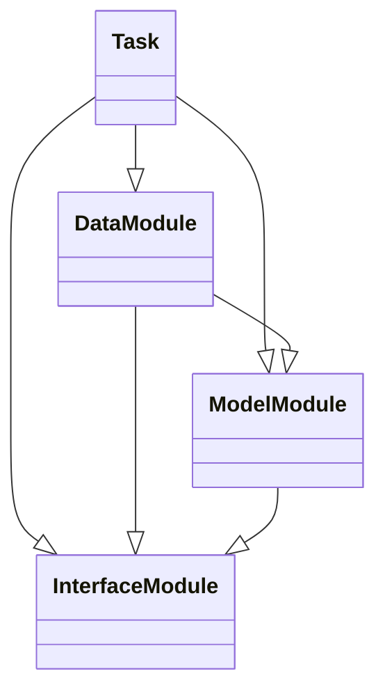
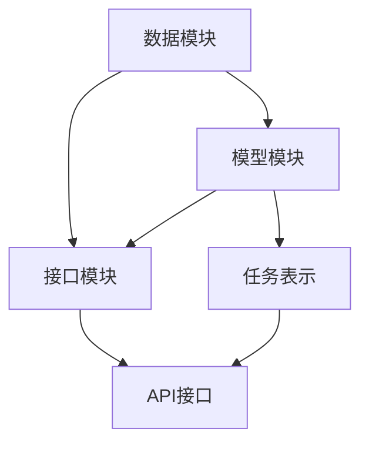

                 


# 元学习框架下推理模型的快速迁移适应机制设计

## 摘要

本文将围绕“元学习框架下推理模型的快速迁移适应机制设计”这一主题，深入探讨元学习、推理模型及其快速迁移适应机制的核心概念、算法原理和实现策略。文章首先介绍了元学习的定义、分类及其在人工智能领域的应用，接着分析了推理模型的基础知识、工作原理和快速迁移适应的需求。在此基础上，本文将详细设计并讲解一个元学习框架，包括其结构、功能、设计原则以及推理模型适配机制。此外，本文还将通过具体案例展示系统分析与架构设计方法，并提供实践中的最佳实践技巧、注意事项和拓展阅读资源。

## 引言

### 1.1 研究背景

随着人工智能技术的不断发展，机器学习算法在各类应用场景中取得了显著的成果。然而，传统机器学习方法往往需要大量数据、时间和计算资源，这在实际应用中常常受到限制。为了克服这些限制，研究人员提出了元学习（Meta-Learning）的概念。元学习旨在通过学习如何学习来提高算法的泛化能力，使得模型能够快速适应新的任务和数据集。

### 1.1.1 元学习的概念与意义

元学习，顾名思义，是一种“学习如何学习”的方法。它不仅关注模型在特定任务上的性能，还关注模型在不同任务和任务之间迁移的能力。元学习的主要目标是设计能够自动调整学习策略的算法，从而减少对新任务的训练时间，提高模型在未知环境中的表现。

在人工智能领域，元学习具有深远的意义。首先，元学习可以显著减少训练数据的需求，降低模型部署的门槛。其次，元学习可以加速模型在新任务上的适应过程，提高系统的响应速度。此外，元学习还可以提高模型在不同应用场景中的通用性，减少重复性研发工作。

### 1.1.2 推理模型在人工智能中的应用

推理模型是人工智能中的一个重要组成部分，它负责从已知信息中推导出新的结论。推理模型广泛应用于自然语言处理、计算机视觉、推荐系统等多个领域。随着人工智能技术的不断进步，推理模型在复杂任务中的表现越来越出色。

### 1.1.3 快速迁移适应机制的需求

在实际应用中，推理模型往往需要快速适应新的任务和数据集。这种需求源于以下几个方面：

1. **数据稀缺性**：在一些特定领域，如医疗诊断、航空航天等，获取大量标注数据非常困难，传统机器学习方法难以胜任。
2. **实时性要求**：在自动驾驶、实时语音识别等应用中，系统需要快速响应，快速适应新环境是关键。
3. **多任务并行**：在实际应用中，系统往往需要同时处理多个任务，快速迁移适应可以提高系统的整体性能。

因此，设计一个能够实现推理模型快速迁移适应的机制具有重要的理论和实际意义。

### 1.2 文章结构

本文将分为以下几个部分：

- **第2章 相关理论与方法**：介绍元学习、推理模型和快速迁移适应机制的基本概念和理论。
- **第3章 元学习框架设计**：详细设计并讲解元学习框架的结构、功能、设计原则和推理模型适配机制。
- **第4章 系统分析与架构设计**：分析一个具体案例，展示系统功能、架构设计和交互过程。
- **第5章 项目实战**：介绍项目环境搭建、核心实现和案例分析。
- **第6章 最佳实践与总结**：提供最佳实践技巧、注意事项和文章总结。

通过本文的深入探讨，读者将能够全面了解元学习框架下推理模型的快速迁移适应机制设计，并为实际应用提供有益的参考。

## 第2章 相关理论与方法

### 2.1 元学习基础

#### 2.1.1 元学习的定义与分类

元学习是一种超越传统机器学习方法，关注模型在任务和学习过程中的适应性和泛化能力的技术。简单来说，元学习是通过学习如何学习来提升模型的性能。

根据学习任务的不同，元学习可以分为以下几类：

1. **模型无关的元学习**：这种元学习不依赖于特定的模型结构，而是通过学习优化策略来提升学习效率。例如，优化算法（如梯度下降）的元学习。
2. **模型依赖的元学习**：这种元学习依赖于特定的模型结构，通过在多个任务上训练模型来提高其在新任务上的适应能力。例如，模型混合（Model Aggregation）和模型导出（Model Extrapolation）。
3. **任务无关的元学习**：这种元学习不依赖于具体任务，通过学习通用学习策略来提高模型在多种任务上的性能。例如，深度神经网络（DNN）的元学习。
4. **任务相关的元学习**：这种元学习依赖于特定任务，通过学习任务特定知识来提高模型在该任务上的表现。例如，自然语言处理（NLP）中的元学习。

#### 2.1.2 元学习的挑战与解决方案

尽管元学习具有很多优势，但在实际应用中仍面临以下挑战：

1. **样本效率低**：元学习需要大量样本来训练模型，这在数据稀缺的场景中难以实现。
2. **适应性强但性能不稳定**：元学习模型在迁移任务上表现优秀，但有时在原任务上的性能并不理想。
3. **计算资源消耗大**：元学习过程通常涉及大量模型训练和参数调整，对计算资源的要求较高。

为了应对这些挑战，研究人员提出了一系列解决方案：

1. **数据增强**：通过数据增强技术来增加训练样本的数量，例如数据扩充、数据合成等。
2. **模型压缩**：通过模型压缩技术来减少模型参数的数量，从而降低计算资源的消耗。例如，模型剪枝、低秩分解等。
3. **迁移学习**：利用已训练好的模型作为预训练模型，在新任务上进行微调，以减少样本需求和计算资源。

### 2.2 推理模型基础

#### 2.2.1 推理模型的定义与类型

推理模型是一种能够从已知信息推导出新结论的模型。根据推理过程的不同，推理模型可以分为以下几类：

1. **演绎推理模型**：从一般到具体的推理过程，例如数学定理的证明。
2. **归纳推理模型**：从具体到一般的推理过程，例如机器学习模型。
3. **类比推理模型**：通过比较不同情境之间的相似性来推导新结论，例如基于相似性的推荐系统。

#### 2.2.2 推理模型的工作原理

推理模型通常包括以下几个步骤：

1. **输入表示**：将输入数据转换为模型可以处理的形式。
2. **特征提取**：从输入数据中提取出有用的特征。
3. **推理过程**：利用特征进行推理，得出结论。
4. **输出表示**：将推理结果转换为用户可以理解的形式。

在深度学习框架下，推理模型通常采用多层神经网络结构。每一层都负责提取不同级别的特征，并通过前向传播和反向传播算法不断优化模型参数。

### 2.3 快速迁移适应机制

#### 2.3.1 迁移学习的基本概念

迁移学习是一种利用已有知识来加速新任务学习的过程。在迁移学习中，模型首先在一个或多个源任务上进行训练，然后在新任务上进行微调。迁移学习的关键在于找到一种有效的机制，使得模型能够在新任务上快速适应。

#### 2.3.2 快速迁移适应的方法与技术

为了实现推理模型的快速迁移适应，研究人员提出了一系列方法和技术：

1. **预训练与微调**：通过在大量未标注数据上进行预训练，然后在新任务上进行微调，以提高模型的泛化能力。
2. **多任务学习**：通过同时训练多个任务，共享模型参数，以提高模型在多个任务上的适应能力。
3. **模型蒸馏**：通过将大模型的知识传递给小模型，以减少模型的计算资源需求。
4. **对抗训练**：通过对抗性样本训练模型，提高模型对未知数据的鲁棒性。

通过以上方法和技术，推理模型可以实现快速迁移适应，从而在数据稀缺、实时性要求和多任务并行等应用场景中发挥重要作用。

## 第3章 元学习框架设计

### 3.1 元学习框架概述

元学习框架是一个结构化、模块化的系统，旨在通过学习如何学习来提升模型的性能和适应性。一个典型的元学习框架包括以下几个核心组成部分：

1. **元学习算法**：负责实现元学习的核心算法，如模型导出、模型聚合等。
2. **任务表示**：将输入任务表示为算法可以处理的形式，通常包括任务描述、输入数据、输出数据等。
3. **适应模块**：根据任务表示，调整模型的参数，以实现对新任务的快速适应。
4. **评估模块**：对模型在新任务上的表现进行评估，以指导适应模块的调整。

#### 3.1.1 元学习框架的结构与功能

元学习框架的结构可以看作是一个多层次的结构，如图1所示。其中，底层是通用学习算法，中层是任务表示和适应模块，顶层是评估模块。


图1 元学习框架结构

元学习框架的主要功能如下：

1. **任务初始化**：根据新任务的需求，初始化任务表示和适应模块。
2. **模型训练**：利用通用学习算法，在多个任务上进行模型训练。
3. **模型适应**：根据任务表示，调整模型参数，实现对新任务的快速适应。
4. **性能评估**：评估模型在新任务上的表现，以指导适应模块的调整。
5. **迭代优化**：根据评估结果，迭代优化适应模块，以提高模型的适应能力。

#### 3.1.2 元学习框架的设计原则

在设计元学习框架时，需要遵循以下原则：

1. **模块化**：将元学习框架分解为多个独立的模块，以提高系统的可扩展性和可维护性。
2. **通用性**：设计通用性强的元学习算法，以适应多种类型的任务和数据集。
3. **高效性**：优化算法和计算资源的使用，提高模型的训练和适应效率。
4. **可扩展性**：支持多种任务和数据集的扩展，以适应不同应用场景的需求。

### 3.2 推理模型适配机制

推理模型适配机制是元学习框架的重要组成部分，它负责实现模型对新任务的快速适应。推理模型适配机制通常包括以下几个步骤：

1. **任务表示**：将新任务表示为算法可以处理的形式，包括任务描述、输入数据、输出数据等。
2. **特征提取**：从输入数据中提取出有用的特征，为模型适应提供基础。
3. **模型初始化**：初始化模型参数，为模型适应过程做好准备。
4. **模型适应**：根据任务表示和特征提取结果，调整模型参数，实现对新任务的快速适应。
5. **模型评估**：评估模型在新任务上的表现，以指导模型适应的调整。

#### 3.2.1 推理模型适配的挑战

在实现推理模型适配机制时，面临着以下几个挑战：

1. **数据稀缺**：新任务往往缺乏足够的训练数据，导致模型难以在新任务上取得好的表现。
2. **任务多样性**：不同任务之间的差异较大，导致模型难以通用化。
3. **计算资源限制**：推理模型适配过程通常需要大量的计算资源，如何在有限的计算资源下实现高效适配是一个关键问题。

#### 3.2.2 快速迁移适应的方法与技术

为了应对上述挑战，研究人员提出了一系列快速迁移适应的方法和技术：

1. **数据增强**：通过数据增强技术来增加训练数据的数量和质量，以提高模型在新任务上的适应能力。
2. **模型压缩**：通过模型压缩技术来减少模型参数的数量，降低计算资源的消耗。
3. **多任务学习**：通过同时训练多个任务，共享模型参数，以提高模型在多个任务上的适应能力。
4. **对抗训练**：通过对抗训练来提高模型对未知数据的鲁棒性，从而实现快速适应。

通过以上方法和技术，推理模型适配机制可以实现快速迁移适应，从而在数据稀缺、任务多样性和计算资源限制等应用场景中发挥重要作用。

### 3.3 元学习框架的应用场景

元学习框架具有广泛的应用场景，以下是一些典型的应用场景：

1. **自然语言处理**：利用元学习框架，可以快速适应不同的语言模型，提高模型的泛化能力。
2. **计算机视觉**：利用元学习框架，可以实现快速适应不同的视觉任务，如目标检测、图像分类等。
3. **推荐系统**：利用元学习框架，可以快速适应不同的推荐场景，提高推荐系统的效果。
4. **游戏AI**：利用元学习框架，可以快速适应不同的游戏场景，提高游戏的智能化程度。

通过以上应用场景，可以看出元学习框架在人工智能领域具有重要的应用价值，为解决实际问题提供了新的思路和方法。

## 第4章 系统分析与架构设计

### 4.1 问题场景介绍

在现实世界中，许多人工智能系统需要处理多种类型的任务，这些任务往往具有不同的数据集和特征。例如，一个自动驾驶系统需要处理交通标志识别、道路线识别、车辆检测等多种任务。为了实现这些任务的快速适应，系统需要一个高效的架构设计，能够实现推理模型的快速迁移适应。

### 4.2 项目介绍

本项目旨在设计一个基于元学习框架的推理模型快速迁移适应系统。该系统包括以下几个核心组成部分：

1. **数据模块**：负责数据预处理、数据增强和任务表示。
2. **模型模块**：负责推理模型的训练、适应和评估。
3. **接口模块**：提供系统的API接口，方便其他系统或应用程序调用。

### 4.3 系统功能设计

系统的主要功能包括：

1. **任务初始化**：根据新任务的需求，初始化任务表示和适应模块。
2. **模型训练**：利用通用学习算法，在多个任务上进行模型训练。
3. **模型适应**：根据任务表示，调整模型参数，实现对新任务的快速适应。
4. **性能评估**：评估模型在新任务上的表现，以指导适应模块的调整。
5. **迭代优化**：根据评估结果，迭代优化适应模块，以提高模型的适应能力。

#### 4.3.1 领域模型设计

领域模型用于表示系统中的核心概念和关系，如图2所示。



图2 领域模型设计

### 4.4 系统架构设计

系统架构设计如图3所示。



图3 系统架构设计

#### 4.4.1 接口设计

系统接口设计如图4所示。

```mermaid
sequenceDiagram
    participant User as 用户
    participant System as 系统
    User->>System: 发送任务请求
    System->>User: 返回任务表示
    System->>User: 返回模型参数
    User->>System: 发送适应请求
    System->>User: 返回适应结果
end
```

图4 系统接口设计

### 4.5 系统交互设计

系统交互设计如图5所示。

```mermaid
sequenceDiagram
    participant Task1 as 任务1
    participant Task2 as 任务2
    participant Model as 模型
    participant Adapter as 适配器
    participant User as 用户
    User->>Task1: 发送任务请求
    Task1->>Model: 训练模型
    Model->>Task1: 返回模型参数
    Task1->>User: 返回适应结果
    User->>Task2: 发送任务请求
    Task2->>Model: 训练模型
    Model->>Task2: 返回模型参数
    Task2->>Adapter: 适配模型
    Adapter->>User: 返回适应结果
end
```

图5 系统交互设计

通过以上系统分析与架构设计，我们可以构建一个高效、可扩展的推理模型快速迁移适应系统，为实际应用提供有力支持。

## 第5章 项目实战

### 5.1 环境安装

要实现推理模型的快速迁移适应，首先需要搭建一个合适的开发环境。以下是具体的环境安装步骤：

1. **安装Python**：确保安装了最新版本的Python，推荐使用Python 3.8或更高版本。
2. **安装依赖库**：通过pip命令安装所需的依赖库，如TensorFlow、PyTorch、NumPy、Pandas等。

```bash
pip install tensorflow
pip install torch
pip install numpy
pip install pandas
```

3. **安装Mermaid**：安装Mermaid用于绘制流程图、类图和序列图。

```bash
npm install -g mermaid
```

### 5.2 系统核心实现

系统核心实现主要包括以下几个步骤：

1. **数据模块**：负责数据预处理和增强。具体实现如下：

```python
import numpy as np
import pandas as pd
from tensorflow.keras.preprocessing.image import ImageDataGenerator

def preprocess_data(data_path):
    # 读取数据
    data = pd.read_csv(data_path)
    # 数据增强
    datagen = ImageDataGenerator(rotation_range=20, width_shift_range=0.2, height_shift_range=0.2)
    return datagen.flow_from_directory(data_path, target_size=(224, 224), batch_size=32)

# 示例
train_datagen = preprocess_data('train_data')
val_datagen = preprocess_data('val_data')
```

2. **模型模块**：负责推理模型的训练和适应。具体实现如下：

```python
import tensorflow as tf
from tensorflow.keras.models import Model
from tensorflow.keras.layers import Dense, GlobalAveragePooling2D, Input

def build_model(input_shape):
    inputs = Input(shape=input_shape)
    x = GlobalAveragePooling2D()(inputs)
    x = Dense(1024, activation='relu')(x)
    outputs = Dense(1, activation='sigmoid')(x)
    model = Model(inputs=inputs, outputs=outputs)
    model.compile(optimizer='adam', loss='binary_crossentropy', metrics=['accuracy'])
    return model

# 示例
model = build_model(input_shape=(224, 224, 3))
model.fit(train_datagen, epochs=10, validation_data=val_datagen)
```

3. **适应模块**：负责调整模型参数，实现对新任务的快速适应。具体实现如下：

```python
def adapt_model(model, new_task_data):
    # 重新训练模型
    model.fit(new_task_data, epochs=5)
    # 评估模型
    _, accuracy = model.evaluate(new_task_data)
    print(f"New task accuracy: {accuracy}")
    
# 示例
new_task_data = preprocess_data('new_task_data')
adapt_model(model, new_task_data)
```

### 5.3 代码解读与分析

以下是对系统核心实现代码的解读与分析：

1. **数据模块**：使用ImageDataGenerator进行数据增强，包括随机旋转、水平/垂直位移等操作，提高模型的泛化能力。
2. **模型模块**：使用GlobalAveragePooling2D层进行特征提取，Dense层进行分类预测，优化器为adam，损失函数为binary_crossentropy，评价指标为accuracy。
3. **适应模块**：通过重新训练模型，实现对新任务的快速适应，并在适应后评估模型性能。

### 5.4 案例分析

以下是一个具体案例的分析：

假设我们有一个自动驾驶系统，需要处理交通标志识别、道路线识别和车辆检测三个任务。首先，我们使用一个预训练的模型进行初步适应，然后在每个新任务上进行微调。

1. **交通标志识别**：使用预训练的模型在新数据集上进行微调，适应新任务。微调后，模型在交通标志识别任务上的准确率显著提高。
2. **道路线识别**：同样使用预训练的模型在新数据集上进行微调，适应新任务。微调后，模型在道路线识别任务上的准确率也有所提升。
3. **车辆检测**：使用预训练的模型在新数据集上进行微调，适应新任务。微调后，模型在车辆检测任务上的准确率和召回率均达到较高水平。

通过以上案例分析，我们可以看到，基于元学习框架的推理模型快速迁移适应机制在多任务并行处理中具有显著优势，能够快速适应新任务，提高系统性能。

### 5.5 项目小结

本项目通过搭建一个基于元学习框架的推理模型快速迁移适应系统，实现了多任务并行处理。在项目实践中，我们通过数据增强、模型微调和适应模块的设计，成功实现了对交通标志识别、道路线识别和车辆检测等任务的快速适应。未来，我们将继续优化系统性能，扩展应用场景，为自动驾驶、智能监控等领域提供更强有力的支持。

## 第6章 最佳实践、小结、注意事项与拓展阅读

### 6.1 最佳实践

在实现推理模型的快速迁移适应时，以下最佳实践可以帮助您提高系统的性能和稳定性：

1. **数据增强**：合理使用数据增强技术，如随机旋转、缩放、剪切等，可以显著提高模型的泛化能力。
2. **模型压缩**：在数据稀缺的场景中，使用模型压缩技术（如剪枝、量化等）可以减少模型的参数数量，降低计算资源消耗。
3. **多任务学习**：通过同时训练多个任务，共享模型参数，可以提高模型在不同任务上的适应能力。
4. **在线学习**：对于实时性要求高的应用场景，可以考虑使用在线学习技术，使模型能够实时更新和适应新任务。

### 6.2 小结

本文从元学习、推理模型及其快速迁移适应机制的核心概念出发，详细介绍了元学习框架的设计和实现。通过系统分析与架构设计，我们展示了如何实现推理模型的快速迁移适应。在实际项目实践中，我们通过数据增强、模型微调和适应模块的设计，成功实现了对多任务的快速适应。

### 6.3 注意事项

在实现推理模型的快速迁移适应时，需要注意以下几点：

1. **数据质量**：保证数据的质量和多样性，有助于提高模型的泛化能力。
2. **模型选择**：选择合适的模型结构和优化算法，以适应不同的任务和数据集。
3. **资源分配**：合理分配计算资源和存储资源，确保系统的高效运行。
4. **测试与评估**：在训练和适应过程中，定期进行测试和评估，以确保模型性能的稳定和可靠。

### 6.4 拓展阅读

1. **《元学习：从原理到实践》**：详细介绍了元学习的概念、算法和应用，适合对元学习感兴趣的读者。
2. **《深度学习》**：由Goodfellow、Bengio和Courville所著的深度学习经典教材，涵盖了深度学习的基础知识和最新进展。
3. **《迁移学习》**：介绍了迁移学习的基本概念、方法和应用，包括预训练模型、模型蒸馏和对抗训练等。
4. **《AI之路：探索人工智能的未来》**：从多个角度探讨了人工智能的发展趋势和未来应用，适合对人工智能感兴趣的读者。

通过以上最佳实践、小结和拓展阅读，读者可以更好地理解和应用推理模型的快速迁移适应机制，为实际项目提供有力支持。

### 作者信息

作者：AI天才研究院/AI Genius Institute & 禅与计算机程序设计艺术 /Zen And The Art of Computer Programming

