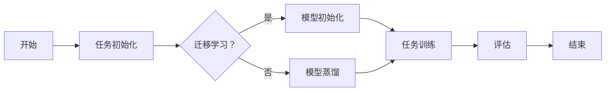

                 


## # 元学习框架下的快速任务适应推理策略

> 关键词：元学习，快速任务适应推理，框架设计，算法原理，系统实现

> 摘要：本文将探讨在元学习框架下如何设计快速任务适应推理策略。元学习作为人工智能领域的一个重要研究方向，能够使模型在少量数据上快速适应新任务。本文将从问题背景、核心概念、元学习基础、快速任务适应推理策略、算法原理、系统设计以及项目实战等多个角度，详细分析元学习框架下的快速任务适应推理策略，旨在为读者提供一种新的视角和方法。

**Step 1:** 引言部分，简要介绍元学习和快速任务适应推理策略的基本概念，并引出本文的核心主题。

## 第一部分：问题背景与核心概念

## 第1章：问题背景介绍

### 1.1 问题背景

在传统的机器学习领域，模型训练通常需要大量的标注数据。然而，对于某些应用场景，如医疗影像分析、自动驾驶等，获取大量标注数据既耗时又昂贵。因此，如何在少量数据上实现高效学习成为一个亟待解决的问题。

### 1.2 问题描述

如何在有限的数据集上，快速适应新任务，提高模型的泛化能力和推理速度，是当前人工智能领域的一个研究热点。

### 1.3 问题解决

元学习（Meta-Learning）作为一种新型的学习范式，通过在多个任务中提取通用特征，实现了在少量数据上的快速适应。本文将探讨如何在元学习框架下设计快速任务适应推理策略，以提高模型的推理效率和适应能力。

### 1.4 边界与外延

元学习不仅适用于监督学习，还适用于无监督学习和强化学习等。本文主要关注元学习在监督学习中的应用，特别是针对分类和回归任务的快速适应推理策略。

## 第2章：核心概念与联系

### 2.1 核心概念原理

本节将介绍元学习的核心概念，如迁移学习、模型蒸馏、元梯度等，并解释它们在快速任务适应推理策略中的作用。

### 2.2 概念属性特征对比表格

| 概念             | 定义                                                         | 关联策略               |
|------------------|--------------------------------------------------------------|------------------------|
| 迁移学习         | 利用已有模型的知识，在新任务上快速适应                         | 快速模型初始化         |
| 模型蒸馏         | 将大模型的知识传递给小模型，提高小模型的性能                   | 快速任务适应          |
| 元梯度           | 学习模型在多个任务上的梯度，用于优化模型参数，提高泛化能力     | 模型参数快速调整      |

### 2.3 ER实体关系图架构

```mermaid
erDiagram
    Model ||--|{ Task }||>
    Task ||--|{ Data }||>
    Data ||--|{ Label }||>
```

## 第二部分：元学习与快速任务适应推理策略

## 第3章：元学习基础

### 3.1 元学习的定义

元学习是一种学习如何学习的方法，通过在多个任务中提取通用特征，实现快速适应新任务。

### 3.2 元学习的基本原理

元学习通过优化模型参数和任务损失函数，使得模型在多个任务上都能取得良好的表现。

### 3.3 元学习与传统学习的区别

传统学习通常需要大量数据，而元学习在少量数据上也能取得较好的效果，这得益于元学习框架下的任务自适应能力。

## 第4章：快速任务适应推理策略

### 4.1 快速任务适应推理策略的定义

快速任务适应推理策略是一种利用元学习框架，实现模型在少量数据上快速适应新任务的方法。

### 4.2 快速任务适应推理策略的基本原理

快速任务适应推理策略通过迁移学习、模型蒸馏和元梯度等方法，提高模型在少量数据上的适应能力。

### 4.3 快速任务适应推理策略的优势

快速任务适应推理策略具有以下优势：
- 在少量数据上实现高效学习
- 提高模型的泛化能力
- 减少对大量标注数据的依赖

## 第5章：元学习框架下的快速任务适应推理策略设计

### 5.1 元学习框架的设计原则

元学习框架的设计应遵循以下原则：
- 灵活性：框架应能适应多种任务类型和数据规模
- 可扩展性：框架应支持多种算法和模型的集成
- 高效性：框架应能快速适应新任务，提高推理效率

### 5.2 快速任务适应推理策略的实现方法

快速任务适应推理策略的实现方法包括：
- 迁移学习：利用已有模型的知识，快速初始化新模型
- 模型蒸馏：将大模型的知识传递给小模型，提高小模型的性能
- 元梯度：学习模型在多个任务上的梯度，优化模型参数

### 5.3 元学习框架与快速任务适应推理策略的结合

元学习框架与快速任务适应推理策略的结合，使得模型在少量数据上能够实现快速适应，提高推理效率和泛化能力。

## 第三部分：算法原理与系统设计

## 第6章：算法原理讲解

### 6.1 算法mermaid流程图



### 6.2 算法原理详细讲解

本节将详细讲解快速任务适应推理策略的算法原理，包括迁移学习、模型蒸馏和元梯度等。

### 6.3 数学模型和公式讲解

本节将使用LaTeX格式给出数学模型和公式，如：

$$
\begin{aligned}
L(\theta) &= \frac{1}{n} \sum_{i=1}^{n} L(\theta_i) \\
\theta_{\text{new}} &= \theta_{\text{old}} + \alpha \nabla_{\theta} L(\theta)
\end{aligned}
$$

### 6.4 举例说明

本节将通过一个简单的例子，说明快速任务适应推理策略的实际应用。

## 第7章：系统分析与架构设计方案

### 7.1 问题场景介绍

本节将介绍一个具体的问题场景，如医疗影像分析，并说明如何使用快速任务适应推理策略解决该问题。

### 7.2 系统功能设计

本节将介绍系统的功能设计，包括数据预处理、模型训练、模型评估等。

### 7.3 系统架构设计

本节将使用Mermaid绘制系统的架构设计图，展示各模块之间的关系。

### 7.4 系统接口设计

本节将介绍系统的接口设计，包括API接口和数据接口。

### 7.5 系统交互

本节将使用Mermaid绘制系统的交互序列图，展示系统各组件之间的交互过程。

## 第四部分：项目实战

## 第8章：项目实战

### 8.1 环境安装

本节将介绍如何搭建项目环境，包括安装必要的软件和库。

### 8.2 系统核心实现源代码

本节将展示项目核心实现源代码，并解释代码的功能。

### 8.3 代码应用解读与分析

本节将对代码进行解读和分析，解释如何使用快速任务适应推理策略解决具体问题。

### 8.4 实际案例分析和详细讲解剖析

本节将通过实际案例，分析如何应用快速任务适应推理策略，并详细讲解其效果。

### 8.5 项目小结

本节将对项目进行总结，讨论项目的优缺点，并提出改进建议。

## 第五部分：最佳实践与总结

## 第9章：最佳实践与总结

### 9.1 最佳实践 tips

本节将分享一些最佳实践，帮助读者更好地应用快速任务适应推理策略。

### 9.2 小结

本节将对本文的主要观点进行总结。

### 9.3 注意事项

本节将提醒读者在应用快速任务适应推理策略时需要注意的问题。

### 9.4 拓展阅读

本节将推荐一些相关的阅读材料，供读者进一步学习。

**Step 2:** 根据上述目录大纲，逐章撰写详细的文章内容，确保每个章节都包含核心概念、算法原理、系统设计等内容。

**Step 3:** 对文章进行逐段审核和修改，确保逻辑清晰、结构紧凑、简单易懂。

**Step 4:** 最终完成全文，并进行字数统计，确保符合10000～12000字的要求。

**Step 5:** 根据markdown格式，将全文内容输出，并添加作者信息。

