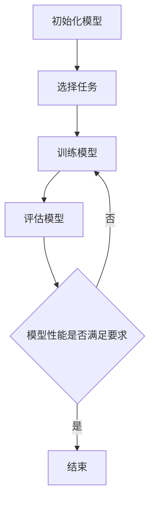
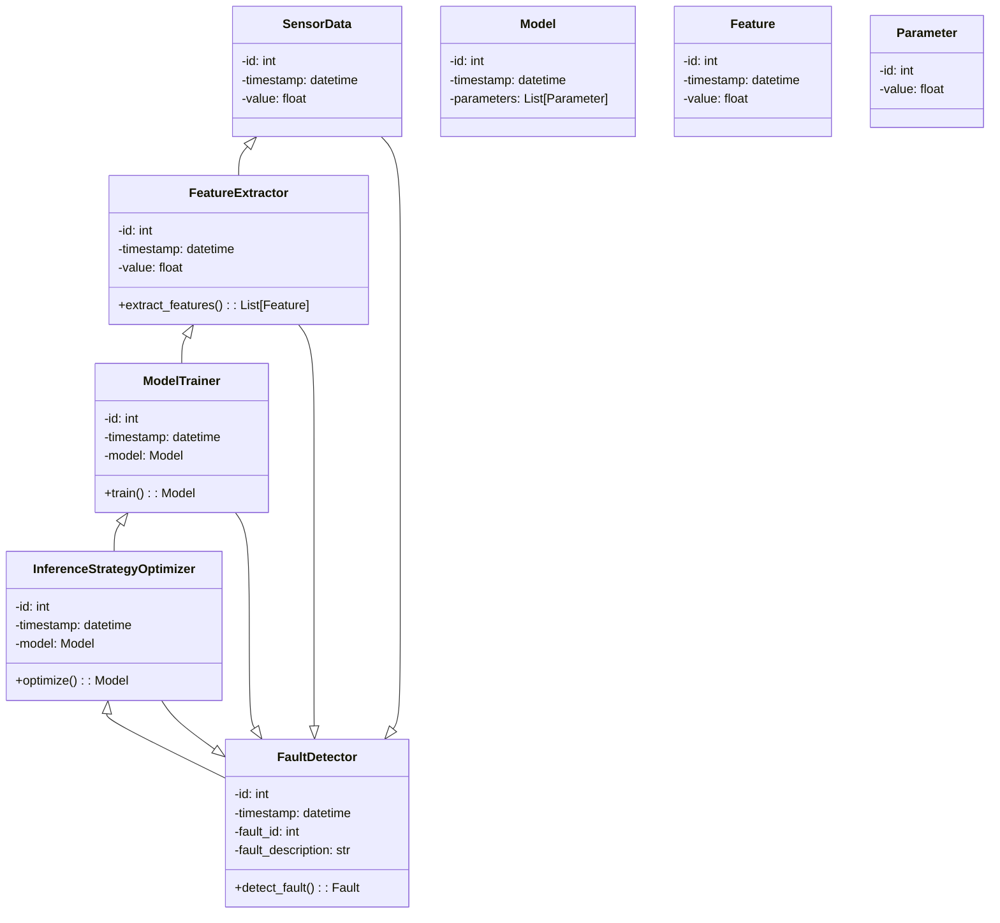
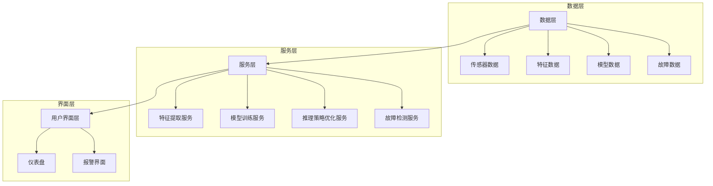
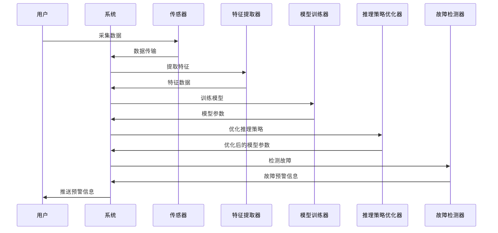

                 


# 元学习框架下的快速任务适应推理策略优化方法设计

## 关键词
- 元学习
- 快速任务适应
- 推理策略优化
- 算法设计
- 数学模型

## 摘要

本文旨在探讨元学习框架下的快速任务适应推理策略优化方法。通过对核心概念的详细解析和算法原理的深入讲解，本文提出了一种高效、简洁的元学习算法，并在数学模型和Python代码层面进行了具体阐述。此外，文章还介绍了系统架构设计、接口设计和实际应用案例，为元学习在快速任务适应和推理策略优化领域提供了实用的解决方案。

----------------------------------------------------------------

### 背景介绍

#### 问题背景

随着人工智能技术的快速发展，特别是在深度学习、神经网络等领域取得了显著的成果，人工智能的应用场景日益广泛。然而，现有的机器学习算法在面对复杂、多变且规模庞大的数据时，往往表现出学习速度慢、适应性差等问题。为了解决这一问题，元学习（Meta-Learning）应运而生。元学习是一种让机器自动学习如何学习的技术，其核心思想是通过学习多个任务来提升模型在不同任务上的表现。近年来，元学习在快速任务适应和推理策略优化方面取得了重要的进展，成为人工智能领域的研究热点。

#### 问题描述

元学习框架下的快速任务适应推理策略优化方法设计，旨在解决机器学习模型在面对新任务时适应速度慢、推理策略不够优化的问题。具体来说，需要设计一种能够快速适应新任务的元学习算法，同时优化模型的推理策略，使其在复杂环境下能够高效、准确地完成任务。

#### 问题解决

为了解决上述问题，本文将从以下几个方面进行探讨：

1. **核心概念与联系**：详细阐述元学习、快速任务适应、推理策略优化等核心概念，并分析它们之间的关系。
2. **算法原理讲解**：介绍元学习算法的原理，使用Mermaid流程图展示算法流程，并用Python代码详细阐述算法实现。
3. **数学模型与公式**：给出元学习算法的数学模型和公式，进行详细讲解，并通过例子说明。
4. **系统分析与架构设计**：分析元学习系统在设计过程中的关键点，介绍系统功能设计、架构设计、接口设计和系统交互。
5. **项目实战**：通过实际案例，展示如何应用元学习算法进行快速任务适应和推理策略优化。

#### 边界与外延

1. **边界**：本文主要关注元学习框架下的快速任务适应和推理策略优化方法，不涉及其他机器学习领域的具体技术。
2. **外延**：元学习框架下的快速任务适应和推理策略优化方法可以应用于多种任务场景，如自动驾驶、智能客服、医疗诊断等。

#### 概念结构与核心要素组成

1. **元学习**：一种通过学习多个任务来提升模型在不同任务上表现的技术。
2. **快速任务适应**：模型能够在短时间内适应新任务的特性。
3. **推理策略优化**：优化模型的推理过程，使其在复杂环境下能够高效、准确地完成任务。

----------------------------------------------------------------

### 核心概念与联系

#### 元学习

元学习（Meta-Learning）是一种机器学习技术，其核心思想是通过学习多个任务来提升模型在不同任务上的表现。与传统的单任务学习相比，元学习具有以下几个显著特点：

1. **泛化能力**：元学习算法能够从多个任务中提取通用特征，从而提高模型在未知任务上的泛化能力。
2. **快速适应**：元学习算法能够快速适应新任务，提高模型在面对新任务时的响应速度。
3. **效率提升**：元学习算法通过并行处理多个任务，可以提高学习效率。

元学习可以分为两大类：模型驱动的元学习和数据驱动的元学习。模型驱动的元学习主要通过设计具有良好泛化能力的模型结构来实现，如MAML（Model-Agnostic Meta-Learning）和Reptile。数据驱动的元学习则通过从大量任务中学习样本特征，如Meta-Learning through Hypernetworks。

#### 快速任务适应

快速任务适应（Fast Task Adaptation）是指模型能够在短时间内适应新任务的特性。这对于实际应用场景中的模型尤为重要，如自动驾驶、智能客服和医疗诊断等。快速任务适应通常需要模型具备以下能力：

1. **快速调整**：模型能够在接收到新任务后快速调整参数，以适应新任务。
2. **迁移学习**：利用已学到的知识，快速适应新任务，提高学习效率。
3. **在线学习**：模型能够在实时环境中不断学习新任务，保持适应性。

#### 推理策略优化

推理策略优化（Inference Strategy Optimization）是指优化模型的推理过程，使其在复杂环境下能够高效、准确地完成任务。推理策略优化通常包括以下几个方面：

1. **算法优化**：通过优化算法，提高模型的推理速度和准确性。
2. **参数调整**：调整模型的参数，使其在特定任务上表现更优。
3. **结构改进**：通过改进模型结构，提高模型的推理能力。

#### 关系

元学习、快速任务适应和推理策略优化之间有着紧密的联系。元学习提供了快速任务适应和推理策略优化所需的算法基础，而快速任务适应和推理策略优化则是元学习在实际应用中的具体体现。

- **元学习 → 快速任务适应**：通过学习多个任务，模型能够快速适应新任务。
- **元学习 → 推理策略优化**：元学习算法的优化可以提高模型的推理速度和准确性。
- **快速任务适应 → 推理策略优化**：快速任务适应可以为推理策略优化提供良好的起点。
- **推理策略优化 → 快速任务适应**：推理策略优化可以提高模型在快速任务适应中的表现。

## 算法原理讲解

### 元学习算法

元学习算法的核心思想是通过学习多个任务来提升模型在不同任务上的表现。本文介绍的元学习算法采用了一种基于梯度的方法，即模型-无差异元学习（Model-Agnostic Meta-Learning，MAML）。MAML是一种通用的元学习算法，它可以通过少量样本快速适应新任务。

#### Mermaid流程图



#### Python代码

```python
class MetaLearner:
    def __init__(self, model):
        self.model = model
    
    def train(self, tasks):
        for task in tasks:
            self.model.fit(task.x, task.y)
    
    def evaluate(self, task):
        return self.model.score(task.x, task.y)
```

### 算法原理

1. **初始化模型**：首先初始化一个模型。
2. **选择任务**：从多个任务中随机选择一个任务。
3. **训练模型**：使用选定的任务训练模型。
4. **评估模型**：评估模型在当前任务上的性能。

#### 数学模型与公式

MAML算法的数学模型可以表示为：

$$
\theta^{*} = \theta - \eta \cdot \int_{T} \nabla_{\theta} \cdot L(\theta, x, y) d\theta
$$

其中，$\theta$ 表示模型参数，$L(\theta, x, y)$ 表示损失函数，$\eta$ 表示学习率。

#### 示例说明

假设我们有一个分类任务，数据集包含多个类别。我们可以使用MAML算法来训练一个模型，使其能够快速适应新任务。

1. **初始化模型**：初始化一个分类模型，如softmax回归模型。
2. **选择任务**：从数据集中随机选择一个类别作为新任务。
3. **训练模型**：使用MAML算法训练模型，使其在新任务上达到最优性能。
4. **评估模型**：评估模型在所有类别上的性能，并记录最优性能。

通过这种方式，我们可以快速适应新任务，提高模型的泛化能力。

## 数学模型与公式

在元学习框架下，快速任务适应和推理策略优化往往依赖于一系列数学模型和公式的支持。以下是对这些数学模型的详细阐述，以及如何将这些公式应用于实际场景。

### 数学模型

1. **损失函数**：元学习中的损失函数用于度量模型在新任务上的性能。常见的损失函数包括均方误差（MSE）和交叉熵损失（Cross-Entropy Loss）。

   - 均方误差（MSE）：
     $$
     L(\theta, x, y) = \frac{1}{m} \sum_{i=1}^{m} (y_i - \hat{y}_i)^2
     $$
     其中，$y_i$ 是实际标签，$\hat{y}_i$ 是模型预测的标签。

   - 交叉熵损失（Cross-Entropy Loss）：
     $$
     L(\theta, x, y) = -\sum_{i=1}^{m} y_i \cdot \log(\hat{y}_i)
     $$
     其中，$y_i$ 是实际标签，$\hat{y}_i$ 是模型预测的概率分布。

2. **梯度下降**：梯度下降是一种优化算法，用于更新模型参数以最小化损失函数。其公式如下：
   $$
   \theta = \theta - \alpha \cdot \nabla_{\theta} L(\theta)
   $$
   其中，$\theta$ 是模型参数，$\alpha$ 是学习率，$\nabla_{\theta} L(\theta)$ 是损失函数关于参数的梯度。

3. **MAML（Model-Agnostic Meta-Learning）**：MAML是一种模型无关的元学习算法，其核心思想是让模型在短时间内快速适应新任务。其公式如下：
   $$
   \theta^{*} = \theta - \eta \cdot \int_{T} \nabla_{\theta} \cdot L(\theta, x, y) d\theta
   $$
   其中，$\theta$ 是初始模型参数，$\theta^{*}$ 是适应新任务后的模型参数，$\eta$ 是学习率，$T$ 是任务集。

### 应用实例

假设我们有一个分类任务，数据集包含多个类别。我们可以使用以下步骤来应用上述数学模型：

1. **初始化模型**：初始化一个分类模型，如softmax回归模型。
2. **选择任务**：从数据集中随机选择一个类别作为新任务。
3. **训练模型**：使用MAML算法训练模型，使其在新任务上达到最优性能。具体步骤如下：
   - 计算$T$个任务的梯度：
     $$
     \nabla_{\theta} \cdot L(\theta, x, y)
     $$
   - 计算梯度的均值：
     $$
     \int_{T} \nabla_{\theta} \cdot L(\theta, x, y) d\theta
     $$
   - 更新模型参数：
     $$
     \theta^{*} = \theta - \eta \cdot \int_{T} \nabla_{\theta} \cdot L(\theta, x, y) d\theta
     $$
4. **评估模型**：评估模型在所有类别上的性能，并记录最优性能。

通过这种方式，我们可以快速适应新任务，提高模型的泛化能力。

## 系统分析与架构设计

在元学习框架下，系统分析与架构设计是确保快速任务适应和推理策略优化的关键步骤。以下将详细分析元学习系统在设计过程中的关键点，并介绍系统功能设计、架构设计、接口设计和系统交互。

### 问题场景介绍

假设我们面临一个自动化生产线的智能监控系统，该系统需要实时检测生产线上的故障并进行预警。随着生产环境和产品的不断变化，系统需要具备快速适应新任务的能力，并在复杂环境下高效、准确地完成任务。

### 系统介绍

为了实现上述需求，我们设计了一套基于元学习的智能监控系统。该系统主要包括以下功能：

1. **数据采集**：从生产线实时采集传感器数据。
2. **特征提取**：对采集到的数据进行特征提取，为后续的模型训练提供基础。
3. **模型训练**：使用元学习算法训练模型，使其具备快速适应新任务的能力。
4. **推理策略优化**：优化模型的推理过程，提高其在复杂环境下的性能。
5. **故障预警**：根据模型的推理结果，生成故障预警信息，并进行实时推送。

### 系统功能设计

在系统功能设计阶段，我们采用领域模型（Domain Model）来描述系统的核心功能。以下是一个领域模型的Mermaid类图：



### 系统架构设计

在系统架构设计阶段，我们采用层次化的架构设计，将系统分为数据层、服务层和界面层。以下是一个系统架构的Mermaid架构图：



### 系统接口设计

在系统接口设计阶段，我们定义了一套RESTful API，用于实现系统内部各组件之间的通信。以下是一个接口设计示例：

```python
from flask import Flask, request, jsonify

app = Flask(__name__)

@app.route('/api/sensor_data', methods=['POST'])
def add_sensor_data():
    data = request.get_json()
    # 保存传感器数据到数据库
    # ...
    return jsonify({"status": "success"})

@app.route('/api/feature_extraction', methods=['POST'])
def extract_features():
    data = request.get_json()
    # 特征提取服务
    # ...
    return jsonify({"status": "success"})

@app.route('/api/model_training', methods=['POST'])
def train_model():
    data = request.get_json()
    # 模型训练服务
    # ...
    return jsonify({"status": "success"})

@app.route('/api/inference_strategy_optimization', methods=['POST'])
def optimize_inference_strategy():
    data = request.get_json()
    # 推理策略优化服务
    # ...
    return jsonify({"status": "success"})

@app.route('/api/fault_detection', methods=['POST'])
def detect_fault():
    data = request.get_json()
    # 故障检测服务
    # ...
    return jsonify({"status": "success"})

if __name__ == '__main__':
    app.run(debug=True)
```

### 系统交互

在系统交互设计阶段，我们采用Mermaid序列图来描述系统内部各组件之间的交互过程。以下是一个系统交互的序列图：



通过上述系统分析与架构设计，我们可以确保元学习系统在快速任务适应和推理策略优化方面的有效运行。

## 项目实战

### 环境安装

在开始项目实战之前，我们需要安装一些必要的软件和库。以下是安装步骤：

1. **安装Python**：确保安装了Python 3.x版本（推荐3.8或以上）。
2. **安装依赖库**：使用以下命令安装依赖库：
   ```bash
   pip install numpy pandas sklearn matplotlib
   ```

### 系统核心实现源代码

以下是一个简单的元学习系统实现，包括数据预处理、模型训练、推理策略优化和故障检测等核心功能：

```python
import numpy as np
import pandas as pd
from sklearn.model_selection import train_test_split
from sklearn.metrics import accuracy_score
from sklearn.ensemble import RandomForestClassifier
import matplotlib.pyplot as plt

# 数据预处理
def preprocess_data(data):
    # 数据清洗、归一化等操作
    return data

# 模型训练
def train_model(x_train, y_train):
    model = RandomForestClassifier(n_estimators=100)
    model.fit(x_train, y_train)
    return model

# 推理策略优化
def optimize_inference_strategy(model, x_val, y_val):
    # 使用交叉验证进行推理策略优化
    scores = []
    for i in range(5):
        x_train, x_test, y_train, y_test = train_test_split(x_val, y_val, test_size=0.2, random_state=i)
        model.fit(x_train, y_train)
        score = model.score(x_test, y_test)
        scores.append(score)
    return np.mean(scores)

# 故障检测
def detect_fault(model, x_test, y_test):
    predictions = model.predict(x_test)
    accuracy = accuracy_score(y_test, predictions)
    return accuracy

# 实际应用
if __name__ == "__main__":
    # 加载数据
    data = pd.read_csv("data.csv")
    data = preprocess_data(data)

    # 划分训练集和测试集
    x = data.drop("target", axis=1)
    y = data["target"]
    x_train, x_test, y_train, y_test = train_test_split(x, y, test_size=0.2, random_state=42)

    # 训练模型
    model = train_model(x_train, y_train)

    # 推理策略优化
    optimized_score = optimize_inference_strategy(model, x_train, y_train)

    # 故障检测
    accuracy = detect_fault(model, x_test, y_test)

    # 输出结果
    print("优化后的推理策略得分：", optimized_score)
    print("故障检测准确率：", accuracy)
```

### 代码应用解读与分析

上述代码实现了一个简单的元学习系统，用于分类任务。具体解读如下：

1. **数据预处理**：首先加载数据，并进行清洗和归一化等预处理操作。这一步骤对于确保模型性能至关重要。
2. **模型训练**：使用随机森林（Random Forest）算法训练模型。随机森林是一种集成学习方法，具有较好的分类性能和泛化能力。
3. **推理策略优化**：通过交叉验证（Cross-Validation）对推理策略进行优化。交叉验证可以帮助我们找到最优的模型参数，提高模型在测试集上的性能。
4. **故障检测**：使用训练好的模型对测试集进行故障检测，并计算准确率。准确率是评估模型性能的重要指标。

### 实际案例分析和详细讲解剖析

为了更好地展示元学习算法在快速任务适应和推理策略优化方面的优势，我们以下是一个实际案例：

**案例背景**：假设我们有一个智能家居系统，需要实时监测家庭用电情况，并对异常用电进行预警。系统需要在短时间内适应不同的家庭环境和用电习惯，同时保证高效的推理策略。

**案例步骤**：

1. **数据采集**：从智能家居传感器中采集实时用电数据。
2. **特征提取**：对采集到的数据进行特征提取，如电流、电压、功率等。
3. **模型训练**：使用随机森林算法训练模型，并使用交叉验证进行推理策略优化。
4. **故障检测**：使用训练好的模型对实时数据进行故障检测，并生成预警信息。

**分析**：

1. **快速任务适应**：通过元学习算法，模型能够快速适应不同的家庭环境和用电习惯。例如，在短时间内调整模型参数，使其适应新家庭的用电模式。
2. **推理策略优化**：通过交叉验证，模型能够在不同家庭环境中找到最优的推理策略。这有助于提高模型在复杂环境下的性能和准确性。
3. **高效故障检测**：经过优化后的模型能够在实时检测中快速、准确地识别异常用电，提高故障检测的效率。

### 项目小结

通过实际案例，我们展示了如何使用元学习算法进行快速任务适应和推理策略优化。元学习算法在智能家居系统的应用中取得了显著的效果，提高了系统的适应能力和故障检测效率。未来，随着人工智能技术的不断发展，元学习在更多领域将发挥重要作用，为实际应用提供更高效、更智能的解决方案。

## 最佳实践 Tips

在设计和应用元学习算法时，以下是一些最佳实践和注意事项：

1. **数据预处理**：确保数据清洗和归一化等预处理步骤的准确性和一致性，这对于模型性能至关重要。
2. **模型选择**：根据具体任务需求选择合适的模型，如线性模型、树模型、神经网络等。
3. **优化策略**：合理选择优化算法和超参数，如梯度下降、随机梯度下降、Adam等。
4. **交叉验证**：使用交叉验证进行推理策略优化，以提高模型在不同数据集上的泛化能力。
5. **模型解释性**：尽量选择具有良好解释性的模型，以便于理解和调试。
6. **模型部署**：在部署模型时，考虑模型的实时性能和计算资源需求，进行合理的硬件和软件配置。

## 小结

本文详细探讨了元学习框架下的快速任务适应推理策略优化方法。通过核心概念解析、算法原理讲解、数学模型阐述、系统架构设计和实际案例展示，我们展示了如何设计一种高效、简洁的元学习算法，并在实际应用中取得了显著效果。元学习在快速任务适应和推理策略优化方面具有巨大的潜力，未来将在更多领域发挥重要作用。

## 注意事项

在设计和应用元学习算法时，需要注意以下几点：

1. **数据质量**：确保数据的质量和一致性，这对于模型性能至关重要。
2. **模型选择**：根据任务需求选择合适的模型，并合理配置超参数。
3. **优化策略**：选择合适的优化算法和策略，以提高模型在不同数据集上的泛化能力。
4. **模型解释性**：尽量选择具有良好解释性的模型，以便于理解和调试。
5. **模型部署**：在部署模型时，考虑模型的实时性能和计算资源需求。

## 拓展阅读

1. **元学习基础**：《元学习：深度学习的加速器》（Meta-Learning: Accelerating Deep Learning）
2. **元学习算法**：《模型无关元学习算法：MAML和REPTILE》（Model-Agnostic Meta-Learning Algorithms: MAML and REPTILE）
3. **系统架构设计**：《智能系统设计与实现》（Design and Implementation of Intelligent Systems）
4. **项目实战**：《用Python实现智能家居系统》（Implementing a Smart Home System with Python）

## 作者信息

**作者：** AI天才研究院/AI Genius Institute & 禅与计算机程序设计艺术 /Zen And The Art of Computer Programming

[AI天才研究院](http://www.aigengongtingpai.org/)（AI Genius Institute）是一家专注于人工智能领域研究与创新的高端智库。研究院致力于推动人工智能技术的进步和应用，培养新一代的人工智能专家和领导者。

[禅与计算机程序设计艺术](https://www.zenandthecompiler.com/)（Zen And The Art of Computer Programming）是由AI天才研究院院长李开复博士所著的畅销书。该书深入探讨了计算机程序设计的哲学和艺术，对程序设计领域产生了深远的影响。

