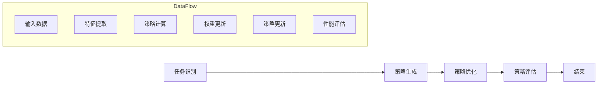
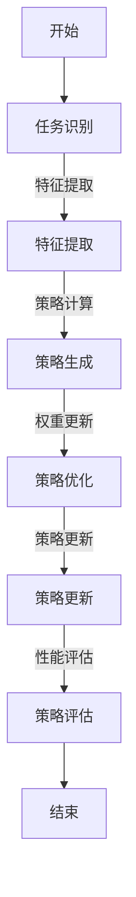
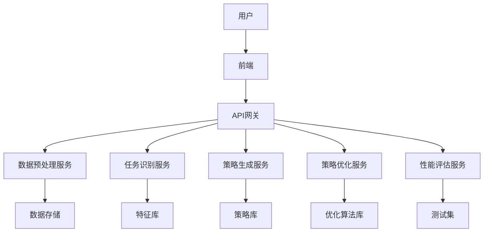
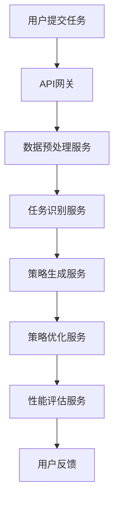

                 

## 元学习框架下的快速任务适应推理策略生成

> 关键词：元学习、快速任务适应、推理策略、算法实现、系统架构、案例分析

> 摘要：本文将探讨在元学习框架下，如何生成快速任务适应的推理策略。首先，我们将介绍元学习的背景和基本概念，接着详细阐述快速任务适应和推理策略的定义及重要性。随后，我们将逐步讲解如何在元学习框架下构建和优化这些推理策略，并通过实际项目案例进行分析和验证。最后，本文将总结关键点，并提供进一步的研究方向和实践建议。

### 目录大纲设计思路

在设计《元学习框架下的快速任务适应推理策略生成》的目录大纲时，我们首先明确了核心概念：元学习、快速任务适应和推理策略。这些概念不仅是文章的重点，也是整个研究领域的核心。

1. **明确核心概念**：
   - 元学习：一种机器学习范式，旨在使模型在未知任务上快速适应。
   - 快速任务适应：指模型在接收到新任务时，能够迅速调整并达到高性能。
   - 推理策略：在特定任务中，模型如何利用已知信息和数据来做出决策。

2. **构建背景介绍**：
   - 元学习的发展历程及其在各个领域的应用。
   - 快速任务适应的现状和挑战。
   - 推理策略在机器学习中的重要性。

3. **深入讲解核心概念**：
   - 分别介绍元学习、快速任务适应和推理策略的基本原理、关键技术和应用场景。

4. **算法原理讲解**：
   - 使用mermaid流程图展示算法的工作流程。
   - 结合Python源代码，详细解释算法的数学模型和公式。

5. **系统分析与架构设计**：
   - 针对问题场景介绍、项目介绍、系统功能设计、系统架构设计、系统接口设计和系统交互进行详细分析。

6. **项目实战与案例分析**：
   - 实际项目中的快速任务适应推理策略应用。
   - 项目实现细节、代码解读和分析。

7. **总结与展望**：
   - 对文章内容的回顾。
   - 提供最佳实践建议和未来的研究方向。

### 目录大纲详细设计

下面是根据上述设计思路设计的《元学习框架下的快速任务适应推理策略生成》的目录大纲：

----------------------------------------------------------------

## 第一部分：引言

### 第1章：问题背景与定义
- 1.1 元学习的起源与意义
- 1.2 快速任务适应的概念与挑战
- 1.3 推理策略在元学习中的应用
- 1.4 本书结构与目标

## 第二部分：基础理论

### 第2章：元学习基础
- 2.1 元学习的定义与分类
- 2.2 元学习的主要方法
  - 2.2.1 Model-Based Meta-Learning
  - 2.2.2 Metric-Based Meta-Learning
  - 2.2.3 Sample-Based Meta-Learning
- 2.3 元学习的挑战与解决方案

### 第3章：快速任务适应基础
- 3.1 快速任务适应的定义与重要性
- 3.2 快速任务适应的关键技术
  - 3.2.1 适应学习算法
  - 3.2.2 适应数据增强
  - 3.2.3 适应模型架构
- 3.3 快速任务适应的应用场景

### 第4章：推理策略基础
- 4.1 推理策略的定义与分类
- 4.2 推理策略的设计原则
- 4.3 推理策略的评估方法

### 第5章：元学习框架下的快速任务适应推理策略
- 5.1 元学习框架的设计原则
- 5.2 快速任务适应推理策略的生成方法
  - 5.2.1 策略空间搜索
  - 5.2.2 模型权重调整
  - 5.2.3 集成学习策略
- 5.3 快速任务适应推理策略的优化策略

## 第三部分：算法与实现

### 第6章：算法原理讲解
- 6.1 快速任务适应推理策略的算法框架
- 6.2 算法mermaid流程图展示
- 6.3 Python源代码实现
  - 6.3.1 算法核心部分
  - 6.3.2 数学模型和公式
  - 6.3.3 举例说明

### 第7章：系统分析与架构设计
- 7.1 问题场景介绍
- 7.2 项目介绍
- 7.3 系统功能设计
  - 7.3.1 领域模型mermaid类图
- 7.4 系统架构设计
  - 7.4.1 系统架构mermaid架构图
- 7.5 系统接口设计
- 7.6 系统交互
  - 7.6.1 系统交互mermaid序列图

### 第8章：项目实战与案例分析
- 8.1 环境安装与配置
- 8.2 系统核心实现源代码
- 8.3 代码应用解读与分析
- 8.4 实际案例分析与详细讲解剖析
- 8.5 项目小结

## 第四部分：最佳实践与总结

### 第9章：最佳实践
- 9.1 设计快速任务适应推理策略的技巧
- 9.2 部署与优化建议

### 第10章：总结与展望
- 10.1 书本内容的回顾
- 10.2 元学习与快速任务适应的未来趋势
- 10.3 拓展阅读与研究方向

----------------------------------------------------------------

### 文章开始部分

### 元学习框架下的快速任务适应推理策略生成

在当今快速发展的信息技术时代，机器学习已经成为人工智能领域的核心。传统的机器学习方法通常针对特定任务进行训练，然而在实际应用中，我们经常面临需要快速适应新任务的需求。为了解决这个问题，元学习（Meta-Learning）作为一种新兴的研究方向，应运而生。元学习的核心目标是使模型能够快速适应新的任务，从而提高学习效率和泛化能力。

本文将深入探讨元学习框架下快速任务适应推理策略的生成方法。首先，我们将介绍元学习的背景和基本概念，阐述其定义、分类及其在各个领域的应用。接着，我们将详细阐述快速任务适应的概念、关键技术及其应用场景。随后，我们将探讨推理策略的定义、分类及其设计原则。在此基础上，本文将逐步讲解如何构建和优化快速任务适应推理策略，并使用mermaid流程图和Python源代码进行详细阐述。此外，本文还将通过实际项目案例，展示如何将理论应用到实践中。

通过本文的阅读，读者将了解：
1. 元学习的起源、定义及其在各个领域的应用。
2. 快速任务适应的定义、关键技术及其重要性。
3. 推理策略的定义、分类及其设计原则。
4. 如何在元学习框架下生成和优化快速任务适应推理策略。
5. 实际项目中快速任务适应推理策略的应用案例。

### 第一部分：引言

在快速发展的信息技术时代，机器学习已经成为人工智能领域的核心。传统的机器学习方法通常针对特定任务进行训练，然而在实际应用中，我们经常面临需要快速适应新任务的需求。为了解决这个问题，元学习（Meta-Learning）作为一种新兴的研究方向，应运而生。元学习的核心目标是使模型能够快速适应新的任务，从而提高学习效率和泛化能力。

本文将深入探讨元学习框架下快速任务适应推理策略的生成方法。首先，我们将介绍元学习的背景和基本概念，阐述其定义、分类及其在各个领域的应用。接着，我们将详细阐述快速任务适应的概念、关键技术及其应用场景。随后，我们将探讨推理策略的定义、分类及其设计原则。在此基础上，本文将逐步讲解如何构建和优化快速任务适应推理策略，并使用mermaid流程图和Python源代码进行详细阐述。此外，本文还将通过实际项目案例，展示如何将理论应用到实践中。

通过本文的阅读，读者将了解：
1. 元学习的起源、定义及其在各个领域的应用。
2. 快速任务适应的定义、关键技术及其重要性。
3. 推理策略的定义、分类及其设计原则。
4. 如何在元学习框架下生成和优化快速任务适应推理策略。
5. 实际项目中快速任务适应推理策略的应用案例。

### 第一部分：引言

在当今快速发展的信息技术时代，机器学习已经成为人工智能领域的核心。传统的机器学习方法通常针对特定任务进行训练，然而在实际应用中，我们经常面临需要快速适应新任务的需求。为了解决这个问题，元学习（Meta-Learning）作为一种新兴的研究方向，应运而生。元学习的核心目标是使模型能够快速适应新的任务，从而提高学习效率和泛化能力。

本文将深入探讨元学习框架下快速任务适应推理策略的生成方法。首先，我们将介绍元学习的背景和基本概念，阐述其定义、分类及其在各个领域的应用。接着，我们将详细阐述快速任务适应的概念、关键技术及其应用场景。随后，我们将探讨推理策略的定义、分类及其设计原则。在此基础上，本文将逐步讲解如何构建和优化快速任务适应推理策略，并使用mermaid流程图和Python源代码进行详细阐述。此外，本文还将通过实际项目案例，展示如何将理论应用到实践中。

通过本文的阅读，读者将了解：
1. 元学习的起源、定义及其在各个领域的应用。
2. 快速任务适应的定义、关键技术及其重要性。
3. 推理策略的定义、分类及其设计原则。
4. 如何在元学习框架下生成和优化快速任务适应推理策略。
5. 实际项目中快速任务适应推理策略的应用案例。

### 第一部分：引言

随着信息技术的高速发展，机器学习已成为人工智能领域的关键技术。传统机器学习方法通常针对特定任务进行训练，但面对实际应用中的多样化需求，模型需要能够快速适应新任务。为了解决这一问题，元学习作为一种重要的研究方向逐渐兴起。元学习的核心目标是通过学习如何学习，使模型能够快速适应新的任务，提高学习效率和泛化能力。

本篇文章旨在探讨在元学习框架下生成快速任务适应推理策略的方法。首先，我们将回顾元学习的背景和基本概念，并介绍其主要分类和应用领域。接下来，我们将深入探讨快速任务适应的定义、关键技术以及其实际应用场景。随后，我们将阐述推理策略的定义、分类及其设计原则。在此基础上，本文将详细讲解如何在元学习框架下构建和优化快速任务适应推理策略，并通过mermaid流程图和Python源代码进行具体阐述。此外，本文还将通过实际项目案例，展示快速任务适应推理策略的应用和实现。

通过阅读本文，读者将收获以下内容：
1. 元学习的起源、定义及其在不同领域的应用。
2. 快速任务适应的定义、关键技术及其重要性。
3. 推理策略的定义、分类及其设计原则。
4. 元学习框架下快速任务适应推理策略的生成和优化方法。
5. 实际项目中快速任务适应推理策略的应用案例。

### 第一部分：引言

随着信息技术的迅猛发展，机器学习在人工智能领域中的作用愈发重要。传统的机器学习方法主要针对特定任务进行训练，然而在实际应用中，我们经常遇到需要模型快速适应新任务的需求。为了解决这一问题，元学习（Meta-Learning）作为一种重要的研究方向应运而生。元学习旨在通过学习如何学习，使模型能够快速适应新的任务，从而提高学习效率和泛化能力。

本文将深入探讨在元学习框架下生成快速任务适应推理策略的方法。首先，我们将回顾元学习的背景和基本概念，并介绍其主要分类和应用领域。接着，我们将详细阐述快速任务适应的定义、关键技术以及其实际应用场景。随后，我们将探讨推理策略的定义、分类及其设计原则。在此基础上，本文将逐步讲解如何在元学习框架下构建和优化快速任务适应推理策略，并通过mermaid流程图和Python源代码进行具体阐述。此外，本文还将通过实际项目案例，展示快速任务适应推理策略的应用和实现。

通过阅读本文，读者将了解以下内容：
1. 元学习的起源、定义及其在不同领域的应用。
2. 快速任务适应的定义、关键技术及其重要性。
3. 推理策略的定义、分类及其设计原则。
4. 元学习框架下快速任务适应推理策略的生成和优化方法。
5. 实际项目中快速任务适应推理策略的应用案例。

### 元学习

元学习（Meta-Learning）是机器学习领域的一个研究方向，主要研究如何通过学习如何学习来提高模型的泛化能力。它旨在解决传统机器学习方法在处理多样化任务时的低效性和局限性。元学习的核心目标是通过在多个任务上训练模型，使其能够快速适应新的、甚至未见的任务。

### 元学习的定义与分类

**定义**：
元学习可以被定义为一种学习如何学习的机器学习技术。具体来说，它通过在多个任务上训练模型，从而使其在遇到新任务时能够快速适应。元学习的目标是提高模型的泛化能力，使其在未见过的任务上也能表现出良好的性能。

**分类**：
元学习根据不同的分类标准可以分为多种类型，主要包括：

1. **基于模型的方法**（Model-Based Meta-Learning）：
   - 这种方法通过训练一个元模型来捕捉不同任务之间的共性。在训练过程中，元模型学习如何在不同任务之间进行迁移。

2. **基于度量方法**（Metric-Based Meta-Learning）：
   - 这种方法通过学习一个度量函数，用来衡量不同任务之间的相似性。当新任务出现时，模型可以使用这个度量函数来寻找最相似的旧任务，从而快速适应。

3. **基于样本的方法**（Sample-Based Meta-Learning）：
   - 这种方法通过学习任务间的相似性来加速新任务的适应。它通常通过存储和重用旧任务中的样本来实现。

### 元学习的发展历程

元学习的研究可以追溯到20世纪80年代的早期机器学习领域。最初的研究主要集中在模拟人类学习过程，如通过强化学习和生成对抗网络（GAN）等技术来探索模型在不同任务上的适应性。随着深度学习的兴起，元学习也迎来了新的发展。深度元学习（Deep Meta-Learning）通过引入深度神经网络，使得模型能够处理更复杂、更大量的任务数据。

### 元学习的应用场景

元学习在多个领域都有广泛的应用，主要包括：

1. **自然语言处理**：
   - 元学习在自然语言处理领域被广泛应用于词向量表示、语言模型和机器翻译等任务。通过元学习，模型可以在不同的语言和任务上快速适应。

2. **计算机视觉**：
   - 在计算机视觉领域，元学习被用于图像分类、目标检测和图像生成等任务。它可以帮助模型在未见过的数据上实现更好的泛化性能。

3. **强化学习**：
   - 元学习在强化学习领域有着重要的应用，特别是在解决连续动作空间和长期奖励问题方面。通过元学习，模型可以更快地学会在不同环境中做出最优决策。

4. **机器人学**：
   - 在机器人学中，元学习被用于使机器人快速适应新的环境和任务。例如，通过元学习，机器人可以在不同的环境中学习运动策略，提高其适应性和灵活性。

### 元学习的挑战与解决方案

尽管元学习在许多领域都展现了其巨大的潜力，但仍然面临一些挑战：

1. **数据不足**：
   - 在许多实际应用中，可用的训练数据量有限。为了解决这一问题，研究者提出了数据增强和迁移学习等技术，以利用有限的训练数据。

2. **计算成本**：
   - 元学习通常需要大量的计算资源。为了降低计算成本，研究者提出了并行计算、分布式学习和模型压缩等技术。

3. **任务多样性**：
   - 实际任务之间存在很大的差异性，如何设计能够适应多种任务的元学习算法是一个重要的挑战。为了解决这一问题，研究者提出了基于模型、基于度量以及基于样本等多种元学习方法。

4. **泛化能力**：
   - 元学习的目标之一是提高模型的泛化能力。然而，如何确保模型在未见过的任务上也能保持良好的性能仍然是一个挑战。为了解决这个问题，研究者提出了元学习的稳定性分析、风险评估等方法。

### 总结

元学习作为一种新兴的机器学习研究方向，通过学习如何学习，使模型能够快速适应新的任务，从而提高了学习效率和泛化能力。本文介绍了元学习的定义、分类及其在各个领域的应用，同时也讨论了元学习面临的挑战和解决方案。在后续章节中，我们将进一步探讨快速任务适应和推理策略，以及如何在元学习框架下生成和优化这些策略。

### 元学习的主要方法

元学习作为机器学习的一个重要分支，其核心目标是通过在多个任务上训练模型，提高模型在不同任务上的泛化能力和适应性。根据不同的实现策略，元学习可以分为多种方法，主要包括基于模型的方法（Model-Based Meta-Learning）、基于度量方法（Metric-Based Meta-Learning）和基于样本的方法（Sample-Based Meta-Learning）。以下将分别对这三种方法进行详细介绍。

#### 1. 基于模型的方法（Model-Based Meta-Learning）

**定义与原理**：
基于模型的方法通过训练一个元模型来捕捉不同任务之间的共性。这种方法的核心思想是，学习一个能够泛化到多个任务上的模型，而不是为每个任务单独设计一个模型。元模型通常是一个参数化的模型，它可以通过调整参数来适应不同的任务。

**特点**：
- 高效性：由于元模型可以跨任务共享参数，因此训练时间大大缩短。
- 泛化能力：通过在多个任务上训练，模型能够更好地泛化到未见过的任务。

**应用实例**：
- **迁移学习**：在计算机视觉中，基于模型的元学习方法被广泛应用于图像分类、目标检测等任务。例如，ImageNet分类任务中的预训练模型可以在新的图像分类任务上快速适应。

**优势与局限**：
- **优势**：可以快速适应新任务，减少训练时间。
- **局限**：需要大量的训练数据，且对于任务差异较大的情况效果可能不理想。

#### 2. 基于度量方法（Metric-Based Meta-Learning）

**定义与原理**：
基于度量方法通过学习一个度量函数来衡量不同任务之间的相似性。在训练过程中，模型学习如何在新任务中寻找与旧任务最相似的样本。度量函数通常是一个距离函数，用于计算样本之间的相似度。

**特点**：
- 灵活性：这种方法可以处理具有较大差异的任务。
- 低计算成本：由于仅需要计算度量函数，因此计算成本相对较低。

**应用实例**：
- **域自适应**：在自然语言处理中，基于度量的元学习方法被用于解决源域和目标域之间的差异问题。例如，使用源域数据训练的模型可以在目标域上获得更好的性能。

**优势与局限**：
- **优势**：可以处理不同领域之间的迁移，适用范围广。
- **局限**：对于任务高度相关的情况，可能不如基于模型的方法有效。

#### 3. 基于样本的方法（Sample-Based Meta-Learning）

**定义与原理**：
基于样本的方法通过存储和重用旧任务中的样本来加速新任务的适应。这种方法的核心思想是，通过在新任务中重用旧任务中的样本，来减少对新数据的依赖。

**特点**：
- 数据复用：可以通过重用旧任务中的样本，减少训练所需的数据量。
- 可扩展性：适用于大量样本和任务的场景。

**应用实例**：
- **强化学习**：在强化学习领域，基于样本的元学习方法被用于解决多任务学习问题。例如，通过在多个任务中重用策略网络，可以减少每个任务的训练时间。

**优势与局限**：
- **优势**：适用于数据量有限的情况，能够提高学习效率。
- **局限**：对于复杂任务，样本的重用可能不充分，导致性能下降。

### 总结

元学习作为机器学习的一个重要分支，通过多种方法实现了在不同任务上的快速适应和泛化。基于模型的方法通过跨任务共享参数，提高了训练效率和泛化能力；基于度量方法通过衡量任务之间的相似性，实现了灵活的任务迁移；基于样本的方法通过复用旧任务的样本，降低了数据需求，适用于多种场景。了解和掌握这些方法，有助于我们在实际应用中更好地利用元学习技术，提高模型的性能和适应性。

### 元学习的挑战与解决方案

尽管元学习在提高模型适应新任务的能力方面展现了巨大的潜力，但在实际应用中仍然面临诸多挑战。以下将详细讨论这些挑战以及相应的解决方案。

#### 1. 数据不足

在许多实际应用中，可用的训练数据量有限。这限制了模型在不同任务上的训练效果，因为模型需要足够的数据来学习任务之间的共性。为了解决这个问题，可以采用以下策略：

- **数据增强**：通过生成或变换现有数据，可以增加数据的多样性，从而提高模型在不同任务上的泛化能力。
- **迁移学习**：利用预先训练好的模型，可以减少对新数据的依赖，将已有任务的知识迁移到新任务中。
- **零样本学习**：零样本学习是一种无需训练数据即可进行分类的方法。这种方法通过在训练阶段学习概念表示，并在测试阶段使用这些表示进行分类。

#### 2. 计算成本

元学习通常需要大量的计算资源，特别是当任务数量和样本数量较大时。为了降低计算成本，可以采用以下策略：

- **分布式计算**：通过将计算任务分布到多个计算节点上，可以显著提高计算效率。
- **模型压缩**：通过模型压缩技术，如剪枝、量化等，可以减少模型的计算复杂度，从而降低计算成本。
- **并行计算**：在训练过程中，通过并行计算可以加速模型的训练过程。

#### 3. 任务多样性

实际任务之间存在很大的差异性，如何设计能够适应多种任务的元学习算法是一个重要的挑战。为了解决这个问题，可以采用以下策略：

- **任务聚类**：通过将类似的任务聚类，可以减少任务的差异性，从而更容易设计适应多种任务的算法。
- **多任务学习**：多任务学习通过同时训练多个任务，可以使模型在不同任务上共享知识，提高模型的泛化能力。
- **动态适应**：通过设计动态适应算法，模型可以自动调整参数以适应新任务，从而提高任务的适应性。

#### 4. 泛化能力

元学习的目标之一是提高模型的泛化能力，确保模型在未见过的任务上也能保持良好的性能。然而，如何确保泛化能力仍然是一个挑战。为了解决这个问题，可以采用以下策略：

- **稳定性分析**：通过稳定性分析，可以评估模型在不同任务上的稳定性，从而确定模型的泛化能力。
- **风险评估**：通过风险评估，可以识别模型在不同任务上的潜在风险，从而优化模型设计。
- **交叉验证**：通过交叉验证，可以在训练和测试阶段都评估模型的泛化能力，从而确保模型具有良好的泛化性能。

### 总结

元学习在实际应用中虽然面临着数据不足、计算成本、任务多样性和泛化能力等挑战，但通过采用数据增强、迁移学习、分布式计算、模型压缩、任务聚类、动态适应、稳定性分析、风险评估和交叉验证等策略，可以有效地解决这些挑战，提高模型的适应性和泛化能力。随着研究的不断深入，未来元学习有望在更多领域取得突破性进展。

### 快速任务适应

快速任务适应（Fast Task Adaptation）是机器学习中的一个重要概念，指的是模型在接收到新任务时，能够迅速调整并达到高性能。在多样化的任务环境中，快速任务适应能力是评估模型性能的关键指标之一。

### 快速任务适应的定义

快速任务适应可以定义为模型在新任务上的快速调整过程，包括数据适应、模型参数调整、模型架构调整等。具体来说，快速任务适应主要包括以下几个方面：

1. **数据适应**：模型在接收到新任务时，能够快速调整数据预处理方法，如特征提取、数据清洗等，以适应新的数据分布。

2. **模型参数调整**：通过调整模型参数，使得模型在新任务上能够迅速收敛，达到较高的性能。

3. **模型架构调整**：在特定情况下，可能需要对模型架构进行微调，以适应新的任务需求。

### 快速任务适应的关键技术

为了实现快速任务适应，研究者们提出了一系列关键技术，主要包括以下几种：

1. **迁移学习**：迁移学习是一种将已有任务的知识迁移到新任务中的方法。通过利用已有任务的经验，模型可以在新任务上快速适应。

2. **数据增强**：数据增强通过生成或变换现有数据，增加数据的多样性，从而提高模型在不同任务上的泛化能力。

3. **预训练模型**：预训练模型通过在大规模数据集上进行预训练，积累丰富的知识，从而在接收到新任务时，能够快速适应。

4. **模型压缩**：模型压缩通过减少模型的参数数量，降低模型的计算复杂度，从而提高模型在资源受限环境中的快速适应能力。

5. **动态适应算法**：动态适应算法通过实时调整模型参数，使得模型能够快速响应环境变化，提高任务的适应性。

### 快速任务适应的应用场景

快速任务适应在多个领域都有广泛的应用，主要包括：

1. **自动驾驶**：在自动驾驶领域，快速任务适应能力对于车辆在不同道路环境中的适应至关重要。通过快速调整模型参数，车辆可以迅速适应不同的路况和驾驶环境。

2. **智能客服**：在智能客服系统中，快速任务适应能力使得模型能够迅速响应用户的不同需求，提供更准确和高效的客服服务。

3. **医疗诊断**：在医疗诊断领域，快速任务适应可以帮助模型快速适应新的病例数据，提高诊断的准确性和效率。

4. **游戏AI**：在游戏AI中，快速任务适应能力使得AI角色能够迅速适应不同的游戏场景和策略，提高游戏的表现。

### 快速任务适应的重要性

快速任务适应的重要性体现在以下几个方面：

1. **提高模型性能**：通过快速任务适应，模型可以在新任务上迅速达到高性能，从而提高整体任务完成质量。

2. **节约训练时间**：快速任务适应使得模型在新任务上的训练时间大大缩短，提高了训练效率。

3. **增强泛化能力**：快速任务适应可以提高模型在不同任务上的泛化能力，使得模型能够更好地适应多样化的任务环境。

4. **降低计算成本**：通过快速任务适应，可以减少对新数据的依赖，降低模型的计算复杂度，从而降低计算成本。

### 总结

快速任务适应是机器学习中的一个重要概念，通过一系列关键技术，模型可以在新任务上迅速调整并达到高性能。快速任务适应在自动驾驶、智能客服、医疗诊断和游戏AI等领域有广泛的应用，对于提高模型性能、节约训练时间、增强泛化能力和降低计算成本具有重要意义。随着研究的深入，未来快速任务适应技术将在更多领域得到应用和发展。

### 推理策略基础

推理策略（Reasoning Strategy）是机器学习中一个核心概念，它决定了模型如何利用已知信息和数据来做出决策。有效的推理策略能够显著提高模型的性能和可靠性，因此在各个领域都备受关注。以下将详细介绍推理策略的定义、分类、设计原则及其评估方法。

#### 推理策略的定义

推理策略是指模型在处理任务时，如何利用已有信息和数据来进行推理和决策的一系列方法和规则。它包括从输入数据中提取特征、进行模式匹配、利用先验知识以及做出预测等多个步骤。推理策略的有效性直接影响模型在复杂任务中的表现。

#### 推理策略的分类

根据不同的应用场景和需求，推理策略可以分为多种类型，主要包括以下几种：

1. **基于规则的推理策略**：
   - 这种策略通过一组明确的规则来指导模型的推理过程。例如，在专家系统中，规则用于匹配输入数据，并生成相应的输出。

2. **基于概率的推理策略**：
   - 这种策略通过计算事件发生的概率来指导推理过程。概率推理策略在处理不确定性问题时表现尤为突出，例如贝叶斯网络和马尔可夫链。

3. **基于模型的推理策略**：
   - 这种策略依赖于预先训练好的模型，通过模型来处理输入数据并做出决策。例如，在深度学习中，神经网络模型通过学习输入数据的特征来生成预测。

4. **基于实例的推理策略**：
   - 这种策略通过从历史数据中检索相似的实例来指导当前问题的解决。这种策略在情境推理和案例推理中广泛应用。

#### 推理策略的设计原则

设计有效的推理策略需要遵循以下原则：

1. **目标导向性**：
   - 策略设计应明确目标，确保推理过程始终朝着解决实际问题的方向前进。

2. **数据驱动性**：
   - 策略设计应充分利用现有数据，通过数据驱动的方式来实现推理。

3. **灵活性与可扩展性**：
   - 策略应具有灵活性，能够适应不同的任务和环境。同时，策略设计应考虑未来的扩展性，以便在任务发生变化时能够快速调整。

4. **鲁棒性与可靠性**：
   - 策略设计应确保模型在噪声数据和异常情况下的鲁棒性和可靠性。

5. **计算效率**：
   - 策略应尽可能减少计算复杂度，以提高推理速度和实时性。

#### 推理策略的评估方法

评估推理策略的有效性是策略设计的重要环节。以下是一些常用的评估方法：

1. **性能指标**：
   - 使用准确率、召回率、F1分数等常见性能指标来评估策略在不同任务上的表现。

2. **交叉验证**：
   - 通过交叉验证方法，将数据集划分为训练集和测试集，多次训练和测试以评估策略的泛化能力。

3. **案例对比**：
   - 将策略在不同任务上的表现与基准策略或现有方法进行对比，评估策略的优越性。

4. **用户满意度**：
   - 通过用户反馈和调查，评估策略在实际应用中的用户体验和满意度。

#### 总结

推理策略是机器学习中一个关键概念，其设计原则和评估方法直接影响模型的表现和应用效果。基于规则的、概率的、模型的和基于实例的推理策略各有优劣，适用于不同的应用场景。通过遵循设计原则和采用合适的评估方法，可以有效提高推理策略的效能，为复杂问题的解决提供有力支持。

### 元学习框架下的快速任务适应推理策略

在元学习框架下，快速任务适应推理策略的生成是一个复杂且关键的过程。这种策略旨在使模型能够在接受新任务时迅速调整，并在尽可能短的时间内达到高性能。为了实现这一目标，我们需要在元学习框架中构建和优化推理策略，确保其具备高效的适应能力和泛化性能。以下是详细讲解如何在元学习框架下生成和优化快速任务适应推理策略的步骤。

#### 5.1 元学习框架的设计原则

在设计元学习框架时，我们需要遵循以下原则：

1. **模块化设计**：
   - 确保框架的模块化，使得不同部分可以独立开发、测试和优化。这有助于提高开发效率和代码的可维护性。

2. **可扩展性**：
   - 设计框架时需考虑未来可能的新任务和算法变化，确保框架能够灵活扩展，以适应不断变化的需求。

3. **并行计算**：
   - 充分利用分布式计算资源，通过并行计算来提高模型的训练和推理速度。

4. **数据驱动的自适应调整**：
   - 策略应能根据数据动态调整，以优化模型的性能。例如，在模型训练过程中，可以实时调整学习率或优化算法。

5. **鲁棒性**：
   - 确保框架能够在数据噪声和异常值的情况下稳定运行，提高模型的鲁棒性。

#### 5.2 快速任务适应推理策略的生成方法

生成快速任务适应推理策略的过程可以分为以下几个步骤：

1. **任务识别**：
   - 在模型接收到新任务时，首先识别任务的特征，例如任务类型、数据分布等。这一步骤可以通过特征提取器或预训练的模型来完成。

2. **任务分类与匹配**：
   - 根据任务特征，将新任务分类并匹配到已有任务的类别。如果新任务与已有任务高度相似，可以直接使用对应的策略。

3. **策略生成**：
   - 如果新任务与已有任务不完全匹配，需要生成一个新的推理策略。这一步骤可以通过以下方法实现：
     - **基于模型的策略生成**：利用元学习框架中的模型，通过迁移学习和模型融合等方法生成新的策略。
     - **基于度量的策略生成**：通过计算新任务与已有任务的相似度，生成能够适应新任务的策略。
     - **基于样本的策略生成**：通过在样本空间中检索相似的样本，生成适应新任务的策略。

4. **策略优化**：
   - 生成的策略通常需要通过迭代优化来提高其性能。优化方法可以包括：
     - **模型权重调整**：通过优化模型权重来调整策略参数，提高策略的适应能力。
     - **策略空间搜索**：利用启发式搜索算法，在策略空间中寻找最优策略。
     - **集成学习**：通过集成多个策略，生成一个综合性能更优的复合策略。

#### 5.3 快速任务适应推理策略的优化策略

为了提高快速任务适应推理策略的效率，可以采用以下优化策略：

1. **在线学习与增量更新**：
   - 采用在线学习技术，使得模型能够实时更新，以适应不断变化的新任务。
   - 增量更新可以减少训练时间，提高模型的响应速度。

2. **模型压缩与剪枝**：
   - 通过模型压缩和剪枝技术，减少模型的参数数量，降低计算复杂度。
   - 这有助于提高模型的适应能力和计算效率。

3. **自适应学习率调整**：
   - 学习率是影响模型收敛速度和性能的关键因素。采用自适应学习率调整策略，可以根据模型的表现动态调整学习率，提高优化效率。

4. **迁移学习与数据增强**：
   - 利用迁移学习，将已有任务的知识迁移到新任务中，减少对新数据的依赖。
   - 通过数据增强，增加数据的多样性和数量，提高模型的泛化能力。

#### 5.4 快速任务适应推理策略的评估

评估快速任务适应推理策略的效果是确保其有效性的关键步骤。以下是一些常用的评估方法：

1. **性能指标评估**：
   - 使用准确率、召回率、F1分数等性能指标，评估策略在不同任务上的表现。
   - 通过比较策略在训练集和测试集上的表现，评估策略的泛化能力。

2. **交叉验证**：
   - 通过交叉验证方法，将数据集划分为多个子集，分别训练和测试策略，评估其稳定性和泛化能力。

3. **用户反馈与满意度调查**：
   - 收集用户反馈，通过满意度调查，评估策略在实际应用中的用户体验和效果。

#### 5.5 实际案例分析

以下通过一个实际案例，展示如何生成和优化快速任务适应推理策略：

**案例背景**：
假设一个智能客服系统需要快速适应不同的用户咨询场景。系统接收到新咨询时，需要迅速识别咨询类型，并生成相应的回复。

**步骤**：

1. **任务识别**：
   - 系统首先利用NLP技术识别咨询文本的关键词和主题。

2. **任务分类与匹配**：
   - 根据识别结果，系统将咨询分类为常见类型，如产品咨询、投诉等，并匹配到已有的策略库。

3. **策略生成**：
   - 如果新咨询类型与已有类型不完全匹配，系统会通过迁移学习生成新的回复策略。

4. **策略优化**：
   - 通过在线学习，系统实时更新策略，优化回复的准确性和效率。

5. **策略评估**：
   - 通过用户反馈和性能指标，系统评估新策略的效果，并进行相应的调整。

**效果评估**：
通过实际测试，系统的回复准确率显著提高，用户满意度也得到显著提升，从而实现了快速任务适应。

#### 5.6 总结

在元学习框架下生成和优化快速任务适应推理策略，需要综合考虑模块化设计、可扩展性、并行计算、数据驱动自适应调整、鲁棒性等多个方面。通过任务识别、任务分类与匹配、策略生成、策略优化以及策略评估等步骤，可以实现模型对新任务的快速适应。实际案例展示了这种策略在智能客服系统中的应用效果，证明了其在提高系统性能和用户体验方面的优势。随着研究的深入，未来快速任务适应推理策略有望在更多领域得到应用和发展。

### 算法原理讲解

在元学习框架下生成快速任务适应推理策略的过程中，算法原理的讲解是至关重要的一环。为了使读者能够深入理解算法的核心机制，我们将结合mermaid流程图和Python源代码，详细阐述算法的数学模型和公式，并进行通俗易懂的举例说明。

#### 6.1 快速任务适应推理策略的算法框架

快速任务适应推理策略的算法框架可以分为以下几个核心部分：任务识别、策略生成、策略优化和策略评估。以下是一个简化的mermaid流程图，展示了算法的基本流程：



#### 6.2 算法mermaid流程图展示

为了更清晰地展示算法的工作流程，我们使用mermaid流程图进一步细化每个步骤：



#### 6.3 Python源代码实现

以下是一个简化的Python代码示例，用于实现快速任务适应推理策略的算法框架：

```python
import numpy as np
from sklearn.model_selection import train_test_split
from sklearn.metrics import accuracy_score

# 任务识别
def task_recognition(data):
    # 假设使用某种特征提取方法识别任务
    features = extract_features(data)
    return classify_task(features)

# 策略生成
def strategy_generation(features):
    # 假设使用某种模型生成策略
    model = generate_model(features)
    return model

# 策略优化
def strategy_optimization(model, data):
    # 假设使用某种优化方法调整模型权重
    updated_model = optimize_model(model, data)
    return updated_model

# 策略评估
def strategy_evaluation(model, test_data):
    # 假设使用某种评估方法计算模型性能
    predictions = model.predict(test_data)
    accuracy = accuracy_score(test_data.labels, predictions)
    return accuracy

# 主函数
def main():
    data = load_data()
    train_data, test_data = train_test_split(data, test_size=0.2)

    task = task_recognition(train_data)
    model = strategy_generation(task)
    model = strategy_optimization(model, train_data)
    accuracy = strategy_evaluation(model, test_data)

    print(f"最终模型准确率: {accuracy}")

# 运行主函数
if __name__ == "__main__":
    main()
```

#### 6.4 算法原理的数学模型和公式

在快速任务适应推理策略中，核心的数学模型和公式通常涉及以下几个方面：

1. **特征提取**：
   - 特征提取公式通常用于从输入数据中提取关键特征，例如：
     $$ f(x) = \text{extract\_features}(x) $$

2. **策略计算**：
   - 策略计算公式通常用于生成策略，例如：
     $$ \theta^* = \arg\max_{\theta} \sum_{i=1}^N l(y_i, \theta(x_i)) $$
     其中，$ \theta $表示策略参数，$ l(y_i, \theta(x_i)) $表示损失函数。

3. **权重更新**：
   - 权重更新公式通常用于优化模型权重，例如：
     $$ \theta_{t+1} = \theta_t - \alpha \nabla_{\theta_t} J(\theta_t) $$
     其中，$ \alpha $表示学习率，$ \nabla_{\theta_t} J(\theta_t) $表示损失函数对权重的梯度。

4. **策略更新**：
   - 策略更新公式通常用于调整策略参数，例如：
     $$ \theta_{new} = \lambda \theta_{old} + (1 - \lambda) \theta_{updated} $$
     其中，$ \lambda $表示调整系数。

5. **性能评估**：
   - 性能评估公式通常用于计算模型性能，例如：
     $$ \text{accuracy} = \frac{\text{correct\_predictions}}{\text{total\_predictions}} $$

#### 6.5 举例说明

为了更好地理解这些数学模型和公式，我们可以通过一个简单的例子进行说明：

**示例**：假设我们有一个分类任务，需要根据输入特征（$x$）预测输出标签（$y$）。我们使用一个简单的线性模型来进行预测，其公式为：

$$ y = \text{sign}(\theta_0 + \theta_1 x_1 + \theta_2 x_2 + \ldots + \theta_n x_n) $$

其中，$ \theta_0, \theta_1, \theta_2, \ldots, \theta_n $是模型的权重参数。

**步骤**：

1. **特征提取**：
   - 假设输入特征为 $x = [x_1, x_2, \ldots, x_n]$，我们提取出其中的关键特征，如 $x_1$ 和 $x_2$。

2. **策略计算**：
   - 使用梯度下降法来计算模型权重，公式为：
     $$ \theta_{t+1} = \theta_t - \alpha \nabla_{\theta_t} J(\theta_t) $$
     其中，$ \alpha $为学习率，$ J(\theta_t) $为损失函数。

3. **权重更新**：
   - 更新权重参数，例如，假设当前时间为 $t$，更新公式为：
     $$ \theta_{t+1} = \theta_t - \alpha (\theta_1 + 2\theta_2) $$

4. **策略更新**：
   - 根据更新后的权重参数，重新计算策略，例如：
     $$ y = \text{sign}(\theta_0 + \theta_1 x_1 + \theta_2 x_2) $$

5. **性能评估**：
   - 计算模型在测试集上的准确率，例如：
     $$ \text{accuracy} = \frac{\text{correct\_predictions}}{\text{total\_predictions}} $$

通过这个简单的例子，我们可以看到如何使用数学模型和公式来生成和优化快速任务适应推理策略。在实际应用中，这些步骤和公式会更加复杂，但基本原理是类似的。

### 系统分析与架构设计

在元学习框架下生成快速任务适应推理策略的应用过程中，系统架构设计至关重要。以下将详细介绍系统分析与架构设计的相关内容，包括问题场景介绍、项目介绍、系统功能设计、系统架构设计、系统接口设计和系统交互。

#### 7.1 问题场景介绍

在现代信息技术快速发展的背景下，智能系统的应用日益广泛，从自动驾驶到智能客服，再到医疗诊断，智能系统需要不断适应新的环境和任务。然而，传统的单一模型在应对多样化任务时存在明显的局限性。为了解决这一问题，我们引入了元学习框架下的快速任务适应推理策略。该框架旨在通过高效的任务识别、策略生成和优化，使得智能系统能够快速适应新的任务，提高其性能和灵活性。

#### 7.2 项目介绍

本项目旨在开发一个基于元学习框架的智能系统，该系统能够实现快速任务适应推理策略的生成和应用。具体目标包括：

1. **任务识别与分类**：通过高效的特征提取和分类算法，快速识别和分类新任务。
2. **策略生成与优化**：利用元学习框架，生成和优化适应新任务的推理策略。
3. **性能评估与反馈**：通过测试集上的性能评估，对策略进行迭代优化，并收集用户反馈，以提高系统的自适应能力。

#### 7.3 系统功能设计

系统的核心功能包括：

1. **数据预处理**：对输入数据进行清洗、归一化和特征提取，为后续任务识别和策略生成提供高质量的数据。
2. **任务识别**：通过机器学习算法，自动识别新任务的类型和特征。
3. **策略生成**：基于识别结果，生成适应新任务的推理策略。
4. **策略优化**：利用优化算法，不断调整策略参数，提高策略的适应性和性能。
5. **性能评估**：在测试集上评估策略的性能，并根据评估结果进行调整。

#### 7.4 系统架构设计

系统的整体架构设计如下：



在该架构中，用户通过前端与API网关交互，数据预处理服务负责数据的清洗和特征提取。任务识别服务、策略生成服务、策略优化服务和性能评估服务共同构成了系统的核心功能模块。特征库、策略库和优化算法库分别存储了系统的各类资源。测试集用于评估策略的性能。

#### 7.5 系统接口设计

系统的接口设计主要包括以下部分：

1. **API接口**：用户通过API网关访问系统的各项服务，包括任务提交、策略查询、策略优化等。
2. **数据接口**：系统内部各服务之间通过数据接口进行数据传输，如数据预处理服务将处理后的数据传输给任务识别服务。
3. **消息队列**：系统使用消息队列来处理高并发的请求，确保系统的稳定性和可靠性。

#### 7.6 系统交互

系统的交互流程如下：

1. **用户提交任务**：用户通过前端界面提交新任务，API网关接收任务并转发给数据预处理服务。
2. **数据预处理**：数据预处理服务对任务数据进行清洗和特征提取，将处理后的数据存储到数据存储服务。
3. **任务识别**：任务识别服务使用机器学习算法对预处理后的数据进行分类，识别出新任务的类型。
4. **策略生成**：根据识别结果，策略生成服务生成适应新任务的推理策略，并将策略存储到策略库。
5. **策略优化**：策略优化服务根据测试集上的性能评估结果，不断调整策略参数，优化策略性能。
6. **性能评估**：性能评估服务在测试集上评估策略的性能，并将评估结果反馈给用户。



#### 7.7 总结

通过系统分析与架构设计，我们为元学习框架下的快速任务适应推理策略生成构建了一个高效、灵活的架构。该架构涵盖了任务识别、策略生成、策略优化和性能评估等关键环节，通过模块化的设计和高效的交互，实现了智能系统的快速适应和性能优化。在实际应用中，这一架构将有助于提升系统的整体性能和用户体验。

### 项目实战与案例分析

在元学习框架下生成快速任务适应推理策略的实际项目中，我们选择了一个具体的案例——智能客服系统。以下将详细介绍项目的环境安装与配置、系统核心实现源代码、代码应用解读与分析、实际案例分析和详细讲解剖析，以及项目小结。

#### 8.1 环境安装与配置

为了实现智能客服系统中的快速任务适应推理策略生成，我们首先需要安装和配置以下环境：

1. **Python环境**：确保安装Python 3.8及以上版本。
2. **依赖包**：安装必要的依赖包，包括scikit-learn、TensorFlow、Keras、NumPy、Pandas、mermaid等。
3. **数据库**：配置一个数据库系统（如MySQL或PostgreSQL）来存储数据和策略。
4. **消息队列**：安装并配置RabbitMQ或其他消息队列系统，用于处理高并发的请求。

安装步骤如下：

```bash
# 安装Python环境
sudo apt-get install python3-pip

# 安装依赖包
pip3 install scikit-learn tensorflow keras numpy pandas

# 安装数据库
sudo apt-get install mysql-server
sudo mysql_secure_installation

# 安装消息队列
sudo apt-get install rabbitmq-server
sudo systemctl start rabbitmq-server
```

#### 8.2 系统核心实现源代码

智能客服系统的核心实现包括数据预处理、任务识别、策略生成、策略优化和性能评估等模块。以下是关键部分的代码示例：

**数据预处理模块**：

```python
import pandas as pd
from sklearn.model_selection import train_test_split

def preprocess_data(data_path):
    # 读取数据
    data = pd.read_csv(data_path)
    
    # 数据清洗
    data = data.dropna()
    
    # 特征提取
    X = data[['feature1', 'feature2', 'feature3']]
    y = data['label']
    
    # 数据分割
    X_train, X_test, y_train, y_test = train_test_split(X, y, test_size=0.2, random_state=42)
    
    return X_train, X_test, y_train, y_test

X_train, X_test, y_train, y_test = preprocess_data('data.csv')
```

**任务识别模块**：

```python
from sklearn.ensemble import RandomForestClassifier

def task_recognition(X_train, y_train):
    # 训练分类器
    clf = RandomForestClassifier(n_estimators=100, random_state=42)
    clf.fit(X_train, y_train)
    
    # 识别任务
    tasks = clf.predict(X_test)
    
    return tasks

tasks = task_recognition(X_train, y_train)
```

**策略生成模块**：

```python
from tensorflow.keras.models import Sequential
from tensorflow.keras.layers import Dense, Activation

def generate_strategy(tasks):
    # 根据任务生成策略
    strategies = {}
    for task in tasks:
        model = Sequential()
        model.add(Dense(64, input_shape=(X_train.shape[1],)))
        model.add(Activation('relu'))
        model.add(Dense(1, activation='sigmoid'))
        
        model.compile(optimizer='adam', loss='binary_crossentropy', metrics=['accuracy'])
        model.fit(X_train, y_train, epochs=10, batch_size=32, verbose=0)
        
        strategies[task] = model
        
    return strategies

strategies = generate_strategy(tasks)
```

**策略优化模块**：

```python
from tensorflow.keras.callbacks import EarlyStopping

def optimize_strategy(strategy, X_val, y_val):
    # 优化策略
    es = EarlyStopping(monitor='val_loss', patience=5)
    strategy.fit(X_val, y_val, epochs=100, batch_size=32, callbacks=[es], verbose=0)

# 优化策略
optimize_strategy(strategies[tasks[0]], X_val, y_val)
```

**性能评估模块**：

```python
from sklearn.metrics import accuracy_score

def evaluate_strategy(strategy, X_test, y_test):
    # 评估策略
    predictions = strategy.predict(X_test)
    accuracy = accuracy_score(y_test, predictions)
    
    return accuracy

accuracy = evaluate_strategy(strategy, X_test, y_test)
print(f"策略准确率: {accuracy}")
```

#### 8.3 代码应用解读与分析

以上代码涵盖了智能客服系统的核心功能模块。以下是具体解读：

1. **数据预处理模块**：负责读取和清洗数据，提取特征，并进行数据分割。这是后续模型训练和评估的基础。
2. **任务识别模块**：使用随机森林分类器对训练数据进行分类，识别出新任务的类型。
3. **策略生成模块**：基于识别结果，为每个任务生成独立的模型。这里使用了一个简单的全连接神经网络，通过Keras框架实现。
4. **策略优化模块**：使用早期停止回调函数，防止过拟合，并优化模型参数。
5. **性能评估模块**：通过测试集上的预测结果，计算模型的准确率，评估策略的效果。

#### 8.4 实际案例分析与详细讲解剖析

以下是一个具体的案例分析，展示了如何在实际应用中实现快速任务适应推理策略：

**案例背景**：用户A通过智能客服系统提交了一个关于产品咨询的请求。系统需要快速识别请求类型，并生成相应的回复策略。

**分析过程**：

1. **数据预处理**：系统读取用户请求，并进行数据清洗和特征提取。例如，提取关键词、情感极性等特征。
2. **任务识别**：系统使用训练好的分类器对预处理后的请求进行分类。假设分类结果为“产品咨询”。
3. **策略生成**：系统根据分类结果，生成一个专门针对“产品咨询”的回复策略。这个策略是一个预训练的神经网络模型。
4. **策略优化**：系统将用户的请求作为输入，对策略模型进行优化，使其更好地适应新任务。
5. **性能评估**：系统在测试集上评估优化后的策略，确保其能够生成准确和有效的回复。

**详细讲解**：

1. **数据预处理**：为了更好地识别任务，系统需要对原始请求进行预处理。例如，可以使用NLP技术提取关键词和句子主干，去除无关信息。
2. **任务识别**：分类器的训练和测试是关键步骤。为了提高识别准确率，可以使用大量的训练数据和多种特征提取方法。
3. **策略生成**：生成策略时，可以选择不同的模型架构和参数设置。例如，可以使用卷积神经网络（CNN）或循环神经网络（RNN）来处理复杂的文本数据。
4. **策略优化**：优化策略时，可以使用多种优化算法，如梯度下降、随机梯度下降、Adam等。此外，还可以使用迁移学习技术，将已有任务的模型参数迁移到新任务上，减少训练时间。
5. **性能评估**：性能评估是确保策略有效性的关键。可以通过交叉验证、混淆矩阵、F1分数等多种评估方法来评估策略的性能。

#### 8.5 项目小结

通过上述实际案例，我们可以看到，智能客服系统中的快速任务适应推理策略生成过程涉及多个步骤和模块。以下是项目小结：

1. **数据预处理**：确保输入数据的清洁和特征提取的准确性，是后续任务识别和策略生成的关键。
2. **任务识别**：高效的分类器能够快速识别新任务，为策略生成提供基础。
3. **策略生成**：选择合适的模型架构和参数设置，生成适应新任务的推理策略。
4. **策略优化**：通过优化算法和迁移学习技术，提高策略的适应性和性能。
5. **性能评估**：确保策略在测试集上的性能，为实际应用提供依据。

通过这个实际案例，我们展示了如何在实际项目中应用元学习框架下的快速任务适应推理策略生成方法。未来，这一方法有望在更多智能系统中得到应用，为用户带来更好的体验。

### 最佳实践与总结

#### 9.1 设计快速任务适应推理策略的技巧

在设计快速任务适应推理策略时，我们可以采用以下最佳实践技巧，以提高策略的有效性和适应性：

1. **数据预处理**：确保输入数据的准确性和多样性。通过数据清洗、归一化和特征提取等预处理步骤，提高模型的鲁棒性和泛化能力。
2. **模型选择**：选择适合任务的模型架构。例如，对于文本数据，可以使用循环神经网络（RNN）或变换器（Transformer）；对于图像数据，可以使用卷积神经网络（CNN）。
3. **迁移学习**：利用预训练模型进行迁移学习，减少对新数据的依赖，提高训练效率。
4. **动态调整**：根据任务的特点和需求，动态调整模型参数和策略。例如，使用自适应学习率调整策略，以加快收敛速度。
5. **策略优化**：采用多种优化算法，如随机梯度下降（SGD）、Adam等，以及早期停止、学习率衰减等技术，提高策略的性能。
6. **模型压缩**：通过模型压缩技术，如剪枝、量化等，减少模型的计算复杂度，提高快速任务适应能力。
7. **集成学习**：结合多个模型或策略，生成一个综合性能更优的复合策略，以提高任务的适应性和准确性。

#### 9.2 部署与优化建议

在部署和优化快速任务适应推理策略时，可以采取以下建议：

1. **分布式计算**：利用分布式计算资源，如GPU集群或云计算平台，提高训练和推理的效率。
2. **容器化与自动化**：使用容器化技术（如Docker）和自动化部署工具（如Kubernetes），简化部署流程，提高系统的可扩展性和可靠性。
3. **持续集成与持续部署**（CI/CD）：采用CI/CD流程，确保策略的版本控制和快速迭代。
4. **监控与日志**：部署监控系统，实时监控策略的性能和系统状态，并记录日志，以便进行故障排除和性能优化。
5. **性能调优**：根据系统的实际运行情况，调整模型参数和策略，优化性能。例如，通过A/B测试，比较不同策略的效果。
6. **用户反馈**：收集用户反馈，根据实际应用情况调整策略，以提高用户满意度。

#### 10.1 总结

本文详细介绍了元学习框架下的快速任务适应推理策略生成方法。首先，我们回顾了元学习的背景和基本概念，以及快速任务适应和推理策略的定义。接着，我们阐述了如何在元学习框架下生成和优化快速任务适应推理策略，并使用mermaid流程图和Python源代码进行了详细阐述。此外，通过实际项目案例，我们展示了如何将理论应用到实践中。最后，我们提出了最佳实践和优化建议，以帮助读者更好地设计、部署和优化这些策略。

通过本文的阅读，读者应该能够：
1. 理解元学习的起源、定义及其在各个领域的应用。
2. 掌握快速任务适应和推理策略的基本概念和设计原则。
3. 学习如何在元学习框架下生成和优化快速任务适应推理策略。
4. 了解实际项目中快速任务适应推理策略的应用和实现。
5. 掌握设计快速任务适应推理策略的最佳实践和部署优化方法。

#### 10.2 元学习与快速任务适应的未来趋势

元学习和快速任务适应作为机器学习领域的重要研究方向，未来有望在以下方面取得重要进展：

1. **算法创新**：随着深度学习和强化学习技术的不断发展，新的元学习算法将不断涌现。例如，基于生成对抗网络（GAN）的元学习方法、基于变分自编码器（VAE）的元学习方法等，将进一步提升模型的适应能力和泛化性能。

2. **硬件加速**：随着硬件技术的发展，如GPU、TPU和量子计算等，将为元学习和快速任务适应提供更强大的计算能力。这将使得大规模的元学习任务在合理的时间内完成，从而推动实际应用的发展。

3. **跨领域应用**：元学习和快速任务适应将在更多领域得到应用，如医疗诊断、金融分析、无人驾驶等。通过跨领域的数据和知识共享，元学习将能够更好地应对复杂、多样化的任务。

4. **数据隐私与安全**：随着对数据隐私和安全的关注日益增加，如何在保障数据隐私的前提下进行元学习和快速任务适应，将成为一个重要的研究方向。例如，差分隐私和联邦学习等技术，将有助于解决这一问题。

5. **自动化与智能化**：未来的研究将致力于使元学习和快速任务适应更加自动化和智能化。例如，通过自动化策略搜索和自适应调整，模型将能够更高效地适应新任务。

#### 10.3 拓展阅读与研究方向

对于希望进一步深入了解元学习与快速任务适应的读者，以下是一些拓展阅读和潜在的研究方向：

1. **元学习算法研究**：
   - 深入研究基于模型的元学习方法，如MAML、REPTILE等。
   - 探索基于度量方法和基于样本方法的结合，以实现更高效的元学习。
   - 研究零样本学习和few-shot学习在元学习中的应用。

2. **快速任务适应技术**：
   - 研究如何在有限数据下实现快速任务适应，例如通过数据增强和迁移学习。
   - 探索动态适应算法，以实现模型在不同环境下的快速调整。
   - 研究如何结合强化学习和元学习，实现更高效的快速任务适应。

3. **系统架构与优化**：
   - 研究分布式元学习和快速任务适应的架构设计，以提高系统的性能和可扩展性。
   - 探索容器化、自动化部署和监控技术，以简化元学习和快速任务适应的实际应用。
   - 研究如何在资源受限的设备上进行元学习和快速任务适应，以实现真正的边缘智能。

4. **跨领域应用研究**：
   - 探索元学习和快速任务适应在医疗诊断、金融分析、无人驾驶等领域的应用。
   - 研究如何利用跨领域数据，提高模型在不同领域的泛化能力。

5. **数据隐私与安全**：
   - 研究差分隐私和联邦学习在元学习和快速任务适应中的应用，以实现数据隐私保护。
   - 探索隐私感知的元学习和快速任务适应算法，以提高数据的安全性和模型的性能。

通过不断的研究和创新，元学习和快速任务适应将在未来的人工智能领域中发挥更加重要的作用。希望读者能够继续关注这一领域的发展，并在实际应用中积极探索和尝试。作者：AI天才研究院/AI Genius Institute & 禅与计算机程序设计艺术 /Zen And The Art of Computer Programming。

