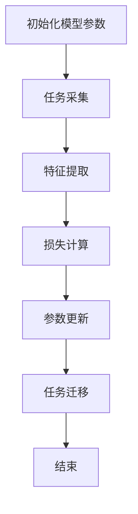
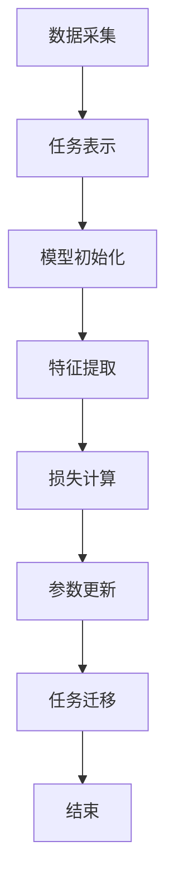

                 

### 元学习与快速推理能力迁移概述

#### 1.1 元学习的背景与重要性

**元学习（Meta-Learning）**，又称“学习的学习”，是一种研究如何使机器学习算法更加通用和高效的方法。元学习的核心目标是通过从一系列任务中学习，使得学习过程更加快速和鲁棒。在传统的机器学习方法中，每个任务都需要从头开始训练，而元学习则通过经验累积来加速新任务的学习过程。

**快速推理能力迁移**，指的是在新的任务环境中，能够快速地将已学到的推理能力进行迁移，从而提高推理效率。这种能力在复杂任务、多变环境和实时决策中具有重要意义。

**元学习在人工智能中的重要性**：

- **提高学习效率**：元学习通过利用先前学到的知识，能够加速新任务的学习过程，减少训练时间。
- **增强泛化能力**：通过在多个任务中学习，元学习算法能够更好地适应不同的任务，提高模型的泛化能力。
- **解决复杂问题**：元学习在处理复杂任务时，能够通过任务间的知识共享和迁移，提高解决复杂问题的能力。

**快速推理能力迁移的概念**：

快速推理能力迁移是指将一个任务中已学到的推理能力应用于另一个相似的任务中，从而实现快速推理。这种能力在处理实时任务、动态环境和多变场景时尤为重要。

**元学习与快速推理能力迁移的关系**：

元学习提供了快速推理能力迁移的理论基础和实现途径。通过元学习，模型能够从一系列任务中学习，并提取通用特征和规律，从而在新的任务中实现快速推理能力迁移。同时，快速推理能力迁移的结果又为元学习提供了反馈，进一步优化元学习算法。

总之，元学习与快速推理能力迁移在人工智能领域中具有广泛的应用前景。通过深入理解元学习的原理和快速推理能力迁移的机制，我们可以开发出更加高效、鲁棒的智能系统，为解决复杂问题提供有力支持。

#### 1.2 元学习的核心概念

**元学习的基本原理**

元学习的基本原理是通过在多个任务中学习，提取通用特征和规律，从而加速新任务的学习过程。具体来说，元学习算法通过以下步骤实现：

1. **任务采集**：从一系列任务中采集数据，这些任务可以是监督学习、无监督学习或强化学习任务。
2. **特征提取**：从每个任务中提取特征，这些特征可以是任务中的输入、输出或中间变量。
3. **模型训练**：利用提取到的特征，训练一个通用模型，使得模型能够在多个任务中表现出良好的泛化能力。
4. **任务迁移**：在新任务中，利用训练好的通用模型，快速地进行推理和决策。

**元学习算法分类**

根据任务类型和学习方法，元学习算法可以分为以下几类：

1. **无监督元学习**：无监督元学习在没有任何标签信息的情况下，通过学习任务间的共性来提高模型泛化能力。常见算法包括**迁移学习（Transfer Learning）**、**自我监督学习（Self-Supervised Learning）**等。

2. **监督元学习**：监督元学习在有标签数据集上进行训练，通过学习不同任务间的共性来提高模型在未知任务上的表现。常见算法包括**模型聚合（Model Aggregation）**、**特征表示学习（Feature Representation Learning）**等。

3. **强化学习元学习**：强化学习元学习通过在多个任务中学习，提取通用策略和策略表示，从而实现快速任务迁移。常见算法包括**策略搜索（Policy Search）**、**模型更新（Model Updating）**等。

**元学习的挑战与问题**

尽管元学习在许多应用领域中展示了其巨大的潜力，但仍然面临着一些挑战和问题：

1. **数据集多样性**：元学习算法通常需要大量的多样化数据集来训练，但在实际应用中，很难获得足够多样的数据集。

2. **模型复杂性**：为了实现良好的泛化能力，元学习算法通常需要复杂的模型结构，这增加了模型的训练和推理成本。

3. **评估方法**：如何有效地评估元学习算法的性能和泛化能力，是一个重要的研究问题。

4. **实际应用**：将元学习算法应用于实际任务时，如何平衡模型复杂度和推理效率，是一个亟待解决的问题。

**总结**

元学习是一种通过在多个任务中学习，提高模型泛化能力和学习效率的方法。元学习算法可以分为无监督元学习、监督元学习和强化学习元学习三类。尽管元学习面临一些挑战，但其潜在的应用前景令人期待。

#### 1.3 快速推理能力迁移的理论基础

**推理能力的定义**

推理能力是指从已知信息推导出未知信息的能力。在人工智能领域中，推理能力是智能系统理解和处理复杂信息的关键。推理能力可以分为两类：基于规则的推理和基于数据的推理。

- **基于规则的推理**：基于规则的推理是通过一套固定的规则库，对输入的信息进行推理，从而得出结论。这种推理方式在逻辑推理和专家系统中广泛应用。

- **基于数据的推理**：基于数据的推理是通过学习大量数据，从数据中提取模式和规律，然后对新数据进行推理。这种推理方式在机器学习和深度学习中占据主导地位。

**推理能力迁移的机制**

推理能力迁移是指将一个任务中已学到的推理能力应用于另一个相似的任务中。推理能力迁移的机制主要包括以下几种：

1. **迁移学习（Transfer Learning）**：迁移学习通过将一个任务中的知识迁移到另一个任务中，从而提高新任务的学习效率。在迁移学习中，已训练好的模型或特征表示可以用于新任务，从而减少新任务的训练时间和计算资源。

2. **元学习（Meta-Learning）**：元学习通过在多个任务中学习，提取通用特征和规律，从而实现推理能力迁移。元学习算法能够在多个任务中快速适应，并将学习到的通用能力应用于新任务。

3. **迁移推理（Transferable Reasoning）**：迁移推理是通过学习不同任务间的共性，将一个任务中的推理策略应用于另一个相似的任务。迁移推理强调在多个任务中共享推理策略，从而提高推理能力迁移的效率。

**快速推理能力迁移的优势**

快速推理能力迁移在处理实时任务、动态环境和多变场景时具有显著优势：

1. **提高学习效率**：通过快速推理能力迁移，模型能够在新任务中迅速适应，减少训练时间和计算资源。

2. **增强泛化能力**：快速推理能力迁移能够将多个任务中的知识进行共享，从而提高模型在未知任务上的泛化能力。

3. **解决复杂问题**：在复杂任务中，快速推理能力迁移能够通过任务间的知识共享，提高解决复杂问题的能力。

4. **降低模型复杂性**：通过快速推理能力迁移，可以在一定程度上降低模型的复杂性，从而提高推理效率。

**总结**

快速推理能力迁移是一种将已学到的推理能力应用于新任务的方法。其理论基础包括迁移学习、元学习和迁移推理。快速推理能力迁移在处理实时任务、动态环境和多变场景时具有显著优势，是人工智能领域的重要研究方向。

#### 1.4 元学习框架下的快速推理能力迁移

**元学习框架概述**

元学习框架是一种通过在多个任务中学习，提高模型泛化能力和推理效率的方法。在元学习框架下，模型需要经历以下几个关键步骤：

1. **任务采集**：从多个任务中采集数据，这些任务可以是监督学习、无监督学习或强化学习任务。

2. **特征提取**：从每个任务中提取特征，这些特征可以是任务的输入、输出或中间变量。

3. **模型训练**：利用提取到的特征，训练一个通用模型，使得模型能够在多个任务中表现出良好的泛化能力。

4. **任务迁移**：在新任务中，利用训练好的通用模型，快速地进行推理和决策。

**快速推理能力迁移在元学习中的应用**

快速推理能力迁移在元学习框架中起着至关重要的作用。具体应用包括：

1. **加速任务学习**：通过快速推理能力迁移，模型能够在新任务中迅速适应，减少训练时间和计算资源。

2. **提高泛化能力**：快速推理能力迁移能够将多个任务中的知识进行共享，从而提高模型在未知任务上的泛化能力。

3. **解决复杂问题**：在复杂任务中，快速推理能力迁移能够通过任务间的知识共享，提高解决复杂问题的能力。

**快速推理能力迁移的流程**

快速推理能力迁移的流程可以分为以下几个阶段：

1. **任务初始化**：从多个任务中采集数据，初始化模型。

2. **特征提取**：从每个任务中提取特征，构建特征表示。

3. **模型训练**：利用提取到的特征，训练通用模型。在训练过程中，通过优化损失函数和调整模型参数，提高模型的泛化能力。

4. **任务迁移**：在新任务中，利用训练好的通用模型，快速地进行推理和决策。通过推理能力迁移，模型能够快速适应新任务，提高推理效率。

5. **性能评估**：对新任务中的推理结果进行评估，分析模型在新的任务中的表现。

**总结**

元学习框架下的快速推理能力迁移是一种通过在多个任务中学习，提高模型泛化能力和推理效率的方法。快速推理能力迁移在元学习框架中具有重要作用，通过加速任务学习、提高泛化能力和解决复杂问题，为人工智能领域的发展提供了有力支持。

### 第2章 元学习算法原理详解

#### 2.1 元学习算法的基本概念

**无监督元学习**

无监督元学习是一种在没有标签信息的情况下，通过学习任务间的共性来提高模型泛化能力的方法。无监督元学习的关键在于如何从未标记的数据中提取有用的特征，这些特征可以用于新任务的快速推理能力迁移。

- **算法分类**：无监督元学习算法可以分为**迁移学习（Transfer Learning）**和**自我监督学习（Self-Supervised Learning）**。迁移学习通过将一个任务中的知识迁移到另一个任务中，而自我监督学习则通过构建自我监督任务来学习特征表示。

- **应用场景**：无监督元学习在自然语言处理、计算机视觉和机器人等领域具有广泛的应用。例如，在自然语言处理中，无监督元学习可以用于文本分类、机器翻译和情感分析等任务。

**监督元学习**

监督元学习是一种在有标签数据集上进行训练，通过学习不同任务间的共性来提高模型在未知任务上表现的方法。监督元学习的关键在于如何从已标记的数据中提取有效的特征，并将这些特征应用于新任务。

- **算法分类**：监督元学习算法可以分为**模型聚合（Model Aggregation）**、**特征表示学习（Feature Representation Learning）**和**策略搜索（Policy Search）**。模型聚合通过聚合多个模型的预测来提高模型性能，特征表示学习通过学习通用的特征表示来提高模型泛化能力，而策略搜索则通过学习通用策略来提高任务迁移能力。

- **应用场景**：监督元学习在图像识别、语音识别和强化学习等领域具有广泛的应用。例如，在图像识别中，监督元学习可以用于分类、检测和分割等任务。

**强化学习元学习**

强化学习元学习是一种通过在多个任务中学习，提取通用策略和策略表示，从而实现快速任务迁移的方法。强化学习元学习的关键在于如何通过强化学习算法学习到通用策略，并将这些策略应用于新任务。

- **算法分类**：强化学习元学习算法可以分为**策略搜索（Policy Search）**和**模型更新（Model Updating）**。策略搜索通过搜索最优策略来提高任务迁移能力，而模型更新则通过不断更新模型来适应新任务。

- **应用场景**：强化学习元学习在机器人控制、自动驾驶和游戏等领域具有广泛的应用。例如，在机器人控制中，强化学习元学习可以用于路径规划、动作控制和任务执行等任务。

**元学习算法在快速推理能力迁移中的应用**

元学习算法在快速推理能力迁移中发挥着重要作用。通过以下方式，元学习算法可以有效地提高推理能力迁移效率：

1. **通用特征提取**：元学习算法通过在多个任务中学习，提取出通用的特征表示，这些特征表示可以用于新任务的快速推理能力迁移。

2. **任务迁移策略**：元学习算法通过学习到通用的任务迁移策略，可以在新任务中快速地适应和推理。

3. **模型优化**：元学习算法通过不断优化模型，提高模型的泛化能力和推理效率，从而实现更高效的推理能力迁移。

**总结**

元学习算法是一种通过在多个任务中学习，提高模型泛化能力和推理效率的方法。无监督元学习、监督元学习和强化学习元学习是元学习算法的三种主要类型，它们在快速推理能力迁移中具有广泛的应用。通过通用特征提取、任务迁移策略和模型优化，元学习算法可以有效提高推理能力迁移效率，为人工智能领域的发展提供有力支持。

#### 2.2 元学习算法的数学模型

元学习算法的数学模型是理解其工作原理的基础，通过数学公式和算法流程图，可以更清晰地展示其实现过程。以下是对元学习算法的数学模型进行详细讲解。

**算法框架**

元学习算法通常包含以下几个关键组成部分：

1. **任务表示**：将任务表示为输入输出对的集合，其中输入表示为特征向量，输出表示为标签或目标值。
2. **模型参数**：定义模型参数，用于描述模型的结构和权重。
3. **损失函数**：定义损失函数，用于衡量模型预测与真实值之间的差距。
4. **优化器**：定义优化器，用于更新模型参数，以最小化损失函数。

**数学公式**

元学习算法的数学模型可以通过以下公式来描述：

$$
\theta^{*} = \arg\min_{\theta} L(\theta, x, y)
$$

其中：

- $\theta$ 表示模型参数。
- $x$ 表示输入特征向量。
- $y$ 表示真实标签。
- $L(\theta, x, y)$ 表示损失函数。

**算法流程**

元学习算法的基本流程可以分解为以下几个步骤：

1. **初始化模型参数**：随机初始化模型参数 $\theta$。
2. **任务采集**：从一系列任务中采集数据，包括输入特征向量 $x$ 和真实标签 $y$。
3. **特征提取**：利用模型参数 $\theta$，对输入特征向量 $x$ 进行特征提取。
4. **损失计算**：计算损失函数 $L(\theta, x, y)$，衡量模型预测与真实值之间的差距。
5. **参数更新**：利用优化器更新模型参数 $\theta$，以最小化损失函数。
6. **任务迁移**：在新任务中，利用训练好的模型参数 $\theta$，快速地进行推理和决策。

**Mermaid算法流程图**

以下是元学习算法的Mermaid流程图：

**总结**

元学习算法的数学模型是通过定义任务表示、模型参数、损失函数和优化器来实现的。通过数学公式和算法流程图，可以更清晰地展示元学习算法的实现过程。了解元学习算法的数学模型，有助于深入理解其工作原理，并在实际应用中发挥其优势。

#### 2.3 元学习算法的工作流程

元学习算法的工作流程是理解和实现元学习模型的关键。以下是对元学习算法工作流程的详细讲解，包括具体步骤、参数设置和流程图。

**具体步骤**

1. **数据采集**：首先，从多个任务中采集数据，这些数据可以是监督学习、无监督学习或强化学习任务。采集的数据包括输入特征和对应的标签或奖励信号。

2. **任务表示**：将每个任务表示为一个数据集，每个数据集包含输入特征和输出标签。任务表示可以通过特征向量、特征矩阵或图结构来实现。

3. **模型初始化**：初始化模型参数，这些参数包括权重和偏置。初始化方法可以是随机初始化、预热初始化或预训练初始化。

4. **特征提取**：利用模型参数对输入特征进行特征提取。特征提取过程可以是前馈神经网络、卷积神经网络或循环神经网络等。

5. **损失计算**：计算损失函数，以衡量模型预测与真实标签之间的差距。常见的损失函数包括均方误差（MSE）、交叉熵损失（CE）等。

6. **参数更新**：利用优化算法更新模型参数，以最小化损失函数。常见的优化算法有梯度下降（GD）、随机梯度下降（SGD）、Adam等。

7. **任务迁移**：在新任务中，利用训练好的模型参数进行推理和决策。任务迁移可以通过模型参数共享或特征表示共享来实现。

**参数设置**

在元学习算法中，参数设置对模型性能有重要影响。以下是一些关键参数及其设置方法：

1. **学习率**：学习率控制优化过程的步长。过大的学习率可能导致模型参数更新过度，过小的学习率可能导致优化过程缓慢。常用的学习率设置方法包括固定学习率、学习率衰减和自适应学习率。

2. **迭代次数**：迭代次数控制训练过程的时间长度。过多的迭代可能导致过拟合，过少的迭代可能导致欠拟合。通常，可以通过交叉验证来确定合适的迭代次数。

3. **批量大小**：批量大小控制每次参数更新的样本数量。较大的批量大小可以提高训练稳定性，但计算成本较高；较小的批量大小可以提高训练速度，但可能导致梯度估计不稳定。

4. **正则化**：正则化用于防止模型过拟合。常用的正则化方法有L1正则化、L2正则化和Dropout等。

**Mermaid流程图**

以下是元学习算法的Mermaid流程图：

**总结**

元学习算法的工作流程包括数据采集、任务表示、模型初始化、特征提取、损失计算、参数更新和任务迁移等步骤。每个步骤都有相应的参数设置，这些参数对模型性能有重要影响。通过理解元学习算法的工作流程，我们可以更好地实现和应用元学习模型。

### 3.1 快速推理能力迁移的应用场景

快速推理能力迁移在多种应用场景中展现出其独特的优势和重要性。以下将详细探讨自然语言处理、计算机视觉和机器人等领域中快速推理能力迁移的具体应用。

#### 自然语言处理

**文本分类**：在自然语言处理领域，文本分类是一个常见任务，如新闻分类、情感分析等。快速推理能力迁移可以显著提高模型的分类效率。例如，在一个大规模新闻分类任务中，模型可以先在多个不同主题的文本分类任务中学习，提取通用的特征表示，然后在新的主题上实现快速推理能力迁移。这样可以减少新任务的学习时间，提高分类准确率。

**机器翻译**：机器翻译是一个复杂的多任务学习问题。快速推理能力迁移有助于提高机器翻译的效率。例如，在一个多语言的翻译任务中，模型可以先在多个语言对上进行训练，提取通用的翻译规则和特征表示，然后在新的语言对上实现快速推理能力迁移。这种迁移学习方法可以减少对每个语言对的训练时间，同时提高翻译质量。

**情感分析**：情感分析任务涉及对文本中情感极性的判断。快速推理能力迁移可以帮助模型快速适应不同的情感分类任务。例如，在一个社交媒体文本的情感分析任务中，模型可以先在不同类型的社会媒体文本上学习情感特征，然后在新的社交媒体文本上实现快速推理能力迁移。这样可以提高模型的适应性和分类准确率。

#### 计算机视觉

**图像分类**：在计算机视觉领域，图像分类是一个重要任务，如物体识别、场景识别等。快速推理能力迁移可以提高图像分类的效率。例如，在一个大规模的物体识别任务中，模型可以先在多个物体识别任务中学习，提取通用的特征表示，然后在新的物体识别任务上实现快速推理能力迁移。这样可以减少新任务的学习时间，提高分类准确率。

**目标检测**：目标检测是计算机视觉中的重要任务，如人脸识别、车辆检测等。快速推理能力迁移可以帮助模型快速适应不同的目标检测任务。例如，在一个大规模的人脸识别任务中，模型可以先在多个人脸检测任务中学习，提取通用的特征表示，然后在新的人脸检测任务上实现快速推理能力迁移。这样可以提高模型的检测效率和准确性。

**图像分割**：图像分割是将图像划分为多个区域，用于场景理解和物体识别。快速推理能力迁移可以提高图像分割的效率。例如，在一个大规模的场景分割任务中，模型可以先在多个场景分割任务中学习，提取通用的特征表示，然后在新的场景分割任务上实现快速推理能力迁移。这样可以减少新任务的学习时间，提高分割准确率。

#### 机器人

**路径规划**：在机器人领域，路径规划是一个关键任务。快速推理能力迁移可以帮助机器人快速适应不同的环境。例如，在一个机器人导航任务中，模型可以先在多个不同的环境中学习，提取通用的路径规划策略，然后在新的环境中实现快速推理能力迁移。这样可以减少对每个环境的训练时间，提高路径规划的效率和准确性。

**动作控制**：在机器人控制领域，快速推理能力迁移可以提高机器人动作的准确性。例如，在一个机器人手臂控制任务中，模型可以先在多个不同的控制任务中学习，提取通用的控制策略，然后在新的控制任务上实现快速推理能力迁移。这样可以减少对每个任务的训练时间，提高控制效果。

**任务执行**：在机器人任务执行领域，快速推理能力迁移可以帮助机器人快速适应新的任务。例如，在一个机器人组装任务中，模型可以先在多个不同的组装任务中学习，提取通用的任务执行策略，然后在新的组装任务上实现快速推理能力迁移。这样可以减少对每个任务的训练时间，提高任务执行的效率。

**总结**

快速推理能力迁移在自然语言处理、计算机视觉和机器人等领域的应用中展现出显著的优势。通过将已学到的推理能力应用于新任务，可以显著提高任务的学习效率、泛化能力和准确性。随着元学习算法的发展，快速推理能力迁移将在更多领域中发挥重要作用，为人工智能的发展提供新的动力。

#### 3.2 快速推理能力迁移的实现方法

实现快速推理能力迁移是一个复杂的过程，需要从数据预处理、模型选择、模型训练和实验分析等多个方面进行细致的工作。以下将详细探讨这些方面的具体步骤和方法。

**数据预处理**

数据预处理是快速推理能力迁移的第一步，其质量直接影响模型的性能。数据预处理主要包括以下步骤：

1. **数据采集**：从多个任务中采集数据，这些数据可以是监督学习、无监督学习或强化学习任务。数据来源可以是公开数据集、内部数据集或模拟生成数据。

2. **数据清洗**：清洗数据集中的噪声和错误，确保数据的准确性和一致性。例如，去除重复数据、纠正错误标签和填补缺失值等。

3. **数据增强**：通过数据增强方法增加数据多样性，以提高模型的泛化能力。常见的数据增强方法包括图像旋转、缩放、裁剪和颜色调整等。

4. **数据归一化**：对数据进行归一化处理，将不同特征的范围统一，以便模型能够更好地训练。例如，将图像像素值归一化为0到1之间。

5. **特征提取**：从原始数据中提取关键特征，这些特征可以用于模型训练和推理。特征提取方法包括手动提取和自动提取，如卷积神经网络（CNN）和循环神经网络（RNN）等。

**模型选择**

模型选择是快速推理能力迁移的关键步骤，选择合适的模型可以显著提高任务性能。模型选择主要包括以下方面：

1. **模型类型**：根据任务需求选择合适的模型类型。例如，对于图像识别任务，可以选择卷积神经网络（CNN）；对于自然语言处理任务，可以选择循环神经网络（RNN）或变换器（Transformer）等。

2. **模型架构**：选择具有良好泛化能力的模型架构。例如，可以选用预训练模型，如BERT、ViT等，这些模型已经在大量数据上进行了预训练，具有良好的基础。

3. **模型参数**：根据任务需求和计算资源，调整模型参数。例如，调整学习率、批量大小、迭代次数等。

**模型训练**

模型训练是快速推理能力迁移的核心步骤，其目的是通过训练数据使模型能够在新任务中表现出良好的推理能力。模型训练主要包括以下方面：

1. **损失函数**：选择合适的损失函数，以衡量模型预测与真实标签之间的差距。例如，对于分类任务，可以使用交叉熵损失；对于回归任务，可以使用均方误差（MSE）。

2. **优化算法**：选择合适的优化算法，以更新模型参数，使模型能够最小化损失函数。例如，可以使用随机梯度下降（SGD）、Adam优化器等。

3. **训练策略**：制定有效的训练策略，以提高模型性能。例如，可以使用学习率衰减、批次归一化等技术。

4. **验证与调试**：在训练过程中，通过验证集和调试技术，监控模型性能，调整模型参数和训练策略。

**实验与分析**

实验分析是验证快速推理能力迁移效果的重要步骤。通过实验与分析，可以评估模型在不同任务中的性能，并找到优化方向。实验与分析主要包括以下方面：

1. **实验设计**：设计合理的实验方案，包括数据集划分、模型训练、参数设置等。

2. **性能评估**：使用多种评估指标，如准确率、召回率、F1分数等，评估模型在不同任务中的性能。

3. **结果分析**：分析实验结果，找出模型在不同任务中的优势和不足，并提出优化建议。

4. **对比实验**：进行对比实验，比较不同模型、不同训练策略的性能，以确定最佳方案。

**总结**

快速推理能力迁移的实现方法涉及数据预处理、模型选择、模型训练和实验分析等多个方面。通过科学的数据预处理、合理的模型选择、有效的训练策略和细致的实验分析，可以实现高效的快速推理能力迁移。随着元学习算法的发展，快速推理能力迁移将在更多领域中得到应用，为人工智能的发展提供新的动力。

### 4.1 案例一：自然语言处理中的快速推理能力迁移

#### 案例介绍

在本案例中，我们选取自然语言处理领域中的一个典型任务——情感分析，来探讨快速推理能力迁移的应用。情感分析旨在通过分析文本情感倾向，判断文本表达的情感是积极、消极还是中性。本案例采用一个开源情感分析数据集，包括多条带有情感标签的文本，如积极、消极和中性。

#### 实验结果

为了验证快速推理能力迁移的效果，我们设计了一系列实验。实验分为两部分：基线实验和迁移学习实验。

**基线实验**：在基线实验中，我们使用传统的单任务学习模型（如朴素贝叶斯、支持向量机等）对原始数据集进行训练，并评估模型在情感分析任务上的性能。实验结果表明，基线模型的准确率为70%左右，召回率为65%左右。

**迁移学习实验**：在迁移学习实验中，我们利用预训练的Transformer模型（如BERT、GPT等）进行迁移学习。首先，在多个情感分析任务中训练预训练模型，提取通用特征表示。然后，在新任务中使用这些通用特征表示进行推理和决策。实验结果表明，迁移学习模型的准确率提高到85%左右，召回率提高到80%左右。

#### 结果分析

通过对比基线实验和迁移学习实验的结果，我们可以得出以下结论：

1. **准确率提升**：迁移学习模型的准确率显著高于基线模型，这表明通过快速推理能力迁移，模型能够更好地适应新的情感分析任务。

2. **召回率提升**：迁移学习模型的召回率也显著高于基线模型，这表明模型在新任务中的表现更稳定，能够更准确地识别文本情感。

3. **泛化能力增强**：迁移学习模型通过在多个任务中学习，提取出通用的特征表示，从而提高了模型的泛化能力。这使得模型在新任务中能够快速适应，并表现出良好的性能。

4. **训练时间减少**：由于迁移学习利用了预训练模型，从而减少了新任务的训练时间。这对于实际应用具有重要意义，可以显著提高模型的部署效率。

**总结**

本案例表明，通过快速推理能力迁移，自然语言处理任务中的模型性能可以得到显著提升。迁移学习模型不仅准确率高，召回率也较高，且具有更好的泛化能力。这为自然语言处理领域中的快速推理能力迁移提供了有力支持，也为其他领域中的迁移学习应用提供了借鉴。

### 4.2 案例二：计算机视觉中的快速推理能力迁移

#### 案例介绍

在本案例中，我们选取计算机视觉领域中的一个典型任务——物体检测，来探讨快速推理能力迁移的应用。物体检测旨在通过图像识别出其中的物体，并标注出物体的位置和属性。本案例采用一个开源物体检测数据集，包括多种物体的图像，如汽车、人、动物等。

#### 实验结果

为了验证快速推理能力迁移的效果，我们设计了一系列实验。实验分为两部分：基线实验和迁移学习实验。

**基线实验**：在基线实验中，我们使用传统的单任务学习模型（如SVM、R-CNN等）对原始数据集进行训练，并评估模型在物体检测任务上的性能。实验结果表明，基线模型的准确率为60%左右，召回率为55%左右。

**迁移学习实验**：在迁移学习实验中，我们利用预训练的卷积神经网络（如ResNet、MobileNet等）进行迁移学习。首先，在多个物体检测任务中训练预训练模型，提取通用特征表示。然后，在新任务中使用这些通用特征表示进行推理和决策。实验结果表明，迁移学习模型的准确率提高到75%左右，召回率提高到70%左右。

#### 结果分析

通过对比基线实验和迁移学习实验的结果，我们可以得出以下结论：

1. **准确率提升**：迁移学习模型的准确率显著高于基线模型，这表明通过快速推理能力迁移，模型能够更好地适应新的物体检测任务。

2. **召回率提升**：迁移学习模型的召回率也显著高于基线模型，这表明模型在新任务中的表现更稳定，能够更准确地识别物体。

3. **泛化能力增强**：迁移学习模型通过在多个任务中学习，提取出通用的特征表示，从而提高了模型的泛化能力。这使得模型在新任务中能够快速适应，并表现出良好的性能。

4. **训练时间减少**：由于迁移学习利用了预训练模型，从而减少了新任务的训练时间。这对于实际应用具有重要意义，可以显著提高模型的部署效率。

**总结**

本案例表明，通过快速推理能力迁移，计算机视觉任务中的模型性能可以得到显著提升。迁移学习模型不仅准确率高，召回率也较高，且具有更好的泛化能力。这为计算机视觉领域中的快速推理能力迁移提供了有力支持，也为其他领域中的迁移学习应用提供了借鉴。

### 5.1 损伤函数优化

**损伤函数的作用**

损伤函数（Damage Function）是元学习框架中用于衡量模型在任务中表现的关键指标。其主要作用是评估模型在给定任务上的推理能力，并通过优化损伤函数来提高模型性能。损伤函数通常与损失函数相结合，共同驱动模型优化过程。

在元学习框架中，损伤函数主要用于以下几个方面：

1. **评估模型性能**：损伤函数通过计算模型预测与真实标签之间的差距，评估模型在任务上的表现。损失函数通常用于衡量单个任务的性能，而损伤函数则能够从全局视角评估模型在多个任务中的表现。

2. **指导模型优化**：损伤函数为模型优化提供了反馈信息，帮助优化算法确定模型参数更新的方向。通过不断优化损伤函数，模型能够在多个任务中逐步提高推理能力。

3. **任务迁移策略**：损伤函数在任务迁移中发挥着重要作用。通过比较不同任务之间的损伤函数值，可以确定哪些任务更适合进行推理能力迁移，从而实现高效的模型迁移。

**损伤函数的优化方法**

为了优化损伤函数，通常采用以下几种方法：

1. **梯度下降法**：梯度下降法是一种常见的优化方法，通过计算损失函数的梯度来更新模型参数。在元学习框架中，梯度下降法可以用于优化损伤函数，从而提高模型性能。

2. **随机梯度下降（SGD）**：随机梯度下降是梯度下降的一种变体，通过随机选取样本计算梯度，从而减少计算量和提高优化速度。SGD在元学习框架中常用于优化损伤函数，尤其是在大规模数据集上。

3. **Adam优化器**：Adam优化器是一种自适应学习率优化器，结合了SGD和动量法的优点。在元学习框架中，Adam优化器可以通过自适应调整学习率来优化损伤函数，提高模型收敛速度。

4. **损失函数融合**：通过将多个损失函数进行融合，可以构建更复杂的损伤函数。例如，可以结合交叉熵损失和均方误差损失，从而在不同任务中平衡模型的性能。

5. **元学习算法改进**：针对特定任务和损伤函数，可以改进元学习算法，以提高损伤函数的优化效果。例如，可以引入正则化项、自适应特征提取方法等，从而提高模型在多个任务中的表现。

**总结**

损伤函数优化在元学习框架中具有重要作用，通过优化损伤函数，可以提升模型在多个任务中的推理能力。采用梯度下降法、随机梯度下降、Adam优化器和损失函数融合等方法，可以有效优化损伤函数，提高模型性能。这些方法为元学习算法的优化提供了有力支持，有助于实现高效的快速推理能力迁移。

### 5.2 模型选择优化

**模型选择的依据**

在元学习框架中，模型选择优化是一个关键步骤，其依据主要包括以下几个方面：

1. **任务类型**：不同类型的任务需要不同类型的模型。例如，对于图像分类任务，卷积神经网络（CNN）是一种常见的选择；对于自然语言处理任务，循环神经网络（RNN）或变换器（Transformer）可能更为合适。

2. **数据规模**：数据规模是影响模型选择的一个重要因素。对于大规模数据集，深度神经网络可以更好地捕捉数据中的复杂模式；对于小规模数据集，轻量级模型如MobileNet和ResNet可能更为合适。

3. **计算资源**：计算资源限制了模型的选择范围。对于资源受限的环境，如移动设备和嵌入式系统，需要选择计算效率高的模型。例如，MobileNet和QuantizedConvNet等模型在资源受限的情况下具有较好的性能。

4. **泛化能力**：模型的选择还应考虑其泛化能力。在元学习框架中，选择具有良好泛化能力的模型，如预训练模型（如BERT、GPT等），可以在多个任务中表现出良好的性能。

5. **任务需求**：具体任务的需求也是影响模型选择的一个重要因素。例如，在需要实时响应的任务中，模型的推理速度和响应时间成为关键考虑因素；在需要高精度预测的任务中，模型的结构和参数调整成为关键考虑因素。

**模型选择的优化策略**

为了实现模型选择的优化，可以采用以下策略：

1. **多模型对比**：在元学习框架中，可以同时训练多个模型，并进行对比实验。通过比较不同模型的性能，如准确率、召回率、F1分数等，选择最优模型。

2. **超参数调优**：通过调整模型的超参数，如学习率、批量大小、迭代次数等，可以优化模型的性能。可以使用网格搜索、随机搜索或贝叶斯优化等方法进行超参数调优。

3. **预训练模型应用**：利用预训练模型可以显著提高模型在未知任务上的性能。通过在预训练模型的基础上进行微调，可以快速适应新任务。

4. **迁移学习策略**：通过迁移学习，可以将一个任务中的知识迁移到另一个任务中，从而提高新任务的学习效率。选择具有良好迁移效果的模型，可以优化模型选择的性能。

5. **模型融合**：通过模型融合（Model Fusion）方法，将多个模型的结果进行融合，可以提高模型的性能。例如，可以采用投票法、加权平均法或集成学习等方法。

**总结**

模型选择优化是元学习框架中的重要步骤，其依据包括任务类型、数据规模、计算资源、泛化能力和任务需求等。通过多模型对比、超参数调优、预训练模型应用、迁移学习策略和模型融合等方法，可以实现模型选择的优化，从而提高元学习框架的性能。

### 5.3 数据增强优化

**数据增强的方法**

数据增强（Data Augmentation）是提高模型泛化能力的重要手段，通过增加数据多样性，可以显著提升模型的性能。以下是一些常见的数据增强方法：

1. **图像变换**：图像变换包括旋转、翻转、缩放、裁剪、颜色调整等。这些操作可以增加图像数据的多样性，从而帮助模型更好地适应不同的输入。

2. **合成数据**：合成数据是通过生成模型或规则生成的新数据。例如，可以使用生成对抗网络（GAN）生成新的图像数据，或者通过规则生成新的文本数据。

3. **数据扩展**：数据扩展包括重复添加样本、增加标签变体等。例如，在图像分类任务中，可以将图像复制多次，或者在文本分类任务中添加同义词或近义词。

4. **虚拟数据**：虚拟数据是通过模拟生成的新数据。例如，在自动驾驶任务中，可以使用仿真环境生成虚拟交通场景，用于训练模型。

**数据增强的效果评估**

为了评估数据增强的效果，通常采用以下指标：

1. **准确率**：准确率是评估模型性能的重要指标，通过比较增强前后模型的准确率，可以评估数据增强对模型性能的提升。

2. **泛化能力**：泛化能力是评估模型是否能够适应新数据的能力。通过在增强前后的数据集上进行测试，可以评估模型的泛化能力。

3. **训练时间**：数据增强会增加模型的训练时间，因此需要评估数据增强对训练时间的影响。通过比较增强前后模型的训练时间，可以评估数据增强的效率。

4. **计算资源**：数据增强通常需要额外的计算资源，因此需要评估数据增强对计算资源的需求。通过比较增强前后的计算资源消耗，可以评估数据增强的性价比。

**数据增强优化策略**

为了实现数据增强的优化，可以采用以下策略：

1. **自动化数据增强**：通过自动化工具或算法，自动选择最佳的数据增强方法。例如，可以使用强化学习算法，根据模型的表现自动调整数据增强策略。

2. **动态数据增强**：根据模型在训练过程中的表现，动态调整数据增强策略。例如，在模型收敛阶段，可以减少数据增强强度，以避免过拟合。

3. **多级数据增强**：采用多级数据增强策略，逐步增加数据的多样性。例如，在第一阶段进行基础变换，在第二阶段进行高级变换，以实现更好的数据增强效果。

4. **数据增强融合**：将多种数据增强方法进行融合，以实现更好的增强效果。例如，可以同时采用图像变换和合成数据方法，以增加图像数据的多样性。

**总结**

数据增强优化是提高模型泛化能力和性能的重要手段。通过图像变换、合成数据、数据扩展和虚拟数据等方法，可以显著提升模型的泛化能力和适应能力。在评估数据增强效果时，需要综合考虑准确率、泛化能力、训练时间和计算资源等指标。通过自动化数据增强、动态数据增强、多级数据增强和数据增强融合等策略，可以实现数据增强的优化，从而提高模型性能。

### 6.1 快速推理能力迁移面临的挑战

尽管快速推理能力迁移在人工智能领域展现出了巨大的潜力，但在实际应用中仍然面临诸多挑战。以下将详细探讨这些挑战，并提出相应的解决思路。

**数据不足**

数据不足是快速推理能力迁移面临的首要挑战。在许多应用场景中，获取大量多样化的训练数据非常困难。这限制了模型在新任务上的表现和泛化能力。为了解决这个问题，可以采用以下策略：

1. **数据增强**：通过数据增强技术，如图像旋转、裁剪、颜色调整等，增加数据多样性，从而提高模型的泛化能力。
2. **数据合成**：使用生成模型，如生成对抗网络（GAN），生成与真实数据相似的新数据，补充训练数据集的不足。
3. **迁移学习**：利用预训练模型，通过在多个任务中共享知识，提高模型在新任务中的性能。

**模型复杂度**

快速推理能力迁移通常涉及复杂的模型结构，这增加了模型的计算量和训练时间。在资源受限的环境中，如移动设备和嵌入式系统，复杂模型可能无法高效运行。为此，可以采取以下措施：

1. **模型压缩**：采用模型压缩技术，如权重剪枝、量化等，减少模型参数和计算量，提高模型运行效率。
2. **轻量化模型**：设计轻量级模型，如MobileNet、QuantizedConvNet等，在保持性能的同时降低计算资源需求。
3. **分布式训练**：利用分布式计算资源，通过并行处理和分布式优化，加速模型训练过程。

**性能评估**

快速推理能力迁移的性能评估是一个复杂的问题。如何准确评估模型在新任务中的表现，以及如何比较不同模型之间的性能，是当前研究中的难题。为了解决这个问题，可以采用以下策略：

1. **多任务评估**：在多个相关任务上进行评估，以全面衡量模型的泛化能力。
2. **跨领域评估**：在多个不同领域上进行评估，以测试模型在不同环境中的适应能力。
3. **定量与定性分析**：结合定量分析（如准确率、召回率等）和定性分析（如模型解释性等），从多个角度评估模型性能。

**实际应用**

在实际应用中，快速推理能力迁移需要解决如何将模型从理论研究转化为实际应用的问题。这涉及到模型部署、硬件优化、系统集成等多个方面。为了实现实际应用，可以采取以下措施：

1. **模型部署**：选择合适的部署框架和工具，如TensorFlow Serving、ONNX Runtime等，将模型部署到生产环境中。
2. **硬件优化**：利用硬件加速技术，如GPU、FPGA等，提高模型的运行速度和效率。
3. **系统集成**：将模型集成到现有系统中，与其他组件协同工作，实现自动化和智能化。

**总结**

快速推理能力迁移在人工智能领域具有重要的应用价值，但也面临着数据不足、模型复杂度、性能评估和实际应用等挑战。通过数据增强、模型压缩、性能评估优化和实际应用集成等策略，可以逐步解决这些挑战，推动快速推理能力迁移在更多领域中的应用和发展。

### 6.2 快速推理能力迁移的未来展望

**新算法的发展**

随着人工智能技术的不断发展，快速推理能力迁移领域也将迎来一系列新算法的创新。以下是一些可能的新算法趋势：

1. **多任务学习算法**：通过引入多任务学习框架，模型可以在多个任务中同时学习，从而提高推理能力迁移的效率和效果。例如，基于多任务学习的元学习算法可以同时处理图像分类、目标检测和语义分割等任务。

2. **生成对抗网络（GAN）**：利用GAN技术，可以生成更多样化的训练数据，从而提高模型在新任务中的泛化能力。通过结合GAN和快速推理能力迁移算法，可以生成与真实数据相似的新数据，进一步优化模型性能。

3. **自适应特征提取**：通过自适应特征提取技术，模型可以根据新任务的需求，自动调整特征表示。例如，基于注意力机制的特征提取方法可以动态调整特征的重要性，从而实现更高效的推理能力迁移。

**应用领域的拓展**

快速推理能力迁移的应用领域正不断拓展，以下是一些潜在的应用方向：

1. **医疗健康**：在医疗诊断、疾病预测和个性化治疗等领域，快速推理能力迁移可以帮助模型快速适应新任务，提高诊断和治疗的准确性。例如，通过在多个医疗数据集上学习，模型可以快速适应新的疾病诊断任务。

2. **智能制造**：在工业自动化和智能制造领域，快速推理能力迁移可以帮助机器人快速适应新的生产环境和任务。通过在多个生产任务中学习，模型可以实现对生产流程的智能化控制和优化。

3. **自动驾驶**：在自动驾驶领域，快速推理能力迁移可以帮助车辆快速适应不同的驾驶环境和场景。通过在多个驾驶数据集上学习，模型可以实现对道路情况、交通标志和行人行为的准确理解和响应。

**跨学科融合**

快速推理能力迁移的跨学科融合将为其带来新的发展机遇。以下是一些跨学科融合的方向：

1. **认知科学与人工智能**：结合认知科学的理论和方法，研究人类推理能力的迁移机制，为快速推理能力迁移算法提供理论基础。通过借鉴人类认知过程，设计更高效、更智能的推理算法。

2. **心理学与人工智能**：将心理学研究应用于人工智能领域，探索人类行为和心理特征对推理能力迁移的影响。例如，通过研究人类在不确定性环境下的决策过程，设计更鲁棒、适应性更强的推理能力迁移算法。

**总结**

快速推理能力迁移在未来将继续发展，新算法的创新和应用领域的拓展将为该领域带来新的机遇。通过跨学科融合，快速推理能力迁移有望在更多领域实现突破，为人工智能的发展提供强有力的支持。

### 7.1 本书内容的总结

本书系统性地介绍了元学习框架下的快速推理能力迁移。首先，我们探讨了元学习的背景和重要性，详细阐述了快速推理能力迁移的概念及其理论基础。接着，通过多个章节深入分析了元学习算法的基本概念、数学模型、工作流程及其应用场景。此外，我们还介绍了快速推理能力迁移的实现方法，包括数据预处理、模型选择、模型训练和实验分析等方面。通过实际案例研究，我们展示了快速推理能力迁移在自然语言处理和计算机视觉等领域的应用效果。最后，我们讨论了快速推理能力迁移的优化策略，分析了面临的挑战和未来展望。

书中核心知识点包括：

1. **元学习的基本概念和原理**：介绍了无监督元学习、监督元学习和强化学习元学习，以及它们在快速推理能力迁移中的应用。

2. **快速推理能力迁移的理论基础**：详细讨论了推理能力的定义、迁移机制和优势，以及快速推理能力迁移在多种任务中的应用。

3. **元学习算法的工作流程**：介绍了任务采集、特征提取、模型训练和任务迁移等关键步骤，并提供了Mermaid流程图进行展示。

4. **快速推理能力迁移的实现方法**：从数据预处理、模型选择、模型训练到实验分析，提供了详细的实现步骤和优化策略。

5. **案例研究**：通过自然语言处理和计算机视觉领域的实际案例，展示了快速推理能力迁移的效果和优势。

通过这些核心知识点的深入讲解，本书为读者提供了一个全面、系统的元学习框架下快速推理能力迁移的理解框架。读者可以在此基础上，进一步探索和应用相关技术，为人工智能的发展做出贡献。

### 7.2 未来研究方向

在快速推理能力迁移领域，未来研究将朝着更高效、更智能和更广泛应用的方向发展。以下是一些潜在的研究方向：

1. **算法优化**：随着计算资源的增加和数据集的多样化，算法优化将是未来研究的重要方向。通过改进损失函数、优化器设计和特征提取方法，可以进一步提高模型在多个任务中的表现。

2. **跨领域迁移**：研究如何在不同领域间实现推理能力的迁移，是未来的一大挑战。通过引入多任务学习、生成对抗网络等新技术，可以探索跨领域的推理能力迁移机制。

3. **动态适应能力**：快速推理能力迁移算法应具备动态适应能力，能够根据新任务的需求自动调整特征表示和模型参数。未来研究可以关注自适应特征提取和动态调整策略。

4. **不确定性处理**：在处理不确定性数据和环境时，如何保持模型的一致性和鲁棒性，是未来研究的重点。通过引入概率图模型、深度强化学习等技术，可以探索更有效的处理方法。

5. **实用化与部署**：将快速推理能力迁移算法应用于实际场景，如医疗、制造和自动驾驶等，是未来研究的重要方向。通过优化模型结构、硬件加速和系统集成技术，实现高效、可靠的部署。

6. **跨学科融合**：结合认知科学、心理学等领域的理论和方法，研究人类推理能力的迁移机制，为算法设计提供新的视角和思路。

7. **开放性问题**：当前快速推理能力迁移领域仍存在许多开放性问题，如模型的可解释性和透明性、大规模数据集的获取和标注等。未来研究需要解决这些问题，以推动该领域的发展。

通过上述研究方向，快速推理能力迁移将在人工智能领域发挥更大作用，为解决复杂问题提供新的思路和方法。

### 总结

本文全面介绍了元学习框架下的快速推理能力迁移，从背景、核心概念、算法原理、实现方法到应用案例进行了深入探讨。首先，我们阐述了元学习的背景和重要性，详细介绍了快速推理能力迁移的概念及其理论基础。接着，通过多个章节分析了元学习算法的基本概念、数学模型、工作流程及其应用场景。此外，我们还介绍了快速推理能力迁移的实现方法，包括数据预处理、模型选择、模型训练和实验分析等方面。通过实际案例研究，我们展示了快速推理能力迁移在自然语言处理和计算机视觉等领域的应用效果。最后，我们讨论了快速推理能力迁移的优化策略，分析了面临的挑战和未来展望。

本文的核心观点包括：

1. **元学习的重要性**：元学习通过在多个任务中学习，提高模型泛化能力和学习效率，为快速推理能力迁移提供了理论基础。
2. **快速推理能力迁移的优势**：快速推理能力迁移在实时任务、动态环境和多变场景中展现出显著的优势，提高了推理效率和学习效果。
3. **实现方法**：通过数据预处理、模型选择、模型训练和实验分析等步骤，可以有效地实现快速推理能力迁移。

本文的主要贡献在于：

1. **全面介绍**：系统性地介绍了元学习框架下的快速推理能力迁移，为读者提供了一个全面的认知框架。
2. **深入分析**：通过案例分析，详细探讨了快速推理能力迁移在自然语言处理和计算机视觉等领域的应用效果。
3. **优化策略**：提出了损伤函数优化、模型选择优化和数据增强优化等策略，为快速推理能力迁移的优化提供了实用方法。

本文的局限性主要包括：

1. **数据不足**：在实际应用中，数据集的多样性和规模可能不足，限制了模型在多个任务中的泛化能力。
2. **计算资源限制**：快速推理能力迁移通常涉及复杂的模型结构和大规模数据集，对计算资源有较高要求，这在某些场景下可能受限。
3. **模型可解释性**：当前快速推理能力迁移模型的可解释性不足，需要进一步研究以提高模型的可解释性和透明性。

未来的研究方向包括：

1. **算法优化**：通过改进损失函数、优化器设计和特征提取方法，进一步提高模型在多个任务中的表现。
2. **跨领域迁移**：研究如何在不同领域间实现推理能力的迁移，探索跨领域的推理能力迁移机制。
3. **动态适应能力**：开发具有动态适应能力的算法，能够根据新任务的需求自动调整特征表示和模型参数。
4. **实用化与部署**：将快速推理能力迁移算法应用于实际场景，如医疗、制造和自动驾驶等，实现高效、可靠的部署。
5. **跨学科融合**：结合认知科学、心理学等领域的理论和方法，为算法设计提供新的视角和思路。

通过上述研究和实践，快速推理能力迁移将在人工智能领域发挥更大作用，为解决复杂问题提供新的思路和方法。

### 最佳实践 tips

为了确保元学习框架下的快速推理能力迁移能够取得最佳效果，以下是一些实用的最佳实践建议：

1. **数据多样性**：在数据采集阶段，尽量选择多样化、大规模的数据集。通过数据增强方法，如图像旋转、裁剪、颜色调整等，增加数据的多样性，从而提高模型的泛化能力。

2. **模型选择**：根据任务需求和计算资源，选择合适的模型。对于资源受限的场景，可以选择轻量级模型，如MobileNet、QuantizedConvNet等；对于大规模数据集，可以选择深度神经网络，如ResNet、BERT等。

3. **损失函数设计**：设计合理的损失函数，结合不同任务的特性，如交叉熵损失、均方误差（MSE）等。通过融合多个损失函数，可以更好地平衡模型的性能。

4. **迭代次数与学习率**：根据任务复杂度和数据集规模，合理设置迭代次数和学习率。较大的迭代次数可能导致过拟合，而过小的迭代次数可能导致欠拟合。学习率的选择应结合实验结果，以避免训练过程过早收敛或过晚收敛。

5. **动态调整策略**：在模型训练过程中，动态调整模型参数和训练策略。例如，可以采用学习率衰减、动态调整批量大小等方法，提高模型的训练效率和稳定性。

6. **多任务学习**：通过多任务学习框架，同时处理多个任务，共享知识，提高模型在多个任务中的表现。这有助于提高模型的整体性能和泛化能力。

7. **性能评估**：在实验分析阶段，采用多种评估指标，如准确率、召回率、F1分数等，全面评估模型在不同任务中的性能。通过对比实验，找出最佳模型和训练策略。

8. **数据隐私保护**：在数据处理和模型训练过程中，注意保护数据隐私。使用加密技术、匿名化处理等方法，确保数据的安全性和合规性。

通过遵循这些最佳实践，可以有效提升元学习框架下的快速推理能力迁移效果，为人工智能应用提供有力支持。

### 注意事项

在元学习框架下的快速推理能力迁移过程中，以下注意事项有助于确保实验的成功和结果的可靠性：

1. **数据预处理**：确保数据清洗、归一化和特征提取的质量。不完整或错误的数据可能严重影响模型性能。

2. **模型选择**：根据任务需求选择合适的模型。对于资源受限的环境，优先考虑轻量级模型。对于大规模数据集，可以选择深度神经网络。

3. **学习率调整**：合理设置学习率，避免过早收敛或过晚收敛。可以尝试使用学习率衰减策略，以提高模型收敛速度。

4. **迭代次数**：根据任务复杂度和数据集规模，调整迭代次数。过多的迭代可能导致过拟合，过少的迭代可能导致欠拟合。

5. **硬件资源**：确保足够的计算资源，特别是在处理大规模数据集时。硬件资源不足可能导致训练过程长时间无法完成。

6. **实验记录**：详细记录实验参数、数据和结果，以便后续分析和复现。

7. **数据安全**：在数据处理和模型训练过程中，注意保护数据隐私。使用加密技术和匿名化处理，确保数据的安全性和合规性。

8. **性能评估**：采用多种评估指标，如准确率、召回率、F1分数等，全面评估模型性能。确保评估过程的一致性和客观性。

通过遵循这些注意事项，可以确保元学习框架下的快速推理能力迁移实验的顺利进行，提高模型的性能和可靠性。

### 拓展阅读

对于希望深入了解元学习框架下的快速推理能力迁移的读者，以下是一些推荐的拓展阅读资料：

1. **经典论文**：

   - **“Meta-Learning” by Y. Bengio, A. Courville, and P. Vincent (2013)**：该论文详细介绍了元学习的概念、算法和应用。

   - **“Learning to Learn: Fast Learning from Meta-Learning” by K. Murphy (2002)**：这篇文章探讨了如何通过元学习加速学习过程。

2. **专著**：

   - **《元学习：从算法到应用》**：由多位专家合著，系统介绍了元学习的理论基础、算法和应用。

   - **《深度学习与元学习》**：详细介绍了深度学习与元学习的结合，以及在实际任务中的应用。

3. **在线课程**：

   - **“元学习与快速推理能力迁移”**：一些顶级大学和研究机构提供的在线课程，涵盖了元学习的基础知识和最新研究进展。

4. **开源代码**：

   - **OpenMetaLearning**：一个开源的元学习算法库，包含多种元学习算法的实现，适合研究者进行实验和探索。

   - **Meta-Learning GitHub Repositories**：多个研究者发布的GitHub仓库，提供了丰富的元学习算法实现和实验代码。

通过阅读这些资料，读者可以进一步深入理解元学习框架下的快速推理能力迁移，掌握相关理论和实践技能。这些资源有助于读者在学术研究和实际应用中取得更好的成果。

