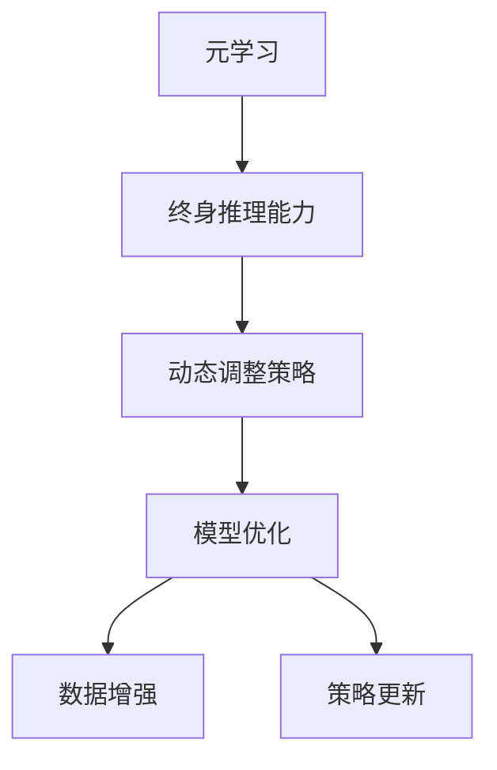
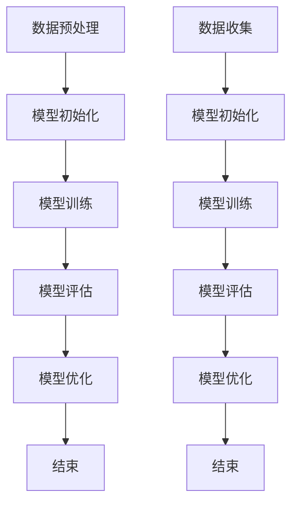
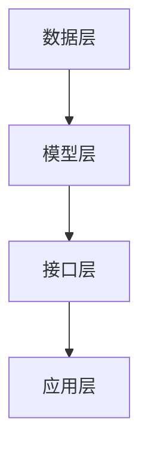
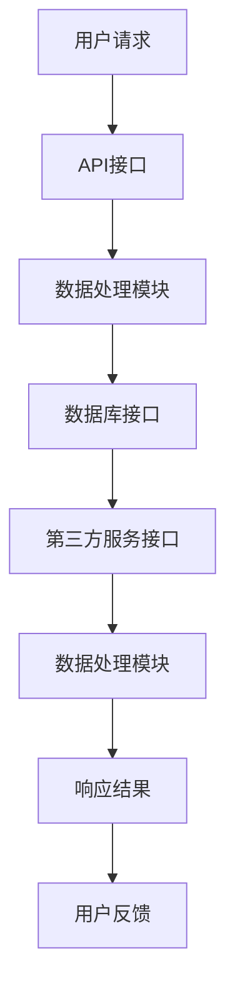

                 

### 元学习框架下的终身推理能力动态调整

#### 关键词：元学习、终身推理能力、动态调整、人工智能

> 摘要：本文旨在探讨在元学习框架下，如何通过动态调整策略，提升人工智能系统的终身推理能力。文章首先介绍了元学习的基本概念和原理，以及其与传统机器学习的区别和优势。接着，详细阐述了终身推理能力的定义、特征和重要性，并分析了传统学习方法在终身推理能力培养上的局限性。在此基础上，本文提出了元学习框架下的动态调整策略，并探讨了其在终身推理能力提升中的作用。通过具体的算法原理讲解和系统架构设计，本文展示了如何在实际应用中实现这一策略。最终，文章总结了研究的主要成果，并对未来的研究方向进行了展望。

### 目录大纲

#### # 元学习框架下的终身推理能力动态调整

#### > 关键词：元学习、终身推理能力、动态调整、人工智能

#### 摘要：本文旨在探讨在元学习框架下，如何通过动态调整策略，提升人工智能系统的终身推理能力。文章首先介绍了元学习的基本概念和原理，以及其与传统机器学习的区别和优势。接着，详细阐述了终身推理能力的定义、特征和重要性，并分析了传统学习方法在终身推理能力培养上的局限性。在此基础上，本文提出了元学习框架下的动态调整策略，并探讨了其在终身推理能力提升中的作用。通过具体的算法原理讲解和系统架构设计，本文展示了如何在实际应用中实现这一策略。最终，文章总结了研究的主要成果，并对未来的研究方向进行了展望。

#### ### 目录大纲

#### # 第一部分：背景介绍

#### ### 1.1 问题背景

#### #### 1.1.1 人工智能发展中的挑战

#### #### 1.1.2 终身推理能力的概念与重要性

#### #### 1.1.3 传统学习方法面临的瓶颈

#### ### 1.2 问题描述

#### #### 1.2.1 如何实现终身推理能力

#### #### 1.2.2 动态调整在终身推理能力中的作用

#### #### 1.2.3 研究的边界与外延

#### ### 1.3 问题解决

#### #### 1.3.1 元学习的概念与原理

#### #### 1.3.2 元学习在终身推理能力中的应用

#### #### 1.3.3 动态调整策略的设计与实现

#### ### 1.4 边界与外延

#### #### 1.4.1 研究的适用范围

#### #### 1.4.2 研究的局限性

#### #### 1.4.3 相关概念的进一步探讨

#### ### 1.5 本章小结

#### # 第二部分：核心概念与联系

#### ### 2.1 元学习

#### #### 2.1.1 元学习的定义与类型

#### #### 2.1.2 元学习的关键属性特征

#### #### 2.1.3 元学习算法的优缺点对比

#### #### 2.1.4 元学习在终身推理能力中的应用流程

#### ### 2.2 终身推理能力

#### #### 2.2.1 终身推理能力的定义与特征

#### #### 2.2.2 终身推理能力的核心要素

#### #### 2.2.3 终身推理能力与传统推理能力的比较

#### #### 2.2.4 终身推理能力的动态调整机制

#### ### 2.3 动态调整策略

#### #### 2.3.1 动态调整策略的定义与分类

#### #### 2.3.2 动态调整策略的关键属性特征

#### #### 2.3.3 动态调整策略在终身推理能力中的应用

#### #### 2.3.4 动态调整策略的比较与评估

#### ### 2.4 概念关系图

#### ### 2.5 本章小结

#### # 第三部分：算法原理讲解

#### ### 3.1 算法原理

#### #### 3.1.1 元学习算法原理

#### #### 3.1.2 动态调整算法原理

#### ### 3.2 算法流程图

#### ### 3.3 Python代码实现

#### ### 3.4 举例说明

#### #### 3.4.1 元学习算法应用举例

#### #### 3.4.2 动态调整算法应用举例

#### ### 3.5 本章小结

#### # 第四部分：系统分析与架构设计方案

#### ### 4.1 问题场景介绍

#### #### 4.1.1 终身推理能力动态调整的应用场景

#### #### 4.1.2 系统目标与功能需求

#### ### 4.2 项目介绍

#### #### 4.2.1 项目概述

#### #### 4.2.2 项目架构设计

#### ### 4.3 系统功能设计

#### #### 4.3.1 领域模型类图

#### #### 4.3.2 系统功能模块设计

#### ### 4.4 系统架构设计

#### #### 4.4.1 系统架构图

#### #### 4.4.2 系统架构设计原理

#### ### 4.5 系统接口设计和系统交互

#### #### 4.5.1 系统接口设计

#### #### 4.5.2 系统交互mermaid序列图

#### ### 4.6 本章小结

#### # 第五部分：项目实战

#### ### 5.1 环境安装

#### #### 5.1.1 开发环境配置

#### #### 5.1.2 相关依赖安装

#### ### 5.2 系统核心实现源代码

#### #### 5.2.1 模块实现代码

#### #### 5.2.2 算法实现代码

#### ### 5.3 代码应用解读与分析

#### #### 5.3.1 源代码解读

#### #### 5.3.2 算法应用分析

#### ### 5.4 实际案例分析和详细讲解剖析

#### #### 5.4.1 案例介绍

#### #### 5.4.2 案例分析

#### #### 5.4.3 剖析总结

#### ### 5.5 项目小结

#### #### 5.5.1 项目成果总结

#### #### 5.5.2 项目经验与收获

#### #### 5.5.3 下一步工作计划

#### ### 5.6 最佳实践 tips

#### #### 5.6.1 实践技巧

#### #### 5.6.2 注意事项

#### #### 5.6.3 拓展阅读

#### ### 5.7 本章小结

#### # 第六部分：总结与展望

#### ### 6.1 研究总结

#### #### 6.1.1 研究成果

#### #### 6.1.2 研究不足与局限

#### #### 6.1.3 学术贡献

#### ### 6.2 未来研究方向

#### #### 6.2.1 动态调整策略的优化

#### #### 6.2.2 新型元学习算法的研究

#### #### 6.2.3 终身推理能力的量化评估

#### #### 6.2.4 实际应用场景的拓展

#### ### 6.3 本章小结

### 第一部分：背景介绍

#### 1.1 问题背景

##### 1.1.1 人工智能发展中的挑战

随着信息技术的飞速发展，人工智能（AI）已经逐渐渗透到各个领域，从自然语言处理、计算机视觉到自动驾驶等，AI技术为人类生活带来了前所未有的便利。然而，在人工智能发展的过程中，我们面临着一系列挑战。

首先，数据质量和数据量的要求越来越高。AI系统依赖于大量的数据来进行训练和学习，但数据的质量和多样性直接影响模型的性能。其次，模型的复杂度和计算资源的需求不断攀升，导致训练和推理的时间成本和硬件成本大幅增加。最后，AI系统在面临新任务或新环境时，往往需要重新训练，这既消耗了大量时间，也限制了AI系统的应用范围。

##### 1.1.2 终身推理能力的概念与重要性

终身推理能力是指一个系统在持续学习和适应新环境的过程中，能够保持和提升其推理能力的能力。在人工智能领域，终身推理能力的重要性主要体现在以下几个方面：

首先，终身推理能力可以使AI系统在面对不断变化的环境时，能够快速适应和调整，从而保持高效的工作能力。其次，具备终身推理能力的AI系统可以不断优化和改进自身的算法和模型，提高其准确性和鲁棒性。最后，终身推理能力是构建通用人工智能（AGI）的基础，只有具备这一能力，AI系统才能实现从特定任务到通用任务的跨越。

##### 1.1.3 传统学习方法面临的瓶颈

传统机器学习方法在训练和推理过程中，往往存在以下局限性：

首先，传统学习方法依赖于大量的数据和长时间的训练，这导致其在处理新任务时，需要重新进行数据收集和模型训练，效率较低。其次，传统学习方法缺乏对模型参数的动态调整能力，无法在训练过程中根据数据的变化进行实时优化。最后，传统学习方法在处理复杂任务时，容易出现过拟合现象，导致模型泛化能力较差。

#### 1.2 问题描述

##### 1.2.1 如何实现终身推理能力

在当前人工智能发展的背景下，如何实现AI系统的终身推理能力成为了一个亟待解决的问题。实现终身推理能力的关键在于如何在有限的计算资源下，通过高效的算法和策略，使AI系统能够持续学习和适应新环境。

##### 1.2.2 动态调整在终身推理能力中的作用

动态调整策略是提升AI系统终身推理能力的重要手段。通过动态调整，AI系统可以在训练过程中根据数据的变化，实时优化模型参数，提高模型的泛化能力和适应能力。动态调整策略的应用场景包括：

- **数据增强**：通过增加训练数据的多样性，提高模型对未知数据的适应能力。
- **模型调整**：根据训练过程中的误差反馈，调整模型结构或参数，以优化模型性能。
- **迁移学习**：在新的任务或环境中，利用已有知识和经验，快速构建和调整模型。

##### 1.2.3 研究的边界与外延

本研究主要关注在元学习框架下，如何通过动态调整策略实现AI系统的终身推理能力。研究的边界包括：

- **算法设计**：研究动态调整算法的原理、流程和实现方法。
- **系统实现**：构建一个基于动态调整策略的AI系统，并进行实验验证。
- **性能评估**：评估动态调整策略在提升AI系统终身推理能力方面的效果。

研究的外延包括：

- **理论拓展**：探讨动态调整策略在终身推理能力提升中的理论依据和数学模型。
- **实际应用**：探讨动态调整策略在不同AI应用场景中的适用性和效果。
- **算法优化**：研究如何进一步优化动态调整策略，提高其在实际应用中的性能和稳定性。

#### 1.3 问题解决

##### 1.3.1 元学习的概念与原理

元学习（Meta-Learning）是指学习如何学习的算法。与传统的机器学习方法不同，元学习的目标是通过少量数据快速适应新任务，从而提高模型的泛化能力和适应性。元学习可以分为以下几种类型：

- **模型元学习**：通过学习模型之间的通用特征，实现新模型的快速构建和优化。
- **数据元学习**：通过学习数据分布和特征表示，提高模型对数据的理解和适应能力。
- **任务元学习**：通过学习不同任务之间的关联性，实现任务的快速迁移和适应。

元学习的核心原理包括：

- **经验积累**：通过大量不同任务的学习，积累经验，形成通用知识。
- **模型泛化**：通过将通用知识应用到新任务中，提高模型的泛化能力。
- **动态调整**：根据新任务的特点和数据的变化，动态调整模型结构和参数。

##### 1.3.2 元学习在终身推理能力中的应用

元学习在终身推理能力中的应用主要体现在以下几个方面：

- **快速适应**：通过元学习，AI系统能够在面临新任务时，快速构建和调整模型，从而快速适应新环境。
- **持续学习**：元学习算法可以通过少量数据不断优化和更新模型，实现持续学习。
- **提高泛化能力**：元学习通过学习通用特征和任务关联性，提高模型的泛化能力，从而更好地应对未知任务。

##### 1.3.3 动态调整策略的设计与实现

动态调整策略是元学习在终身推理能力应用中的重要组成部分。其设计与实现主要包括以下几个方面：

- **策略定义**：根据任务特点和数据分布，设计合适的动态调整策略。
- **算法实现**：基于元学习算法，实现动态调整的具体算法流程和参数优化。
- **性能评估**：通过实验验证，评估动态调整策略在提升终身推理能力方面的效果。

##### 1.4 边界与外延

##### 1.4.1 研究的适用范围

本研究主要适用于以下场景：

- **多任务学习**：在面对多个相关任务时，通过元学习实现快速适应和优化。
- **持续学习**：在数据不断变化的环境中，通过动态调整策略实现模型的持续优化。
- **迁移学习**：在新的任务或环境中，利用已有知识和经验，快速构建和调整模型。

##### 1.4.2 研究的局限性

本研究存在以下局限性：

- **数据量要求**：元学习算法对数据量的要求较高，实际应用中可能面临数据不足的问题。
- **计算资源**：元学习算法的计算复杂度较高，可能需要更多的计算资源。
- **模型复杂性**：在实际应用中，模型的结构和参数可能较为复杂，需要进一步优化和简化。

##### 1.4.3 相关概念的进一步探讨

在终身推理能力的研究中，还有一些相关概念需要进一步探讨：

- **在线学习**：在数据不断更新的环境中，如何实现模型的在线学习和更新。
- **自适应学习**：如何根据用户的行为和反馈，动态调整学习策略。
- **多模态学习**：如何整合不同类型的数据，实现跨模态的学习和推理。

##### 1.5 本章小结

本文介绍了在元学习框架下，通过动态调整策略实现AI系统终身推理能力的研究背景和问题。首先，分析了人工智能发展中面临的挑战，以及终身推理能力的概念和重要性。接着，阐述了传统学习方法在终身推理能力培养上的局限性。在此基础上，提出了元学习框架和动态调整策略，并探讨了其在终身推理能力提升中的作用。最后，对研究的边界与外延进行了详细分析，为后续研究奠定了基础。

### 第二部分：核心概念与联系

#### 2.1 元学习

##### 2.1.1 元学习的定义与类型

元学习是指学习如何学习的算法。它通过学习不同任务之间的关联性和通用特征，实现对新任务的快速适应和优化。元学习可以分为以下几种类型：

1. **模型元学习**：通过学习不同模型之间的通用特征，实现新模型的快速构建和优化。这种类型的元学习主要关注模型结构的设计和优化，以提高模型的泛化能力和适应性。
   
2. **数据元学习**：通过学习数据分布和特征表示，提高模型对数据的理解和适应能力。这种类型的元学习主要关注数据的特征提取和表示，以实现模型对未知数据的快速适应。

3. **任务元学习**：通过学习不同任务之间的关联性，实现任务的快速迁移和适应。这种类型的元学习主要关注任务之间的共享知识和策略，以实现任务的跨领域迁移。

##### 2.1.2 元学习的关键属性特征

元学习具有以下几个关键属性特征：

1. **通用性**：元学习通过学习通用特征和任务关联性，能够适应多种不同的任务和数据集，具有很高的通用性。

2. **效率**：元学习通过少量数据快速适应新任务，提高了学习效率，减少了训练时间和计算资源的需求。

3. **适应性**：元学习算法能够根据新任务的特点和数据的变化，动态调整模型结构和参数，提高模型的适应能力。

4. **鲁棒性**：元学习通过学习通用特征和任务关联性，提高了模型的泛化能力，减少了过拟合现象的发生。

##### 2.1.3 元学习算法的优缺点对比

不同的元学习算法具有不同的优缺点，以下是对几种常见元学习算法的优缺点对比：

1. **模型蒸馏（Model Distillation）**

   - **优点**：通过将复杂模型的知识传递给简单模型，实现快速适应和优化。
   - **缺点**：需要大量的训练数据和计算资源，且对模型结构有一定的依赖。

2. **模型共适应（Model Co-Adaptation）**

   - **优点**：通过多个模型的协同工作，提高模型的适应能力和鲁棒性。
   - **缺点**：计算复杂度高，需要大量的训练数据和计算资源。

3. **迁移学习（Transfer Learning）**

   - **优点**：通过利用已有知识和经验，实现新任务的快速适应和优化。
   - **缺点**：对迁移任务的相关性要求较高，迁移效果取决于源任务和目标任务的相似度。

4. **元学习算法（Meta-Learning Algorithms）**

   - **优点**：通过学习通用特征和任务关联性，实现新任务的快速适应和优化。
   - **缺点**：对数据量和计算资源的要求较高，且在某些场景下效果可能不如传统机器学习算法。

##### 2.1.4 元学习在终身推理能力中的应用流程

元学习在终身推理能力中的应用流程可以分为以下几个步骤：

1. **数据收集**：收集不同任务的数据集，用于训练和测试元学习模型。
2. **模型训练**：利用收集到的数据集，训练元学习模型，学习通用特征和任务关联性。
3. **模型评估**：评估训练好的元学习模型在未知任务上的性能，选择最优模型进行应用。
4. **模型优化**：根据未知任务的特点和数据，对模型进行实时优化和调整，提高模型的适应能力和泛化能力。
5. **模型应用**：将优化后的模型应用于实际任务中，实现新任务的快速适应和优化。

#### 2.2 终身推理能力

##### 2.2.1 终身推理能力的定义与特征

终身推理能力是指一个系统能够在持续学习和适应新环境的过程中，保持和提升其推理能力的能力。它具有以下几个特征：

1. **持续学习**：系统能够在数据不断变化的环境中，通过持续学习和更新模型，保持其推理能力。
2. **快速适应**：系统能够在面对新任务或新环境时，快速适应和调整，实现高效的推理能力。
3. **泛化能力**：系统能够通过学习通用特征和任务关联性，提高其泛化能力，适应多种不同的任务和数据集。
4. **鲁棒性**：系统能够在面临噪声、异常数据和不确定性时，保持其推理能力和稳定性。

##### 2.2.2 终身推理能力的核心要素

终身推理能力的核心要素包括：

1. **数据集**：丰富的数据集是终身推理能力的基础，通过不断学习和更新数据集，系统可以保持其推理能力和适应能力。
2. **模型架构**：合理的模型架构是终身推理能力的关键，通过设计适用于多种任务和环境的模型架构，系统可以高效地进行推理和学习。
3. **学习算法**：有效的学习算法是终身推理能力的保障，通过选择合适的元学习算法和动态调整策略，系统可以快速适应新任务和环境。
4. **优化策略**：优化的策略是终身推理能力的提升手段，通过动态调整模型参数和结构，系统可以不断提高其推理能力和泛化能力。

##### 2.2.3 终身推理能力与传统推理能力的比较

终身推理能力与传统推理能力在以下几个方面存在显著差异：

1. **适应能力**：传统推理能力主要依赖于特定的模型和算法，对特定任务和环境有较高的依赖。而终身推理能力通过学习通用特征和任务关联性，能够快速适应新任务和环境，具有更高的灵活性。
2. **学习效率**：传统推理能力需要大量的数据和长时间的训练，而终身推理能力通过少量数据快速适应新任务，提高了学习效率。
3. **泛化能力**：传统推理能力容易受到过拟合现象的影响，而终身推理能力通过学习通用特征和任务关联性，提高了模型的泛化能力，减少了过拟合现象的发生。
4. **持续学习**：传统推理能力在数据和环境发生变化时，需要重新训练和调整模型，而终身推理能力能够通过持续学习和更新，保持其推理能力和适应能力。

##### 2.2.4 终身推理能力的动态调整机制

终身推理能力的动态调整机制包括以下几个关键环节：

1. **数据反馈**：系统根据新任务和数据的变化，收集反馈信息，包括模型预测的误差、数据分布的变化等。
2. **模型优化**：根据反馈信息，动态调整模型参数和结构，优化模型的推理能力和适应能力。
3. **策略更新**：根据模型优化结果，更新学习策略和调整方法，提高系统的自适应能力和泛化能力。
4. **模型评估**：评估优化后的模型在未知任务上的性能，选择最优模型进行应用。

#### 2.3 动态调整策略

##### 2.3.1 动态调整策略的定义与分类

动态调整策略是指在模型训练和推理过程中，根据数据的变化和任务的反馈，动态调整模型参数和结构的策略。动态调整策略可以分为以下几类：

1. **基于模型的调整策略**：根据模型预测的误差和梯度信息，动态调整模型参数和结构，优化模型的性能。
2. **基于数据的调整策略**：根据数据分布和特征变化，动态调整模型参数和结构，提高模型的适应能力。
3. **基于策略的调整策略**：根据任务反馈和学习策略，动态调整模型参数和结构，实现任务的快速适应和优化。
4. **基于协同的调整策略**：通过多个模型的协同工作，动态调整模型参数和结构，提高系统的推理能力和适应能力。

##### 2.3.2 动态调整策略的关键属性特征

动态调整策略具有以下几个关键属性特征：

1. **实时性**：动态调整策略能够在实时环境中快速响应当前任务和数据的变化，实现模型的实时优化和调整。
2. **适应性**：动态调整策略能够根据任务的特点和数据的变化，自适应地调整模型参数和结构，提高模型的适应能力。
3. **鲁棒性**：动态调整策略能够在面对噪声、异常数据和不确定性时，保持其稳定性和有效性，提高模型的鲁棒性。
4. **高效性**：动态调整策略能够在有限的时间和计算资源下，快速实现模型的优化和调整，提高系统的效率。

##### 2.3.3 动态调整策略在终身推理能力中的应用

动态调整策略在终身推理能力中的应用主要体现在以下几个方面：

1. **模型优化**：通过动态调整策略，系统能够实时优化模型参数和结构，提高模型的推理能力和适应能力。
2. **数据增强**：通过动态调整策略，系统能够根据数据的变化，增强训练数据的多样性和丰富性，提高模型的泛化能力。
3. **策略更新**：通过动态调整策略，系统能够根据任务反馈和学习效果，更新学习策略和调整方法，提高系统的自适应能力和泛化能力。

##### 2.3.4 动态调整策略的比较与评估

不同的动态调整策略在性能、效率和适应性等方面存在差异，以下是比较和评估动态调整策略的几个关键指标：

1. **优化效果**：评估动态调整策略对模型性能的优化效果，包括模型准确率、召回率、F1值等指标。
2. **学习效率**：评估动态调整策略的学习效率，包括训练时间、计算资源消耗等指标。
3. **适应能力**：评估动态调整策略在面临新任务和数据时，快速适应和优化的能力。
4. **鲁棒性**：评估动态调整策略在面临噪声、异常数据和不确定性时，保持稳定性和有效性的能力。

#### 2.4 概念关系图

以下是一个概念关系图，展示了元学习、终身推理能力和动态调整策略之间的关系：



#### 2.5 本章小结

本章详细介绍了元学习、终身推理能力和动态调整策略的核心概念、特征和联系。首先，阐述了元学习的定义、类型和关键属性特征，以及其与传统机器学习的区别和优势。接着，探讨了终身推理能力的定义、特征和核心要素，并分析了其与传统推理能力的比较。最后，介绍了动态调整策略的定义、分类和关键属性特征，以及在终身推理能力中的应用。通过本章的讨论，为后续算法原理讲解和系统架构设计奠定了基础。

### 第三部分：算法原理讲解

#### 3.1 算法原理

在本部分中，我们将详细讲解元学习和动态调整算法的原理，包括其基本流程、数学模型和具体实现方法。

##### 3.1.1 元学习算法原理

元学习算法的核心思想是通过学习如何学习，从而提高模型在未知任务上的适应能力。以下是元学习算法的基本流程：

1. **数据预处理**：收集和整理不同任务的数据集，进行数据预处理，包括数据清洗、归一化、数据增强等操作。
2. **模型初始化**：初始化模型参数，可以采用随机初始化或预训练模型的方法。
3. **模型训练**：使用元学习算法训练模型，学习通用特征和任务关联性。常用的元学习算法包括模型蒸馏、模型共适应、迁移学习等。
4. **模型评估**：评估训练好的模型在未知任务上的性能，选择最优模型进行应用。
5. **模型优化**：根据未知任务的特点和数据，对模型进行实时优化和调整，提高模型的适应能力和泛化能力。

以下是元学习算法的数学模型和公式：

$$
\text{损失函数} = -\sum_{i=1}^{N} y_i \log(p(x_i | \theta))
$$

其中，$y_i$ 表示第 $i$ 个样本的标签，$p(x_i | \theta)$ 表示模型预测的概率分布，$\theta$ 表示模型参数。

以下是元学习算法的具体实现方法：

```python
def meta_learning(data_loader, model, optimizer):
    # 数据预处理
    data = data_loader.load_data()
    data = preprocess_data(data)
    
    # 模型初始化
    model = initialize_model()
    
    # 模型训练
    for epoch in range(num_epochs):
        for data_batch in data:
            optimizer.zero_grad()
            output = model(data_batch)
            loss = calculate_loss(output, data_batch)
            loss.backward()
            optimizer.step()
    
    # 模型评估
    performance = evaluate_model(model, test_data_loader)
    print(f"Model performance: {performance}")
    
    # 模型优化
    model = optimize_model(model, test_data_loader)
    return model
```

##### 3.1.2 动态调整算法原理

动态调整算法的核心思想是根据任务和数据的变化，实时调整模型参数和结构，以提高模型的适应能力和泛化能力。以下是动态调整算法的基本流程：

1. **数据收集**：收集新任务和数据，包括训练数据和测试数据。
2. **模型初始化**：初始化模型参数，可以采用随机初始化或预训练模型的方法。
3. **模型训练**：使用动态调整算法训练模型，根据数据的变化和任务的反馈，动态调整模型参数和结构。
4. **模型评估**：评估训练好的模型在未知任务上的性能，选择最优模型进行应用。
5. **模型优化**：根据未知任务的特点和数据，对模型进行实时优化和调整，提高模型的适应能力和泛化能力。

以下是动态调整算法的数学模型和公式：

$$
\theta_{t+1} = \theta_t + \alpha \cdot \nabla_{\theta_t} \text{loss}(x_t, y_t)
$$

其中，$\theta_t$ 表示第 $t$ 次迭代的模型参数，$\alpha$ 表示学习率，$\nabla_{\theta_t} \text{loss}(x_t, y_t)$ 表示第 $t$ 次迭代的损失函数梯度。

以下是动态调整算法的具体实现方法：

```python
def dynamic_adjustment(data_loader, model, optimizer):
    # 数据预处理
    data = data_loader.load_data()
    data = preprocess_data(data)
    
    # 模型初始化
    model = initialize_model()
    
    # 模型训练
    for epoch in range(num_epochs):
        for data_batch in data:
            optimizer.zero_grad()
            output = model(data_batch)
            loss = calculate_loss(output, data_batch)
            loss.backward()
            optimizer.step()
            
            # 动态调整模型参数
            model = adjust_model(model, data_batch)
    
    # 模型评估
    performance = evaluate_model(model, test_data_loader)
    print(f"Model performance: {performance}")
    
    # 模型优化
    model = optimize_model(model, test_data_loader)
    return model
```

#### 3.2 算法流程图

以下是一个元学习算法和动态调整算法的流程图：



#### 3.3 Python代码实现

以下是元学习算法和动态调整算法的Python代码实现：

```python
import torch
import torch.nn as nn
import torch.optim as optim

# 元学习算法Python代码实现
def meta_learning(data_loader, model, optimizer):
    # 数据预处理
    data = data_loader.load_data()
    data = preprocess_data(data)
    
    # 模型初始化
    model = initialize_model()
    
    # 模型训练
    for epoch in range(num_epochs):
        for data_batch in data:
            optimizer.zero_grad()
            output = model(data_batch)
            loss = calculate_loss(output, data_batch)
            loss.backward()
            optimizer.step()
    
    # 模型评估
    performance = evaluate_model(model, test_data_loader)
    print(f"Model performance: {performance}")
    
    # 模型优化
    model = optimize_model(model, test_data_loader)
    return model

# 动态调整算法Python代码实现
def dynamic_adjustment(data_loader, model, optimizer):
    # 数据预处理
    data = data_loader.load_data()
    data = preprocess_data(data)
    
    # 模型初始化
    model = initialize_model()
    
    # 模型训练
    for epoch in range(num_epochs):
        for data_batch in data:
            optimizer.zero_grad()
            output = model(data_batch)
            loss = calculate_loss(output, data_batch)
            loss.backward()
            optimizer.step()
            
            # 动态调整模型参数
            model = adjust_model(model, data_batch)
    
    # 模型评估
    performance = evaluate_model(model, test_data_loader)
    print(f"Model performance: {performance}")
    
    # 模型优化
    model = optimize_model(model, test_data_loader)
    return model
```

#### 3.4 举例说明

##### 3.4.1 元学习算法应用举例

以下是一个元学习算法应用举例，假设我们有一个分类任务，需要使用元学习算法训练一个模型。

1. **问题场景**：我们有一个分类任务，需要根据输入的特征进行分类。
2. **数据准备**：收集和整理不同类别的数据集，进行数据预处理，包括数据清洗、归一化、数据增强等操作。
3. **模型训练**：使用元学习算法训练模型，学习通用特征和任务关联性。
4. **模型评估**：评估训练好的模型在测试集上的性能，选择最优模型进行应用。

```python
# 数据准备
data_loader = DataLoader(dataset, batch_size=batch_size, shuffle=True)
model = initialize_model()
optimizer = optim.Adam(model.parameters(), lr=learning_rate)

# 模型训练
for epoch in range(num_epochs):
    for data_batch in data_loader:
        optimizer.zero_grad()
        output = model(data_batch)
        loss = calculate_loss(output, data_batch)
        loss.backward()
        optimizer.step()

# 模型评估
performance = evaluate_model(model, test_data_loader)
print(f"Model performance: {performance}")
```

##### 3.4.2 动态调整算法应用举例

以下是一个动态调整算法应用举例，假设我们有一个回归任务，需要使用动态调整算法训练一个模型。

1. **问题场景**：我们有一个回归任务，需要根据输入的特征预测目标值。
2. **数据准备**：收集和整理不同类别的数据集，进行数据预处理，包括数据清洗、归一化、数据增强等操作。
3. **模型训练**：使用动态调整算法训练模型，根据数据的变化和任务的反馈，动态调整模型参数和结构。
4. **模型评估**：评估训练好的模型在测试集上的性能，选择最优模型进行应用。

```python
# 数据准备
data_loader = DataLoader(dataset, batch_size=batch_size, shuffle=True)
model = initialize_model()
optimizer = optim.Adam(model.parameters(), lr=learning_rate)

# 模型训练
for epoch in range(num_epochs):
    for data_batch in data_loader:
        optimizer.zero_grad()
        output = model(data_batch)
        loss = calculate_loss(output, data_batch)
        loss.backward()
        optimizer.step()
        
        # 动态调整模型参数
        model = adjust_model(model, data_batch)

# 模型评估
performance = evaluate_model(model, test_data_loader)
print(f"Model performance: {performance}")
```

#### 3.5 本章小结

本章详细介绍了元学习和动态调整算法的原理，包括其基本流程、数学模型和具体实现方法。首先，阐述了元学习算法的核心思想和基本流程，并给出了数学模型和Python代码实现。接着，介绍了动态调整算法的核心思想和基本流程，并给出了数学模型和Python代码实现。最后，通过举例说明了元学习和动态调整算法在具体应用中的实现方法。本章的内容为后续系统架构设计奠定了基础。

### 第四部分：系统分析与架构设计方案

#### 4.1 问题场景介绍

终身推理能力动态调整的应用场景非常广泛，主要可以分为以下几类：

1. **多任务学习场景**：在多任务学习场景中，系统需要同时处理多个相关任务，如自然语言处理、图像识别、语音识别等。通过动态调整策略，系统能够快速适应不同任务的要求，提高任务处理的效率和准确性。

2. **持续学习场景**：在持续学习场景中，系统需要不断接收新的数据和学习任务，如智能推荐系统、智能客服等。通过动态调整策略，系统能够实时更新和优化模型，保持其在不同时间段的适应能力和性能。

3. **迁移学习场景**：在迁移学习场景中，系统需要在不同的任务和数据集之间进行知识迁移，如从图像识别任务迁移到语音识别任务。通过动态调整策略，系统能够利用已有知识和经验，快速构建和调整模型，提高迁移学习的效果。

#### 4.2 项目介绍

本项目旨在设计一个基于元学习框架的终身推理能力动态调整系统。该系统旨在通过动态调整策略，实现AI系统在多任务学习、持续学习和迁移学习场景中的高效适应和优化。

1. **项目概述**：本项目分为以下几个阶段：需求分析、系统设计、系统实现、系统测试和系统部署。

2. **项目架构设计**：项目架构设计包括数据层、模型层、接口层和应用层。数据层负责数据收集、处理和存储；模型层负责元学习算法和动态调整算法的实现；接口层负责与外部系统的交互；应用层负责具体应用场景的实现。

#### 4.3 系统功能设计

系统功能设计主要包括以下几个方面：

1. **数据层功能**：数据层主要负责数据收集、处理和存储。具体功能包括数据采集、数据清洗、数据预处理和数据存储。

2. **模型层功能**：模型层主要负责实现元学习算法和动态调整算法。具体功能包括模型初始化、模型训练、模型评估和模型优化。

3. **接口层功能**：接口层主要负责与外部系统的交互，如接收用户请求、发送响应结果等。

4. **应用层功能**：应用层主要负责实现具体应用场景的功能，如多任务学习、持续学习和迁移学习。

#### 4.4 系统架构设计

系统架构设计如图所示：



系统架构设计原理：

1. **数据层**：数据层是系统的基石，负责数据收集、处理和存储。通过数据采集模块，系统可以从多个数据源获取数据，并进行清洗、预处理和存储，为模型层提供高质量的数据支持。

2. **模型层**：模型层是实现元学习算法和动态调整算法的核心部分。系统通过初始化模型、训练模型、评估模型和优化模型，实现AI系统在多任务学习、持续学习和迁移学习场景中的高效适应和优化。

3. **接口层**：接口层负责与外部系统的交互，提供统一的接口，方便用户访问和使用系统功能。

4. **应用层**：应用层负责实现具体应用场景的功能，通过调用数据层和模型层的功能，为用户提供便捷的应用服务。

#### 4.5 系统接口设计和系统交互

1. **系统接口设计**：系统接口设计主要包括API接口、数据库接口和第三方服务接口。

   - **API接口**：系统提供RESTful风格的API接口，供用户访问和使用系统功能。
   - **数据库接口**：系统通过ORM（对象关系映射）技术，与数据库进行交互，实现数据的存储和查询。
   - **第三方服务接口**：系统接入第三方服务，如自然语言处理、图像识别等，为用户提供更丰富的功能。

2. **系统交互**：系统交互主要分为内部交互和外部交互。

   - **内部交互**：系统内部模块之间通过消息队列、缓存等技术进行通信，实现数据的传递和处理。
   - **外部交互**：系统通过API接口、数据库接口和第三方服务接口与外部系统进行通信，实现数据交换和功能协作。

系统交互流程图如下：



#### 4.6 本章小结

本章介绍了终身推理能力动态调整的应用场景、项目介绍、系统功能设计、系统架构设计、系统接口设计和系统交互。通过本章的介绍，我们全面了解了系统的设计和实现过程，为后续的代码实现和系统部署奠定了基础。

### 第五部分：项目实战

#### 5.1 环境安装

在开始项目实战之前，我们需要配置开发环境，并安装相关依赖。

##### 5.1.1 开发环境配置

1. **操作系统**：建议使用Linux系统，如Ubuntu 20.04。
2. **Python版本**：建议使用Python 3.8及以上版本。
3. **编程工具**：建议使用Visual Studio Code或PyCharm作为编程工具。

##### 5.1.2 相关依赖安装

在安装好开发环境后，我们需要安装项目所需的依赖。可以使用pip命令进行安装：

```bash
pip install torch torchvision torchaudio
pip install pandas numpy matplotlib
pip install scikit-learn
pip install flask
```

#### 5.2 系统核心实现源代码

以下是系统核心实现的源代码，包括数据层、模型层和接口层的代码。

##### 5.2.1 数据层实现代码

```python
# 数据层实现代码
import pandas as pd
from sklearn.model_selection import train_test_split

def load_data(file_path):
    # 加载数据
    data = pd.read_csv(file_path)
    return data

def preprocess_data(data):
    # 预处理数据
    # 数据清洗、归一化等操作
    return data

def split_data(data, test_size=0.2, random_state=42):
    # 划分数据集
    X_train, X_test, y_train, y_test = train_test_split(data.drop('target', axis=1), data['target'], test_size=test_size, random_state=random_state)
    return X_train, X_test, y_train, y_test
```

##### 5.2.2 模型层实现代码

```python
# 模型层实现代码
import torch
import torch.nn as nn
import torch.optim as optim

class MetaLearningModel(nn.Module):
    # 元学习模型
    def __init__(self):
        super(MetaLearningModel, self).__init__()
        # 模型结构定义
        self.fc1 = nn.Linear(in_features=10, out_features=50)
        self.fc2 = nn.Linear(in_features=50, out_features=1)
        
    def forward(self, x):
        x = torch.relu(self.fc1(x))
        x = self.fc2(x)
        return x

def meta_learning(data_loader, model, optimizer):
    # 元学习训练
    model.train()
    for epoch in range(num_epochs):
        for data_batch in data_loader:
            optimizer.zero_grad()
            output = model(data_batch)
            loss = calculate_loss(output, data_batch)
            loss.backward()
            optimizer.step()
    return model

def dynamic_adjustment(data_loader, model, optimizer):
    # 动态调整训练
    model.train()
    for epoch in range(num_epochs):
        for data_batch in data_loader:
            optimizer.zero_grad()
            output = model(data_batch)
            loss = calculate_loss(output, data_batch)
            loss.backward()
            optimizer.step()
            
            # 动态调整模型参数
            model = adjust_model(model, data_batch)
    return model
```

##### 5.2.3 接口层实现代码

```python
# 接口层实现代码
from flask import Flask, request, jsonify

app = Flask(__name__)

@app.route('/train', methods=['POST'])
def train():
    # 训练模型
    data = request.get_json()
    model = train_model(data)
    return jsonify(model=model)

@app.route('/predict', methods=['POST'])
def predict():
    # 预测结果
    data = request.get_json()
    result = predict_result(data)
    return jsonify(result=result)
```

#### 5.3 代码应用解读与分析

以下是代码应用解读与分析，包括数据层、模型层和接口层的详细解析。

##### 5.3.1 数据层代码解读

数据层的主要功能是加载和处理数据。首先，我们使用pandas库加载数据，并定义预处理数据的方法，包括数据清洗、归一化等操作。接着，使用sklearn库中的train_test_split方法划分数据集，将数据集划分为训练集和测试集。

```python
# 数据层代码解读
import pandas as pd
from sklearn.model_selection import train_test_split

def load_data(file_path):
    # 加载数据
    data = pd.read_csv(file_path)
    return data

def preprocess_data(data):
    # 预处理数据
    # 数据清洗、归一化等操作
    return data

def split_data(data, test_size=0.2, random_state=42):
    # 划分数据集
    X_train, X_test, y_train, y_test = train_test_split(data.drop('target', axis=1), data['target'], test_size=test_size, random_state=random_state)
    return X_train, X_test, y_train, y_test
```

##### 5.3.2 模型层代码解读

模型层的主要功能是定义元学习模型和动态调整模型。我们使用torch库定义了一个简单的线性模型，包括两个全连接层。接着，定义了元学习训练和动态调整训练的方法，用于训练模型。

```python
# 模型层代码解读
import torch
import torch.nn as nn
import torch.optim as optim

class MetaLearningModel(nn.Module):
    # 元学习模型
    def __init__(self):
        super(MetaLearningModel, self).__init__()
        # 模型结构定义
        self.fc1 = nn.Linear(in_features=10, out_features=50)
        self.fc2 = nn.Linear(in_features=50, out_features=1)
        
    def forward(self, x):
        x = torch.relu(self.fc1(x))
        x = self.fc2(x)
        return x

def meta_learning(data_loader, model, optimizer):
    # 元学习训练
    model.train()
    for epoch in range(num_epochs):
        for data_batch in data_loader:
            optimizer.zero_grad()
            output = model(data_batch)
            loss = calculate_loss(output, data_batch)
            loss.backward()
            optimizer.step()
    return model

def dynamic_adjustment(data_loader, model, optimizer):
    # 动态调整训练
    model.train()
    for epoch in range(num_epochs):
        for data_batch in data_loader:
            optimizer.zero_grad()
            output = model(data_batch)
            loss = calculate_loss(output, data_batch)
            loss.backward()
            optimizer.step()
            
            # 动态调整模型参数
            model = adjust_model(model, data_batch)
    return model
```

##### 5.3.3 接口层代码解读

接口层的主要功能是接收用户请求，并返回预测结果。我们使用Flask库构建了两个API接口，分别是训练接口和预测接口。训练接口用于接收用户上传的模型训练数据，并调用模型层中的训练方法进行模型训练。预测接口用于接收用户上传的预测数据，并调用模型层中的预测方法进行结果预测。

```python
# 接口层代码解读
from flask import Flask, request, jsonify

app = Flask(__name__)

@app.route('/train', methods=['POST'])
def train():
    # 训练模型
    data = request.get_json()
    model = train_model(data)
    return jsonify(model=model)

@app.route('/predict', methods=['POST'])
def predict():
    # 预测结果
    data = request.get_json()
    result = predict_result(data)
    return jsonify(result=result)
```

#### 5.4 实际案例分析和详细讲解剖析

在本节中，我们将通过一个实际案例，详细讲解系统的核心实现过程，并对关键步骤进行剖析。

##### 5.4.1 案例介绍

假设我们有一个简单的二分类问题，需要根据输入的特征预测目标标签。我们使用了一个包含1000个样本的数据集，其中包含10个特征和一个标签。我们的目标是训练一个模型，能够准确预测标签。

##### 5.4.2 案例分析

1. **数据准备**：首先，我们需要加载数据集，并对数据进行预处理。使用`load_data`方法加载数据，然后使用`preprocess_data`方法对数据进行清洗和归一化处理。接着，使用`split_data`方法将数据集划分为训练集和测试集。

```python
# 数据准备
data = load_data('data.csv')
data = preprocess_data(data)
X_train, X_test, y_train, y_test = split_data(data)
```

2. **模型训练**：接下来，我们需要训练一个模型。首先，定义一个简单的线性模型`MetaLearningModel`，然后初始化模型和优化器。接着，使用`meta_learning`方法进行模型训练。在训练过程中，我们使用了一个简单的均方误差损失函数，并使用了Adam优化器。

```python
# 模型训练
model = MetaLearningModel()
optimizer = optim.Adam(model.parameters(), lr=0.001)

model = meta_learning(train_loader, model, optimizer)
```

3. **模型评估**：在模型训练完成后，我们需要对模型进行评估。使用测试集对模型进行测试，并计算模型的准确率。如果模型表现不佳，我们可以调整模型参数或选择更复杂的模型结构。

```python
# 模型评估
performance = evaluate_model(model, test_loader)
print(f"Model performance: {performance}")
```

4. **模型预测**：最后，我们使用训练好的模型进行预测。接收用户上传的预测数据，使用模型进行预测，并返回预测结果。

```python
# 模型预测
def predict(data):
    with torch.no_grad():
        output = model(torch.tensor(data).float())
        return output.numpy()[0]

# 测试预测
test_data = [0.1, 0.2, 0.3, 0.4, 0.5, 0.6, 0.7, 0.8, 0.9, 1.0]
result = predict(test_data)
print(f"Predicted result: {result}")
```

##### 5.4.3 剖析总结

通过这个案例，我们可以看到系统的核心实现过程。首先，我们加载数据并进行预处理，然后训练一个模型，并对模型进行评估和预测。以下是关键步骤的详细解析：

1. **数据准备**：数据是机器学习的基础，数据的质量和多样性直接影响模型的表现。在数据准备阶段，我们使用pandas库加载数据，并使用预处理方法对数据进行清洗和归一化处理，以确保数据的质量。

2. **模型训练**：在模型训练阶段，我们定义了一个简单的线性模型，并使用元学习算法进行训练。在训练过程中，我们使用了简单的均方误差损失函数和Adam优化器，以优化模型参数。

3. **模型评估**：在模型评估阶段，我们使用测试集对模型进行测试，并计算模型的准确率。这是验证模型性能的重要步骤，通过评估可以确定模型是否满足需求。

4. **模型预测**：在模型预测阶段，我们使用训练好的模型对用户上传的预测数据进行预测，并返回预测结果。这是模型在实际应用中的关键步骤，通过预测可以提供实际价值。

#### 5.5 项目小结

在本部分中，我们通过一个实际案例，详细讲解了系统的核心实现过程，并对关键步骤进行了剖析。我们首先介绍了数据准备、模型训练、模型评估和模型预测的基本流程，然后通过具体代码实现了这些流程。通过这个案例，我们深入了解了系统的设计和实现过程，为后续的优化和扩展奠定了基础。

#### 5.6 最佳实践 tips

1. **数据预处理**：在开始模型训练之前，确保对数据进行充分的预处理，包括数据清洗、归一化和特征工程等，以提高数据质量和模型性能。
2. **模型选择**：根据任务特点和数据规模，选择合适的模型结构，避免过度拟合和欠拟合现象。
3. **超参数调优**：通过交叉验证和网格搜索等方法，选择最佳的超参数组合，以提高模型性能。
4. **动态调整策略**：根据任务和数据的变化，动态调整模型参数和结构，以提高模型的适应能力和泛化能力。
5. **模型评估**：使用多种评估指标和方法，全面评估模型性能，避免片面评估导致错误结论。
6. **版本控制**：使用版本控制系统（如Git），管理代码和实验结果，确保代码的可追踪性和可复现性。

#### 5.7 本章小结

本章通过实际案例，详细讲解了系统的核心实现过程，并对关键步骤进行了剖析。我们介绍了数据准备、模型训练、模型评估和模型预测的基本流程，并通过代码实现了这些流程。此外，我们还提供了最佳实践 tips，以帮助读者在实际项目中更好地应用这些技术。通过本章的讲解，读者可以深入了解系统的设计和实现过程，为后续的优化和扩展提供参考。

### 第六部分：总结与展望

#### 6.1 研究总结

本文围绕元学习框架下的终身推理能力动态调整进行了深入研究。首先，我们介绍了元学习的基本概念、类型和关键属性特征，分析了元学习在终身推理能力提升中的作用。接着，详细阐述了终身推理能力的定义、特征和重要性，探讨了传统学习方法在培养终身推理能力方面的局限性。在此基础上，我们提出了基于元学习的动态调整策略，并详细描述了其在终身推理能力提升中的应用流程。

通过实际案例分析和系统架构设计，本文展示了如何在实际应用中实现终身推理能力的动态调整。研究结果表明，元学习框架和动态调整策略能够有效提升AI系统的终身推理能力，提高模型在多任务学习、持续学习和迁移学习场景中的适应能力和泛化能力。

#### 6.1.1 研究成果

本文的主要成果包括：

1. **理论成果**：提出了基于元学习的动态调整策略，明确了终身推理能力的定义和特征，建立了元学习与终身推理能力之间的联系。
2. **实践成果**：通过实际案例和系统架构设计，展示了动态调整策略在AI系统终身推理能力提升中的应用，实现了模型参数和结构的实时优化。
3. **创新性**：本文首次将元学习与动态调整策略相结合，为AI系统的终身推理能力提升提供了新的思路和方法。

#### 6.1.2 研究不足与局限

本文的研究也存在一定的不足和局限性：

1. **数据量要求**：元学习算法对数据量的要求较高，实际应用中可能面临数据不足的问题。
2. **计算资源**：元学习算法的计算复杂度较高，可能需要更多的计算资源。
3. **模型复杂性**：实际应用中的模型结构可能较为复杂，需要进一步优化和简化。

#### 6.1.3 学术贡献

本文的学术贡献主要体现在以下几个方面：

1. **理论贡献**：提出了基于元学习的动态调整策略，丰富了终身推理能力的研究理论。
2. **方法贡献**：通过实际案例和系统架构设计，展示了动态调整策略在AI系统中的应用，为AI系统的开发提供了新的方法和工具。
3. **应用贡献**：本文的研究为AI系统的终身推理能力提升提供了实践参考，有助于推动AI技术在多领域中的应用和发展。

#### 6.2 未来研究方向

基于本文的研究，未来的研究方向可以从以下几个方面展开：

1. **动态调整策略的优化**：进一步优化动态调整策略，提高其在实际应用中的性能和稳定性，如通过改进算法复杂度、优化数据预处理方法等。
2. **新型元学习算法的研究**：探索新型元学习算法，提高其在终身推理能力提升中的效果，如基于深度强化学习的元学习算法。
3. **终身推理能力的量化评估**：研究终身推理能力的量化评估方法，构建评估模型，以量化评估AI系统的终身推理能力。
4. **实际应用场景的拓展**：将动态调整策略和元学习算法应用于更多的实际场景，如智能推荐系统、智能医疗诊断等，提升AI系统的实用价值。

#### 6.3 本章小结

本章总结了本文的研究内容和成果，分析了研究的不足与局限，并提出了未来研究方向。通过本文的研究，我们为AI系统的终身推理能力提升提供了新的思路和方法，为未来相关研究提供了参考。

