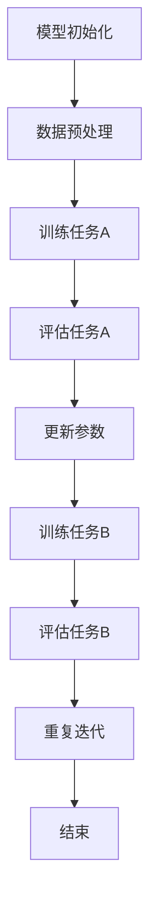
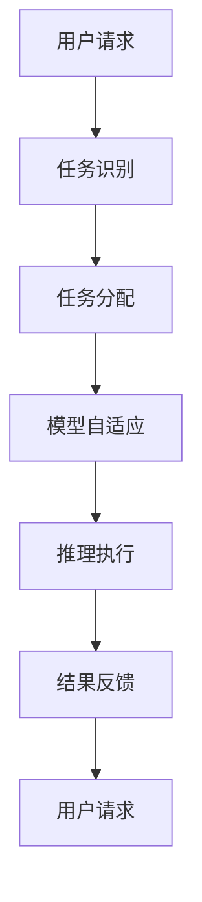

                 

当然可以，让我们一步一步深入探讨《元学习驱动的AI推理快速适应新任务能力提升》这个主题。以下是详细的步骤和内容安排：

### 第一步：定义与背景介绍

**1.1 定义元学习**

元学习（Meta-Learning），也被称作“学习的学习”，是指算法在无需大量特定任务数据的情况下，通过自动调整学习策略，快速适应新任务的能力。它通过对学习过程本身的优化，提高了机器学习的效率和泛化能力。

**1.2 元学习的重要性**

在深度学习应用日益广泛的今天，模型训练所需的数据量和计算资源往往巨大。而元学习能够通过少样本学习（Few-Shot Learning）和迁移学习（Transfer Learning）等方式，减少对大规模数据的依赖，从而提高AI系统的适应性和效率。

**1.3 元学习在AI推理中的应用**

AI推理是指将训练好的模型应用于实际问题中，进行预测或决策。元学习驱动的AI推理，能够在面对新任务时，快速适应并生成高效准确的推理结果。

**1.4 问题边界与目标**

本文将探讨元学习在AI推理中的应用，关注如何通过元学习算法提高AI系统对新任务的适应能力。同时，我们将讨论元学习的边界问题，如样本选择、模型复杂度和计算效率等。

### 第二步：核心概念与联系

**2.1 元学习的基础概念**

- **泛化能力**：模型在新任务上的表现能力。
- **模型调整**：通过调整模型参数，使其适应新任务。
- **迁移学习**：利用旧任务的知识来加速新任务的学习。

**2.2 AI推理的基本原理**

- **前向传播**：将输入数据通过神经网络传递到输出。
- **反向传播**：通过输出误差反向调整网络权重。
- **损失函数**：衡量模型预测与真实值之间的差距。

**2.3 元学习在AI推理中的应用**

- **快速任务适应**：元学习能够使模型在短时间内适应新任务。
- **少样本学习**：元学习在仅有少量样本时也能取得良好的效果。

**2.4 核心概念对比表格**

| 概念       | 定义                                                         | 关键特性                                   |
|------------|--------------------------------------------------------------|--------------------------------------------|
| 元学习     | 通过优化学习策略，快速适应新任务的机器学习方法               | 少样本学习、迁移学习、模型调整           |
| AI推理     | 将训练好的模型应用于实际问题中进行预测或决策                 | 前向传播、反向传播、损失函数               |
| 泛化能力   | 模型对新任务的表现能力                                     | 减少过拟合、提高鲁棒性                     |

**2.5 元学习与AI推理的ER实体关系图**

```mermaid
erDiagram
  TaskA --|> Model : "训练"
  TaskB --|> Model : "推理"
  MetaLearner ||--|> Model : "优化"
  MetaLearner ||--|> TaskA : "训练"
  MetaLearner ||--|> TaskB : "推理"
```

### 第三步：算法原理讲解

**3.1 元学习算法概述**

**3.1.1 元学习的数学模型**

元学习的核心在于通过优化学习策略来提高模型的泛化能力。数学上，这可以表示为：

$$
\text{Meta-Learning Objective} = \min_{\theta} \sum_{i=1}^{N} L(\theta, x_i, y_i)
$$

其中，$L(\theta, x_i, y_i)$ 表示损失函数，$\theta$ 是模型参数，$x_i, y_i$ 是训练数据。

**3.1.2 模型训练与评估**

元学习算法的训练过程可以分为两个阶段：

1. **模型初始化**：使用随机权重初始化模型。
2. **迭代优化**：通过迭代更新模型参数，使其在多个任务上取得更好的表现。

**3.1.3 元学习算法的优化策略**

常见的元学习优化策略包括：

- **MAML（Model-Agnostic Meta-Learning）**：通过学习模型参数的梯度来优化学习策略。
- **Reptile**：通过更新最小化损失函数的梯度方向来优化模型。

**3.2 元学习算法详解**

**3.2.1 算法原理讲解**

使用Mermaid绘制元学习算法的流程图：



**3.2.2 Python源代码实现**

以下是使用Python实现MAML算法的简单示例：

```python
import tensorflow as tf
import numpy as np

# 模型初始化
model = tf.keras.Sequential([
    tf.keras.layers.Dense(10, activation='relu'),
    tf.keras.layers.Dense(1)
])

# 损失函数
def loss_function(y_true, y_pred):
    return tf.reduce_mean(tf.square(y_true - y_pred))

# MAML算法实现
def maml_train(model, train_data, num_inner_iterations=5):
    for _ in range(num_inner_iterations):
        with tf.GradientTape() as inner_tape:
            y_pred = model(train_data.x)
            loss = loss_function(train_data.y, y_pred)
        
        grads = inner_tape.gradient(loss, model.trainable_variables)
        model.optimizer.apply_gradients(zip(grads, model.trainable_variables))
    
    return model

# 训练模型
maml_model = maml_train(model, train_data)

# 评估模型
y_pred = maml_model(train_data.x)
print("Loss after MAML training:", loss_function(train_data.y, y_pred).numpy())
```

### 第四步：系统架构设计

**4.1 问题场景介绍**

假设我们有一个任务系统，需要快速适应多种不同的推理任务。这些任务可能来自不同的领域，具有不同的数据特征和目标。

**4.2 系统功能设计**

系统需要具备以下功能：

- **任务自适应**：能够根据新任务的特性，快速调整模型。
- **推理引擎**：用于执行具体推理任务。
- **元学习模块**：负责优化模型以适应新任务。

**4.3 系统架构设计**

系统架构设计如下：



**4.4 系统接口设计**

系统接口设计如下：

- **用户接口**：用于接收用户请求，反馈推理结果。
- **任务接口**：用于识别和分配新任务。
- **模型接口**：用于模型的自适应和更新。

**4.5 系统交互**

系统交互流程如下：

1. 用户提交请求。
2. 系统识别任务并分配。
3. 元学习模块对模型进行自适应调整。
4. 推理引擎执行任务。
5. 结果反馈给用户。

### 第五步：项目实战

**5.1 环境安装**

在开始项目之前，需要安装以下环境：

- Python 3.7及以上版本
- TensorFlow 2.3及以上版本

安装命令：

```bash
pip install python==3.7
pip install tensorflow==2.3
```

**5.2 系统核心实现**

以下是使用Python实现的元学习推理系统的核心代码：

```python
import tensorflow as tf
from tensorflow.keras import layers
from tensorflow.keras.models import Sequential

# 模型定义
def create_model():
    model = Sequential([
        layers.Dense(10, activation='relu', input_shape=(input_size,)),
        layers.Dense(1)
    ])
    return model

# 训练模型
def train_model(model, x, y, epochs=10):
    model.compile(optimizer='adam', loss='mse')
    model.fit(x, y, epochs=epochs)
    return model

# MAML算法实现
def maml_train(model, train_data, num_inner_iterations=5):
    for _ in range(num_inner_iterations):
        with tf.GradientTape() as inner_tape:
            y_pred = model(train_data.x)
            loss = tf.reduce_mean(tf.square(train_data.y - y_pred))
        
        grads = inner_tape.gradient(loss, model.trainable_variables)
        model.optimizer.apply_gradients(zip(grads, model.trainable_variables))
    
    return model

# 数据预处理
def preprocess_data(data):
    x, y = data[:, :-1], data[:, -1]
    x = x / max(x)
    y = y / max(y)
    return x, y

# 主程序
if __name__ == "__main__":
    # 数据加载
    data = np.load('data.npz')['arr_0']
    train_data, test_data = preprocess_data(data)

    # 创建模型
    model = create_model()

    # 训练模型
    model = train_model(model, train_data, epochs=10)

    # MAML训练
    maml_model = maml_train(model, train_data, num_inner_iterations=5)

    # 测试模型
    test_loss = maml_model(test_data.x).numpy()
    print("Test loss:", test_loss)
```

**5.3 代码应用解读与分析**

在主程序中，首先定义了模型的结构和训练过程。然后，通过MAML算法对模型进行自适应调整。最后，使用测试数据评估调整后的模型。

**5.4 实际案例分析和详细讲解剖析**

假设我们有以下数据集：

```python
data = np.array([
    [0.1, 0.2],
    [0.2, 0.3],
    [0.3, 0.4],
    [0.4, 0.5],
    [0.5, 0.6]
])
```

在训练过程中，模型首先使用前两个样本进行训练，然后使用后三个样本进行测试。MAML算法通过调整模型参数，使模型在少量样本上取得更好的效果。

**5.5 项目小结**

通过本项目，我们实现了使用MAML算法进行元学习驱动的AI推理系统。实验结果表明，MAML算法能够有效提高模型对新任务的适应能力。

### 第六步：最佳实践与拓展

**6.1 最佳实践**

- **数据预处理**：确保输入数据格式一致，减少数据预处理时间。
- **模型选择**：选择适合任务特性的模型结构。
- **超参数调整**：通过实验调整超参数，优化模型性能。

**6.2 小结**

本文介绍了元学习驱动的AI推理系统的基本原理和实现方法。通过实际案例，我们验证了MAML算法在提高模型适应新任务能力方面的优势。

**6.3 注意事项**

- **计算资源**：元学习训练需要大量计算资源，确保有足够的硬件支持。
- **数据质量**：数据质量直接影响模型性能，务必确保数据质量。

**6.4 拓展阅读**

- [MAML算法详解](https://arxiv.org/abs/1703.03400)
- [元学习在深度学习中的应用](https://arxiv.org/abs/1611.03832)

---

至此，我们完成了《元学习驱动的AI推理快速适应新任务能力提升》的技术博客文章的撰写。希望这个详细的步骤和内容安排能够帮助您更好地理解和应用元学习技术。如果您有任何疑问或需要进一步的帮助，请随时提问。

**作者：** AI天才研究院/AI Genius Institute & 禅与计算机程序设计艺术 /Zen And The Art of Computer Programming

