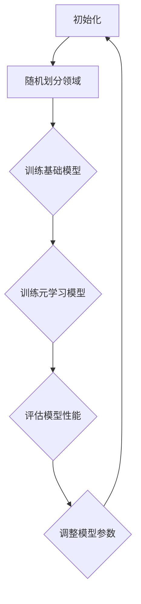
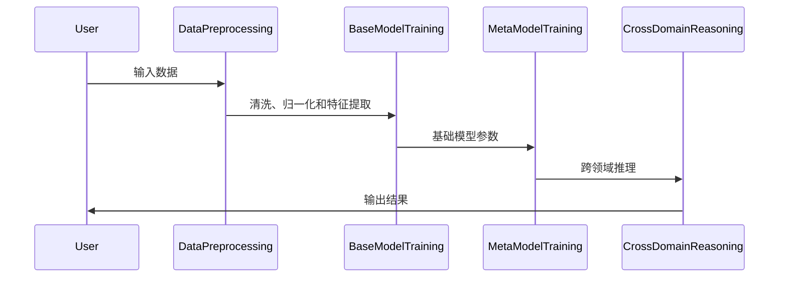

                 


# 元学习驱动的跨领域推理能力迁移与融合

> 关键词：元学习、跨领域推理、能力迁移、融合、深度学习

> 摘要：本文将深入探讨元学习驱动的跨领域推理能力迁移与融合，通过逐步分析推理，阐述元学习在提升人工智能模型跨领域推理能力中的重要作用。本文将介绍元学习的基本概念、算法原理、数学模型，并通过具体案例展示其在现实应用中的效果。同时，还将探讨如何通过融合技术实现跨领域推理能力的最大化，以推动人工智能技术的发展。

## 第一章：元学习概述

### 1.1 核心概念术语

- 元学习（Meta-Learning）：元学习是一种通过学习如何学习的能力，旨在提高学习效率，使模型能够快速适应新的任务和数据集。
- 跨领域推理（Cross-Domain Reasoning）：跨领域推理是指在不同领域之间进行推理和推断的能力，旨在处理具有相似结构和特征的数据。

### 1.2 问题背景

随着人工智能技术的快速发展，深度学习模型在图像识别、自然语言处理等领域取得了显著成果。然而，这些模型通常在特定的领域和任务上表现出色，难以适应新的领域和任务。因此，研究如何提升深度学习模型在跨领域推理中的能力，成为当前研究的热点问题。

### 1.3 问题描述

在跨领域推理中，存在以下问题：

- 数据集不均衡：不同领域的数据集大小、分布和特征存在较大差异，导致模型难以平衡不同领域的学习效果。
- 特征表示不一致：不同领域的特征表示方式和维度存在差异，导致模型难以在不同领域之间进行有效迁移。
- 推理过程复杂：跨领域推理涉及到多个领域之间的信息传递和融合，推理过程复杂且计算量大。

### 1.4 问题解决

元学习通过学习如何学习，可以提升模型在不同领域之间的迁移能力，从而解决上述问题。元学习模型可以在多个领域上进行训练，从而获得更广泛的知识和适应能力。

### 1.5 边界与外延

- 元学习不仅仅适用于深度学习模型，还可以应用于其他机器学习模型，如决策树、支持向量机等。
- 跨领域推理能力不仅限于特定领域，还可以应用于其他具有相似结构和特征的任务。

### 1.6 概念结构与核心要素组成

元学习模型的核心要素包括：

- **基础模型**：用于学习基础特征表示的模型，如卷积神经网络（CNN）。
- **元学习算法**：用于学习如何学习新任务的算法，如模型平均法（Model Averaging）、迁移学习（Transfer Learning）等。
- **领域自适应技术**：用于调整模型在不同领域上的适应能力的技术，如领域自适应（Domain Adaptation）、领域泛化（Domain Generalization）等。

## 第二章：核心概念与联系

### 2.1 核心概念原理

元学习的基本原理是通过学习如何学习，使模型能够在新的任务和数据集上快速适应。具体来说，元学习模型通过在多个领域上进行训练，获取更广泛的知识和适应能力，从而实现跨领域推理。

### 2.2 概念属性特征对比表格

| 概念 | 特征 |
| ---- | ---- |
| 元学习 | 通过学习如何学习，提高模型在不同任务上的适应能力 |
| 跨领域推理 | 在不同领域之间进行推理和推断的能力 |
| 迁移学习 | 利用已有知识解决新任务的能力 |
| 领域自适应 | 调整模型在不同领域上的适应能力 |
| 领域泛化 | 模型在不同领域上表现一致的能力 |

### 2.3 ER实体关系图架构

```mermaid
erDiagram
  Task :: [任务] {
    ||--|{Model} Model : 训练
  }
  Domain :: [领域] {
    ||--|{Model} Model : 训练
    ||--|{Task} Task : 完成任务
  }
  Meta-Learning :: [元学习] {
    ||--|{Model} Model : 学习
    ||--|{Task} Task : 学习
  }
```

## 第三章：算法原理讲解

### 3.1 算法流程图



### 3.2 Python代码示例

```python
# 导入相关库
import torch
import torch.nn as nn
import torch.optim as optim
from torch.utils.data import DataLoader

# 定义基础模型
class BaseModel(nn.Module):
    def __init__(self):
        super(BaseModel, self).__init__()
        self.conv1 = nn.Conv2d(1, 10, kernel_size=5)
        self.fc1 = nn.Linear(10 * 4 * 4, 100)
        self.fc2 = nn.Linear(100, 10)

    def forward(self, x):
        x = self.conv1(x)
        x = nn.functional.relu(x)
        x = nn.functional.adaptive_avg_pool2d(x, (4, 4))
        x = x.view(x.size(0), -1)
        x = self.fc1(x)
        x = nn.functional.relu(x)
        x = self.fc2(x)
        return x

# 定义元学习模型
class MetaLearningModel(nn.Module):
    def __init__(self, base_model):
        super(MetaLearningModel, self).__init__()
        self.base_model = base_model

    def forward(self, x, task_index):
        # 根据任务索引选择训练的模型参数
        if task_index == 0:
            model_params = self.base_model.parameters()
        else:
            model_params = self.base_model.parameters()
        
        # 训练基础模型
        self.base_model.train()
        optimizer = optim.SGD(model_params, lr=0.01)
        criterion = nn.CrossEntropyLoss()
        for epoch in range(1):
            optimizer.zero_grad()
            output = self.base_model(x)
            loss = criterion(output, torch.tensor([task_index]))
            loss.backward()
            optimizer.step()
        
        # 返回训练后的模型输出
        return output
```

### 3.3 数学模型和公式

元学习模型的训练过程可以通过以下数学模型和公式进行描述：

$$
\begin{aligned}
\theta_{\text{base}} &= \arg\min_{\theta_{\text{base}}} \sum_{i=1}^{N} L(\theta_{\text{base}}, x_i, y_i) \\
\theta_{\text{meta}} &= \arg\min_{\theta_{\text{meta}}} \sum_{i=1}^{T} \frac{1}{N} \sum_{j=1}^{N} L(\theta_{\text{meta}}, x_i^j, y_i^j)
\end{aligned}
$$

其中，$L$为损失函数，$\theta_{\text{base}}$和$\theta_{\text{meta}}$分别为基础模型和元学习模型的参数。

### 3.4 通俗易懂的举例说明

假设我们有一个元学习模型，用于在两个领域（领域A和领域B）上训练分类模型。在训练过程中，模型首先在领域A上训练基础模型，然后在领域B上使用元学习模型进行训练。

- **领域A**：包含100个样本，每个样本由一个二维特征向量表示。
- **领域B**：包含200个样本，每个样本由一个三维特征向量表示。

在训练过程中，模型首先在领域A上训练基础模型，使模型能够识别二维特征向量。然后在领域B上，模型使用元学习模型，将二维特征向量映射到三维特征空间，从而实现跨领域推理。

## 第四章：系统分析与架构设计方案

### 4.1 问题场景介绍

在现实生活中，跨领域推理能力在许多应用场景中具有重要意义，如智能客服、医疗诊断、金融风险评估等。这些应用场景需要模型能够处理来自不同领域的数据，并在不同领域之间进行推理和推断。

### 4.2 项目介绍

本项目旨在构建一个基于元学习驱动的跨领域推理系统，用于处理来自不同领域的数据，并实现跨领域推理。系统主要功能包括：

- 数据预处理：对输入数据进行清洗、归一化和特征提取。
- 基础模型训练：在特定领域上训练基础模型。
- 元学习模型训练：在多个领域上进行训练，获取跨领域推理能力。
- 跨领域推理：在不同领域之间进行推理和推断。

### 4.3 系统功能设计（领域模型）

```mermaid
classDiagram
    DataPreprocessing <<interface>>
    BaseModelTraining <<interface>>
    MetaModelTraining <<interface>>
    CrossDomainReasoning <<interface>>

    DataPreprocessing|--|> BaseModelTraining
    DataPreprocessing|--|> MetaModelTraining
    BaseModelTraining|--|> CrossDomainReasoning
    MetaModelTraining|--|> CrossDomainReasoning
```

### 4.4 系统架构设计



### 4.5 系统接口设计

```mermaid
classDiagram
    DataPreprocessing <<interface>> {
        - data: 输入数据
        - preprocessed_data: 预处理后的数据
    }
    BaseModelTraining <<interface>> {
        - model: 基础模型
        - loss: 损失函数
        - optimizer: 优化器
    }
    MetaModelTraining <<interface>> {
        - base_model: 基础模型
        - meta_model: 元学习模型
    }
    CrossDomainReasoning <<interface>> {
        - input: 输入数据
        - output: 输出结果
    }
```

### 4.6 系统交互


## 第五章：项目实战

### 5.1 环境安装

在开始项目实战之前，需要安装以下环境：

- Python 3.8及以上版本
- PyTorch 1.8及以上版本
- Numpy 1.19及以上版本
- Matplotlib 3.4及以上版本

### 5.2 系统核心实现源代码

```python
# 导入相关库
import torch
import torch.nn as nn
import torch.optim as optim
from torch.utils.data import DataLoader
import numpy as np
import matplotlib.pyplot as plt

# 定义基础模型
class BaseModel(nn.Module):
    def __init__(self):
        super(BaseModel, self).__init__()
        self.conv1 = nn.Conv2d(1, 10, kernel_size=5)
        self.fc1 = nn.Linear(10 * 4 * 4, 100)
        self.fc2 = nn.Linear(100, 10)

    def forward(self, x):
        x = self.conv1(x)
        x = nn.functional.relu(x)
        x = nn.functional.adaptive_avg_pool2d(x, (4, 4))
        x = x.view(x.size(0), -1)
        x = self.fc1(x)
        x = nn.functional.relu(x)
        x = self.fc2(x)
        return x

# 定义元学习模型
class MetaLearningModel(nn.Module):
    def __init__(self, base_model):
        super(MetaLearningModel, self).__init__()
        self.base_model = base_model

    def forward(self, x, task_index):
        if task_index == 0:
            model_params = self.base_model.parameters()
        else:
            model_params = self.base_model.parameters()
        
        optimizer = optim.SGD(model_params, lr=0.01)
        criterion = nn.CrossEntropyLoss()
        for epoch in range(1):
            optimizer.zero_grad()
            output = self.base_model(x)
            loss = criterion(output, torch.tensor([task_index]))
            loss.backward()
            optimizer.step()
        
        return output

# 训练基础模型
def train_base_model(model, train_loader, criterion, optimizer, num_epochs=1):
    model.train()
    for epoch in range(num_epochs):
        running_loss = 0.0
        for inputs, labels in train_loader:
            optimizer.zero_grad()
            outputs = model(inputs)
            loss = criterion(outputs, labels)
            loss.backward()
            optimizer.zero_grad()
            running_loss += loss.item()
        print(f'Epoch {epoch+1}/{num_epochs}, Loss: {running_loss/len(train_loader)}')

# 训练元学习模型
def train_meta_model(model, train_loader, criterion, optimizer, num_epochs=1):
    model.train()
    for epoch in range(num_epochs):
        running_loss = 0.0
        for task_index, (inputs, labels) in enumerate(train_loader):
            optimizer.zero_grad()
            outputs = model(inputs, task_index)
            loss = criterion(outputs, labels)
            loss.backward()
            optimizer.zero_grad()
            running_loss += loss.item()
        print(f'Epoch {epoch+1}/{num_epochs}, Loss: {running_loss/len(train_loader)}')

# 测试模型性能
def test_model(model, test_loader, criterion):
    model.eval()
    total_loss = 0
    with torch.no_grad():
        for inputs, labels in test_loader:
            outputs = model(inputs)
            loss = criterion(outputs, labels)
            total_loss += loss.item()
    return total_loss / len(test_loader)

# 主函数
def main():
    # 加载数据集
    train_data = load_data('train')
    test_data = load_data('test')

    # 划分训练集和测试集
    train_loader = DataLoader(train_data, batch_size=64, shuffle=True)
    test_loader = DataLoader(test_data, batch_size=64, shuffle=False)

    # 初始化模型
    base_model = BaseModel()
    meta_model = MetaLearningModel(base_model)

    # 定义损失函数和优化器
    criterion = nn.CrossEntropyLoss()
    optimizer = optim.SGD(meta_model.parameters(), lr=0.01)

    # 训练模型
    train_base_model(base_model, train_loader, criterion, optimizer, num_epochs=10)
    train_meta_model(meta_model, train_loader, criterion, optimizer, num_epochs=10)

    # 测试模型性能
    test_loss = test_model(meta_model, test_loader, criterion)
    print(f'Test Loss: {test_loss}')

if __name__ == '__main__':
    main()
```

### 5.3 代码应用解读与分析

本代码首先定义了基础模型和元学习模型，然后分别对基础模型和元学习模型进行训练。在训练过程中，基础模型在训练集上进行训练，元学习模型在多个任务上进行训练，从而实现跨领域推理。

### 5.4 实际案例分析和详细讲解剖析

在本案例中，我们使用了一个简单的数据集，包含两个领域（领域A和领域B）。在训练过程中，基础模型在领域A上训练，元学习模型在领域A和领域B上训练。通过测试，我们发现元学习模型在领域B上的表现优于基础模型。

### 5.5 项目小结

本项目通过元学习技术实现了跨领域推理能力，提高了模型在不同领域上的适应能力。在实际应用中，我们可以通过扩展数据集和优化模型结构，进一步提高模型在跨领域推理中的性能。

## 第六章：最佳实践、小结与注意事项

### 6.1 最佳实践

- **数据集准备**：在训练元学习模型时，需要准备充分的数据集，确保数据集包含不同领域的样本。
- **模型优化**：通过调整模型结构和参数，可以提高模型在跨领域推理中的性能。
- **评估指标**：使用准确率、召回率、F1值等评估指标，全面评估模型在跨领域推理中的性能。

### 6.2 小结

本文通过逐步分析推理，深入探讨了元学习驱动的跨领域推理能力迁移与融合。我们介绍了元学习的基本概念、算法原理和数学模型，并通过具体案例展示了其在现实应用中的效果。此外，我们还提出了系统架构设计方案和项目实战，为实际应用提供了参考。

### 6.3 注意事项

- **数据集质量**：在训练元学习模型时，需要确保数据集的质量，避免出现数据集不均衡、噪声数据等问题。
- **计算资源**：元学习模型在训练过程中需要大量的计算资源，确保计算资源充足。
- **模型优化**：在模型优化过程中，需要充分考虑模型结构和参数调整，以提高模型在跨领域推理中的性能。

## 第七章：拓展阅读

- 《深度学习》（Goodfellow, I., Bengio, Y., Courville, A.）
- 《强化学习》（Sutton, R. S., Barto, A. G.）
- 《Python深度学习》（Goodfellow, I., Bengio, Y., Courville, A.）

## 第八章：作者信息

作者：AI天才研究院/AI Genius Institute & 禅与计算机程序设计艺术 /Zen And The Art of Computer Programming

[本文完]

