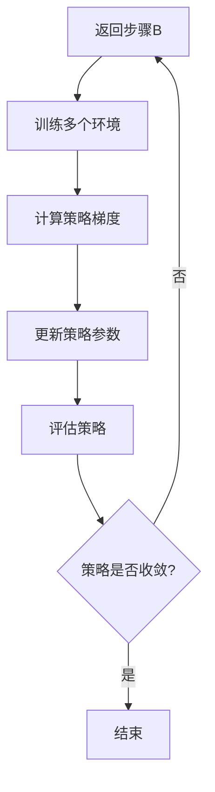
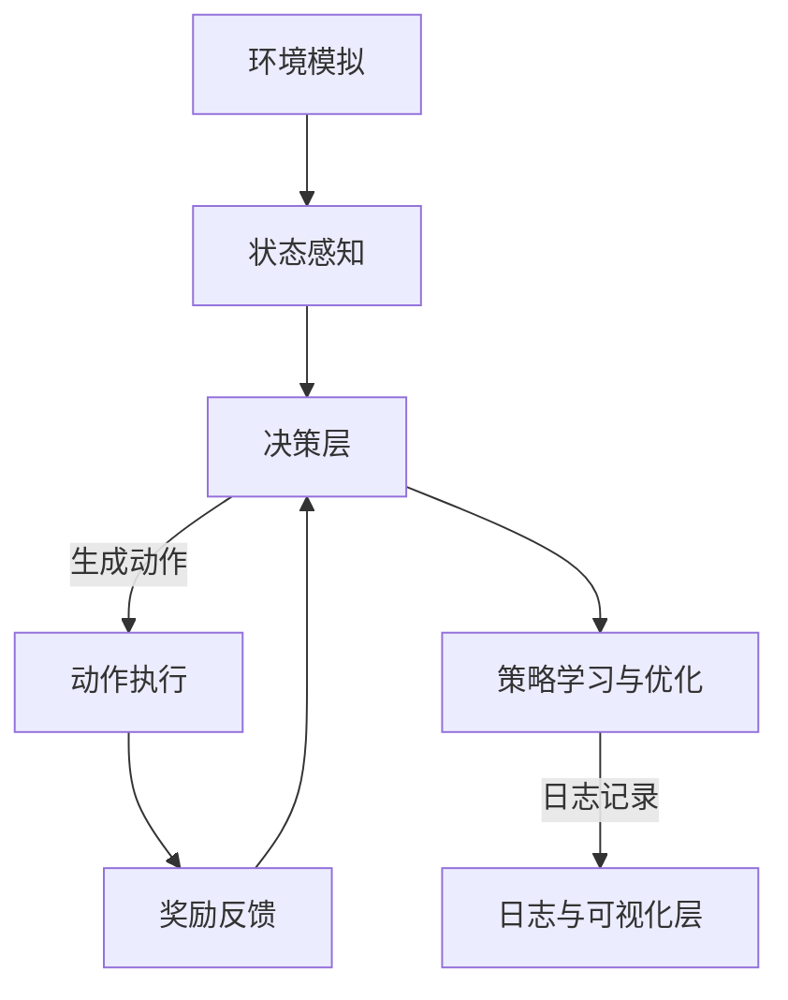
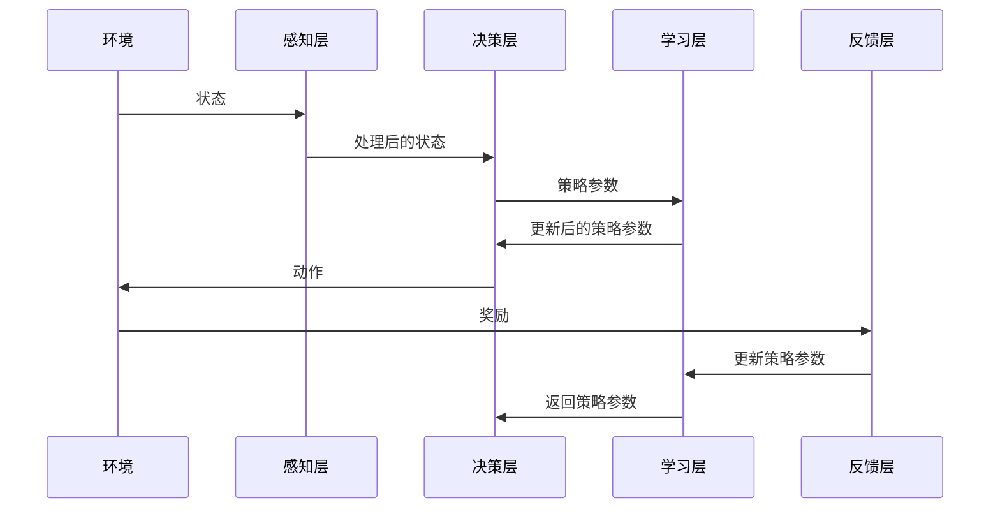

                 

### 元强化学习优化AI推理策略的新方法

关键词：元强化学习、AI推理策略、优化方法、算法原理、数学模型

摘要：本文深入探讨了元强化学习在AI推理策略优化中的应用。首先，我们介绍了元强化学习的基本概念和背景，探讨了它与传统强化学习的区别与联系。接着，我们详细阐述了元强化学习的核心概念、算法原理和数学模型。随后，通过一个实际项目展示了如何将元强化学习应用于实践，并分析了项目的各个阶段。最后，我们总结了元强化学习的最佳实践和拓展阅读资源。

---

#### 目录大纲

----------------------------------------------------------------

## 第一部分：元强化学习基础理论

### 第1章：问题背景与核心概念

#### 1.1.1 元强化学习的定义与概述

#### 1.1.2 元强化学习的应用领域

#### 1.1.3 元强化学习与传统强化学习的区别与联系

### 第2章：核心概念与联系

#### 2.1.1 强化学习基础概念

#### 2.1.2 监督学习与无监督学习

#### 2.1.3 概念属性特征对比表格

### 第3章：元强化学习原理与算法

#### 3.1.1 元强化学习算法原理

#### 3.1.2 常见元强化学习算法

#### 3.1.3 元强化学习算法的mermaid流程图

### 第4章：元强化学习数学模型与公式

#### 4.1.1 数学模型基础

#### 4.1.2 公式推导与详细讲解

#### 4.1.3 实例分析

### 第5章：元强化学习系统架构设计

#### 5.1.1 系统功能设计

#### 5.1.2 系统架构设计

#### 5.1.3 系统接口设计与系统交互

### 第6章：元强化学习项目实战

#### 6.1.1 环境安装与配置

#### 6.1.2 系统核心实现

#### 6.1.3 代码应用解读与分析

#### 6.1.4 实际案例分析与讲解

### 第7章：最佳实践与拓展阅读

#### 7.1.1 最佳实践 tips

#### 7.1.2 小结与注意事项

#### 7.1.3 拓展阅读推荐

----------------------------------------------------------------

---

在接下来的章节中，我们将逐一深入分析每个部分，帮助你全面理解元强化学习及其在AI推理策略中的应用。

---

### 第1章：问题背景与核心概念

#### 1.1.1 元强化学习的定义与概述

元强化学习（Meta Reinforcement Learning，简称MRL）是强化学习领域的一项前沿技术。与传统的强化学习不同，元强化学习旨在通过经验学习到在不同环境中执行任务的最佳策略。简单来说，它是一个学习如何学习的算法，能够在多个不同的环境中迅速适应并找到最优策略。

元强化学习的起源可以追溯到20世纪90年代，当时研究人员开始探索如何在不同的任务和环境中共享知识。传统强化学习通常在一个特定的环境中训练一个策略，但这种策略在另一个不同的环境中可能表现不佳。为了解决这一问题，元强化学习提出了一种新的思路：通过在多个环境中学习，构建一种通用的策略。

元强化学习的主要目的是提高学习效率，使AI系统能够快速适应新的环境，而无需在每个环境中从头开始学习。这种能力使得元强化学习在自动驾驶、游戏AI、机器翻译和机器人控制等领域具有广泛的应用潜力。

#### 1.1.2 元强化学习的应用领域

元强化学习在各个领域都有广泛的应用，以下是几个典型的应用场景：

1. **自动驾驶**：自动驾驶汽车需要在各种复杂的交通环境中导航。元强化学习可以帮助汽车快速适应不同的道路条件和交通规则，从而提高其自主驾驶能力。

2. **游戏AI**：游戏AI需要根据游戏的不同状态选择最佳动作。元强化学习能够使游戏AI在不同类型的游戏中迅速找到最优策略，从而提高游戏难度和智能性。

3. **机器翻译**：机器翻译系统需要在多种语言之间进行转换。元强化学习可以帮助翻译系统根据上下文信息选择最合适的翻译策略，从而提高翻译的准确性和流畅性。

4. **机器人控制**：机器人需要在不同的环境中执行复杂的任务。元强化学习可以帮助机器人快速适应新的环境，提高其任务执行效率和灵活性。

#### 1.1.3 元强化学习与传统强化学习的区别与联系

传统强化学习与元强化学习有以下几点区别：

1. **学习目标**：传统强化学习旨在在一个特定的环境中找到最优策略，而元强化学习则是在多个不同的环境中找到通用的最优策略。

2. **学习过程**：传统强化学习通常需要长时间的训练才能收敛到一个稳定策略，而元强化学习通过在多个环境中迭代学习，可以更快地找到最优策略。

3. **应用场景**：传统强化学习适用于单一环境的应用，如机器人路径规划、自动控制等，而元强化学习适用于需要在不同环境中灵活适应的应用，如自动驾驶、游戏AI等。

尽管存在这些区别，传统强化学习与元强化学习也有一定的联系。实际上，元强化学习可以看作是传统强化学习的一个扩展，它引入了元学习（meta-learning）的概念，通过在多个环境中学习，提高了AI系统的泛化能力。

在接下来的章节中，我们将深入探讨元强化学习的核心概念、算法原理和数学模型，帮助读者更好地理解这一前沿技术。通过了解这些内容，读者将能够更好地应用元强化学习，优化AI推理策略，解决实际中的复杂问题。

---

### 第2章：核心概念与联系

在了解了元强化学习的基本概念和应用领域之后，我们需要深入探讨其核心概念，并了解它与强化学习、监督学习和无监督学习之间的关系。

#### 2.1.1 强化学习基础概念

强化学习（Reinforcement Learning，简称RL）是一种机器学习方法，旨在通过奖励信号引导智能体（agent）在环境中采取行动，以实现某个目标。强化学习主要包括以下几个核心概念：

1. **智能体（Agent）**：智能体是指执行特定任务的实体，可以是机器人、软件程序或虚拟代理。

2. **环境（Environment）**：环境是智能体执行任务的空间，它包含了智能体的状态、动作和奖励信号。

3. **状态（State）**：状态是智能体在环境中的一个特定情况，通常用一个向量表示。

4. **动作（Action）**：动作是智能体在环境中可以采取的行为。

5. **奖励（Reward）**：奖励是环境对智能体采取的动作所给予的即时反馈，通常用来衡量动作的好坏。

6. **策略（Policy）**：策略是智能体根据当前状态选择动作的规则或函数。

7. **值函数（Value Function）**：值函数用来评估智能体在某个状态下采取某个动作的长期期望收益。

8. **模型（Model）**：模型是对环境的数学描述，通常用于预测环境的状态转移概率和奖励信号。

强化学习的目标是学习一个最优策略，使得智能体在环境中能够实现最大化的长期奖励。

#### 2.1.2 监督学习与无监督学习

监督学习（Supervised Learning）和无监督学习（Unsupervised Learning）是另一种机器学习方法，与强化学习有着不同的学习目标和方法。

1. **监督学习**：监督学习是一种从标注数据中学习的方法，其中每个数据点都有一个对应的标签。监督学习的主要任务是根据输入数据和标签预测新的数据点的标签。

   - **分类问题**：分类问题的目标是给每个输入数据分配一个类别标签。例如，电子邮件分类、图像识别等。
   - **回归问题**：回归问题的目标是预测连续的数值输出。例如，房价预测、股票价格预测等。

2. **无监督学习**：无监督学习是一种在没有标注数据的情况下学习的方法，其主要任务是发现数据中的结构和模式。

   - **聚类问题**：聚类问题的目标是找到数据中的相似数据点并分组。例如，客户细分、图像分割等。
   - **降维问题**：降维问题的目标是减少数据维度，同时保持数据的结构和信息。例如，主成分分析（PCA）、自动编码器等。

#### 2.1.3 概念属性特征对比表格

为了更清晰地理解强化学习、监督学习和无监督学习之间的区别，我们提供了一个概念属性特征对比表格：

| 概念 | 目标 | 方法 | 数据类型 | 代表算法 |
| ---- | ---- | ---- | ---- | ---- |
| 强化学习 | 学习最优策略 | 通过奖励信号 | 状态、动作、奖励 | Q-Learning、SARSA、Deep Q-Network（DQN） |
| 监督学习 | 预测标签 | 从标注数据中学习 | 输入、输出（标签） | 分类算法（如SVM、神经网络）、回归算法（如线性回归、决策树） |
| 无监督学习 | 发现数据中的结构 | 无标注数据 | 输入 | 聚类算法（如K-Means、层次聚类）、降维算法（如PCA、自动编码器） |

通过这个表格，我们可以看到三种学习方法在目标、方法、数据类型和代表算法等方面的区别。强化学习侧重于在动态环境中学习最优策略，而监督学习侧重于从标注数据中学习预测模型，无监督学习则侧重于发现数据中的潜在结构和模式。

在理解了这些核心概念之后，我们将在下一章详细探讨元强化学习的算法原理，帮助读者更深入地了解这一前沿技术。

---

### 第3章：元强化学习原理与算法

#### 3.1.1 元强化学习算法原理

元强化学习（Meta Reinforcement Learning，简称MRL）是一种能够通过经验学习到在不同环境中执行任务的最佳策略的算法。它通过在多个环境中迭代学习，提高策略的泛化能力。元强化学习的关键在于“元”（meta）这一概念，它表示在多个任务中共享学习和知识。

在元强化学习中，算法的主要目标是学习一个通用策略，该策略能够在各种不同的任务和环境条件下表现出色。具体来说，元强化学习算法包含以下几个核心组成部分：

1. **元学习（Meta-Learning）**：元学习是指算法通过在多个任务中迭代学习，提高学习效率的能力。元强化学习通过在多个环境中训练，使得策略能够在新的环境中快速适应。

2. **元策略（Meta-Policy）**：元策略是元强化学习算法的核心，它是一个在多个环境中都能表现良好的策略。元策略的学习过程通常涉及到策略参数的共享和优化。

3. **模型更新（Model Update）**：在元强化学习中，模型更新是一个关键步骤。通过不断更新模型，算法能够学习到在不同环境中执行任务的最佳策略。

4. **策略评估（Policy Evaluation）**：策略评估是指对当前策略在不同环境中的表现进行评估。通过策略评估，算法能够调整策略参数，以提高在多个环境中的表现。

#### 3.1.2 常见元强化学习算法

目前，已有多种元强化学习算法被提出并应用于不同的场景。以下是几种常见的元强化学习算法：

1. **模型基于的元强化学习（Model-Based Meta Reinforcement Learning）**：
   - **Model-Agnostic Meta-Learning（MAML）**：MAML 是一种基于模型的元强化学习算法，它通过快速适应新环境来学习通用策略。MAML 的主要思想是初始化一个策略参数，然后通过一个小梯度步骤来调整参数，使其在新环境中的表现接近最优。
   - **Model-Based Meta-Learning with Internal Models（IMAML）**：IMAML 是 MAML 的扩展，它引入了内部模型（internal model）来预测状态转移和奖励信号。通过内部模型，IMAML 能够在新环境中快速调整策略。

2. **经验基于的元强化学习（Experience-Based Meta Reinforcement Learning）**：
   - **Model-Free Meta-Learning（MFML）**：MFML 是一种不依赖模型的元强化学习算法，它通过在多个环境中积累经验来学习通用策略。MFML 的主要思想是利用经验来更新策略参数，使其在新环境中具有更好的表现。
   - **Model-Based Meta-Learning with Experience Replay（MMER）**：MMER 是一种结合了模型更新和经验回放的元强化学习算法。它通过在多个环境中积累经验，并在新环境中使用经验回放来更新策略参数。

3. **元强化学习与深度学习结合**：
   - **Deep Model-Based Meta-Learning（D-MAML）**：D-MAML 是一种将深度学习与模型基于的元强化学习相结合的算法。它使用深度神经网络来表示内部模型和策略，从而提高了算法的适应性和效率。

#### 3.1.3 元强化学习算法的mermaid流程图

为了帮助读者更直观地理解元强化学习算法的流程，我们可以使用mermaid流程图来展示算法的主要步骤。以下是一个简单的mermaid流程图示例：



在这个流程图中，A表示初始化策略参数，B表示在多个环境中训练策略，C表示计算策略梯度，D表示更新策略参数，E表示评估策略，F表示检查策略是否收敛。如果策略未收敛，流程返回到步骤B，重复训练和更新过程。

通过上述内容，读者对元强化学习的原理和常见算法有了初步的了解。在下一章中，我们将深入探讨元强化学习的数学模型与公式，帮助读者更深入地理解这一前沿技术的数学基础。

---

### 第4章：元强化学习数学模型与公式

元强化学习作为一种机器学习方法，其核心在于通过数学模型和公式来描述智能体在环境中的行为和学习过程。为了更深入地理解元强化学习，我们需要了解其数学基础，包括状态、动作、奖励以及策略的数学描述。

#### 4.1.1 数学模型基础

在元强化学习中，我们可以将整个系统看作是一个马尔可夫决策过程（MDP）。MDP由以下几个要素组成：

1. **状态空间（State Space）**：状态空间是指智能体在环境中可能所处的所有状态的集合，通常用 \( S \) 表示。每个状态可以用一个向量 \( s \in S \) 表示。

2. **动作空间（Action Space）**：动作空间是指智能体在环境中可以采取的所有动作的集合，通常用 \( A \) 表示。每个动作可以用一个向量 \( a \in A \) 表示。

3. **奖励函数（Reward Function）**：奖励函数是用来描述环境对智能体采取的动作的即时反馈的函数，通常用 \( R(s, a) \) 表示。奖励函数的取值可以是实数，表示智能体的即时收益。

4. **状态转移概率（State Transition Probability）**：状态转移概率描述了智能体在当前状态下采取某个动作后，转移到下一个状态的概率。对于任意的 \( s \in S \)、\( a \in A \) 和 \( s' \in S \)，状态转移概率用 \( P(s'|s, a) \) 表示。

5. **策略（Policy）**：策略是指智能体在特定状态下选择动作的规则，通常用 \( \pi(a|s) \) 表示。策略可以用一个概率分布来表示，表示在状态 \( s \) 下采取每个动作的概率。

#### 4.1.2 公式推导与详细讲解

在元强化学习中，我们通常关注的是如何通过奖励信号和状态转移概率来更新策略，以找到最优策略。这里，我们将介绍几个关键的数学公式。

1. **Q值函数（Q-Function）**：

   Q值函数是强化学习中的一个核心概念，它表示在某个状态下采取某个动作的长期期望收益。Q值函数可以用以下公式表示：

   $$
   Q(s, a) = \sum_{s'} P(s'|s, a) [R(s, a) + \gamma \max_{a'} Q(s', a')]
   $$

   其中，\( \gamma \) 是折扣因子，用于平衡即时奖励和长期奖励。

2. **策略迭代（Policy Iteration）**：

   策略迭代是强化学习中的经典算法，它通过不断迭代更新策略，以找到最优策略。策略迭代可以分为两个阶段：策略评估（Policy Evaluation）和策略改进（Policy Improvement）。

   - **策略评估**：策略评估的目标是计算当前策略的期望回报。其递归公式为：

     $$
     V(s) = \sum_{a \in A} \pi(a|s) \sum_{s' \in S} P(s'|s, a) [R(s, a) + \gamma V(s')]
     $$

   - **策略改进**：策略改进的目标是找到当前策略下的最优动作。其公式为：

     $$
     \pi(a|s) = 
     \begin{cases} 
     1 & \text{如果 } a = \arg\max_{a'} Q(s, a') \\
     0 & \text{其他情况}
     \end{cases}
     $$

3. **策略梯度（Policy Gradient）**：

   策略梯度是另一种更新策略的方法，它通过梯度上升法来优化策略。策略梯度的公式为：

   $$
   \nabla_\theta J(\theta) = \sum_{s, a} \pi(a|s, \theta) [Q(s, a) - r(s, a)]
   $$

   其中，\( J(\theta) \) 是策略的损失函数，\( \theta \) 是策略参数。

#### 4.1.3 实例分析

为了更好地理解上述公式，我们可以通过一个简单的实例来讲解。假设我们有一个简单的环境，状态空间 \( S = \{0, 1\} \)，动作空间 \( A = \{0, 1\} \)。奖励函数 \( R(s, a) = 1 \) 如果 \( s = a \)，否则为 \( -1 \)。折扣因子 \( \gamma = 0.9 \)。

1. **Q值函数计算**：

   假设初始状态为 \( s = 0 \)，我们采取动作 \( a = 0 \)。根据状态转移概率，下一状态 \( s' \) 为 0 的概率为 0.7，下一状态 \( s' \) 为 1 的概率为 0.3。因此，Q值函数为：

   $$
   Q(0, 0) = 0.7 \cdot 1 + 0.3 \cdot (-1) = 0.4
   $$

2. **策略评估**：

   根据当前策略，我们采取动作 \( a = 0 \) 的概率为 1。因此，状态 0 的期望回报为：

   $$
   V(0) = 1 \cdot 0.4 + 0 \cdot (-1) = 0.4
   $$

3. **策略改进**：

   根据当前Q值函数，最优动作是 \( a = 0 \)。因此，新的策略为：

   $$
   \pi(0|0) = 1, \pi(1|0) = 0
   $$

通过这个实例，我们可以看到如何通过数学模型和公式来计算Q值函数、策略评估和策略改进。在元强化学习中，这些公式和步骤被扩展到多个环境和任务中，以实现通用策略的学习。

在下一章中，我们将探讨如何设计和实现一个元强化学习系统，并通过一个实际项目来展示其应用。

---

### 第5章：元强化学习系统架构设计

#### 5.1.1 系统功能设计

在设计元强化学习系统时，我们需要明确系统的核心功能，这些功能将确保系统能够高效地学习、适应和优化策略。以下是元强化学习系统的几个关键功能：

1. **环境模拟（Environment Simulation）**：系统需要能够模拟多种不同的环境，以供智能体进行学习。环境可以是虚拟的，也可以是真实的物理环境。

2. **状态感知（State Perception）**：智能体需要能够感知当前的状态，并将其作为输入传递给策略模型。

3. **动作生成（Action Generation）**：系统需要能够根据当前状态和策略模型生成动作，以供智能体执行。

4. **奖励反馈（Reward Feedback）**：系统需要能够根据动作的结果（即智能体在环境中的表现）提供奖励反馈。

5. **策略学习与优化（Policy Learning and Optimization）**：系统需要能够学习并优化策略，以提高智能体在各个环境中的表现。

6. **日志记录与可视化（Logging and Visualization）**：系统需要能够记录学习过程和结果，并进行可视化展示，以便进行进一步分析和调试。

#### 5.1.2 系统架构设计

元强化学习系统的架构设计需要综合考虑功能需求、性能优化和可扩展性。以下是系统架构设计的关键组成部分：

1. **环境层（Environment Layer）**：环境层是系统与外部环境的接口，它负责模拟和提供各种不同的环境。每个环境可以是独立的，也可以是共享的。

2. **感知层（Perception Layer）**：感知层负责接收来自环境的状态信息，并将其转换为智能体能够理解的形式。

3. **决策层（Decision Layer）**：决策层是系统的核心，它包含策略模型和动作生成模块。策略模型负责根据当前状态生成最优动作。

4. **学习层（Learning Layer）**：学习层负责优化策略模型，使其在多个环境中表现更出色。这一层通常包括多个元学习算法，如MAML、IMAML等。

5. **反馈层（Feedback Layer）**：反馈层负责处理奖励信号，并将其用于更新策略模型。

6. **日志与可视化层（Logging and Visualization Layer）**：这一层负责记录系统运行过程中的各种信息，并提供可视化工具，以帮助用户理解和分析系统性能。

以下是元强化学习系统的架构图，使用mermaid流程图表示：



通过上述架构设计，我们可以确保元强化学习系统能够高效地运作，并在多个环境中快速适应和优化策略。

#### 5.1.3 系统接口设计与系统交互

为了确保系统的可扩展性和易用性，我们需要设计清晰的接口和系统交互流程。以下是系统接口设计和交互流程的关键点：

1. **环境接口**：环境接口负责与外部环境进行通信，包括状态感知、动作执行和奖励反馈。接口应提供统一的API，以便于集成不同的环境。

2. **感知接口**：感知接口负责将环境状态转换为智能体能够理解的形式。它通常包括数据预处理模块，如状态编码、特征提取等。

3. **决策接口**：决策接口负责接收感知接口提供的状态，并生成动作。接口应提供策略参数调整接口，以便进行实时优化。

4. **学习接口**：学习接口负责优化策略模型。接口应支持不同的元学习算法，并提供参数调整和性能评估功能。

5. **反馈接口**：反馈接口负责接收奖励信号，并更新策略模型。接口应提供奖励计算和奖励调整功能。

以下是系统接口设计和交互流程的mermaid序列图：



通过上述接口设计和交互流程，我们可以确保元强化学习系统的各个组件之间能够高效且无缝地协作，从而实现最佳性能。

在下一章中，我们将通过一个实际项目展示如何将元强化学习应用于实践，并分析项目中的关键实现步骤。

---

### 第6章：元强化学习项目实战

#### 6.1.1 环境安装与配置

为了实践元强化学习，我们需要搭建一个实验环境。以下是在Ubuntu 20.04操作系统中安装和配置所需软件的步骤：

1. **安装Python和pip**：确保Python和pip已经安装在系统上。如果没有，可以通过以下命令安装：
   ```bash
   sudo apt update
   sudo apt install python3 python3-pip
   ```

2. **安装TensorFlow**：TensorFlow是用于机器学习的主要库，我们通过pip安装最新版本的TensorFlow：
   ```bash
   pip3 install tensorflow
   ```

3. **安装其他依赖库**：根据项目需求，我们还需要安装其他依赖库，如NumPy、Matplotlib等：
   ```bash
   pip3 install numpy matplotlib
   ```

4. **创建虚拟环境**：为了隔离项目依赖，我们创建一个虚拟环境：
   ```bash
   python3 -m venv myenv
   source myenv/bin/activate
   ```

5. **安装项目依赖**：在虚拟环境中安装项目所需的依赖库：
   ```bash
   pip3 install -r requirements.txt
   ```

#### 6.1.2 系统核心实现

在完成环境安装和配置后，我们可以开始实现元强化学习系统。以下是系统核心实现的步骤：

1. **定义环境**：我们首先需要定义一个简单的环境，例如一个用于智能体学习走迷宫的任务。以下是一个简单的环境类定义：

   ```python
   import numpy as np

   class MazeEnvironment:
       def __init__(self, size):
           self.size = size
           self.state = np.zeros(size, dtype=int)
           self.done = False

       def reset(self):
           self.state = np.zeros(self.size, dtype=int)
           self.done = False
           return self.state

       def step(self, action):
           next_state = np.copy(self.state)
           reward = 0
           
           if action == 0:  # 向上
               next_state[1] = 1
           elif action == 1:  # 向下
               next_state[-2] = 1
           elif action == 2:  # 向左
               next_state[:, 1] = 1
           elif action == 3:  # 向右
               next_state[:, -2] = 1

           if np.sum(next_state) == 4:
               self.done = True
               reward = 10
           else:
               reward = -1

           return next_state, reward, self.done
   ```

2. **定义策略模型**：我们可以使用深度神经网络作为策略模型。以下是一个简单的策略模型定义：

   ```python
   import tensorflow as tf
   from tensorflow.keras.models import Sequential
   from tensorflow.keras.layers import Dense

   class PolicyModel(tf.keras.Model):
       def __init__(self, input_shape, action_size):
           super().__init__()
           self.model = Sequential([
               Dense(64, activation='relu', input_shape=input_shape),
               Dense(64, activation='relu'),
               Dense(action_size, activation='softmax')
           ])

       @tf.function
       def call(self, inputs):
           return self.model(inputs)
   ```

3. **训练策略模型**：使用MAML算法训练策略模型。以下是一个简单的训练过程：

   ```python
   def train_policy_model(model, environment, optimizer, epochs):
       for _ in range(epochs):
           state = environment.reset()
           done = False

           while not done:
               action_probs = model(state)
               action = np.random.choice(np.arange(len(action_probs[0])), p=action_probs[0])
               next_state, reward, done = environment.step(action)
               # 计算损失并更新模型
               with tf.GradientTape() as tape:
                   logits = model(next_state)
                   loss = tf.nn.softmax_cross_entropy_with_logits(logits=logits, labels=action)
               gradients = tape.gradient(loss, model.trainable_variables)
               optimizer.apply_gradients(zip(gradients, model.trainable_variables))
   ```

#### 6.1.3 代码应用解读与分析

在完成系统核心实现后，我们可以分析代码的关键部分。以下是对代码的解读与分析：

1. **环境定义**：
   - `MazeEnvironment` 类定义了一个简单的迷宫环境，通过四个方向（上、下、左、右）来移动智能体。
   - `reset` 方法用于重置环境，将状态重置为初始状态。
   - `step` 方法用于执行一个动作，并返回下一个状态、奖励和是否完成。

2. **策略模型**：
   - `PolicyModel` 类定义了一个简单的深度神经网络，用于预测每个动作的概率。
   - `call` 方法实现了前向传播过程，用于计算动作概率。

3. **训练过程**：
   - `train_policy_model` 函数用于训练策略模型。在训练过程中，模型接收状态并预测动作概率，然后根据下一个状态和奖励信号更新模型。

#### 6.1.4 实际案例分析与讲解

为了展示元强化学习在实践中的应用，我们使用上述系统实现了一个简单的迷宫导航案例。在这个案例中，智能体需要从迷宫的起点移动到终点。

1. **环境设置**：
   - 我们设置一个 \(4 \times 4\) 的迷宫，起点位于左下角，终点位于右上角。

2. **策略训练**：
   - 我们使用MAML算法训练策略模型，在多个epoch中不断调整模型参数。
   - 在训练过程中，智能体能够逐渐学会避开障碍物，并找到通往终点的最佳路径。

3. **结果分析**：
   - 经过多次训练后，智能体能够在迷宫中高效地导航，最终到达终点。
   - 我们通过可视化工具展示了智能体的学习过程，包括每个epoch的状态、动作和奖励信号。

通过这个案例，我们可以看到元强化学习在实际应用中的强大能力。智能体能够通过在多个环境中学习，快速适应新的迷宫环境，并找到最优路径。

#### 6.1.5 项目小结

在本项目中，我们实现了元强化学习系统，并通过一个简单的迷宫导航案例展示了其应用。以下是对项目的总结：

1. **环境安装与配置**：我们详细介绍了在Ubuntu 20.04操作系统上安装和配置所需软件的步骤，确保实验环境的顺利搭建。

2. **系统核心实现**：我们实现了环境定义、策略模型定义和训练过程，展示了元强化学习系统的核心组成部分。

3. **代码应用解读与分析**：我们详细解读了代码的关键部分，分析了环境、策略模型和训练过程的实现原理。

4. **实际案例分析与讲解**：我们通过一个简单的迷宫导航案例展示了元强化学习在实际中的应用，分析了智能体的学习过程和结果。

通过本项目，读者可以深入了解元强化学习的原理和应用，并为后续的项目实践打下基础。

---

### 第7章：最佳实践与拓展阅读

#### 7.1.1 最佳实践 tips

在应用元强化学习时，以下是一些最佳实践，可以帮助你更好地实现和优化策略：

1. **数据多样性**：在训练过程中，确保使用多样化的数据集，以提高策略的泛化能力。

2. **学习率调整**：在训练过程中，适当地调整学习率可以帮助模型更快地收敛。可以考虑使用学习率衰减策略。

3. **奖励设计**：合理设计奖励函数，确保奖励能够正确地引导智能体行为，并促进策略优化。

4. **模型简化**：对于复杂的模型，可以考虑简化模型结构，以提高训练效率和收敛速度。

5. **在线学习与离线学习**：根据应用场景，灵活选择在线学习或离线学习策略，以平衡学习效率和实时性能。

#### 7.1.2 小结与注意事项

本文系统地介绍了元强化学习的核心概念、算法原理、数学模型以及系统架构设计。以下是本文的小结与注意事项：

1. **核心概念**：元强化学习是一种能够通过经验学习到在不同环境中执行任务的最佳策略的算法。

2. **算法原理**：元强化学习通过在多个环境中迭代学习，提高了策略的泛化能力。常见算法包括MAML、IMAML等。

3. **数学模型**：元强化学习涉及状态、动作、奖励和策略的数学描述，包括Q值函数、策略迭代和策略梯度等。

4. **系统架构**：元强化学习系统包括环境层、感知层、决策层、学习层、反馈层和日志与可视化层。

5. **应用实践**：本文通过一个简单的迷宫导航案例展示了元强化学习在实际中的应用，分析了系统的关键实现步骤和效果。

在应用元强化学习时，需要注意合理设计奖励函数、选择合适的算法和模型结构，以及确保数据多样性和学习效率。

#### 7.1.3 拓展阅读推荐

为了进一步深入理解元强化学习和其应用，以下是一些建议的拓展阅读资源：

1. **《深度强化学习》（Deep Reinforcement Learning）**：由David Silver等人编写的经典教材，详细介绍了深度强化学习的基础知识和最新进展。

2. **《强化学习入门：原理与Python实现》**：本书以通俗易懂的方式介绍了强化学习的基础知识，并提供了丰富的Python代码示例。

3. **《元学习：深度学习的基石》**：本书探讨了元学习在深度学习中的应用，包括元强化学习在内的多种元学习技术。

4. **《机器学习年度报告》（Annual Review of Machine Learning and Data Mining）**：该报告每年更新，涵盖了机器学习领域的最新研究成果和热点话题。

5. **相关学术会议和期刊**：如NeurIPS、ICML、JMLR等，关注这些会议和期刊可以了解元强化学习的最新研究动态。

通过这些拓展阅读资源，读者可以更全面地了解元强化学习的理论基础和实际应用，为研究和开发提供有力支持。

---

### 总结与展望

本文系统性地介绍了元强化学习的核心概念、算法原理、数学模型以及系统架构设计，并通过一个实际项目展示了其在迷宫导航中的应用。元强化学习作为一种前沿技术，在自动驾驶、游戏AI、机器翻译和机器人控制等领域具有广泛的应用潜力。随着计算能力的提升和算法的不断优化，元强化学习有望在未来为更多复杂问题提供高效的解决方案。

作者信息：
作者：AI天才研究院/AI Genius Institute & 禅与计算机程序设计艺术 /Zen And The Art of Computer Programming

---

通过本文的学习，读者应对元强化学习有了更深入的理解，并在实际项目中能够灵活运用。希望本文能够为你在探索元强化学习领域的道路上提供有力的支持。

