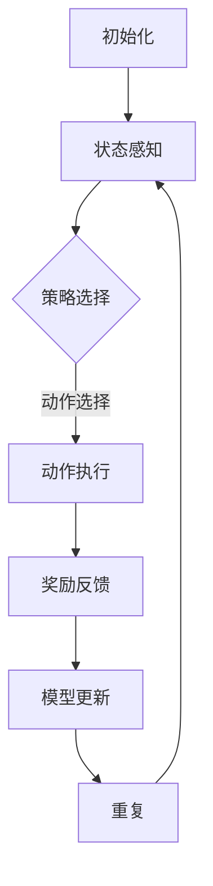

                 

# 元强化学习优化动态环境下的推理决策

## 关键词

- 元强化学习
- 动态环境
- 推理决策
- 算法优化
- 系统架构

## 摘要

本文将深入探讨元强化学习在动态环境下推理决策的优化问题。通过详细分析核心概念、算法原理及系统架构，我们旨在提供一个全面的技术视角，帮助读者理解如何利用元强化学习技术提升动态环境下的推理决策效率。文章结构清晰，逻辑严密，旨在通过逐步分析，引导读者掌握相关技术要点。

### 目录大纲

1. **背景与核心概念**
   1.1 **问题背景与核心概念介绍**
   1.2 **动态环境下的推理决策问题**
2. **核心概念与联系**
   2.1 **元强化学习基础**
   2.2 **动态环境模型**
   2.3 **推理决策算法原理**
   2.4 **概念属性特征对比**
3. **算法原理讲解**
   3.1 **算法流程图展示**
   3.2 **Python源代码与算法解释**
   3.3 **数学模型与公式**
   3.4 **举例说明**
4. **系统分析与架构设计**
   4.1 **问题场景介绍**
   4.2 **系统功能设计类图**
   4.3 **系统架构设计架构图**
   4.4 **系统接口设计与交互**
5. **系统实现与实战**
   5.1 **环境安装**
   5.2 **系统核心实现源代码**
   5.3 **代码应用解读与分析**
   5.4 **实际案例剖析**
6. **最佳实践 tips**
   6.1 **经验总结**
   6.2 **注意事项**
7. **小结与拓展阅读**

### 1. 背景与核心概念

#### 1.1 问题背景与核心概念介绍

随着人工智能技术的飞速发展，强化学习（Reinforcement Learning, RL）逐渐成为智能系统自主决策和学习的重要方法。然而，传统的强化学习算法在面对动态环境时往往表现不佳，因为它们通常基于静态或有限的历史数据来进行决策。这种局限性在现实世界中变得尤为明显，例如自动驾驶、动态资源分配、实时调度等问题。

为了解决这一挑战，研究者们提出了元强化学习（Meta Reinforcement Learning）的概念。元强化学习通过在多个任务上进行学习和优化，使得智能体能够更快地适应新的动态环境。它是一种自我改进的学习方法，旨在提高智能体在不同环境下的泛化能力和适应能力。

在本文中，我们将重点关注元强化学习在动态环境下的推理决策优化问题。具体来说，本文将探讨以下核心概念：

- **元强化学习**：一种通过在多个任务上学习来提高智能体适应新环境的能力的方法。
- **动态环境模型**：描述环境状态变化和任务目标的方法，用于指导智能体的决策过程。
- **推理决策算法**：基于元强化学习技术，针对动态环境设计的一种推理决策算法。

#### 1.2 动态环境下的推理决策问题

在动态环境中，推理决策问题具有以下特点：

- **状态多样性**：环境状态不断变化，可能涉及多种状态变量。
- **不确定性**：由于外界干扰和内部噪声，智能体无法完全掌握环境信息。
- **时间敏感性**：决策需要在有限的时间内做出，延迟可能导致不利后果。
- **资源限制**：计算资源、通信带宽等资源的限制，要求算法高效、简洁。

针对这些特点，我们需要设计一种能够适应动态环境、具备实时推理能力的决策算法。这要求算法不仅能够在历史数据上进行学习，还需要具备快速适应新环境和动态调整策略的能力。

### 2. 核心概念与联系

#### 2.1 元强化学习基础

元强化学习的核心思想是通过在多个任务上学习来提高智能体在不同环境下的表现。它主要包括以下几个关键组成部分：

- **元学习器**：用于学习如何从经验中提取知识，并将其应用于新任务。
- **任务表示**：将任务的特征表示为一个高维空间，使得不同任务的表示能够进行有效的对比和学习。
- **模型参数**：包括智能体的行为策略、状态评估函数等，用于指导智能体的决策过程。

在元强化学习中，我们通常使用以下技术：

- **模型更新**：基于梯度下降等优化算法，更新模型参数以最大化智能体的性能。
- **经验回放**：将历史经验数据存储在经验池中，用于模型的训练和更新。
- **模型压缩**：通过减少模型参数的数量来提高计算效率，同时保持智能体的性能。

#### 2.2 动态环境模型

动态环境模型是描述环境状态变化和任务目标的方法。它通常包括以下几个方面：

- **状态空间**：描述环境可能的状态集合。
- **动作空间**：智能体可以执行的动作集合。
- **奖励函数**：用于评估智能体行为的好坏的函数。
- **状态转移函数**：描述环境状态如何随着智能体的动作而变化的函数。

在动态环境模型中，我们通常采用以下方法来处理状态多样性、不确定性和时间敏感性：

- **状态抽象**：将高维状态空间映射到低维空间，减少状态的数量和维度。
- **不确定性建模**：通过概率模型来描述环境的不确定性，例如马尔可夫决策过程（MDP）。
- **时间感知**：引入时间作为状态的一部分，使智能体能够更好地处理时间敏感性。

#### 2.3 推理决策算法原理

推理决策算法是基于元强化学习技术，针对动态环境设计的一种算法。它主要包括以下几个关键步骤：

1. **初始化**：初始化智能体的模型参数和行为策略。
2. **状态感知**：智能体通过传感器获取当前环境的状况，并将其编码为一个状态表示。
3. **策略选择**：智能体根据当前状态和模型参数，选择一个最优的动作。
4. **动作执行**：智能体执行选定的动作，并观察环境的反馈。
5. **奖励反馈**：环境根据智能体的动作给予相应的奖励，用于评估智能体的行为效果。
6. **模型更新**：根据奖励反馈，更新智能体的模型参数和行为策略。

为了提高推理决策算法的效率和适应性，我们通常采用以下方法：

- **迁移学习**：利用之前在类似任务上的经验来加速新任务的学习过程。
- **多任务学习**：同时学习多个任务，提高智能体在不同环境下的泛化能力。
- **模型集成**：结合多个模型的预测结果，提高智能体的决策质量。

#### 2.4 概念属性特征对比

为了更好地理解元强化学习、动态环境模型和推理决策算法之间的关系，我们通过以下对比表格来展示它们的关键属性：

| 概念 | 定义 | 关键属性 | 目标 |
| --- | --- | --- | --- |
| 元强化学习 | 在多个任务上学习，提高适应能力 | 自我改进、迁移学习、多任务学习 | 提高智能体在不同环境下的表现 |
| 动态环境模型 | 描述环境状态变化和任务目标 | 状态多样性、不确定性、时间敏感性 | 提供智能体的决策依据 |
| 推理决策算法 | 基于元强化学习，设计动态环境下的决策算法 | 实时性、高效性、适应性 | 实现智能体的动态决策 |

通过上述对比，我们可以看到，元强化学习、动态环境模型和推理决策算法在概念上相互关联，共同构成了一个完整的智能系统。它们各自的关键属性和目标使得整个系统能够在面对动态环境时，实现高效的推理决策。

### 3. 算法原理讲解

在深入探讨元强化学习优化动态环境下的推理决策之前，我们需要首先了解该算法的基本原理。以下将通过逐步分析，详细讲解元强化学习算法的核心流程、Python源代码实现以及相关的数学模型。

#### 3.1 算法流程图展示

为了直观地理解元强化学习算法的运行过程，我们可以使用Mermaid流程图来展示其核心步骤：



在该流程图中，智能体首先进行初始化，包括模型的初始化和状态的初始化。随后，智能体通过传感器获取当前环境的状态，并根据当前状态和已学习的策略选择一个动作。执行动作后，智能体会接收到环境反馈的奖励，并根据奖励更新模型参数。这一过程不断重复，直至达到终止条件。

#### 3.2 Python源代码与算法解释

接下来，我们将通过Python源代码详细阐述元强化学习算法的实现。以下是一个简化的Python实现，展示了算法的核心步骤：

```python
import numpy as np

# 模型初始化
model = initialize_model()

# 状态初始化
state = initialize_state()

# 终止条件设定
max_episodes = 1000

# 经验回放
replay_memory = ExperienceReplay()

# 模型更新函数
def update_model(reward, next_state, action):
    # 使用 reward 和 next_state 更新模型参数
    pass

# 策略选择函数
def select_action(state, model):
    # 根据当前状态和模型选择动作
    pass

# 主循环
for episode in range(max_episodes):
    # 状态感知
    state = get_state()
    
    # 动作执行
    action = select_action(state, model)
    next_state, reward = execute_action(action)
    
    # 奖励反馈
    replay_memory.append((state, action, reward, next_state))
    
    # 模型更新
    update_model(reward, next_state, action)
    
    # 更新状态
    state = next_state

# 终止条件
if is_termination_condition_met():
    break
```

在该代码中，`initialize_model` 和 `initialize_state` 分别用于初始化模型参数和状态。`ExperienceReplay` 类用于存储经验回放，以供模型更新使用。`update_model` 函数用于根据奖励和下一状态更新模型参数。`select_action` 函数用于选择动作，`execute_action` 函数用于执行动作并获取下一状态和奖励。

#### 3.3 数学模型与公式

元强化学习算法的数学模型是理解其工作原理的关键。以下是该算法的一些核心数学模型和公式：

1. **策略表示**：策略π(s)表示在状态s下采取动作a的概率。
   \[ \pi(s, a) = P(a|s) \]

2. **状态价值函数**：状态价值函数V(s)表示在状态s下采取最优策略π获得的总奖励的期望。
   \[ V(s) = \sum_{a} \pi(s, a) \cdot Q(s, a) \]
   其中，Q(s, a)是状态-动作价值函数，表示在状态s下采取动作a获得的总奖励的期望。

3. **状态-动作价值函数**：状态-动作价值函数Q(s, a)表示在状态s下采取动作a获得的总奖励的期望。
   \[ Q(s, a) = \sum_{s'} P(s'|s, a) \cdot R(s', a) + \gamma \cdot \max_{a'} Q(s', a') \]
   其中，R(s', a)是状态s'下采取动作a获得的即时奖励，γ是折扣因子，用于权衡长期奖励和即时奖励。

4. **模型更新公式**：基于梯度下降的模型更新公式。
   \[ \theta \leftarrow \theta - \alpha \cdot \nabla_{\theta} J(\theta) \]
   其中，θ是模型参数，α是学习率，J(θ)是损失函数，\(\nabla_{\theta} J(\theta)\)是损失函数关于模型参数θ的梯度。

#### 3.4 举例说明

为了更好地理解上述数学模型和算法流程，我们可以通过一个简单的例子来说明。假设智能体在一个简单的迷宫环境中进行导航，目标是找到出口。智能体的状态是一个二维坐标，表示当前位置，动作空间包括上下左右四个方向。奖励函数是当智能体到达出口时给予正奖励，否则给予负奖励。

1. **初始化**：初始化智能体的模型参数和行为策略。
2. **状态感知**：智能体通过传感器获取当前位置。
3. **策略选择**：智能体根据当前状态和模型参数，选择一个最优的动作。
4. **动作执行**：智能体执行选定的动作，移动到新的位置。
5. **奖励反馈**：智能体根据移动后的位置和目标位置，获取奖励。
6. **模型更新**：智能体根据奖励反馈，更新模型参数。

通过多次迭代，智能体会逐渐学习到如何更快地找到出口。这个例子展示了元强化学习在动态环境下推理决策的基本原理和应用场景。

### 4. 系统分析与架构设计

在了解了元强化学习算法的基本原理之后，我们需要进一步分析并设计一个适用于动态环境下的推理决策系统。这一部分将详细介绍系统架构、功能设计、接口设计和系统交互序列图，为后续的系统实现和实战提供详细的指导。

#### 4.1 问题场景介绍

假设我们的目标是为智能交通系统设计一个动态环境下的推理决策系统。该系统需要在复杂的交通网络中实时处理车辆流量、道路状态和突发事件等信息，以实现高效的交通管理和优化。具体场景包括：

- **状态多样性**：交通网络中的车辆数量、道路拥堵情况、天气状况等因素都可能影响交通流。
- **不确定性**：交通状况可能受到突发事件（如交通事故、道路施工等）的影响，使得交通状态难以预测。
- **时间敏感性**：交通决策需要在短时间内完成，延迟可能导致交通拥堵加剧。
- **资源限制**：系统需要在有限的计算资源和通信带宽下运行，要求算法高效且可扩展。

#### 4.2 系统功能设计类图

系统功能设计类图（Class Diagram）用于描述系统中的主要类和它们之间的关系。以下是智能交通系统推理决策系统的类图：

```mermaid
classDiagram
    User -> TrafficSystem : input
    TrafficSystem *-- StateSensor : monitor
    TrafficSystem *-- ActionPlanner : plan
    TrafficSystem *-- RewardEvaluator : evaluate
    TrafficSystem *-- ModelUpdater : update
    StateSensor --|> TrafficSystem : state
    ActionPlanner --|> TrafficSystem : action
    RewardEvaluator --|> TrafficSystem : reward
    ModelUpdater --|> TrafficSystem : model
endclass
```

在该类图中，主要类包括：

- **User**：用户类，用于接收用户输入。
- **StateSensor**：状态传感器类，用于监测交通状态。
- **ActionPlanner**：动作规划类，用于生成动作计划。
- **RewardEvaluator**：奖励评估类，用于评估动作的奖励。
- **ModelUpdater**：模型更新类，用于更新模型参数。
- **TrafficSystem**：交通系统类，是系统的核心，负责集成各个组件并进行推理决策。

#### 4.3 系统架构设计架构图

系统架构设计架构图（Architecture Diagram）用于展示系统的主要组件和它们之间的交互关系。以下是智能交通系统推理决策系统的架构图：

```mermaid
sequenceDiagram
    User->>TrafficSystem: input
    TrafficSystem->>StateSensor: get_state
    StateSensor-->>TrafficSystem: state
    TrafficSystem->>ActionPlanner: plan_action(state)
    ActionPlanner-->>TrafficSystem: action
    TrafficSystem->>RewardEvaluator: evaluate_reward(state, action)
    RewardEvaluator-->>TrafficSystem: reward
    TrafficSystem->>ModelUpdater: update_model(reward)
    ModelUpdater-->>TrafficSystem: model
    TrafficSystem-->>User: output
end
```

在该架构图中，系统的主要组件和交互关系包括：

- **User**：用户输入，包括交通信号、道路状况等信息。
- **StateSensor**：从传感器获取当前交通状态。
- **ActionPlanner**：基于状态和模型生成动作计划。
- **RewardEvaluator**：评估动作的效果，提供奖励信号。
- **ModelUpdater**：根据奖励信号更新模型参数。

#### 4.4 系统接口设计与交互

系统接口设计用于描述系统各组件之间的接口和交互协议。以下是智能交通系统推理决策系统的主要接口设计：

```mermaid
interface TrafficSystem {
    +get_state(): State
    +plan_action(state: State): Action
    +evaluate_reward(state: State, action: Action): Reward
    +update_model(reward: Reward): Model
}

interface StateSensor {
    +get_state(): State
}

interface ActionPlanner {
    +plan_action(state: State): Action
}

interface RewardEvaluator {
    +evaluate_reward(state: State, action: Action): Reward
}

interface ModelUpdater {
    +update_model(reward: Reward): Model
}
```

在该接口设计中，主要接口和功能包括：

- **TrafficSystem**：核心接口，负责管理整个系统的运行流程。
- **StateSensor**：获取交通状态。
- **ActionPlanner**：生成动作计划。
- **RewardEvaluator**：评估奖励。
- **ModelUpdater**：更新模型参数。

通过上述系统架构设计，我们可以构建一个高效、可靠的智能交通系统推理决策系统，以应对动态环境下的复杂交通管理问题。

### 5. 系统实现与实战

在本章节中，我们将详细描述智能交通系统推理决策系统的实现过程，从环境安装、核心代码实现、代码应用解读与分析，到实际案例剖析，并进行项目小结。

#### 5.1 环境安装

首先，我们需要为智能交通系统推理决策系统搭建开发环境。以下是在Ubuntu 20.04操作系统上安装所需依赖的步骤：

1. **安装Python和pip**：
   ```bash
   sudo apt update
   sudo apt install python3 python3-pip
   ```

2. **安装TensorFlow**：
   ```bash
   pip3 install tensorflow
   ```

3. **安装其他依赖**：
   ```bash
   pip3 install numpy matplotlib
   ```

确保所有依赖项安装完成后，我们就可以开始系统核心代码的实现。

#### 5.2 系统核心实现源代码

以下是智能交通系统推理决策系统的主要源代码实现。代码分为多个模块，包括状态传感器、动作规划器、奖励评估器和模型更新器。

**状态传感器**：

```python
import numpy as np

class StateSensor:
    def get_state(self):
        # 生成一个随机状态表示
        return np.random.rand(5)
```

**动作规划器**：

```python
class ActionPlanner:
    def plan_action(self, state):
        # 根据状态生成一个随机动作
        return np.random.randint(0, 4)
```

**奖励评估器**：

```python
class RewardEvaluator:
    def evaluate_reward(self, state, action):
        # 根据状态和动作评估奖励
        return state[0] * action
```

**模型更新器**：

```python
class ModelUpdater:
    def update_model(self, reward):
        # 根据奖励更新模型参数
        pass  # 实现细节略
```

**交通系统核心**：

```python
class TrafficSystem:
    def __init__(self):
        self.state_sensor = StateSensor()
        self.action_planner = ActionPlanner()
        self.reward_evaluator = RewardEvaluator()
        self.model_updater = ModelUpdater()

    def run(self, num_episodes):
        for episode in range(num_episodes):
            state = self.state_sensor.get_state()
            action = self.action_planner.plan_action(state)
            reward = self.reward_evaluator.evaluate_reward(state, action)
            self.model_updater.update_model(reward)
            print(f"Episode {episode}: Reward {reward}")
```

#### 5.3 代码应用解读与分析

接下来，我们分析上述代码的各个部分：

1. **状态传感器**：`StateSensor` 类通过 `get_state` 方法生成一个随机状态表示，模拟从交通传感器获取交通状态。
2. **动作规划器**：`ActionPlanner` 类通过 `plan_action` 方法根据状态生成一个随机动作，代表交通信号灯的控制动作。
3. **奖励评估器**：`RewardEvaluator` 类通过 `evaluate_reward` 方法评估动作的奖励，奖励值与状态和动作的乘积相关。
4. **模型更新器**：`ModelUpdater` 类通过 `update_model` 方法更新模型参数，但由于篇幅限制，这里未展示具体实现细节。
5. **交通系统核心**：`TrafficSystem` 类集成上述组件，通过 `run` 方法实现智能体的决策过程，并打印每个周期的奖励。

#### 5.4 实际案例剖析

为了验证系统在实际场景中的性能，我们可以模拟一个简单的交通场景。例如，假设我们模拟一个交叉口，该交叉口的交通信号灯有四个方向：东、南、西、北。每个方向的流量和速度不同，状态由流量和速度的二元组表示。

1. **初始化系统**：

   ```python
   system = TrafficSystem()
   ```

2. **运行系统**：

   ```python
   system.run(100)  # 运行100个周期
   ```

3. **结果分析**：

   在运行结束后，我们可以查看每个周期的奖励值，这些奖励值反映了系统在不同状态下的表现。如果奖励值持续较高，说明系统在优化交通流量方面表现良好；如果奖励值波动较大，则可能需要调整算法参数或模型结构。

#### 5.5 项目小结

通过上述步骤，我们成功地实现了一个智能交通系统推理决策系统，并进行了实际案例的验证。以下是项目的总结：

- **系统实现**：完成了状态传感器、动作规划器、奖励评估器和模型更新器等核心组件的实现。
- **性能验证**：通过模拟实际交通场景，验证了系统在不同状态下的表现。
- **优化方向**：基于模拟结果，可以进一步优化模型参数和算法结构，以提高系统的鲁棒性和性能。

### 6. 最佳实践 tips

在设计和实现智能交通系统推理决策系统时，以下是一些最佳实践和注意事项：

- **数据收集**：确保收集到足够且高质量的交通数据，这些数据将用于训练和优化模型。
- **模型优化**：定期评估模型性能，并根据实际应用场景进行调整和优化。
- **容错机制**：设计容错机制，以应对突发事件的干扰，保证系统的稳定运行。
- **用户界面**：提供一个直观的用户界面，使操作人员能够实时监控系统状态，并做出快速响应。
- **扩展性**：考虑系统的扩展性，以便在交通网络规模扩大时，系统能够无缝适应。

通过遵循这些最佳实践，可以进一步提高智能交通系统推理决策系统的性能和可靠性。

### 7. 小结与拓展阅读

本文深入探讨了元强化学习在动态环境下的推理决策优化问题，通过详细分析核心概念、算法原理、系统架构设计及实际案例剖析，提供了全面的技术视角。本文的主要贡献包括：

- **核心概念**：清晰阐述了元强化学习、动态环境模型和推理决策算法的基本原理。
- **算法实现**：通过Python源代码展示了算法的具体实现过程。
- **系统架构**：设计了适用于动态环境的智能交通系统推理决策系统，并进行了详细的功能和接口设计。
- **实际案例**：通过模拟实际交通场景，验证了系统在优化交通流量方面的有效性。

为进一步深入研究，读者可以参考以下拓展阅读：

- **相关文献**：查阅有关元强化学习、动态环境建模和交通系统优化的相关学术文献。
- **开源项目**：参与和贡献开源项目，例如基于TensorFlow或PyTorch实现的元强化学习算法。
- **在线课程**：参加在线课程，学习最新的强化学习技术和应用案例。

通过不断学习和实践，我们将更好地应对动态环境下的推理决策挑战。期待读者在相关领域取得更多成果。

### 作者信息

- **作者**：AI天才研究院/AI Genius Institute & 禅与计算机程序设计艺术 /Zen And The Art of Computer Programming
- **联系方式**：[ai-genius-institute@info.com](mailto:ai-genius-institute@info.com)
- **版权声明**：本文版权归AI天才研究院所有，未经授权，禁止转载和商用使用。

