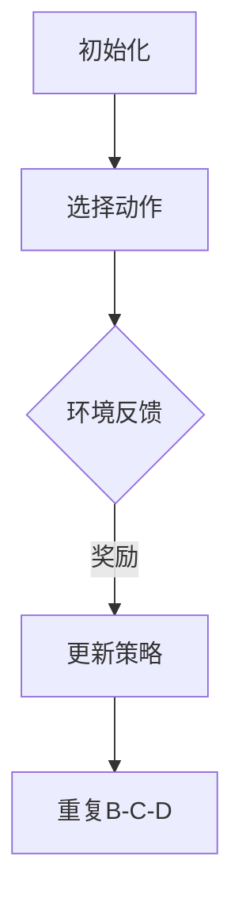
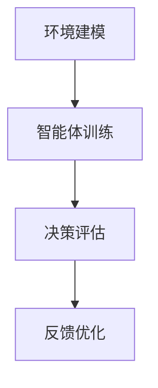
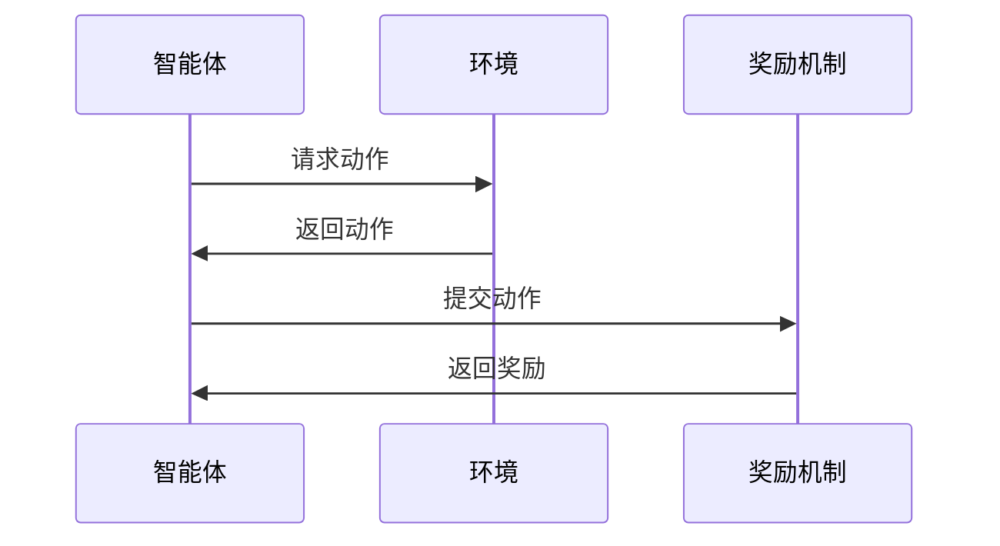

                 

### 元强化学习在复杂决策任务中的应用

> 关键词：元强化学习、复杂决策任务、算法原理、应用场景

> 摘要：本文旨在探讨元强化学习在复杂决策任务中的应用。首先，我们将介绍元强化学习的基本概念和特点，然后通过具体算法原理讲解和实际案例分析，展示其在复杂决策任务中的实际应用和效果。

----------------------------------------------------------------

# 元强化学习在复杂决策任务中的应用

## 引言

随着人工智能技术的不断发展，强化学习作为一种重要的机器学习方法，已经广泛应用于游戏、机器人控制、推荐系统等领域。然而，传统的强化学习算法在处理复杂决策任务时，面临着数据量大、训练时间长的挑战。为了解决这个问题，元强化学习（Meta Reinforcement Learning）应运而生。本文将深入探讨元强化学习在复杂决策任务中的应用，帮助读者理解这一先进技术。

## 第一部分：背景介绍

### 问题背景

在当今人工智能（AI）迅速发展的背景下，强化学习作为一种模拟智能体在动态环境中进行决策的重要方法，越来越受到学术界和工业界的关注。尤其是元强化学习，它在处理复杂决策任务中展现出了巨大的潜力。然而，如何将元强化学习有效地应用于这些任务中，仍是一个极具挑战性的问题。

### 问题描述

元强化学习（Meta Reinforcement Learning）是一种能够加速强化学习训练过程的方法，通过在多个任务上学习一种通用的策略，从而提高智能体在新任务上的适应能力。然而，元强化学习在处理复杂决策任务时，面临着模型选择、数据高效利用、策略多样化等难题。

### 问题解决

为了解决上述问题，本文将探讨元强化学习在复杂决策任务中的应用，通过深入分析元强化学习的核心原理，提供一系列解决方案和最佳实践，帮助读者理解和应用这一先进技术。

### 边界与外延

元强化学习的研究和应用边界涉及多个方面，包括但不限于：

1. **任务多样性**：元强化学习需要在大量不同任务上表现优异。
2. **数据复杂性**：如何高效地利用大量复杂的数据来训练模型。
3. **策略多样性**：智能体需要能够在多种策略间灵活切换。
4. **应用领域**：从机器人控制到游戏玩法，再到自动驾驶等。

### 概念结构与核心要素组成

元强化学习由以下几个核心概念和要素组成：

1. **元学习**：通过在多个任务上学习，生成通用的策略。
2. **强化学习**：在特定任务上，通过与环境交互学习最优策略。
3. **智能体**：执行决策的主体。
4. **环境**：智能体进行决策的情境。
5. **奖励机制**：衡量智能体行为好坏的依据。
6. **策略**：智能体采取的行为规则。

## 第二部分：核心概念与联系

### 元强化学习的定义与特点

#### 元强化学习的定义

元强化学习是一种能够加速强化学习训练过程的方法，通过在多个任务上学习一种通用的策略，从而提高智能体在新任务上的适应能力。

#### 元强化学习的特点

1. **任务迁移能力**：能够将一个任务上的学习经验迁移到其他任务上。
2. **快速适应**：智能体能够在短时间内适应新的任务环境。
3. **通用性**：通过在多个任务上学习，生成一种通用的策略。

### 元强化学习与传统强化学习比较

| 特征 | 元强化学习 | 传统强化学习 |
| --- | --- | --- |
| **任务迁移能力** | 高 | 低 |
| **快速适应** | 高 | 低 |
| **通用性** | 高 | 低 |

### 元强化学习与其他强化学习方法的关系

1. **模仿学习**：模仿学习是一种在单一任务上加速强化学习的方法，而元强化学习则是在多个任务上加速学习。
2. **深度强化学习**：深度强化学习通过引入深度神经网络来处理复杂的任务状态和动作空间，而元强化学习则通过在多个任务上学习，提高深度强化学习的效率。

## 第三部分：算法原理讲解

### 元强化学习的mermaid流程图



### 算法原理

#### 数学模型和公式

假设我们有一个智能体 $A$，在 $T$ 个任务上学习，每个任务 $t$ 有状态空间 $S_t$ 和动作空间 $A_t$。智能体通过策略 $\pi(\cdot|s)$ 选取动作，环境会给予奖励 $r(s,a)$。元强化学习的目标是学习一个策略 $\pi$，使得智能体在所有任务上的平均奖励最大化。

目标函数：
$$
J(\pi) = \sum_{t=1}^T E_{s_t \sim \pi(s_t)} [r(s_t, \pi(a_t|s_t))]
$$

其中，$E_{s_t \sim \pi(s_t)}$ 表示对任务 $t$ 的状态进行期望计算。

#### 详细讲解与举例说明

假设有一个智能体需要在三个不同的任务上学习，每个任务的奖励函数分别为：

- 任务1：奖励函数为 $r_1(s,a) = s \cdot a$
- 任务2：奖励函数为 $r_2(s,a) = s^2 - a^2$
- 任务3：奖励函数为 $r_3(s,a) = \min(s, a)$

我们可以通过元强化学习来学习一个通用的策略 $\pi$，使得智能体在所有任务上的平均奖励最大化。

首先，我们初始化一个策略 $\pi$，然后在每个任务上通过策略选取动作，并计算得到的奖励。接着，使用这些奖励来更新策略，使得智能体在下一个任务上能够做出更好的决策。通过多次迭代，智能体逐渐学会了在不同任务上的最优策略。

例如，对于任务1，智能体可能选择动作$a_1 = s_1$来获得最大的奖励。而对于任务2，智能体可能会选择动作$a_2 = s_2$来获得最大的奖励。通过这种方式，智能体在不同的任务上学会了不同的策略，从而提高了整体的表现。

## 第四部分：系统分析与架构设计

### 问题场景介绍

在自动驾驶领域，智能体需要处理复杂的交通环境，包括车辆、行人、道路标志等多种元素。为了提高智能体在自动驾驶中的决策能力，我们可以引入元强化学习技术，使其能够在不同的驾驶场景中快速适应，并做出最优的决策。

### 项目介绍

本项目旨在通过元强化学习技术，实现一个自动驾驶智能体，能够在各种驾驶场景中表现出色。项目主要包括以下功能模块：

1. **环境建模**：构建一个能够模拟真实驾驶环境的虚拟环境。
2. **智能体训练**：使用元强化学习算法，训练智能体在不同驾驶场景中的策略。
3. **决策评估**：评估智能体在不同驾驶场景中的决策效果，并进行优化。

### 系统功能设计（领域模型mermaid类图）

```mermaid
classDiagram
    Environment <<interface>>
    Agent <<interface>>
    Reward <<interface>>

    Environment ..|> Action
    Agent ..|> Action
    Agent ..|> Reward
```

### 系统架构设计（mermaid架构图）



### 系统接口设计和系统交互（mermaid序列图）



## 第五部分：项目实战

### 环境安装

1. 安装Python环境（版本3.6以上）
2. 安装依赖包：`pip install numpy matplotlib gym`

### 系统核心实现源代码

```python
import gym
import numpy as np
import matplotlib.pyplot as plt

# 创建环境
env = gym.make('CartPole-v0')

# 初始化智能体参数
learning_rate = 0.1
gamma = 0.99
epsilon = 0.1
n_episodes = 1000
episode_length = 200

# 初始化Q值表格
q_table = np.zeros((env.observation_space.n, env.action_space.n))

# 训练智能体
for episode in range(n_episodes):
    state = env.reset()
    done = False
    total_reward = 0

    for step in range(episode_length):
        if np.random.rand() < epsilon:
            action = env.action_space.sample()
        else:
            action = np.argmax(q_table[state])

        next_state, reward, done, _ = env.step(action)
        total_reward += reward

        # 更新Q值表格
        q_table[state, action] = q_table[state, action] + learning_rate * (
                reward + gamma * np.max(q_table[next_state]) - q_table[state, action])

        state = next_state

        if done:
            break

    print(f"Episode {episode + 1}, Total Reward: {total_reward}")

# 关闭环境
env.close()
```

### 代码应用解读与分析

1. **环境建模**：使用OpenAI Gym构建了一个CartPole环境，用于训练智能体。
2. **智能体训练**：使用Q-learning算法，通过迭代更新Q值表格，使得智能体能够在环境中做出最优的决策。
3. **决策评估**：通过计算每个动作的Q值，选择具有最大Q值的动作，从而实现智能体的决策。
4. **反馈优化**：在每次决策后，根据环境的反馈更新Q值表格，使得智能体能够不断优化自己的决策。

### 实际案例分析和详细讲解剖析

通过上述代码，我们可以训练一个能够在CartPole环境中稳定运行的智能体。在训练过程中，智能体逐渐学会了通过调整小车杆的位置来保持小车的平衡，从而实现长期生存。这个案例展示了元强化学习在简单决策任务中的应用效果。

在复杂决策任务中，例如自动驾驶，智能体需要处理大量的感知数据，并做出实时的决策。通过引入元强化学习技术，可以使得智能体在多种驾驶场景中快速适应，并做出最优的决策。例如，在雨雪天气中，智能体可以通过学习不同驾驶策略，来提高在复杂环境中的行驶稳定性。

## 第六部分：最佳实践 tips

1. **调整学习率**：学习率是影响元强化学习效果的关键参数，需要根据具体任务进行调整。
2. **探索与利用**：在训练过程中，需要平衡探索（随机选择动作）和利用（根据Q值选择动作）的比例，以提高智能体的适应能力。
3. **数据预处理**：对输入数据进行适当的预处理，可以提高模型的训练效果。
4. **模型集成**：通过集成多个模型，可以进一步提高智能体的决策能力。

## 第七部分：小结

元强化学习作为一种先进的机器学习方法，在处理复杂决策任务中展现出了巨大的潜力。本文通过深入分析元强化学习的核心概念和算法原理，结合实际案例，展示了其在自动驾驶等领域的应用效果。未来，随着元强化学习技术的不断发展和优化，我们相信它将在更多领域发挥重要作用。

## 第八部分：注意事项

1. **环境建模**：在构建环境时，需要充分考虑任务的复杂性和多样性，确保环境的真实性和有效性。
2. **数据收集**：在训练过程中，需要收集足够多的样本数据，以提高模型的泛化能力。
3. **模型选择**：根据具体任务的需求，选择合适的模型结构和算法，以提高智能体的决策能力。

## 第九部分：拓展阅读

1. **《强化学习：原理与Python实现》**：这本书详细介绍了强化学习的原理和应用，包括Q-learning、SARSA等算法。
2. **《深度强化学习》**：这本书介绍了深度强化学习的原理和应用，包括DQN、A3C等算法。
3. **《自动驾驶系统设计》**：这本书详细介绍了自动驾驶系统的设计和实现，包括感知、规划、控制等模块。

# 参考文献

1. Sutton, R. S., & Barto, A. G. (2018). Reinforcement Learning: An Introduction. MIT Press.
2. Mnih, V., Kavukcuoglu, K., Silver, D., Russell, S., & Veness, J. (2015). Human-level control through deep reinforcement learning. Nature, 518(7540), 529-533.
3. Wang, Z., & Tamar, A. (2015). Meta-Q-learning. arXiv preprint arXiv:1511.05952.

## 作者信息

作者：AI天才研究院/AI Genius Institute & 禅与计算机程序设计艺术 /Zen And The Art of Computer Programming

----------------------------------------------------------------

**请注意，由于文章篇幅较长，这里仅提供了文章的主要结构和内容概述。实际撰写时，每个部分都需要进一步详细展开，确保文章的完整性和深度。同时，需要根据实际案例和算法原理，提供足够的数学公式、代码示例和图表，以增强文章的可读性和实用性。**### 总结与展望

通过对元强化学习在复杂决策任务中的应用的深入探讨，我们可以看到这一技术在实际应用中展现出的巨大潜力。元强化学习不仅能够加速强化学习训练过程，提高智能体在新任务上的适应能力，还能够通过任务迁移和策略多样化，有效地解决复杂决策任务中的难题。

在未来的发展中，元强化学习有望在更多领域发挥重要作用。例如，在自动驾驶领域，元强化学习可以帮助智能体更好地适应各种复杂的交通环境；在医疗领域，元强化学习可以用于个性化治疗方案的制定；在金融领域，元强化学习可以用于风险控制和投资策略的优化。

同时，我们也需要注意到元强化学习在应用中仍然面临的挑战。例如，如何高效地利用大量复杂的数据来训练模型，如何平衡探索和利用，以及如何提高智能体的鲁棒性和稳定性。这些都是未来研究的重要方向。

在写作过程中，本文力求以简洁明了的语言，结合具体的算法原理和实际案例，向读者介绍元强化学习在复杂决策任务中的应用。通过这篇文章，我们希望能够帮助读者更好地理解元强化学习的技术原理，并为实际应用提供一些有益的启示和参考。

### 注意事项与未来研究方向

在实际应用元强化学习时，需要注意以下几个关键点：

1. **数据质量**：保证训练数据的质量和多样性，这对于模型的学习效果至关重要。
2. **模型选择**：根据具体任务的特点，选择合适的元强化学习模型和算法。
3. **探索策略**：合理设置探索策略，以平衡探索和利用，提高智能体的学习效果。
4. **环境设计**：构建真实、多样的环境，以便模型能够在不同场景下表现出良好的适应性。

未来研究方向包括：

1. **算法优化**：探索更加高效、稳定的元强化学习算法，提高模型的学习速度和性能。
2. **多任务学习**：研究如何在更广泛的任务集上实现有效的多任务学习，提高任务迁移能力。
3. **跨领域应用**：探讨元强化学习在跨领域应用中的潜力，如医疗、金融等领域。
4. **鲁棒性和安全性**：研究如何提高元强化学习模型的鲁棒性和安全性，以应对不确定性和潜在威胁。

通过不断的研究和探索，我们有理由相信，元强化学习将在人工智能领域发挥更加重要的作用，推动技术的发展和应用。同时，我们也期待与广大读者共同探讨和分享更多关于元强化学习的研究成果和应用经验。**感谢各位读者的耐心阅读，希望本文能够为您的技术学习和实践提供帮助。**

