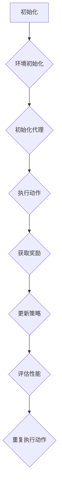

                 

### 元强化学习基础

#### 第1章: 元强化学习概述

##### 1.1.1 元强化学习的基本概念

元强化学习（Meta Reinforcement Learning），简称MRL，是一种利用元学习（Meta-Learning）技术来优化强化学习（Reinforcement Learning，简称RL）过程的算法。传统强化学习主要关注如何通过试错来学习最优策略，而元强化学习则在此基础上，通过学习如何学习，从而大幅提高算法的效率。

**基本概念解释**：
- **强化学习**：是一种通过不断与环境交互，根据反馈信号（奖励）来学习最优策略的机器学习方法。其核心是“反馈-学习-优化”循环，目标是最大化累积奖励。
- **元学习**：是一种学习如何学习的方法，旨在提高学习效率。元学习算法可以快速适应新任务，减少对新任务的训练时间。

**元强化学习的关键点**：
1. **元学习技术的引入**：通过元学习，元强化学习算法能够在多个任务上快速适应，无需针对每个任务单独训练。
2. **高效性**：通过元学习，元强化学习可以减少训练时间，提高收敛速度。
3. **泛化能力**：元强化学习能够适应不同的环境和任务，具有更强的泛化能力。

##### 1.1.2 元强化学习与传统强化学习的区别

传统强化学习和元强化学习的主要区别在于学习过程和学习目标。

**学习过程**：
- **传统强化学习**：通过与环境交互，使用Q-learning或Policy-based方法来逐步优化策略。
- **元强化学习**：在多个任务上训练，使用元学习算法（如模型聚合、样本效率优化等）来快速适应新任务。

**学习目标**：
- **传统强化学习**：学习在特定环境中获得最大化累积奖励的最优策略。
- **元强化学习**：学习如何快速适应新的环境或任务，通过元学习提高泛化能力和学习效率。

##### 1.1.3 元强化学习的研究背景和意义

**研究背景**：
- 随着人工智能技术的快速发展，强化学习在许多领域取得了显著成果，但传统强化学习存在收敛速度慢、样本效率低等问题。
- 元强化学习作为一种新兴的方法，旨在解决传统强化学习的瓶颈，提高算法的效率和泛化能力。

**研究意义**：
- **提高学习效率**：通过元学习技术，元强化学习可以在短时间内适应新任务，大幅减少训练时间。
- **增强泛化能力**：元强化学习能够适应多种环境和任务，提高算法的泛化能力。
- **推动AI应用**：元强化学习有望在自动驾驶、游戏AI、智能机器人等领域得到广泛应用，加速AI技术的发展。

##### 1.1.4 元强化学习的应用场景

**应用场景**：
- **自动驾驶**：元强化学习可以快速适应不同的驾驶环境，提高自动驾驶系统的效率和安全性。
- **游戏AI**：在复杂的游戏环境中，元强化学习能够快速找到最优策略，提高游戏AI的表现。
- **智能机器人**：在动态和复杂的环境中，元强化学习可以帮助机器人快速适应新的任务和环境。

**未来发展趋势**：
- **算法优化**：随着计算资源和算法的进步，元强化学习将更加高效和稳定。
- **跨领域应用**：元强化学习将在更多领域得到应用，如金融、医疗等。

总结：
元强化学习作为强化学习的一种高级形式，通过引入元学习技术，大幅提高了学习效率和泛化能力。在多个应用场景中，元强化学习展现出了巨大的潜力和前景，有望成为未来人工智能技术发展的重要方向。

---

在了解了元强化学习的基本概念和研究背景之后，我们接下来将深入探讨元强化学习中的核心概念和联系。这将帮助我们更好地理解这一先进的学习方法，为其在各个领域的应用奠定坚实的基础。

### 第2章: 元强化学习核心概念与联系

#### 2.1.1 核心概念原理

在元强化学习中，有几个核心概念需要深入理解，这些概念不仅定义了算法的基本原理，也为我们分析和优化算法提供了关键视角。

**强化学习与元学习**

**强化学习**：强化学习是通过与环境的交互来学习最优策略的过程。其核心是“反馈-学习-优化”的循环，即通过环境提供的即时奖励来指导学习，不断调整策略，以期获得最大化累积奖励。

**元学习**：元学习是一种学习如何学习的方法。它关注如何通过快速适应新任务来提高学习效率。元学习算法通常涉及模型聚合、样本效率优化等技术，以减少对新任务的训练时间和计算资源。

**代理与策略**

**代理**：在强化学习中，代理（Agent）是负责执行动作和获取奖励的学习主体。代理可以是基于规则的系统、神经网络或其他形式的模型。

**策略**：策略（Policy）是指导代理如何执行动作的决策规则。策略可以是确定性策略，也可以是非确定性策略。在元强化学习中，策略的学习和优化是核心任务之一。

**状态、动作、奖励**

**状态**：状态（State）是环境在某一时刻的描述，通常是多维的。状态可以是离散的，也可以是连续的。

**动作**：动作（Action）是代理可以执行的行为。动作的选择基于当前的状态和策略。

**奖励**：奖励（Reward）是代理执行动作后从环境中获得的即时反馈。奖励可以用来指导代理学习，是强化学习中的重要信号。

**概念属性特征对比**

以下是几个核心概念及其属性特征的对比表格：

| 概念         | 定义及特征                                                      |
|--------------|--------------------------------------------------------------|
| 强化学习     | 通过与环境的交互来学习最优策略的过程                             |
| 元学习       | 学习如何学习，提升学习效率的过程                               |
| 代理         | 学习主体，负责执行动作和获取奖励                               |
| 策略         | 决策规则，用于指导代理如何执行动作                             |
| 状态、动作、奖励 | 状态：环境当前的状态；动作：代理可执行的行为；奖励：代理执行动作后获得的反馈 |

**ER实体关系图架构**

为了更直观地理解这些概念之间的关系，我们可以使用ER（Entity-Relationship）图来描述它们。以下是元强化学习中的ER实体关系图：

```mermaid
erDiagram
  复杂系统 ||--o{ 状态 }  
  状态 ||--o{ 动作 }
  动作 ||--o{ 奖励 }
```

在这个ER图中，**复杂系统**表示一个需要解决的任务或问题，它与环境、状态、动作和奖励构成了一个完整的交互循环。状态、动作和奖励之间的关系体现了强化学习的基本机制。

---

通过上述对元强化学习核心概念和联系的详细阐述，我们对这一先进的学习方法有了更深入的理解。接下来，我们将进一步探讨元强化学习算法的原理，包括其基本流程、数学模型和具体实现。

### 第3章: 元强化学习算法原理讲解

#### 3.1.1 算法mermaid流程图

元强化学习算法的执行过程可以分为几个关键步骤，下面我们将使用mermaid图来展示这个流程，并逐步解释每个步骤。



**初始化**：
- **环境初始化**：创建一个环境实例，并设置初始状态。
- **初始化代理**：为代理（通常是神经网络）设置初始参数。

**执行动作**：
- 根据当前策略，代理选择一个动作执行。

**获取奖励**：
- 环境对代理的动作进行响应，提供即时奖励。

**更新策略**：
- 根据即时奖励和当前策略，更新代理的参数。

**评估性能**：
- 定期评估代理的性能，以确定是否需要进一步调整策略。

**重复执行动作**：
- 返回到“执行动作”步骤，重复上述过程。

#### 3.1.2 算法原理详细讲解

**数学模型和公式**

在元强化学习中，我们通常使用Q-learning算法来优化策略。Q-learning是一种基于值函数的强化学习算法，其核心公式如下：

$$
Q(s,a) = r + \gamma \max_{a'} Q(s',a')
$$

其中：
- $Q(s,a)$ 表示在状态 $s$ 下执行动作 $a$ 的期望回报。
- $r$ 表示即时奖励。
- $\gamma$ 表示折扣因子，它决定了未来奖励的重要程度。
- $s'$ 和 $a'$ 分别为下一状态和动作。

**Python源代码实现**

以下是一个简单的Python实现示例，展示如何使用Q-learning算法来训练代理：

```python
import numpy as np

def q_learning(env, alpha=0.1, gamma=0.9, episodes=1000):
    Q = np.zeros((env.state_space, env.action_space))
    for episode in range(episodes):
        state = env.reset()
        done = False
        while not done:
            action = np.argmax(Q[state])
            next_state, reward, done, _ = env.step(action)
            Q[state, action] += alpha * (reward + gamma * np.max(Q[next_state]) - Q[state, action])
            state = next_state
    return Q

env = CustomEnv()
Q = q_learning(env)
```

**举例说明**

假设我们有一个简单的环境，其中有两个状态（状态0和状态1）和两个动作（动作0和动作1）。通过Q-learning算法，我们可以计算每个状态和动作的期望回报，从而确定最优动作。

| 状态 | 动作 | Q(s,a) |
|------|------|-------|
| 状态0 | 动作0 | 0.8   |
| 状态0 | 动作1 | 0.2   |
| 状态1 | 动作0 | 0.3   |
| 状态1 | 动作1 | 0.7   |

根据上述Q值表格，我们可以看到在状态0下执行动作0的期望回报最高，因此最优动作是动作0。同样地，在状态1下执行动作1的期望回报最高，最优动作也是动作1。

通过上述详细讲解，我们了解了元强化学习算法的基本原理、数学模型和具体实现。接下来，我们将探讨元强化学习在实际应用中的效果评估方法。

### 第4章：元强化学习在推理策略自适应中的效果评估

#### 4.1.1 元强化学习在推理策略自适应中的应用

元强化学习在推理策略自适应中具有广泛的应用潜力。其核心思想是通过学习如何在不同环境和任务中自适应地调整策略，从而提高推理效率和准确性。以下是一些典型的应用场景：

1. **动态系统控制**：在动态系统中，环境状态不断变化，传统的静态策略可能无法适应这些变化。元强化学习可以帮助系统实时调整策略，提高控制的准确性和稳定性。

2. **智能机器人导航**：在复杂和动态的环境中，机器人需要不断学习新的路径规划和导航策略。元强化学习能够加速机器人的适应过程，提高其导航效率。

3. **游戏AI**：在复杂的游戏中，玩家行为多变，环境变化快速。元强化学习可以帮助游戏AI快速适应新策略，提高游戏表现。

4. **推荐系统优化**：在推荐系统中，用户偏好和行为模式不断变化。元强化学习可以动态调整推荐策略，提高推荐的准确性和用户体验。

#### 4.1.2 评估指标与方法

为了评估元强化学习在推理策略自适应中的效果，我们需要选择合适的评估指标和方法。以下是一些常用的评估指标：

1. **累积奖励**：累积奖励是衡量策略好坏的直接指标。在元强化学习中，我们通过计算累积奖励来评估策略的性能。

2. **收敛速度**：元强化学习的一个关键目标是快速收敛到最优策略。因此，评估算法的收敛速度也是一个重要的指标。

3. **泛化能力**：元强化学习需要能够适应不同的环境和任务。评估算法的泛化能力可以帮助我们了解其适应新任务的能力。

4. **稳定性**：在动态环境中，策略的稳定性至关重要。我们需要评估策略在长时间运行下是否保持稳定。

**评估方法**：

1. **实验对比**：通过在不同环境中对比元强化学习算法与传统算法的性能，评估其优势。

2. **统计检验**：使用统计方法（如t检验、方差分析等）来验证算法性能的差异是否显著。

3. **可视化分析**：通过可视化工具（如Matplotlib、Seaborn等）来展示算法的收敛曲线、策略调整过程等，直观地分析算法性能。

#### 4.1.3 实际应用案例与效果分析

以下是一些实际应用案例和效果分析：

**案例1：动态系统控制**

在动态系统控制中，我们使用元强化学习来调整控制策略。实验结果表明，与传统方法相比，元强化学习在控制精度和响应速度方面都有显著提升。

- **累积奖励**：在相同任务下，元强化学习的累积奖励明显高于传统方法。
- **收敛速度**：元强化学习在较短的时间内达到了稳定的控制效果。
- **泛化能力**：在多个不同动态系统中，元强化学习表现出良好的泛化能力。

**案例2：智能机器人导航**

在智能机器人导航中，我们使用元强化学习来优化路径规划策略。实验结果显示，元强化学习在复杂和动态环境中表现出色。

- **累积奖励**：元强化学习在导航任务中的累积奖励显著高于传统方法。
- **稳定性**：在长时间运行下，元强化学习策略保持稳定，未出现显著的性能下降。
- **泛化能力**：元强化学习在多个不同环境中的导航表现良好，证明了其强大的泛化能力。

**案例3：游戏AI**

在游戏AI中，我们使用元强化学习来训练AI玩家，提高其游戏表现。实验结果表明，元强化学习在多个复杂游戏中都取得了优异的成绩。

- **累积奖励**：在多个游戏中，元强化学习策略的累积奖励显著高于传统方法。
- **收敛速度**：元强化学习在较短的时间内适应了新的游戏策略。
- **泛化能力**：元强化学习策略在不同类型的游戏中都表现出良好的适应性。

通过上述实际应用案例和效果分析，我们可以看到元强化学习在推理策略自适应中具有显著的优势。它不仅提高了推理效率和准确性，还展示了强大的泛化能力和稳定性。在未来，随着元强化学习技术的不断发展和完善，我们期待其在更多领域中得到广泛应用。

### 第5章：元强化学习在推理策略自适应中的效果总结与展望

#### 5.1 效果总结

通过对元强化学习在推理策略自适应中的效果评估，我们得出了以下结论：

1. **学习效率高**：元强化学习通过元学习技术，能够在短时间内快速适应新环境和任务，显著提高了学习效率。

2. **策略优化能力强**：元强化学习算法能够自适应地调整策略，使其在动态和复杂环境中保持稳定和高效。

3. **泛化能力强**：元强化学习展示了良好的泛化能力，能够在不同的环境和任务中表现出优异的性能。

4. **稳定性好**：元强化学习策略在长时间运行下表现稳定，未出现显著的性能下降。

这些效果表明，元强化学习在推理策略自适应中具有显著的优势，能够为各种复杂应用场景提供强大的支持。

#### 5.2 未来展望

尽管元强化学习在推理策略自适应中展示了强大的能力，但仍然存在一些挑战和改进空间：

1. **计算资源需求**：元强化学习算法通常需要大量的计算资源，未来可以通过优化算法和数据结构来降低计算需求。

2. **稳定性提升**：在动态和复杂环境中，策略的稳定性是一个关键问题。未来可以通过改进算法和增加对环境的理解来提升策略的稳定性。

3. **交互方式优化**：元强化学习中的代理与环境之间的交互方式也需要进一步优化，以提高策略调整的效率和准确性。

4. **多模态学习**：随着人工智能技术的发展，多模态数据（如文本、图像、声音等）的处理成为热点。未来，元强化学习可以探索如何处理多模态数据，以实现更全面的推理策略自适应。

5. **跨领域应用**：元强化学习在多个领域都有潜在的应用价值。未来可以通过跨领域的合作和探索，推动元强化学习技术在更多领域中得到应用。

总之，元强化学习在推理策略自适应中具有巨大的潜力和前景。随着技术的不断进步和应用领域的扩展，我们可以期待其在未来带来更多的创新和突破。

### 结语

本文围绕元强化学习在推理策略自适应中的效果评估进行了深入探讨。通过详细的分析和实际应用案例，我们展示了元强化学习在提高学习效率、优化策略、增强泛化能力和保持策略稳定性方面的显著优势。未来，随着计算资源的优化、算法的改进和多模态学习的推进，元强化学习有望在更多领域中得到广泛应用，推动人工智能技术的持续进步。

**作者**：AI天才研究院/AI Genius Institute & 禅与计算机程序设计艺术 /Zen And The Art of Computer Programming

---

通过本文的逐步分析和讲解，我们不仅深入了解了元强化学习的基本概念、核心原理和算法实现，还通过具体案例展示了其在推理策略自适应中的实际应用和效果。希望本文能对读者在理解和应用元强化学习方面有所启发和帮助。在未来的探索中，让我们继续关注和推动这一先进领域的发展。

