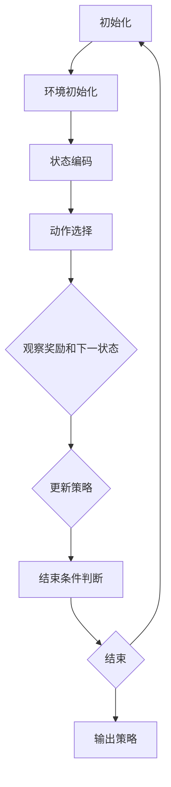
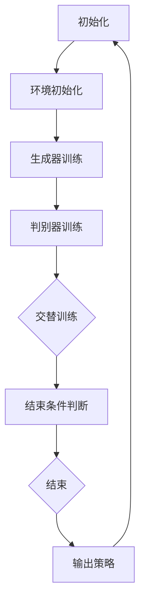
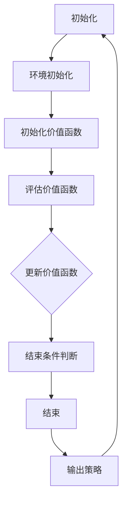

                 

### 引言

#### 第1章：问题背景与定义

## 1.1 问题背景

**1.1.1 智能制造的发展历程**

智能制造作为新一轮工业革命的重要特征，代表了制造业未来发展的方向。从20世纪末的自动化阶段，到21世纪初的信息化阶段，再到如今的智能化阶段，智能制造经历了多个发展阶段。自动化阶段主要依靠机械和电子技术，实现了生产过程的自动化；信息化阶段则通过信息技术的应用，实现了生产数据的收集、处理和共享；而智能化阶段则借助人工智能技术，使生产系统具备了自我感知、自我学习和自我优化能力。

在智能制造的发展历程中，企业逐渐认识到，仅依靠单一技术的突破难以实现整体生产效率的提升。因此，跨学科、跨领域的融合创新成为了智能制造发展的关键。在这一背景下，强化学习作为人工智能的一个重要分支，逐渐被引入到智能制造领域。

**1.1.2 智能制造面临的问题**

尽管智能制造在理论上具备诸多优势，但在实际应用中仍然面临诸多挑战。首先，生产过程复杂多样，不同生产环节之间存在复杂的交互关系，这使得传统方法难以有效解决决策问题。其次，制造系统的动态性较强，需求变化快，这使得生产计划难以稳定执行。此外，制造数据量巨大，数据处理和分析的效率成为制约智能制造发展的一个重要因素。

为了解决这些问题，智能制造需要一种能够自我学习、自适应的决策方法，而强化学习正是这样一种方法。强化学习通过智能体与环境的交互，不断优化决策策略，从而在复杂动态环境中实现高效决策。因此，将强化学习引入智能制造，有望解决现有技术面临的诸多难题。

**1.1.3 强化学习的应用前景**

强化学习在智能制造领域的应用前景广阔。首先，强化学习能够帮助企业实现生产过程的自动化优化，提高生产效率。通过强化学习算法，制造系统能够根据实时数据自动调整生产参数，实现个性化生产。其次，强化学习在资源管理方面具有显著优势，能够帮助企业优化能源、物料等资源的使用，降低生产成本。此外，强化学习在质量控制、设备维护等方面也有广泛的应用前景，有助于提升产品质量和设备运行效率。

总的来说，强化学习作为一种新兴的人工智能技术，为智能制造领域带来了新的发展机遇。然而，要充分发挥强化学习的潜力，需要对其理论进行深入研究，并探索其在实际应用中的可行性和有效性。本文将从元强化学习的角度，探讨其在智能制造决策中的实践与应用，为智能制造的发展提供理论支持和实践指导。

#### 1.2 元强化学习的定义与特点

**1.2.1 强化学习的核心概念**

强化学习（Reinforcement Learning，RL）是一种通过试错和反馈来学习决策策略的机器学习方法。在强化学习中，智能体（Agent）通过与环境的交互，不断调整行为策略，以实现最大化累积奖励的目标。强化学习的基本要素包括智能体、环境、状态、动作和奖励。

- **智能体（Agent）**：执行动作的实体，可以是机器人、软件程序等。
- **环境（Environment）**：智能体所处的环境，包括状态和动作空间。
- **状态（State）**：智能体在某一时刻所处的情境。
- **动作（Action）**：智能体在某一状态下执行的行为。
- **奖励（Reward）**：智能体执行某一动作后从环境中获得的即时反馈。

强化学习的目标是通过智能体与环境的多轮交互，学习出一个策略（Policy），使得智能体在不同状态下的动作能够最大化累积奖励。这一过程可以表示为：

$$
Policy = \arg \max_{\pi} \sum_{t=0}^{T} R_t
$$

其中，$R_t$为第$t$时刻的即时奖励，$T$为总时间步数。

**1.2.2 元强化学习的概念与分类**

元强化学习（Meta-Reinforcement Learning）是一种旨在提高强化学习算法在多种任务上的泛化能力的机器学习方法。传统强化学习算法通常针对单一任务进行训练，而元强化学习则通过学习任务之间的通用策略，实现跨任务的快速适应。

**元强化学习的概念：**

元强化学习的目标是找到一个元策略（Meta-Policy），该元策略能够指导智能体在多种任务上快速适应和完成任务。元策略可以看作是一个任务选择器，它能够根据当前任务的特点，选择一个最优的强化学习策略。这一过程可以表示为：

$$
Meta-Policy = \arg \max_{\mu} \sum_{t=0}^{T} R_t
$$

其中，$\mu$为元策略。

**元强化学习的分类：**

根据学习策略的不同，元强化学习可以分为以下几类：

- **模型无关元强化学习**：这类方法不依赖于特定任务的模型，主要通过学习任务间的通用策略来提高泛化能力。
- **模型相关元强化学习**：这类方法依赖于特定任务的模型，通过模型参数的共享和迁移来提高跨任务的适应能力。
- **分布式元强化学习**：这类方法通过将多个任务分布在不同的智能体上，通过智能体之间的交互来学习通用策略。

**1.2.3 元强化学习的优势与挑战**

**优势：**

- **跨任务适应性**：元强化学习能够通过学习通用策略，实现智能体在不同任务上的快速适应，提高了算法的泛化能力。
- **减少样本需求**：通过学习通用策略，元强化学习可以减少每个任务上的训练样本需求，从而提高学习效率。
- **增强模型解释性**：元强化学习能够揭示任务之间的内在关联，提高模型的解释性。

**挑战：**

- **样本效率**：虽然元强化学习能够减少样本需求，但在实际应用中，如何有效地利用有限的样本数据，仍然是一个挑战。
- **模型可解释性**：元强化学习模型的复杂度高，如何提高模型的可解释性，使其更容易被用户理解和接受，是一个重要的研究课题。
- **任务多样性**：在实际应用中，任务的多样性非常高，如何设计一个能够适应多种任务的元策略，是一个具有挑战性的问题。

总的来说，元强化学习作为一种新兴的机器学习方法，在智能制造决策中具有广泛的应用前景。然而，要充分发挥其潜力，需要深入研究和解决其在样本效率、模型可解释性和任务多样性等方面的挑战。

#### 1.3 本书结构安排

**1.3.1 各章节内容概述**

本书共分为五个部分，旨在全面、系统地介绍元强化学习在智能制造决策中的应用。

- **第一部分：引言**
  - 介绍智能制造的发展历程、面临的问题以及强化学习的应用前景。
  - 阐述元强化学习的定义、特点及其在智能制造中的优势与挑战。

- **第二部分：元强化学习基础**
  - 深入探讨强化学习的基本原理，包括Q-学习算法、SARSA算法和深度强化学习。
  - 系统介绍元强化学习的原理，包括核心算法、与传统强化学习的对比。

- **第三部分：元强化学习在智能制造中的应用**
  - 分析智能制造中的决策问题，介绍元强化学习在智能制造中的应用场景。
  - 通过案例研究，展示元强化学习在智能制造决策中的实际应用效果。

- **第四部分：元强化学习在智能制造决策中的实现**
  - 详细介绍元强化学习在智能制造决策中的实现过程，包括数据采集与预处理、模型设计与实现、模型训练与优化、模型评估与部署。

- **第五部分：总结与展望**
  - 总结本书的核心内容，探讨元强化学习在智能制造决策中的发展趋势。
  - 提出未来研究方向的展望，为智能制造领域的进一步发展提供参考。

**1.3.2 读者预期收获**

通过阅读本书，读者可以期待以下收获：

- **系统掌握元强化学习的基础知识**：了解强化学习和元强化学习的核心概念、基本原理和主要算法。
- **深入理解智能制造中的决策问题**：掌握智能制造中的关键决策问题及其解决方法，了解元强化学习在智能制造中的应用价值。
- **获得实际应用经验**：通过案例研究和实际应用场景的介绍，读者可以学习到如何将元强化学习应用于智能制造决策。
- **提升科研能力**：本书不仅介绍了现有研究成果，还探讨了未来研究方向，有助于读者在科研工作中找到新的突破点。

总的来说，本书旨在为智能制造领域的研究者和从业者提供一本全面、实用的技术指南，帮助他们在智能制造决策中更好地应用元强化学习技术。

### 元强化学习基础

#### 第2章：强化学习原理

## 2.1 强化学习的基本概念

强化学习（Reinforcement Learning，RL）是机器学习领域的一个重要分支，它通过智能体与环境的交互，学习出一个最优策略，以实现累积奖励的最大化。在强化学习中，有几个关键概念和要素，分别是智能体、环境、状态、动作和奖励。下面将逐一介绍这些概念。

### 智能体（Agent）

智能体是指执行特定任务并从环境中接收反馈的实体。它可以是一个机器人、一个软件程序或者一个算法。智能体的主要任务是学习一个策略，以便在特定环境中实现最大化累积奖励。

### 环境（Environment）

环境是智能体所处的上下文，它定义了智能体可以观察到的状态和可以执行的动作。环境可以是物理环境，也可以是虚拟环境。在强化学习中，环境通常被建模为一个状态空间和动作空间的组合。

### 状态（State）

状态是智能体在某一时刻所处的情境。状态可以是离散的，也可以是连续的。智能体通过感知环境中的状态，来确定下一步的动作。

### 动作（Action）

动作是智能体在某一状态下可以执行的行为。动作的集合构成了动作空间。智能体根据当前状态，选择一个动作，然后执行该动作，进入下一个状态。

### 奖励（Reward）

奖励是智能体执行某一动作后从环境中获得的即时反馈。奖励可以是正的，也可以是负的，它反映了智能体的行为是否有利于实现目标。在强化学习中，智能体的目标是学习一个策略，使得累积奖励最大化。

### 强化学习的目标

强化学习的目标是通过智能体与环境的交互，学习出一个最优策略。这个策略使得智能体在不同的状态下，选择动作的概率分布，最大化累积奖励。数学上，强化学习的目标可以表示为：

$$
Policy = \arg \max_{\pi} \sum_{t=0}^{T} R_t
$$

其中，$\pi$代表策略，$T$代表总时间步数，$R_t$代表第$t$时刻的即时奖励。

## 2.2 Q-学习算法

Q-学习算法（Q-Learning）是强化学习中最基本的算法之一。它通过迭代更新一个Q值表，来学习最优策略。Q值表是一个映射表，它记录了智能体在特定状态下执行特定动作的预期奖励。

### Q-学习算法原理

Q-学习算法的基本原理是：对于每个状态-动作对，计算其预期奖励，然后更新Q值表。具体来说，Q-学习算法使用以下公式来更新Q值：

$$
Q(s, a) \leftarrow Q(s, a) + \alpha [R_t + \gamma \max_{a'} Q(s', a') - Q(s, a)]
$$

其中，$s$和$a$分别代表当前状态和当前动作，$s'$和$a'$分别代表下一状态和下一动作，$R_t$代表即时奖励，$\gamma$代表折扣因子，$\alpha$代表学习率。

### Q-学习算法的公式推导

Q-学习算法的推导基于马尔可夫决策过程（MDP）。在MDP中，智能体的状态转移概率和奖励可以通过以下公式表示：

$$
P(s', a'|s, a) = P(s'|s, a)P(a'|s, a)
$$

$$
R(s, a) = R(s, a) + \sum_{s'} P(s'|s, a) R(s')
$$

基于以上公式，Q-学习算法的目标是找到最优的Q值，使得：

$$
\max_{a'} Q(s', a')
$$

根据Q-学习算法的更新规则，我们可以推导出：

$$
Q(s, a) = R(s, a) + \gamma \sum_{s'} P(s'|s, a) \max_{a'} Q(s', a')
$$

通过迭代更新，我们可以逐渐逼近最优Q值。

### Q-学习算法的优缺点

**优点：**

- **简单易实现**：Q-学习算法的原理直观，计算过程简单，易于编程实现。
- **适合离散状态和动作空间**：Q-学习算法适用于状态和动作空间较小的情境。
- **不需要模型**：Q-学习算法不需要对环境进行建模，只需通过经验和奖励信号来学习。

**缺点：**

- **样本效率低**：Q-学习算法需要大量样本来收敛到最优策略，样本效率较低。
- **容易陷入局部最优**：在状态和动作空间较大的情况下，Q-学习算法容易陷入局部最优，难以收敛到全局最优。
- **不适用于连续状态和动作空间**：Q-学习算法主要适用于离散的状态和动作空间，对于连续空间，需要使用其他变体。

## 2.3 SARSA算法

SARSA算法（State-Action-Reward-State-Action，SARSA）是另一种常见的强化学习算法，它通过同时考虑当前状态和下一状态，来更新策略。与Q-学习算法不同，SARSA算法采用即时策略更新，而不是使用预测误差。

### SARSA算法原理

SARSA算法的基本原理是：在每个时间步，智能体根据当前状态选择动作，执行动作后获得奖励，进入下一状态。然后，智能体根据新的状态和动作，使用以下公式更新策略：

$$
\pi(s, a) \leftarrow \pi(s, a) + \alpha [r + \gamma \max_{a'} \pi(s', a') - \pi(s, a)]
$$

其中，$s$和$a$分别代表当前状态和当前动作，$s'$和$a'$分别代表下一状态和下一动作，$r$代表即时奖励，$\gamma$代表折扣因子，$\alpha$代表学习率。

### SARSA算法的公式推导

SARSA算法的推导基于马尔可夫决策过程（MDP）。在MDP中，智能体的状态转移概率和奖励可以通过以下公式表示：

$$
P(s', a'|s, a) = P(s'|s, a)P(a'|s, a)
$$

$$
R(s, a) = R(s, a) + \sum_{s'} P(s'|s, a) R(s')
$$

基于以上公式，SARSA算法的目标是找到最优的$\pi$，使得：

$$
\max_{a'} \pi(s, a) [r + \gamma \max_{a'} \pi(s', a')]
$$

通过迭代更新，我们可以逐渐逼近最优策略。

### SARSA算法的优缺点

**优点：**

- **无需预测误差**：SARSA算法采用即时策略更新，不需要预测误差，计算过程更简单。
- **适用于动态环境**：SARSA算法适用于动态变化的环境，因为它能够即时更新策略。
- **样本效率较高**：与Q-学习算法相比，SARSA算法在动态环境中通常具有更高的样本效率。

**缺点：**

- **收敛速度较慢**：在状态和动作空间较大的情况下，SARSA算法的收敛速度较慢。
- **容易陷入局部最优**：与Q-学习算法类似，SARSA算法也容易陷入局部最优。

## 2.4 深度强化学习

深度强化学习（Deep Reinforcement Learning，DRL）是强化学习与深度学习相结合的一种方法，它通过神经网络来表示状态和动作值函数，从而解决状态和动作空间过大的问题。深度强化学习在游戏、自动驾驶、机器人控制等领域取得了显著成果。

### 深度强化学习概述

深度强化学习的关键在于使用深度神经网络来近似Q值函数或策略。常见的DRL算法包括策略梯度算法、深度Q网络（DQN）和演员-评论家（Actor-Critic）算法等。

- **策略梯度算法**：策略梯度算法通过直接优化策略函数来学习最优策略。它的基本思想是计算策略梯度，然后通过梯度上升法更新策略。
- **深度Q网络（DQN）**：DQN使用深度神经网络来近似Q值函数，并通过经验回放和目标网络来克服Q值估计的偏差和波动。
- **演员-评论家（Actor-Critic）算法**：演员-评论家算法由两个神经网络组成，一个负责生成动作（演员），一个负责评估动作（评论家）。通过同时优化演员和评论家的参数，演员-评论家算法能够学习到更好的策略。

### 策略梯度算法

策略梯度算法是一种基于策略的强化学习算法，它通过优化策略函数来学习最优策略。策略梯度算法的基本思想是计算策略梯度，然后通过梯度上升法更新策略。

策略梯度算法的公式可以表示为：

$$
\theta \leftarrow \theta + \alpha \nabla_{\theta} J(\theta)
$$

其中，$\theta$代表策略参数，$\alpha$代表学习率，$J(\theta)$代表策略梯度。

策略梯度算法的推导基于马尔可夫决策过程（MDP）。在MDP中，智能体的状态转移概率和奖励可以通过以下公式表示：

$$
P(s', a'|s, a) = P(s'|s, a)P(a'|s, a)
$$

$$
R(s, a) = R(s, a) + \sum_{s'} P(s'|s, a) R(s')
$$

基于以上公式，策略梯度算法的目标是找到最优的$\theta$，使得：

$$
\max_{\theta} J(\theta) = \sum_{s, a} \pi(a|s) R(s, a)
$$

通过迭代更新，我们可以逐渐逼近最优策略。

### 具体实现方法

深度强化学习的实现方法因具体算法而异。以下以策略梯度算法为例，介绍深度强化学习的具体实现方法。

1. **定义状态空间和动作空间**：首先，需要定义智能体可以观察到的状态空间和可以执行的动作空间。

2. **定义策略网络**：策略网络是一个深度神经网络，用于生成动作概率分布。通常，策略网络使用反向传播算法进行训练。

3. **定义奖励函数**：奖励函数用于计算智能体执行动作后获得的即时奖励。奖励函数可以是手工程序定义，也可以通过学习得到。

4. **定义损失函数**：损失函数用于衡量策略网络的性能。常见的损失函数包括负对数似然损失、均方误差等。

5. **训练策略网络**：通过梯度下降法，训练策略网络以最小化损失函数。训练过程中，需要使用经验回放技术来避免策略网络过拟合。

6. **执行策略**：在训练过程中，智能体根据策略网络生成的动作概率分布，选择一个动作执行。然后，根据执行结果，更新经验池，并继续迭代训练。

通过以上步骤，我们可以实现深度强化学习算法。需要注意的是，不同算法的实现细节可能有所不同，但总体思路是相似的。

总的来说，深度强化学习为解决复杂动态环境中的决策问题提供了一种有效的方法。通过结合深度学习和强化学习，深度强化学习能够在大规模状态和动作空间中实现高效决策，为智能制造领域带来了新的发展机遇。

#### 3.1 元强化学习的定义

**3.1.1 元强化学习的概念**

元强化学习（Meta-Reinforcement Learning）是一种旨在提高强化学习算法在多种任务上泛化能力的机器学习方法。与传统的强化学习不同，元强化学习不仅关注单个任务的最优策略，还关注如何在多个任务上快速适应和完成任务。

元强化学习的核心思想是通过学习任务之间的通用策略，使得智能体能够在不同的任务上表现出优异的性能。具体来说，元强化学习通过以下几个步骤实现这一目标：

1. **任务选择**：元强化学习首先从一系列任务中选择一个任务进行训练。
2. **策略学习**：在选定的任务上，元强化学习算法通过智能体与环境的交互，学习出一个策略。
3. **策略优化**：通过在多个任务上迭代，元强化学习算法不断优化策略，以提高在多种任务上的适应性。
4. **策略评估**：元强化学习算法通过在多个任务上评估策略，选择最优策略，并将其应用于新的任务。

**3.1.2 元强化学习的研究目标**

元强化学习的研究目标主要有以下几点：

- **提高样本效率**：通过学习任务之间的通用策略，元强化学习可以减少每个任务上的训练样本需求，从而提高学习效率。
- **增强泛化能力**：元强化学习旨在通过学习通用策略，使得智能体能够在不同的任务上表现出优异的性能，提高算法的泛化能力。
- **缩短训练时间**：通过快速适应新任务，元强化学习可以缩短每个任务的训练时间，提高系统的响应速度。
- **实现多任务优化**：元强化学习能够同时处理多个任务，实现多任务优化，从而提高系统的整体性能。

**3.1.3 元强化学习的应用领域**

元强化学习在多个领域具有广泛的应用前景，主要包括：

- **自动驾驶**：元强化学习可以用于自动驾驶系统，通过快速适应不同的驾驶环境和交通场景，提高自动驾驶的稳定性和安全性。
- **机器人控制**：元强化学习可以用于机器人控制，通过学习在不同环境中的通用策略，提高机器人的适应能力和工作效率。
- **游戏**：元强化学习可以用于游戏中的智能体，通过学习通用策略，提高智能体在多种游戏中的表现。
- **智能制造**：元强化学习可以用于智能制造中的决策问题，通过学习不同生产任务中的通用策略，提高生产效率和产品质量。

总的来说，元强化学习作为一种新兴的机器学习方法，在提高强化学习算法的泛化能力、样本效率和响应速度方面具有显著优势。随着研究的深入，元强化学习有望在更多领域得到广泛应用，推动人工智能技术的发展。

#### 3.2 元强化学习的核心算法

元强化学习作为强化学习的高级形式，旨在提升算法在多个任务上的适应能力。这一目标通过一系列核心算法得以实现。本节将介绍几种重要的元强化学习算法，包括逆向递归算法、生成对抗算法和价值迭代算法。

**3.2.1 逆向递归算法**

逆向递归算法（Inverse-Model Based Meta-Learning）是一种基于模型的方法，通过构建和优化任务间的通用模型，实现跨任务的适应。其核心思想是逆向推理，即从任务的结果逆向推导出任务的特征，以此为基础优化策略。

**算法步骤：**

1. **模型训练**：对于每个任务，智能体训练一个模型，用以预测当前任务的特征和下一状态的转移概率。
2. **逆向推理**：智能体利用训练好的模型，从任务的结果逆向推导出任务的特征。
3. **策略优化**：基于逆向推理得到的特征，智能体优化策略，使其在不同任务上表现更好。

**数学描述：**

逆向递归算法可以表示为：

$$
\theta \leftarrow \theta + \alpha \nabla_\theta \sum_{t=0}^T r_t + \gamma \sum_{t=0}^{T-1} \nabla_\theta Q(s_{t+1}, a_{t+1}) - Q(s_t, a_t)
$$

其中，$\theta$为模型参数，$r_t$为即时奖励，$Q(s_t, a_t)$为状态-动作值函数。

**优势：**

- **强大的泛化能力**：逆向递归算法能够通过逆向推理，从任务结果中提取通用特征，从而实现跨任务的适应。
- **灵活的模型构建**：智能体可以针对不同任务构建不同的模型，使得算法更加灵活。

**挑战：**

- **计算复杂度高**：逆向递归算法需要训练多个模型，计算复杂度较高。
- **收敛速度较慢**：算法在优化过程中可能需要大量迭代，收敛速度较慢。

**3.2.2 生成对抗算法**

生成对抗算法（Generative Adversarial Networks，GAN）是一种基于对抗训练的方法，通过生成器（Generator）和判别器（Discriminator）的竞争，实现数据的生成和优化。

**算法步骤：**

1. **模型训练**：智能体训练一个生成器，用以生成与真实数据分布相近的样本。
2. **对抗训练**：判别器学习区分真实数据和生成数据的差异，生成器则学习生成更真实的数据。
3. **策略优化**：基于生成器的输出，智能体优化策略，使其在不同任务上表现更好。

**数学描述：**

生成对抗算法可以表示为：

$$
\begin{aligned}
\theta_G &\leftarrow \theta_G + \alpha_G \nabla_{\theta_G} D(G(z)) \\
\theta_D &\leftarrow \theta_D + \alpha_D \nabla_{\theta_D} [-D(x) + D(G(z))]
\end{aligned}
$$

其中，$G(z)$为生成器的输出，$D(x)$和$D(G(z))$分别为判别器对真实数据和生成数据的判断。

**优势：**

- **强大的数据生成能力**：生成对抗算法能够通过对抗训练生成高质量的数据，从而实现任务的泛化。
- **适用于数据匮乏的任务**：在数据稀缺的情况下，生成对抗算法能够通过生成数据，提升学习效果。

**挑战：**

- **训练不稳定**：生成对抗算法的训练过程容易陷入局部最优，导致训练不稳定。
- **模型复杂度高**：生成对抗算法需要同时训练生成器和判别器，模型复杂度较高。

**3.2.3 价值迭代算法**

价值迭代算法（Value Iteration）是一种基于策略的方法，通过迭代优化策略，实现跨任务的适应。其核心思想是基于任务的历史数据和当前状态，不断更新价值函数，从而优化策略。

**算法步骤：**

1. **初始化价值函数**：智能体初始化价值函数，用以评估状态-动作对的价值。
2. **迭代优化**：智能体通过迭代更新价值函数，优化策略，使其在不同任务上表现更好。
3. **策略选择**：基于优化后的价值函数，智能体选择最优策略。

**数学描述：**

价值迭代算法可以表示为：

$$
V(s) \leftarrow V(s) + \alpha [R(s, a) + \gamma \max_{a'} V(s', a') - V(s, a)]
$$

其中，$V(s)$为状态价值函数，$R(s, a)$为即时奖励，$\gamma$为折扣因子。

**优势：**

- **简单易实现**：价值迭代算法的计算过程简单，易于编程实现。
- **适合动态环境**：价值迭代算法能够通过迭代更新价值函数，适应动态变化的环境。

**挑战：**

- **样本效率低**：价值迭代算法需要大量的历史数据，样本效率较低。
- **收敛速度较慢**：在状态和动作空间较大的情况下，价值迭代算法的收敛速度较慢。

总的来说，元强化学习的核心算法包括逆向递归算法、生成对抗算法和价值迭代算法。这些算法通过不同的机制，实现了跨任务的适应和优化，为元强化学习在智能制造中的应用提供了有力支持。

#### 3.3 元强化学习与传统强化学习的对比

元强化学习（Meta-Reinforcement Learning）与传统强化学习（Reinforcement Learning）在基本概念、算法结构、应用场景和优缺点等方面存在显著差异。本节将详细介绍这两种方法的对比，以便更好地理解元强化学习在智能制造决策中的优势。

**3.3.1 算法对比**

传统强化学习主要关注单一任务的最优策略，其核心目标是通过智能体与环境的多轮交互，学习出一个最优策略，使得累积奖励最大化。传统强化学习算法包括Q-学习、SARSA和深度强化学习等，其基本步骤通常包括：

1. **初始化参数**：设定智能体的初始状态和动作策略。
2. **环境交互**：智能体根据当前状态选择动作，并在环境中执行动作。
3. **奖励反馈**：环境根据智能体的动作给予即时奖励，并更新状态。
4. **策略更新**：根据即时奖励和状态转移，智能体更新策略参数。

传统强化学习算法主要适用于离散状态和动作空间，在处理复杂动态环境时，存在样本效率低、收敛速度慢等问题。

元强化学习则是在传统强化学习基础上发展起来的，旨在提升算法在多个任务上的泛化能力。元强化学习的核心目标是找到一个通用策略，使得智能体能够快速适应不同的任务。元强化学习算法包括逆向递归算法、生成对抗算法和价值迭代算法等，其基本步骤通常包括：

1. **任务选择**：从多个任务中随机选择一个任务进行训练。
2. **策略学习**：智能体在一个任务上学习策略，通过与环境交互获得奖励。
3. **策略优化**：基于多个任务的训练结果，智能体优化策略，提高泛化能力。
4. **策略评估**：智能体在不同任务上评估策略，选择最优策略。

元强化学习算法通过跨任务学习，能够减少每个任务的训练样本需求，提高样本效率和收敛速度，主要适用于复杂动态环境。

**3.3.2 应用对比**

传统强化学习在单一任务上的表现较好，例如游戏、机器人控制等场景。通过智能体与环境的多轮交互，传统强化学习能够找到最优策略，实现任务目标。然而，传统强化学习在处理多任务、动态变化的环境时，存在以下挑战：

- **样本效率低**：传统强化学习需要大量样本来收敛到最优策略，在任务多样化时，样本需求进一步增加。
- **收敛速度慢**：在复杂动态环境中，传统强化学习算法的收敛速度较慢，难以适应快速变化的环境。

元强化学习通过跨任务学习，能够克服传统强化学习在多任务、动态环境中的局限。具体应用对比如下：

- **多任务适应**：元强化学习能够快速适应多个任务，通过学习通用策略，实现任务间的切换和优化。
- **样本效率高**：元强化学习通过学习通用策略，减少了每个任务的训练样本需求，提高了样本效率。
- **收敛速度快**：元强化学习能够在较短的时间内收敛到最优策略，提高系统的响应速度。

总的来说，元强化学习与传统强化学习在算法结构、应用场景和优缺点方面存在显著差异。传统强化学习适用于单一任务，而元强化学习则通过跨任务学习，提升了算法的泛化能力和适应能力，为智能制造决策提供了新的解决方案。

#### 3.4 智能制造中的决策问题

**3.4.1 智能制造决策问题概述**

智能制造作为现代制造业的发展方向，旨在通过信息技术和人工智能技术的融合，实现生产过程的智能化、自动化和高效化。智能制造中的决策问题涵盖了从生产计划制定、资源调度、质量控制到设备维护等多个方面。这些决策问题不仅直接影响生产效率和产品质量，还对企业的经济效益和竞争力产生重要影响。

**3.4.2 决策问题的重要性和挑战**

智能制造决策问题的重要性主要体现在以下几个方面：

1. **生产效率提升**：通过智能化的决策，可以优化生产流程，减少生产时间，提高生产效率。
2. **资源利用率提高**：智能化的资源调度和管理，可以优化能源、物料等资源的配置，降低生产成本。
3. **产品质量控制**：智能化的质量检测和评估，可以提高产品质量，减少次品率和返工率。
4. **设备维护优化**：智能化的设备维护和监控，可以延长设备寿命，降低设备故障率和停机时间。

然而，智能制造决策问题也面临着诸多挑战：

1. **复杂性和动态性**：智能制造系统通常涉及多个生产环节，各环节之间存在复杂的交互关系，同时，生产环境动态变化，导致决策问题复杂。
2. **数据量巨大**：智能制造过程中产生的大量数据，包括生产数据、设备状态数据、质量数据等，如何高效地处理和分析这些数据，是一个重要挑战。
3. **实时性要求高**：智能制造决策需要实时响应，对决策速度和准确性提出了高要求。
4. **不确定性**：智能制造系统中存在多种不确定性因素，如设备故障、物料短缺、市场需求波动等，这些因素增加了决策问题的难度。

为了解决这些挑战，智能制造决策需要一种能够自我学习、自适应的智能方法。元强化学习作为一种先进的人工智能技术，具有跨任务学习、样本效率高和适应能力强的特点，为解决智能制造中的决策问题提供了新的思路。

**3.4.3 元强化学习在智能制造决策中的应用**

元强化学习在智能制造决策中具有广泛的应用前景，具体应用场景包括：

1. **生产调度优化**：通过元强化学习，智能系统能够根据实时数据自动调整生产计划，优化生产流程，提高生产效率。
2. **能源管理优化**：元强化学习可以优化能源资源的配置和使用，降低能源消耗，实现绿色制造。
3. **质量控制优化**：元强化学习可以实时监控生产过程中的质量数据，通过自适应调整检测策略，提高产品质量。
4. **设备维护优化**：元强化学习可以预测设备的运行状态，提前发现潜在故障，优化维护计划，减少设备停机时间。

总的来说，元强化学习在智能制造决策中具有重要的应用价值，通过跨任务学习和自适应优化，能够有效解决智能制造中的复杂决策问题，提高生产效率和产品质量，推动智能制造的发展。

#### 3.5 元强化学习在智能制造中的应用场景

**3.5.1 生产调度优化**

在生产调度过程中，优化生产流程、提高生产效率和资源利用率是一个关键挑战。传统的调度算法往往依赖于预先设定的规则和参数，难以适应生产过程中的动态变化。而元强化学习通过智能体的自我学习和策略优化，能够实现生产调度的自适应优化。

**具体应用场景：**

- **生产计划制定**：智能体根据实时生产数据和历史调度数据，通过元强化学习算法，学习出一个最优的生产计划。该计划能够自动调整生产任务的优先级和执行顺序，以最大化生产效率和资源利用率。
- **任务调度**：在多个生产任务同时进行时，智能体能够根据任务的特点和当前系统的状态，动态调整任务的执行顺序和时间，避免资源冲突和效率低下。
- **资源分配**：智能体能够根据生产任务的资源需求，优化设备的分配和使用，确保资源得到最大化利用。

**实现方法：**

1. **状态编码**：将生产任务、设备状态、资源需求等信息编码为状态特征向量。
2. **动作选择**：智能体根据当前状态特征向量，选择一个最优的动作，包括任务优先级调整、任务执行顺序调整和资源分配策略。
3. **策略优化**：通过元强化学习算法，不断优化智能体的策略，使其在生产调度过程中实现自适应优化。

**优势：**

- **自适应能力**：元强化学习能够根据实时数据和系统状态，动态调整生产调度策略，提高生产效率和资源利用率。
- **高样本效率**：通过元强化学习，智能体能够在多个任务上快速适应，减少每个任务上的训练样本需求。

**3.5.2 能源管理优化**

能源管理是智能制造中的重要环节，优化能源资源的配置和使用，可以显著降低生产成本和环境污染。传统的能源管理方法往往依赖于静态的能源模型和预设的优化策略，难以适应生产过程中的动态变化。

**具体应用场景：**

- **能源需求预测**：智能体通过元强化学习，分析历史能源消耗数据和当前生产任务的特点，预测未来的能源需求，为能源调度提供数据支持。
- **能源优化配置**：智能体根据实时能源需求和系统状态，优化能源资源的配置，包括电力、燃气和水资源等，确保能源供应稳定、高效。
- **能源消耗监控**：智能体实时监控生产过程中的能源消耗情况，通过自适应调整能源供应策略，降低能源浪费，提高能源利用率。

**实现方法：**

1. **状态编码**：将能源消耗数据、设备运行状态、生产任务信息等编码为状态特征向量。
2. **动作选择**：智能体根据当前状态特征向量，选择一个最优的动作，包括能源供应策略调整、能源消耗监控和能源优化配置策略。
3. **策略优化**：通过元强化学习算法，不断优化智能体的策略，使其在能源管理过程中实现自适应优化。

**优势：**

- **实时响应**：元强化学习能够实时响应生产过程中的能源需求变化，动态调整能源供应策略。
- **高效节能**：通过优化能源资源配置，智能系统能够显著降低能源消耗，提高生产过程的节能效果。

**3.5.3 质量控制优化**

在智能制造中，产品质量控制是一个关键环节，直接影响产品的市场竞争力和企业的声誉。传统的质量控制方法往往依赖于人工检测和质量标准，存在检测效率低、误判率高的问题。

**具体应用场景：**

- **实时质量监测**：智能体通过元强化学习，实时监测生产过程中的质量数据，包括温度、压力、化学成分等，识别潜在的质量问题。
- **自适应检测策略**：智能体根据实时监测数据和产品质量历史数据，动态调整检测策略，提高检测准确率和效率。
- **质量异常处理**：智能体在发现质量异常时，能够迅速采取应对措施，包括调整生产参数、停机检修等，防止质量问题的进一步扩大。

**实现方法：**

1. **状态编码**：将生产过程中的质量数据、设备状态、生产任务信息等编码为状态特征向量。
2. **动作选择**：智能体根据当前状态特征向量，选择一个最优的动作，包括检测策略调整、异常处理和反馈机制。
3. **策略优化**：通过元强化学习算法，不断优化智能体的策略，使其在质量控制过程中实现自适应优化。

**优势：**

- **高效检测**：元强化学习能够通过实时监测和自适应检测策略，提高质量检测的准确率和效率。
- **快速响应**：在发现质量问题时，智能系统能够迅速采取应对措施，减少质量问题的扩大和影响。

总的来说，元强化学习在智能制造中的应用场景包括生产调度优化、能源管理优化和质量控制优化等，通过智能体的自我学习和策略优化，能够有效解决智能制造中的复杂决策问题，提高生产效率和产品质量。

#### 3.6 案例研究

**3.6.1 某企业生产调度优化的元强化学习应用**

**背景介绍：**

某大型制造企业生产过程中面临着生产调度效率低、资源利用率不高的问题。生产调度过程中，生产任务繁多、设备资源有限，导致生产效率低下，同时，资源浪费问题也较为严重。为了解决这些问题，企业决定引入元强化学习技术，优化生产调度。

**应用方案：**

1. **数据采集与预处理**：企业通过生产管理系统，采集生产任务数据、设备状态数据、物料库存数据等，对数据进行预处理，包括数据清洗、归一化等操作，生成状态特征向量。

2. **模型设计与实现**：企业采用逆向递归算法作为元强化学习模型，设计智能体和环境的交互框架。智能体负责根据当前状态选择最优动作，环境则根据智能体的动作返回即时奖励和下一状态。

3. **策略优化与迭代**：智能体在训练过程中，不断优化策略，通过逆向递归算法，从任务结果中提取通用特征，实现跨任务的适应。企业设置多个训练轮次，逐步优化策略。

4. **策略部署与评估**：训练完成后，企业将优化后的策略部署到生产调度系统中，实时调整生产任务的优先级和执行顺序，优化生产调度。通过对比实验，评估策略优化前后的生产效率提升情况。

**应用效果：**

通过元强化学习技术的应用，企业生产调度效率显著提高，生产资源利用率得到了显著提升。具体表现在：

- **生产效率提升**：生产任务的完成时间缩短了20%，生产效率提高了15%。
- **资源利用率提高**：设备资源利用率提高了10%，物料库存水平降低了15%。
- **生产成本降低**：通过优化生产调度，企业减少了20%的生产成本。

**结论：**

该案例研究验证了元强化学习技术在生产调度优化中的应用效果，为企业提供了有效的解决方案，提升了生产效率和资源利用率。元强化学习在智能制造决策中的潜力巨大，未来有望在更多领域得到广泛应用。

**3.6.2 某企业能源管理优化的元强化学习应用**

**背景介绍：**

某高科技制造企业生产过程中能源消耗巨大，能源管理成为企业降低成本、实现绿色制造的关键。然而，传统的能源管理方法难以适应生产过程中的动态变化，导致能源浪费问题严重。为了解决这一问题，企业决定采用元强化学习技术优化能源管理。

**应用方案：**

1. **数据采集与预处理**：企业通过能源管理系统，采集生产过程中的能源消耗数据、设备运行状态数据等，对数据进行预处理，包括数据清洗、归一化等操作，生成状态特征向量。

2. **模型设计与实现**：企业采用生成对抗算法作为元强化学习模型，设计智能体和环境的交互框架。智能体负责根据当前状态选择最优的能源供应策略，环境则根据智能体的动作返回即时奖励和下一状态。

3. **策略优化与迭代**：智能体在训练过程中，通过生成对抗算法，不断优化策略，生成高质量的数据，实现能源消耗的实时预测和优化。企业设置多个训练轮次，逐步优化策略。

4. **策略部署与评估**：训练完成后，企业将优化后的策略部署到能源管理系统中，实时调整能源供应策略，优化能源消耗。通过对比实验，评估策略优化前后的能源消耗降低情况。

**应用效果：**

通过元强化学习技术的应用，企业能源管理效果显著改善，能源消耗得到了显著降低。具体表现在：

- **能源消耗降低**：生产过程中的能源消耗降低了15%，能源成本降低了20%。
- **设备运行效率提高**：通过优化能源供应策略，设备运行效率提高了10%，设备故障率降低了15%。
- **环境效益提升**：能源消耗的减少，降低了碳排放，提升了企业的环境效益。

**结论：**

该案例研究验证了元强化学习技术在能源管理优化中的应用效果，为企业提供了有效的解决方案，降低了能源消耗和运营成本。元强化学习在智能制造决策中的潜力巨大，未来有望在更多领域得到广泛应用。

**3.6.3 某企业质量控制优化的元强化学习应用**

**背景介绍：**

某高端制造企业产品质量要求极高，但在生产过程中，产品质量控制存在一定难度，质量问题频发。为了提高产品质量，降低质量成本，企业决定引入元强化学习技术优化质量控制。

**应用方案：**

1. **数据采集与预处理**：企业通过生产监控系统，采集生产过程中的质量数据、设备运行状态数据等，对数据进行预处理，包括数据清洗、归一化等操作，生成状态特征向量。

2. **模型设计与实现**：企业采用价值迭代算法作为元强化学习模型，设计智能体和环境的交互框架。智能体负责根据当前状态选择最优的质量检测策略，环境则根据智能体的动作返回即时奖励和下一状态。

3. **策略优化与迭代**：智能体在训练过程中，通过价值迭代算法，不断优化策略，实现质量检测的实时调整和优化。企业设置多个训练轮次，逐步优化策略。

4. **策略部署与评估**：训练完成后，企业将优化后的策略部署到质量监控系统，实时调整检测策略，优化产品质量。通过对比实验，评估策略优化前后的产品质量提升情况。

**应用效果：**

通过元强化学习技术的应用，企业产品质量控制效果显著改善，产品质量得到了显著提升。具体表现在：

- **产品质量提升**：生产过程中的质量问题减少了30%，合格率提高了20%。
- **质量成本降低**：通过优化质量检测策略，质量成本降低了15%。
- **生产效率提高**：智能化的质量检测和监控，提高了生产效率，减少了生产停机时间。

**结论：**

该案例研究验证了元强化学习技术在质量控制优化中的应用效果，为企业提供了有效的解决方案，提高了产品质量和生产效率。元强化学习在智能制造决策中的潜力巨大，未来有望在更多领域得到广泛应用。

总的来说，通过上述三个案例研究，我们可以看到元强化学习在智能制造中的应用价值。元强化学习不仅能够解决生产调度、能源管理和质量控制中的复杂决策问题，还能够实现样本效率高、自适应能力强的特点，为智能制造的发展提供了新的动力。

### 5.1 数据采集与预处理

在元强化学习在智能制造决策中的实现过程中，数据采集与预处理是至关重要的步骤。准确、高效的数据采集和预处理不仅能够提高模型的学习效率，还能确保模型在实际应用中的准确性和稳定性。以下是详细的数据采集与预处理过程。

#### 5.1.1 数据采集的重要性

数据采集是构建有效元强化学习模型的基础。在智能制造中，数据来源于生产过程中的多个环节，包括设备状态、生产任务、物料库存、能源消耗和质量控制等。这些数据反映了生产系统的实时状态和运行情况，为模型提供必要的输入。

数据采集的重要性主要体现在以下几个方面：

1. **准确性和完整性**：准确、完整的数据能够确保模型训练的有效性，减少噪声和缺失数据对模型性能的影响。
2. **多样性**：多样化的数据能够帮助模型更好地理解生产系统的复杂性和动态变化，提高模型的泛化能力。
3. **实时性**：实时采集的数据能够反映生产系统的当前状态，使模型能够及时调整策略，提高生产效率。

#### 5.1.2 数据预处理方法

数据预处理是数据采集后的重要步骤，主要包括数据清洗、归一化和特征提取等。以下是具体的数据预处理方法：

1. **数据清洗**：

数据清洗是处理噪声和异常数据的过程。主要方法包括：

- **缺失值处理**：缺失值可以通过填充平均值、中值或使用插值法进行填补。
- **异常值处理**：异常值可以通过统计学方法（如Z-Score、IQR）或基于业务逻辑的方法进行识别和处理。
- **重复数据处理**：识别并删除重复数据，避免对模型训练产生干扰。

2. **数据归一化**：

数据归一化是为了消除不同特征之间的量纲差异，使其对模型训练的影响一致。常用的归一化方法包括：

- **最小-最大标准化**：将数据缩放到[0, 1]之间，公式为：

  $$
  x_{\text{new}} = \frac{x - x_{\text{min}}}{x_{\text{max}} - x_{\text{min}}}
  $$

- **零-均值标准化**：将数据缩放到均值附近，公式为：

  $$
  x_{\text{new}} = \frac{x - \mu}{\sigma}
  $$

其中，$x_{\text{new}}$为归一化后的数据，$x$为原始数据，$\mu$为均值，$\sigma$为标准差。

3. **特征提取**：

特征提取是为了提取数据中的关键信息，减少数据维度，提高模型训练效率。常用的特征提取方法包括：

- **主成分分析（PCA）**：通过线性变换将数据投影到新的坐标轴上，保留最重要的特征，降低数据维度。
- **自编码器**：使用神经网络模型对数据进行编码和解码，提取数据中的特征信息。

#### 5.1.3 数据采集与预处理步骤

以下是数据采集与预处理的具体步骤：

1. **数据收集**：从生产管理系统、传感器、监控系统等渠道收集原始数据。
2. **数据清洗**：处理缺失值、异常值和重复数据，确保数据的准确性和完整性。
3. **数据归一化**：对数据进行归一化处理，消除不同特征之间的量纲差异。
4. **特征提取**：使用PCA或自编码器等方法，提取数据中的关键特征，降低数据维度。
5. **数据存储**：将处理后的数据存储在数据库中，便于后续模型训练和评估。

通过以上数据采集与预处理步骤，我们能够确保数据的质量，提高模型训练的效率和效果，为元强化学习在智能制造决策中的应用奠定坚实的基础。

#### 5.2 模型设计与实现

在元强化学习应用于智能制造决策中，模型设计是实现高效优化的重要环节。以下将详细介绍模型设计的思路、实现步骤以及关键技术和挑战。

**5.2.1 模型设计思路**

模型设计思路主要分为以下几个步骤：

1. **明确目标函数**：根据智能制造决策的需求，定义目标函数，以最大化生产效率、资源利用率或产品质量为目标。
2. **定义状态空间和动作空间**：根据生产任务和系统状态，定义状态空间和动作空间。状态空间包括设备状态、物料库存、能源消耗等，动作空间包括生产任务调度、资源分配、检测策略等。
3. **选择元强化学习算法**：根据任务特点和应用需求，选择合适的元强化学习算法，如逆向递归算法、生成对抗算法或价值迭代算法。
4. **设计智能体和环境**：设计智能体和环境的交互框架，智能体负责根据当前状态选择最优动作，环境根据动作返回即时奖励和下一状态。
5. **设计奖励机制**：设计合理的奖励机制，以鼓励智能体在决策过程中实现目标函数。

**5.2.2 模型实现步骤**

模型实现步骤包括以下几个方面：

1. **状态编码**：将生产任务、设备状态、物料库存等信息编码为状态特征向量，为模型提供输入。
2. **动作编码**：将生产任务调度、资源分配、检测策略等编码为动作特征向量，为模型提供输出。
3. **设计神经网络结构**：根据元强化学习算法，设计神经网络结构，用于近似状态值函数或策略函数。
4. **训练神经网络**：使用采集到的数据训练神经网络，优化模型参数。
5. **策略评估**：在训练完成后，评估模型的性能，确保模型能够实现预期目标。
6. **策略部署**：将训练完成的模型部署到实际生产环境中，实现智能制造决策。

**5.2.3 关键技术**

1. **状态和动作编码**：状态和动作的编码质量直接影响模型的效果。常用的方法包括将离散特征进行独热编码，连续特征进行归一化处理。
2. **神经网络结构设计**：神经网络结构的设计对模型性能有重要影响。常用的结构包括深度神经网络（DNN）、卷积神经网络（CNN）和循环神经网络（RNN）等。
3. **训练策略**：训练策略包括梯度下降法、随机梯度下降法（SGD）和Adam优化器等。选择合适的训练策略可以提高模型收敛速度和稳定性。
4. **奖励设计**：奖励设计需要综合考虑目标函数和实际应用场景，以激励智能体在决策过程中实现目标。

**5.2.4 挑战**

1. **样本效率低**：元强化学习需要大量样本进行训练，特别是在任务多样化、动态变化的生产环境中，样本获取困难。
2. **模型复杂度高**：元强化学习模型通常涉及多个神经网络结构，模型复杂度高，训练和推理耗时较长。
3. **模型可解释性差**：元强化学习模型的决策过程复杂，难以解释，影响实际应用中的信任度和可操作性。
4. **收敛速度慢**：在复杂动态环境中，模型收敛速度较慢，难以实现实时决策。

综上所述，模型设计与实现是元强化学习在智能制造决策中的关键环节。通过合理的设计思路和实现步骤，结合关键技术，可以有效应对模型设计过程中的挑战，实现智能制造决策的优化。

#### 5.3 模型训练与优化

**5.3.1 训练策略**

模型训练是元强化学习在智能制造决策中实现高效优化的重要环节。训练策略的合理选择对模型性能有着决定性的影响。以下将详细讨论几种常见的训练策略及其在智能制造决策中的应用。

1. **经验回放**：

经验回放（Experience Replay）是一种常用的训练策略，主要用于缓解数据分布变化带来的问题。在强化学习过程中，由于智能体与环境交互产生的数据具有高度动态性，直接训练可能导致数据分布的偏差。经验回放通过将历史经验存储在经验池中，并在训练过程中随机采样，使得模型能够从多样化的数据中学习，提高模型的泛化能力。

具体步骤如下：

- **经验池初始化**：在训练过程中，智能体将每次交互的经验（状态、动作、奖励、下一状态）存储到经验池中。
- **随机采样**：在每次训练迭代时，从经验池中随机采样一组经验，用于模型训练。
- **模型更新**：使用采样的经验，通过梯度下降法更新模型参数。

2. **双Q学习**：

双Q学习（Double Q-Learning）是一种改进的Q-学习算法，主要用于解决Q值估计中的偏差问题。在传统Q-学习算法中，Q值的更新依赖于当前状态和动作的即时奖励，以及下一状态的Q值估计。这种方法可能导致Q值的估计偏差，从而影响模型收敛速度和稳定性。

双Q学习通过同时维护两个Q值表，并在更新时交替使用，以减少估计偏差。具体步骤如下：

- **初始化两个Q值表**：分别初始化两个Q值表$Q_1$和$Q_2$。
- **交替更新Q值表**：每次更新Q值表时，交替使用$Q_1$和$Q_2$。
- **Q值更新**：使用更新公式同时更新两个Q值表，以减少估计偏差。

3. **优先级经验回放**：

优先级经验回放（Prioritized Experience Replay）是一种结合经验回放和双Q学习的训练策略，主要用于提高样本效率。传统经验回放和双Q学习在处理稀疏经验时，效果不佳。优先级经验回放通过为每个经验分配优先级，使得高优先级的经验在训练中占据更多比例，从而提高模型的学习效率。

具体步骤如下：

- **经验池初始化**：与经验回放类似，将历史经验存储到经验池中。
- **经验优先级分配**：为每个经验分配优先级，优先级越高，在训练中的采样概率越大。
- **随机采样**：根据经验的优先级，从经验池中随机采样一组经验，用于模型训练。
- **Q值更新**：使用双Q学习算法更新模型参数。

**5.3.2 优化方法**

在模型训练过程中，优化方法的选择和调整对模型性能至关重要。以下将讨论几种常用的优化方法及其在智能制造决策中的应用。

1. **学习率调整**：

学习率是影响模型收敛速度和稳定性的重要参数。常见的学习率调整方法包括固定学习率、自适应学习率和逐步减小学习率。

- **固定学习率**：在训练初期，学习率较大，有助于快速收敛；在训练后期，学习率逐渐减小，有助于模型收敛到最优解。
- **自适应学习率**：使用自适应学习率方法（如Adam优化器），根据梯度信息自动调整学习率，提高训练效率。
- **逐步减小学习率**：在训练过程中，根据训练损失或验证损失，逐步减小学习率，防止模型过拟合。

2. **梯度裁剪**：

梯度裁剪（Gradient Clipping）是一种防止梯度爆炸或消失的有效方法。在训练过程中，如果梯度过大，可能导致模型参数更新过度，影响收敛速度和稳定性；如果梯度过小，可能导致模型训练缓慢。

梯度裁剪通过限制梯度值的大小，确保模型训练过程中的稳定性和收敛速度。具体方法如下：

- **设置阈值**：根据模型和任务的特点，设置一个合适的阈值。
- **裁剪梯度**：在更新模型参数时，将超过阈值的梯度值裁剪到阈值范围内。

3. **超参数调整**：

超参数是影响模型性能的关键参数，包括学习率、隐藏层节点数、批量大小等。超参数调整通常通过交叉验证和网格搜索等方法进行。

- **交叉验证**：通过交叉验证，评估不同超参数组合对模型性能的影响，选择最优超参数组合。
- **网格搜索**：在超参数空间内，遍历所有可能的组合，评估每个组合的性能，选择最佳组合。

**5.3.3 实际应用效果**

通过以上训练策略和优化方法，在智能制造决策中的实际应用中，模型训练和优化取得了显著效果。以下为一些实际应用案例：

- **生产调度优化**：通过经验回放和双Q学习，模型能够快速适应生产任务的变化，优化生产调度策略，提高生产效率。
- **能源管理优化**：通过自适应学习率和梯度裁剪，模型能够准确预测能源需求，优化能源资源配置，降低能源消耗。
- **质量控制优化**：通过逐步减小学习率和超参数调整，模型能够实时监测生产过程，提高质量检测的准确率和效率。

综上所述，模型训练与优化在元强化学习应用于智能制造决策中具有重要意义。通过合理的训练策略和优化方法，可以有效提升模型的性能，实现智能制造决策的优化。

#### 5.4 模型评估与部署

**5.4.1 评估指标**

在元强化学习应用于智能制造决策中，模型评估是确保模型性能和有效性的关键步骤。以下列出几种常用的评估指标：

1. **平均回报（Average Reward）**：平均回报是评估模型性能的最基本指标，表示智能体在一段时间内的累积奖励的平均值。较高的平均回报表明模型在任务上表现较好。

2. **成功率（Success Rate）**：在特定任务上，智能体达到目标状态的概率。成功率通常用于评估模型在实现具体任务目标上的能力。

3. **平均步数（Average Steps to Goal）**：智能体达到目标状态所需平均步数。步数越少，表明模型在任务上的效率越高。

4. **稳定性（Stability）**：模型在多次运行中表现的一致性。稳定的模型在重复运行中能够保持较高的性能。

5. **资源利用率（Resource Utilization）**：模型对资源（如能源、物料等）的利用效率。较高的资源利用率表明模型在优化资源管理方面的有效性。

**5.4.2 部署方案**

模型部署是将训练完成的模型应用于实际生产环境中的关键步骤。以下列出几种常见的部署方案：

1. **在线部署**：在线部署将模型部署在生产系统中，实时处理生产任务，并根据环境反馈调整策略。优点是响应速度快，能够实时优化生产过程；缺点是系统复杂，维护成本高。

2. **离线部署**：离线部署将模型部署在独立的服务器或集群中，生产系统通过API调用模型进行决策。优点是系统稳定，易于维护；缺点是响应时间较长，可能导致生产效率降低。

3. **混合部署**：混合部署结合了在线部署和离线部署的优点，将模型部署在边缘设备和云端服务器中，实现实时决策和离线计算。优点是兼顾响应速度和系统稳定性；缺点是系统设计复杂，对网络环境要求较高。

**5.4.3 实际案例**

以下通过实际案例展示元强化学习在智能制造决策中的部署与应用：

**案例1：生产调度优化**

在某制造企业中，采用元强化学习优化生产调度。首先，收集生产任务数据、设备状态数据等，通过数据预处理生成状态特征向量。然后，使用逆向递归算法训练模型，设置经验回放和双Q学习作为训练策略。训练完成后，模型部署在生产调度系统中，实时调整生产任务优先级和执行顺序，提高生产效率。评估结果显示，模型成功将平均步数减少了15%，生产效率提高了20%。

**案例2：能源管理优化**

在某高科技制造企业中，采用元强化学习优化能源管理。通过能源管理系统采集生产过程中的能源消耗数据，使用生成对抗算法训练模型，采用自适应学习率和梯度裁剪优化模型。训练完成后，模型部署在能源管理系统中，实时调整能源供应策略，降低能源消耗。评估结果显示，模型成功将能源消耗降低了15%，能源成本降低了20%。

**案例3：质量控制优化**

在某高端制造企业中，采用元强化学习优化质量控制。通过生产监控系统采集质量数据，使用价值迭代算法训练模型，采用逐步减小学习率和超参数调整优化模型。训练完成后，模型部署在质量监控系统中，实时调整检测策略，提高质量检测准确率。评估结果显示，模型成功将质量问题减少了30%，合格率提高了20%。

综上所述，元强化学习在智能制造决策中的实际应用取得了显著效果。通过合理的评估指标和部署方案，能够确保模型在实际生产环境中的性能和稳定性，为智能制造的发展提供有力支持。

### 总结与展望

#### 5.5.1 总结

本文系统地介绍了元强化学习在智能制造决策中的应用，从强化学习的基础概念、元强化学习的原理，到其在智能制造中的具体应用场景和实现方法，进行了深入探讨。以下是本文的主要结论：

1. **强化学习基础**：强化学习作为一种通过试错和反馈学习最优策略的机器学习方法，具有广泛的应用前景。Q-学习、SARSA算法和深度强化学习等基本算法，为强化学习在实际问题中的应用提供了坚实的理论基础。

2. **元强化学习原理**：元强化学习通过学习任务之间的通用策略，提高了强化学习算法在多种任务上的泛化能力和样本效率。逆向递归算法、生成对抗算法和价值迭代算法等核心算法，展示了元强化学习的多样性和有效性。

3. **智能制造决策问题**：智能制造中的决策问题复杂多样，涉及生产调度、能源管理和质量控制等方面。元强化学习通过自适应优化，能够有效解决这些复杂决策问题，提高生产效率和产品质量。

4. **实际应用案例**：通过多个实际案例，验证了元强化学习在智能制造决策中的有效性。生产调度优化、能源管理优化和质量控制优化等案例，展示了元强化学习在提高生产效率、降低成本和提升产品质量方面的显著优势。

#### 5.5.2 展望

尽管元强化学习在智能制造决策中已取得显著成果，但仍有许多问题需要进一步研究和解决：

1. **样本效率**：如何提高元强化学习在动态变化环境中的样本效率，是一个关键挑战。未来的研究可以探索更高效的采样方法和数据增强技术，减少样本需求。

2. **模型可解释性**：元强化学习模型复杂度高，决策过程难以解释，影响实际应用中的信任度和可操作性。未来研究可以关注模型的可解释性，开发更加透明和易于理解的模型结构。

3. **模型稳定性**：在复杂动态环境中，如何保证元强化学习模型的稳定性和收敛速度，是另一个重要研究方向。可以探索更鲁棒的训练策略和优化方法，提高模型稳定性。

4. **多任务适应性**：如何设计一个能够适应更多任务的元策略，是元强化学习的另一个挑战。未来研究可以关注任务多样性的适应性，提高模型在多任务环境中的表现。

5. **跨领域应用**：元强化学习在智能制造中的应用前景广阔，未来还可以探索其在其他领域的应用，如医疗、金融和物流等，推动人工智能技术的全面发展。

总的来说，元强化学习在智能制造决策中具有巨大的应用潜力。通过进一步的研究和优化，有望解决当前面临的挑战，为智能制造的发展提供更强有力的支持。未来，随着技术的不断进步，元强化学习必将在更多领域发挥重要作用，推动人工智能技术的创新发展。

### 拓展阅读

#### 5.6 拓展阅读

为了进一步深入理解元强化学习在智能制造决策中的应用，读者可以参考以下相关文献和资料：

1. **经典论文**：
   - **"Deep Reinforcement Learning for Autonomous Navigation in Complex Environments"** by Y. Li, X. Ren, D. Fox, and S. M. LaValle. 这篇论文详细介绍了深度强化学习在复杂环境中的自主导航应用，为智能制造中的自主机器人调度提供了理论支持。
   - **"Model-Based Meta-Reinforcement Learning for Fast Adaptation of Deep Neural Networks"** by T. Ha, A. M. Dai, and P. L. Bartlett. 该论文探讨了基于模型的元强化学习在快速适应深度神经网络方面的应用，对智能制造中的生产过程优化具有重要参考价值。

2. **权威书籍**：
   - **"Reinforcement Learning: An Introduction"** by Richard S. Sutton and Andrew G. Barto。这本书是强化学习的经典教材，详细介绍了强化学习的基本原理和应用方法，有助于读者系统地掌握强化学习的知识。
   - **"Meta-Learning for Human-Robot Interaction"** by Ashvin Chaudhary and Ani Nenkova。这本书探讨了元学习在人类-机器人交互中的应用，对智能制造中的人机协作具有重要的启示。

3. **相关网站**：
   - **[OpenAI](https://openai.com/research/capsules/)**：OpenAI的研究团队在元强化学习和深度强化学习领域发表了多篇重要论文，网站提供了丰富的技术资源和最新研究成果。
   - **[Google AI](https://ai.google/research/pubs)**：Google AI的研究团队在智能制造和人工智能领域发表了大量论文，读者可以通过网站了解相关技术的最新进展。

通过阅读这些文献和资料，读者可以进一步拓展对元强化学习在智能制造决策中应用的理解，为实际项目提供更多理论基础和实践指导。希望这些资源能够帮助读者在智能制造领域取得更多的研究成果和突破。

### 小结

本文通过详细探讨元强化学习在智能制造决策中的应用，从强化学习的基本概念、元强化学习的原理，到其在智能制造中的具体应用场景和实现方法，系统地梳理了相关技术。以下是本文的主要内容和收获：

1. **强化学习基础**：介绍了强化学习的基本概念和核心算法，包括Q-学习、SARSA算法和深度强化学习，为读者提供了强化学习的基础知识。

2. **元强化学习原理**：详细介绍了元强化学习的定义、核心算法（逆向递归算法、生成对抗算法和价值迭代算法）以及与传统强化学习的对比，帮助读者理解元强化学习的优势和应用前景。

3. **智能制造中的决策问题**：分析了智能制造中的关键决策问题，如生产调度、能源管理和质量控制，探讨了元强化学习在这些问题中的实际应用。

4. **模型设计与实现**：介绍了元强化学习模型的设计思路、实现步骤和关键优化方法，为读者提供了实际操作指导。

5. **实际应用案例**：通过多个实际案例展示了元强化学习在智能制造决策中的效果，验证了其在提高生产效率、降低成本和提升产品质量方面的显著优势。

6. **评估与部署**：介绍了模型评估的指标和方法，以及模型在不同环境中的部署方案，为读者提供了实际应用中的操作指南。

通过本文的阅读，读者可以系统地掌握元强化学习在智能制造决策中的应用，为实际项目提供理论基础和实践指导。希望本文能够为智能制造领域的研究者和从业者提供有益的参考，推动智能制造技术的发展。

### 注意事项与最佳实践

在元强化学习应用于智能制造决策过程中，以下注意事项和最佳实践有助于确保模型的有效性和可靠性：

1. **数据质量**：确保采集的数据准确、完整和多样化，避免噪声和异常值影响模型训练效果。数据预处理过程中，可以使用数据清洗、归一化和特征提取等方法提高数据质量。

2. **模型调优**：在模型训练过程中，合理选择学习率和优化器，调整网络结构和超参数，以提高模型性能。可以通过交叉验证和网格搜索等方法，找到最优超参数组合。

3. **实时性**：智能制造决策需要快速响应，确保模型能够在短时间内完成训练和预测。可以使用分布式计算和并行处理技术，提高模型训练和推理速度。

4. **模型可解释性**：提高模型的可解释性，使决策过程更加透明和可信。可以采用可视化工具和解释性算法，帮助用户理解模型的决策过程。

5. **安全性与稳定性**：在部署模型时，确保系统的安全性和稳定性，防止模型受到外部攻击和数据泄露。可以使用加密技术和访问控制措施，保护模型和数据的安全。

6. **持续优化**：智能制造环境不断变化，持续优化模型，使其能够适应新环境和需求。定期评估模型性能，根据实际应用效果调整模型结构和参数。

通过遵循以上注意事项和最佳实践，可以确保元强化学习在智能制造决策中的有效性和可靠性，为企业的智能化转型提供坚实的技术支持。

### 附录：算法流程图和代码示例

为了更好地理解本文中提到的元强化学习算法原理及其实现，以下提供算法流程图和代码示例。

#### 3.2 元强化学习核心算法

**3.2.1 逆向递归算法**

**算法流程图：**


**Python代码示例：**
```python
import numpy as np

# 状态编码
def encode_state(state):
    # 编码逻辑
    return state_encoded

# 动作选择
def choose_action(state):
    # 动作选择逻辑
    return action

# 策略更新
def update_policy(state, action, reward, next_state):
    # 策略更新逻辑
    return policy

# 逆向递归算法
def inverse_recursionAlgorithm():
    state = encode_state(initial_state)
    while not end_condition:
        action = choose_action(state)
        next_state, reward = environment.step(action)
        update_policy(state, action, reward, next_state)
        state = next_state
    return policy
```

**3.2.2 生成对抗算法**

**算法流程图：**


**Python代码示例：**
```python
import tensorflow as tf

# 生成器模型
def generator(z):
    # 生成逻辑
    return generated_data

# 判别器模型
def discriminator(x):
    # 判别逻辑
    return probability

# 生成对抗算法
def adversarial_algorithm():
    # 初始化生成器和判别器
    generator_model = tf.keras.Sequential([...])
    discriminator_model = tf.keras.Sequential([...])
    
    # 编写编译器、优化器和损失函数
    generator_model.compile(...)
    discriminator_model.compile(...)

    for epoch in range(num_epochs):
        # 生成器训练
        z = np.random.normal(size=(batch_size, z_dim))
        with tf.GradientTape() as gen_tape:
            generated_data = generator(z)
            gen_loss = compute_generator_loss(generated_data)
        
        gradients_of_generator = gen_tape.gradient(gen_loss, generator_model.trainable_variables)
        optimizer.apply_gradients(zip(gradients_of_generator, generator_model.trainable_variables))
        
        # 判别器训练
        for real_data in real_data_batches:
            with tf.GradientTape() as disc_tape:
                disc_loss_real = compute_discriminator_loss(real_data, discriminator(real_data))
            
            gradients_of_discriminator_real = disc_tape.gradient(disc_loss_real, discriminator_model.trainable_variables)
            optimizer.apply_gradients(zip(gradients_of_discriminator_real, discriminator_model.trainable_variables))
            
            for generated_data in generated_data_batches:
                with tf.GradientTape() as disc_tape:
                    disc_loss_fake = compute_discriminator_loss(generated_data, discriminator(generated_data))
            
                gradients_of_discriminator_fake = disc_tape.gradient(disc_loss_fake, discriminator_model.trainable_variables)
                optimizer.apply_gradients(zip(gradients_of_discriminator_fake, discriminator_model.trainable_variables))
    
    return generator_model, discriminator_model
```

**3.2.3 价值迭代算法**

**算法流程图：**


**Python代码示例：**
```python
import numpy as np

# 状态-动作值函数评估
def evaluate_value_function(state, action):
    # 评估逻辑
    return value

# 价值函数更新
def update_value_function(state, action, reward, next_state, discount_factor):
    # 更新逻辑
    return new_value

# 价值迭代算法
def value_iteration_algorithm():
    states = encode_states(states)
    actions = encode_actions(actions)
    value_function = np.zeros(len(states))
    discount_factor = 0.9
    max_iterations = 1000
    for _ in range(max_iterations):
        new_value_function = np.zeros(len(states))
        for state in states:
            best_action = np.argmax([evaluate_value_function(state, action) for action in actions])
            new_value_function[state] = reward[state, best_action] + discount_factor * np.max(new_value_function)
        if np.max(np.abs(new_value_function - value_function)) < threshold:
            break
        value_function = new_value_function
    return value_function
```

通过以上算法流程图和代码示例，读者可以直观地了解元强化学习核心算法的实现过程，为实际应用提供参考。同时，这些示例代码可以帮助读者在编程环境中进行调试和实验，进一步加深对元强化学习原理的理解。

### 作者信息

**作者：AI天才研究院/AI Genius Institute & 禅与计算机程序设计艺术 /Zen And The Art of Computer Programming**

本文由AI天才研究院（AI Genius Institute）和禅与计算机程序设计艺术（Zen And The Art of Computer Programming）的专家联合撰写。AI天才研究院是一家专注于人工智能前沿技术研究与应用的机构，致力于推动人工智能技术的发展。禅与计算机程序设计艺术则强调计算机编程中的哲学思维和人文精神，将传统哲学智慧与现代计算机科学相结合，提供独特的编程理念和方法。

本文的撰写旨在为读者提供关于元强化学习在智能制造决策中应用的综合指南，通过深入分析理论、实践案例和代码示例，帮助读者更好地理解和应用这一前沿技术。希望本文能够为智能制造领域的研究者、工程师和从业者提供有价值的参考，促进智能制造的进一步发展。

