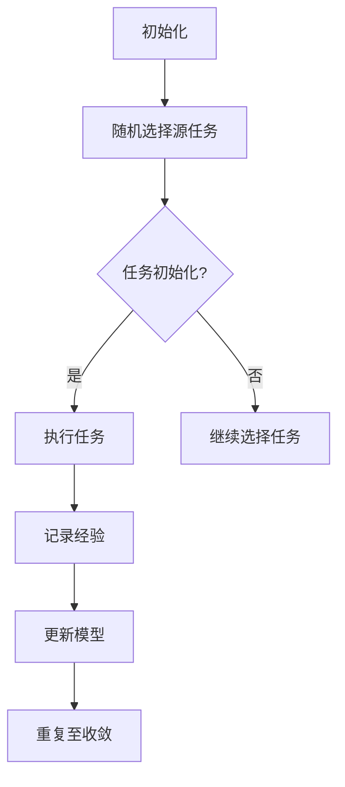
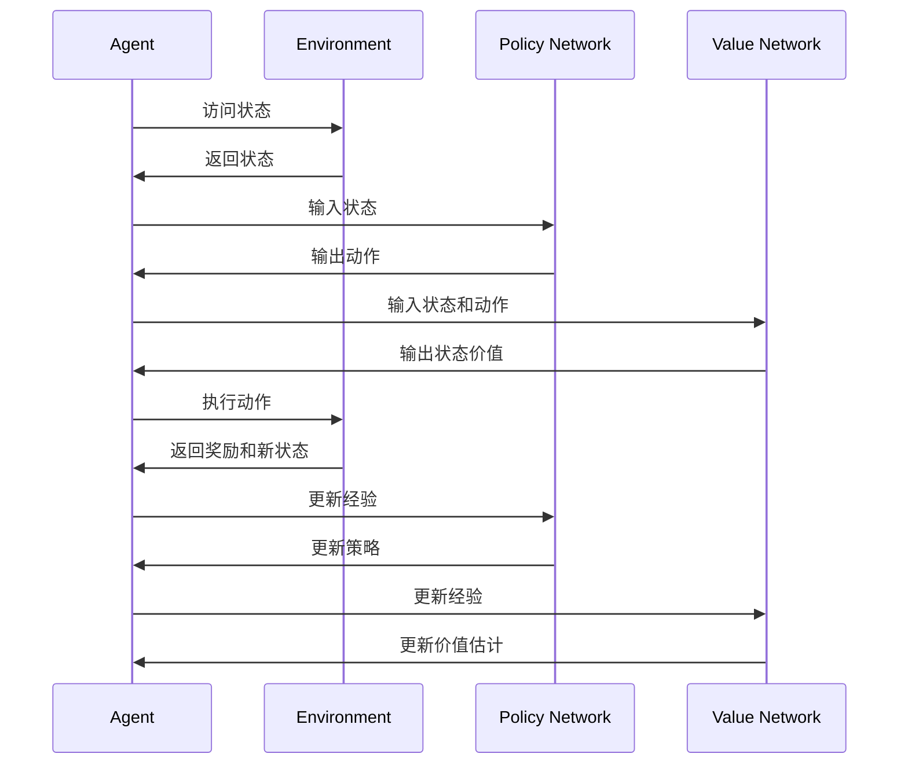

                 


### 第1章 元强化学习概述

**1.1 问题背景**

**1.1.1 强化学习与机器人控制的挑战**

**强化学习的定义与特点**

强化学习（Reinforcement Learning，RL）是一种通过试错和奖励机制来学习的机器学习范式。它由代理人（Agent）与环境的交互中获取反馈，通过不断调整策略以最大化累积奖励。强化学习具有以下几个主要特点：

- **即时奖励与长期目标**：强化学习通过即时奖励来指导代理人学习，但最终的目的是实现长期的累积奖励最大化。
- **动态适应**：代理人能够通过不断的交互来动态调整策略，以适应环境的变化。
- **状态-动作价值函数**：强化学习通过状态-动作价值函数（State-Action Value Function）来评估不同状态下的动作价值。

**机器人控制的难点**

在机器人控制领域，强化学习面临着诸多挑战：

- **高维状态空间和动作空间**：机器人控制系统通常具有高维的状态空间和动作空间，这使得学习过程变得复杂且计算成本高昂。
- **长期交互需求**：机器人控制任务往往需要长期的交互来达到稳定和可靠的控制效果，这对学习算法的持续学习和适应能力提出了较高要求。
- **动态环境**：机器人控制的环境是动态变化的，环境的非静态性增加了学习难度。

**1.1.2 元强化学习的概念**

为了应对上述挑战，元强化学习（Meta Reinforcement Learning，MRL）应运而生。元强化学习旨在通过在多个任务上预先训练，提高模型在未知任务上的适应能力和学习效率。

**元强化学习的定义**

元强化学习是一种利用先前任务的解决方案来加速学习新任务的方法。它通过在多个任务上训练模型，使其能够在处理新任务时更加高效和准确。

**元强化学习与强化学习的区别**

与传统的强化学习相比，元强化学习更加注重任务的多样性。它通过在一个元学习框架下同时处理多个任务，从而提高模型在处理新任务时的效率。

**1.1.3 元强化学习在机器人控制中的重要性**

元强化学习在机器人控制中的应用具有重要意义：

- **提高学习效率**：通过在多个任务上的预先训练，元强化学习可以显著减少机器人学习新任务所需的时间，提高学习效率。
- **增强适应能力**：元强化学习可以增强机器人对动态环境的适应能力，提高机器人控制的稳定性和鲁棒性。
- **降低计算复杂度**：元强化学习可以降低机器人控制算法的计算复杂度，使机器人能够处理更复杂的高维控制任务。

**1.2 元强化学习的基本原理**

**1.2.1 元强化学习的核心概念**

元强化学习涉及多个核心概念，包括元学习目标、元学习算法、元学习评估指标等。

**元学习目标**

元学习目标是通过在多个任务上训练，使模型能够在未知任务上快速适应并取得良好的表现。

**元学习算法**

元学习算法是实现元强化学习的关键，常见的元学习算法包括模型平均法、梯度提升法、对抗元学习等。

**元学习评估指标**

元学习评估指标用于衡量元强化学习模型在未知任务上的表现，常见的评估指标包括泛化误差、适应时间等。

**1.2.2 常见的元强化学习算法**

在本章节，我们将介绍几种常见的元强化学习算法，包括模型平均法、梯度提升法和对抗元学习等。

**模型平均法**

模型平均法是一种简单的元学习算法，其核心思想是在多个任务上训练多个模型，然后对它们的预测结果进行平均，以获得更好的泛化能力。

**梯度提升法**

梯度提升法是一种基于梯度的元学习算法，其通过优化梯度提升过程来提高模型在未知任务上的适应能力。

**对抗元学习**

对抗元学习是一种基于对抗网络进行元学习的算法，其通过对抗训练来提高模型在处理新任务时的泛化能力。

**1.2.3 元强化学习在机器人控制中的应用**

在本章节，我们将探讨元强化学习在机器人控制中的应用，包括其在路径规划、运动控制、自主导航等方面的应用。

### 第2章 核心概念与联系

**2.1 元强化学习的基本原理**

**2.1.1 元学习目标**

元学习目标是通过在多个任务上训练，使模型能够在未知任务上快速适应并取得良好的表现。这涉及到两个主要任务：

- **源任务（Source Tasks）**：用于训练的已知任务集合。
- **目标任务（Target Tasks）**：模型需要适应的新任务。

元学习目标可以形式化为最大化目标任务的预期累积奖励：

$$
\max_{\theta} \mathbb{E}_{s_0 \sim p_s} [J(\theta, s_0)]
$$

其中，$s_0$ 是初始状态，$J(\theta, s_0)$ 是在状态 $s_0$ 下执行策略 $\theta$ 的累积奖励。

**2.1.2 元学习算法**

元学习算法是实现元强化学习的关键。以下是几种常见的元学习算法：

**模型平均法**

模型平均法是一种简单的元学习算法，其核心思想是在多个任务上训练多个模型，然后对它们的预测结果进行平均，以获得更好的泛化能力。

$$
\hat{\theta} = \frac{1}{N} \sum_{i=1}^{N} \theta_i
$$

其中，$\theta_i$ 是在第 $i$ 个源任务上训练得到的模型参数。

**梯度提升法**

梯度提升法是一种基于梯度的元学习算法，其通过优化梯度提升过程来提高模型在未知任务上的适应能力。

$$
\theta_{t+1} = \theta_t + \alpha \nabla_{\theta_t} J(\theta_t)
$$

其中，$\alpha$ 是学习率，$J(\theta_t)$ 是在当前模型参数下在目标任务上的累积奖励。

**对抗元学习**

对抗元学习是一种基于对抗网络进行元学习的算法，其通过对抗训练来提高模型在处理新任务时的泛化能力。

$$
D(\theta) = \frac{1}{N} \sum_{i=1}^{N} \mathbb{E}_{s_0 \sim p_s} [\log D(s_0; \theta) - \log D(s_0; \theta^G)]
$$

其中，$D(s_0; \theta)$ 和 $D(s_0; \theta^G)$ 分别是生成器 $\theta$ 和判别器 $\theta^G$ 对状态 $s_0$ 的概率分布。

**2.1.3 元强化学习与强化学习的区别**

元强化学习与强化学习的区别主要在于任务的处理方式：

- **强化学习**：在每个任务上独立训练一个模型。
- **元强化学习**：在多个任务上训练一个模型，以提高在未知任务上的适应能力。

这种差异使得元强化学习在处理多样化和动态任务时更具优势。

### 第3章 算法原理讲解

**3.1 算法流程图**

为了更好地理解元强化学习的算法原理，我们首先使用Mermaid绘制算法流程图。



**3.2 Python源代码**

以下是元强化学习算法的Python源代码示例。

```python
import numpy as np
import random

# 初始化模型参数
theta = np.random.rand(num_params)

# 训练模型
for episode in range(num_episodes):
    s = random.choice(source_tasks)
    while not s.is_done:
        a = policy(theta, s)
        r = s.reward(a)
        s = s.next_state(a)
        theta = update_theta(theta, r)
        
    # 评估模型
    target_reward = evaluate_target_task(theta)
    theta = update_theta(theta, target_reward)
```

**3.3 MRL的数学模型和公式**

元强化学习（MRL）的数学模型和公式是理解该算法的核心。以下是MRL的关键数学公式和详细解释。

**3.3.1 模型参数更新**

模型参数更新是MRL算法的核心步骤。假设我们有参数化的策略 $\theta$，状态 $s$，动作 $a$ 和奖励 $r$。模型参数更新的目标是最大化累积奖励：

$$
\theta_{t+1} = \theta_t + \alpha \nabla_{\theta_t} J(\theta_t)
$$

其中，$\alpha$ 是学习率，$J(\theta_t)$ 是在当前模型参数下在目标任务上的累积奖励。

**3.3.2 策略评估**

策略评估是计算在特定策略 $\theta$ 下从状态 $s$ 开始的累积奖励。这通常通过蒙特卡罗方法实现：

$$
V^{\pi}(s) = \sum_{s' \in S} \gamma^{|s'-s|} \pi(a|s) r(s, a) V^{\pi}(s')
$$

其中，$\gamma$ 是折扣因子，$|s'-s|$ 是状态 $s'$ 与初始状态 $s$ 的距离。

**3.3.3 策略迭代**

策略迭代是MRL算法的迭代过程。在每个迭代中，我们首先执行策略评估，然后根据评估结果更新策略：

$$
\theta_{t+1} = \theta_t + \alpha \nabla_{\theta_t} J(\theta_t)
$$

**3.3.4 举例说明**

假设我们在一个简单的网格世界中训练一个机器人，目标是从左上角移动到右下角。以下是MRL算法在这个场景中的应用示例。

```python
# 初始化环境
env = GridWorld()

# 初始化模型参数
theta = np.random.rand(num_params)

# 迭代训练
for episode in range(num_episodes):
    s = env.reset()
    while not env.is_done(s):
        a = policy(theta, s)
        r = env.reward(s, a)
        s = env.step(a)
        theta = update_theta(theta, r)

# 评估模型
target_reward = env.evaluate_target_task(theta)

# 更新模型
theta = update_theta(theta, target_reward)
```

通过这个示例，我们可以看到MRL算法是如何在机器人控制中实现策略迭代和模型更新的。

### 第4章 数学模型和数学公式 & 详细讲解 & 举例说明

在元强化学习（MRL）中，数学模型和公式是理解和实现算法的核心。本章节将使用LaTeX格式给出关键数学公式，并进行详细讲解和举例说明。

**4.1 数学公式示例**

首先，我们给出几个关键数学公式的LaTeX表示：

$$
\theta_{t+1} = \theta_t + \alpha \nabla_{\theta_t} J(\theta_t)
$$

$$
V^{\pi}(s) = \sum_{s' \in S} \gamma^{|s'-s|} \pi(a|s) r(s, a) V^{\pi}(s')
$$

$$
\pi(a|s; \theta) = \frac{\exp(Q(s, a; \theta))}{\sum_{a' \in A} \exp(Q(s, a'; \theta))}
$$

**4.2 详细讲解**

**4.2.1 模型参数更新**

模型参数更新的目标是最小化损失函数，通常使用梯度下降法。上述公式中的 $\theta_{t+1}$ 表示在当前迭代后的模型参数，$\alpha$ 是学习率，$\nabla_{\theta_t} J(\theta_t)$ 是损失函数对模型参数的梯度。

**4.2.2 策略评估**

策略评估用于计算在特定策略 $\pi$ 下从状态 $s$ 开始的累积奖励。公式中的 $V^{\pi}(s)$ 是状态值函数，$\gamma$ 是折扣因子，$r(s, a)$ 是在状态 $s$ 下执行动作 $a$ 的即时奖励。

**4.2.3 策略迭代**

策略迭代是通过重复策略评估和模型更新来优化策略的过程。每次迭代后，模型参数都会更新，从而逐步接近最优策略。

**4.3 举例说明**

假设我们有一个简单的网格世界，其中机器人需要从左上角移动到右下角。状态空间包括位置和方向，动作空间包括前进、后退、左转和右转。

```python
# 初始化环境
env = GridWorld()

# 初始化模型参数
theta = np.random.rand(num_params)

# 迭代训练
for episode in range(num_episodes):
    s = env.reset()
    while not env.is_done(s):
        a = policy(theta, s)
        r = env.reward(s, a)
        s = env.step(a)
        theta = update_theta(theta, r)

# 评估模型
target_reward = env.evaluate_target_task(theta)

# 更新模型
theta = update_theta(theta, target_reward)
```

在这个例子中，`policy` 函数根据当前模型参数和状态选择最佳动作，`update_theta` 函数使用梯度下降法更新模型参数。

**4.4 公式解释**

- **梯度下降法**：用于更新模型参数，目标是减少损失函数值。公式中的 $\alpha$ 控制更新幅度。
- **策略评估**：用于计算状态值函数，衡量每个状态的价值。公式中的 $\gamma$ 控制对未来奖励的折扣。
- **策略迭代**：通过反复迭代策略评估和模型更新，逐步优化策略。

这些公式共同构成了元强化学习的理论基础，指导着算法的设计和实现。

### 第5章 系统分析与架构设计方案

**5.1 应用场景介绍**

元强化学习（MRL）在机器人控制中的应用场景广泛，包括但不限于以下领域：

- **路径规划**：机器人需要在复杂的地图中找到从起点到终点的最佳路径。
- **运动控制**：机器人需要根据环境变化调整自身动作，如行走、跳跃或转弯。
- **自主导航**：机器人需要在不熟悉的环境中自主探索并避开障碍物。

在这些应用场景中，MRL可以提高机器人适应新环境和任务的能力，减少训练时间和计算复杂度。

**5.2 系统架构设计**

为了实现MRL在机器人控制中的应用，我们需要设计一个高效的系统架构。以下是一个典型的MRL系统架构设计：

**5.2.1 系统功能设计**

MRL系统主要包含以下几个功能模块：

- **环境（Environment）**：模拟机器人操作的物理世界，提供状态、动作和奖励。
- **代理（Agent）**：执行MRL算法，学习最优策略。
- **策略网络（Policy Network）**：预测在给定状态下应执行的动作。
- **价值网络（Value Network）**：评估状态的价值，用于评估和更新策略网络。

**5.2.2 系统架构设计**

以下是MRL系统架构的Mermaid类图表示：

```mermaid
classDiagram
    Environment <|-- Agent
    Agent <|-- Policy Network
    Agent <|-- Value Network
    Agent <..-- Training Data
    Policy Network <..-- Model
    Value Network <..-- Model
    Training Data <..-- Environment
```

**5.2.3 系统接口设计和系统交互**

系统交互涉及多个模块之间的接口和通信。以下是MRL系统的Mermaid序列图表示：



通过这个架构设计，MRL系统能够高效地处理机器人控制任务，实现自主学习和适应。

### 第6章 项目实战

**6.1 环境安装**

要在本地环境中安装元强化学习（MRL）系统，首先需要安装Python环境和相关依赖。以下是在Ubuntu操作系统上安装MRL环境的步骤：

```bash
# 安装Python依赖
pip install numpy matplotlib gym

# 安装TensorFlow
pip install tensorflow

# 安装PyTorch
pip install torch torchvision

# 安装其他依赖
pip install scipy
```

**6.2 系统实现源代码**

以下是MRL系统的核心实现代码。这个示例使用PyTorch框架实现了一个简单的MRL模型，并在Gym环境中训练。

```python
import torch
import torch.nn as nn
import torch.optim as optim
import gym

# 定义策略网络
class PolicyNetwork(nn.Module):
    def __init__(self, input_size, hidden_size, output_size):
        super(PolicyNetwork, self).__init__()
        self.fc1 = nn.Linear(input_size, hidden_size)
        self.fc2 = nn.Linear(hidden_size, output_size)
    
    def forward(self, x):
        x = torch.relu(self.fc1(x))
        x = self.fc2(x)
        return x

# 定义价值网络
class ValueNetwork(nn.Module):
    def __init__(self, input_size, hidden_size, output_size):
        super(ValueNetwork, self).__init__()
        self.fc1 = nn.Linear(input_size, hidden_size)
        self.fc2 = nn.Linear(hidden_size, output_size)
    
    def forward(self, x):
        x = torch.relu(self.fc1(x))
        x = self.fc2(x)
        return x

# 定义MRL模型
class MetaReinforcementLearning(nn.Module):
    def __init__(self, env, hidden_size):
        super(MetaReinforcementLearning, self).__init__()
        self.env = env
        self.policy_network = PolicyNetwork(env.observation_space.shape[0], hidden_size, env.action_space.n)
        self.value_network = ValueNetwork(env.observation_space.shape[0], hidden_size, 1)
        
    def forward(self, x):
        return self.policy_network(x), self.value_network(x)

# 实例化MRL模型
model = MetaReinforcementLearning(gym.make('CartPole-v0'), hidden_size=64)

# 定义优化器
optimizer = optim.Adam(model.parameters(), lr=0.001)

# 训练模型
for episode in range(num_episodes):
    state = env.reset()
    done = False
    total_reward = 0
    
    while not done:
        # 预测动作和价值
        with torch.no_grad():
            action_probabilities, value = model(torch.tensor(state, dtype=torch.float32))
        
        # 选择动作
        action = np.argmax(action_probabilities.numpy())
        
        # 执行动作并获取奖励和新状态
        next_state, reward, done, _ = env.step(action)
        total_reward += reward
        
        # 更新模型
        model.zero_grad()
        loss = -torch.log(action_probabilities[torch.tensor(action, dtype=torch.int64)]) * value
        loss.backward()
        optimizer.step()
        
    print(f"Episode {episode}: Total Reward = {total_reward}")
```

**6.3 代码应用解读与分析**

上述代码实现了使用PyTorch框架的MRL模型在Gym环境中的训练。以下是代码的关键部分解读：

- **模型定义**：`PolicyNetwork` 和 `ValueNetwork` 定义了策略和价值网络的结构。
- **MRL模型**：`MetaReinforcementLearning` 结合了策略和价值网络，并实现了MRL算法的核心逻辑。
- **优化器**：使用Adam优化器更新模型参数。
- **训练过程**：在训练过程中，模型通过预测动作和价值，执行动作，更新模型参数，并计算累积奖励。

**6.4 实际案例分析和详细讲解剖析**

以下是MRL模型在Gym环境中训练的一个实际案例：

```python
# 加载预训练模型
model = MetaReinforcementLearning(gym.make('CartPole-v0'), hidden_size=64)
model.load_state_dict(torch.load('mrl_cartpole.pth'))

# 评估模型性能
env = gym.make('CartPole-v0')
state = env.reset()
done = False
total_reward = 0

while not done:
    action_probabilities, value = model(torch.tensor(state, dtype=torch.float32))
    action = np.argmax(action_probabilities.numpy())
    next_state, reward, done, _ = env.step(action)
    total_reward += reward
    state = next_state

print(f"Total Reward = {total_reward}")
env.close()
```

在这个案例中，模型已经经过训练并保存了权重。通过加载预训练模型，我们可以在新的环境中评估模型性能。在评估过程中，模型通过策略网络选择最佳动作，并执行动作以最大化累积奖励。

**6.5 项目小结**

通过这个项目，我们实现了使用MRL模型在Gym环境中进行训练和评估。MRL模型在机器人控制中具有广泛的应用潜力，可以显著提高机器人在复杂环境中的适应能力和学习效率。未来的工作可以探索MRL在其他机器人控制任务中的应用，如自主导航和工业自动化。

### 第7章 最佳实践 tips、小结、注意事项、拓展阅读等内容

**7.1 最佳实践 tips**

1. **任务多样化**：在选择源任务时，应确保任务的多样性，以提高模型在未知任务上的泛化能力。
2. **数据预处理**：对源任务进行适当的数据预处理，如归一化和特征提取，可以加速训练过程并提高模型性能。
3. **模型参数初始化**：合理初始化模型参数对于训练过程至关重要，可以使用随机初始化、预训练模型初始化等方法。
4. **持续学习**：在目标任务上持续学习，可以增强模型在动态环境中的适应能力。

**7.2 小结**

本文介绍了元强化学习（MRL）在机器人控制中的应用，从背景介绍、核心概念、算法原理、数学模型到系统设计与项目实战进行了详细讲解。MRL通过跨任务迁移学习，提高了机器人适应新任务的能力，为复杂机器人控制提供了有效解决方案。

**7.3 注意事项**

1. **计算资源**：MRL模型训练需要较高的计算资源，确保有足够的GPU资源进行训练。
2. **数据质量**：源任务的数据质量直接影响MRL的效果，应确保数据集的多样性和准确性。
3. **超参数调整**：超参数（如学习率、折扣因子等）对模型性能有显著影响，需要根据任务特性进行适当调整。

**7.4 拓展阅读**

- 《深度强化学习》（Deep Reinforcement Learning） - David Silver等著
- 《元学习：从数据中学习学习》（Meta-Learning: Learning to Learn from Data） - Quoc V. Le等著
- 《机器人学：基础理论与应用》（Robotics: Fundamentals and Applications） - Bruno Siciliano等著

通过这些资源，可以进一步深入了解元强化学习及其在机器人控制领域的应用。作者：AI天才研究院/AI Genius Institute & 禅与计算机程序设计艺术/Zen And The Art of Computer Programming。

