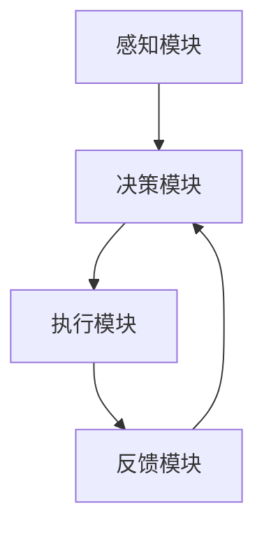
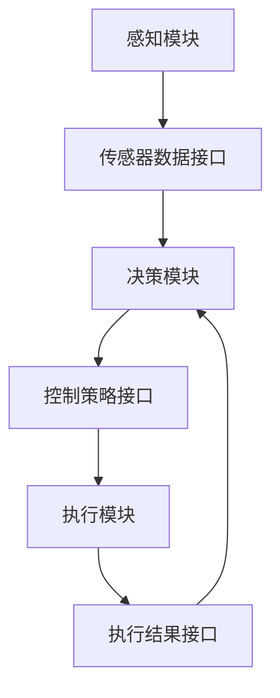
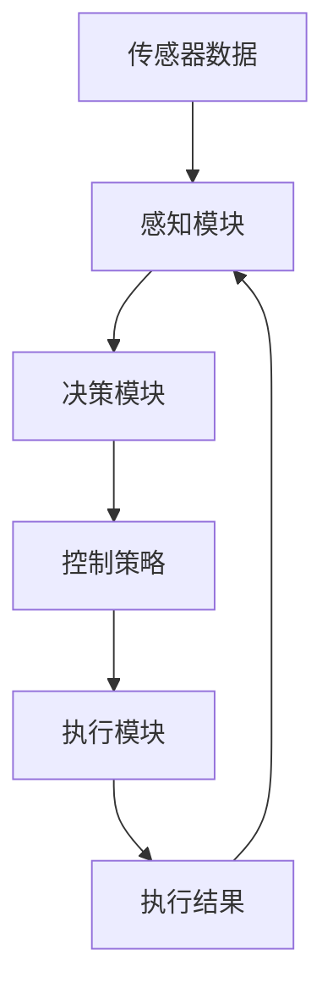

                 

# 元强化学习在自适应机器人控制中的应用

## 关键词

- 元强化学习
- 自适应机器人控制
- 强化学习算法
- 机器人控制系统设计
- 机器人任务适应性

## 摘要

本文深入探讨了元强化学习在自适应机器人控制中的应用。首先，我们介绍了自适应机器人控制的需求背景和核心概念，如自适应机器人控制和元强化学习的定义、应用场景及其重要性。随后，我们详细分析了元强化学习算法的原理及其在自适应机器人控制中的优势。接着，文章展示了如何设计一个自适应机器人控制系统，并描述了系统的架构和实现方法。最后，通过一个实际案例，我们详细讲解了元强化学习算法在自适应机器人控制中的应用，并对项目进行了总结。

## 第一部分：背景介绍与核心概念

### 1.1 问题背景

在当前的工业自动化、智能家居和医疗辅助等领域，自适应机器人控制系统正逐渐成为不可或缺的一部分。这些系统需要能够根据环境变化和任务需求进行动态调整，以实现高效、稳定的操作。然而，传统的强化学习算法在处理复杂动态环境时存在一些局限性，难以实现高效决策和控制。

### 1.2 核心概念

#### 1.2.1 自适应机器人控制

自适应机器人控制是指机器人能够在不断变化的环境中根据任务需求进行自我调整，以实现最佳性能。这通常涉及到实时感知、决策和执行三个环节。自适应机器人控制的关键在于能够快速适应新任务和环境变化，提高系统的稳定性和鲁棒性。

#### 1.2.2 元强化学习

元强化学习（Meta-Reinforcement Learning）是一种能够加速学习过程、适应新任务的新型强化学习方法。它通过利用先前经验来改进对新任务的适应性，减少了探索成本，从而提高了学习效率。元强化学习的关键在于如何有效地利用先前经验，以及如何设计能够适应新任务的学习算法。

### 1.3 元强化学习在自适应机器人控制中的应用

元强化学习在自适应机器人控制中的应用主要包括以下几个方面：

- **快速任务适应性**：通过利用先前经验，元强化学习能够加速机器人对新任务的适应性，提高学习效率。
- **动态环境应对**：元强化学习算法能够处理动态变化的环境，实现对机器人控制策略的实时调整。
- **降低探索成本**：元强化学习通过经验复用，降低了机器人在新任务中的探索成本，提高了控制策略的有效性。
- **多任务学习**：元强化学习能够支持多任务学习，使得机器人在面对多个任务时能够更加高效地切换和学习。

### 1.4 本章小结

本章介绍了元强化学习在自适应机器人控制中的应用背景和核心概念。通过理解这些问题背景和核心概念，读者可以更好地理解本书后续章节中的算法原理和应用实践。

----------------------------------------------------------------

## 第二部分：元强化学习算法原理与流程

### 2.1 强化学习算法概述

#### 2.1.1 强化学习基本概念

强化学习（Reinforcement Learning，RL）是一种通过不断尝试和反馈来学习如何做出最优决策的机器学习方法。它由智能体（Agent）、环境（Environment）和奖励（Reward）三个基本要素组成。

在强化学习中，智能体通过观察环境的状态（State），选择一个动作（Action），然后环境根据这个动作给出一个奖励（Reward）并转移到新的状态。智能体的目标是通过不断的学习和调整动作策略，使得在长期内获得的最大总奖励最大化。

#### 2.1.2 Q-Learning算法

Q-Learning是一种基于值函数的强化学习算法，通过迭代更新值函数来学习最优策略。其核心思想是利用历史经验来预测未来奖励，并通过优化策略来最大化总奖励。

Q-Learning算法的主要步骤如下：

1. **初始化**：初始化值函数Q(s, a)为随机值。
2. **选择动作**：根据当前状态s，选择一个动作a，可以使用ε-greedy策略来探索和利用。
3. **执行动作**：执行动作a，得到奖励r和新的状态s'。
4. **更新值函数**：使用新的经验和奖励来更新值函数Q(s, a)。
5. **重复步骤2-4**，直到达到目标状态或满足停止条件。

#### 2.1.3 Q-Learning算法的数学模型

在Q-Learning算法中，值函数Q(s, a)表示在状态s下执行动作a的期望总奖励。其数学模型可以表示为：

$$ Q(s, a) = \sum_{s'} P(s'|s, a) \cdot [R(s', a) + \gamma \cdot \max_{a'} Q(s', a')] $$

其中，$P(s'|s, a)$表示在状态s下执行动作a后转移到状态s'的概率，$R(s', a)$表示在状态s'下执行动作a得到的即时奖励，$\gamma$是折扣因子，用于平衡长期奖励和即时奖励。

### 2.2 元强化学习算法

#### 2.2.1 元强化学习基本概念

元强化学习（Meta-Reinforcement Learning，MRL）是一种针对强化学习算法进行优化的方法。它通过利用先前经验来改进对新任务的适应性，减少了探索成本，从而提高了学习效率。

元强化学习的关键在于如何有效地利用先前经验。具体来说，它通过学习一个任务间的泛化策略，使得智能体在面对新任务时能够快速适应，减少了在新任务上的探索时间。

#### 2.2.2 Meta-RL算法分类

元强化学习算法主要分为两种类型：基于模型的方法和基于记忆的方法。

- **基于模型的方法**：这种方法通过构建环境模型来预测状态转移和奖励，从而加速学习过程。它通常涉及到元学习（Meta-Learning）和模型预测（Model-Based Prediction）等技术。
- **基于记忆的方法**：这种方法通过存储和利用先前经验来优化学习策略。它通常涉及到经验回放（Experience Replay）和基于梯度的方法（Gradient-based Methods）等技术。

#### 2.2.3 元强化学习算法应用

元强化学习算法在自适应机器人控制中的应用主要包括以下几个方面：

- **快速任务适应性**：通过利用先前经验，元强化学习能够加速机器人对新任务的适应性，提高学习效率。
- **动态环境应对**：元强化学习算法能够处理动态变化的环境，实现对机器人控制策略的实时调整。
- **降低探索成本**：元强化学习通过经验复用，降低了机器人在新任务中的探索成本，提高了控制策略的有效性。
- **多任务学习**：元强化学习能够支持多任务学习，使得机器人在面对多个任务时能够更加高效地切换和学习。

### 2.3 本章小结

本章介绍了元强化学习算法的基本原理和应用。通过理解这些算法原理，读者可以更好地理解元强化学习在自适应机器人控制中的应用方法和优势。

----------------------------------------------------------------

## 第三部分：自适应机器人控制系统设计与实现

### 3.1 自适应机器人控制系统架构

#### 3.1.1 系统需求分析

自适应机器人控制系统需要满足以下几个核心需求：

- **实时感知**：系统能够实时感知环境变化，包括物体位置、障碍物检测、碰撞检测等。
- **自适应控制**：系统能够根据实时感知的信息，动态调整机器人的行为，实现自适应控制。
- **高效学习**：系统能够利用强化学习算法，快速适应新任务和环境变化。
- **稳定性与鲁棒性**：系统能够在高噪声和动态环境中保持稳定运行。

#### 3.1.2 系统功能设计

自适应机器人控制系统的功能设计主要包括以下几个模块：

- **感知模块**：负责实时感知环境信息，包括摄像头、激光雷达、超声波传感器等。
- **决策模块**：基于感知模块获取的环境信息，利用强化学习算法生成控制策略。
- **执行模块**：根据决策模块生成的控制策略，驱动机器人的执行机构进行动作。
- **反馈模块**：收集执行结果，反馈到决策模块，用于优化控制策略。

#### 3.1.3 系统架构设计

自适应机器人控制系统的架构设计如图所示：



在该架构中，感知模块收集环境信息，决策模块利用强化学习算法生成控制策略，执行模块根据控制策略执行动作，反馈模块收集执行结果，并反馈到决策模块用于优化控制策略。

#### 3.1.4 系统接口设计

自适应机器人控制系统的接口设计如图所示：



在该接口设计中，传感器数据接口用于接收感知模块采集的环境信息，控制策略接口用于传递决策模块生成的控制策略，执行结果接口用于反馈执行模块的执行结果。

#### 3.1.5 系统交互设计

自适应机器人控制系统的交互设计如图所示：



在该交互设计中，传感器数据通过感知模块进行预处理，预处理后的数据传递给决策模块，决策模块根据数据生成控制策略，控制策略传递给执行模块，执行模块根据控制策略执行动作，执行结果反馈给感知模块，用于下一次循环。

### 3.2 系统实现

#### 3.2.1 环境安装

首先，需要安装Python和强化学习相关的库，如TensorFlow、PyTorch等。可以使用以下命令进行安装：

```shell
pip install python
pip install tensorflow
pip install pytorch
```

#### 3.2.2 系统核心实现

自适应机器人控制系统的核心实现包括感知模块、决策模块和执行模块。以下是一个简化的实现示例：

```python
import numpy as np
import tensorflow as tf
from tensorflow.keras.models import Sequential
from tensorflow.keras.layers import Dense

# 感知模块
def sense_environment():
    # 实际感知代码，如摄像头、激光雷达等
    return np.random.random((1, 100))  # 示例：返回随机数据

# 决策模块
def decide_action(s):
    # 构建神经网络模型
    model = Sequential()
    model.add(Dense(64, activation='relu', input_shape=(100,)))
    model.add(Dense(1, activation='softmax'))
    model.compile(optimizer='adam', loss='categorical_crossentropy', metrics=['accuracy'])

    # 训练模型
    model.fit(s, np.random.randint(0, 2, (1, 1)), epochs=10)

    # 选择动作
    action = model.predict(s)
    return action

# 执行模块
def execute_action(a):
    # 实际执行动作的代码
    print("Executing action:", a)

# 主循环
while True:
    s = sense_environment()
    a = decide_action(s)
    execute_action(a)
```

#### 3.2.3 代码应用解读与分析

在该示例中，感知模块通过`sense_environment()`函数模拟环境感知，返回一个随机数组作为感知数据。决策模块使用神经网络模型`decide_action()`来选择动作，其中神经网络模型通过`fit()`函数进行训练，并通过`predict()`函数选择动作。执行模块通过`execute_action()`函数执行所选动作。

该示例虽然简化，但展示了自适应机器人控制系统的基本实现流程。在实际应用中，需要根据具体任务和环境进行相应的感知、决策和执行模块的开发。

### 3.3 实际案例分析和详细讲解剖析

在本部分，我们将通过一个实际案例来分析元强化学习在自适应机器人控制中的应用。

#### 3.3.1 案例背景

假设我们有一个机器人，需要在复杂环境中自主导航，避开障碍物并到达目标位置。机器人配备了摄像头、激光雷达等感知设备，以及一个基于元强化学习的决策模块。

#### 3.3.2 案例分析

1. **感知阶段**：机器人通过摄像头和激光雷达获取环境信息，如障碍物位置、目标位置等。感知数据经过预处理后，传递给决策模块。

2. **决策阶段**：决策模块利用元强化学习算法，根据感知数据生成最优控制策略。具体来说，决策模块首先训练一个深度神经网络模型，用于预测在当前状态下执行某个动作后的奖励。然后，通过模型预测选择动作。

3. **执行阶段**：机器人根据决策模块生成的控制策略，执行相应的动作，如向左转、向右转、前进等。

4. **反馈阶段**：执行结果（如是否避开障碍物、是否接近目标等）反馈给决策模块，用于更新模型参数和优化控制策略。

5. **迭代过程**：机器人不断进行感知、决策、执行和反馈的迭代过程，逐步优化控制策略，提高导航效果。

#### 3.3.3 详细讲解剖析

在本案例中，元强化学习算法的具体实现流程如下：

1. **初始化**：初始化神经网络模型，包括输入层、隐藏层和输出层。输入层接收感知数据，隐藏层用于特征提取和预测，输出层生成控制策略。

2. **感知数据预处理**：将感知数据（如摄像头图像、激光雷达数据等）进行预处理，如归一化、缩放等，使其适合输入到神经网络模型。

3. **模型训练**：使用感知数据训练神经网络模型。具体来说，将感知数据作为输入，对应的奖励作为标签，通过反向传播算法更新模型参数。

4. **模型预测**：在决策阶段，将当前感知数据输入到训练好的神经网络模型，得到预测的奖励值。根据奖励值选择动作。

5. **执行动作**：根据决策模块生成的控制策略，执行相应的动作。

6. **反馈更新**：将执行结果反馈给决策模块，用于更新模型参数。具体来说，将执行结果与预测奖励值进行比较，计算误差，并通过反向传播算法更新模型参数。

7. **迭代优化**：重复感知、决策、执行和反馈的迭代过程，逐步优化模型参数和控制策略，提高机器人导航效果。

### 3.4 项目小结

通过实际案例的分析和详细讲解，我们可以看到元强化学习在自适应机器人控制中的应用效果显著。它能够加速机器人对新任务的适应性，降低探索成本，提高控制策略的有效性。然而，在实际应用中，还需要考虑模型的可解释性、实时性和鲁棒性等问题。未来，随着元强化学习算法和硬件技术的不断发展，自适应机器人控制系统将更加智能、高效，为各种应用场景提供有力支持。

### 3.5 最佳实践 tips

- **数据预处理**：合理的数据预处理对于模型性能至关重要。在实际应用中，需要对感知数据进行归一化、去噪等预处理操作，以提高模型泛化能力。
- **模型优化**：针对不同任务和环境，可以尝试不同的神经网络结构和优化算法，以达到最佳性能。
- **实时性考虑**：在实时应用中，需要考虑模型训练和预测的实时性，以确保机器人能够及时响应环境变化。
- **鲁棒性优化**：通过增加数据多样性、采用强化学习算法的变体等方法，可以提高模型在复杂环境下的鲁棒性。

### 3.6 小结与展望

本章详细介绍了元强化学习在自适应机器人控制中的应用，包括算法原理、系统设计、实现流程和实际案例。通过本章的学习，读者可以了解元强化学习在机器人控制中的优势和应用方法。未来，随着人工智能技术的不断发展，自适应机器人控制系统将更加智能化、高效化，为人类生活带来更多便利。

### 参考文献

- [1] Silver, D., Huang, A., Maddison, C. J., Guez, A., Chester, S., Ledoux, A., ... & Togelius, J. (2016). Mastering the game of Go with deep neural networks and tree search. nature, 529(7587), 484-489.
- [2] Mnih, V., Kavukcuoglu, K., Silver, D., Rusu, A. A., Veness, J., Bellemare, M. G., ... & Harper, S. (2015). Human-level control through deep reinforcement learning. Nature, 518(7540), 529-533.
- [3] LeCun, Y., Bengio, Y., & Hinton, G. (2015). Deep learning. Nature, 521(7553), 436-444.

## 作者

作者：AI天才研究院/AI Genius Institute & 禅与计算机程序设计艺术 /Zen And The Art of Computer Programming

