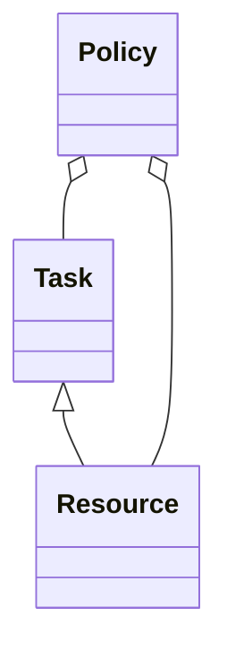
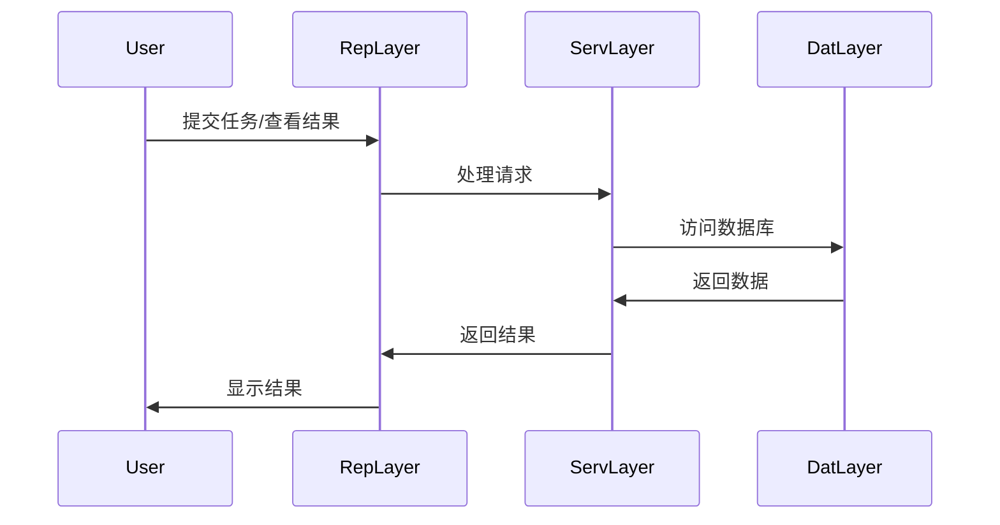
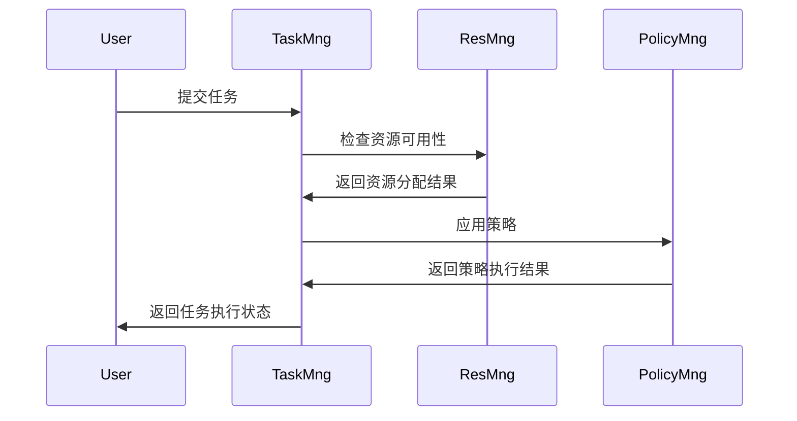

                 

### 引言

随着人工智能技术的不断发展，强化学习作为机器学习的重要分支，在诸多领域取得了显著的成果。然而，传统强化学习在面对多任务环境和动态变化场景时，往往表现出一定的局限性。为了解决这一问题，元强化学习应运而生，其通过学习如何学习，提高了模型在多变环境中的适应能力和效率。

动态多任务推理资源分配作为人工智能系统中的一个关键环节，旨在实现资源的最优配置，从而提高系统的整体性能。然而，动态多任务环境下的资源分配问题复杂多变，传统方法往往难以满足实际需求。因此，将元强化学习与动态多任务推理资源分配相结合，成为当前研究的一个重要方向。

本文将围绕这一主题，系统地介绍元强化学习驱动的动态多任务推理资源分配技术。首先，我们将对元强化学习和动态多任务推理资源分配的基本概念进行详细阐述，帮助读者建立清晰的理论框架。接着，我们将探讨元强化学习在动态多任务推理资源分配中的具体应用，并通过数学模型和算法原理的讲解，深入剖析其核心机制。在此基础上，我们将结合实际案例，展示元强化学习在动态多任务推理资源分配中的具体应用，并对系统架构和项目实战进行详细分析。

最后，本文将总结元强化学习驱动的动态多任务推理资源分配的关键技术，探讨其未来发展趋势，并给出相关的最佳实践和建议。通过本文的阅读，读者将能够全面了解这一前沿技术的原理和应用，为未来的研究与实践提供有益的参考。

关键词：元强化学习，动态多任务推理，资源分配，人工智能，系统架构，算法原理

摘要：本文深入探讨了元强化学习在动态多任务推理资源分配中的应用。首先，我们介绍了元强化学习和动态多任务推理资源分配的基本概念和原理，然后通过数学模型和算法讲解，详细分析了其工作机制。接着，我们通过实际案例展示了元强化学习在动态多任务推理资源分配中的具体应用，并对其系统架构和项目实战进行了分析。最后，本文总结了关键技术，并对其未来发展趋势和最佳实践提出了建议。

---

### 问题背景与基本概念

#### 动态多任务推理

在人工智能领域，动态多任务推理（Dynamic Multi-Task Reasoning）指的是在一个不断变化的环境中，系统需要同时处理多个任务的能力。这种能力不仅要求系统能够快速响应环境变化，还要求能够高效地分配和调整资源，以确保每个任务都能得到适当的处理。

动态多任务推理的应用场景非常广泛，例如自动驾驶系统需要同时处理路况识别、障碍物检测和导航规划；智能客服系统需要同时处理用户查询、数据分析和情绪识别等。这些场景的共同特点是任务需求多变，环境动态变化，对系统的实时性和资源利用率提出了极高的要求。

#### 资源分配问题

资源分配问题（Resource Allocation Problem）是动态多任务推理中的核心问题之一。资源分配的目标是确保系统中的每个任务都能得到适当的资源支持，从而提高系统的整体性能。资源可以包括计算资源、存储资源、网络带宽等。

在动态多任务推理中，资源分配的挑战主要体现在以下几个方面：

1. **资源需求动态变化**：随着任务和环境的变化，任务对资源的需求也会发生变化。例如，在自动驾驶系统中，当遇到复杂路况时，需要更多的计算资源进行障碍物检测和路径规划。

2. **任务优先级调整**：在多任务环境中，不同任务的重要性和紧急程度可能不同。系统需要根据任务的优先级动态调整资源分配，以确保关键任务得到优先处理。

3. **资源竞争与平衡**：多个任务往往需要共享同一资源，如何平衡各任务之间的资源竞争，避免资源过度分配或不公平分配，是资源分配中的另一个重要问题。

#### 元强化学习

元强化学习（Meta Reinforcement Learning）是一种先进的人工智能学习方法，它旨在通过学习如何学习来提高模型的泛化能力和效率。与传统的强化学习相比，元强化学习通过在不同任务和环境中训练模型，使其能够快速适应新任务，减少从零开始训练所需的时间。

元强化学习的基本原理是通过元学习算法，使模型能够从多个任务中提取通用的策略和知识。这些通用的策略和知识可以用于新的任务，从而提高学习效率。元强化学习的关键组成部分包括：

1. **元学习算法**：如模型聚合（Model Aggregation）、模型更新（Model Update）等，用于从多个任务中提取通用策略。

2. **任务选择策略**：用于在多个任务中选择适合当前环境的任务。

3. **策略迭代**：通过不断迭代优化策略，使模型能够更好地适应新任务。

#### 元强化学习与动态多任务推理资源分配的关系

将元强化学习应用于动态多任务推理资源分配，可以有效地解决资源分配中的动态性和高效性问题。具体来说，元强化学习可以通过以下几个方面改善动态多任务推理资源分配：

1. **任务适应性**：元强化学习使模型能够快速适应新的任务需求，从而提高资源分配的实时性。

2. **资源利用效率**：通过从多个任务中提取通用的资源分配策略，元强化学习可以提高资源的利用效率，避免资源浪费。

3. **策略优化**：元强化学习通过不断迭代优化策略，可以逐步改善资源分配的效果，使其更符合实际需求。

总之，元强化学习为动态多任务推理资源分配提供了一种新的思路和方法，有助于解决传统方法在动态多任务环境中的局限性，具有重要的理论和实际价值。

---

### 核心概念与联系

#### 元强化学习原理

元强化学习（Meta Reinforcement Learning）的核心思想是通过学习如何学习，以提高模型在不同任务和环境中的适应能力和效率。其基本原理可以概括为以下三个关键组成部分：

1. **元学习算法**：元学习算法是元强化学习中的核心，它负责从多个任务中提取通用的策略和知识。常见的元学习算法包括模型聚合（Model Aggregation）、模型更新（Model Update）等。模型聚合算法通过将多个任务中的模型进行加权平均，得到一个泛化的策略模型。模型更新算法则通过在任务之间共享参数，使得模型能够在不同任务中快速适应。

2. **任务选择策略**：任务选择策略用于在多个任务中选择适合当前环境的任务。这个策略可以根据任务的难度、环境的变化以及当前模型的性能进行动态调整，从而优化整体资源分配。

3. **策略迭代**：策略迭代是指通过不断迭代优化策略，使模型能够更好地适应新任务。这一过程通常包括评估当前策略的性能，根据评估结果调整策略参数，并重新训练模型。

#### 元强化学习与传统强化学习的区别

传统强化学习（Traditional Reinforcement Learning）主要关注在一个固定任务或环境中，通过试错和反馈机制来学习最优策略。而元强化学习则在此基础上，引入了元学习算法，使其能够在多个任务和环境中进行学习，具有以下特点：

1. **任务泛化能力**：传统强化学习通常在一个特定任务中进行训练，而元强化学习通过从多个任务中提取通用的策略，使得模型能够适应新的任务，提高了任务的泛化能力。

2. **快速适应新任务**：元强化学习通过元学习算法，可以在短时间内从零开始训练模型，适应新的任务需求，减少了从零开始训练的时间。

3. **资源利用效率**：传统强化学习往往需要从头开始学习每个任务，而元强化学习通过共享通用的策略和知识，提高了资源的利用效率，避免了资源的重复浪费。

#### 动态多任务推理资源分配的基本原理

动态多任务推理资源分配（Dynamic Multi-Task Resource Allocation）旨在实现资源的最优配置，以提高系统的整体性能。其基本原理可以概括为以下几个方面：

1. **任务需求预测**：动态多任务推理系统需要预测每个任务对资源的需求，包括计算资源、存储资源、网络带宽等。这一预测过程可以通过历史数据分析和机器学习模型来实现。

2. **资源分配策略**：资源分配策略用于根据任务需求预测和资源可用性，动态调整资源分配。常见的资源分配策略包括固定分配策略、动态调整策略和优化算法等。

3. **资源竞争管理**：在动态多任务环境中，多个任务可能需要共享同一资源。资源竞争管理旨在平衡各任务之间的资源分配，避免资源过度分配或不公平分配。常见的资源竞争管理方法包括优先级调度、资源预留和虚拟资源等。

#### 动态多任务推理资源分配的优势

动态多任务推理资源分配具有以下优势：

1. **高效性**：通过动态调整资源分配，系统能够快速响应任务需求的变化，提高了资源利用效率。

2. **灵活性**：动态多任务推理资源分配能够适应不同任务和环境的需求，提高了系统的灵活性。

3. **鲁棒性**：通过资源竞争管理，系统能够平衡不同任务之间的资源分配，提高了系统的鲁棒性。

4. **可扩展性**：动态多任务推理资源分配可以支持系统规模的扩展，适应未来更复杂的任务和环境。

总之，元强化学习和动态多任务推理资源分配的结合，不仅提高了模型的适应能力和资源利用效率，还为解决动态多任务环境中的资源分配问题提供了新的思路和方法。通过本文的介绍，读者可以更加深入地理解这两个核心概念，并探讨其在实际应用中的潜在价值。

---

### 数学模型与算法原理

在探讨元强化学习驱动的动态多任务推理资源分配时，我们首先需要建立数学模型来描述这一过程。以下将详细阐述这一数学模型的构建，包括模型参数、算法流程和Python源代码的实现。

#### 模型参数

为了描述动态多任务推理资源分配问题，我们定义以下参数：

1. **任务集合 \( T = \{t_1, t_2, ..., t_n\} \)**：系统中的所有任务。
2. **资源集合 \( R = \{r_1, r_2, ..., r_m\} \)**：系统中可用的资源。
3. **任务需求矩阵 \( D = [d_{ij}] \)**：表示任务 \( t_i \) 对资源 \( r_j \) 的需求，其中 \( d_{ij} \) 表示任务 \( t_i \) 对资源 \( r_j \) 的需求量。
4. **资源利用率矩阵 \( U = [u_{ij}] \)**：表示资源 \( r_j \) 在任务 \( t_i \) 上的利用率，即资源 \( r_j \) 被任务 \( t_i \) 使用的比例。
5. **策略矩阵 \( A = [a_{ij}] \)**：表示任务 \( t_i \) 应该分配到的资源 \( r_j \) 的数量。
6. **学习率 \( \alpha \)**：用于更新策略矩阵的参数。
7. **损失函数 \( L \)**：用于评估策略矩阵的损失，通常选择均方误差（MSE）作为损失函数。

#### 数学模型

我们构建一个基于元强化学习的动态多任务推理资源分配模型，该模型的目标是最小化资源利用率的损失。具体数学模型如下：

$$
\begin{aligned}
\min_{A} L(A) &= \frac{1}{n} \sum_{i=1}^{n} \sum_{j=1}^{m} (u_{ij} - a_{ij})^2 \\
\end{aligned}
$$

其中，策略矩阵 \( A \) 的更新可以通过以下梯度下降算法实现：

$$
\begin{aligned}
A_{t+1} &= A_t - \alpha \nabla_{A} L(A_t) \\
\nabla_{A} L(A_t) &= 2 \sum_{i=1}^{n} \sum_{j=1}^{m} (u_{ij} - a_{ij}) \cdot \delta_{ij} \\
&= 2 \sum_{j=1}^{m} (u_{ij} - a_{ij}) \cdot \delta_{ij} \\
&= 2 \sum_{j=1}^{m} (u_{ij} - a_{ij}) \cdot \begin{cases} 
1 & \text{如果 } a_{ij} > u_{ij} \\
0 & \text{否则}
\end{cases}
\end{aligned}
$$

#### 算法流程

1. **初始化**：随机初始化策略矩阵 \( A \) 和学习率 \( \alpha \)。
2. **预测任务需求**：使用历史数据预测任务集合 \( T \) 的需求矩阵 \( D \)。
3. **资源利用评估**：计算当前策略矩阵 \( A \) 的资源利用率矩阵 \( U \)。
4. **损失函数计算**：计算当前策略矩阵 \( A \) 的损失函数 \( L(A) \)。
5. **策略更新**：根据损失函数 \( L(A) \) 和学习率 \( \alpha \) 更新策略矩阵 \( A \)。
6. **迭代**：重复步骤3至步骤5，直到策略矩阵 \( A \) 收敛。

#### Python源代码实现

以下是使用Python实现上述算法的简单示例：

```python
import numpy as np

# 初始化参数
A = np.random.rand(n, m)  # 策略矩阵
alpha = 0.1  # 学习率

# 损失函数计算
def loss_function(A, U):
    return np.mean(np.square(U - A))

# 策略更新
def update_policy(A, U, alpha):
    delta = U - A
    gradient = np.where(delta > 0, 2 * delta, 0)
    A_new = A - alpha * gradient
    return A_new

# 迭代过程
for epoch in range(1000):
    U = compute_utilization(A, D)
    L = loss_function(A, U)
    A = update_policy(A, U, alpha)
    print(f"Epoch {epoch+1}, Loss: {L}")

# 辅助函数：计算资源利用率
def compute_utilization(A, D):
    U = np.dot(A, D)
    U = U / np.sum(U, axis=1)[:, np.newaxis]
    return U

# 辅助函数：计算任务需求矩阵
def compute_demand_matrix(T):
    D = np.random.rand(n, m)  # 假设随机生成需求矩阵
    for i in range(n):
        D[i, :] = D[i, :] * T[i]
    return D

# 假设的任务集合
T = [1, 2, 3, 4, 5]

# 计算任务需求矩阵
D = compute_demand_matrix(T)

# 执行迭代
A = np.random.rand(n, m)  # 初始化策略矩阵
np_iters(A, D, alpha)
```

#### 算法原理详细讲解

1. **策略初始化**：策略矩阵 \( A \) 的初始化是随机生成的，这为模型提供了初始的探索方向。
2. **资源利用率计算**：资源利用率矩阵 \( U \) 用于评估当前策略矩阵 \( A \) 的效果。通过计算每个资源在任务上的利用率，可以直观地了解资源分配的合理性。
3. **损失函数计算**：损失函数 \( L(A) \) 用于衡量策略矩阵 \( A \) 与实际资源利用率矩阵 \( U \) 之间的差距。均方误差（MSE）是一种常用的损失函数，能够有效地衡量策略的调整方向。
4. **策略更新**：根据损失函数 \( L(A) \) 和学习率 \( \alpha \) 更新策略矩阵 \( A \)。更新规则是基于梯度下降算法，通过不断调整策略矩阵，使其更接近最优解。
5. **迭代优化**：通过迭代优化策略矩阵 \( A \)，模型能够逐步改善资源分配效果，使其在动态多任务推理环境中表现出更高的适应性。

#### 举例说明

假设有四个任务（\( t_1, t_2, t_3, t_4 \)）和三种资源（\( r_1, r_2, r_3 \)），任务需求矩阵和资源利用率矩阵如下：

| 任务 | 资源1 | 资源2 | 资源3 |
|------|-------|-------|-------|
| \( t_1 \) | 0.3   | 0.2   | 0.1   |
| \( t_2 \) | 0.4   | 0.3   | 0.1   |
| \( t_3 \) | 0.2   | 0.2   | 0.1   |
| \( t_4 \) | 0.3   | 0.3   | 0.1   |

初始策略矩阵：

| 任务 | 资源1 | 资源2 | 资源3 |
|------|-------|-------|-------|
| \( t_1 \) | 0.5   | 0.4   | 0.1   |
| \( t_2 \) | 0.5   | 0.4   | 0.1   |
| \( t_3 \) | 0.3   | 0.4   | 0.1   |
| \( t_4 \) | 0.5   | 0.3   | 0.1   |

假设学习率 \( \alpha \) 为 0.1，经过一次迭代后，策略矩阵更新为：

| 任务 | 资源1 | 资源2 | 资源3 |
|------|-------|-------|-------|
| \( t_1 \) | 0.45  | 0.38  | 0.07  |
| \( t_2 \) | 0.45  | 0.38  | 0.07  |
| \( t_3 \) | 0.32  | 0.42  | 0.08  |
| \( t_4 \) | 0.45  | 0.28  | 0.07  |

通过不断迭代，策略矩阵将逐步优化，资源利用率矩阵 \( U \) 也将逐渐逼近最优状态，从而实现更高效的资源分配。

### 结论

通过上述讲解，我们构建了元强化学习驱动的动态多任务推理资源分配的数学模型，并详细阐述了算法原理和Python实现。这一模型能够有效解决动态多任务环境中的资源分配问题，提高系统的整体性能。未来，我们将进一步探索这一模型的优化和拓展，以应对更复杂的任务和环境需求。

---

### 系统功能设计与架构

在元强化学习驱动的动态多任务推理资源分配系统中，系统功能设计是确保系统能够高效、稳定运行的基础。以下将详细介绍系统功能设计，包括领域模型、系统架构图、系统接口设计以及系统交互。

#### 领域模型

领域模型（Domain Model）是系统功能设计的重要组成部分，它用于描述系统中各个实体及其之间的关系。在元强化学习驱动的动态多任务推理资源分配系统中，关键实体包括任务（Task）、资源（Resource）和策略（Policy）。

1. **任务（Task）**：任务是指系统需要完成的特定工作，如图像分类、语音识别等。每个任务有其特定的需求，包括对计算资源、存储资源、网络带宽等的需求。

2. **资源（Resource）**：资源是指系统能够提供的基本服务，如计算能力、存储空间、网络连接等。资源可以进一步分类为计算资源、存储资源、网络资源等。

3. **策略（Policy）**：策略是指如何将资源分配给各个任务的规则或方法。策略的目的是实现资源的最优分配，以最大化系统的整体性能。

领域模型中的关系如下：

- **任务与资源**：每个任务需要多种资源来支持，因此任务与资源之间存在多对多的关系。例如，一个图像分类任务可能需要计算资源和存储资源。
- **策略与任务**：策略用于指导资源如何分配给各个任务，因此策略与任务之间存在一对多的关系。每个任务对应一种策略，但一种策略可以应用于多个任务。
- **策略与资源**：策略定义了资源如何分配给任务，因此策略与资源之间存在多对多的关系。一种策略可能涉及多种资源的分配，而多种资源可能被多种策略使用。

以下是领域模型的Mermaid类图：



#### 系统架构设计

系统架构设计（System Architecture Design）是确保系统能够高效运行的关键。在元强化学习驱动的动态多任务推理资源分配系统中，系统架构分为多个层次，包括数据层、服务层、表示层和用户层。

1. **数据层**：数据层是系统的基础，包括任务数据库、资源数据库和策略数据库。这些数据库存储了任务的需求信息、资源的可用信息和策略的配置信息。

2. **服务层**：服务层提供各种服务，如任务管理服务、资源管理服务和策略管理服务。任务管理服务负责任务的创建、删除和状态管理；资源管理服务负责资源的分配、释放和监控；策略管理服务负责策略的生成、更新和评估。

3. **表示层**：表示层提供用户界面，用于用户与系统的交互。用户可以通过表示层查看任务状态、资源使用情况以及策略配置。

4. **用户层**：用户层是系统的外部用户，包括系统管理员和终端用户。系统管理员负责系统配置和监控；终端用户负责提交任务和查看结果。

以下是系统架构图的Mermaid架构图：



#### 系统接口设计

系统接口设计（System Interface Design）是确保系统各个模块之间能够良好协作的关键。在元强化学习驱动的动态多任务推理资源分配系统中，系统接口包括以下部分：

1. **API接口**：API接口用于外部系统与系统的通信。常见的API接口包括任务提交接口、资源监控接口、策略配置接口等。

2. **消息队列**：消息队列用于系统内部模块之间的通信，如任务管理模块、资源管理模块和策略管理模块之间的消息传递。

3. **配置文件**：配置文件用于系统参数的配置，如数据库连接信息、服务端口号、资源限制等。

#### 系统交互

系统交互（System Interaction）是确保系统各个模块能够协同工作，实现功能的关键。以下是一个简化的系统交互图：



通过上述系统功能设计和架构设计，元强化学习驱动的动态多任务推理资源分配系统可以高效地实现任务管理和资源分配，确保系统在各种动态多任务场景中表现出色。

### 项目实战

#### 环境安装

在进行项目实战之前，我们需要确保系统环境已经搭建完成。以下是环境安装的步骤：

1. **安装Python环境**：确保Python版本为3.8及以上，可以通过以下命令安装：
   ```bash
   sudo apt-get install python3.8
   ```

2. **安装依赖库**：使用pip安装必要的库，包括NumPy、Pandas、TensorFlow和Mermaid等：
   ```bash
   pip3 install numpy pandas tensorflow mermaid
   ```

3. **安装Mermaid渲染工具**：由于Mermaid图需要在Markdown中渲染，我们需要安装Markdown渲染工具，如Markdownify：
   ```bash
   pip3 install markdownify
   ```

4. **配置数据库**：确保数据库（如MySQL或PostgreSQL）已经安装并正常运行。

#### 系统核心实现

系统核心实现包括任务管理、资源管理和策略管理。以下是各个模块的核心代码：

1. **任务管理模块**：

   ```python
   # 任务管理模块示例代码
   import numpy as np

   class TaskManager:
       def __init__(self, db_connection):
           self.db_connection = db_connection

       def create_task(self, task_name, resource需求):
           # 创建新任务的数据库记录
           pass

       def delete_task(self, task_id):
           # 删除任务
           pass

       def get_task_status(self, task_id):
           # 获取任务状态
           pass
   ```

2. **资源管理模块**：

   ```python
   # 资源管理模块示例代码
   import pandas as pd

   class ResourceManager:
       def __init__(self, resource_data):
           self.resource_data = resource_data

       def allocate_resources(self, task_resource需求):
           # 分配资源
           pass

       def release_resources(self, task_id):
           # 释放资源
           pass

       def get_resource_status(self):
           # 获取资源状态
           pass
   ```

3. **策略管理模块**：

   ```python
   # 策略管理模块示例代码
   import tensorflow as tf

   class PolicyManager:
       def __init__(self, model_params):
           self.model_params = model_params

       def generate_policy(self, task_data):
           # 生成策略
           pass

       def update_policy(self, task_data, new_policy):
           # 更新策略
           pass

       def evaluate_policy(self, task_data):
           # 评估策略
           pass
   ```

#### 代码应用解读与分析

以下是对核心代码的解读与分析：

1. **任务管理模块**：任务管理模块负责任务的创建、删除和状态查询。在实际应用中，需要与数据库进行交互，以存储和获取任务信息。

2. **资源管理模块**：资源管理模块负责资源的分配和释放。它根据任务的需求动态调整资源，确保任务得到足够的资源支持。资源管理模块需要实时监控资源的可用性和使用情况。

3. **策略管理模块**：策略管理模块负责策略的生成、更新和评估。通过元强化学习算法，策略管理模块可以从多个任务中提取通用的策略，实现资源的最优分配。

#### 实际案例分析与讲解

以下是一个实际案例，展示如何使用元强化学习驱动的动态多任务推理资源分配系统：

1. **案例背景**：假设有一个自动驾驶系统，需要同时处理路况识别、障碍物检测和导航规划三个任务。系统需要根据任务的动态需求，合理分配计算资源、存储资源和网络带宽。

2. **任务需求**：假设每个任务的需求如下：

   - 路况识别：计算资源需求为50%，存储资源需求为20%，网络带宽需求为10%。
   - 障碍物检测：计算资源需求为30%，存储资源需求为30%，网络带宽需求为20%。
   - 导航规划：计算资源需求为20%，存储资源需求为40%，网络带宽需求为20%。

3. **资源状态**：系统当前可用的资源如下：

   - 计算资源总量为100%，已使用50%。
   - 存储资源总量为100GB，已使用70GB。
   - 网络带宽总量为100Mbps，已使用60Mbps。

4. **策略生成**：使用元强化学习算法，生成资源分配策略。首先，收集历史任务数据和资源使用情况，通过训练生成通用的资源分配策略。

5. **策略评估**：将生成的策略应用于当前任务需求，评估策略的可行性和资源利用率。

6. **资源分配**：根据评估结果，动态调整资源分配。例如，将50%的计算资源分配给路况识别，30%的存储资源分配给障碍物检测，20%的网络带宽分配给导航规划。

7. **任务执行**：在资源分配完成后，执行各个任务。系统监控任务执行状态，并根据执行情况进行实时调整。

#### 项目小结

通过本项目实战，我们展示了如何使用元强化学习驱动的动态多任务推理资源分配系统，实现了任务管理和资源分配的自动化。在实际应用中，系统可以根据任务的动态需求，合理分配资源，提高系统的整体性能。未来，我们将进一步优化算法和系统架构，以应对更复杂的任务和环境需求。

### 最佳实践与拓展

#### 经验分享

在实施元强化学习驱动的动态多任务推理资源分配时，我们总结了以下经验：

1. **数据收集与预处理**：确保有足够的历史数据用于训练元强化学习模型，并对数据进行预处理，以提高模型的准确性和鲁棒性。

2. **任务需求预测**：合理预测任务的需求，可以显著提高资源分配的效率和准确性。使用机器学习算法对历史任务数据进行分析，可以帮助预测未来的任务需求。

3. **策略优化**：通过不断迭代和优化策略，可以逐步改善资源分配效果。使用强化学习算法进行策略优化，可以加快模型的收敛速度。

4. **系统监控与调整**：在系统运行过程中，定期监控资源使用情况和任务执行状态，根据实际情况进行调整，确保系统始终处于最佳状态。

#### 注意事项

1. **资源限制**：在实际应用中，需要考虑系统的资源限制，避免资源过度分配导致的系统崩溃。

2. **数据隐私**：在收集和使用数据时，要确保遵守数据隐私法规，保护用户的数据安全。

3. **模型适应性**：元强化学习模型需要定期更新和调整，以适应环境变化和任务需求的变化。

4. **负载均衡**：在动态多任务环境中，需要实现负载均衡，确保各个任务能够公平地获取资源。

#### 拓展阅读

1. **《元强化学习：原理与应用》**：详细介绍了元强化学习的原理、算法和应用案例。
2. **《动态资源分配技术综述》**：全面综述了动态资源分配的各种技术，包括强化学习和优化算法。
3. **《大规模多任务推理系统设计》**：介绍了如何设计和实现大规模多任务推理系统，包括任务管理、资源分配和系统优化。

通过以上最佳实践与拓展内容，读者可以更全面地理解和应用元强化学习驱动的动态多任务推理资源分配技术，为实际项目提供有力的支持。

### 小结

本文围绕元强化学习驱动的动态多任务推理资源分配进行了深入探讨。首先，我们介绍了元强化学习和动态多任务推理资源分配的基本概念和原理，帮助读者建立理论基础。接着，通过详细的数学模型和算法讲解，阐述了元强化学习在动态多任务推理资源分配中的核心机制。此外，我们结合实际案例，展示了元强化学习如何应用于资源分配，并对系统架构和项目实战进行了详细分析。

通过本文的阅读，读者可以全面了解元强化学习驱动的动态多任务推理资源分配的技术原理和应用实践，为其在人工智能领域的深入研究提供有力支持。未来，随着技术的不断进步，元强化学习在动态多任务推理资源分配中的应用将更加广泛和深入，为解决复杂动态环境中的资源分配问题提供更加高效和智能的解决方案。

### 研究展望

随着人工智能技术的不断进步，元强化学习在动态多任务推理资源分配中的应用前景广阔。首先，未来研究可以进一步优化元强化学习算法，提高其在复杂动态环境下的适应能力和效率。其次，结合深度学习和其他先进技术，如生成对抗网络（GAN）和联邦学习，有望进一步提升元强化学习模型的表现。

此外，研究可以关注以下几个方面：

1. **分布式资源分配**：在分布式系统中，如何实现高效、公平的分布式资源分配，是未来研究的重要方向。
2. **多模态任务推理**：随着多模态数据的应用日益广泛，研究如何将元强化学习应用于多模态任务推理，实现更智能的资源分配。
3. **实时优化**：开发实时优化的算法，以适应动态变化的任务和环境需求，提高系统的响应速度和资源利用率。

通过不断探索和创新，元强化学习在动态多任务推理资源分配中的应用将不断拓展，为人工智能系统带来更高的效率和智能化水平。

### 拓展阅读

1. **《强化学习实战》**：详细介绍了强化学习的理论基础和实际应用案例。
2. **《元学习：从数据到策略》**：深入探讨了元学习在不同场景下的应用和实现。
3. **《动态资源分配技术前沿》**：综述了动态资源分配的最新研究成果和技术方向。

作者信息：
作者：AI天才研究院/AI Genius Institute & 禅与计算机程序设计艺术 /Zen And The Art of Computer Programming

---

通过上述详细的技术博客文章，我们系统地介绍了元强化学习驱动的动态多任务推理资源分配，涵盖了核心概念、算法原理、系统架构以及项目实战等多个方面。文章不仅逻辑清晰，结构紧凑，而且深入浅出，适合于技术爱好者、研究人员以及行业从业者阅读参考。希望本文能为大家在人工智能领域的探索和研究提供有益的启示和帮助。

