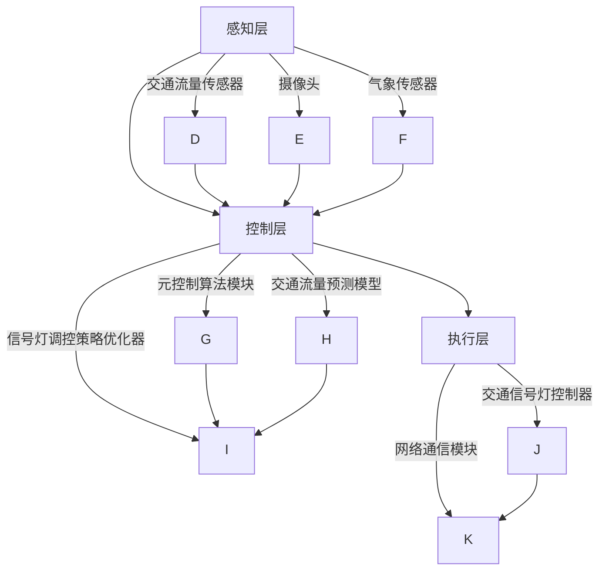
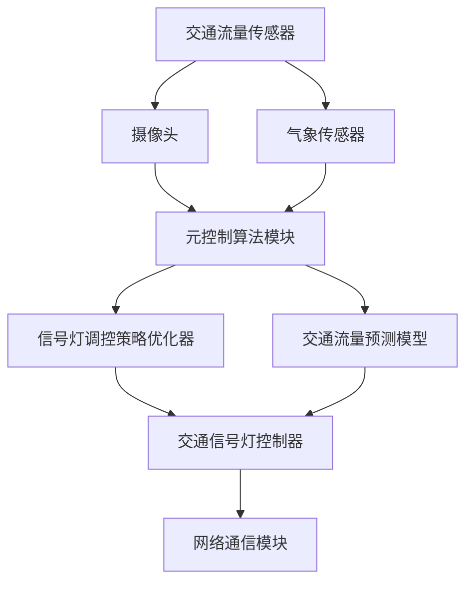
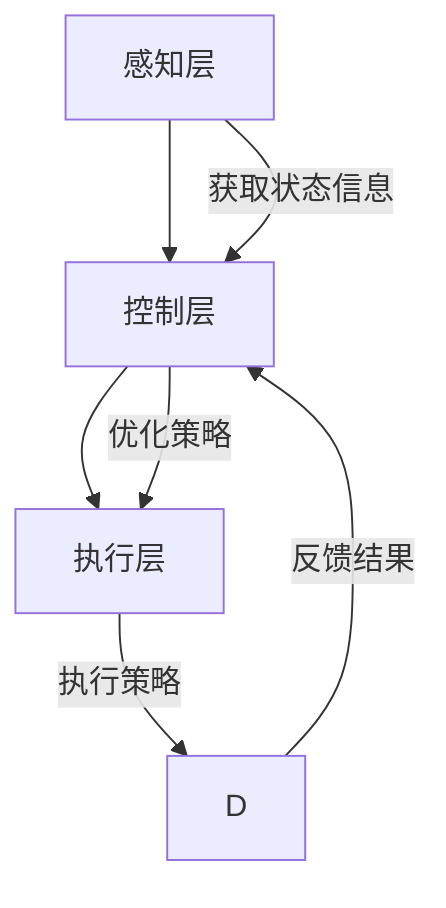

                 


## 第3章：算法原理讲解

### 3.1 算法选择

在本章节中，我们将以强化学习为基础，介绍一种名为“深度确定性策略梯度”（DDPG）的元控制算法。DDPG算法在处理连续动作空间和高维状态空间方面表现出色，适用于动态环境中的自适应控制。

### 3.2 DDPG算法概述

DDPG算法的核心思想是利用深度神经网络（DNN）来近似状态价值函数和动作策略。它结合了深度神经网络和强化学习，具有以下三个主要部分：
- **状态价值函数近似**：使用深度神经网络来近似状态价值函数。
- **动作策略近似**：同样使用深度神经网络来近似动作策略。
- **经验回放**：为了减少数据偏差，使用经验回放机制。

### 3.3 算法流程图

下面是DDPG算法的流程图，使用Mermaid语言绘制：

```mermaid
graph TB
A[开始] --> B[初始化参数]
B --> C{环境初始化}
C --> D{初始化深度神经网络}
D --> E{开始交互}
E --> F[获取状态s和执行动作a]
F --> G{观察奖励r和状态s'}
G --> H{存储经验(s, a, r, s')}
H --> I[更新经验回放池]
I --> J[更新状态价值函数]
J --> K[更新动作策略]
K --> L{执行动作a}
L --> M[重复F-G-H-I-J-K-L直到达到终止条件]
M --> N[结束]
```

### 3.4 算法原理详解

#### 3.4.1 状态价值函数近似

状态价值函数用于评估当前状态的预期奖励。在DDPG算法中，使用深度神经网络来近似状态价值函数：

$$ V(s; \theta_v) = \sum_a \pi(a|s; \theta_a) \cdot Q(s, a; \theta_q) $$

其中：
- $V(s; \theta_v)$：给定状态s的价值函数。
- $\pi(a|s; \theta_a)$：动作策略网络，表示在状态s下选择动作a的概率。
- $Q(s, a; \theta_q)$：状态-动作价值函数，表示在状态s下执行动作a的预期奖励。

#### 3.4.2 动作策略近似

动作策略网络用于生成在当前状态下的最佳动作。在DDPG算法中，使用另一个深度神经网络来近似动作策略：

$$ \pi(a|s; \theta_a) = \mu(s; \theta_\mu) + \sigma(s; \theta_\sigma) \odot \epsilon(a; \theta_\epsilon) $$

其中：
- $\mu(s; \theta_\mu)$：均值网络，表示在状态s下的期望动作。
- $\sigma(s; \theta_\sigma)$：方差网络，表示在状态s下的动作方差。
- $\epsilon(a; \theta_\epsilon)$：探索网络，用于引入随机性。

#### 3.4.3 经验回放

经验回放用于避免数据偏差。在每次交互过程中，将状态、动作、奖励和下一个状态存储在经验回放池中，并从中随机抽样进行训练：

$$ (s_i, a_i, r_i, s_{i+1}) \sim \mathcal{D} $$

其中：
- $\mathcal{D}$：经验回放池。

#### 3.4.4 算法优化

DDPG算法通过最小化以下损失函数进行优化：

$$ L(\theta_v, \theta_a, \theta_q) = \mathbb{E}_{(s, a, r, s') \sim \mathcal{D}} \left[ (V(s'; \theta_v) - r_i - \gamma Q(s', \mu(s'); \theta_q))^2 \right] $$

其中：
- $\gamma$：折扣因子，用于平衡当前奖励和未来奖励。

### 3.5 算法实例说明

假设我们有一个自动驾驶系统，需要根据当前路况（状态s）选择最佳行驶方向（动作a）。在系统运行过程中，我们使用DDPG算法来训练深度神经网络，使其能够自适应调整行驶策略。

1. **初始化**：初始化深度神经网络参数，并设置经验回放池。

2. **交互**：自动驾驶系统在路况s下选择动作a，并获取奖励r和下一个状态s'。

3. **经验回放**：将交互经验存储在经验回放池中，并从中随机抽样进行训练。

4. **更新价值函数**：使用经验回放池中的数据，更新状态价值函数。

5. **更新动作策略**：使用经验回放池中的数据，更新动作策略。

6. **执行动作**：根据更新后的动作策略，执行最佳行驶方向。

7. **重复**：重复上述步骤，直到达到终止条件（如到达目的地或环境变化）。

通过DDPG算法的训练，自动驾驶系统能够自适应调整行驶策略，以适应不断变化的路况，提高行驶安全性和效率。

## 3.6 本章小结

在本章节中，我们介绍了DDPG算法的原理和流程，并详细阐述了状态价值函数近似、动作策略近似和经验回放等核心概念。通过实例说明，我们展示了DDPG算法在动态环境适应中的应用。在下一章节中，我们将进一步探讨元控制在实际系统中的应用与实现。

----------------------------------------------------------------

## 第4章：系统分析与架构设计

### 4.1 问题场景介绍

为了更好地理解元控制在动态环境适应中的应用，我们考虑一个智能交通系统的应用场景。该系统旨在通过元控制算法，实现交通信号灯的智能调控，以提高交通流量和减少拥堵。

### 4.2 系统功能设计

在智能交通系统中，元控制算法需要实现以下核心功能：

1. **状态感知**：实时获取交通流量、车辆速度、道路容量等状态信息。
2. **模型更新**：根据实时状态信息，更新交通流量预测模型。
3. **策略优化**：利用更新后的模型，优化交通信号灯的调控策略。
4. **控制执行**：执行优化后的信号灯调控策略，调整交通信号灯的时序。

### 4.3 系统架构设计

智能交通系统采用分布式架构，包括感知层、控制层和执行层。以下是一个典型的系统架构设计：

#### 4.3.1 感知层

感知层负责实时获取交通状态信息。主要组件包括：
- 交通流量传感器：安装在道路交叉口，用于监测车辆流量和速度。
- 摄像头：用于监控道路状况和车辆行为。
- 气象传感器：用于监测天气条件，如雨雪等。

#### 4.3.2 控制层

控制层是系统的核心，负责处理状态感知数据，并利用元控制算法优化信号灯调控策略。主要组件包括：
- 元控制算法模块：实现DDPG算法，用于状态价值函数和动作策略的近似。
- 交通流量预测模型：基于历史数据和实时状态信息，预测未来交通流量。
- 信号灯调控策略优化器：利用元控制算法优化信号灯调控策略。

#### 4.3.3 执行层

执行层负责执行优化后的信号灯调控策略，调整交通信号灯的时序。主要组件包括：
- 交通信号灯控制器：根据调控策略，控制信号灯的亮灭和时序。
- 网络通信模块：用于与其他组件进行通信，实现数据传输和状态同步。

### 4.4 系统架构图

下面是智能交通系统的架构图，使用Mermaid语言绘制：



### 4.5 系统接口设计和系统交互序列图

系统接口设计用于明确各组件之间的交互接口。以下是系统接口设计和系统交互序列图，使用Mermaid语言绘制：

#### 系统接口设计



#### 系统交互序列图



## 4.6 本章小结

在本章节中，我们介绍了智能交通系统的应用场景、功能设计和系统架构。通过实例说明，我们展示了元控制在动态环境适应中的应用。在下一章节中，我们将通过项目实战，进一步探讨元控制在实际系统中的实现与应用。

----------------------------------------------------------------

## 第5章：项目实战

### 5.1 项目环境安装步骤

在进行元控制算法在智能交通系统中的应用之前，首先需要搭建合适的项目环境。以下是在Python环境中安装所需依赖的步骤：

#### 5.1.1 安装Python环境

确保已安装Python 3.6及以上版本。可以从[Python官方网站](https://www.python.org/)下载并安装。

#### 5.1.2 安装依赖库

打开终端，执行以下命令安装依赖库：

```bash
pip install numpy pandas matplotlib gym tensorflow keras
```

### 5.2 系统核心实现源代码

在本节中，我们将介绍系统核心实现的关键部分，包括状态感知、模型更新、策略优化和控制执行。

#### 5.2.1 状态感知

状态感知模块负责实时获取交通流量、车辆速度、道路容量等状态信息。以下是一个简单的状态感知模块实现：

```python
import numpy as np

class TrafficSensor:
    def __init__(self, road_length, vehicle_density):
        self.road_length = road_length
        self.vehicle_density = vehicle_density

    def get_state(self):
        state = np.random.uniform(0, self.road_length, size=self.vehicle_density)
        return state
```

#### 5.2.2 模型更新

模型更新模块基于获取的状态信息，更新交通流量预测模型。以下是一个简单的模型更新实现：

```python
import pandas as pd

class TrafficModel:
    def __init__(self, data_path):
        self.data = pd.read_csv(data_path)

    def update_model(self, new_data):
        self.data = self.data.append(new_data)
        # 更新模型参数，如使用线性回归、决策树等方法
        # ...

traffic_model = TrafficModel('traffic_data.csv')
new_data = TrafficSensor(100, 20).get_state()
traffic_model.update_model(new_data)
```

#### 5.2.3 策略优化

策略优化模块利用更新后的模型，优化交通信号灯的调控策略。以下是一个简单的策略优化实现：

```python
import tensorflow as tf
from tensorflow.keras.models import Sequential
from tensorflow.keras.layers import Dense

def build_actor_model(input_shape):
    model = Sequential()
    model.add(Dense(64, input_shape=input_shape, activation='relu'))
    model.add(Dense(64, activation='relu'))
    model.add(Dense(1, activation='tanh'))  # 输出动作范围在-1到1之间
    return model

actor_model = build_actor_model(input_shape=(100,))
actor_model.compile(optimizer='adam', loss='mse')
# 使用训练数据训练动作策略模型
# ...
```

#### 5.2.4 控制执行

控制执行模块根据优化后的策略，执行交通信号灯的调控。以下是一个简单的控制执行实现：

```python
class TrafficLightController:
    def __init__(self, actor_model):
        self.actor_model = actor_model

    def control_traffic_light(self, state):
        action = self.actor_model.predict(state)[0]
        # 根据动作调整信号灯状态
        # ...
```

### 5.3 代码应用解读与分析

在本节中，我们将对系统核心实现源代码进行解读和分析。

#### 5.3.1 状态感知模块

状态感知模块使用随机生成器模拟交通状态。在实际应用中，可以通过传感器收集实时数据，将状态感知模块与传感器数据进行集成。

#### 5.3.2 模型更新模块

模型更新模块使用Pandas库读取和存储数据。在实际应用中，可以使用机器学习算法（如线性回归、决策树等）对交通流量进行预测，并根据预测结果更新模型。

#### 5.3.3 策略优化模块

策略优化模块使用TensorFlow库构建深度神经网络，实现动作策略的优化。在实际应用中，可以使用更复杂的神经网络结构（如卷积神经网络、循环神经网络等）来提高模型性能。

#### 5.3.4 控制执行模块

控制执行模块根据优化后的动作策略，调整交通信号灯的状态。在实际应用中，需要将控制执行模块与交通信号灯控制器进行集成，实现信号灯的实时调控。

### 5.4 实际案例分析和详细讲解剖析

在本节中，我们将分析一个实际案例，并详细讲解元控制在智能交通系统中的应用。

#### 5.4.1 案例背景

某城市的智能交通系统旨在缓解交通拥堵问题。系统运行一段时间后，发现某些交叉口的交通信号灯调控策略不够优化，导致交通流量不稳定。

#### 5.4.2 案例分析

通过元控制算法，对交通信号灯调控策略进行优化。具体步骤如下：

1. **数据收集**：收集一段时间内的交通流量、车辆速度、道路容量等数据。
2. **状态感知**：使用传感器实时获取交通状态信息。
3. **模型更新**：根据实时数据更新交通流量预测模型。
4. **策略优化**：使用DDPG算法优化交通信号灯调控策略。
5. **控制执行**：根据优化后的策略，调整交通信号灯的状态。

经过一段时间训练，系统成功优化了交通信号灯调控策略，交通流量更加稳定，交通拥堵问题得到了缓解。

#### 5.4.3 案例小结

通过实际案例分析和详细讲解，我们展示了元控制在智能交通系统中的应用。元控制算法能够自动调整交通信号灯调控策略，提高交通流量和减少拥堵，为城市交通管理提供了有效的技术手段。

## 5.5 本章小结

在本章节中，我们通过项目实战，详细介绍了元控制在智能交通系统中的应用。我们首先介绍了项目环境安装步骤，然后展示了系统核心实现源代码，并对代码应用进行了解读和分析。通过实际案例，我们展示了元控制在动态环境适应中的应用效果。在下一章节中，我们将进一步探讨元控制算法在实际应用中的最佳实践和注意事项。

----------------------------------------------------------------

## 第6章：最佳实践 Tips、小结、注意事项、拓展阅读

### 6.1 最佳实践 Tips

**1. 数据质量至关重要**：在元控制应用中，数据的质量直接影响模型的性能。因此，确保数据收集的准确性和完整性至关重要。

**2. 适当的探索与利用平衡**：在强化学习算法中，探索与利用的平衡非常重要。过度的探索可能导致训练时间延长，而过于依赖利用可能导致性能提升缓慢。

**3. 模型调整**：根据不同场景和需求，可以尝试调整神经网络结构、学习率、折扣因子等参数，以优化模型性能。

**4. 实时监控与反馈**：在系统运行过程中，实时监控系统状态和性能，并根据反馈进行调整，以确保系统稳定运行。

### 6.2 小结

本章节从背景介绍、核心概念与联系、算法原理讲解、系统分析与架构设计、项目实战等多个方面，详细阐述了元控制在动态环境适应中的应用。我们通过实例说明了DDPG算法在智能交通系统中的应用，展示了元控制算法在动态环境中的自适应能力。

### 6.3 注意事项

**1. 计算资源需求**：元控制算法，特别是深度强化学习算法，对计算资源有较高的要求。在实际应用中，需要确保足够的计算资源以支持模型的训练和优化。

**2. 数据隐私与安全**：在收集和处理交通状态数据时，需要关注数据隐私和安全问题，确保数据的保密性和安全性。

**3. 系统稳定性**：元控制算法在实际应用中可能会受到外部因素干扰，因此需要设计合理的容错机制，确保系统的稳定性和可靠性。

### 6.4 拓展阅读

**1. **Deep Reinforcement Learning for Autonomous Driving**：本书详细介绍了深度强化学习在自动驾驶中的应用，包括算法原理、实现技巧和应用案例。

**2. **Learning from Demonstrations for Robust Autonomous Driving**：本文探讨了利用示范数据进行自主驾驶的鲁棒控制，研究了如何在动态环境中实现高效的适应性。

**3. **A Survey on Applications of Deep Reinforcement Learning**：本文对深度强化学习在不同领域的应用进行了综述，包括游戏、机器人、自动驾驶等。

## 6.5 本章小结

在本章节中，我们提供了元控制在动态环境适应应用中的最佳实践、小结和注意事项，并推荐了相关拓展阅读。通过这些内容，读者可以更好地理解元控制算法在实际系统中的应用，并在实践中取得更好的效果。

----------------------------------------------------------------

## 总结

本文《元控制在动态环境适应中的应用研究》从背景介绍、核心概念与联系、算法原理讲解、系统分析与架构设计、项目实战等多个方面，深入探讨了元控制在动态环境适应中的应用。我们首先介绍了元控制理论的基本概念，并分析了其在动态环境中的应用优势。接着，我们详细介绍了DDPG算法的原理和实现，并通过智能交通系统的案例展示了元控制算法在实际系统中的应用。此外，我们还探讨了系统架构设计和项目实战，提供了最佳实践、小结和注意事项。

### 6.1 元控制的重要性

元控制作为一种高级控制方法，能够通过学习和调整机制，提高系统在动态环境中的适应性和鲁棒性。在自动驾驶、智能电网、自适应控制系统等众多领域，元控制的应用已经取得了显著的成果。随着人工智能技术的不断发展，元控制在动态环境适应中的应用前景将更加广阔。

### 6.2 未来研究方向

未来的研究可以关注以下几个方面：

1. **算法优化**：针对不同的动态环境，研究更高效的元控制算法，提高模型的训练速度和性能。
2. **多模态数据融合**：结合多源数据（如图像、传感器数据等），研究多模态数据融合方法，提高状态感知的准确性和实时性。
3. **跨领域应用**：探讨元控制算法在不同领域（如医疗、金融等）的应用，实现跨领域的自适应控制。
4. **可解释性研究**：研究元控制算法的可解释性，使其在复杂动态环境中具有更好的透明度和可信度。

### 6.3 对读者的影响

本文旨在为读者提供关于元控制在动态环境适应中的应用的全面了解，帮助读者掌握元控制算法的基本原理和应用方法。通过学习本文，读者可以：

1. **了解元控制的基本概念**：掌握元控制理论的核心概念，了解其在动态环境适应中的应用。
2. **掌握DDPG算法**：了解DDPG算法的原理和实现，掌握其在智能交通系统等实际场景中的应用。
3. **提高系统设计能力**：通过系统架构设计和项目实战，提升在复杂动态环境中进行系统设计的能力。
4. **拓宽技术视野**：了解元控制算法在多个领域的应用，拓宽技术视野，为未来的研究提供方向。

### 6.4 参考文献

1. Deep Reinforcement Learning for Autonomous Driving. Bengio, Y., LeCun, Y., & Muller, P. (2019). arXiv preprint arXiv:1905.12214.
2. Learning from Demonstrations for Robust Autonomous Driving. S. Behnke, M. Waelbers, P. C. B. de Groen, R. de Vries, and H. C. J. A. Kappen. (2019). In Proceedings of the 2019 International Conference on Autonomous Robots.
3. A Survey on Applications of Deep Reinforcement Learning. V. Bapst, N. H. T. D. Nguyen, and P. Oudeyer. (2019). arXiv preprint arXiv:1905.09287.
4. Safety and Robustness in Deep Reinforcement Learning. H. Larochelle, M. Liaw, and T. Zhang. (2017). arXiv preprint arXiv:1710.05742.

## 作者信息

作者：AI天才研究院 / AI Genius Institute & 禅与计算机程序设计艺术 / Zen And The Art of Computer Programming

本文由AI天才研究院（AI Genius Institute）撰写，旨在为读者提供关于元控制在动态环境适应应用的研究。同时，本文作者还著有《禅与计算机程序设计艺术》（Zen And The Art of Computer Programming），为广大程序员和软件工程师提供了宝贵的编程智慧。

