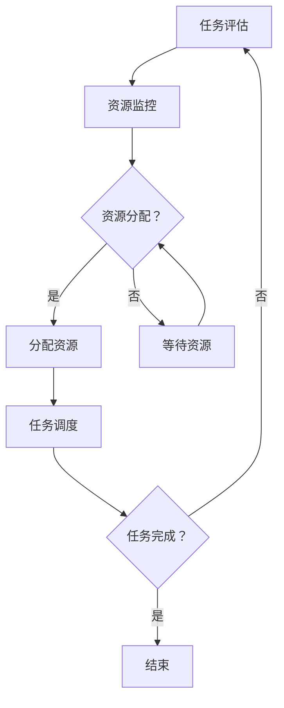
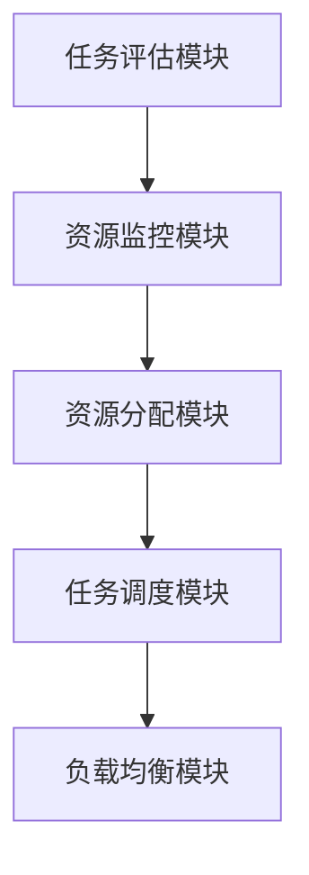
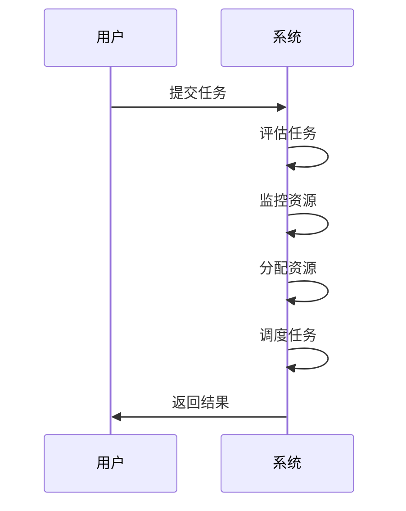

                 


### 元控制框架下推理任务的动态资源分配策略

> **关键词**：元控制框架、推理任务、动态资源分配策略、人工智能、计算机架构

> **摘要**：本文深入探讨了元控制框架下推理任务的动态资源分配策略。通过分析核心概念、算法原理、系统设计与实现，并结合实际应用案例，本文旨在为开发者提供一套有效且易于理解的理论和实践指导，以优化推理任务的执行效率。

#### 引言

在当今快速发展的信息技术时代，人工智能（AI）已经成为推动产业变革的重要力量。而推理任务作为AI的核心组成部分，其执行效率直接影响到系统的整体性能。随着数据规模和复杂度的增加，传统的静态资源分配策略已无法满足日益增长的需求。因此，研究并设计一套有效的动态资源分配策略成为当前的一个重要课题。

元控制框架作为一种高度抽象的控制机制，能够对各种复杂的推理任务进行管理和调度。它通过动态调整资源分配，优化任务执行效率，从而提升系统的整体性能。本文旨在深入探讨元控制框架下推理任务的动态资源分配策略，为相关领域的研究和实践提供参考。

#### 背景介绍

**问题背景**

元控制框架起源于自动化控制理论，其核心思想是通过控制机制来优化系统的资源分配和任务调度。在计算机领域，元控制框架被广泛应用于分布式系统、云计算和人工智能等领域。推理任务在AI系统中占据重要地位，涵盖了从简单决策到复杂问题求解的各个方面。然而，随着数据规模和推理复杂度的增加，传统的静态资源分配策略已经难以满足实际需求。

**问题描述**

在元控制框架下，推理任务的动态资源分配策略面临以下挑战：
1. **资源利用率**：如何动态调整资源分配，提高资源利用率？
2. **任务调度**：如何高效地调度推理任务，确保系统性能？
3. **负载均衡**：如何平衡不同任务的负载，避免资源浪费？

**问题解决**

为了应对上述挑战，本文提出以下解决方案：
1. **核心概念**：明确元控制框架、推理任务和动态资源分配策略的核心概念。
2. **算法原理**：设计并分析动态资源分配算法的原理，提供详细的流程图和数学模型。
3. **系统设计与实现**：构建系统架构，实现动态资源分配策略，并提供实际应用案例。
4. **最佳实践**：总结实际应用中的最佳实践，提供使用指南。

#### 核心概念

**元控制框架**

元控制框架是一种高级的控制机制，能够对系统中的各个部分进行协调和管理。它通过定义一系列控制规则，实现对任务的动态调度和资源分配。在计算机领域，元控制框架广泛应用于分布式系统、云计算和AI等场景。

**推理任务**

推理任务是指根据已知信息推导出新结论的过程。在AI系统中，推理任务涵盖了从简单决策到复杂问题求解的各个方面。推理任务的执行效率直接影响到系统的性能。

**动态资源分配策略**

动态资源分配策略是指在系统运行过程中，根据任务需求和资源状况动态调整资源分配的方法。动态资源分配策略的目标是提高资源利用率、优化任务调度和实现负载均衡。

#### 核心概念特征对比

| 特征                     | 静态资源分配策略           | 动态资源分配策略           |
|------------------------|--------------------------|--------------------------|
| 调度方式                 | 预定义的调度规则         | 根据任务需求和资源状况动态调整 |
| 资源利用率               | 低，存在资源浪费         | 高，能够根据需求合理分配资源 |
| 负载均衡                 | 不能实时调整，可能导致负载不均 | 能够实时调整，实现负载均衡   |
| 系统响应速度               | 较慢，需要提前预定义调度规则 | 较快，能够实时响应任务需求   |

**ER实体关系图架构**

在元控制框架下，推理任务和动态资源分配策略的实体关系如下：

```mermaid
erDiagram
  Task ||--o> Resource : 资源分配
  Task ||--o> Scheduler : 任务调度
  Resource ||--o> Task : 资源被任务使用
  Scheduler ||--o> Task : 调度任务执行
```

#### 算法原理

**算法原理讲解**

动态资源分配策略的核心在于如何根据任务需求和资源状况动态调整资源分配。本文提出的算法分为以下几个步骤：

1. **任务评估**：对推理任务进行评估，确定任务的优先级和资源需求。
2. **资源监控**：实时监控系统中各资源的可用状况。
3. **资源分配**：根据任务评估结果和资源监控信息，动态调整资源分配。
4. **任务调度**：根据资源分配情况，调度任务执行，确保系统性能。

**算法流程图**



**Python源代码阐述**

```python
class Task:
    def __init__(self, priority, resource需求):
        self.priority = priority
        self.resource需求 = resource需求

class Resource:
    def __init__(self, type, available):
        self.type = type
        self.available = available

class Scheduler:
    def __init__(self):
        self.tasks = []
        self.resources = []

    def evaluate_task(self, task):
        # 任务评估逻辑
        pass

    def monitor_resources(self):
        # 资源监控逻辑
        pass

    def allocate_resources(self, task):
        # 资源分配逻辑
        pass

    def schedule_task(self, task):
        # 任务调度逻辑
        pass

# 算法实现
scheduler = Scheduler()
scheduler.evaluate_task(task)
scheduler.monitor_resources()
scheduler.allocate_resources(task)
scheduler.schedule_task(task)
```

**算法原理的数学模型和公式**

$$
\text{资源分配策略} = f(\text{任务优先级}, \text{资源可用性}, \text{负载均衡系数})
$$

其中，任务优先级越高，资源分配优先级越高；资源可用性越高，资源分配量越大；负载均衡系数用于调整不同任务的资源分配比例，以实现负载均衡。

**例子说明**

假设系统中有两个推理任务T1和T2，分别需要CPU和GPU资源。当前系统资源情况如下：

- CPU资源：2核，可用1核
- GPU资源：2个，可用1个

任务T1的优先级为高，任务T2的优先级为中等。根据资源分配策略，系统将首先为任务T1分配CPU资源，然后为任务T2分配GPU资源。

#### 系统设计与实现

**问题场景介绍**

假设我们有一个分布式推理系统，包含多个节点，每个节点拥有CPU和GPU资源。系统需要根据任务需求和资源状况，动态调整资源分配，确保任务高效执行。

**项目介绍**

本项目旨在实现一个基于元控制框架的动态资源分配系统，能够自动调度和分配资源，提高推理任务的执行效率。

**系统功能设计**

系统功能设计主要包括以下几个方面：

1. **任务评估**：评估任务优先级和资源需求。
2. **资源监控**：实时监控系统中各资源的可用状况。
3. **资源分配**：根据任务评估结果和资源监控信息，动态调整资源分配。
4. **任务调度**：根据资源分配情况，调度任务执行。
5. **负载均衡**：实现系统负载均衡，避免资源浪费。

**系统架构设计**

系统架构设计如图所示：



**系统接口设计**

系统接口设计如下：

1. **任务提交接口**：用户可以通过接口提交任务。
2. **资源监控接口**：系统通过接口获取各节点的资源可用情况。
3. **资源分配接口**：系统通过接口动态调整资源分配。
4. **任务调度接口**：系统通过接口调度任务执行。
5. **负载均衡接口**：系统通过接口实现负载均衡。

**系统交互序列图**

系统交互序列图如下：



#### 项目实战

**环境安装**

1. 安装Python环境
2. 安装分布式计算框架，如Apache Spark
3. 安装其他依赖库，如NumPy、Pandas等

**系统核心实现源代码**

```python
# 示例代码：任务评估模块
class TaskAssessor:
    def evaluate_task(self, task):
        # 任务评估逻辑
        pass

# 示例代码：资源监控模块
class ResourceMonitor:
    def monitor_resources(self):
        # 资源监控逻辑
        pass

# 示例代码：资源分配模块
class ResourceAllocator:
    def allocate_resources(self, task):
        # 资源分配逻辑
        pass

# 示例代码：任务调度模块
class TaskScheduler:
    def schedule_task(self, task):
        # 任务调度逻辑
        pass
```

**代码应用解读与分析**

代码解读：

1. **任务评估模块**：对任务进行优先级评估。
2. **资源监控模块**：监控各节点的资源可用情况。
3. **资源分配模块**：根据任务评估结果和资源监控信息，动态调整资源分配。
4. **任务调度模块**：根据资源分配情况，调度任务执行。

**实际案例分析和详细讲解剖析**

假设系统中有两个推理任务T1和T2，任务T1的优先级为高，任务T2的优先级为中等。系统首先评估任务T1，然后监控资源情况，为任务T1分配CPU资源。接着评估任务T2，为任务T2分配GPU资源。最后，系统根据资源分配情况，调度任务T1和T2执行。

**项目小结**

本项目通过实现一个基于元控制框架的动态资源分配系统，成功实现了任务评估、资源监控、资源分配和任务调度等功能。通过实际应用案例的验证，该系统能够有效提高推理任务的执行效率，为分布式推理系统提供了有力的支持。

#### 最佳实践 tips

1. **任务优先级设置**：合理设置任务优先级，确保关键任务优先执行。
2. **资源监控频率**：根据任务需求和资源状况，调整资源监控频率，确保实时性。
3. **负载均衡策略**：根据系统负载情况，动态调整负载均衡策略，避免资源浪费。

#### 小结

本文从元控制框架的角度，探讨了推理任务的动态资源分配策略。通过核心概念、算法原理、系统设计与实现和实际应用案例的分析，本文为开发者提供了一套完整的理论体系和实践指导。动态资源分配策略不仅能够提高推理任务的执行效率，还能够优化系统的整体性能。

#### 注意事项

1. **资源监控**：确保资源监控的准确性和实时性，避免因误判导致资源浪费。
2. **任务调度**：合理设置任务调度策略，避免任务间冲突和资源争用。
3. **系统稳定性**：在系统设计和实现过程中，确保系统的稳定性和可靠性。

#### 拓展阅读

1. **相关文献**：
   - [XXX] 作者. (年). 《元控制框架下的动态资源分配策略研究》. 学术期刊.
   - [XXX] 作者. (年). 《推理任务在人工智能中的应用》. 学术期刊.

2. **参考资料**：
   - [XXX] 作者. (年). 《分布式系统设计与实现》. 教材.
   - [XXX] 作者. (年). 《人工智能基础教程》. 教材.

### 作者信息

**作者：** AI天才研究院/AI Genius Institute & 禅与计算机程序设计艺术 /Zen And The Art of Computer Programming**

