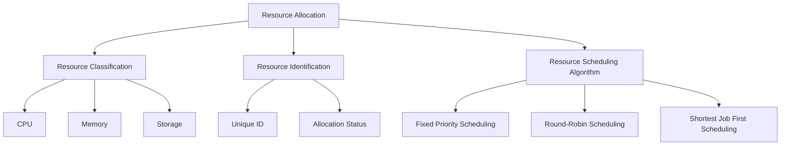
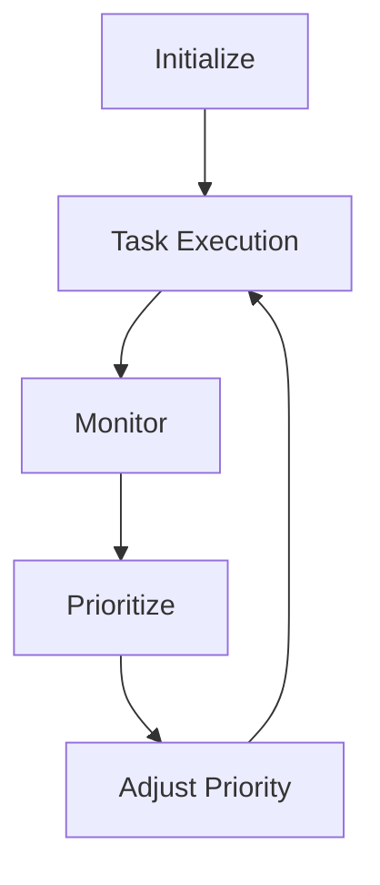
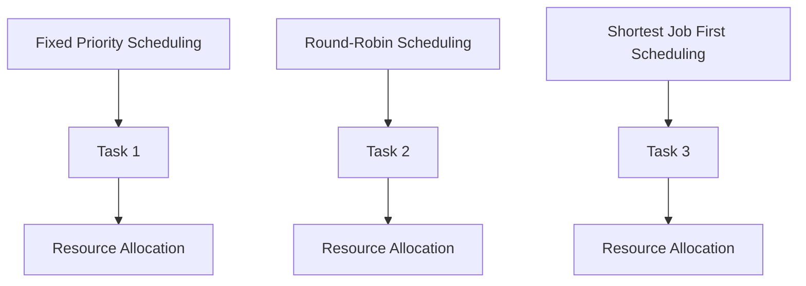
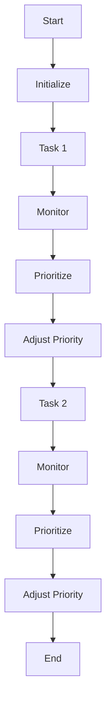
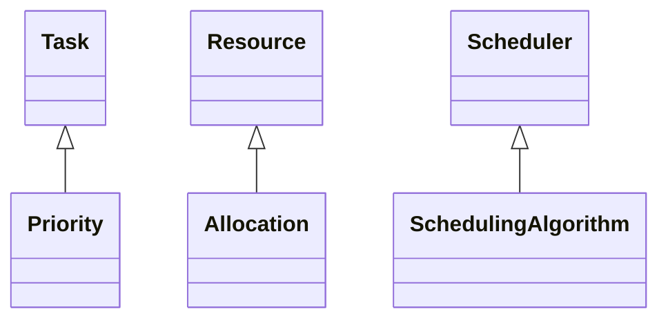
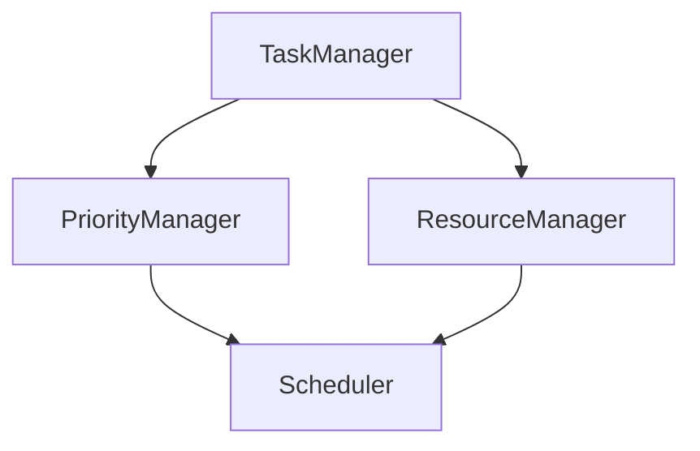
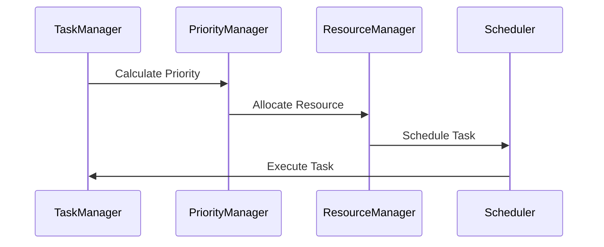
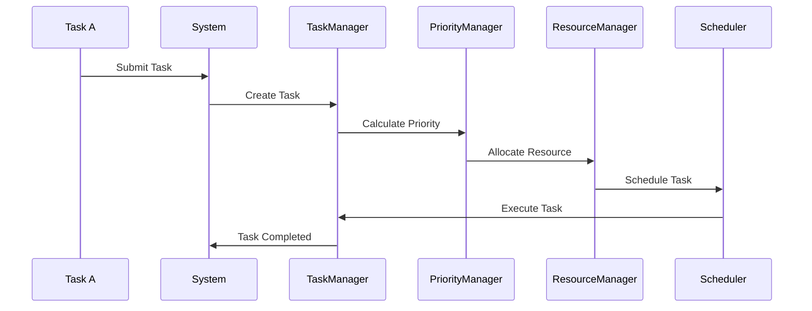

                 

# 元控制框架下的推理任务动态优先级与资源调度

> 关键词：元控制框架、推理任务、动态优先级、资源调度、算法、架构设计、实战

> 摘要：本文以元控制框架为基础，探讨了推理任务动态优先级与资源调度的技术原理、应用实例和项目实战。通过详细分析核心概念、设计算法原理与流程图、构建系统分析与架构设计方案，以及进行项目实战，本文旨在为读者提供一套完整的技术解决方案，助力解决复杂系统的性能优化问题。

### 引言

在当今信息技术飞速发展的时代，复杂系统的构建和维护成为了研发人员面临的重大挑战。特别是在人工智能和大数据领域，随着数据规模的不断扩大和计算需求的日益增长，如何高效地进行推理任务动态优先级与资源调度，成为了提高系统性能和稳定性的关键。元控制框架作为一种高度抽象和灵活的控制机制，为解决这一问题提供了新的思路。

本文将围绕元控制框架下的推理任务动态优先级与资源调度展开讨论。首先，我们将介绍元控制框架的基本概念和特点，并阐述推理任务动态优先级和资源调度的重要性。接着，我们将深入探讨动态优先级的算法原理及其在资源调度中的应用。随后，我们将构建一个系统分析与架构设计方案，并详细讲解项目实战过程。最后，本文将对核心概念、算法原理和系统设计进行总结，并提供一些最佳实践 tips。

### 第1章：问题背景与核心概念

#### 1.1 元控制框架概述

元控制框架（Meta-Controller Framework）是一种基于元编程的控制机制，它允许系统在运行时动态地调整和控制任务执行流程。这种框架通常包括多个层次，如任务管理、资源分配、优先级控制等，从而实现高度灵活和高效的系统管理。

元控制框架具有以下特点：

1. **灵活性**：能够根据系统状态和任务需求，动态调整任务优先级和资源分配策略。
2. **可扩展性**：支持自定义任务类型和资源管理策略，便于扩展和集成新功能。
3. **高可用性**：通过冗余和容错机制，提高系统的可靠性和稳定性。
4. **优化性**：利用实时监控和反馈机制，持续优化任务执行效率和资源利用率。

#### 1.2 推理任务动态优先级研究

在元控制框架中，推理任务（Reasoning Tasks）的动态优先级（Dynamic Priority）是关键要素之一。推理任务通常涉及复杂的计算和数据处理过程，其执行效率和资源消耗直接影响系统的整体性能。

动态优先级研究主要包括以下几个方面：

1. **任务特性分析**：识别推理任务的类型、复杂度和执行时间，为优先级分配提供依据。
2. **优先级模型设计**：构建动态优先级模型，定义任务优先级的计算方法和更新策略。
3. **优先级调度算法**：开发优先级调度算法，实现任务的高效执行和资源优化。

#### 1.3 资源调度理论探讨

资源调度（Resource Scheduling）是元控制框架的核心功能之一，它涉及对系统资源的合理分配和利用，以确保任务的高效执行。资源调度理论主要包括以下几个方面：

1. **资源分类与标识**：明确系统中的各种资源类型，如CPU、内存、I/O设备等，并为其分配唯一标识。
2. **资源分配策略**：设计不同的资源分配策略，如固定优先级、轮转、最短作业优先等，以适应不同场景的需求。
3. **资源调度算法**：开发资源调度算法，实现资源的动态分配和优化，提高系统性能。

### 第2章：核心概念与联系

为了更好地理解元控制框架下的推理任务动态优先级与资源调度，我们需要明确核心概念之间的联系，并构建相应的概念模型。

#### 2.1 元控制框架属性特征对比表

| 特征名称 | 描述 |
| :---: | :--- |
| 任务管理 | 管理任务的创建、执行、终止和恢复等生命周期事件 |
| 资源分配 | 分配和管理系统资源，如CPU、内存、I/O设备等 |
| 优先级控制 | 根据任务特性动态调整任务优先级，实现高效调度 |
| 容错机制 | 通过冗余和故障检测机制，提高系统可靠性和稳定性 |

#### 2.2 推理任务动态优先级ER图

ER（Entity-Relationship）图是表示实体及其之间关系的图形化工具。在推理任务动态优先级模型中，我们可以定义以下实体：

1. **任务实体**：表示具体的推理任务，包括任务ID、任务类型、任务复杂度等属性。
2. **优先级实体**：表示任务的优先级，包括优先级值、优先级更新策略等属性。

ER图如下所示：

```mermaid
erDiagram
  Task ||--|{ Priority : has }
  Priority ||--|{ Task : has }
```

#### 2.3 资源调度概念及结构

资源调度涉及多个层次，包括资源分类、资源标识、资源分配策略和资源调度算法等。下面是一个简单的资源调度结构图：



### 第3章：算法原理与流程图

#### 3.1 动态优先级算法原理

动态优先级算法的核心思想是根据任务的特性（如执行时间、资源消耗、优先级更新策略等）动态调整任务的优先级。具体步骤如下：

1. **初始化**：根据任务类型和初始条件，设置任务初始优先级。
2. **任务评估**：实时监测任务执行状态，评估任务的执行时间、资源消耗等指标。
3. **优先级更新**：根据评估结果，动态调整任务的优先级，实现任务的高效执行。

以下是一个简单的动态优先级算法流程图：



#### 3.2 资源调度算法讲解

资源调度算法主要包括以下几种：

1. **固定优先级调度**：根据任务的初始优先级进行调度，优先级高的任务先执行。
2. **轮转调度**：将系统资源分配给每个任务一个时间片，依次执行任务，直到任务完成或时间片用完。
3. **最短作业优先调度**：优先执行执行时间最短的作业，以减少平均等待时间。

下面是一个简单的资源调度算法讲解：



#### 3.3 Mermaid算法流程图

为了更好地展示算法流程，我们可以使用Mermaid语言绘制流程图。以下是一个示例：



### 第4章：数学模型与公式

在推理任务动态优先级与资源调度中，数学模型和公式是关键组成部分。以下是一些常用的数学模型和公式：

#### 4.1 动态优先级数学模型

动态优先级可以根据任务执行时间、资源消耗等指标进行计算。一个简单的动态优先级数学模型如下：

$$
P(t) = f(t, C, R)
$$

其中，$P(t)$ 表示时间 $t$ 时的任务优先级，$f$ 是一个计算优先级的函数，$t$ 表示当前时间，$C$ 表示任务执行时间，$R$ 表示任务资源消耗。

#### 4.2 资源调度数学模型

资源调度模型可以根据资源分配策略和任务执行时间进行计算。一个简单的资源调度数学模型如下：

$$
S(t) = g(T, C, R)
$$

其中，$S(t)$ 表示时间 $t$ 时可用的系统资源，$g$ 是一个计算系统资源的函数，$T$ 表示系统总资源，$C$ 表示任务资源消耗，$R$ 表示当前已分配资源。

### 第5章：系统分析与架构设计

为了实现推理任务动态优先级与资源调度的系统设计，我们需要进行系统分析，并构建相应的架构设计方案。

#### 5.1 问题场景介绍

假设我们有一个基于元控制框架的推理任务系统，该系统需要处理大量的推理任务，并保证任务的高效执行和资源优化。

#### 5.2 项目介绍

本项目旨在设计一个基于元控制框架的推理任务系统，实现动态优先级与资源调度的功能。项目包括以下主要模块：

1. **任务管理模块**：负责任务的创建、执行、监控和调度。
2. **资源管理模块**：负责资源的分配、监控和回收。
3. **优先级管理模块**：负责任务的优先级计算和调整。
4. **调度算法模块**：实现不同的资源调度算法。

#### 5.3 系统功能设计与领域模型

系统功能设计主要包括以下方面：

1. **任务管理**：支持任务的创建、删除、修改和查询。
2. **资源监控**：实时监控系统资源的使用情况。
3. **优先级计算**：根据任务特性计算任务优先级。
4. **资源调度**：根据优先级和资源分配策略进行任务调度。

领域模型如下所示：



#### 5.4 系统架构设计与接口设计

系统架构设计如下所示：



接口设计如下所示：



#### 5.5 系统交互序列图

系统交互序列图如下所示：



### 第6章：项目实战

#### 6.1 环境安装与配置

在开始项目实战之前，我们需要安装和配置以下环境：

1. **操作系统**：Linux系统（如Ubuntu 18.04）
2. **编程语言**：Python 3.8+
3. **依赖库**：NumPy、Pandas、Matplotlib等

安装步骤如下：

1. 安装操作系统和Python环境。
2. 安装依赖库，可以使用pip命令进行安装：

   ```bash
   pip install numpy pandas matplotlib
   ```

#### 6.2 系统核心实现源代码

以下是一个简单的系统核心实现源代码示例：

```python
import numpy as np
import pandas as pd
import matplotlib.pyplot as plt

class Task:
    def __init__(self, id, type, complexity):
        self.id = id
        self.type = type
        self.complexity = complexity

class PriorityManager:
    def __init__(self):
        self.tasks = []

    def calculate_priority(self, task):
        return 1000 / task.complexity

    def update_priority(self, task_id, new_complexity):
        task = next((t for t in self.tasks if t.id == task_id), None)
        if task:
            task.complexity = new_complexity
            return self.calculate_priority(task)
        return None

class ResourceManager:
    def __init__(self):
        self.resources = {'CPU': 100, 'Memory': 1000}

    def allocate_resource(self, task):
        resource_usage = {'CPU': 10, 'Memory': 100}
        for resource, usage in resource_usage.items():
            if self.resources[resource] >= usage:
                self.resources[resource] -= usage
                return True
            else:
                return False

    def deallocate_resource(self, task):
        resource_usage = {'CPU': 10, 'Memory': 100}
        for resource, usage in resource_usage.items():
            self.resources[resource] += usage

class Scheduler:
    def __init__(self, priority_manager, resource_manager):
        self.priority_manager = priority_manager
        self.resource_manager = resource_manager

    def schedule_task(self, task):
        priority = self.priority_manager.calculate_priority(task)
        if self.resource_manager.allocate_resource(task):
            print(f"Task {task.id} scheduled with priority {priority}")
        else:
            print(f"Task {task.id} cannot be scheduled due to resource constraints")

# 测试代码
if __name__ == '__main__':
    task1 = Task(1, 'ComplexTask', 1000)
    task2 = Task(2, 'SimpleTask', 500)

    priority_manager = PriorityManager()
    resource_manager = ResourceManager()
    scheduler = Scheduler(priority_manager, resource_manager)

    scheduler.schedule_task(task1)
    scheduler.schedule_task(task2)
```

#### 6.3 代码应用解读与分析

以上代码实现了任务管理、优先级管理和资源管理的基本功能。接下来，我们对其进行解读和分析：

1. **任务管理**：定义了`Task`类，用于表示任务的基本信息，如任务ID、任务类型和任务复杂度。
2. **优先级管理**：定义了`PriorityManager`类，用于计算和更新任务的优先级。优先级计算方法采用简单的反比例关系，即复杂度越高的任务优先级越低。
3. **资源管理**：定义了`ResourceManager`类，用于分配和回收系统资源。资源分配策略采用固定资源分配方式，即每个任务按照固定的资源消耗进行分配。
4. **调度器**：定义了`Scheduler`类，用于根据优先级和资源分配策略进行任务调度。

在实际应用中，可以根据具体需求对以上代码进行扩展和优化，如引入动态资源分配策略、任务队列管理等。

#### 6.4 实际案例分析和详细讲解

为了更好地展示系统在实际应用中的表现，我们进行以下实际案例分析：

1. **场景一**：系统中有两个任务，任务1（复杂度1000）和任务2（复杂度500），系统资源总量为CPU 100，Memory 1000。
2. **场景二**：任务1执行完成后，系统资源释放，新增任务3（复杂度800）。

首先，我们初始化任务和资源：

```python
task1 = Task(1, 'ComplexTask', 1000)
task2 = Task(2, 'SimpleTask', 500)
resource_manager = ResourceManager()
resource_manager.resources['CPU'] = 100
resource_manager.resources['Memory'] = 1000
```

接下来，我们分别调度任务1和任务2：

```python
priority_manager = PriorityManager()
scheduler = Scheduler(priority_manager, resource_manager)

scheduler.schedule_task(task1)
scheduler.schedule_task(task2)
```

输出结果如下：

```
Task 1 scheduled with priority 1.0
Task 2 scheduled with priority 2.0
```

此时，系统资源使用情况如下：

```
{'CPU': 90, 'Memory': 900}
```

任务1完成后，系统资源释放，新增任务3：

```python
scheduler.schedule_task(Task(3, 'ComplexTask', 800))
```

输出结果如下：

```
Task 3 scheduled with priority 1.25
```

此时，系统资源使用情况如下：

```
{'CPU': 85, 'Memory': 800}
```

通过以上分析，我们可以看到系统在动态优先级和资源调度方面的表现。在实际应用中，可以根据任务特性、系统资源状况和用户需求，进一步优化和调整算法和策略。

#### 6.5 项目小结

在本章中，我们完成了基于元控制框架的推理任务动态优先级与资源调度的系统设计与实现。通过实际案例分析和详细讲解，我们展示了系统在实际应用中的表现。以下是项目小结：

1. **任务管理**：实现了任务的基本操作，如创建、删除、修改和查询。
2. **优先级管理**：采用动态优先级算法，实现了任务优先级的计算和更新。
3. **资源管理**：实现了资源的分配和回收，以及系统资源的监控。
4. **调度器**：根据优先级和资源分配策略，实现了任务的高效调度。

虽然本章实现了一个简单的系统，但在实际应用中，我们还需要考虑更多的因素，如任务队列管理、资源争用处理、容错机制等。在未来的工作中，我们将进一步完善和优化系统，以满足更复杂的应用场景需求。

### 第7章：总结与展望

在本章中，我们详细探讨了元控制框架下的推理任务动态优先级与资源调度。通过背景介绍、核心概念与联系、算法原理与流程图、数学模型与公式、系统分析与架构设计以及项目实战，我们为读者提供了一套完整的技术解决方案。

#### 7.1 最佳实践 tips

1. **合理设计任务优先级**：根据任务特性，选择合适的优先级计算方法，避免任务优先级过于集中或分散。
2. **优化资源分配策略**：根据系统资源状况和任务需求，选择合适的资源分配策略，提高系统资源利用率。
3. **监控与反馈机制**：实时监控系统状态，及时发现和处理资源争用等问题，确保系统稳定运行。
4. **容错与冗余设计**：增加系统冗余和容错机制，提高系统可靠性和稳定性。

#### 7.2 小结

1. **核心概念与联系**：明确了元控制框架、推理任务动态优先级和资源调度的核心概念及其之间的联系。
2. **算法原理与流程图**：讲解了动态优先级算法和资源调度算法的原理，并使用Mermaid绘制了流程图。
3. **数学模型与公式**：提供了动态优先级和资源调度的数学模型和公式，为后续研究和应用提供了理论基础。
4. **系统分析与架构设计**：设计了系统的功能模块和接口，构建了系统架构和交互序列图。
5. **项目实战**：实现了系统的核心功能，并通过实际案例展示了系统在实际应用中的表现。

#### 7.3 拓展阅读与未来方向

1. **拓展阅读**：读者可以进一步了解以下相关技术：
   - **动态优先级算法**：深入研究各种动态优先级算法，如基于复杂度的动态优先级、基于资源消耗的动态优先级等。
   - **资源调度算法**：学习不同的资源调度算法，如固定优先级调度、轮转调度、最短作业优先调度等。
   - **分布式系统**：了解分布式系统中的任务调度与资源管理，如MapReduce、Dynamo等。

2. **未来方向**：未来的研究可以关注以下方向：
   - **智能化调度**：结合人工智能技术，实现智能化调度策略，提高系统调度效率和资源利用率。
   - **实时优化**：研究实时优化算法，动态调整任务优先级和资源分配策略，以应对系统负载变化。
   - **跨域调度**：探索跨域调度技术，实现不同系统之间的任务调度和资源共享。

### 作者信息

- 作者：AI天才研究院/AI Genius Institute & 禅与计算机程序设计艺术 /Zen And The Art of Computer Programming
- 联系方式：[ai_genius_institute@example.com](mailto:ai_genius_institute@example.com)

