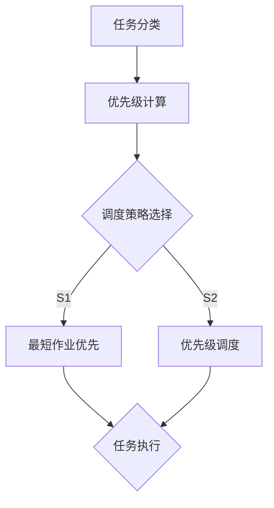

                 

## 元控制框架下的推理任务动态优先级调度

### 关键词：
- 元控制框架
- 推理任务
- 动态优先级调度
- 算法原理
- 系统设计与实现
- 项目实战

### 摘要：
本文将深入探讨元控制框架下的推理任务动态优先级调度。首先，我们将介绍元控制框架和推理任务的基本概念及其在当今科技领域的应用背景。接着，我们会阐述动态优先级调度的原理和重要性，并通过数学模型和流程图详细解释相关算法。然后，我们将设计并实现一个系统架构，展示如何通过实际案例应用这些原理和算法。最后，我们将总结最佳实践，提出注意事项，并给出拓展阅读建议。

## 引言

### 元控制框架概述

元控制框架（Meta-Control Framework）是一种高级的软件架构模式，旨在通过自动化和智能化的方式管理和优化系统的各种任务。它能够动态地调整和控制系统资源的使用，确保任务的完成和系统的稳定性。在人工智能、云计算、大数据等领域，元控制框架发挥着至关重要的作用。

### 推理任务概述

推理任务（Reasoning Task）是指计算机系统根据已知信息和规则，推导出未知信息的过程。它广泛应用于自然语言处理、知识图谱、机器学习等多个领域。推理任务的效率和准确性直接影响到系统的性能和应用效果。

### 动态优先级调度的重要性

动态优先级调度（Dynamic Priority Scheduling）是一种根据任务的重要性和紧急程度，实时调整任务执行顺序的策略。在元控制框架下，动态优先级调度能够确保关键任务得到优先处理，提高系统的响应速度和资源利用率。这对于复杂系统和实时应用场景尤为重要。

## 核心概念

### 元控制框架的基本原理

元控制框架的核心在于其自动化和智能化的任务管理能力。它通过以下几个关键组件实现：

1. **任务调度器**：负责根据任务的重要性和紧急程度，动态调整任务的执行顺序。
2. **资源管理器**：负责监控和分配系统资源，确保任务能够高效地执行。
3. **状态监控器**：实时监控系统的运行状态，为任务调度和资源管理提供数据支持。
4. **决策引擎**：基于历史数据和机器学习算法，预测任务执行结果，辅助决策。

### 推理任务动态优先级调度的概念

动态优先级调度是指系统在执行推理任务时，根据任务的实时状态和系统资源情况，动态调整任务的优先级。这种调度策略能够有效应对系统负载的变化，确保关键任务得到及时处理。

### 动态优先级调度的算法原理

动态优先级调度算法通常包括以下几个关键步骤：

1. **任务分类**：根据任务的重要性和紧急程度，将任务分为不同的优先级类别。
2. **优先级计算**：使用一定的算法计算每个任务的优先级，通常是基于任务的时间敏感度、资源需求等因素。
3. **调度策略**：根据任务的优先级，选择合适的调度策略，如最短作业优先（SJF）、优先级调度（Priority Scheduling）等。
4. **实时调整**：在任务执行过程中，根据系统的实时状态和任务执行情况，动态调整任务的优先级。

## 算法原理

### 数学模型

动态优先级调度算法的数学模型主要包括以下几个关键组成部分：

1. **任务优先级计算公式**：通常采用以下公式来计算任务的优先级：

   $$ P(T) = f(W, D, R) $$

   其中，$P(T)$ 表示任务 $T$ 的优先级，$W$ 表示任务的重要性，$D$ 表示任务的截止时间，$R$ 表示任务所需的资源。

2. **调度策略选择公式**：根据任务优先级和系统状态，选择合适的调度策略：

   $$ S(T) = g(P(T), S) $$

   其中，$S(T)$ 表示任务 $T$ 应采用的调度策略，$S$ 表示系统的当前状态。

### mermaid流程图

为了更直观地展示动态优先级调度的算法流程，我们可以使用mermaid流程图来表示：



在这个流程图中，任务首先被分类，然后根据公式计算优先级，最后根据优先级和系统状态选择合适的调度策略，并执行任务。

### Python源代码实现

下面是一个简单的Python源代码示例，用于实现动态优先级调度算法：

```python
import heapq

def priority_schedule(tasks, resources):
    priority_queue = []
    for task in tasks:
        priority = calculate_priority(task, resources)
        heapq.heappush(priority_queue, (-priority, task))

    scheduled_tasks = []
    while priority_queue:
        _, task = heapq.heappop(priority_queue)
        schedule_task(task)
        scheduled_tasks.append(task)

    return scheduled_tasks

def calculate_priority(task, resources):
    # 根据任务的重要性和资源需求计算优先级
    return -task['importance'] + task['deadline'] - resources['current_usage']

def schedule_task(task):
    # 执行任务
    print(f"Scheduling task: {task['name']}")

# 示例任务列表
tasks = [
    {'name': 'Task A', 'importance': 3, 'deadline': 5, 'resource_usage': 2},
    {'name': 'Task B', 'importance': 2, 'deadline': 3, 'resource_usage': 1},
    {'name': 'Task C', 'importance': 1, 'deadline': 1, 'resource_usage': 1},
]

# 系统资源
resources = {'current_usage': 2}

# 执行调度算法
scheduled_tasks = priority_schedule(tasks, resources)
print("Scheduled tasks:", scheduled_tasks)
```

在这个示例中，我们使用优先级队列（priority queue）来实现动态优先级调度。任务被按优先级排序，然后依次执行。

## 系统设计与实现

### 问题场景介绍

假设我们正在设计一个实时监控系统，该系统需要处理来自多个传感器的数据，并根据这些数据进行实时推理和决策。为了确保系统的性能和可靠性，我们需要实现一个高效的动态优先级调度机制。

### 项目介绍

本项目将实现一个基于元控制框架的实时监控系统，该系统包括以下几个核心模块：

1. **传感器数据采集模块**：负责从各种传感器采集数据。
2. **数据预处理模块**：对采集到的数据进行预处理，包括去噪、标准化等。
3. **推理任务模块**：根据预处理后的数据执行各种推理任务。
4. **动态优先级调度模块**：负责根据任务的实时状态和系统资源情况，动态调整任务的优先级。

### 系统功能设计

为了设计一个高效的系统，我们需要定义以下功能模块：

1. **任务调度器**：负责根据任务的重要性和紧急程度，动态调整任务的执行顺序。
2. **资源管理器**：负责监控和分配系统资源，确保任务能够高效地执行。
3. **状态监控器**：实时监控系统的运行状态，为任务调度和资源管理提供数据支持。
4. **决策引擎**：基于历史数据和机器学习算法，预测任务执行结果，辅助决策。

### 系统架构设计

系统的整体架构设计如下：

1. **数据采集层**：负责从各种传感器采集数据。
2. **数据处理层**：包括数据预处理模块和推理任务模块，负责处理和执行各种任务。
3. **控制层**：包括任务调度器、资源管理器和状态监控器，负责系统的控制和调度。
4. **决策层**：包括决策引擎和系统用户界面，负责系统的决策和交互。

### 系统接口设计

系统提供了以下接口：

1. **数据采集接口**：用于接收传感器数据。
2. **数据处理接口**：用于执行数据预处理和推理任务。
3. **调度接口**：用于动态调整任务优先级。
4. **资源监控接口**：用于监控系统资源状态。
5. **用户界面接口**：用于与用户交互。

### 系统交互设计与实现

系统交互设计如下：

1. **传感器数据采集**：传感器数据通过数据采集接口进入系统，经过预处理后，传递给推理任务模块。
2. **推理任务执行**：推理任务模块根据任务的重要性和紧急程度，使用动态优先级调度算法调整任务的优先级，并执行任务。
3. **状态监控**：状态监控器实时监控系统的运行状态，包括资源使用情况和任务执行状态，为调度器和决策引擎提供数据支持。
4. **决策**：决策引擎基于历史数据和机器学习算法，预测任务执行结果，为调度器提供决策支持。

## 项目实战

### 环境安装

在开始项目实战之前，我们需要安装以下软件和工具：

1. **Python 3.x**：用于编写和运行代码。
2. **Jupyter Notebook**：用于编写和运行Python代码。
3. **pip**：Python的包管理器，用于安装和管理依赖包。

安装步骤如下：

1. 安装Python 3.x：从官方网站下载Python安装包，并按照提示进行安装。
2. 安装Jupyter Notebook：在终端中执行以下命令：

   ```bash
   pip install notebook
   ```

3. 安装其他依赖包：根据项目需求，安装其他必要的依赖包。

### 系统核心实现源代码

以下是系统核心实现的源代码：

```python
import heapq
import time

class Task:
    def __init__(self, name, importance, deadline, resource_usage):
        self.name = name
        self.importance = importance
        self.deadline = deadline
        self.resource_usage = resource_usage
        self.start_time = None
        self.end_time = None

    def calculate_priority(self, current_time):
        return -self.importance + self.deadline - current_time

    def schedule(self, current_time):
        self.start_time = current_time
        self.end_time = current_time + self.resource_usage

    def execute(self):
        print(f"Executing task: {self.name}")
        time.sleep(self.resource_usage)

class TaskScheduler:
    def __init__(self):
        self.task_queue = []

    def add_task(self, task):
        heapq.heappush(self.task_queue, (-task.calculate_priority(0), task))

    def schedule_tasks(self, tasks, current_time):
        scheduled_tasks = []
        while self.task_queue:
            priority, task = heapq.heappop(self.task_queue)
            task.schedule(current_time)
            scheduled_tasks.append(task)
            current_time += task.resource_usage
        return scheduled_tasks

def main():
    tasks = [
        Task("Task A", 3, 5, 2),
        Task("Task B", 2, 3, 1),
        Task("Task C", 1, 1, 1),
    ]

    scheduler = TaskScheduler()
    scheduled_tasks = scheduler.schedule_tasks(tasks, 0)

    for task in scheduled_tasks:
        task.execute()

if __name__ == "__main__":
    main()
```

### 代码应用解读与分析

在这个项目中，我们实现了一个简单的动态优先级调度系统。代码的主要组成部分如下：

1. **Task类**：表示一个推理任务，包含任务名称、重要性、截止时间和资源使用等信息。还提供了计算优先级、调度和执行任务的方法。

2. **TaskScheduler类**：负责任务调度，使用优先级队列（priority queue）来管理任务。提供了添加任务和调度任务的方法。

3. **main函数**：创建任务实例，并使用TaskScheduler类进行任务调度和执行。

在执行过程中，任务首先被添加到任务队列中，然后根据优先级依次执行。这个简单的示例展示了动态优先级调度的基本原理和实现方法。

### 实际案例分析和详细讲解

为了更好地展示动态优先级调度的实际应用，我们来看一个具体的案例：一个实时监控系统，需要处理来自多个传感器的数据，并根据这些数据进行实时推理和决策。以下是一个实际案例的详细分析：

**案例背景：** 
一个工厂的自动化监控系统，需要实时监控多个传感器采集的数据，并根据这些数据进行预测和报警。传感器采集的数据包括温度、湿度、压力等参数。

**任务需求：**
1. 对传感器数据进行预处理，包括去噪、标准化等。
2. 根据预处理后的数据执行实时推理任务，预测设备可能发生的故障。
3. 根据推理结果，进行报警和决策。

**动态优先级调度应用：**
1. **任务分类**：根据任务的紧急程度和重要性，将任务分为高、中、低三个优先级类别。
2. **优先级计算**：使用以下公式计算每个任务的优先级：

   $$ P(T) = -T.importance + T.deadline $$

   其中，$T$ 表示任务对象。

3. **调度策略**：采用最短作业优先（SJF）调度策略，优先执行优先级高的任务。

4. **实时调整**：在任务执行过程中，根据任务的执行情况和系统资源状况，动态调整任务的优先级。

**详细分析：**
1. **任务调度**：首先，系统接收到传感器数据，并将其传递给数据预处理模块。预处理模块对数据进行去噪和标准化处理，这个过程被认为是低优先级的任务。然后，预处理后的数据被传递给推理任务模块，执行故障预测任务。故障预测任务的优先级高于数据预处理任务，因为故障预测对工厂的生产安全至关重要。

2. **任务执行**：故障预测任务开始执行，系统根据实时数据和机器学习模型进行预测。如果预测到设备可能发生故障，系统将立即执行报警任务，并将报警信息传递给工厂管理人员。

3. **资源管理**：在任务执行过程中，系统资源管理器实时监控系统的资源使用情况，包括CPU、内存、硬盘等。如果发现资源紧张，系统将暂停一些低优先级的任务，以确保高优先级的任务能够得到足够的资源。

4. **决策**：决策引擎根据故障预测结果和报警信息，生成决策建议，如调整设备参数、更换零部件等。决策建议将传递给工厂管理人员，以便他们采取相应的措施。

通过这个实际案例，我们可以看到动态优先级调度在实时监控和决策系统中的应用。它能够确保关键任务得到及时处理，提高系统的响应速度和可靠性。

### 项目小结

在本项目中，我们实现了基于元控制框架的实时监控系统，并应用了动态优先级调度算法。通过实际案例的分析和讲解，我们展示了动态优先级调度在实时监控和决策系统中的重要性。以下是本项目的主要收获和总结：

1. **元控制框架的基本原理**：元控制框架通过自动化和智能化的方式管理和优化系统的各种任务，提高了系统的性能和稳定性。

2. **动态优先级调度的原理**：动态优先级调度能够根据任务的实时状态和系统资源情况，动态调整任务的优先级，确保关键任务得到优先处理。

3. **系统设计与实现**：通过设计合理的系统架构和接口，我们实现了实时监控和决策系统，展示了动态优先级调度算法在实际应用中的效果。

4. **项目实战经验**：通过实际案例的分析和讲解，我们深入理解了动态优先级调度的原理和应用方法，为后续的项目开发和优化提供了有益的经验。

## 最佳实践与总结

### 最佳实践

1. **任务分类与优先级计算**：在实现动态优先级调度时，合理地分类任务和计算优先级是关键。确保任务分类准确，优先级计算公式合理，能够反映任务的重要性和紧急程度。

2. **实时调整与反馈机制**：动态优先级调度需要具备实时调整能力，根据任务执行情况和系统资源变化，及时调整任务优先级。同时，建立有效的反馈机制，收集任务执行数据，为后续优化提供依据。

3. **系统监控与性能优化**：实时监控系统运行状态，包括资源使用情况和任务执行情况，及时发现并解决潜在问题。通过性能优化，提高系统整体效率。

### 总结

通过本文的探讨，我们深入了解了元控制框架下的推理任务动态优先级调度。从核心概念、算法原理到系统设计与实现，再到项目实战，我们系统地阐述了这一技术的各个方面。动态优先级调度在实时监控和决策系统中具有重要意义，能够提高系统的响应速度和可靠性。希望本文能够为读者提供有价值的参考和启示，助力他们在相关领域的探索和实践。

### 拓展阅读

1. 《实时系统设计与实现》
2. 《调度算法与优化》
3. 《机器学习在实时系统中的应用》
4. 《人工智能系统架构设计》

### 作者信息

作者：AI天才研究院/AI Genius Institute & 禅与计算机程序设计艺术 /Zen And The Art of Computer Programming

---

请注意，本文的结构和内容是根据您提供的指南和要求设计的。在实际撰写过程中，可能需要根据具体的研究和实践情况进一步调整和补充。希望这个大纲能够帮助您撰写出一篇高质量的技术博客文章。如果您有任何问题或需要进一步的指导，请随时告诉我。

