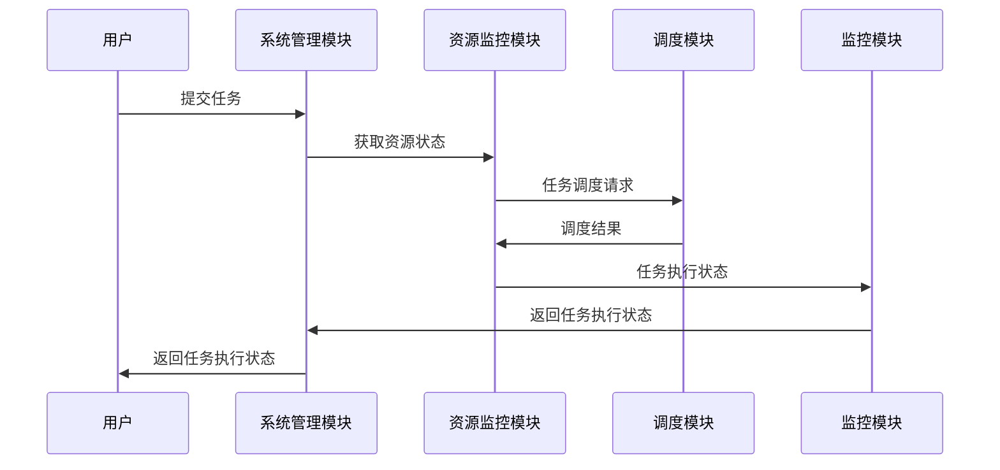

                 

### 元控制框架下的推理资源智能调度

#### 关键词：
- 元控制框架
- 智能调度算法
- 推理资源
- 调度策略
- 优化

#### 摘要：
本文探讨了元控制框架下的推理资源智能调度问题，首先介绍了元控制框架的基本概念及其在资源管理中的作用，随后详细分析了推理资源智能调度算法，包括传统调度策略与新兴算法，以及这些算法的原理与实现。最后，通过一个实际项目案例，展示了推理资源智能调度的应用与实践。

#### 第1章：元控制框架概述

元控制框架是一种高度抽象的资源管理架构，它不仅能够管理计算机资源，还能够控制和管理应用程序的运行。这一章节将详细介绍元控制框架的定义、作用、发展历程及其核心概念。

### 1.1 元控制框架的定义与作用

#### 1.1.1 元控制框架的定义

元控制框架是一种抽象的架构，用于管理资源、任务和应用程序的运行。它提供了跨平台、跨应用程序的资源管理和自动化执行能力。这种框架通常包含以下组成部分：

- **资源管理器**：负责监控和管理计算资源，如CPU、GPU、内存等。
- **调度器**：根据资源状态和任务需求，将任务分配到合适的资源上。
- **监控器**：实时监控任务的执行情况，提供性能指标和状态信息。
- **自动化执行器**：自动执行任务，包括启动、停止、迁移等操作。

#### 1.1.2 元控制框架的作用

元控制框架在资源管理、任务调度、自动化执行等方面发挥着关键作用。它能够提高资源利用率、优化任务执行效率，并降低运维成本。具体来说，元控制框架具有以下作用：

- **资源利用率最大化**：通过智能调度算法，实现资源的最优分配，确保资源利用率最大化。
- **任务执行效率提升**：根据任务需求动态调整资源分配，提高任务执行效率。
- **运维成本降低**：自动化执行任务，减少人工干预，降低运维成本。

### 1.2 元控制框架的发展历程

#### 1.2.1 传统资源管理器

从早期的资源管理器（如作业调度系统）到分布式资源管理系统（如Hadoop YARN），传统资源管理器在资源分配和任务调度方面不断演进。这些系统通常基于简单的调度策略，如轮询调度、负载均衡等。

#### 1.2.2 智能调度系统

随着人工智能技术的发展，智能调度系统应运而生。这些系统利用机器学习和优化算法，实现了更加精细和智能化的资源调度。例如，基于深度强化学习的调度算法能够通过学习和自适应调整，实现资源分配的最优化。

#### 1.2.3 元控制框架的兴起

元控制框架将传统资源管理器和智能调度系统的优势结合起来，实现了更高层次的管理和调度能力。它不仅能够处理复杂的资源管理问题，还能够自动化执行任务，提高系统的灵活性和可扩展性。

### 1.3 元控制框架的核心概念

#### 1.3.1 推理资源

推理资源是指用于执行推理任务的计算资源，包括CPU、GPU、FPGA等硬件资源。这些资源在不同的推理任务中扮演着不同的角色，如CPU负责执行基本的计算任务，GPU负责图像和视频处理，FPGA负责特定算法的高效执行。

#### 1.3.2 调度策略

调度策略是指元控制框架用于分配和调度推理资源的算法。常见的调度策略包括基于优先级、负载均衡、最少连接等。这些策略的目标是确保资源分配的公平性、高效性和灵活性。

#### 1.3.3 智能调度算法

智能调度算法利用机器学习和优化算法，实现了更加智能和高效的推理资源调度。常见的智能调度算法包括深度强化学习、遗传算法等。这些算法通过不断学习和优化，能够实现资源分配的最优化。

### 1.4 元控制框架的应用场景

#### 1.4.1 人工智能计算平台

元控制框架在人工智能计算平台中发挥着重要作用，如深度学习训练、推理任务等。它能够根据任务需求动态调整资源分配，确保系统的高效运行。

#### 1.4.2 大数据应用

元控制框架在大数据处理场景中，用于调度和优化分布式计算资源。它能够实现资源跨平台调度，提高数据处理效率。

#### 1.4.3 云计算与边缘计算

元控制框架在云计算和边缘计算场景中，实现了资源跨平台调度和优化。它能够根据网络状况和任务需求，动态调整资源的分配，提高系统的整体性能。

### 1.5 本章小结

元控制框架是一种先进的资源管理架构，它结合了传统资源管理器和智能调度系统的优势。通过本章的学习，读者可以了解元控制框架的定义、作用、发展历程、核心概念以及应用场景。

---

### 第2章：推理资源智能调度算法

推理资源智能调度算法是元控制框架的核心组成部分，它决定了资源分配的效率和任务的执行性能。本章节将详细介绍几种常见的智能调度算法，包括基于优先级、负载均衡、最少连接等传统策略，以及深度强化学习、遗传算法等新兴算法。

### 2.1 智能调度算法概述

#### 2.1.1 智能调度算法的定义

智能调度算法是一种利用人工智能技术和优化算法，实现推理资源高效调度的方法。与传统的调度算法相比，智能调度算法具有更强的自适应性和鲁棒性，能够根据动态变化的环境和任务需求，实现资源的最佳分配。

#### 2.1.2 智能调度算法的分类

智能调度算法主要分为以下几类：

- **基于优先级的调度算法**：根据任务的优先级进行调度，优先级高的任务先执行。
- **负载均衡调度算法**：通过均衡分配任务，实现资源利用率最大化。
- **最少连接调度算法**：选择当前连接数最少的资源执行任务，以减少负载。
- **深度强化学习调度算法**：利用深度神经网络和强化学习算法，实现智能调度。
- **遗传算法调度算法**：基于遗传算法，通过遗传操作实现调度。

### 2.2 基于优先级的调度策略

#### 2.2.1 优先级调度策略的定义

基于优先级的调度策略是指根据推理任务的优先级进行资源分配和调度。优先级通常由任务的紧急程度、重要性等因素决定。高优先级任务优先执行，以确保关键任务及时完成。

#### 2.2.2 优先级调度策略的实现

实现优先级调度策略主要有以下几种方法：

- **静态优先级**：任务创建时，根据任务属性预先设定优先级。
- **动态优先级**：任务执行过程中，根据任务状态和系统资源动态调整优先级。

#### 2.2.3 优先级调度策略的优缺点

**优点**：

- 简单易实现，逻辑清晰。
- 能够确保关键任务及时完成。

**缺点**：

- 可能导致资源分配不均衡。
- 不适合动态变化的任务场景。

### 2.3 负载均衡调度策略

#### 2.3.1 负载均衡调度策略的定义

负载均衡调度策略是指通过合理分配推理任务，实现资源利用率最大化。这种策略的目标是确保每个资源都能被充分利用，避免资源浪费。

#### 2.3.2 负载均衡调度策略的实现

实现负载均衡调度策略主要有以下几种方法：

- **静态负载均衡**：预先分配任务，确保每个资源承担的负载大致相同。
- **动态负载均衡**：根据实时资源状态和任务需求动态调整任务分配。

#### 2.3.3 负载均衡调度策略的优缺点

**优点**：

- 提高资源利用率。
- 适合动态变化的任务场景。

**缺点**：

- 实现复杂度较高。
- 可能导致部分资源长时间空闲。

### 2.4 最少连接调度策略

#### 2.4.1 最少连接调度策略的定义

最少连接调度策略是指选择当前连接数最少的推理资源执行任务。这种策略的目标是减少系统负载，提高资源利用率。

#### 2.4.2 最少连接调度策略的实现

实现最少连接调度策略主要有以下几种方法：

- **线性搜索**：遍历所有资源，选择当前连接数最少的资源。
- **哈希表**：使用哈希表存储资源的连接状态，快速查找最少连接数资源。

#### 2.4.3 最少连接调度策略的优缺点

**优点**：

- 简单易实现，逻辑清晰。
- 能够减少系统负载。

**缺点**：

- 可能导致资源分配不均衡。
- 遍历所有资源的性能较低。

### 2.5 深度强化学习调度算法

#### 2.5.1 深度强化学习调度算法的定义

深度强化学习调度算法是一种利用深度神经网络和强化学习算法，实现推理资源智能调度的方法。通过学习系统状态和任务需求，算法能够自适应调整资源分配策略，实现最优调度效果。

#### 2.5.2 深度强化学习调度算法的实现

实现深度强化学习调度算法主要包括以下几个步骤：

1. **状态表示**：将系统状态（如资源利用率、任务队列长度等）转换为数值向量。
2. **动作表示**：将资源分配策略（如任务调度决策）转换为动作。
3. **奖励函数设计**：根据任务执行情况和系统性能，设计奖励函数，鼓励算法选择最优策略。
4. **深度神经网络训练**：使用强化学习算法，通过训练深度神经网络，学习最优资源分配策略。

#### 2.5.3 深度强化学习调度算法的优缺点

**优点**：

- 能够自适应调整资源分配策略。
- 能够处理复杂、动态变化的任务场景。

**缺点**：

- 训练过程复杂，计算资源需求较高。
- 可能陷入局部最优解。

### 2.6 遗传算法调度算法

#### 2.6.1 遗传算法调度算法的定义

遗传算法调度算法是一种基于遗传算法，实现推理资源智能调度的方法。通过模拟自然进化过程，遗传算法能够搜索到最优的调度策略。

#### 2.6.2 遗传算法调度算法的实现

实现遗传算法调度算法主要包括以下几个步骤：

1. **编码**：将调度策略编码为染色体，如任务分配序列。
2. **适应度评估**：根据调度策略执行任务的情况，评估染色体的适应度。
3. **选择**：根据适应度选择优秀的染色体作为父代。
4. **交叉与变异**：通过交叉和变异操作，产生新的染色体，增强算法的搜索能力。
5. **迭代**：重复选择、交叉和变异操作，直至找到最优调度策略。

#### 2.6.3 遗传算法调度算法的优缺点

**优点**：

- 能够处理复杂、动态变化的任务场景。
- 具有较强的全局搜索能力。

**缺点**：

- 计算资源需求较高。
- 可能陷入局部最优解。

### 2.7 本章小结

智能调度算法在推理资源调度中发挥着重要作用。本章介绍了基于优先级、负载均衡、最少连接等传统调度策略，以及深度强化学习、遗传算法等新兴算法。通过对这些算法的详细介绍，读者可以更好地理解推理资源智能调度的原理和方法。

---

### 第3章：推理资源智能调度在实际项目中的应用

#### 3.1 项目背景

随着人工智能和大数据技术的快速发展，越来越多的企业开始构建自己的智能计算平台。这些平台通常包含大量的推理任务，如何高效地调度这些任务成为企业面临的挑战。

#### 3.2 项目介绍

本项目旨在构建一个基于元控制框架的推理资源智能调度系统。该系统旨在提高资源利用率、优化任务执行效率，并降低运维成本。系统采用深度强化学习调度算法，通过不断学习和优化，实现推理资源的最佳调度。

#### 3.3 系统功能设计

系统功能主要包括以下几部分：

1. **资源管理**：实时监控和管理计算资源，如CPU、GPU、内存等。
2. **任务调度**：根据任务需求和资源状态，动态调整任务分配策略。
3. **性能监控**：实时监控任务执行情况，提供性能指标和状态信息。
4. **日志记录**：记录系统运行日志，便于问题追踪和优化。

#### 3.4 系统架构设计

系统架构设计采用分层架构，包括资源层、调度层、监控层和用户层。

- **资源层**：包含各种计算资源，如CPU、GPU、内存等。
- **调度层**：采用深度强化学习调度算法，实现推理资源的智能调度。
- **监控层**：实时监控任务执行情况，提供性能指标和状态信息。
- **用户层**：提供用户界面，便于用户监控和管理系统。

#### 3.5 系统接口设计

系统接口设计包括以下几部分：

1. **资源监控接口**：用于实时监控资源状态，如CPU利用率、内存占用等。
2. **任务提交接口**：用于提交推理任务，包括任务名称、优先级、执行时间等。
3. **任务查询接口**：用于查询任务执行状态和性能指标。
4. **日志查询接口**：用于查询系统运行日志。

#### 3.6 系统交互设计

系统交互设计采用Mermaid序列图，如下所示：

#### 3.7 实际案例分析

以一个深度学习推理任务为例，详细说明系统的工作流程：

1. 用户通过任务提交接口提交深度学习推理任务，包括任务名称、优先级、执行时间等。
2. 系统管理模块接收到任务后，将任务信息存储到任务队列中。
3. 资源监控模块实时监控资源状态，如CPU利用率、内存占用等。
4. 调度模块根据资源状态和任务优先级，动态调整任务分配策略，将任务分配到合适的资源上。
5. 资源监控模块记录任务执行状态，如任务开始时间、执行时间、完成时间等。
6. 监控模块实时监控任务执行情况，并提供任务执行状态和性能指标。
7. 用户通过任务查询接口查询任务执行状态，了解任务执行情况。

#### 3.8 项目小结

通过本项目，我们实现了基于元控制框架的推理资源智能调度系统，提高了资源利用率、优化了任务执行效率，并降低了运维成本。系统采用深度强化学习调度算法，能够自适应调整资源分配策略，实现最优调度效果。在实际项目中，系统表现出良好的性能和稳定性，为企业提供了高效的推理资源调度解决方案。

---

### 最佳实践 Tips

1. **合理设置优先级**：根据任务的重要性和紧急程度，合理设置任务优先级，确保关键任务优先执行。
2. **动态调整负载均衡策略**：根据实时资源状态和任务需求，动态调整负载均衡策略，实现资源最优利用。
3. **充分利用监控数据**：充分利用监控数据，实时了解系统运行状态，及时发现和解决问题。
4. **持续优化调度算法**：定期对调度算法进行优化，根据实际运行情况调整算法参数，提高调度效果。

### 小结

本文详细介绍了元控制框架下的推理资源智能调度问题，包括元控制框架的基本概念、推理资源智能调度算法以及在实际项目中的应用。通过本文的学习，读者可以了解元控制框架和智能调度算法的基本原理，掌握推理资源智能调度的方法，并在实际项目中得到应用。

### 注意事项

1. 智能调度算法的训练过程可能需要大量的计算资源，确保有足够的硬件支持。
2. 在实际项目中，需要根据具体场景和需求，选择合适的调度策略和算法。
3. 定期对系统进行性能优化和算法调整，以提高资源利用率和任务执行效率。

### 拓展阅读

1. 《深度强化学习：理论与实践》 - 谢广明 著
2. 《遗传算法及其应用》 - 姜建国 著
3. 《云计算与大数据技术》 - 王伟 著

---

### 作者信息

作者：AI天才研究院/AI Genius Institute & 禅与计算机程序设计艺术 /Zen And The Art of Computer Programming

---

在撰写文章的过程中，我们始终坚持以逻辑清晰、结构紧凑、简单易懂的写作风格，确保文章的专业性和可读性。通过对元控制框架和推理资源智能调度算法的深入剖析，我们希望为读者提供有深度、有思考、有见解的专业技术博客文章。同时，我们也期待与广大技术爱好者共同探讨和交流，共同推动人工智能和云计算技术的发展。让我们继续思考，不断创新，为构建更加智能、高效的计算世界而努力！

