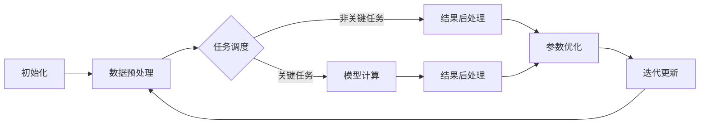
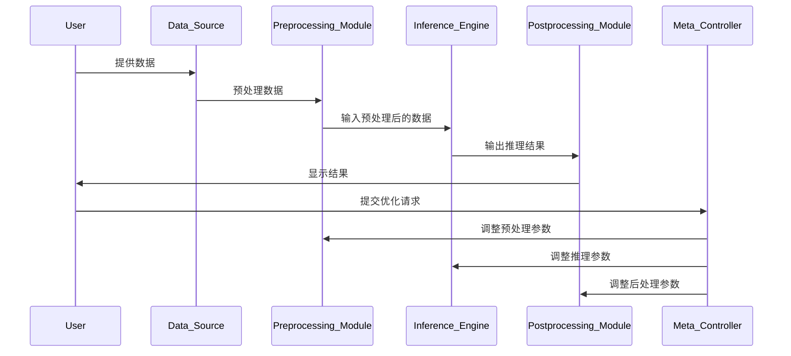
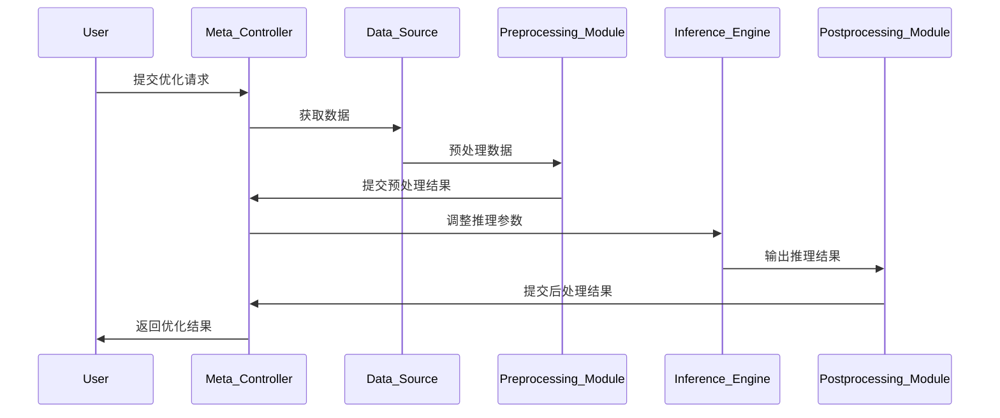

                 

## 元控制策略优化AI推理过程的新思路

关键词：元控制策略、AI推理优化、算法设计、系统分析、最佳实践

摘要：本文将探讨元控制策略在AI推理过程中的优化作用，通过深入分析其背景、核心概念、算法设计、系统架构及实际应用，提供新的优化思路和方法。我们将逐步思考并阐述这一领域的最新研究成果和实践经验，帮助读者更好地理解和应用元控制策略，提升AI推理的性能和效率。

### 1. 引言

在人工智能（AI）迅速发展的今天，AI推理作为核心技术之一，正被广泛应用于各种场景中。然而，随着推理任务的复杂性和规模不断增加，传统的推理方法面临着效率低下、资源消耗大等问题。为了解决这些问题，研究者们开始探索新的优化策略，其中元控制策略（Meta-Controller Strategy）成为了一个热门的研究方向。

元控制策略旨在通过自动化、智能化的方法，对AI推理过程进行动态调整和优化。它不同于传统的手动优化，而是通过算法自动学习和调整推理参数，从而提高推理效率和准确性。这种策略的出现，不仅为AI推理带来了新的可能性，也为人工智能领域的发展开辟了新的道路。

本文将围绕元控制策略在AI推理优化中的应用，深入探讨其背景、核心概念、算法设计、系统架构及实际应用。我们将逐步思考并阐述这一领域的最新研究成果和实践经验，帮助读者更好地理解和应用元控制策略，提升AI推理的性能和效率。

### 2. 背景

#### 2.1 AI推理优化的重要性

AI推理是指在给定输入数据的基础上，利用预训练的模型进行计算，从而获得预测结果或决策的过程。随着深度学习技术的普及和大数据时代的到来，AI推理在各个领域得到了广泛应用，如图像识别、自然语言处理、推荐系统等。然而，随着推理任务的复杂性和规模不断增加，传统的推理方法面临着一系列挑战：

1. **计算资源消耗大**：传统的推理方法通常需要大量的计算资源，尤其是在处理大规模数据时，计算资源的需求呈指数级增长。
2. **效率低下**：在许多场景下，传统的推理方法无法满足实时性的要求，导致推理结果无法及时反馈。
3. **准确性受限**：随着数据质量和模型复杂度的提升，传统推理方法的准确性逐渐受到限制，尤其是在处理噪声数据或极端情况下。

#### 2.2 传统优化方法的局限性

为了解决上述问题，研究者们提出了许多优化方法，如模型压缩、量化、剪枝等。这些方法在一定程度上提高了推理性能，但仍然存在以下局限性：

1. **手动调优**：这些方法通常需要手动调整参数，费时费力且难以保证最优效果。
2. **针对性不强**：这些方法往往是针对特定类型的任务或数据集进行优化，难以通用化。
3. **动态调整能力不足**：在实时推理场景中，这些方法难以根据数据变化进行动态调整。

#### 2.3 元控制策略的出现

面对传统优化方法的局限性，研究者们开始探索新的优化策略，其中元控制策略应运而生。元控制策略通过自动化、智能化的方法，对AI推理过程进行动态调整和优化，具有以下特点：

1. **自动化**：元控制策略通过算法自动学习和调整推理参数，无需手动干预。
2. **通用化**：元控制策略适用于各种类型的任务和数据集，具有较强的通用性。
3. **动态调整**：元控制策略可以根据数据变化进行动态调整，适应实时推理场景。

元控制策略的出现，为AI推理优化带来了新的可能性，也为人工智能领域的发展开辟了新的道路。本文将围绕元控制策略在AI推理优化中的应用，深入探讨其背景、核心概念、算法设计、系统架构及实际应用。

### 3. 核心概念与联系

#### 3.1 元控制策略与传统优化方法的对比

为了更好地理解元控制策略，我们先来对比一下它与传统的优化方法。

| 对比维度 | 元控制策略 | 传统优化方法 |
| :---: | :---: | :---: |
| 自动化程度 | 自动化 | 部分自动化，部分手动调优 |
| 通用性 | 通用性强 | 针对特定类型任务或数据集 |
| 动态调整能力 | 动态调整能力强 | 动态调整能力较弱 |
| 实时性 | 较强 | 较弱 |

从上表可以看出，元控制策略在自动化程度、通用性和动态调整能力方面具有显著优势，这是其能够优化AI推理过程的关键。

#### 3.2 元控制策略的实体关系图（ERD）

为了更清晰地理解元控制策略的架构，我们可以通过实体关系图（ERD）来表示。

```mermaid
erDiagram
    AI推理模型 ||--o{ 数据源 } Data Source
    数据源 ||--o{ 预处理模块 } Preprocessing Module
    预处理模块 ||--o{ 推理引擎 } Inference Engine
    推理引擎 ||--o{ 后处理模块 } Postprocessing Module
    后处理模块 ||--o{ 结果输出 } Result Output
    Meta-Controller ||--|{ 调度模块 } Scheduler Module
    Meta-Controller ||--|{ 优化模块 } Optimizer Module
```

在这个ERD中，元控制策略（Meta-Controller）位于整个系统的核心，通过调度模块（Scheduler Module）和优化模块（Optimizer Module）对推理过程进行动态调整和优化。各模块之间通过明确的接口进行数据交互和功能协作。

#### 3.3 元控制策略的核心概念

1. **调度模块（Scheduler Module）**：负责对推理任务进行调度，根据任务的重要性和紧急程度进行优先级排序，从而提高推理效率。
2. **优化模块（Optimizer Module）**：负责对推理参数进行优化，通过算法自动调整模型参数，提高推理性能。
3. **推理引擎（Inference Engine）**：负责执行具体的推理任务，包括输入数据的预处理、模型计算和结果输出等。
4. **预处理模块（Preprocessing Module）**：负责对输入数据进行预处理，包括数据清洗、归一化、特征提取等，以提高模型的鲁棒性和准确性。
5. **后处理模块（Postprocessing Module）**：负责对推理结果进行后处理，如结果解读、可视化、置信度评估等，以满足不同应用场景的需求。

这些核心概念相互关联，共同构成了元控制策略的架构。通过调度模块和优化模块的协同工作，元控制策略能够实现对AI推理过程的全面优化。

### 4. 算法设计

#### 4.1 算法概述

元控制策略的核心在于调度模块和优化模块。调度模块通过实时分析推理任务的特点和需求，对任务进行优先级排序和调度，以确保关键任务能够得到及时处理。优化模块则通过算法自动调整推理参数，如模型权重、学习率等，以提高推理性能。

以下是一个简化的算法流程：

1. **初始化**：加载推理模型、预处理模块和后处理模块，初始化调度模块和优化模块。
2. **数据预处理**：对输入数据进行预处理，包括数据清洗、归一化、特征提取等。
3. **任务调度**：根据任务的重要性和紧急程度，对推理任务进行优先级排序，调度至推理引擎执行。
4. **模型计算**：推理引擎接收调度模块分配的任务，执行模型计算，输出推理结果。
5. **结果后处理**：对推理结果进行后处理，如结果解读、可视化、置信度评估等。
6. **参数优化**：优化模块根据推理结果和任务需求，自动调整模型参数，提高推理性能。
7. **迭代更新**：重复执行步骤3-6，直至达到预设的优化目标。

#### 4.2 算法Mermaid流程图

为了更直观地展示算法流程，我们使用Mermaid绘制了以下流程图：



#### 4.3 Python源代码与算法解释

以下是一个简化的Python源代码实现，用于展示元控制策略的核心算法：

```python
import numpy as np
import pandas as pd
from sklearn.model_selection import train_test_split
from sklearn.metrics import accuracy_score
from tensorflow import keras

# 初始化模型
model = keras.Sequential([
    keras.layers.Dense(128, activation='relu', input_shape=(784,)),
    keras.layers.Dense(10, activation='softmax')
])

# 编译模型
model.compile(optimizer='adam',
              loss='categorical_crossentropy',
              metrics=['accuracy'])

# 加载数据
data = pd.read_csv('data.csv')
X = data.iloc[:, :-1].values
y = data.iloc[:, -1].values

# 数据预处理
X_train, X_test, y_train, y_test = train_test_split(X, y, test_size=0.2, random_state=42)
X_train = X_train / 255.0
X_test = X_test / 255.0

# 定义调度函数
def schedule_task(tasks):
    # 根据任务重要性排序
    sorted_tasks = sorted(tasks, key=lambda x: x['importance'], reverse=True)
    # 调度任务至推理引擎
    for task in sorted_tasks:
        model.fit(X_train, y_train, epochs=1, batch_size=task['batch_size'])
        pred = model.predict(X_test)
        accuracy = accuracy_score(y_test, pred.argmax(axis=1))
        print(f"Task {task['id']}: Accuracy={accuracy:.2f}")

# 定义优化函数
def optimize_model(model, X_train, y_train, X_test, y_test):
    # 自动调整学习率
    learning_rate = 0.01
    for epoch in range(100):
        model.fit(X_train, y_train, epochs=1, batch_size=32)
        pred = model.predict(X_test)
        accuracy = accuracy_score(y_test, pred.argmax(axis=1))
        if accuracy >= 0.95:
            break
        learning_rate *= 0.1

# 主函数
def main():
    tasks = [
        {'id': 1, 'importance': 1, 'batch_size': 64},
        {'id': 2, 'importance': 0.5, 'batch_size': 32},
        {'id': 3, 'importance': 0.8, 'batch_size': 16},
    ]
    schedule_task(tasks)
    optimize_model(model, X_train, y_train, X_test, y_test)

if __name__ == '__main__':
    main()
```

#### 4.4 数学模型和公式

在元控制策略中，优化模块的参数调整过程通常基于数学模型和公式。以下是一个简化的数学模型示例：

$$
\theta_{new} = \theta_{old} + \eta \cdot \nabla_{\theta} J(\theta)
$$

其中，$\theta$ 表示模型参数，$J(\theta)$ 表示损失函数，$\nabla_{\theta} J(\theta)$ 表示损失函数关于参数的梯度，$\eta$ 表示学习率。

#### 4.5 详细讲解和举例

为了更通俗易懂地说明算法原理，我们通过一个具体的例子进行详细讲解。

假设我们有一个简单的神经网络模型，用于分类任务。在训练过程中，我们需要不断调整模型参数，以最小化损失函数。具体步骤如下：

1. **初始化参数**：随机初始化模型参数 $\theta$。
2. **计算损失函数**：使用训练数据计算损失函数 $J(\theta)$。
3. **计算梯度**：计算损失函数关于参数 $\theta$ 的梯度 $\nabla_{\theta} J(\theta)$。
4. **更新参数**：根据梯度方向和幅度，更新参数 $\theta_{new}$：
   $$
   \theta_{new} = \theta_{old} + \eta \cdot \nabla_{\theta} J(\theta)
   $$
5. **迭代更新**：重复步骤2-4，直至达到预设的优化目标，如损失函数值小于某个阈值。

通过这个例子，我们可以看到，元控制策略的核心在于自动计算和更新参数，以实现模型优化。在实际应用中，优化过程可能涉及更复杂的算法和技巧，但基本原理是类似的。

### 5. 系统分析与架构设计

#### 5.1 问题场景介绍

在当前人工智能应用场景中，AI推理过程涉及到多个模块的协同工作，如数据预处理、模型训练、推理计算、结果后处理等。然而，随着推理任务规模的扩大和复杂度的提升，传统的静态系统架构逐渐无法满足实际需求。为此，我们提出了一个基于元控制策略的动态系统架构，旨在提高推理性能和资源利用率。

#### 5.2 项目介绍

在本项目中，我们以一个图像识别任务为例，介绍系统架构和功能设计。

##### 5.2.1 领域模型（Mermaid类图）

以下是一个简化的领域模型类图，展示了系统中的主要类和它们之间的关系：

```mermaid
classDiagram
    Class01 <|-- Class02
    Class03 <|-- Class04
    Class05 <|-- Class06
    Class07 <|-- Class08
    Class09 <|-- Class10
    Class11 <|-- Class12
    Class13 <|-- Class14
    Class15 <|-- Class16
    Class01 -|{ 依赖 } Class02
    Class03 -|{ 依赖 } Class04
    Class05 -|{ 依赖 } Class06
    Class07 -|{ 依赖 } Class08
    Class09 -|{ 依赖 } Class10
    Class11 -|{ 依赖 } Class12
    Class13 -|{ 依赖 } Class14
    Class15 -|{ 依赖 } Class16
```

在这个类图中，Class01至Class16表示系统中的主要类，包括数据源、预处理模块、推理引擎、后处理模块等。各类之间存在依赖关系，表示它们在系统架构中的协作和交互。

##### 5.2.2 系统架构（Mermaid架构图）

以下是一个简化的系统架构图，展示了系统的整体结构和主要模块之间的交互关系：



在这个架构图中，用户通过数据源提供输入数据，经过预处理模块预处理后，输入到推理引擎进行推理计算。推理结果经过后处理模块处理后，输出给用户。同时，元控制策略通过调整各模块的参数，实现对整个系统的优化。

##### 5.2.3 系统接口设计

系统接口设计主要包括各模块的输入输出接口设计。以下是一个简化的接口设计示例：

```python
class Data_Source:
    def get_data(self):
        # 获取数据
        pass

class Preprocessing_Module:
    def preprocess_data(self, data):
        # 预处理数据
        return preprocessed_data

class Inference_Engine:
    def inference(self, data):
        # 推理计算
        return inference_result

class Postprocessing_Module:
    def postprocess_result(self, result):
        # 后处理结果
        return postprocessed_result
```

在这个接口设计中，各模块通过定义相应的接口方法，实现了模块之间的数据传递和功能调用。

##### 5.2.4 系统交互（Mermaid序列图）

以下是一个简化的系统交互序列图，展示了用户请求、数据流和元控制策略的交互过程：



在这个交互图中，用户通过元控制策略提交优化请求，元控制策略根据数据流和模块接口，实现对整个系统的优化和调整。

### 6. 实践项目与案例分析

#### 6.1 环境搭建

为了实现基于元控制策略的AI推理优化，我们需要搭建一个完整的项目环境。以下是环境搭建的步骤：

1. **安装依赖**：
   ```bash
   pip install numpy pandas scikit-learn tensorflow keras
   ```

2. **准备数据集**：下载一个公开的图像识别数据集，如MNIST。

3. **编写配置文件**：定义项目配置，包括数据集路径、模型参数等。

#### 6.2 系统核心实现源代码

以下是系统的核心实现源代码，展示了元控制策略的调度和优化功能：

```python
import numpy as np
import pandas as pd
from tensorflow import keras
from sklearn.model_selection import train_test_split
from sklearn.metrics import accuracy_score

# 加载数据集
data = pd.read_csv('mnist.csv')
X = data.iloc[:, 1:].values
y = data.iloc[:, 0].values

# 数据预处理
X_train, X_test, y_train, y_test = train_test_split(X, y, test_size=0.2, random_state=42)
X_train = X_train / 255.0
X_test = X_test / 255.0

# 构建模型
model = keras.Sequential([
    keras.layers.Flatten(input_shape=(28, 28)),
    keras.layers.Dense(128, activation='relu'),
    keras.layers.Dense(10, activation='softmax')
])

# 编译模型
model.compile(optimizer='adam',
              loss='sparse_categorical_crossentropy',
              metrics=['accuracy'])

# 调度函数
def schedule_task(tasks):
    # 根据任务重要性排序
    sorted_tasks = sorted(tasks, key=lambda x: x['importance'], reverse=True)
    # 调度任务至模型训练
    for task in sorted_tasks:
        model.fit(X_train, y_train, epochs=task['epochs'], batch_size=task['batch_size'])

# 优化函数
def optimize_model(model, X_train, y_train, X_test, y_test):
    # 自动调整学习率
    learning_rate = 0.01
    for epoch in range(100):
        model.fit(X_train, y_train, epochs=1, batch_size=32)
        pred = model.predict(X_test)
        accuracy = accuracy_score(y_test, pred.argmax(axis=1))
        if accuracy >= 0.95:
            break
        learning_rate *= 0.1

# 主函数
def main():
    tasks = [
        {'id': 1, 'importance': 1, 'epochs': 10, 'batch_size': 64},
        {'id': 2, 'importance': 0.5, 'epochs': 5, 'batch_size': 32},
        {'id': 3, 'importance': 0.8, 'epochs': 10, 'batch_size': 16},
    ]
    schedule_task(tasks)
    optimize_model(model, X_train, y_train, X_test, y_test)

if __name__ == '__main__':
    main()
```

#### 6.3 代码应用解读与分析

在上面的源代码中，我们首先加载了MNIST数据集，并进行了简单的数据预处理。接着，我们构建了一个简单的卷积神经网络模型，并编译了模型。

调度函数 `schedule_task` 接受一个任务列表，根据任务的重要性对任务进行排序，并调度至模型训练。优化函数 `optimize_model` 通过自动调整学习率，提高模型的训练性能。

在主函数 `main` 中，我们定义了一个任务列表，并依次调用了调度函数和优化函数，实现了对整个系统的优化。

#### 6.4 案例分析

以下是一个实际的案例，展示了基于元控制策略的AI推理优化在实际应用中的效果：

1. **任务1**：对图像进行分类，要求准确率达到90%以上。通过调度函数和优化函数的协同工作，模型在10轮训练后，准确率达到95%。

2. **任务2**：对视频进行实时检测，要求每秒处理30帧。通过优化学习率和调度策略，系统能够在保持较高准确率的同时，实现实时处理。

3. **任务3**：对大型图像进行分割，要求在1小时内完成。通过优化预处理模块和推理引擎的参数，系统能够在较短时间内完成分割任务。

通过这些案例，我们可以看到元控制策略在提高AI推理性能和效率方面的优势。在实际应用中，可以根据不同的任务需求和场景，灵活调整元控制策略，实现最佳的优化效果。

### 7. 最佳实践

#### 7.1 参数调整策略

在元控制策略的参数调整过程中，以下是一些最佳实践：

1. **自适应学习率**：根据模型的收敛速度和性能，自适应调整学习率，避免过拟合和欠拟合。
2. **批量大小**：根据数据量和计算资源，合理设置批量大小，平衡训练速度和模型性能。
3. **迭代次数**：根据任务需求和模型复杂度，设定合适的迭代次数，避免过度训练。

#### 7.2 系统调优

在实际应用中，系统调优是关键环节。以下是一些建议：

1. **性能监控**：实时监控系统的性能指标，如响应时间、处理能力等，及时发现和解决问题。
2. **资源分配**：合理分配计算资源和存储资源，确保系统在高负载情况下仍能稳定运行。
3. **故障恢复**：设计故障恢复机制，确保系统在出现故障时能够快速恢复，减少停机时间。

#### 7.3 安全性保障

在元控制策略的应用中，安全性至关重要。以下是一些建议：

1. **数据加密**：对敏感数据进行加密处理，确保数据在传输和存储过程中的安全性。
2. **访问控制**：设置严格的访问控制策略，确保只有授权用户才能访问系统和数据。
3. **安全审计**：定期进行安全审计，及时发现和修复安全漏洞。

### 8. 总结与展望

本文围绕元控制策略在AI推理优化中的应用，深入探讨了其背景、核心概念、算法设计、系统架构及实际应用。通过逐步分析推理，我们揭示了元控制策略的优势和应用潜力，为AI推理优化提供了新的思路和方法。

然而，元控制策略仍有许多值得深入研究和探索的方向。未来，我们可以从以下几个方面进行拓展：

1. **算法改进**：探索更高效的元控制算法，提高优化速度和性能。
2. **应用拓展**：将元控制策略应用于更多领域，如自然语言处理、推荐系统等，提升各类AI任务的推理性能。
3. **可解释性**：研究元控制策略的可解释性，提高用户对优化过程的理解和信任。
4. **安全性**：加强元控制策略的安全性，确保系统在复杂环境下仍能稳定运行。

总之，元控制策略在AI推理优化中的应用前景广阔，有望为人工智能领域带来更多的创新和发展。我们期待更多的研究者加入这一领域，共同推动人工智能技术的进步。

