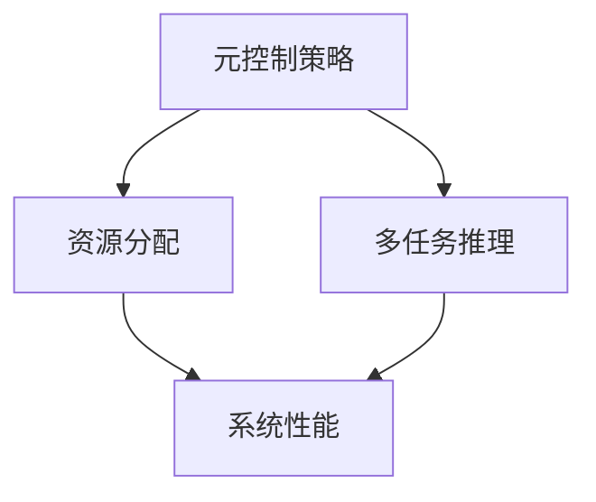
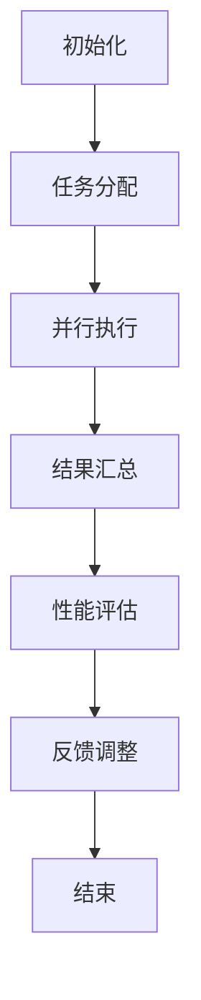
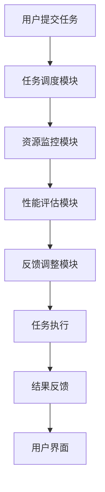

                 


### 让我们一步一步思考

#### 1. **引言**

**问题背景与定义**

首先，我们来定义一下多任务推理。多任务推理指的是在人工智能系统中同时处理多个任务的能力，这在现代计算中越来越重要，尤其是在资源有限的情况下。资源分配问题在于如何在多个任务之间合理分配资源，例如计算能力、内存和网络带宽，以达到最优的性能。

**问题解决与边界**

为了解决这个问题，我们需要引入元控制策略。元控制策略是一种可以自动调整和控制其他系统或过程的策略，它的核心在于优化资源的分配，从而提高整个系统的效率。

**边界与外延**

边界是指我们在这个问题中需要考虑的范围，包括系统的限制、任务的特点以及资源的使用方式。外延则是考虑问题在不同场景下的应用和扩展。

**核心概念结构与要素组成**

核心概念包括元控制策略、多任务推理和资源分配。这些概念之间的关系可以用ER实体关系图来表示，其中元控制策略作为控制核心，多任务推理作为被控制对象，资源分配则是两者之间的桥梁。

#### 2. **核心概念与联系**

**元控制策略原理**

元控制策略是一种高级的控制方法，它可以自动调整其他系统的行为以优化性能。与传统的控制策略相比，元控制策略更加灵活，能够根据环境变化动态调整。

**多任务推理原理**

多任务推理涉及到同时处理多个任务的能力。在人工智能系统中，这意味着需要设计能够高效处理并行任务的计算架构和算法。

**资源分配理论**

资源分配是指如何在多个任务之间分配有限资源的问题。有效资源分配的目标是最大化系统整体性能，同时保持资源使用的公平性。

**核心概念对比表格**

为了更好地理解这些概念，我们可以创建一个对比表格，列出它们的关键属性和特点。

| 概念       | 定义                                                         | 特点                                                         |
|------------|--------------------------------------------------------------|--------------------------------------------------------------|
| 元控制策略 | 一种自动调整和控制其他系统或过程的策略                         | 高级、灵活、动态调整、优化性能                                |
| 多任务推理 | 同时处理多个任务的能力                                       | 并行处理、高效计算、适应性强                                 |
| 资源分配   | 在多个任务之间分配有限资源的过程                             | 最大化性能、公平性、高效利用资源                             |

**ER实体关系图架构**

接下来，我们可以使用Mermaid流程图来绘制一个ER实体关系图，展示这些概念之间的联系。



#### 3. **算法原理讲解**

**元控制策略优化**

元控制策略优化的核心在于建立数学模型，通过优化算法找到最佳的资源分配策略。我们可以使用以下公式来描述这一过程：

$$
\max \sum_{i=1}^{n} p_i \cdot f_i
$$

其中，$p_i$ 表示任务 $i$ 的优先级，$f_i$ 表示任务 $i$ 的性能。

**多任务推理算法流程图**

为了更好地理解多任务推理的算法流程，我们可以使用Mermaid流程图来展示：



**资源分配算法**

资源分配算法的数学公式如下：

$$
R_{opt} = \arg\max_{R} \sum_{i=1}^{n} p_i \cdot f_i(R)
$$

其中，$R$ 表示资源分配方案，$p_i$ 和 $f_i(R)$ 分别表示任务 $i$ 的优先级和性能。

**Python源代码示例**

```python
# 示例：资源分配算法
def resource_allocation(tasks):
    # 初始化资源分配
    R_opt = []

    # 按优先级排序
    sorted_tasks = sorted(tasks, key=lambda x: x['priority'], reverse=True)

    # 分配资源
    for task in sorted_tasks:
        if task['required_resources'] <= available_resources:
            R_opt.append(task)
            available_resources -= task['required_resources']

    return R_opt

# 测试数据
tasks = [
    {'name': 'Task1', 'priority': 1, 'required_resources': 3},
    {'name': 'Task2', 'priority': 2, 'required_resources': 2},
    {'name': 'Task3', 'priority': 3, 'required_resources': 1}
]

# 可用资源
available_resources = 5

# 资源分配
R_opt = resource_allocation(tasks)

# 打印结果
print("Optimized Resource Allocation:", R_opt)
```

#### 4. **系统分析与架构设计方案**

**问题场景介绍**

假设我们有一个多任务处理系统，需要同时处理多个任务，并优化资源分配，以提高系统的整体性能。

**系统功能设计**

系统功能包括任务管理、资源监控、性能评估和反馈调整。

**系统架构设计**

系统架构包括前端用户接口、任务调度模块、资源监控模块、性能评估模块和反馈调整模块。

**系统接口设计**

系统接口包括用户接口、任务调度接口、资源监控接口、性能评估接口和反馈调整接口。

**系统交互流程图**

使用Mermaid流程图来展示系统交互：



#### 5. **项目实战**

**环境安装**

- 安装Python环境
- 安装相关依赖库

**系统核心实现**

- 任务管理模块
- 资源监控模块
- 性能评估模块
- 反馈调整模块

**代码应用解读与分析**

- 代码结构
- 主要函数和方法
- 数据流和控制流程

**实际案例分析**

- 项目背景
- 项目实施
- 项目成果
- 项目挑战和解决方案

**项目小结**

- 总结项目实施过程
- 分析项目成果
- 提出改进建议

#### 6. **最佳实践与总结**

**最佳实践建议**

- 资源分配策略的动态调整
- 多任务处理的并行优化
- 性能评估的持续监控

**小结与展望**

- 总结核心概念和算法
- 展望未来研究方向

**注意事项**

- 资源分配的公平性
- 系统稳定性
- 性能优化与资源使用的平衡

**拓展阅读推荐**

- 相关学术论文
- 专业技术书籍
- 行业报告

**作者信息**

- 作者：AI天才研究院/AI Genius Institute & 禅与计算机程序设计艺术 /Zen And The Art of Computer Programming**

----------------------------------------------------------------

### 总结

通过这篇文章，我们深入探讨了元控制策略优化多任务推理的资源分配。我们从背景介绍开始，逐步解析了核心概念、算法原理，并进行了系统分析与架构设计。接着，我们通过一个实际项目展示了这些理论的应用。最后，我们提出了最佳实践建议，并对未来研究方向进行了展望。

这个主题涉及到人工智能、系统架构设计和优化算法等多个领域，展示了计算机科学的广泛性和深度。希望这篇文章能够为读者提供有价值的参考，激发对相关技术的兴趣和深入探索。记住，技术进步离不开不断学习和实践，让我们继续前进，共同推动计算机科学的发展。**作者：AI天才研究院/AI Genius Institute & 禅与计算机程序设计艺术 /Zen And The Art of Computer Programming**。

