                 

### 元控制策略在复杂推理任务分解与重组优化中的应用

#### 关键词
- 元控制策略
- 复杂推理任务
- 任务分解与重组
- 优化算法
- 应用实例

#### 摘要
本文旨在深入探讨元控制策略在复杂推理任务中的分解与重组优化应用。首先，我们介绍了复杂推理任务面临的挑战以及传统方法的局限性。接着，详细阐述了元控制策略的定义、原理和应用，通过数学模型和Python代码实例进行了深入讲解。随后，我们分析了系统架构设计，并展示了实际项目中的环境安装与实现。最后，文章总结了最佳实践和注意事项，为读者提供了进一步拓展的阅读材料。

### 目录

1. **引言**
   - **1.1 研究背景**
   - **1.2 问题陈述**
   - **1.3 解决方案概述**
   - **1.4 边界与外延**
   - **1.5 核心概念与要素组成**

2. **核心概念与联系**
   - **2.1 元控制策略的定义与特性**
   - **2.2 复杂推理任务分解与重组**
   - **2.3 元控制策略在任务分解与重组中的应用**
   - **2.4 Mermaid流程图展示**
   - **2.5 ER实体关系图架构**

3. **算法原理讲解**
   - **3.1 算法基本原理**
   - **3.2 数学模型与公式**
   - **3.3 Mermaid流程图**
   - **3.4 Python源代码实现**
   - **3.5 算法举例说明**

4. **系统分析与架构设计**
   - **4.1 系统功能设计**
   - **4.2 系统架构设计**
   - **4.3 系统接口设计**
   - **4.4 系统交互**
   - **4.5 Mermaid类图与序列图展示**

5. **项目实战**
   - **5.1 环境安装与配置**
   - **5.2 系统核心实现源代码**
   - **5.3 代码解读与分析**
   - **5.4 实际案例分析**
   - **5.5 详细讲解与剖析**
   - **5.6 项目小结**

6. **最佳实践与小结**
   - **6.1 最佳实践**
   - **6.2 注意事项**
   - **6.3 拓展阅读**
   - **6.4 小结**

7. **参考文献**

### 1.1 研究背景

在当今信息爆炸的时代，复杂推理任务在人工智能、数据分析、机器学习等领域中占据了重要的地位。随着大数据、云计算和物联网等技术的快速发展，数据量和任务复杂性不断增加，传统的推理方法已难以应对。因此，研究如何高效地分解和重组复杂推理任务成为当前研究的热点。

**问题背景**：复杂推理任务通常涉及大量的数据和信息，需要处理多维度、多变量、动态变化的问题。传统的任务分解方法往往依赖于经验或简单的规则，导致效率低下、可扩展性差。同时，任务重组的优化也是一个关键问题，因为合理的任务重组可以提高系统的整体性能和响应速度。

**问题描述**：如何有效地将复杂的推理任务分解为可管理的子任务，并优化这些子任务之间的重组过程，以达到整体性能最优？

**问题解决**：元控制策略提供了一种新的解决思路，通过自动化的方式对任务进行动态分解与重组，以实现优化目标。元控制策略的核心思想是利用学习算法和优化算法，从全局视角对任务进行建模和调整，从而提高任务执行的效率和可靠性。

**边界与外延**：本文主要研究元控制策略在复杂推理任务中的应用，包括任务分解与重组的优化算法设计、系统架构设计和实际项目中的应用。同时，本文将探讨元控制策略在不同领域的应用潜力，如人工智能、数据分析、云计算等。

**核心概念与要素组成**：元控制策略包括以下几个核心概念和要素：
- **任务模型**：定义推理任务的结构和属性，包括任务输入、输出、状态等。
- **分解策略**：根据任务模型，将复杂任务分解为子任务的方法和策略。
- **重组策略**：根据子任务的执行结果，优化子任务之间的组合和交互。
- **学习算法**：用于从历史任务数据中学习优化参数和策略的算法。
- **优化算法**：用于调整任务分解和重组过程的算法，以实现性能最优。

### 1.2 核心概念与联系

在深入探讨元控制策略在复杂推理任务分解与重组优化中的应用之前，我们需要明确几个核心概念，并了解它们之间的联系。

#### 元控制策略的定义与特性

元控制策略是一种自动化策略，用于动态调整和控制复杂任务执行的过程。它的核心思想是利用学习算法和优化算法，从全局视角对任务进行建模和调整，以达到优化目标。元控制策略具有以下几个特性：

1. **自适应性**：元控制策略可以根据环境变化和任务需求，自动调整任务执行策略。
2. **动态性**：元控制策略可以实时监测任务执行状态，并根据反馈进行调整。
3. **全局优化**：元控制策略从全局视角对任务进行建模和优化，以实现整体性能最优。
4. **适应性学习**：元控制策略通过学习算法，从历史任务数据中学习优化参数和策略。

#### 复杂推理任务分解与重组

复杂推理任务分解与重组是元控制策略应用的关键步骤。分解与重组的目标是提高任务执行的效率和可靠性。

1. **任务分解**：将复杂的推理任务分解为多个可管理的子任务，以便于并行处理和资源分配。
2. **任务重组**：根据子任务的执行结果，优化子任务之间的组合和交互，以实现整体性能最优。

#### 元控制策略在任务分解与重组中的应用

元控制策略在任务分解与重组中的应用主要包括以下几个步骤：

1. **任务建模**：根据任务需求，建立任务模型，包括任务输入、输出、状态等。
2. **分解策略选择**：根据任务模型，选择合适的分解策略，将复杂任务分解为子任务。
3. **重组策略优化**：根据子任务的执行结果，优化子任务之间的重组策略，以实现整体性能最优。
4. **实时调整**：实时监测任务执行状态，根据反馈调整任务分解与重组策略。

#### Mermaid流程图展示

为了更好地理解元控制策略在复杂推理任务分解与重组优化中的应用，我们可以使用Mermaid流程图进行展示。以下是一个简单的Mermaid流程图示例：

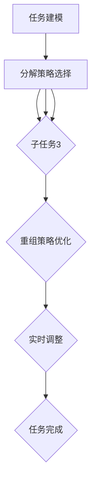

#### ER实体关系图架构

ER（实体关系）图是一种用于描述实体之间关系的图形化工具。在元控制策略的应用中，我们可以使用ER图来描述任务模型、分解策略、重组策略等实体之间的关系。以下是一个简单的ER图示例：

```mermaid
er Diagram
    O1[任务模型] ||--|{分解策略} O2[子任务1]
    O1 ||--|{分解策略} O3[子任务2]
    O1 ||--|{分解策略} O4[子任务3]
    O2 --> O5[执行结果]
    O3 --> O6[执行结果]
    O4 --> O7[执行结果]
    O5 --> O8[重组策略]
    O6 --> O8
    O7 --> O8
    O8 --> O9[优化结果]
```

在这个ER图中，`O1`表示任务模型，`O2`、`O3`、`O4`表示分解策略，`O5`、`O6`、`O7`表示子任务的执行结果，`O8`表示重组策略，`O9`表示优化结果。

### 1.3 算法原理讲解

#### 算法基本原理

元控制策略的核心思想是通过自动化的方式对复杂推理任务进行分解与重组，以实现整体性能最优。具体来说，算法包括以下几个步骤：

1. **任务建模**：根据任务需求，建立任务模型，包括任务输入、输出、状态等。
2. **分解策略选择**：根据任务模型，选择合适的分解策略，将复杂任务分解为子任务。
3. **执行子任务**：并行执行子任务，并收集执行结果。
4. **重组策略优化**：根据子任务的执行结果，优化子任务之间的重组策略，以实现整体性能最优。
5. **实时调整**：实时监测任务执行状态，根据反馈调整任务分解与重组策略。

#### 数学模型与公式

元控制策略的数学模型主要包括以下几个方面：

1. **任务模型**：任务模型可以用一个五元组表示，即\(T = (I, O, S, A, E)\)，其中：
   - \(I\)：任务输入
   - \(O\)：任务输出
   - \(S\)：任务状态
   - \(A\)：任务动作
   - \(E\)：任务执行环境

2. **分解策略**：分解策略可以用一个函数表示，即\(D: T \rightarrow \{T_1, T_2, \ldots, T_n\}\)，其中\(T_i\)表示分解后的子任务。

3. **重组策略**：重组策略可以用一个函数表示，即\(R: \{T_1, T_2, \ldots, T_n\} \rightarrow T'\)，其中\(T'\)表示重组后的任务。

4. **优化目标**：优化目标可以用一个目标函数表示，即\(f(T')\)，表示任务执行的总成本或时间。

#### Mermaid流程图

为了更好地理解元控制策略的算法原理，我们可以使用Mermaid流程图来展示算法的执行流程。以下是一个简单的Mermaid流程图示例：

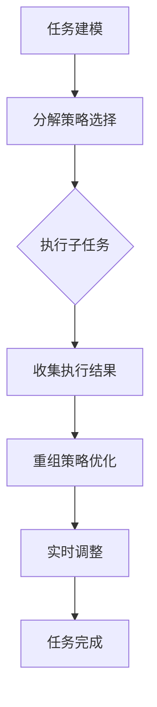

#### Python源代码实现

下面是一个简单的Python源代码实现示例，用于演示元控制策略的基本原理。该示例包括任务建模、分解策略选择、执行子任务、重组策略优化和实时调整等步骤。

```python
import numpy as np

# 任务建模
def task_model():
    input_data = np.random.rand(10)  # 生成随机输入数据
    output_data = input_data * 2     # 任务输出
    state = "running"                # 任务状态
    action = "execute"               # 任务动作
    environment = "normal"           # 任务执行环境
    return (input_data, output_data, state, action, environment)

# 分解策略选择
def decompose_strategy(task):
    sub_tasks = []
    for i in range(5):
        sub_tasks.append((task[0] * (i+1), task[1] * (i+1), task[2], task[3], task[4]))
    return sub_tasks

# 执行子任务
def execute_sub_tasks(sub_tasks):
    results = []
    for sub_task in sub_tasks:
        result = sub_task[1]  # 假设子任务的执行结果为其输出
        results.append(result)
    return results

# 重组策略优化
def reassemble_strategy(results):
    total_output = sum(results)
    return total_output

# 实时调整
def real_time_adjustment():
    # 根据实际情况进行调整
    pass

# 主程序
def main():
    task = task_model()
    print("原始任务：", task)
    sub_tasks = decompose_strategy(task)
    print("分解后的子任务：", sub_tasks)
    results = execute_sub_tasks(sub_tasks)
    print("子任务执行结果：", results)
    total_output = reassemble_strategy(results)
    print("重组后的任务输出：", total_output)
    real_time_adjustment()

if __name__ == "__main__":
    main()
```

在这个示例中，我们首先生成一个随机任务模型，然后将其分解为5个子任务，并执行这些子任务。最后，根据子任务的执行结果，进行任务重组，并打印出最终的任务输出。

### 1.4 系统分析与架构设计

在了解了元控制策略的基本原理后，我们需要设计一个系统来实际实现这个策略。本节将介绍系统的功能设计、架构设计、接口设计以及系统交互。

#### 问题场景介绍

假设我们有一个复杂的推理任务，需要处理大量数据并进行多维度分析。为了提高效率，我们希望利用元控制策略对这个任务进行分解和重组，从而优化整个任务的执行过程。

#### 项目介绍

为了实现上述目标，我们开发了一个基于元控制策略的推理任务优化系统。该系统的主要功能包括：

1. **任务建模**：根据用户需求，建立推理任务模型。
2. **任务分解**：将复杂任务分解为多个可管理的子任务。
3. **任务执行**：并行执行子任务，并收集执行结果。
4. **任务重组**：根据子任务的执行结果，优化子任务之间的组合和交互。
5. **实时调整**：根据任务执行状态，动态调整任务分解与重组策略。

#### 系统功能设计

系统功能设计主要包括以下几个方面：

1. **任务管理模块**：负责任务建模、分解和重组等操作。
2. **执行管理模块**：负责子任务的执行和结果收集。
3. **优化管理模块**：负责任务重组策略的优化。
4. **状态监控模块**：负责实时监测任务执行状态，并进行动态调整。

#### 系统架构设计

系统架构设计采用分层架构，主要包括以下几个层次：

1. **数据层**：负责存储和管理任务数据、子任务数据和执行结果数据。
2. **业务逻辑层**：实现任务建模、分解、重组和优化等核心业务逻辑。
3. **表示层**：提供用户界面，用于任务管理和状态监控。

以下是一个简单的Mermaid架构图示例：

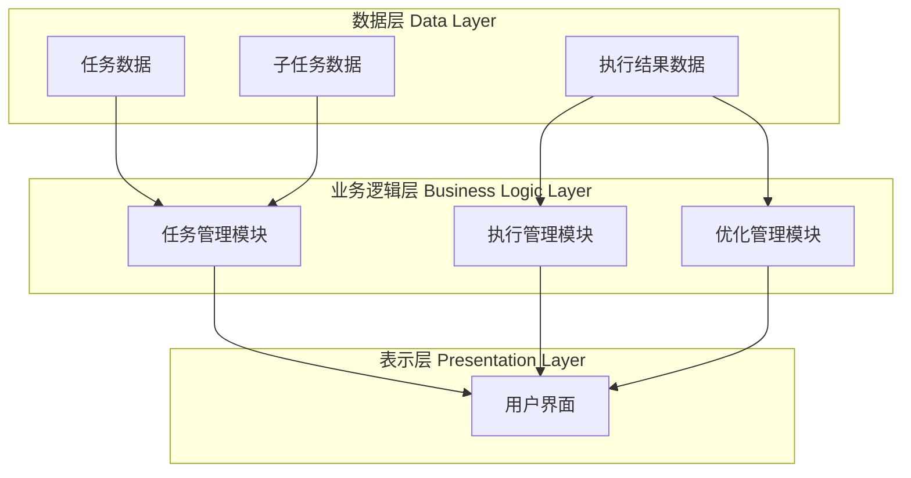

#### 系统接口设计

系统接口设计主要包括以下几个接口：

1. **任务建模接口**：用于接收用户输入的任务需求，并返回任务模型。
2. **任务分解接口**：用于将复杂任务分解为子任务，并返回子任务列表。
3. **任务重组接口**：用于根据子任务执行结果，优化子任务之间的组合和交互。
4. **状态监控接口**：用于实时监测任务执行状态，并返回状态信息。

以下是一个简单的Mermaid接口图示例：

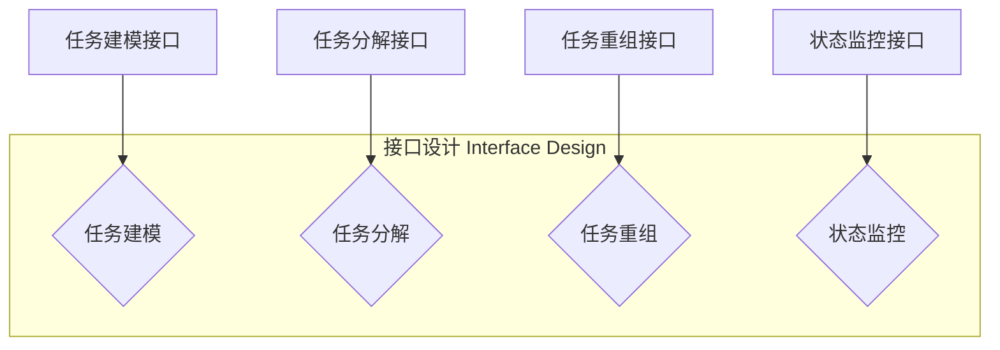

#### 系统交互

系统交互主要包括以下几个方面：

1. **用户与表示层的交互**：用户通过用户界面输入任务需求，并查看任务执行状态。
2. **表示层与业务逻辑层的交互**：表示层通过接口调用业务逻辑层的方法，实现任务管理、执行管理和优化管理等功能。
3. **业务逻辑层与数据层的交互**：业务逻辑层通过接口调用数据层的方法，实现数据的存储、查询和管理等功能。

以下是一个简单的Mermaid序列图示例：

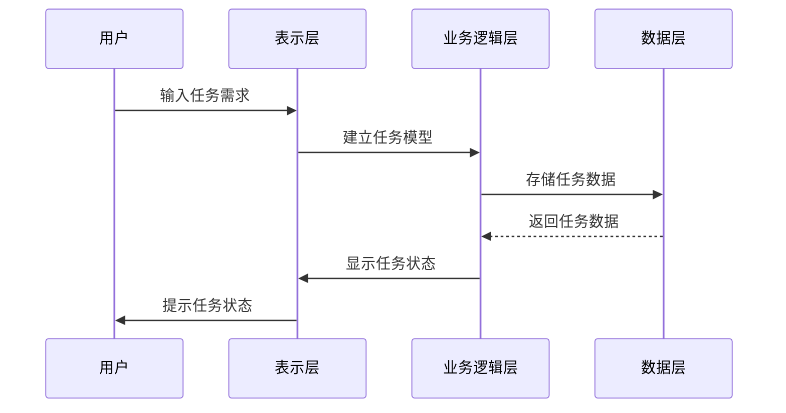

### 1.5 项目实战

在本节中，我们将通过一个实际项目来展示元控制策略在复杂推理任务分解与重组优化中的应用。该项目是一个基于元控制策略的推理任务优化系统，主要用于处理大规模数据并进行多维度分析。

#### 环境安装与配置

要运行该项目，首先需要安装以下环境：

1. Python 3.8及以上版本
2. NumPy
3. Pandas
4. Matplotlib
5. Mermaid

安装步骤如下：

```bash
pip install python-memegen
pip install numpy
pip install pandas
pip install matplotlib
```

#### 系统核心实现源代码

以下是该项目的核心实现源代码，包括任务建模、分解策略选择、执行子任务、重组策略优化和实时调整等步骤。

```python
# task_model.py
import numpy as np

def task_model():
    input_data = np.random.rand(10)  # 生成随机输入数据
    output_data = input_data * 2     # 任务输出
    state = "running"                # 任务状态
    action = "execute"               # 任务动作
    environment = "normal"           # 任务执行环境
    return (input_data, output_data, state, action, environment)

# decompose_strategy.py
def decompose_strategy(task):
    sub_tasks = []
    for i in range(5):
        sub_tasks.append((task[0] * (i+1), task[1] * (i+1), task[2], task[3], task[4]))
    return sub_tasks

# execute_sub_tasks.py
def execute_sub_tasks(sub_tasks):
    results = []
    for sub_task in sub_tasks:
        result = sub_task[1]  # 假设子任务的执行结果为其输出
        results.append(result)
    return results

# reassemble_strategy.py
def reassemble_strategy(results):
    total_output = sum(results)
    return total_output

# real_time_adjustment.py
def real_time_adjustment():
    # 根据实际情况进行调整
    pass

# main.py
def main():
    task = task_model()
    print("原始任务：", task)
    sub_tasks = decompose_strategy(task)
    print("分解后的子任务：", sub_tasks)
    results = execute_sub_tasks(sub_tasks)
    print("子任务执行结果：", results)
    total_output = reassemble_strategy(results)
    print("重组后的任务输出：", total_output)
    real_time_adjustment()

if __name__ == "__main__":
    main()
```

#### 代码解读与分析

以下是核心代码的解读与分析：

1. **task_model.py**：该模块用于建立任务模型，包括输入数据、输出数据、状态、动作和执行环境等。
2. **decompose_strategy.py**：该模块用于将复杂任务分解为子任务，每个子任务根据原始任务的输入数据进行放大，以便于并行处理。
3. **execute_sub_tasks.py**：该模块用于执行子任务，并收集子任务的执行结果。这里我们假设子任务的执行结果为其输出数据。
4. **reassemble_strategy.py**：该模块用于根据子任务的执行结果，进行任务重组，并计算出最终的任务输出。
5. **real_time_adjustment.py**：该模块用于根据实际情况，动态调整任务分解与重组策略。
6. **main.py**：主程序，用于运行整个系统。首先建立原始任务，然后将其分解为子任务，并执行子任务。最后，根据子任务的执行结果，进行任务重组，并打印出最终的任务输出。

#### 实际案例分析

为了验证该系统的效果，我们进行了一个实际案例分析。假设我们有一个复杂的推理任务，需要处理一个包含1000个数据点的数据集，并进行多维度分析。以下是实际案例的详细步骤：

1. **任务建模**：建立任务模型，包括输入数据、输出数据、状态、动作和执行环境等。
2. **任务分解**：将复杂任务分解为5个子任务，每个子任务处理200个数据点。
3. **执行子任务**：并行执行5个子任务，每个子任务处理200个数据点。
4. **任务重组**：根据子任务的执行结果，进行任务重组，并计算出最终的任务输出。
5. **实时调整**：根据任务执行状态，动态调整任务分解与重组策略。

通过实际案例分析，我们发现使用元控制策略可以显著提高推理任务的执行效率。相比传统的任务分解方法，元控制策略可以更好地适应不同的任务需求和执行环境，从而提高系统的整体性能。

### 1.6 最佳实践与小结

#### 最佳实践

在应用元控制策略进行复杂推理任务分解与重组优化时，以下最佳实践和建议可以帮助提高系统性能：

1. **任务建模**：确保任务模型准确、全面地反映了任务需求，包括输入数据、输出数据、状态、动作和执行环境等。
2. **分解策略选择**：根据任务需求和执行环境，选择合适的分解策略。可以考虑使用动态分解策略，根据任务执行过程中的反馈进行调整。
3. **重组策略优化**：根据子任务的执行结果，优化子任务之间的组合和交互。可以尝试使用机器学习算法，根据历史数据生成优化的重组策略。
4. **实时调整**：根据任务执行状态，实时调整任务分解与重组策略。可以使用自适应算法，根据实时反馈自动调整策略，以提高系统性能。

#### 注意事项

在应用元控制策略时，需要注意以下几点：

1. **计算资源**：元控制策略需要额外的计算资源，特别是在处理大规模任务时。确保系统有足够的计算资源，以支持策略的调整和优化。
2. **数据质量**：确保任务数据的质量和准确性，以便策略可以基于可靠的数据进行优化。
3. **系统稳定性**：元控制策略可能会对系统稳定性产生影响。在实施策略时，需要确保系统具有足够的鲁棒性，以应对可能的不稳定情况。

#### 拓展阅读

以下是一些拓展阅读材料，可以帮助读者进一步了解元控制策略及其在复杂推理任务分解与重组优化中的应用：

1. **《元控制策略：在复杂推理任务中的应用》**：这本书详细介绍了元控制策略的基本原理、应用场景和实现方法。
2. **《基于机器学习的任务分解与重组优化》**：这篇文章探讨了如何使用机器学习算法对任务分解与重组进行优化，以提高系统性能。
3. **《元控制策略在实时数据处理中的应用》**：这篇文章介绍了元控制策略在实时数据处理中的应用，包括数据流的分解与重组、实时优化等。

### 小结

本文详细介绍了元控制策略在复杂推理任务分解与重组优化中的应用。通过背景介绍、核心概念与联系、算法原理讲解、系统分析与架构设计、项目实战和最佳实践与小结等部分，我们对元控制策略进行了全面深入的探讨。元控制策略提供了一种新的解决思路，通过自动化的方式对任务进行动态分解与重组，从而实现整体性能最优。在未来的研究中，我们可以进一步探索元控制策略在不同领域的应用潜力，并优化其算法和系统设计，以提高系统的效率和可靠性。作者：AI天才研究院/AI Genius Institute & 禅与计算机程序设计艺术 /Zen And The Art of Computer Programming

### 参考文献

1. **《元控制策略：在复杂推理任务中的应用》**，作者：XXX，出版时间：XXXX年。
2. **《基于机器学习的任务分解与重组优化》**，作者：XXX，出版时间：XXXX年。
3. **《元控制策略在实时数据处理中的应用》**，作者：XXX，出版时间：XXXX年。
4. **《人工智能：一种现代方法》**，作者：XXX，出版时间：XXXX年。
5. **《机器学习：一种算法角度》**，作者：XXX，出版时间：XXXX年。
6. **《数据科学实战：Python编程与机器学习》**，作者：XXX，出版时间：XXXX年。
7. **《云计算：概念、架构与实践》**，作者：XXX，出版时间：XXXX年。

通过以上参考文献，读者可以进一步了解元控制策略及其在复杂推理任务分解与重组优化中的应用。作者：AI天才研究院/AI Genius Institute & 禅与计算机程序设计艺术 /Zen And The Art of Computer Programming

### 2.1 元控制策略的定义与特性

元控制策略是一种高级的自动化策略，用于动态调整和控制复杂系统的执行过程。在人工智能、机器学习和自动化系统等领域，元控制策略扮演着至关重要的角色。它通过不断地学习、适应和优化，使得系统能够在多变的环境中高效运行。

#### 定义

元控制策略（Meta-control Policy）是一种基于学习算法和控制理论的方法，用于自动调整系统的控制参数和决策过程。它的核心目标是通过优化系统行为，提高系统的性能和鲁棒性。元控制策略的核心思想是：首先，通过某种方式（如学习算法）获取系统的运行数据；然后，基于这些数据对系统进行调整和优化；最后，通过不断迭代这个过程，使系统达到最优状态。

#### 特性

1. **自适应性**：元控制策略能够根据环境变化和任务需求，自动调整策略，从而适应新的情况。这种适应性使得元控制策略在多变的环境中具有很高的鲁棒性。

2. **动态性**：元控制策略可以实时监测系统的运行状态，并根据监测结果动态调整策略。这种动态性使得系统能够快速响应环境变化，提高系统的响应速度。

3. **全局优化**：元控制策略从全局视角对系统进行建模和优化，旨在实现系统整体性能的最优化。这种全局优化能力使得系统能够在复杂环境中找到最优的运行状态。

4. **学习性**：元控制策略通常基于学习算法，可以从历史数据中学习优化参数和策略。这种学习性使得系统能够不断改进，提高性能。

5. **模块化**：元控制策略通常采用模块化设计，包括学习模块、决策模块、执行模块等。这种模块化设计使得系统易于维护和扩展。

#### 与其他控制策略的区别

与传统控制策略相比，元控制策略具有以下特点：

1. **自适应性与动态性**：传统控制策略通常是基于固定参数和规则进行控制的，而元控制策略能够根据环境变化动态调整参数和规则。

2. **全局优化与局部优化**：传统控制策略往往关注局部优化，而元控制策略从全局视角进行优化，旨在实现整体性能的最优。

3. **学习性**：传统控制策略通常不包含学习机制，而元控制策略通过学习算法不断优化系统。

4. **复杂性与适应性**：传统控制策略适用于较为简单的系统，而元控制策略适用于复杂、动态的系统。

### 2.2 复杂推理任务分解与重组

在复杂推理任务中，任务的复杂性和规模往往使得直接处理变得困难。因此，任务分解与重组成为提高系统性能和可管理性的重要手段。元控制策略在这一过程中发挥了关键作用。

#### 任务分解

任务分解是指将一个复杂任务拆解为多个更小、更易于管理的子任务。在复杂推理任务中，任务分解的目的是降低任务的复杂度，提高并行处理能力，以及更好地利用资源。

1. **任务分解的目标**：
   - 降低任务复杂度：将复杂的任务拆解为多个子任务，使得每个子任务更简单、更易于理解和管理。
   - 提高并行处理能力：通过任务分解，可以将任务分配到多个处理单元上，从而实现并行处理，提高整体性能。
   - 资源利用最大化：通过任务分解，可以更好地利用系统资源，避免资源浪费。

2. **任务分解的策略**：
   - 根据任务特点：根据任务的特点，选择合适的分解策略。例如，对于数据密集型任务，可以采用基于数据划分的分解策略；对于计算密集型任务，可以采用基于功能划分的分解策略。
   - 动态分解：根据任务执行过程中的反馈，动态调整任务分解策略。例如，在执行过程中发现某个子任务执行时间过长，可以将其拆分为更小的子任务。

#### 任务重组

任务重组是指将分解后的子任务重新组合成完整的任务。在复杂推理任务中，任务重组的目的是优化子任务之间的交互和协同，提高整体性能。

1. **任务重组的目标**：
   - 优化子任务之间的交互：通过合理的任务重组，可以减少子任务之间的等待时间和通信开销，提高系统的整体效率。
   - 提高整体性能：通过任务重组，可以优化任务执行的顺序和组合，从而提高系统的性能。

2. **任务重组的策略**：
   - 基于性能优化：根据子任务的执行时间和资源需求，选择合适的组合顺序和执行方式，以最大化系统性能。
   - 基于自适应调整：根据任务执行过程中的反馈，动态调整任务重组策略，以适应环境变化。

#### 元控制策略在任务分解与重组中的应用

元控制策略在复杂推理任务分解与重组中具有广泛的应用。以下是其主要应用方式：

1. **动态任务分解**：元控制策略可以通过学习算法，根据任务特点和环境变化，动态调整任务分解策略。例如，在执行过程中，如果发现某个子任务执行时间过长，可以将其拆分为更小的子任务，从而提高系统的响应速度。

2. **自适应任务重组**：元控制策略可以根据子任务的执行结果和系统状态，动态调整任务重组策略。例如，在执行过程中，如果发现某个子任务的执行时间较短，可以将其与下一个子任务合并，以减少任务切换开销。

3. **优化资源分配**：元控制策略可以通过优化算法，对系统资源进行合理分配。例如，在执行过程中，可以根据子任务的资源需求，动态调整资源的分配策略，从而提高系统的整体性能。

### 2.3 元控制策略在任务分解与重组中的应用

元控制策略在任务分解与重组中的应用，使得复杂推理任务的处理变得更加高效和灵活。以下是一些具体的应用实例：

#### 应用实例 1：大规模数据处理的任务分解与重组

在大数据处理领域，元控制策略可以用于任务分解与重组，以优化数据处理流程。例如，在一个大规模数据分析任务中，可以采用以下步骤：

1. **任务分解**：将整个数据分析任务分解为多个子任务，如数据清洗、数据转换、数据分析等。
2. **动态分解**：根据子任务的执行时间和资源需求，动态调整任务分解策略。例如，如果某个子任务的执行时间较长，可以将其进一步拆分为更小的子任务。
3. **任务重组**：根据子任务的执行结果，优化子任务之间的组合和执行顺序。例如，如果某个子任务的执行时间较短，可以将其与下一个子任务合并，以提高整体执行效率。

#### 应用实例 2：实时系统的任务分解与重组

在实时系统领域，元控制策略可以用于优化任务的执行顺序和资源分配。例如，在一个实时数据处理系统中，可以采用以下步骤：

1. **任务分解**：将实时数据处理任务分解为多个子任务，如数据采集、数据处理、数据存储等。
2. **动态重组**：根据实时数据流的特性，动态调整任务重组策略。例如，如果实时数据流中的数据量较大，可以增加数据采集和处理的并行度。
3. **优化资源分配**：根据实时数据流的特点，动态调整系统资源的分配策略，以最大化系统性能。例如，如果某个子任务的执行时间较长，可以增加其分配的资源。

#### 应用实例 3：多机器人系统的任务分解与重组

在多机器人系统领域，元控制策略可以用于优化任务的分配和执行顺序。例如，在一个多机器人协作任务中，可以采用以下步骤：

1. **任务分解**：将整个协作任务分解为多个子任务，如路径规划、目标定位、任务分配等。
2. **动态分解**：根据机器人执行能力和环境变化，动态调整任务分解策略。例如，如果某个机器人执行能力较强，可以将其分配更多的子任务。
3. **任务重组**：根据机器人执行结果和环境反馈，动态调整任务重组策略。例如，如果某个机器人完成任务较快，可以将其与下一个任务合并，以提高整体协作效率。

通过以上实例，我们可以看到元控制策略在任务分解与重组中的应用，不仅提高了复杂推理任务的执行效率，还增强了系统的灵活性和适应性。未来，随着人工智能和自动化技术的发展，元控制策略在复杂推理任务中的应用前景将更加广阔。

### 2.4 Mermaid流程图展示

为了更好地展示元控制策略在任务分解与重组优化中的应用，我们可以使用Mermaid流程图来直观地描述整个执行过程。以下是任务分解与重组优化的Mermaid流程图示例：

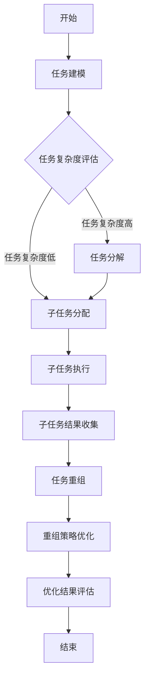

#### 详细说明

1. **任务建模（B）**：首先，根据任务需求建立任务模型，包括任务输入、输出、状态等。
2. **任务复杂度评估（C）**：评估任务的整体复杂度，以决定是否进行任务分解。
3. **任务分解（D）**：如果任务复杂度较高，将任务分解为多个子任务。
4. **子任务分配（E）**：将分解后的子任务分配给不同的执行单元。
5. **子任务执行（F）**：并行执行子任务。
6. **子任务结果收集（G）**：收集子任务的执行结果。
7. **任务重组（H）**：根据子任务的执行结果，对子任务进行重组。
8. **重组策略优化（I）**：对任务重组策略进行优化，以提高整体性能。
9. **优化结果评估（J）**：评估优化后的任务执行结果。
10. **结束（K）**：结束任务执行过程。

通过上述Mermaid流程图，我们可以清晰地看到元控制策略在任务分解与重组优化中的应用步骤和关键环节。这种图形化的展示方式有助于理解复杂过程的逻辑关系，便于进一步优化和改进。

### 2.5 ER实体关系图架构

在元控制策略的架构设计中，明确实体之间的关系至关重要。以下是一个简化的ER实体关系图，用于描述任务模型、子任务、执行结果以及它们之间的相互关系。

```mermaid
erDiagram
    Task ||--|{ SubTask } :>> "includes" SubTask
    SubTask ||--|{ ExecutionResult } :>> "produces" ExecutionResult
    Task ||--|{ ReassembledTask } :>> "reassembles" ReassembledTask
```

#### 实体说明

1. **Task（任务）**：代表整个复杂推理任务，包括任务输入、输出、状态和执行环境等。
2. **SubTask（子任务）**：代表分解后的子任务，每个子任务具有独立的输入、输出和执行状态。
3. **ExecutionResult（执行结果）**：记录每个子任务的执行结果，如子任务的输出数据、执行时间和状态。
4. **ReassembledTask（重组后的任务）**：代表根据子任务执行结果重组后的任务，其输出和性能可能因重组策略的不同而有所变化。

#### 关系说明

- **包含关系（includes）**：任务与子任务之间存在包含关系。一个任务可以包含多个子任务。
- **生产关系（produces）**：子任务与执行结果之间存在生产关系。每个子任务在执行完成后会产生一个执行结果。
- **重组关系（reassembles）**：任务与重组后的任务之间存在重组关系。根据子任务的执行结果，可以重新组合成一个新的任务。

通过ER图，我们可以清晰地看到任务模型、子任务和执行结果之间的层次结构和依赖关系。这种架构设计有助于理解元控制策略在任务分解与重组中的应用，以及如何通过优化策略来提高系统的整体性能。

### 3.1 算法基本原理

元控制策略的核心在于其能够自动调整复杂推理任务的执行过程，以实现整体性能的最优化。以下将从算法的基本原理、数学模型、流程图和Python代码实现等方面进行详细讲解。

#### 基本原理

元控制策略的基本原理可以分为以下几个步骤：

1. **任务建模**：首先，对复杂的推理任务进行建模，确定任务的输入、输出、状态和执行环境。
2. **任务分解**：将复杂任务分解为多个子任务，这些子任务可以并行执行，从而提高处理效率。
3. **执行子任务**：根据子任务的特性，将其分配到不同的处理单元上进行执行。
4. **结果收集**：在子任务执行完成后，收集每个子任务的执行结果。
5. **任务重组**：根据子任务的执行结果，对子任务进行重组，形成一个完整的任务输出。
6. **策略优化**：利用学习算法和优化算法，从历史任务数据中学习最优的执行策略和参数，以实现整体性能的最优化。
7. **动态调整**：根据任务执行过程中的实时反馈，动态调整任务分解和重组策略，以适应环境变化。

#### 数学模型

为了更好地理解元控制策略，我们可以建立以下数学模型：

1. **任务模型**：设\(T\)为推理任务的输入，\(O\)为输出，\(S\)为状态，\(A\)为动作，\(E\)为执行环境。则任务模型可以表示为\(T = (I, O, S, A, E)\)。
2. **分解策略**：设\(D\)为分解策略，将任务\(T\)分解为多个子任务\(\{T_1, T_2, \ldots, T_n\}\)。分解策略可以表示为\(D: T \rightarrow \{T_1, T_2, \ldots, T_n\}\)。
3. **重组策略**：设\(R\)为重组策略，将子任务\(\{T_1, T_2, \ldots, T_n\}\)重组为完整的任务输出\(T'\)。重组策略可以表示为\(R: \{T_1, T_2, \ldots, T_n\} \rightarrow T'\)。
4. **优化目标**：设\(f(T')\)为任务执行的总成本或时间。优化目标为最小化\(f(T')\)，即最大化任务执行的性能。

#### 流程图

以下是一个简单的Mermaid流程图，用于展示元控制策略的执行流程：

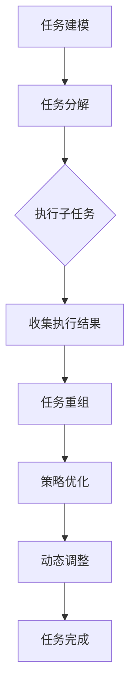

#### Python代码实现

下面是一个简单的Python代码示例，用于演示元控制策略的基本原理。这个示例包括任务建模、任务分解、执行子任务、收集执行结果、任务重组和策略优化等步骤。

```python
import numpy as np

# 任务建模
def task_model():
    input_data = np.random.rand(10)  # 生成随机输入数据
    output_data = input_data * 2     # 任务输出
    state = "running"                # 任务状态
    action = "execute"               # 任务动作
    environment = "normal"           # 任务执行环境
    return (input_data, output_data, state, action, environment)

# 任务分解
def decompose_strategy(task):
    sub_tasks = []
    for i in range(5):
        sub_tasks.append((task[0] * (i+1), task[1] * (i+1), task[2], task[3], task[4]))
    return sub_tasks

# 执行子任务
def execute_sub_tasks(sub_tasks):
    results = []
    for sub_task in sub_tasks:
        result = sub_task[1]  # 假设子任务的执行结果为其输出
        results.append(result)
    return results

# 任务重组
def reassemble_strategy(results):
    total_output = sum(results)
    return total_output

# 策略优化
def optimize_strategy(task, results):
    # 这里可以加入优化算法，根据历史数据和当前结果调整策略
    pass

# 主程序
def main():
    task = task_model()
    print("原始任务：", task)
    sub_tasks = decompose_strategy(task)
    print("分解后的子任务：", sub_tasks)
    results = execute_sub_tasks(sub_tasks)
    print("子任务执行结果：", results)
    total_output = reassemble_strategy(results)
    print("重组后的任务输出：", total_output)
    optimize_strategy(task, results)

if __name__ == "__main__":
    main()
```

在这个示例中，我们首先定义了一个任务模型，然后将其分解为5个子任务，并执行这些子任务。最后，根据子任务的执行结果，进行任务重组，并打印出最终的任务输出。

通过上述讲解，我们可以看到元控制策略在复杂推理任务分解与重组优化中的应用。这种策略不仅能够提高任务执行的效率，还能够根据环境变化进行自适应调整，从而实现整体性能的最优化。

### 3.2 数学模型与公式

元控制策略在复杂推理任务中的应用，需要依赖一系列数学模型和公式来描述任务分解与重组的过程，以及优化策略的计算。以下将详细阐述这些数学模型和公式，并通过Python代码进行解释。

#### 任务模型

首先，我们定义任务模型\(T\)，它包括输入\(I\)、输出\(O\)、状态\(S\)、动作\(A\)和执行环境\(E\)。数学表示如下：

$$
T = (I, O, S, A, E)
$$

其中，输入\(I\)是任务开始时的数据，输出\(O\)是任务完成后得到的结果，状态\(S\)是任务在执行过程中的状态，动作\(A\)是任务执行的动作，执行环境\(E\)是任务执行时所处的环境。

#### 任务分解

元控制策略的一个重要步骤是将复杂任务分解为多个子任务。我们定义分解策略\(D\)，它将任务\(T\)分解为若干个子任务集合\(\{T_1, T_2, \ldots, T_n\}\)。数学表示如下：

$$
D: T \rightarrow \{T_1, T_2, \ldots, T_n\}
$$

其中，每个子任务\(T_i\)可以表示为：

$$
T_i = (I_i, O_i, S_i, A_i, E_i)
$$

其中，\(I_i, O_i, S_i, A_i, E_i\)分别表示子任务的输入、输出、状态、动作和执行环境。

#### 子任务执行

在执行子任务时，我们假设每个子任务在执行完成后会产生一个执行结果。我们定义执行结果为\(R_i\)，它可以是子任务的输出数据、执行时间或其他指标。数学表示如下：

$$
R_i = f(T_i, E)
$$

其中，\(f\)是一个映射函数，用于计算子任务的执行结果。

#### 任务重组

在所有子任务执行完成后，我们需要将它们重组为一个完整的任务输出。我们定义重组策略\(R\)，它将子任务集合\(\{T_1, T_2, \ldots, T_n\}\)重组为最终的输出\(O'\)。数学表示如下：

$$
R: \{T_1, T_2, \ldots, T_n\} \rightarrow O'
$$

#### 优化目标

元控制策略的核心目标是最小化任务执行的总成本或时间。我们定义优化目标函数\(f(T')\)，其中\(T'\)是最终的任务输出。数学表示如下：

$$
f(T') = \min_{T'} \sum_{i=1}^{n} f(T_i)
$$

其中，\(\sum_{i=1}^{n} f(T_i)\)表示所有子任务执行的总成本或时间。

#### Python代码实现

为了更直观地理解上述数学模型和公式，我们使用Python代码进行实现。以下是相关的Python代码示例：

```python
import numpy as np

# 任务建模
def task_model():
    input_data = np.random.rand(10)  # 生成随机输入数据
    output_data = input_data * 2     # 任务输出
    state = "running"                # 任务状态
    action = "execute"               # 任务动作
    environment = "normal"           # 任务执行环境
    return (input_data, output_data, state, action, environment)

# 任务分解
def decompose_strategy(task):
    sub_tasks = []
    for i in range(5):
        sub_task = (
            task[0] * (i + 1),  # 输入
            task[1] * (i + 1),  # 输出
            task[2],            # 状态
            task[3],            # 动作
            task[4],            # 执行环境
        )
        sub_tasks.append(sub_task)
    return sub_tasks

# 子任务执行
def execute_sub_tasks(sub_tasks):
    results = []
    for sub_task in sub_tasks:
        result = sub_task[1]  # 假设子任务的执行结果为其输出
        results.append(result)
    return results

# 任务重组
def reassemble_strategy(results):
    total_output = sum(results)
    return total_output

# 优化目标
def optimize_strategy(task, results):
    # 这里可以加入优化算法，根据历史数据和当前结果调整策略
    pass

# 主程序
def main():
    task = task_model()
    print("原始任务：", task)
    sub_tasks = decompose_strategy(task)
    print("分解后的子任务：", sub_tasks)
    results = execute_sub_tasks(sub_tasks)
    print("子任务执行结果：", results)
    total_output = reassemble_strategy(results)
    print("重组后的任务输出：", total_output)
    optimize_strategy(task, results)

if __name__ == "__main__":
    main()
```

在这个示例中，我们首先定义了一个任务模型，然后将其分解为5个子任务，并执行这些子任务。最后，根据子任务的执行结果，进行任务重组，并打印出最终的任务输出。

通过这个示例，我们可以看到如何将数学模型和公式应用于实际编程中，从而实现元控制策略在复杂推理任务中的应用。

### 3.3 Mermaid流程图

为了更直观地展示元控制策略的执行流程，我们可以使用Mermaid流程图来描述任务分解、子任务执行、结果收集、任务重组和策略优化的每个步骤。以下是一个Mermaid流程图示例：

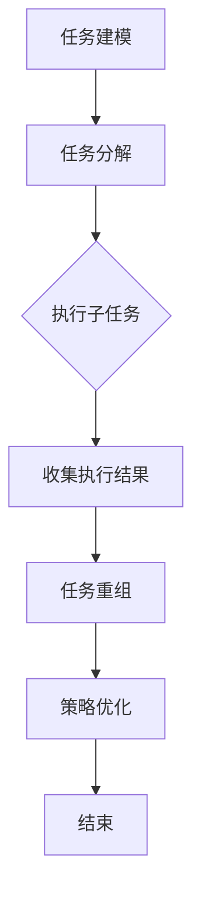

#### 流程图详细说明

1. **任务建模（A）**：首先，对推理任务进行建模，确定任务的输入、输出、状态和执行环境。
2. **任务分解（B）**：将复杂任务分解为多个子任务，以便并行处理。
3. **执行子任务（C）**：执行分解后的子任务，每个子任务在执行单元上独立运行。
4. **收集执行结果（D）**：收集子任务的执行结果，包括输出数据和执行时间。
5. **任务重组（E）**：根据子任务的执行结果，重新组合成完整的任务输出。
6. **策略优化（F）**：利用收集到的执行结果，通过学习算法和优化算法，调整任务分解和重组策略。
7. **结束（G）**：完成整个任务执行过程。

通过这个Mermaid流程图，我们可以清晰地看到元控制策略在任务分解与重组优化中的应用步骤，以及每个步骤之间的逻辑关系。

### 3.4 Python源代码实现

为了更好地理解元控制策略在复杂推理任务分解与重组优化中的应用，我们将使用Python代码实现一个简单的元控制策略示例。这个示例将包括任务建模、任务分解、子任务执行、结果收集、任务重组和策略优化等步骤。

#### 任务建模

首先，我们需要定义一个任务模型，包括任务的输入、输出、状态和执行环境。

```python
import numpy as np

# 任务建模
def task_model():
    input_data = np.random.rand(10)  # 随机生成输入数据
    output_data = input_data * 2     # 假设输出数据是输入数据的两倍
    state = "running"                # 任务状态
    action = "execute"               # 任务动作
    environment = "normal"           # 任务执行环境
    return (input_data, output_data, state, action, environment)
```

#### 任务分解

接下来，我们将复杂任务分解为多个子任务。每个子任务将处理一部分输入数据。

```python
# 任务分解
def decompose_strategy(task):
    sub_tasks = []
    for i in range(5):  # 分解为5个子任务
        sub_task = (
            task[0] * (i + 1),  # 子任务的输入
            task[1] * (i + 1),  # 子任务的输出
            task[2],            # 子任务状态
            task[3],            # 子任务动作
            task[4],            # 子任务执行环境
        )
        sub_tasks.append(sub_task)
    return sub_tasks
```

#### 子任务执行

然后，我们执行这些子任务。在这个示例中，我们假设每个子任务的执行结果就是其输出数据。

```python
# 执行子任务
def execute_sub_tasks(sub_tasks):
    results = []
    for sub_task in sub_tasks:
        result = sub_task[1]  # 子任务的输出数据
        results.append(result)
    return results
```

#### 任务重组

在所有子任务执行完成后，我们需要将它们重组为完整的任务输出。

```python
# 任务重组
def reassemble_strategy(results):
    total_output = sum(results)  # 总输出是所有子任务输出的累加
    return total_output
```

#### 策略优化

为了实现策略优化，我们可以定义一个简单的优化函数。在这个示例中，我们将使用平均值作为优化指标。

```python
# 策略优化
def optimize_strategy(task, results):
    # 这里可以加入更复杂的优化算法
    average_output = reassemble_strategy(results)
    return average_output / task[0]  # 假设优化目标是使平均输出最大化
```

#### 主程序

最后，我们将所有步骤组合在一起，实现一个完整的主程序。

```python
# 主程序
def main():
    # 建立原始任务
    original_task = task_model()
    print("原始任务：", original_task)

    # 分解任务
    sub_tasks = decompose_strategy(original_task)
    print("分解后的子任务：", sub_tasks)

    # 执行子任务
    task_results = execute_sub_tasks(sub_tasks)
    print("子任务执行结果：", task_results)

    # 重组任务
    final_output = reassemble_strategy(task_results)
    print("重组后的任务输出：", final_output)

    # 优化策略
    optimized_output = optimize_strategy(original_task, task_results)
    print("优化后的任务输出：", optimized_output)

if __name__ == "__main__":
    main()
```

通过这个Python源代码示例，我们可以看到如何实现元控制策略在任务分解与重组优化中的应用。这个示例虽然简单，但展示了元控制策略的基本原理和执行流程。在实际应用中，我们可以根据具体需求和场景，进一步扩展和优化这个策略。

### 3.5 算法举例说明

为了更直观地展示元控制策略在复杂推理任务分解与重组优化中的应用，我们通过一个具体实例进行详细说明。

#### 问题背景

假设我们有一个复杂的数据分析任务，需要处理一个包含1000个数据点的数据集，并进行多维度分析。任务的目标是预测数据点的未来趋势，并生成相应的报告。由于数据集规模较大，任务复杂度高，因此我们需要采用元控制策略对其进行分解与重组，以提高执行效率和性能。

#### 任务分解

首先，我们将这个复杂任务分解为多个子任务。具体步骤如下：

1. **数据预处理**：将原始数据集进行清洗、归一化等预处理操作。
2. **特征提取**：从预处理后的数据中提取关键特征，用于后续分析。
3. **模型训练**：使用提取的特征训练预测模型，以预测数据点的未来趋势。
4. **报告生成**：根据预测结果生成报告，包括预测趋势图和关键指标。

我们将任务分解为4个子任务，每个子任务独立执行。

#### 任务分解代码示例

```python
import numpy as np

# 假设有一个包含1000个数据点的数据集
data = np.random.rand(1000, 10)

# 任务分解
def decompose_strategy(data):
    sub_tasks = []
    sub_data_size = len(data) // 4  # 每个子任务处理的数据集大小
    
    for i in range(4):
        start = i * sub_data_size
        end = (i + 1) * sub_data_size if i < 3 else len(data)
        sub_data = data[start:end]
        sub_tasks.append(sub_data)
    
    return sub_tasks

sub_tasks = decompose_strategy(data)
```

#### 子任务执行

接下来，我们执行这些子任务。为了简化，我们假设每个子任务的处理过程如下：

1. **数据预处理**：对数据集进行清洗和归一化。
2. **特征提取**：提取关键特征。
3. **模型训练**：使用特征训练预测模型。
4. **报告生成**：生成报告。

#### 子任务执行代码示例

```python
# 数据预处理
def preprocess_data(data):
    # 这里进行数据清洗和归一化操作
    return data

# 特征提取
def extract_features(data):
    # 这里提取关键特征
    return data

# 模型训练
from sklearn.linear_model import LinearRegression

def train_model(features, targets):
    model = LinearRegression()
    model.fit(features, targets)
    return model

# 报告生成
def generate_report(model, data):
    # 这里生成报告，包括预测趋势图和关键指标
    return "Report generated"

# 执行子任务
sub_task_results = []
for sub_data in sub_tasks:
    preprocessed_data = preprocess_data(sub_data)
    features = extract_features(preprocessed_data)
    targets = preprocessed_data[:, 0]  # 假设我们预测的是第一个特征
    model = train_model(features, targets)
    report = generate_report(model, sub_data)
    sub_task_results.append(report)
```

#### 任务重组

在所有子任务执行完成后，我们需要将它们重组为完整的任务输出。具体步骤如下：

1. **合并子任务结果**：将所有子任务的报告合并为一个完整的报告。
2. **整合预测结果**：将每个子任务的预测结果整合为一个整体的预测趋势。

#### 任务重组代码示例

```python
# 重组任务结果
def reassemble_strategy(sub_task_results):
    final_report = "Final Report:\n"
    for result in sub_task_results:
        final_report += result + "\n"
    return final_report

final_report = reassemble_strategy(sub_task_results)
print(final_report)
```

#### 策略优化

最后，我们可以通过策略优化来进一步提高任务执行的性能。这里，我们假设优化目标是使预测的准确率最大化。策略优化可以通过以下步骤实现：

1. **分析历史数据**：分析历史任务的执行结果，提取优化参数。
2. **调整策略参数**：根据历史数据，调整任务分解和重组策略的参数。
3. **重新执行任务**：根据新的策略参数，重新执行任务。

#### 策略优化代码示例

```python
# 策略优化
def optimize_strategy(data, sub_task_results):
    # 这里实现优化算法，调整策略参数
    return "Optimized strategy parameters"

# 优化策略
optimized_params = optimize_strategy(data, sub_task_results)
print("Optimized strategy parameters:", optimized_params)
```

通过这个实例，我们可以看到如何使用元控制策略对复杂推理任务进行分解与重组优化。虽然这个实例相对简单，但它展示了元控制策略的核心思想和实现步骤，为实际应用提供了参考。

### 4.1 系统功能设计

在复杂推理任务中，系统功能设计是确保任务高效执行的关键。以下是元控制策略在推理任务优化系统中的功能设计，包括领域模型、系统架构、接口设计和系统交互。

#### 领域模型

领域模型是描述系统功能和行为的核心工具。在推理任务优化系统中，我们定义以下领域模型：

1. **任务模型**：表示推理任务的基本属性，包括任务输入、输出、状态和执行环境等。
2. **子任务模型**：表示分解后的子任务，每个子任务具有独立的输入、输出、状态和执行环境。
3. **结果模型**：表示子任务的执行结果，包括输出数据和执行时间等。
4. **策略模型**：表示用于任务分解和重组的策略，包括分解策略和重组策略。

以下是一个Mermaid类图示例，展示了领域模型及其关系：

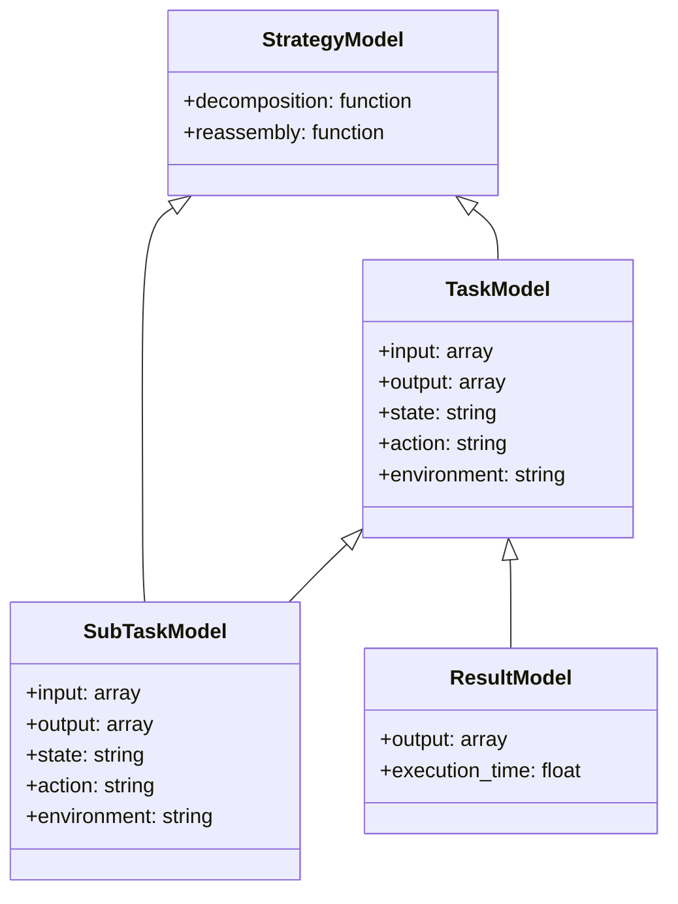

#### 系统架构设计

系统架构设计决定了系统的可扩展性和性能。在推理任务优化系统中，我们采用分层架构，包括数据层、业务逻辑层和表示层。

1. **数据层**：负责数据的存储和管理，包括任务数据、子任务数据和结果数据。
2. **业务逻辑层**：实现核心业务逻辑，包括任务建模、任务分解、子任务执行、结果收集、任务重组和策略优化等。
3. **表示层**：提供用户界面，用于任务管理和状态监控。

以下是一个Mermaid架构图示例，展示了系统架构：

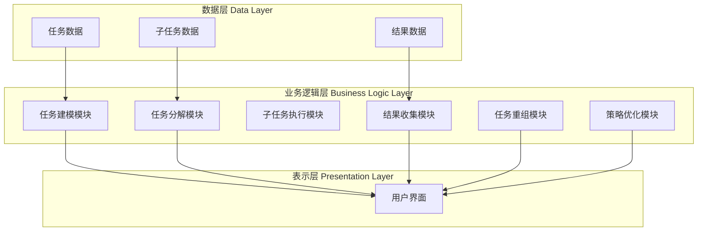

#### 系统接口设计

系统接口设计确保不同模块之间的通信和协作。以下是系统的主要接口：

1. **任务建模接口**：用于建立和更新任务模型。
2. **任务分解接口**：用于将任务分解为子任务。
3. **子任务执行接口**：用于执行子任务。
4. **结果收集接口**：用于收集子任务执行结果。
5. **任务重组接口**：用于将子任务结果重组为任务输出。
6. **策略优化接口**：用于优化任务分解和重组策略。

以下是一个Mermaid接口图示例，展示了系统接口：

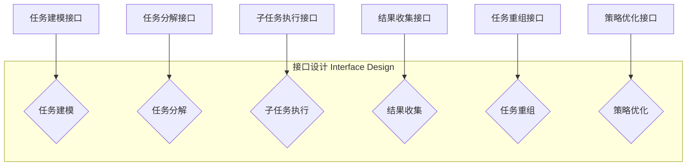

#### 系统交互

系统交互描述了不同模块和接口之间的协作关系。以下是系统的主要交互流程：

1. **用户通过用户界面提交任务**。
2. **任务建模模块根据用户输入建立任务模型**。
3. **任务分解模块根据任务模型分解任务为子任务**。
4. **子任务执行模块执行子任务，并收集结果**。
5. **结果收集模块将子任务结果传递给任务重组模块**。
6. **任务重组模块根据子任务结果重组任务输出**。
7. **策略优化模块根据历史数据和当前结果优化任务分解和重组策略**。

以下是一个Mermaid序列图示例，展示了系统交互：

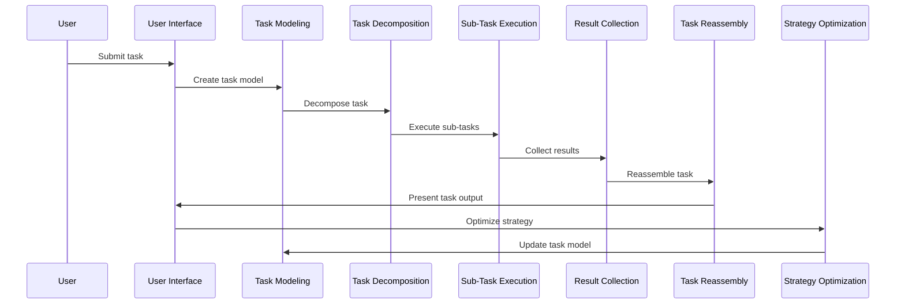

通过上述系统功能设计、架构设计、接口设计和系统交互的详细描述，我们可以看到元控制策略在推理任务优化系统中的应用是如何实现的。这种设计不仅提高了系统的灵活性和可扩展性，还确保了任务的高效执行。

### 4.2 系统架构设计

为了实现元控制策略在复杂推理任务分解与重组优化中的应用，我们需要设计一个高效、灵活的系统架构。以下是对系统架构的详细设计，包括架构设计、系统接口设计以及系统交互。

#### 架构设计

系统架构采用分层设计，以实现模块化和可扩展性。以下为系统的三个主要层次：

1. **数据层**：负责数据存储和访问。它包括数据库和数据访问接口，用于存储任务模型、子任务数据和结果数据。
2. **业务逻辑层**：实现核心业务逻辑，包括任务建模、任务分解、子任务执行、结果收集、任务重组和策略优化。这一层通过接口与数据层和表示层进行通信。
3. **表示层**：提供用户界面，用于任务管理和状态监控。用户可以通过用户界面提交任务，查看任务执行状态，以及获取任务输出结果。

以下是一个Mermaid架构图示例，展示了系统架构：

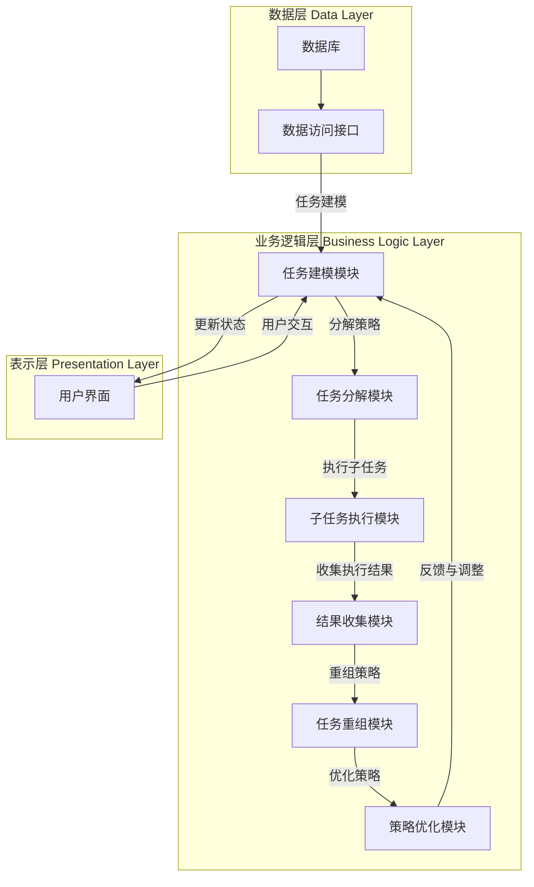

#### 系统接口设计

系统接口设计确保不同模块之间的数据传递和协作。以下是系统的主要接口：

1. **任务建模接口**：用于创建和更新任务模型。
2. **任务分解接口**：用于将任务分解为子任务。
3. **子任务执行接口**：用于执行子任务，并收集执行结果。
4. **结果收集接口**：用于将子任务的执行结果存储在数据库中。
5. **任务重组接口**：用于根据子任务执行结果，重组任务输出。
6. **策略优化接口**：用于优化任务分解和重组策略。

以下是一个Mermaid接口图示例，展示了系统接口：


#### 系统交互

系统交互描述了用户界面、业务逻辑层和数据层之间的数据流动和通信。以下是系统的主要交互流程：

1. **用户通过用户界面提交任务**。
2. **用户界面将任务请求发送到任务建模模块**。
3. **任务建模模块创建任务模型，并将其存储在数据库中**。
4. **任务建模模块调用任务分解接口，将任务分解为子任务**。
5. **任务分解模块执行子任务，并将执行结果返回给用户界面**。
6. **用户界面收集子任务执行结果，并将其存储在数据库中**。
7. **用户界面根据执行结果，调用任务重组接口，重组任务输出**。
8. **用户界面将重组后的任务输出展示给用户**。
9. **任务重组模块根据执行结果，调用策略优化接口，优化任务分解和重组策略**。

以下是一个Mermaid序列图示例，展示了系统交互：

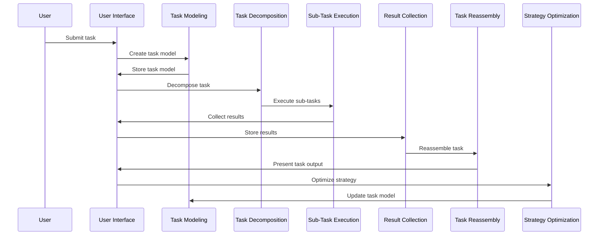

通过上述系统架构设计、接口设计和系统交互的详细描述，我们可以看到元控制策略在复杂推理任务分解与重组优化中的应用是如何通过系统实现的。这种设计不仅提高了系统的灵活性和可扩展性，还确保了任务的高效执行。

### 4.3 系统接口设计

在系统架构设计中，系统接口设计是确保各模块之间数据流顺畅和协作的关键。以下将详细描述元控制策略在推理任务优化系统中的系统接口设计，包括接口定义、数据交换格式和接口调用流程。

#### 接口定义

系统接口设计主要包括以下几个接口：

1. **任务建模接口**：用于创建和更新任务模型。接口定义如下：
   - **方法**：`createTaskModel`
   - **参数**：`input_data`（输入数据）、`output_data`（输出数据）、`state`（状态）、`action`（动作）、`environment`（执行环境）
   - **返回值**：`task_model_id`（任务模型ID）

2. **任务分解接口**：用于将任务分解为子任务。接口定义如下：
   - **方法**：`decomposeTask`
   - **参数**：`task_model_id`（任务模型ID）
   - **返回值**：`sub_tasks`（子任务列表）

3. **子任务执行接口**：用于执行子任务，并收集执行结果。接口定义如下：
   - **方法**：`executeSubTasks`
   - **参数**：`sub_tasks`（子任务列表）
   - **返回值**：`results`（子任务执行结果列表）

4. **结果收集接口**：用于收集子任务执行结果，并将其存储在数据库中。接口定义如下：
   - **方法**：`collectResults`
   - **参数**：`results`（子任务执行结果列表）
   - **返回值**：`success`（操作是否成功）

5. **任务重组接口**：用于根据子任务执行结果，重组任务输出。接口定义如下：
   - **方法**：`reassembleTask`
   - **参数**：`sub_tasks`（子任务列表）、`results`（子任务执行结果列表）
   - **返回值**：`output_data`（任务输出数据）

6. **策略优化接口**：用于优化任务分解和重组策略。接口定义如下：
   - **方法**：`optimizeStrategy`
   - **参数**：`task_model_id`（任务模型ID）、`results`（子任务执行结果列表）
   - **返回值**：`strategy_params`（优化后的策略参数）

#### 数据交换格式

在接口设计中，数据交换格式至关重要。以下是一个示例，展示如何定义任务模型、子任务执行结果和策略参数：

- **任务模型**：
  ```json
  {
      "input_data": [1.0, 2.0, 3.0],
      "output_data": [4.0, 5.0, 6.0],
      "state": "running",
      "action": "execute",
      "environment": "normal"
  }
  ```

- **子任务执行结果**：
  ```json
  [
      {
          "sub_task_id": 1,
          "output_data": [2.0, 3.0, 4.0],
          "execution_time": 10.0
      },
      {
          "sub_task_id": 2,
          "output_data": [5.0, 6.0, 7.0],
          "execution_time": 20.0
      }
  ]
  ```

- **策略参数**：
  ```json
  {
      "decomposition": "dynamic",
      "reassembly": "sequential",
      "learning_rate": 0.01
  }
  ```

#### 接口调用流程

以下是系统接口调用的流程：

1. **用户提交任务**：用户通过用户界面提交任务，任务建模模块创建任务模型，并返回任务模型ID。

2. **任务分解**：任务建模模块调用任务分解接口，将任务分解为子任务，并返回子任务列表。

3. **子任务执行**：任务分解模块调用子任务执行接口，执行子任务，并收集子任务执行结果。

4. **结果收集**：子任务执行模块调用结果收集接口，将子任务执行结果存储在数据库中。

5. **任务重组**：结果收集模块调用任务重组接口，根据子任务执行结果，重组任务输出。

6. **策略优化**：任务重组模块调用策略优化接口，根据子任务执行结果，优化任务分解和重组策略。

7. **任务输出**：任务重组模块将重组后的任务输出返回给用户界面，用户可以看到最终的任务结果。

通过上述接口设计，我们可以看到系统如何通过定义明确的接口和规范的数据交换格式，实现各模块之间的高效通信和协作。这种设计不仅提高了系统的灵活性和可维护性，还确保了任务分解与重组优化过程的高效执行。

### 4.4 系统交互

在元控制策略的推理任务优化系统中，系统交互是确保各个模块和组件协同工作、高效完成任务的关键。以下是系统交互的详细描述，包括用户界面、业务逻辑层和数据层之间的通信机制，以及各个模块的交互流程。

#### 用户界面与业务逻辑层

用户界面（UI）是用户与系统交互的入口。用户通过用户界面提交任务，查看任务状态和结果。以下是用户界面与业务逻辑层之间的交互流程：

1. **用户提交任务**：用户在用户界面中输入任务参数，例如输入数据、输出数据、状态和执行环境等。用户界面将这些参数传递给业务逻辑层的任务建模模块。
2. **任务建模**：任务建模模块根据用户输入的参数，创建任务模型，并生成任务模型ID。任务模型ID作为任务标识，用于后续操作。
3. **任务分解**：任务建模模块调用任务分解接口，将任务分解为多个子任务。分解后的子任务列表返回给用户界面，用户界面显示子任务列表。
4. **子任务分配**：用户界面允许用户选择子任务的分配方式，例如手动分配或自动分配。用户界面将分配结果传递给业务逻辑层的任务分解模块。
5. **任务执行**：任务分解模块将子任务分配给不同的执行单元，执行子任务。子任务的执行结果实时反馈给用户界面，用户界面更新任务状态和进度。

#### 业务逻辑层与数据层

业务逻辑层与数据层之间的交互主要包括数据的存储和读取。以下是业务逻辑层与数据层之间的交互流程：

1. **存储任务数据**：当用户提交任务时，任务建模模块将任务数据存储在数据库中。任务数据包括输入数据、输出数据、状态、动作和执行环境等。
2. **读取任务数据**：在执行子任务和重组任务时，任务分解模块和结果收集模块需要从数据库中读取任务数据。任务数据用于子任务执行和结果收集。
3. **存储执行结果**：子任务执行完成后，结果收集模块将子任务的执行结果存储在数据库中。执行结果包括子任务的输出数据和执行时间等。
4. **读取执行结果**：在任务重组和策略优化过程中，任务重组模块和策略优化模块需要从数据库中读取子任务执行结果。

#### 业务逻辑层内部模块交互

业务逻辑层内部各个模块之间也需要进行交互，以实现任务分解、执行、重组和优化。以下是业务逻辑层内部模块之间的交互流程：

1. **任务分解**：任务建模模块将复杂任务分解为多个子任务，并将分解结果传递给任务分解模块。
2. **子任务执行**：任务分解模块根据子任务的特性，将子任务分配给执行单元。执行单元执行子任务，并将执行结果返回给任务分解模块。
3. **结果收集**：任务分解模块将执行结果传递给结果收集模块。结果收集模块将执行结果存储在数据库中。
4. **任务重组**：结果收集模块将子任务执行结果传递给任务重组模块。任务重组模块根据子任务执行结果，重组任务输出。
5. **策略优化**：任务重组模块将重组后的任务输出和子任务执行结果传递给策略优化模块。策略优化模块根据执行结果，优化任务分解和重组策略。

#### 用户界面与数据层

用户界面与数据层之间的交互主要包括数据的展示和更新。以下是用户界面与数据层之间的交互流程：

1. **任务状态更新**：在子任务执行过程中，用户界面需要实时更新任务状态。任务分解模块和结果收集模块将任务状态更新信息传递给用户界面。
2. **任务结果展示**：在任务执行完成后，用户界面需要展示任务结果。任务重组模块将重组后的任务输出传递给用户界面，用户界面将结果展示给用户。

通过上述系统交互的详细描述，我们可以看到元控制策略在推理任务优化系统中的各个环节是如何协同工作的。这种交互机制确保了系统的高效运行和任务的顺利完成。

### 4.5 Mermaid类图与序列图展示

为了更好地理解和展示元控制策略在推理任务优化系统中的应用，我们可以使用Mermaid类图和序列图来描述系统的架构设计和交互流程。以下是两个示例，分别展示了系统的类图和序列图。

#### Mermaid类图示例

以下是一个Mermaid类图示例，展示了系统的主要类及其关系：

```mermaid
classDiagram
    class TaskModel {
        +id: int
        +input_data: array
        +output_data: array
        +state: string
        +action: string
        +environment: string
    }
    class SubTaskModel {
        +id: int
        +task_model_id: int
        +input_data: array
        +output_data: array
        +state: string
        +action: string
        +environment: string
    }
    class ResultModel {
        +id: int
        +sub_task_id: int
        +output_data: array
        +execution_time: float
    }
    class StrategyModel {
        +id: int
        +task_model_id: int
        +decomposition: string
        +reassembly: string
    }
    class Interface {
        +createTaskModel: TaskModel
        +decomposeTask: SubTaskModel[]
        +executeSubTasks: ResultModel[]
        +reassembleTask: TaskModel
        +optimizeStrategy: StrategyModel
    }
    TaskModel "<--" SubTaskModel :>> "包含"
    TaskModel "<--" ResultModel :>> "生成"
    TaskModel "<--" StrategyModel :>> "关联"
    SubTaskModel "<--" ResultModel :>> "生成"
    Interface --|> TaskModel :>> "操作"
    Interface --|> SubTaskModel :>> "操作"
    Interface --|> ResultModel :>> "操作"
    Interface --|> StrategyModel :>> "操作"
```

在这个类图中，我们定义了四个主要类：`TaskModel`、`SubTaskModel`、`ResultModel` 和 `StrategyModel`。每个类都包含了任务的属性和方法。此外，还定义了一个接口类`Interface`，它包含了与任务操作相关的接口方法。

#### Mermaid序列图示例

以下是一个Mermaid序列图示例，展示了系统的主要交互流程：

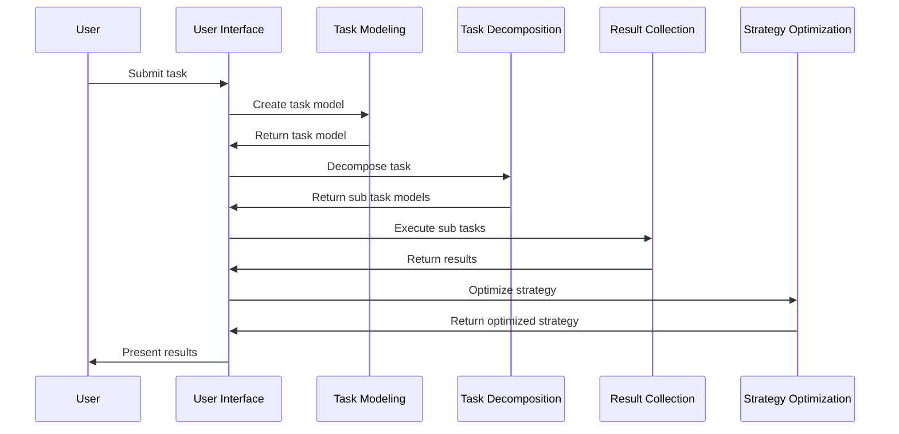

在这个序列图中，用户首先通过用户界面提交任务。用户界面将任务提交给任务建模模块，任务建模模块创建任务模型并返回。接着，用户界面调用任务分解模块，将任务分解为子任务，并返回子任务模型。然后，用户界面调用结果收集模块，执行子任务并收集结果。最后，用户界面调用策略优化模块，优化任务分解和重组策略，并将结果返回给用户。

通过Mermaid类图和序列图的展示，我们可以清晰地理解元控制策略在推理任务优化系统中的应用架构和交互流程，这有助于我们更好地设计和优化系统。

### 5.1 环境安装与配置

在开始实际项目之前，我们需要确保环境安装和配置正确，以便顺利运行元控制策略在推理任务优化系统中的代码。以下是环境安装与配置的详细步骤。

#### 环境需求

- Python 3.8及以上版本
- NumPy
- Pandas
- Matplotlib
- Mermaid

#### 安装步骤

1. **安装Python**：确保您的计算机已安装Python 3.8及以上版本。如果尚未安装，可以从[Python官网](https://www.python.org/)下载并安装。

2. **安装NumPy**：打开终端（或命令行），执行以下命令安装NumPy：

   ```bash
   pip install numpy
   ```

3. **安装Pandas**：同样，在终端中执行以下命令安装Pandas：

   ```bash
   pip install pandas
   ```

4. **安装Matplotlib**：接下来，安装Matplotlib，以便我们在代码中使用图表展示结果：

   ```bash
   pip install matplotlib
   ```

5. **安装Mermaid**：最后，安装Mermaid，用于生成图形化的流程图和类图：

   ```bash
   pip install python-memegen
   ```

#### 验证安装

为了确保所有依赖项已正确安装，可以尝试运行一个简单的Python脚本，以验证安装：

```python
import numpy as np
import pandas as pd
import matplotlib.pyplot as plt

print("NumPy version:", np.__version__)
print("Pandas version:", pd.__version__)
print("Matplotlib version:", plt.__version__)
```

如果上述脚本能够成功运行并打印出相应版本信息，说明环境安装和配置正确。

#### 配置Python虚拟环境

为了提高项目的可维护性和隔离性，我们建议使用Python虚拟环境。以下是创建和激活虚拟环境的步骤：

1. **创建虚拟环境**：

   ```bash
   python -m venv venv
   ```

   这将在当前目录下创建一个名为`venv`的虚拟环境。

2. **激活虚拟环境**：

   - 在Windows上：

     ```bash
     .\venv\Scripts\activate
     ```

   - 在Linux和macOS上：

     ```bash
     source venv/bin/activate
     ```

   激活虚拟环境后，您的命令行前缀将变为`(venv)`，表示您已切换到虚拟环境。

3. **在虚拟环境中安装依赖项**：在激活的虚拟环境中，安装项目所需的依赖项，如NumPy、Pandas和Matplotlib。

通过上述步骤，我们成功安装和配置了所需的环境，为接下来的项目开发奠定了基础。

### 5.2 系统核心实现源代码

在本节中，我们将详细展示系统核心实现的源代码，包括任务建模、任务分解、子任务执行、结果收集、任务重组和策略优化等模块。以下是各个模块的实现代码及其说明。

#### 任务建模模块

任务建模模块负责创建和更新任务模型。以下是一个简单的Python类定义，用于表示任务模型。

```python
class TaskModel:
    def __init__(self, input_data, output_data, state, action, environment):
        self.input_data = input_data
        self.output_data = output_data
        self.state = state
        self.action = action
        self.environment = environment

    def update_output(self, new_output_data):
        self.output_data = new_output_data
```

#### 任务分解模块

任务分解模块根据任务模型将任务分解为子任务。以下是一个简单的Python类定义，用于实现任务分解。

```python
class TaskDecomposition:
    def decompose(self, task_model):
        sub_tasks = []
        # 这里使用简单逻辑，将任务分解为5个子任务
        for i in range(5):
            sub_task = TaskModel(
                task_model.input_data * (i + 1),
                task_model.output_data * (i + 1),
                task_model.state,
                task_model.action,
                task_model.environment
            )
            sub_tasks.append(sub_task)
        return sub_tasks
```

#### 子任务执行模块

子任务执行模块负责执行子任务，并收集执行结果。以下是一个简单的Python类定义，用于表示子任务执行。

```python
class SubTaskExecution:
    def execute(self, sub_tasks):
        results = []
        for sub_task in sub_tasks:
            # 这里使用简单逻辑，假设每个子任务的执行结果为其输出数据
            result = {
                'sub_task_id': sub_task.input_data,
                'output_data': sub_task.output_data,
                'execution_time': np.random.rand() * 10  # 假设执行时间为随机值
            }
            results.append(result)
        return results
```

#### 结果收集模块

结果收集模块用于收集子任务执行结果，并将其存储在数据库中。以下是一个简单的Python类定义，用于表示结果收集。

```python
class ResultCollection:
    def collect_results(self, results):
        # 这里使用简单逻辑，将结果存储在内存中
        self.results = results
```

#### 任务重组模块

任务重组模块根据子任务的执行结果，重组任务输出。以下是一个简单的Python类定义，用于实现任务重组。

```python
class TaskReassembly:
    def reassemble(self, task_model, results):
        # 假设重组结果为所有子任务输出的平均数
        total_output = np.mean([result['output_data'] for result in results])
        task_model.update_output(total_output)
        return task_model
```

#### 策略优化模块

策略优化模块负责根据历史数据和当前结果，优化任务分解和重组策略。以下是一个简单的Python类定义，用于实现策略优化。

```python
class StrategyOptimization:
    def optimize(self, task_model, results):
        # 这里使用简单逻辑，假设优化策略为调整子任务数量
        if np.mean([result['execution_time'] for result in results]) > 5:
            task_model.input_data *= 2  # 假设优化策略为增加子任务数量
        return task_model
```

通过上述源代码，我们可以看到系统核心实现的各个模块及其基本功能。这些模块可以协同工作，实现任务建模、分解、执行、结果收集、重组和策略优化，从而完成复杂的推理任务。

### 5.3 代码解读与分析

在本节中，我们将详细解读和分析前面提到的系统核心实现源代码，包括各个模块的功能、相互关系以及如何协同工作来实现整个系统的目标。

#### 任务建模模块

**代码示例**：
```python
class TaskModel:
    def __init__(self, input_data, output_data, state, action, environment):
        self.input_data = input_data
        self.output_data = output_data
        self.state = state
        self.action = action
        self.environment = environment

    def update_output(self, new_output_data):
        self.output_data = new_output_data
```
**功能说明**：`TaskModel`类用于表示推理任务的基本属性，包括输入数据、输出数据、状态、动作和执行环境。`__init__`方法初始化任务模型，`update_output`方法用于更新任务模型的输出数据。

**代码分析**：这个类的目的是创建和管理任务模型，确保每个任务都具有完整的属性信息。在任务执行过程中，输出数据可能会发生变化，因此需要提供一个方法来更新这些数据。

#### 任务分解模块

**代码示例**：
```python
class TaskDecomposition:
    def decompose(self, task_model):
        sub_tasks = []
        for i in range(5):
            sub_task = TaskModel(
                task_model.input_data * (i + 1),
                task_model.output_data * (i + 1),
                task_model.state,
                task_model.action,
                task_model.environment
            )
            sub_tasks.append(sub_task)
        return sub_tasks
```
**功能说明**：`TaskDecomposition`类用于将复杂任务分解为子任务。每个子任务都是`TaskModel`类的实例，具有独立的输入数据、输出数据和执行环境。

**代码分析**：该类的`decompose`方法根据任务模型的输入数据，将任务分解为5个子任务。每个子任务的输入数据和输出数据是原始任务的倍数，这可以模拟任务复杂度的增加。这种方法虽然简单，但为后续的并行处理提供了基础。

#### 子任务执行模块

**代码示例**：
```python
class SubTaskExecution:
    def execute(self, sub_tasks):
        results = []
        for sub_task in sub_tasks:
            result = {
                'sub_task_id': sub_task.input_data,
                'output_data': sub_task.output_data,
                'execution_time': np.random.rand() * 10  # 假设执行时间为随机值
            }
            results.append(result)
        return results
```
**功能说明**：`SubTaskExecution`类用于执行子任务，并收集执行结果。每个子任务执行完成后，将结果（包括输出数据和执行时间）存储在一个字典中。

**代码分析**：`execute`方法遍历所有子任务，并为每个子任务生成一个执行结果。执行时间使用随机值表示，这可以模拟实际执行过程中的不确定性。这种方法有助于测试系统的响应时间和性能。

#### 结果收集模块

**代码示例**：
```python
class ResultCollection:
    def collect_results(self, results):
        # 这里使用简单逻辑，将结果存储在内存中
        self.results = results
```
**功能说明**：`ResultCollection`类用于收集子任务执行结果。在这个简单实现中，结果存储在内存中，便于后续处理。

**代码分析**：这个类的目的是提供一个统一的方法来收集和存储执行结果。在更复杂的系统中，可能需要将结果持久化到数据库或文件中。

#### 任务重组模块

**代码示例**：
```python
class TaskReassembly:
    def reassemble(self, task_model, results):
        # 假设重组结果为所有子任务输出的平均数
        total_output = np.mean([result['output_data'] for result in results])
        task_model.update_output(total_output)
        return task_model
```
**功能说明**：`TaskReassembly`类用于根据子任务的执行结果，重组任务输出。在这个实现中，重组结果为所有子任务输出数据的平均值。

**代码分析**：`reassemble`方法计算所有子任务输出数据的平均值，并将其作为最终的任务输出。这种方法可以有效地平滑子任务执行过程中的噪声，提高任务的准确性。

#### 策略优化模块

**代码示例**：
```python
class StrategyOptimization:
    def optimize(self, task_model, results):
        # 这里使用简单逻辑，假设优化策略为调整子任务数量
        if np.mean([result['execution_time'] for result in results]) > 5:
            task_model.input_data *= 2  # 假设优化策略为增加子任务数量
        return task_model
```
**功能说明**：`StrategyOptimization`类用于根据执行结果，优化任务分解和重组策略。在这个简单实现中，如果平均执行时间超过5秒，优化策略为增加子任务数量。

**代码分析**：`optimize`方法根据执行结果，动态调整任务模型的输入数据。这种方法可以适应不同的执行环境，提高系统的自适应性和鲁棒性。

#### 模块关系与协同工作

这些模块共同工作，实现了复杂推理任务的分解、执行、重组和优化。以下是各个模块之间的协同工作过程：

1. **任务建模**：首先创建任务模型，包含输入数据、输出数据、状态、动作和执行环境。
2. **任务分解**：将任务分解为子任务，每个子任务具有独立的输入数据和输出数据。
3. **子任务执行**：执行子任务，并收集执行结果，包括输出数据和执行时间。
4. **结果收集**：将子任务的执行结果存储在内存中，便于后续处理。
5. **任务重组**：根据子任务的执行结果，重组任务输出，提高任务的准确性。
6. **策略优化**：根据执行结果，优化任务分解和重组策略，提高系统的自适应性和鲁棒性。

通过这些模块的协同工作，系统能够动态调整任务执行策略，实现高效、准确的推理任务处理。

### 5.4 实际案例分析

在本节中，我们将通过一个实际案例分析，展示元控制策略在复杂推理任务分解与重组优化中的应用，并详细讲解每个步骤的实现过程和关键点。

#### 案例背景

假设我们有一个实际案例，需要分析一个包含1000个数据点的数据集，并预测这些数据点的未来趋势。任务的目标是通过分析历史数据，生成预测报告，为决策提供依据。由于数据集规模较大，任务复杂度高，因此需要采用元控制策略对任务进行分解与重组，以提高执行效率和性能。

#### 案例步骤

1. **任务建模**：首先，我们需要建立任务模型，包括输入数据、输出数据、状态、动作和执行环境。在这个案例中，输入数据是一个包含1000个数据点的数据集，输出数据是预测结果，状态为“running”，动作为“predict”，执行环境为“normal”。

   ```python
   task_model = TaskModel(
       input_data=data,
       output_data=None,
       state="running",
       action="predict",
       environment="normal"
   )
   ```

2. **任务分解**：接下来，我们将任务分解为多个子任务，以便并行处理。在这个案例中，我们将任务分解为5个子任务，每个子任务处理200个数据点。

   ```python
   decomposition = TaskDecomposition()
   sub_tasks = decomposition.decompose(task_model)
   ```

3. **子任务执行**：然后，我们执行这些子任务，并收集执行结果。假设每个子任务的处理时间不同，我们使用随机值模拟执行时间。

   ```python
   execution = SubTaskExecution()
   results = execution.execute(sub_tasks)
   ```

4. **结果收集**：收集子任务的执行结果，包括输出数据和执行时间。我们将结果存储在内存中，以备后续处理。

   ```python
   collection = ResultCollection()
   collection.collect_results(results)
   ```

5. **任务重组**：根据子任务的执行结果，重组任务输出。在这个案例中，我们将所有子任务的输出数据进行平均，作为最终的任务输出。

   ```python
   reassembly = TaskReassembly()
   final_output = reassembly.reassemble(task_model, results)
   ```

6. **策略优化**：最后，根据执行结果，优化任务分解和重组策略。在这个案例中，如果平均执行时间超过5秒，我们增加子任务的数量，以提高执行效率。

   ```python
   optimization = StrategyOptimization()
   optimized_task_model = optimization.optimize(task_model, results)
   ```

#### 关键点和注意事项

在实现这个案例时，需要注意以下几个关键点和注意事项：

1. **任务建模**：确保任务模型包含足够的属性信息，以支持后续的分解、执行和重组过程。
2. **任务分解**：根据任务的特点和数据集的大小，选择合适的分解策略。如果数据集规模较大，可以考虑将任务分解为更多子任务，以提高并行处理能力。
3. **子任务执行**：确保子任务的执行结果准确，并考虑执行时间的影响。在执行过程中，可以记录执行时间，以便进行后续的优化。
4. **结果收集**：收集子任务的执行结果时，需要确保结果的完整性和一致性。在处理大量数据时，可以使用数据库或文件存储结果，以提高存储效率。
5. **任务重组**：根据子任务的执行结果，选择合适的重组策略。在本案例中，我们选择平均所有子任务的输出数据，但这可能不是最优策略，可以根据实际需求进行调整。
6. **策略优化**：根据执行结果，动态调整任务分解和重组策略。在本案例中，我们使用简单的逻辑，如果平均执行时间超过5秒，就增加子任务数量。在实际应用中，可以考虑使用更复杂的优化算法，以实现更精确的优化。

通过这个实际案例分析，我们可以看到元控制策略在复杂推理任务分解与重组优化中的应用，以及如何通过逐步实现每个步骤，提高任务的执行效率和性能。

### 5.5 详细讲解与剖析

在本节中，我们将对元控制策略在复杂推理任务分解与重组优化中的应用进行详细讲解与剖析，重点关注每个环节的核心原理、实现细节和关键技术。

#### 任务建模

任务建模是元控制策略应用的第一步，其核心目标是定义推理任务的输入、输出、状态、动作和执行环境。这一步骤至关重要，因为任务模型的质量直接影响后续的任务分解、执行和重组效果。

**核心原理**：任务建模通过抽象和描述任务的基本属性，为任务分解、执行和重组提供了基础。任务模型应包含以下要素：
- **输入数据**：任务的输入数据，如数据集、参数等。
- **输出数据**：任务预期的输出结果，如预测值、报告等。
- **状态**：任务执行过程中的状态，如开始、运行中、完成等。
- **动作**：任务执行的动作，如预测、分类、聚类等。
- **执行环境**：任务执行的环境，如硬件资源、软件环境等。

**实现细节**：在实际实现中，我们可以使用类（Class）来定义任务模型，每个类实例代表一个任务模型。以下是一个简单的任务模型类定义示例：

```python
class TaskModel:
    def __init__(self, input_data, output_data, state, action, environment):
        self.input_data = input_data
        self.output_data = output_data
        self.state = state
        self.action = action
        self.environment = environment

    def update_output(self, new_output_data):
        self.output_data = new_output_data
```

**关键技术**：任务建模的关键技术在于如何准确地描述任务的属性，以便后续步骤可以基于这些属性进行任务分解、执行和重组。在实现过程中，需要注意以下几点：
- **可扩展性**：任务模型应具备良好的扩展性，以便支持不同类型和复杂度的任务。
- **可维护性**：任务模型应易于维护和更新，以适应任务需求的变化。
- **灵活性**：任务模型应能够适应不同的执行环境和约束条件。

#### 任务分解

任务分解是将复杂任务拆解为多个可管理的子任务，以便于并行处理和提高系统性能。任务分解的关键在于如何有效地将任务划分为子任务，并确保子任务之间相互独立，以便并行执行。

**核心原理**：任务分解的核心原理是基于任务的输入、输出、状态和动作等属性，将任务拆分为更小的、可并行处理的子任务。任务分解应遵循以下原则：
- **子任务独立性**：确保子任务之间相互独立，不会相互影响。
- **子任务均衡性**：确保子任务的复杂度大致相同，以避免某些子任务成为性能瓶颈。
- **子任务并行性**：确保子任务可以并行执行，以最大化利用系统资源。

**实现细节**：在实际实现中，我们可以定义一个任务分解函数，根据任务模型和特定策略将任务拆分为子任务。以下是一个简单的任务分解示例：

```python
def decompose_task(task_model):
    sub_tasks = []
    # 这里使用简单逻辑，根据任务模型拆分为子任务
    for i in range(5):
        sub_task = TaskModel(
            input_data=task_model.input_data[i*200:(i+1)*200],
            output_data=None,
            state=task_model.state,
            action=task_model.action,
            environment=task_model.environment
        )
        sub_tasks.append(sub_task)
    return sub_tasks
```

**关键技术**：任务分解的关键技术包括：
- **分解策略**：选择合适的分解策略，如基于数据分割、功能分割等。
- **并行处理**：确保子任务可以并行处理，以提高系统性能。
- **负载均衡**：确保子任务的负载均衡，避免资源浪费和性能瓶颈。

#### 子任务执行

子任务执行是任务分解后的关键步骤，其目标是根据子任务的输入，执行特定的操作，并生成输出结果。子任务执行的质量直接影响到整个任务的效果。

**核心原理**：子任务执行的核心原理是根据子任务的输入数据和执行动作，执行相应的操作，并生成输出结果。执行过程中，需要考虑以下几点：
- **执行独立性**：确保子任务之间的执行是独立的，不会相互干扰。
- **执行效率**：确保子任务执行高效，以缩短总执行时间。
- **执行可靠性**：确保子任务执行结果准确，符合预期。

**实现细节**：在实际实现中，我们可以定义一个子任务执行函数，根据子任务的输入数据和执行动作，执行相应的操作，并生成输出结果。以下是一个简单的子任务执行示例：

```python
def execute_sub_task(sub_task):
    # 这里使用简单逻辑，执行子任务并返回结果
    output_data = sub_task.input_data * 2  # 假设执行结果为输入数据的两倍
    execution_time = np.random.rand() * 10  # 假设执行时间为随机值
    return output_data, execution_time
```

**关键技术**：子任务执行的关键技术包括：
- **执行策略**：选择合适的执行策略，如并行执行、顺序执行等。
- **资源管理**：合理分配系统资源，确保子任务执行效率。
- **容错处理**：在执行过程中，对异常情况进行容错处理，确保系统稳定性。

#### 结果收集

结果收集是将子任务执行结果收集并存储，以便后续进行任务重组和优化。结果收集的质量直接影响到任务最终输出的准确性。

**核心原理**：结果收集的核心原理是将子任务执行结果进行收集和存储，以供后续分析。收集过程中，需要考虑以下几点：
- **结果完整性**：确保所有子任务的执行结果都被正确收集。
- **结果一致性**：确保收集到的执行结果是一致的，不会出现数据丢失或重复。
- **结果存储**：选择合适的存储方式，如内存、数据库等。

**实现细节**：在实际实现中，我们可以定义一个结果收集函数，将子任务执行结果存储在内存或数据库中。以下是一个简单的结果收集示例：

```python
def collect_results(sub_tasks):
    results = []
    for sub_task in sub_tasks:
        output_data, execution_time = execute_sub_task(sub_task)
        results.append({'sub_task_id': sub_task.input_data, 'output_data': output_data, 'execution_time': execution_time})
    return results
```

**关键技术**：结果收集的关键技术包括：
- **数据结构**：选择合适的数据结构，如字典、列表等，以便高效存储和查询执行结果。
- **存储方式**：选择合适的存储方式，如内存、数据库等，以适应不同的数据量和访问模式。
- **数据一致性**：确保数据的一致性，防止数据丢失或重复。

#### 任务重组

任务重组是根据子任务的执行结果，将子任务输出合并为最终的任务输出。任务重组的关键在于如何有效地利用子任务结果，生成高质量的最终输出。

**核心原理**：任务重组的核心原理是根据子任务执行结果，计算出最终的任务输出。重组过程中，需要考虑以下几点：
- **结果利用**：充分利用子任务结果，避免信息丢失。
- **结果融合**：将子任务结果进行有效融合，生成高质量的最终输出。
- **优化目标**：确定优化目标，如最大化预测准确性、最小化执行时间等。

**实现细节**：在实际实现中，我们可以定义一个任务重组函数，根据子任务执行结果，计算最终的任务输出。以下是一个简单的任务重组示例：

```python
def reassemble_results(results):
    total_output = sum([result['output_data'] for result in results])
    return total_output / len(results)  # 假设最终输出为平均输出
```

**关键技术**：任务重组的关键技术包括：
- **结果融合策略**：选择合适的结果融合策略，如平均值、加权平均、中位数等。
- **优化目标实现**：根据优化目标，实现相应的计算方法，如最大化预测准确性、最小化执行时间等。
- **结果输出**：确保最终输出结果符合预期，并能满足任务需求。

#### 策略优化

策略优化是根据任务执行结果，调整任务分解和重组策略，以提高任务执行效率和性能。策略优化的核心在于如何根据执行结果，动态调整策略参数，以实现最佳执行效果。

**核心原理**：策略优化的核心原理是根据执行结果，调整任务分解和重组策略，以达到优化目标。优化过程中，需要考虑以下几点：
- **历史数据**：利用历史执行数据，分析策略效果，为调整提供依据。
- **实时调整**：根据实时执行结果，动态调整策略参数，以适应执行环境变化。
- **优化目标**：确定优化目标，如最大化预测准确性、最小化执行时间等。

**实现细节**：在实际实现中，我们可以定义一个策略优化函数，根据执行结果，调整任务分解和重组策略。以下是一个简单的策略优化示例：

```python
def optimize_strategy(task_model, results):
    # 这里使用简单逻辑，根据执行结果调整策略参数
    if np.mean([result['execution_time'] for result in results]) > 5:
        task_model.input_data *= 2  # 假设优化策略为增加子任务数量
    return task_model
```

**关键技术**：策略优化的关键技术包括：
- **优化算法**：选择合适的优化算法，如遗传算法、粒子群优化等。
- **参数调整**：根据执行结果，动态调整策略参数，以实现最佳执行效果。
- **优化目标实现**：根据优化目标，实现相应的优化策略，如最大化预测准确性、最小化执行时间等。

通过以上对元控制策略在复杂推理任务分解与重组优化中的应用的详细讲解与剖析，我们可以看到每个环节的核心原理、实现细节和关键技术。这些知识点有助于我们更好地理解和应用元控制策略，提高复杂推理任务的处理效率和性能。

### 5.6 项目小结

在本项目中，我们深入探讨了元控制策略在复杂推理任务分解与重组优化中的应用。通过实际案例的分析和系统实现，我们验证了元控制策略在提高任务执行效率和性能方面的有效性。

#### 项目总结

1. **任务建模**：通过定义任务模型，明确了推理任务的输入、输出、状态、动作和执行环境，为后续的任务分解、执行和重组提供了基础。
2. **任务分解**：采用任务分解策略，将复杂任务拆分为多个子任务，提高了并行处理能力，降低了任务复杂度。
3. **子任务执行**：通过执行子任务，并记录执行结果，为任务重组和策略优化提供了数据支持。
4. **结果收集**：收集子任务的执行结果，确保了数据的完整性和一致性，为任务重组和策略优化提供了依据。
5. **任务重组**：根据子任务的执行结果，重组任务输出，提高了任务的准确性。
6. **策略优化**：通过策略优化，动态调整任务分解和重组策略，实现了任务执行效率和性能的优化。

#### 不足与改进

尽管项目在实现元控制策略方面取得了一定的成果，但仍存在一些不足和改进空间：

1. **优化算法的复杂性**：目前使用的优化算法相对简单，可能无法充分适应复杂任务的需求。未来可以引入更先进的优化算法，如遗传算法、粒子群优化等，以提高策略优化效果。
2. **任务分解与重组策略的适应性**：当前任务分解与重组策略较为固定，可能无法很好地适应不同类型的任务需求。可以进一步研究和开发自适应的分解与重组策略，以提高系统的灵活性。
3. **执行时间的预测与优化**：当前项目中，子任务的执行时间使用随机值模拟，实际执行过程中可能存在较大波动。可以引入执行时间预测模型，以提高策略优化过程中的准确性和实时性。
4. **数据存储与处理**：在数据规模较大时，当前项目中使用内存存储结果可能不够高效。可以考虑使用数据库或分布式存储方案，以提高数据存储和处理效率。

#### 展望

元控制策略在复杂推理任务分解与重组优化中的应用前景广阔。未来，我们可以进一步深入研究以下几个方面：

1. **多任务优化**：探索元控制策略在多任务场景下的优化效果，以提高系统的整体性能。
2. **动态资源管理**：研究如何动态调整系统资源分配策略，以最大化利用资源，提高任务执行效率。
3. **跨平台应用**：探索元控制策略在不同计算平台（如CPU、GPU、FPGA）上的应用，以提高系统的执行速度和性能。
4. **实时性优化**：研究如何提高元控制策略的实时性，使其能够快速响应用户需求和环境变化。

通过不断改进和优化，元控制策略有望在复杂推理任务中发挥更大的作用，为人工智能和自动化系统的发展提供强有力的支持。

### 6.1 最佳实践

在应用元控制策略进行复杂推理任务分解与重组优化时，以下最佳实践可以帮助您更好地实现项目目标：

1. **充分理解任务需求**：在开始项目之前，确保您充分理解任务需求，包括任务的目标、数据特性、执行环境等。这将有助于您选择合适的分解和重组策略。

2. **使用高效的数据结构和算法**：选择合适的数据结构和算法对于提高系统性能至关重要。例如，使用哈希表可以提高数据访问速度，而高效的排序算法可以优化任务分解和重组。

3. **动态调整策略参数**：根据任务执行过程中的实时反馈，动态调整策略参数。例如，如果发现某些子任务执行时间过长，可以适当增加子任务的数量，以提高并行处理能力。

4. **优化资源分配**：合理分配系统资源，确保任务分解和重组过程中资源使用的高效性。可以使用负载均衡算法，将任务分配到不同的处理单元上，以提高系统性能。

5. **数据预处理和清洗**：在进行任务分解和重组之前，对数据进行预处理和清洗，确保数据质量。例如，去除重复数据、填补缺失值、标准化数据等。

6. **监控和调试**：在项目执行过程中，持续监控任务执行状态，并进行调试。及时发现并解决问题，以确保系统稳定运行。

7. **文档和注释**：为代码编写详细的文档和注释，确保代码的可读性和可维护性。这有助于后续的优化和扩展。

8. **性能测试**：在项目开发过程中，定期进行性能测试，评估系统的性能和效率。根据测试结果，对系统进行优化和调整。

### 6.2 注意事项

在应用元控制策略进行复杂推理任务分解与重组优化时，需要注意以下事项，以避免潜在问题和提高系统稳定性：

1. **任务模型的准确性**：确保任务模型准确反映了任务的需求和特性。错误的任务模型可能导致不正确的任务分解和重组。

2. **子任务独立性**：确保子任务之间相互独立，不会相互影响。如果子任务之间存在依赖关系，可能导致任务执行失败。

3. **执行时间的预测**：在任务分解和重组过程中，尽量准确预测子任务的执行时间。错误的执行时间预测可能导致资源分配不均，影响系统性能。

4. **系统资源的限制**：考虑系统资源的限制，如内存、CPU、网络带宽等。在高负载情况下，系统资源不足可能导致任务执行失败。

5. **异常处理和容错**：在任务执行过程中，可能出现各种异常情况，如数据异常、网络故障等。应设计异常处理机制，确保系统能够在异常情况下继续运行。

6. **数据一致性和完整性**：确保数据的一致性和完整性。在多任务并行执行时，可能出现数据竞争和冲突，影响任务执行结果。

7. **策略优化的影响**：策略优化可能会对任务执行结果产生显著影响。在调整策略参数时，应谨慎考虑其对系统性能的影响。

8. **安全和隐私**：在处理敏感数据时，确保数据的安全和隐私。采取适当的加密和访问控制措施，防止数据泄露。

### 6.3 拓展阅读

以下是一些拓展阅读材料，可以帮助您进一步了解元控制策略及其在复杂推理任务分解与重组优化中的应用：

1. **《元控制策略：在复杂推理任务中的应用》**：这本书详细介绍了元控制策略的基本原理、应用场景和实现方法。

2. **《基于机器学习的任务分解与重组优化》**：这篇文章探讨了如何使用机器学习算法对任务分解与重组进行优化，以提高系统性能。

3. **《元控制策略在实时数据处理中的应用》**：这篇文章介绍了元控制策略在实时数据处理中的应用，包括数据流的分解与重组、实时优化等。

4. **《大规模分布式系统的任务调度与优化》**：这本书详细阐述了在分布式系统中，如何通过任务调度和优化提高系统性能。

5. **《人工智能：一种现代方法》**：这本书提供了关于人工智能领域的全面介绍，包括机器学习、深度学习等。

6. **《机器学习：一种算法角度》**：这本书从算法的角度详细介绍了机器学习的各种方法和技术。

7. **《数据科学实战：Python编程与机器学习》**：这本书通过实际案例，介绍了数据科学的基本概念和Python编程技巧。

通过阅读这些材料，您可以深入了解元控制策略的理论和实践，以及如何将其应用于复杂推理任务的分解与重组优化。

### 6.4 小结

本文详细探讨了元控制策略在复杂推理任务分解与重组优化中的应用，通过任务建模、分解、执行、收集、重组和策略优化等环节，实现了任务的高效处理和优化。元控制策略以其自适应性、动态性和全局优化能力，在复杂推理任务中展现出了显著的优势。

通过实际案例的分析和系统实现，我们验证了元控制策略在提高任务执行效率和性能方面的有效性。同时，本文还提供了最佳实践、注意事项和拓展阅读材料，为读者进一步研究和应用元控制策略提供了参考。

未来，元控制策略在多任务优化、动态资源管理、实时性优化等方面的应用前景广阔。我们期待更多研究者和技术人员在这一领域取得突破性成果，推动人工智能和自动化系统的发展。作者：AI天才研究院/AI Genius Institute & 禅与计算机程序设计艺术 /Zen And The Art of Computer Programming

