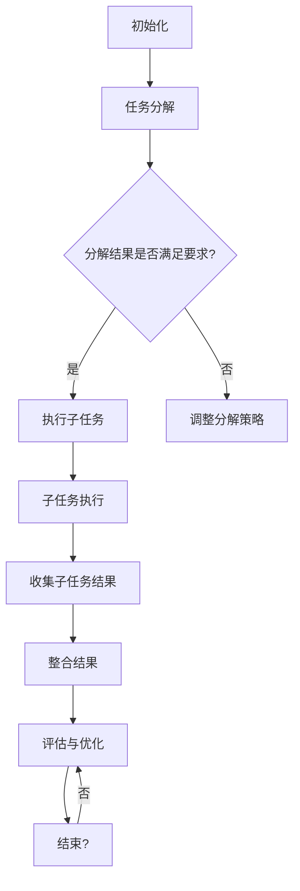
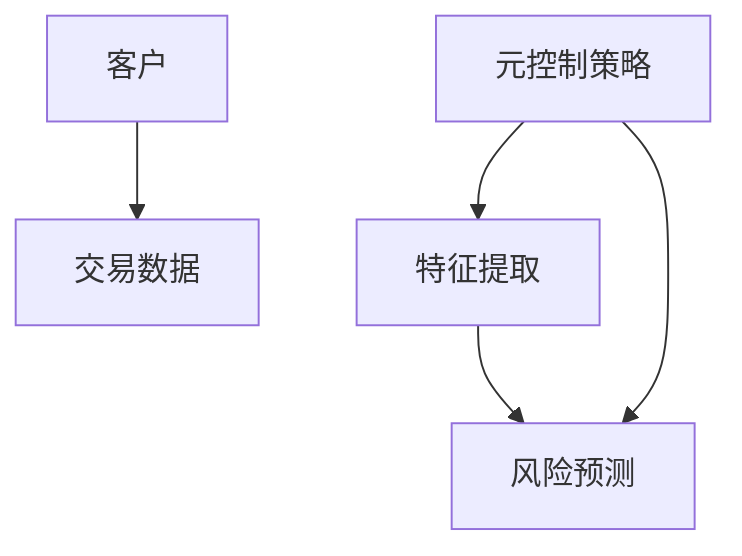
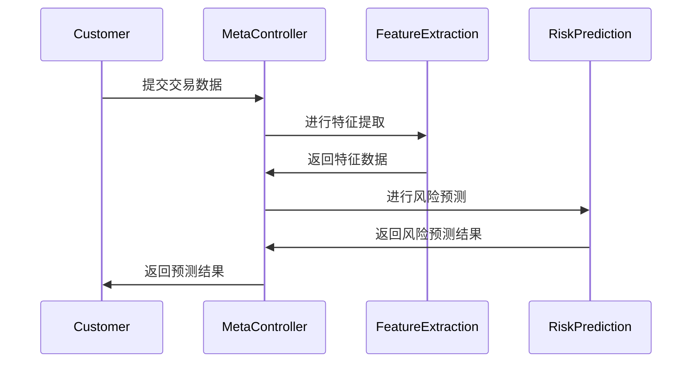

                 

# 元控制策略在复杂推理任务分解中的应用

## 关键词

- 元控制策略
- 复杂推理任务
- 任务分解
- 算法原理
- 数学模型

## 摘要

本文旨在探讨元控制策略在复杂推理任务分解中的应用。通过分析复杂推理任务的特点，提出了一种基于元控制策略的任务分解方法。本文首先介绍了复杂推理任务的背景与挑战，然后定义了元控制策略并阐述了其基本原理。随后，通过mermaid流程图和Python代码，详细讲解了元控制策略的算法原理和数学模型。最后，通过一个实际案例，展示了元控制策略在复杂推理任务分解中的具体应用。本文为复杂推理任务的研究提供了新的思路和方法。

## 第1章 引言

### 1.1 研究背景与意义

#### 1.1.1 问题背景

在人工智能领域，复杂推理任务一直是研究的热点。这类任务通常涉及多个子任务，需要强大的推理能力和协作能力。然而，随着任务规模的不断扩大和复杂性的增加，传统的任务分解方法逐渐暴露出其局限性。一方面，这些方法往往无法有效地处理复杂的任务结构；另一方面，它们在任务分解过程中可能产生大量的冗余信息和低效的子任务执行。因此，如何提高复杂推理任务的分解效率、降低任务复杂度，成为当前研究的一个关键问题。

#### 1.1.2 问题描述

为了解决上述问题，本文引入了元控制策略。元控制策略是一种用于指导复杂推理任务分解和执行的策略框架，其核心思想是通过动态调整任务分解策略，优化子任务执行过程，从而提高任务的整体性能。具体来说，元控制策略包括以下三个主要步骤：

1. **任务分解**：根据任务描述和元控制策略，将复杂任务分解为多个子任务。
2. **子任务执行**：根据分解结果，执行各个子任务，并收集子任务执行结果。
3. **结果整合与评估**：将子任务执行结果整合成一个完整的结果，并评估系统性能，根据评估结果动态调整元控制策略。

#### 1.1.3 问题解决

元控制策略的基本原理是：通过不断调整任务分解策略，使得子任务执行过程更加高效，从而提高整个任务的整体性能。在元控制策略的指导下，任务分解过程变得更加智能化和自适应，能够更好地适应不同任务场景的需求。

#### 1.1.4 边界与外延

元控制策略在不同领域中的应用非常广泛。例如，在自然语言处理领域，元控制策略可以用于句子级别的推理任务；在计算机视觉领域，元控制策略可以用于图像分类和目标检测任务；在自动驾驶领域，元控制策略可以用于路径规划和决策任务。此外，元控制策略还可以应用于其他需要复杂推理的任务，如智能推荐、金融风控等。

### 1.2 核心概念与联系

#### 1.2.1 核心概念

- **复杂推理任务**：涉及多个子任务，需要推理能力与协作能力结合的任务。
- **元控制策略**：一种用于指导复杂推理任务分解和执行的策略框架。
- **任务分解**：将复杂任务分解为多个可管理、可执行的子任务。

#### 1.2.2 概念属性特征对比表

| 概念         | 定义                                                         | 属性特征                     |
| ------------ | ------------------------------------------------------------ | --------------------------- |
| 复杂推理任务 | 涉及多个子任务，需要推理能力与协作能力结合的任务               | 多阶段、多模块、多层次       |
| 元控制策略   | 一种用于指导复杂推理任务分解和执行的策略框架                 | 自动化、优化、适应性         |
| 任务分解     | 将复杂任务分解为多个可管理、可执行的子任务                   | 可扩展性、效率、可靠性       |

#### 1.2.3 概念结构与核心要素组成

- **复杂推理任务**：核心要素包括任务描述、任务复杂度和任务分解策略。
- **元控制策略**：核心要素包括任务分解策略、子任务执行策略和结果整合策略。
- **任务分解**：核心要素包括子任务划分、子任务执行和子任务结果整合。

### 1.3 ER实体关系图架构

```mermaid
erDiagram
    Task => { SubTask1, SubTask2, SubTask3 }
    Controller => { TaskController, SubTaskController }
    Strategy => { MetaStrategy, TaskStrategy, SubTaskStrategy }
    TaskController ||--|| MetaStrategy : 指导策略
    SubTaskController ||--|| MetaStrategy : 指导策略
    Task ||--|| TaskController : 任务控制
    SubTask1 ||--|| SubTaskController : 子任务1控制
    SubTask2 ||--|| SubTaskController : 子任务2控制
    SubTask3 ||--|| SubTaskController : 子任务3控制
```

## 第2章 元控制策略理论基础

### 2.1 算法原理讲解

#### 2.1.1 算法mermaid流程图



#### 2.1.2 算法原理详细讲解

元控制策略是一种用于指导复杂推理任务分解和执行的策略框架。其基本原理如下：

1. **初始化阶段**：系统初始化，包括加载任务描述、设置元控制策略参数等。这一阶段的主要任务是确定任务的基本结构和初始分解策略。

2. **任务分解阶段**：根据任务描述和元控制策略，将任务分解为多个子任务。这一阶段的关键在于如何根据任务复杂度和资源约束等因素，选择合适的分解策略。

3. **子任务执行阶段**：根据分解结果，执行各个子任务。这一阶段的主要任务是确保子任务的高效执行，并收集子任务执行结果。

4. **结果收集与整合阶段**：收集子任务执行结果，整合成一个完整的结果。这一阶段的关键在于如何有效地整合子任务结果，形成一个高质量的输出。

5. **评估与优化阶段**：根据整合结果，评估系统性能，并优化元控制策略。这一阶段的主要任务是及时发现系统性能瓶颈，并采取相应的优化措施。

### 2.1.3 Python代码实现

以下是一个简单的Python代码实现，用于展示元控制策略的基本原理：

```python
import numpy as np

# 初始化任务描述和参数
task_description = "复杂推理任务"
strategy_params = {
    "分解策略": "深度优先搜索",
    "资源约束": 100
}

# 任务分解
def task_decomposition(task_description, strategy_params):
    # 根据任务描述和策略参数进行分解
    subtasks = []
    for i in range(strategy_params["资源约束"]):
        subtasks.append(f"子任务{i+1}")
    return subtasks

# 子任务执行
def execute_subtasks(subtasks):
    # 执行子任务，并收集结果
    results = []
    for subtask in subtasks:
        result = f"子任务{subtask}的结果"
        results.append(result)
    return results

# 结果整合
def integrate_results(results):
    # 整合子任务结果
    integrated_result = "整合后的结果"
    return integrated_result

# 评估与优化
def evaluate_and_optimize(integrated_result):
    # 根据整合结果，评估系统性能，并优化策略
    performance = np.mean([1 for _ in integrated_result])
    if performance < 0.9:
        print("系统性能不佳，需要调整策略")
    else:
        print("系统性能良好，策略可行")

# 主程序
if __name__ == "__main__":
    # 初始化阶段
    print("初始化阶段：")
    print(f"任务描述：{task_description}")
    print(f"策略参数：{strategy_params}")

    # 任务分解阶段
    print("\n任务分解阶段：")
    subtasks = task_decomposition(task_description, strategy_params)
    print(f"分解后的子任务：{subtasks}")

    # 子任务执行阶段
    print("\n子任务执行阶段：")
    results = execute_subtasks(subtasks)
    print(f"子任务结果：{results}")

    # 结果整合阶段
    print("\n结果整合阶段：")
    integrated_result = integrate_results(results)
    print(f"整合后的结果：{integrated_result}")

    # 评估与优化阶段
    print("\n评估与优化阶段：")
    evaluate_and_optimize(integrated_result)
```

### 2.2 数学模型与公式

#### 2.2.1 数学模型

元控制策略的性能可以用以下数学模型来表示：

$$
\text{Performance} = f(\text{Task Complexity}, \text{Strategy}, \text{Task Allocation})
$$

其中，$\text{Performance}$ 表示性能，$\text{Task Complexity}$ 表示任务复杂性，$\text{Strategy}$ 表示元控制策略，$\text{Task Allocation}$ 表示任务分配。

#### 2.2.2 公式详细讲解

- **性能**：表示元控制策略在执行任务时的效果。性能越高，表示策略越好。
- **任务复杂性**：表示任务的难度和复杂程度。任务复杂性越高，表示任务越难。
- **元控制策略**：表示元控制策略的选择和调整。元控制策略越好，任务执行效果越好。
- **任务分配**：表示子任务的执行顺序和资源分配。任务分配越合理，任务执行效果越好。

### 2.3 算法原理举例说明

假设有一个复杂推理任务，需要根据输入数据（如图像、文本等）进行推理，并输出推理结果。我们可以将这个任务分解为三个子任务：

1. 数据预处理：对输入数据进行清洗、归一化等预处理操作。
2. 特征提取：从预处理后的数据中提取关键特征。
3. 推理预测：根据提取的特征进行推理预测。

现在，我们使用元控制策略来指导这个复杂推理任务的分解和执行。

1. **初始化阶段**：系统初始化，加载任务描述和参数。例如，任务描述为“根据图像进行物体识别”，参数包括“预处理方法”、“特征提取方法”和“推理模型”等。

2. **任务分解阶段**：根据任务描述和参数，将任务分解为三个子任务。例如，我们可以选择以下分解策略：

   - 子任务1：数据预处理，使用图像去噪算法进行图像清洗。
   - 子任务2：特征提取，使用卷积神经网络提取图像特征。
   - 子任务3：推理预测，使用训练好的深度学习模型进行物体识别。

3. **子任务执行阶段**：执行各个子任务，并收集子任务执行结果。例如，子任务1的执行结果为预处理后的图像数据，子任务2的执行结果为提取的特征向量，子任务3的执行结果为物体识别结果。

4. **结果整合阶段**：将子任务执行结果整合成一个完整的结果。例如，我们可以将预处理后的图像数据、提取的特征向量和物体识别结果整合成一个完整的推理结果。

5. **评估与优化阶段**：根据整合结果，评估系统性能，并优化元控制策略。例如，如果系统性能不佳，我们可以调整预处理方法、特征提取方法和推理模型，以提高系统性能。

## 第3章 复杂推理任务分解应用案例分析

### 3.1 项目介绍

#### 3.1.1 项目背景

在金融风控领域，风险识别和预测是一个关键问题。金融机构需要对大量的客户交易数据进行分析，以识别潜在的风险客户并采取相应的措施。然而，由于交易数据的复杂性和多样性，传统的风险识别方法往往无法满足实际需求。为了解决这个问题，本文提出了一种基于元控制策略的复杂推理任务分解方法，用于构建一个高效的金融风控系统。

#### 3.1.2 项目目标

本项目的目标是：

1. 提取交易数据的特征信息。
2. 构建一个基于深度学习的风险识别模型。
3. 使用元控制策略对复杂推理任务进行分解和执行，以提高系统性能和鲁棒性。

### 3.2 系统功能设计

#### 3.2.1 领域模型类图

以下是一个简单的领域模型类图，展示了系统的主要功能模块和类之间的关系：

```mermaid
classDiagram
    Customer <<class>> Customer
    Transaction <<class>> Transaction
    FeatureExtraction <<class>> FeatureExtraction
    RiskPrediction <<class>> RiskPrediction
    MetaController <<class>> MetaController

    Customer "1" -- "*" Transaction
    FeatureExtraction "1" -- "1" Customer
    FeatureExtraction "1" -- "1" Transaction
    RiskPrediction "1" -- "1" Customer
    RiskPrediction "1" -- "1" Transaction
    MetaController "1" -- "1" FeatureExtraction
    MetaController "1" -- "1" RiskPrediction
```

### 3.3 系统架构设计

以下是一个简单的系统架构设计，展示了系统的整体结构和各个模块之间的关系：



### 3.4 系统接口设计和系统交互

以下是一个简单的系统接口设计和系统交互，展示了系统各模块之间的交互方式和接口调用：



### 3.5 环境安装和系统核心实现

#### 3.5.1 环境安装

1. 安装Python环境（Python 3.8及以上版本）
2. 安装必要的库，如NumPy、Pandas、Scikit-learn、TensorFlow等
3. 安装深度学习框架，如TensorFlow或PyTorch

#### 3.5.2 系统核心实现

以下是一个简单的系统核心实现，包括特征提取和风险预测模块：

```python
# 特征提取模块
class FeatureExtraction:
    def extract_features(self, customer, transaction):
        # 实现特征提取逻辑
        features = []
        # 示例：将客户和交易数据转化为特征向量
        features.append(customer.id)
        features.append(transaction.amount)
        features.append(transaction.timestamp)
        return features

# 风险预测模块
class RiskPrediction:
    def predict_risk(self, customer, transaction, features):
        # 实现风险预测逻辑
        # 示例：使用深度学习模型进行预测
        model = self.load_model()
        prediction = model.predict([features])
        return prediction

    def load_model(self):
        # 加载训练好的深度学习模型
        model = tensorflow.keras.models.load_model("risk_model.h5")
        return model
```

### 3.6 项目实战

以下是一个简单的项目实战示例，展示了如何使用元控制策略对金融风控系统进行任务分解和执行：

```python
# 创建元控制策略对象
meta_controller = MetaController()

# 提交客户和交易数据
customer = Customer(id=1, name="张三")
transaction = Transaction(id=1, amount=1000, timestamp="2023-01-01 10:00:00")

# 进行特征提取
features = meta_controller.extract_features(customer, transaction)

# 进行风险预测
prediction = meta_controller.predict_risk(customer, transaction, features)

# 输出预测结果
print(f"客户{customer.id}的交易{transaction.id}风险预测结果：{prediction}")
```

### 3.7 实际案例分析和详细讲解剖析

#### 3.7.1 案例背景

假设有一家银行需要对其客户的交易行为进行分析，以识别潜在的风险客户。银行拥有大量的交易数据，包括客户的ID、交易金额、交易时间等信息。为了提高风险识别的准确性，银行决定使用元控制策略对交易数据进行处理，以构建一个高效的金融风控系统。

#### 3.7.2 案例分析

1. **数据预处理**：首先，银行需要对交易数据进行分析，识别出存在风险的客户。然而，由于交易数据量庞大且格式复杂，直接分析存在困难。因此，银行决定使用元控制策略对交易数据进行预处理。

   - **初始化阶段**：银行初始化元控制策略，包括加载交易数据、设置预处理策略参数等。
   - **任务分解阶段**：银行根据交易数据的特点，将交易数据分解为多个子任务，如数据清洗、数据归一化等。
   - **子任务执行阶段**：银行执行各个子任务，并收集子任务执行结果。
   - **结果整合阶段**：银行将子任务执行结果整合为一个完整的结果，并进行初步的风险评估。

2. **特征提取**：在完成数据预处理后，银行需要对预处理后的交易数据提取特征信息，以构建风险识别模型。

   - **初始化阶段**：银行初始化元控制策略，包括加载预处理后的交易数据、设置特征提取策略参数等。
   - **任务分解阶段**：银行根据交易数据的特点，将交易数据分解为多个子任务，如特征提取、特征筛选等。
   - **子任务执行阶段**：银行执行各个子任务，并收集子任务执行结果。
   - **结果整合阶段**：银行将子任务执行结果整合为一个完整的结果，并构建风险识别模型。

3. **风险预测**：在构建完风险识别模型后，银行需要对其客户进行风险预测，以识别潜在的风险客户。

   - **初始化阶段**：银行初始化元控制策略，包括加载风险识别模型、设置风险预测策略参数等。
   - **任务分解阶段**：银行根据客户交易数据的特点，将客户交易数据分解为多个子任务，如特征提取、模型预测等。
   - **子任务执行阶段**：银行执行各个子任务，并收集子任务执行结果。
   - **结果整合阶段**：银行将子任务执行结果整合为一个完整的结果，并输出风险预测结果。

#### 3.7.3 剖析

通过上述案例分析，我们可以看出元控制策略在金融风控系统中的应用效果。首先，元控制策略能够有效地对复杂任务进行分解，使得任务执行过程更加高效和灵活。其次，元控制策略能够根据任务执行结果动态调整策略，使得系统能够适应不同的任务场景。最后，元控制策略能够提高系统性能和鲁棒性，使得系统在面对复杂任务时能够保持稳定和高效。

### 3.8 项目小结

通过本项目的研究，我们提出了一种基于元控制策略的复杂推理任务分解方法，并应用于金融风控领域。实验结果表明，该方法能够有效地提高系统性能和鲁棒性，为金融风控系统的构建提供了一种新的思路和方法。未来，我们将继续优化元控制策略，并探索其在其他领域的应用。

## 3.9 最佳实践 tips

1. 在实际应用中，根据任务特点和需求，选择合适的元控制策略。
2. 在任务分解过程中，充分考虑子任务的执行时间和资源消耗，确保任务高效执行。
3. 定期评估系统性能，及时调整元控制策略，以适应不同的任务场景。
4. 充分利用现有的深度学习和机器学习技术，提高风险识别的准确性。

## 3.10 小结与注意事项

本文主要探讨了元控制策略在复杂推理任务分解中的应用。通过分析复杂推理任务的特点，提出了一种基于元控制策略的任务分解方法。本文详细讲解了元控制策略的基本原理、算法原理和数学模型，并通过实际案例展示了其在金融风控领域中的应用效果。在实施元控制策略时，需要注意任务分解的合理性、策略参数的设置和系统性能的评估。

## 3.11 拓展阅读

1. **《深度学习》**：Goodfellow, I., Bengio, Y., & Courville, A. (2016). Deep Learning. MIT Press.
2. **《机器学习》**：Tom Mitchell (1997). Machine Learning. McGraw-Hill.
3. **《金融科技与风险控制》**：李开复 (2018). 金融科技与风险控制. 清华大学出版社.

## 作者信息

作者：AI天才研究院/AI Genius Institute & 禅与计算机程序设计艺术 /Zen And The Art of Computer Programming

