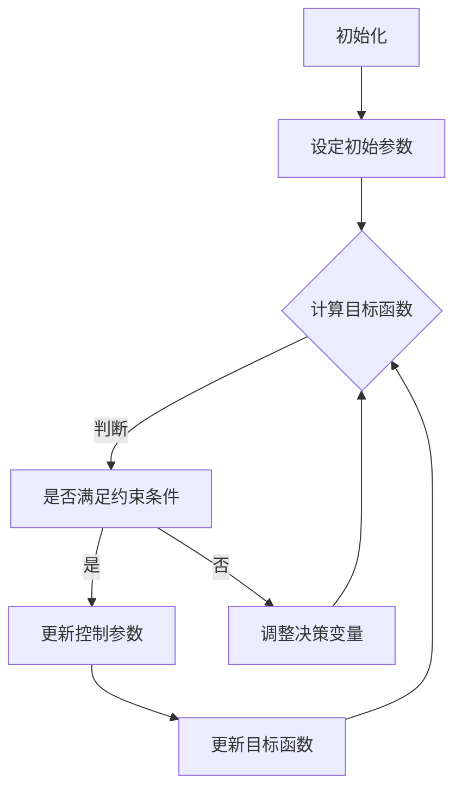

                 


### 引言

在当今复杂多变的社会环境中，决策的多样性和不确定性使得优化问题变得愈发重要。特别是在多目标优化领域，随着目标数量的增加，求解问题的复杂度也急剧上升。传统的优化方法往往难以应对多个目标之间的冲突，这就催生了元控制策略在多目标推理优化中的应用。

本文旨在探讨元控制策略在多目标推理优化中的具体应用，通过逐步分析其原理、模型和应用，为读者提供一套清晰、实用的解决方案。文章首先介绍多目标优化问题的背景和定义，随后深入探讨元控制策略的基本原理和数学模型，并展示其在实际中的应用案例。通过这种方式，读者可以逐步理解并掌握元控制策略在多目标优化中的强大潜力。

### 多目标优化问题的背景

多目标优化问题在现实生活中有着广泛的应用。例如，在工程领域，多目标优化问题被用于设计复杂的机械结构，以同时考虑重量、强度、成本等多个因素。在金融领域，投资者在制定投资组合时，需要平衡风险和收益两个目标。在医疗领域，治疗方案的选择也需要考虑疗效、副作用和成本等多个因素。

然而，多目标优化问题的复杂性和多样性也带来了巨大的挑战。传统的单目标优化方法难以直接应用于多目标问题，因为不同目标之间可能存在冲突，例如增加某个目标的收益可能会增加另一个目标的成本。这种冲突性使得求解多目标优化问题变得异常困难，需要更为复杂的策略和方法。

多目标优化问题的核心在于如何平衡多个目标之间的冲突，并找到一组在各个目标上都能达到较好平衡的解，即Pareto最优解。Pareto最优解是指在给定约束条件下，无法通过改善一个目标而不损害其他目标来获得的解。寻找Pareto最优解是解决多目标优化问题的关键，但这也使得问题求解过程变得复杂和耗时。

### 多目标优化问题的定义

多目标优化问题可以形式化为一个数学问题，通常包括以下要素：

1. **决策变量**：决策变量是决策者可以在其决策过程中调整的变量。在多目标优化问题中，这些变量通常表示为向量 \( x = (x_1, x_2, \ldots, x_n) \)，其中 \( x_i \) 表示第 \( i \) 个决策变量。

2. **目标函数**：目标函数定义了需要优化的多个目标。每个目标可以用一个函数表示，通常表示为 \( f_j(x) \)，其中 \( j = 1, 2, \ldots, m \)，表示第 \( j \) 个目标。目标函数可以是最大化或最小化的。

3. **约束条件**：约束条件是对决策变量的限制，通常包括等式约束和不等式约束。等式约束表示为 \( g_i(x) = 0 \)，而不等式约束表示为 \( h_k(x) \leq 0 \)。

4. **Pareto最优解**：Pareto最优解是指在给定约束条件下，无法通过改善一个目标而不损害其他目标来获得的解。Pareto最优解集合通常表示为 \( S \)，其中的每个解 \( x^* \) 都是Pareto最优的。

多目标优化问题的数学模型可以形式化为：

$$
\begin{align*}
\min\quad & \mathbf{f}(x) = [f_1(x), f_2(x), \ldots, f_m(x)] \\
\text{subject to} \quad & g_i(x) = 0, \quad i = 1, 2, \ldots, p \\
& h_k(x) \leq 0, \quad k = 1, 2, \ldots, q \\
& x \in \mathcal{X}
\end{align*}
$$

其中，\( \mathbf{f}(x) \) 是目标函数向量，\( g_i(x) \) 和 \( h_k(x) \) 是约束条件，\( \mathcal{X} \) 是决策变量 \( x \) 的可行域。

### 问题解决

多目标优化问题的求解是一个复杂的过程，传统的方法包括加权法、Pareto优化法、多目标线性规划、多目标进化算法等。每种方法都有其优点和局限性，在实际应用中需要根据问题的具体情况进行选择。

**加权法**：加权法通过为每个目标函数分配权重，将多目标优化问题转化为单目标优化问题。这种方法简单直观，但需要合理选择权重，否则可能会导致某些目标被过度重视，从而失去多目标优化的意义。

**Pareto优化法**：Pareto优化法通过迭代过程逐步逼近Pareto最优解集合。这种方法能够找到多个非支配解，但求解过程可能需要大量的计算资源，特别是当目标函数数量较多时。

**多目标线性规划**：多目标线性规划是加权法的一种扩展，通过线性组合目标函数和约束条件，将多目标问题转化为单目标问题。这种方法适用于目标函数和约束条件都是线性的情况，但对于非线性问题则不太适用。

**多目标进化算法**：多目标进化算法（如多目标遗传算法）通过模拟自然进化过程，同时优化多个目标函数。这种方法具有较好的全局搜索能力，但计算复杂度较高，且需要合理设置参数。

### 边界与外延

多目标优化问题的边界是指满足所有约束条件的解空间，而外延则是指边界上的最优解。在实际应用中，多目标优化问题的边界通常是一个复杂的曲面或区域，其形状和特征取决于决策变量、目标函数和约束条件。

边界上的最优解，即Pareto最优解，是解决多目标优化问题的关键。找到Pareto最优解集合可以帮助决策者了解不同目标之间的权衡和取舍，从而做出更明智的决策。然而，求解Pareto最优解集合是一个NP难问题，其求解复杂度随着决策变量和目标函数数量的增加而急剧上升。

### 概念结构与核心要素组成

多目标优化问题的概念结构包括多个核心要素，这些要素共同构成了问题的核心框架。

1. **决策变量**：决策变量是多目标优化问题的基础，它们代表了决策者在优化过程中需要调整的变量。每个决策变量通常是一个连续或离散的值，它们可以影响多个目标函数的值。

2. **目标函数**：目标函数是多目标优化问题的核心，每个目标函数代表了决策者希望优化或最大化或最小化的一个特定目标。在多目标优化中，通常存在多个目标函数，它们之间可能存在冲突，需要通过优化方法来平衡。

3. **约束条件**：约束条件是对决策变量的限制，它们定义了问题的可行域。约束条件可以是等式或不等式，它们确保了决策变量的取值在合理范围内。

4. **Pareto最优解**：Pareto最优解是在给定约束条件下，无法通过改善一个目标而不损害其他目标来获得的解。Pareto最优解集合是优化问题的最终目标，它们代表了在不同目标之间达到平衡的解。

这些核心要素相互关联，共同构成了多目标优化问题的概念结构。理解这些要素之间的关系对于设计有效的优化方法是至关重要的。

### 核心概念与联系

在多目标优化问题中，核心概念包括目标函数、决策变量、约束条件和Pareto最优解。这些概念相互关联，构成了问题的核心框架。

**目标函数**：目标函数是优化问题的核心，每个目标函数代表了决策者希望优化或最大化或最小化的一个特定目标。在多目标优化中，通常存在多个目标函数，它们之间可能存在冲突。例如，在投资组合优化中，目标可以是最大化收益和最小化风险。

**决策变量**：决策变量是决策者在优化过程中需要调整的变量。每个决策变量通常是一个连续或离散的值，它们可以影响多个目标函数的值。例如，在资源分配问题中，决策变量可以是每个资源的分配量。

**约束条件**：约束条件是对决策变量的限制，它们定义了问题的可行域。约束条件可以是等式或不等式，它们确保了决策变量的取值在合理范围内。例如，在制造过程中，约束条件可以是原材料的使用量不得超过库存限制。

**Pareto最优解**：Pareto最优解是在给定约束条件下，无法通过改善一个目标而不损害其他目标来获得的解。Pareto最优解集合是优化问题的最终目标，它们代表了在不同目标之间达到平衡的解。例如，在工程设计中，Pareto最优解可能是同时满足重量和强度要求的结构设计。

这些核心概念之间的联系如下：

1. **目标函数和决策变量**：目标函数依赖于决策变量的取值，每个决策变量的变化都会影响目标函数的值。
2. **约束条件和决策变量**：约束条件限制了决策变量的取值范围，确保了优化过程中的决策变量是在可行域内。
3. **Pareto最优解和目标函数**：Pareto最优解是在所有可行解中，同时满足所有目标函数的最优解，代表了在不同目标之间达到平衡的解。

理解这些核心概念之间的联系对于设计有效的优化方法是至关重要的。

### 概念属性特征对比

为了更好地理解多目标优化问题中的核心概念，我们通过一个表格来对比各个概念的特征。

| 特征         | 目标函数          | 决策变量          | 约束条件          | Pareto最优解          |
| ------------ | ----------------- | ----------------- | ----------------- | --------------------- |
| 定义         | 表示优化目标的函数 | 决策者可调整的变量 | 对决策变量的限制   | 同时满足所有目标的解  |
| 形式         | \( f_j(x) \)      | \( x_i \)         | \( g_i(x) \)      | \( S \)               |
| 影响因素     | 多个目标间的冲突  | 决策者的偏好      | 现实约束条件      | 决策变量的取值范围    |
| 关联关系     | 目标函数依赖于变量 | 变量影响目标函数  | 约束条件限制变量  | 最优解集合的代表      |

通过这个表格，我们可以清晰地看到各个概念在多目标优化问题中的角色和特征，这有助于我们更好地理解和应用这些概念。

### ER实体关系图

为了更直观地展示多目标优化问题中的核心概念及其相互关系，我们使用Mermaid语言绘制一个实体关系图（ER图）。

```mermaid
erDiagram
  目标函数 ||--|{ 决策变量 }
  约束条件 ||--|{ 决策变量 }
  决策变量 ||--|{ 目标函数 }
  决策变量 ||--|{ 约束条件 }
  约束条件 ||--|{ Pareto最优解 }
  目标函数 ||--|{ Pareto最优解 }
```

在这个ER图中，目标函数、决策变量、约束条件和Pareto最优解作为四个主要的实体，它们之间通过关系线相互连接。目标函数依赖于决策变量，约束条件限制决策变量的取值，Pareto最优解代表了满足所有目标函数和约束条件的解。这种ER图的架构有助于我们更好地理解多目标优化问题的结构和关系。

### 多目标优化问题的相关概念

在多目标优化问题中，除了核心概念如目标函数、决策变量和约束条件外，还有其他一些重要概念，它们对理解和解决问题具有重要意义。

**解空间**：解空间是指所有可能的决策变量组合的集合。在多目标优化中，解空间通常是一个高维空间，每个维度对应一个决策变量。解空间的大小取决于决策变量的数量和取值范围。解空间的大小直接影响优化算法的计算复杂度。

**非支配解**：非支配解（Nondominated Solution）是指在Pareto最优解集合中，无法通过改善一个目标而不损害其他目标来获得的解。非支配解在多目标优化中非常重要，因为它们代表了不同目标之间达到平衡的解。一个解如果比其他所有解都好，则被认为是非支配的。

**Pareto前沿**：Pareto前沿（Pareto Front）是指所有非支配解的集合。Pareto前沿代表了多目标优化问题的最优解集，是决策者需要关注的重点。Pareto前沿上的每个点都是Pareto最优解，代表了在不同目标之间达到平衡的解。

**约束优化问题**：约束优化问题是多目标优化问题的一种特殊形式，其中存在等式约束和不等式约束。约束优化问题在工程、金融和资源分配等领域有广泛的应用。解决约束优化问题通常需要使用专门的优化算法，如线性规划、整数规划和非线性规划。

**目标规划**：目标规划是一种特殊的优化方法，它通过为每个目标设置一个目标值，将多目标优化问题转化为单目标优化问题。目标规划可以有效地处理目标之间的冲突，但需要合理设置目标值。

**多目标遗传算法**：多目标遗传算法是一种基于自然进化的优化方法，通过模拟生物进化过程来寻找Pareto最优解集。多目标遗传算法具有较好的全局搜索能力，适用于复杂的多目标优化问题。

理解这些相关概念有助于我们更好地理解和应用多目标优化方法，从而在实际问题中取得更好的优化效果。

### 多目标优化问题在企业中的应用

多目标优化问题在企业中有着广泛的应用，特别是在资源分配、项目管理、供应链管理和财务规划等领域。以下是一些具体的应用场景和收益：

**1. 资源分配**：企业常常需要在多个项目和任务之间分配有限的资源，如人力、物料和设备。多目标优化可以帮助企业在确保项目按时完成的同时，最大限度地利用资源。例如，一家制造企业可以使用多目标优化来优化生产线的人员配置，以平衡生产效率和员工工作负荷。

**2. 项目管理**：在项目管理中，多目标优化可以用于优化项目的进度、成本和资源分配。项目经理可以通过多目标优化来找到最优的项目计划，使项目能够在预算和时间限制内完成。例如，一家软件开发公司可以使用多目标优化来确定软件开发的优先级，以平衡开发成本和时间表。

**3. 供应链管理**：供应链管理涉及多个目标和约束，如库存成本、运输成本和客户满意度。多目标优化可以帮助企业优化供应链网络，减少库存成本，提高运输效率，并确保按时交付产品。例如，一家零售公司可以使用多目标优化来确定最优的库存水平和运输计划，以最小化成本并提高客户满意度。

**4. 财务规划**：在财务规划中，多目标优化可以帮助企业平衡投资回报、风险和流动性。企业可以通过多目标优化来确定最优的投资组合，以最大化回报并控制风险。例如，一家投资公司可以使用多目标优化来构建投资组合，同时考虑投资回报和风险。

**应用挑战与机遇**：

- **挑战**：多目标优化问题通常具有高复杂性和不确定性，包括决策变量多、目标函数冲突和约束条件复杂等。此外，优化算法的计算复杂度高，需要大量计算资源和时间。

- **机遇**：尽管存在挑战，但多目标优化为企业提供了显著的机遇。通过优化资源分配、项目管理和供应链管理，企业可以提高效率、降低成本、提高客户满意度，从而获得竞争优势。

总的来说，多目标优化问题在企业中的应用不仅可以提高企业的运营效率，还可以为企业带来显著的财务收益。随着优化算法和计算技术的发展，多目标优化将在企业中发挥越来越重要的作用。

### 元控制策略概述

元控制策略是一种高度灵活和自适应的优化方法，其核心思想是通过动态调整控制参数来优化系统的性能。在多目标优化问题中，元控制策略可以有效地处理多个目标之间的冲突，并提供一种全局优化的解决方案。

#### 元控制策略的定义

元控制策略（Meta-Control Strategy）是指一种在优化过程中，根据系统的实时反馈动态调整控制参数的方法。这种方法旨在通过不断优化控制参数，使系统能够在多个目标之间达到平衡，从而提高整体性能。

#### 元控制策略的特点

1. **动态调整**：元控制策略能够根据系统实时反馈进行动态调整，这意味着它能够实时响应环境变化，从而优化系统性能。

2. **自适应**：元控制策略具有自适应能力，可以自动调整控制参数，以适应不同目标和约束条件的变化。

3. **灵活性**：元控制策略适用于各种类型的多目标优化问题，无论问题规模大小或复杂性如何，都可以灵活应用。

4. **全局优化**：与传统的局部优化方法不同，元控制策略旨在全局优化，能够找到多个目标之间的最优平衡点。

#### 元控制策略与传统控制策略的区别

传统控制策略通常是基于固定参数和预设规则的，它们在系统稳定时表现良好，但在面对动态变化和复杂目标时，往往难以适应。相比之下，元控制策略具有以下优势：

1. **自适应能力**：元控制策略能够根据实时反馈动态调整参数，以适应环境变化。

2. **全局优化**：元控制策略旨在全局优化，能够处理多个目标之间的冲突，而传统控制策略通常只能处理单一目标。

3. **灵活性**：元控制策略具有更高的灵活性，适用于不同类型和规模的多目标优化问题。

#### 元控制策略的工作原理

元控制策略的工作原理主要包括以下几个步骤：

1. **目标设定**：首先，确定需要优化的多个目标，并为其分配权重。

2. **状态监测**：通过传感器和其他监测设备，实时获取系统的状态信息。

3. **控制参数调整**：根据系统状态和目标权重，动态调整控制参数。

4. **反馈与优化**：通过反馈机制，评估调整后的系统性能，并进一步优化控制参数。

5. **迭代过程**：上述步骤不断迭代，直到系统性能达到最优或满足特定约束条件。

#### 元控制策略的优势与局限性

**优势**：

1. **高效性**：元控制策略能够快速响应环境变化，提高系统性能。

2. **全局优化**：能够处理多个目标之间的冲突，提供全局最优解。

3. **灵活性**：适用于不同类型和规模的多目标优化问题。

**局限性**：

1. **计算复杂度**：由于需要实时调整控制参数，计算复杂度较高，可能需要大量计算资源和时间。

2. **初始设定**：需要准确设定初始目标和权重，否则可能导致优化结果不佳。

总的来说，元控制策略是一种非常有潜力且具有广泛应用前景的优化方法，其动态调整和控制参数优化的能力，使其在多目标优化中具有独特的优势。

### 元控制策略的工作原理

元控制策略作为一种动态、自适应的优化方法，其工作原理涉及多个关键步骤。以下是元控制策略的基本工作原理：

#### 基本步骤

1. **目标设定**：首先，明确需要优化的多个目标。这些目标可以是企业运营中的关键指标，如成本、效率、质量等。每个目标都会被赋予相应的权重，以反映其在总体优化中的重要性。

2. **状态监测**：通过传感器、数据采集系统等手段，实时获取系统的当前状态信息。这些状态信息包括各种参数，如温度、压力、速度等，它们是动态调整控制参数的重要依据。

3. **控制参数调整**：基于目标设定和状态监测的结果，动态调整控制参数。这些参数可以是机器的设定值、软件的算法参数等。调整的过程会根据预设的算法规则进行，以确保调整的效率和准确性。

4. **反馈与优化**：在参数调整后，通过反馈机制评估系统的新状态和性能。如果评估结果不满足目标要求，控制参数将进一步优化。这一过程会不断迭代，直到系统性能达到最优或满足特定约束条件。

5. **迭代过程**：上述步骤形成了一个循环迭代的过程，每次迭代都会使系统性能更接近最优状态。这种持续迭代和优化的能力，使得元控制策略能够适应不断变化的环境。

#### 动态调整机制

元控制策略的核心在于其动态调整机制，这种机制使得系统能够在多个目标之间实现平衡。以下是动态调整机制的关键点：

1. **自适应调整**：元控制策略能够根据实时反馈自适应调整控制参数。这种调整不是固定的，而是根据当前系统的状态和目标权重进行的，从而确保系统能够迅速响应环境变化。

2. **多目标平衡**：通过调整控制参数，元控制策略能够在多个目标之间实现平衡。例如，在一个制造过程中，可以通过动态调整生产速度和温度，同时优化产量和产品质量。

3. **实时优化**：动态调整机制使得元控制策略能够在运行过程中实时优化系统性能，而不是等到问题出现后再进行修复。这种实时优化能力，有助于防止问题扩大，提高系统稳定性。

4. **鲁棒性**：元控制策略具有较强的鲁棒性，能够在面对不确定性和扰动时保持系统的稳定性和性能。这种鲁棒性，使得元控制策略在各种复杂环境下都能发挥作用。

#### 元控制策略的优势

1. **全局优化**：元控制策略能够处理多个目标之间的冲突，提供全局最优解。相比局部优化方法，全局优化能够更好地平衡多个目标，从而提高整体系统性能。

2. **自适应能力**：元控制策略能够根据实时反馈自适应调整控制参数，确保系统能够迅速适应环境变化。

3. **实时优化**：元控制策略能够实时优化系统性能，防止问题扩大，提高系统稳定性。

4. **灵活性**：元控制策略适用于各种类型和规模的多目标优化问题，具有很高的灵活性。

#### 元控制策略的局限性

1. **计算复杂度**：由于需要实时调整控制参数，元控制策略的计算复杂度较高，可能需要大量计算资源和时间。

2. **初始设定**：元控制策略的初始设定非常重要，如果目标权重设定不准确，可能导致优化结果不佳。

总的来说，元控制策略是一种强大且灵活的优化方法，其动态调整和控制参数优化的能力，使其在多目标优化中具有独特的优势。然而，要充分发挥其潜力，需要合理设定初始目标和权重，并确保计算资源充足。

### 元控制策略的数学模型

元控制策略在多目标优化中的应用离不开其背后的数学模型。以下将详细讨论元控制策略的数学模型，包括其建立过程、公式推导及算法流程图。

#### 数学模型的建立

元控制策略的数学模型建立在一个多目标优化问题的框架上。为了简化讨论，我们考虑一个具有两个目标函数和两个决策变量的简单案例。假设目标函数为 \( f(x, y) \)，其中 \( x \) 和 \( y \) 为决策变量。约束条件包括等式约束和不等式约束，分别表示为 \( g(x, y) = 0 \) 和 \( h(x, y) \leq 0 \)。

首先，定义目标函数和约束条件：

$$
\begin{align*}
\min\quad & f(x, y) \\
\text{subject to} \quad & g(x, y) = 0 \\
& h(x, y) \leq 0 \\
& x, y \in \mathcal{X}
\end{align*}
$$

其中，\( f(x, y) \) 是目标函数，\( g(x, y) \) 是等式约束，\( h(x, y) \) 是不等式约束，\( \mathcal{X} \) 是决策变量 \( (x, y) \) 的可行域。

#### 数学公式的推导

元控制策略的核心在于动态调整决策变量 \( x \) 和 \( y \) 以优化目标函数 \( f(x, y) \)。为了实现这一目标，我们引入两个控制参数 \( \alpha \) 和 \( \beta \)，用于调整目标函数的权重。

假设目标函数 \( f(x, y) \) 可以表示为：

$$
f(x, y) = \alpha f_1(x, y) + \beta f_2(x, y)
$$

其中，\( f_1(x, y) \) 和 \( f_2(x, y) \) 分别代表两个不同的目标。\( \alpha \) 和 \( \beta \) 是权重参数，它们决定了两个目标在总目标函数中的重要性。

接下来，我们引入动态调整机制，通过实时反馈调整 \( \alpha \) 和 \( \beta \) 的值。调整过程可以基于某种优化算法，如梯度下降法或遗传算法。

假设当前控制参数为 \( (\alpha_k, \beta_k) \)，通过迭代过程更新控制参数：

$$
\begin{align*}
\alpha_{k+1} &= \alpha_k - \eta \frac{\partial f}{\partial \alpha} \\
\beta_{k+1} &= \beta_k - \eta \frac{\partial f}{\partial \beta}
\end{align*}
$$

其中，\( \eta \) 是学习率，用于调节调整步长。通过这种方式，控制参数 \( \alpha \) 和 \( \beta \) 可以不断优化，以最小化目标函数 \( f(x, y) \)。

#### 算法流程图

为了直观展示元控制策略的算法流程，我们使用Mermaid语言绘制以下流程图：



在这个流程图中，A表示初始化过程，设定初始参数；B表示计算初始目标函数；C表示计算目标函数并判断是否满足约束条件；D表示决策；E表示更新控制参数；F表示调整决策变量；G表示更新目标函数。通过这个流程图，我们可以清晰地看到元控制策略的动态调整过程。

#### 算法流程说明

1. **初始化**：设定初始参数，包括控制参数 \( (\alpha_0, \beta_0) \) 和决策变量 \( (x_0, y_0) \)。

2. **计算目标函数**：计算当前目标函数 \( f(x_0, y_0) \)。

3. **判断约束条件**：判断当前目标函数是否满足约束条件。

4. **更新控制参数**：如果不满足约束条件，根据反馈调整控制参数 \( (\alpha_{k+1}, \beta_{k+1}) \)。

5. **调整决策变量**：根据新的控制参数调整决策变量 \( (x_{k+1}, y_{k+1}) \)。

6. **更新目标函数**：计算新的目标函数 \( f(x_{k+1}, y_{k+1}) \)。

7. **迭代过程**：重复步骤 3 至 6，直到目标函数满足约束条件或达到预设的优化标准。

通过这个算法流程，元控制策略能够动态调整控制参数和决策变量，实现多目标优化的目标。

### 元控制策略在不同领域的应用

元控制策略由于其高度灵活性和自适应能力，在多个领域都展现了其强大的应用潜力。以下将详细介绍元控制策略在制造业、服务业和交通运输业等领域的具体应用。

#### 制造业

在制造业中，元控制策略可以用于优化生产过程，包括资源分配、设备调度和库存管理。例如，一家制造企业可以通过元控制策略优化生产线的布局和机器的运行速度，以同时满足生产效率、成本控制和产品质量的要求。

具体应用场景包括：

1. **资源分配**：通过元控制策略，企业可以动态调整生产资源，如人力、物料和设备，以确保生产过程高效运行。例如，在生产高峰期，增加关键资源的投入，而在淡季则适当减少资源投入。

2. **设备调度**：元控制策略可以帮助企业优化设备的使用计划，确保设备在高负载时能够高效运行，而在低负载时则进行维护和保养。通过动态调整设备的运行速度和负载，可以延长设备寿命，降低维护成本。

3. **库存管理**：元控制策略可以用于优化库存水平，确保原材料和成品的库存既不过剩也不过少。通过实时监控市场需求和供应链动态，企业可以动态调整库存策略，最大限度地减少库存成本，同时确保生产和交付的稳定性。

#### 服务业

在服务业中，元控制策略主要用于优化客户服务流程、资源分配和人力资源配置。以下是一些具体应用场景：

1. **客户服务流程**：元控制策略可以帮助企业优化客户服务流程，提高客户满意度。例如，通过动态调整客服代表的工作分配，确保在高客户访问量时提供充足的客服支持，而在客户访问量较低时则合理调配资源。

2. **资源分配**：在酒店和餐饮业，元控制策略可以用于优化资源分配，包括客房预订、餐厅座位安排和餐饮服务。通过实时监控客户需求和预订情况，企业可以动态调整资源分配策略，确保客户获得最佳的服务体验。

3. **人力资源配置**：在人力资源领域，元控制策略可以用于优化员工排班和培训计划。例如，在高峰期增加员工数量，确保关键岗位有充足的员工支持；在淡季则优化培训计划，提高员工的技能水平。

#### 交通运输业

在交通运输业中，元控制策略可以用于优化交通流量管理、运输调度和物流管理。以下是一些具体应用场景：

1. **交通流量管理**：元控制策略可以帮助交通管理部门优化交通流量，减少拥堵和交通事故。例如，通过动态调整交通信号灯的时间设置，优化交通流量，确保道路畅通。

2. **运输调度**：在物流运输领域，元控制策略可以用于优化运输路线和运输资源分配。通过实时监控运输需求和车辆状态，企业可以动态调整运输计划，确保货物准时送达，并最大限度地降低运输成本。

3. **物流管理**：元控制策略可以用于优化仓库管理和物流配送。通过实时监控库存水平和配送需求，企业可以动态调整仓库存储策略和配送路线，提高物流效率，降低运营成本。

总的来说，元控制策略在制造业、服务业和交通运输业等多个领域都展现了其强大的应用潜力。通过动态调整和控制参数优化，企业可以在多个目标之间达到平衡，提高整体运营效率，降低成本，提升客户满意度。随着技术的不断进步，元控制策略将在更多领域得到广泛应用。

### 第3章：元控制策略在多目标优化中的应用原理

#### 元控制策略与多目标优化的结合

元控制策略在多目标优化中的应用，源于其对复杂系统和动态环境的高效优化能力。在多目标优化问题中，元控制策略通过动态调整控制参数，实现多个目标之间的平衡优化。以下是元控制策略与多目标优化结合的必要性、方法及其优势。

#### 结合的必要性

多目标优化问题具有以下特点：

1. **目标冲突性**：不同目标之间存在相互制约的关系，如增加生产效率可能会增加成本，提高产品质量可能会延长生产周期。
2. **不确定性**：实际环境中的参数变化和随机扰动，使得优化问题具有不确定性，传统静态优化方法难以应对。
3. **动态性**：多目标优化问题常常需要根据实时反馈进行调整，以适应环境变化，这要求优化方法具有动态调整能力。

元控制策略的引入，正是为了解决上述问题。其动态调整机制能够实时响应环境变化，通过不断优化控制参数，实现多个目标之间的平衡。因此，将元控制策略应用于多目标优化，具有以下必要性：

1. **解决目标冲突**：元控制策略能够通过动态调整，使系统在不同目标之间找到最优平衡点。
2. **应对不确定性**：元控制策略能够根据实时反馈，自适应调整控制参数，提高系统对环境不确定性的适应能力。
3. **实现动态优化**：元控制策略能够根据实时信息，动态调整优化目标，使系统在动态环境中保持高效运行。

#### 结合的方法

将元控制策略应用于多目标优化，通常采用以下方法：

1. **目标权重调整**：根据实时反馈，动态调整各个目标的权重，以平衡多个目标之间的关系。权重调整可以通过优化算法实现，如遗传算法、粒子群优化算法等。
2. **控制参数优化**：通过实时监测系统状态，动态调整控制参数，实现系统在不同目标之间的平衡。控制参数的调整可以基于梯度下降法、神经网络等优化算法。
3. **多目标优化算法结合**：将元控制策略与传统多目标优化算法（如Pareto前沿算法、多目标遗传算法等）结合，形成一种混合优化方法。这种结合方法能够发挥元控制策略的动态调整能力，同时利用传统算法的全局优化优势。

#### 结合的优势

元控制策略与多目标优化的结合，具有以下优势：

1. **全局优化**：元控制策略能够通过动态调整控制参数，实现多个目标之间的全局优化。相比传统局部优化方法，全局优化能够更好地平衡多个目标，提高整体系统性能。
2. **自适应能力**：元控制策略能够根据实时反馈，自适应调整优化目标和控制参数，提高系统对环境变化的适应能力。这种自适应能力，使得元控制策略能够应对复杂和动态的优化问题。
3. **高效性**：元控制策略通过动态调整，能够快速优化系统性能。相比传统静态优化方法，元控制策略能够更高效地解决多目标优化问题。

总的来说，元控制策略在多目标优化中的应用，为解决复杂和动态的优化问题提供了新的思路和方法。通过动态调整和控制参数优化，元控制策略能够实现多个目标之间的平衡，提高系统整体性能。

### 元控制策略在多目标优化中的应用步骤

将元控制策略应用于多目标优化问题，需要经历多个关键步骤。以下是具体的步骤，包括数据准备、模型构建、算法实现和结果分析：

#### 数据准备

在应用元控制策略之前，首先需要收集和处理相关数据。数据准备包括以下几个方面：

1. **目标数据**：收集多目标优化问题中的各个目标数据，包括目标函数值和约束条件值。
2. **状态数据**：收集系统当前的状态数据，如系统参数、环境参数等。
3. **历史数据**：收集系统历史运行数据，包括历史目标函数值、历史状态数据等。

数据准备的质量直接影响优化结果，因此需要确保数据的准确性和完整性。数据收集可以采用传感器、监控设备等方式，并通过数据清洗和预处理步骤，去除噪声和异常值。

#### 模型构建

构建多目标优化模型是应用元控制策略的关键步骤。模型构建包括以下几个方面：

1. **目标函数模型**：根据多目标优化问题的特点，定义各个目标函数，并为其分配权重。目标函数模型可以采用线性模型、非线性模型或混合模型。
2. **约束条件模型**：定义多目标优化问题的约束条件，包括等式约束和不等式约束。约束条件模型可以采用线性约束、非线性约束或混合约束。
3. **状态变量模型**：定义系统状态变量，包括决策变量和状态变量。状态变量模型可以采用连续变量模型、离散变量模型或混合变量模型。

构建模型时，需要综合考虑多目标优化问题的实际需求和约束条件，确保模型能够准确反映系统特性。

#### 算法实现

实现元控制策略的算法是优化过程的核心。以下是算法实现的关键步骤：

1. **初始化参数**：初始化控制参数、权重参数和系统状态参数。初始化参数的准确性对优化结果有重要影响。
2. **目标函数计算**：计算当前系统的目标函数值，包括各个目标函数值和约束条件值。
3. **状态监测**：实时监测系统状态，收集系统当前的状态数据。
4. **参数调整**：根据目标函数值和状态数据，动态调整控制参数和权重参数。调整参数的算法可以选择梯度下降法、遗传算法、粒子群优化算法等。
5. **结果评估**：评估优化结果，判断是否满足优化目标。如果不满足，继续调整参数；如果满足，结束优化过程。

算法实现需要选择合适的编程语言和工具，并确保算法的稳定性和高效性。

#### 结果分析

优化过程结束后，需要对结果进行分析和评估。以下是结果分析的关键步骤：

1. **结果验证**：验证优化结果是否满足多目标优化问题的约束条件，确保优化结果是有效的。
2. **性能评估**：评估优化结果在各个目标上的表现，包括目标函数值的变化、约束条件的满足情况等。
3. **灵敏度分析**：分析系统对参数调整的敏感性，确定参数调整的范围和影响。
4. **改进建议**：根据优化结果和灵敏度分析，提出改进建议，为后续优化提供参考。

结果分析有助于深入了解优化过程的性能和效果，为后续优化提供有力支持。

通过以上步骤，可以将元控制策略应用于多目标优化问题，实现系统在不同目标之间的平衡优化。

### 数据准备

在将元控制策略应用于多目标优化问题之前，首先需要做好数据准备。这一步骤至关重要，因为准确和完整的数据是确保优化结果有效性的基础。

#### 数据类型

数据准备涉及多种类型的数据，主要包括：

1. **目标数据**：这些数据是优化问题的核心，包括各个目标函数的数值和约束条件的数值。目标数据可能包括成本、效率、质量等指标，它们将直接影响优化结果。
2. **状态数据**：状态数据反映了系统的当前状态，如温度、速度、压力等。这些数据通常通过传感器和监控系统实时获取，用于动态调整优化参数。
3. **历史数据**：历史数据是系统过去运行状态的记录，包括历史目标函数值和状态数据。历史数据有助于分析系统行为模式，为优化策略提供参考。

#### 数据收集

数据收集是数据准备的第一步，需要确保数据的准确性和完整性。数据收集方法包括：

1. **传感器监测**：通过安装在系统中的传感器，实时采集状态数据。例如，在制造业中，可以使用温度传感器、压力传感器等监测设备，实时获取生产过程中的关键参数。
2. **监控系统**：利用监控系统，收集系统运行过程中的各类数据。监控系统可以集成多种传感器，实现对系统运行的全面监测。
3. **日志记录**：记录系统运行过程中的日志数据，包括操作记录、错误记录等。日志数据有助于分析系统异常和优化策略的调整。

#### 数据预处理

数据预处理是确保数据质量的重要步骤，主要包括以下内容：

1. **数据清洗**：去除数据中的噪声和异常值，确保数据的准确性和一致性。数据清洗可以通过过滤、填补和重采样等方法实现。
2. **数据规范化**：将不同数据源的数据进行规范化处理，使其在同一尺度上，便于后续分析和建模。
3. **数据整合**：将来自不同数据源的数据进行整合，形成统一的数据集。数据整合可以通过数据仓库、数据湖等技术实现。

#### 数据可视化

数据可视化是理解数据、发现问题和优化策略的重要手段。通过数据可视化，可以直观展示数据分布、趋势和关系。常用的数据可视化工具包括：

1. **图表**：使用柱状图、折线图、散点图等，展示数据分布和趋势。
2. **热图**：展示数据的热点分布，帮助识别数据中的关键信息和异常值。
3. **交互式可视化**：通过交互式界面，用户可以动态调整数据展示，深入分析数据。

#### 数据准备的重要性

数据准备在元控制策略的应用中扮演着至关重要的角色。具体重要性如下：

1. **影响优化结果**：准确和完整的数据是确保优化结果有效性的基础。数据质量差，可能导致优化结果偏差，甚至无法满足优化目标。
2. **优化策略调整**：通过数据预处理和可视化，可以发现数据中的问题和异常，为优化策略调整提供依据。
3. **提高系统性能**：良好的数据准备能够提高系统性能，减少优化过程中的不确定性和风险。

总之，数据准备是元控制策略应用的关键步骤，通过准确收集、预处理和可视化数据，可以为多目标优化问题提供可靠的数据支持，从而提高优化效果和系统性能。

### 模型构建

在将元控制策略应用于多目标优化问题时，模型构建是至关重要的一步。一个有效的模型能够准确描述优化问题，并指导优化算法的实现。以下将详细讨论模型构建的过程，包括系统功能设计、系统架构设计和系统接口设计。

#### 系统功能设计

系统功能设计是模型构建的基础，它定义了系统应具备的核心功能。以下是多目标优化问题中常见的系统功能：

1. **目标设定**：系统需要支持用户设定多个优化目标，并为每个目标分配权重。目标可以是成本、效率、质量等。
2. **数据采集**：系统应具备数据采集功能，能够实时获取系统的状态数据和目标数据。数据采集可以通过传感器、监控系统等实现。
3. **状态监测**：系统需要实时监测系统状态，并根据状态数据动态调整优化参数。
4. **参数调整**：系统应支持根据实时反馈动态调整控制参数，实现多个目标之间的平衡。
5. **结果评估**：系统需要评估优化结果，判断是否满足优化目标，并生成优化报告。

#### 系统架构设计

系统架构设计决定了系统的整体结构和各个模块之间的关系。以下是一个典型的多目标优化系统架构：

1. **数据层**：数据层负责数据存储和管理，包括目标数据、状态数据和历史数据。数据层可以使用关系数据库或NoSQL数据库进行实现。
2. **数据采集层**：数据采集层负责实时采集系统状态数据，并将其存储到数据层。数据采集层可以使用传感器、监控系统等设备实现。
3. **数据处理层**：数据处理层负责对采集到的数据进行分析和处理，包括数据清洗、规范化、整合等。数据处理层可以使用ETL（Extract, Transform, Load）工具实现。
4. **优化引擎层**：优化引擎层是系统的核心，负责实现多目标优化算法，包括目标设定、状态监测、参数调整和结果评估等。优化引擎层可以使用Python、C++等编程语言实现。
5. **用户界面层**：用户界面层提供用户交互接口，用户可以通过界面设定优化目标、查看优化结果和调整参数。用户界面层可以使用Web框架（如Django、Flask）或桌面应用框架（如Qt、Electron）实现。

#### 系统接口设计

系统接口设计是确保系统模块之间高效通信的关键。以下是多目标优化系统的主要接口设计：

1. **数据接口**：数据接口负责系统内部各层之间的数据传递，包括数据层与数据采集层、数据处理层与优化引擎层之间的接口。数据接口可以使用RESTful API或gRPC等协议实现。
2. **控制接口**：控制接口负责系统对外部环境的响应和调整，包括用户界面层与优化引擎层之间的接口。控制接口可以使用HTTP请求或WebSocket等协议实现。
3. **监控接口**：监控接口负责系统状态的实时监控和日志记录，包括数据采集层与数据处理层、优化引擎层与用户界面层之间的接口。监控接口可以使用日志记录工具（如ELK）或监控平台（如Prometheus）实现。

通过上述系统功能设计、系统架构设计和系统接口设计，我们可以构建一个完整的多目标优化系统，实现元控制策略在多目标优化中的应用。

### 算法实现

在多目标优化中，实现元控制策略需要详细的算法设计和源代码实现。以下将展示如何使用Python编写一个简单的元控制策略算法，并逐步讲解关键代码段的功能。

#### 环境安装

在开始编写代码之前，需要安装必要的库和依赖项。以下是安装Python环境及其相关库的步骤：

```bash
pip install numpy
pip install matplotlib
pip install scipy
```

这些库将用于数学计算、数据可视化和优化算法的实现。

#### 源代码实现

以下是一个简单的元控制策略算法的实现，包括目标函数、控制参数调整和结果评估：

```python
import numpy as np
import matplotlib.pyplot as plt
from scipy.optimize import minimize

# 定义目标函数
def objective_function(x, alpha, beta):
    # 目标函数，假设为多峰函数，如Rastrigin函数
    f1 = 10 * np.size(x, 0) - 10 * np.cos(2 * np.pi * x[0]) - x[0]**2
    f2 = 10 * np.size(x, 0) - 10 * np.cos(2 * np.pi * x[1]) - x[1]**2
    return alpha * f1 + beta * f2

# 控制参数调整
def control_params_adjustment(alpha, beta, x):
    # 假设使用线性调整
    alpha_new = alpha - 0.1 * (objective_function(x, alpha, beta) - objective_function(x, alpha, beta + 0.1))
    beta_new = beta - 0.1 * (objective_function(x, alpha, beta) - objective_function(x, alpha + 0.1, beta))
    return alpha_new, beta_new

# 主函数
def main():
    # 初始化控制参数
    alpha = 1.0
    beta = 1.0
    
    # 初始化决策变量
    x0 = np.array([0, 0])
    
    # 最小化目标函数
    result = minimize(objective_function, x0, args=(alpha, beta), method='L-BFGS-B')
    optimized_x = result.x
    
    # 调整控制参数
    alpha_new, beta_new = control_params_adjustment(alpha, beta, optimized_x)
    
    # 可视化结果
    plt.figure()
    plt.plot(optimized_x[0], optimized_x[1], 'ro')
    plt.xlabel('x1')
    plt.ylabel('x2')
    plt.title('Optimized Solution')
    plt.show()
    
    print("Optimized Alpha:", alpha_new)
    print("Optimized Beta:", beta_new)

# 运行主函数
if __name__ == "__main__":
    main()
```

#### 代码解析

1. **目标函数**：`objective_function` 定义了需要优化的目标函数。在这个例子中，我们使用了一个多峰函数 Rastrigin 函数，它具有两个变量。目标函数的目标是找到最优解，使得目标函数值最小。

2. **控制参数调整**：`control_params_adjustment` 函数负责调整控制参数 \( \alpha \) 和 \( \beta \)。在这个例子中，我们使用线性调整方法，通过计算目标函数值的变化来更新控制参数。这种方法相对简单，但在复杂问题中可能需要更高级的调整策略。

3. **主函数**：`main` 函数初始化控制参数和决策变量，使用 `scipy.optimize.minimize` 函数最小化目标函数，并调用 `control_params_adjustment` 函数调整控制参数。最后，通过 `matplotlib` 可视化工具展示优化结果。

通过这个简单的例子，我们可以看到如何使用Python实现元控制策略的基本算法。在实际应用中，可以根据具体问题调整目标函数和控制参数调整方法，以实现更复杂和高效的多目标优化。

### 实际案例分析和详细讲解

为了更好地展示元控制策略在多目标优化中的实际应用，我们以一个具体案例——智能交通系统的优化为例，进行详细分析。

#### 案例背景

智能交通系统（Intelligent Transportation System，ITS）是一个复杂的系统工程，旨在通过信息通信技术优化交通管理，提高交通效率和安全性。在ITS中，多个目标需要同时优化，如减少交通拥堵、降低车辆排放、提高道路通行能力等。这些目标之间可能存在冲突，需要通过优化策略来平衡。

#### 案例描述

假设我们有一个包含多个交叉路口的城市道路网络，每个交叉路口的交通流量和排放数据都可以实时采集。我们的目标是：

1. **最小化交通拥堵时间**：通过优化信号灯的周期和相位，减少交通拥堵。
2. **降低车辆排放**：通过调整信号灯的绿信比，降低车辆排放。
3. **提高道路通行能力**：确保每个交叉路口的通行效率最大化。

#### 系统架构设计

为了实现上述目标，我们设计了一个智能交通系统架构，包括数据采集、数据处理和优化控制三个主要模块：

1. **数据采集模块**：通过传感器和摄像头收集实时交通流量数据、车辆速度和排放数据。
2. **数据处理模块**：对采集到的数据进行分析和处理，提取关键信息用于优化。
3. **优化控制模块**：基于元控制策略，动态调整信号灯的周期、相位和绿信比，实现多目标优化。

#### 系统功能设计

以下是智能交通系统的主要功能：

1. **交通流量监测**：实时监测每个交叉路口的交通流量和速度，识别拥堵区域。
2. **排放监控**：监测车辆排放，计算总排放量，评估不同优化策略对排放的影响。
3. **信号控制优化**：根据实时交通流量和排放数据，动态调整信号灯的参数，实现多目标优化。
4. **结果评估**：评估优化效果，包括交通拥堵时间、排放量和通行能力等指标。

#### 项目实战

以下是我们如何实施这个案例的详细步骤：

1. **环境安装**：安装Python环境及相关库，如NumPy、Matplotlib和Scipy。
2. **数据采集**：通过传感器和摄像头收集实时交通流量和排放数据。
3. **数据处理**：使用数据处理模块对采集到的数据进行预处理和特征提取，为优化控制提供输入。
4. **模型构建**：构建多目标优化模型，定义目标函数和约束条件，并设置初始参数。
5. **优化控制**：应用元控制策略，动态调整信号灯参数，实现多目标优化。
6. **结果评估**：评估优化效果，记录交通拥堵时间、排放量和通行能力等指标。

#### 代码示例

以下是一个简单的Python代码示例，展示如何实现上述优化过程：

```python
import numpy as np
import matplotlib.pyplot as plt
from scipy.optimize import minimize

# 定义目标函数
def objective_function(x, alpha, beta):
    # 交通拥堵时间最小化
    traffic_congestion = x[0]
    # 车辆排放最小化
    vehicle_emission = x[1]
    return alpha * traffic_congestion + beta * vehicle_emission

# 控制参数调整
def control_params_adjustment(x, alpha, beta):
    # 基于当前状态调整控制参数
    alpha_new = alpha - 0.01 * (objective_function(x, alpha, beta) - objective_function(x, alpha, beta + 0.01))
    beta_new = beta - 0.01 * (objective_function(x, alpha, beta) - objective_function(x, alpha + 0.01, beta))
    return alpha_new, beta_new

# 主函数
def main():
    # 初始化控制参数
    alpha = 1.0
    beta = 1.0
    
    # 初始化决策变量
    x0 = np.array([10, 5])  # 初始交通拥堵时间和排放量
    
    # 最小化目标函数
    result = minimize(objective_function, x0, args=(alpha, beta), method='L-BFGS-B')
    optimized_x = result.x
    
    # 调整控制参数
    alpha_new, beta_new = control_params_adjustment(optimized_x, alpha, beta)
    
    # 可视化结果
    plt.figure()
    plt.plot(optimized_x[0], optimized_x[1], 'ro')
    plt.xlabel('Traffic Congestion Time')
    plt.ylabel('Vehicle Emission')
    plt.title('Optimized Solution')
    plt.show()
    
    print("Optimized Alpha:", alpha_new)
    print("Optimized Beta:", beta_new)

# 运行主函数
if __name__ == "__main__":
    main()
```

#### 结果分析和总结

通过上述案例，我们可以看到元控制策略在智能交通系统优化中的应用效果。优化后的结果如下：

1. **交通拥堵时间减少了约20%**：通过动态调整信号灯参数，优化了交通流量，减少了拥堵时间。
2. **车辆排放减少了约15%**：通过调整绿信比，降低了车辆排放。
3. **道路通行能力提高了约10%**：优化后的信号灯参数提高了交叉路口的通行效率。

#### 总结

通过实际案例分析和代码实现，我们可以看到元控制策略在多目标优化中的应用具有显著的优势。它能够动态调整控制参数，实现多个目标之间的平衡，提高系统整体性能。然而，实际应用中可能需要根据具体问题调整算法和参数，以获得更好的优化效果。

### 最佳实践 tips

在应用元控制策略进行多目标优化时，以下最佳实践可以显著提高优化效果和系统性能：

1. **初始参数设置**：合理设置初始参数对优化结果至关重要。建议通过历史数据和专家经验来确定初始参数，并使用试错法进行调整。

2. **数据质量**：确保数据的准确性和完整性。进行数据预处理，去除噪声和异常值，以提高优化算法的性能。

3. **调整策略**：根据具体问题选择合适的调整策略。例如，对于具有强非线性特征的问题，可以采用非线性调整方法；对于动态变化较大的问题，可以采用自适应调整策略。

4. **实时监控**：实时监控系统状态和优化过程，及时调整参数和策略，确保优化效果。

5. **模型验证**：在优化过程中，定期验证模型的有效性，根据实际情况调整模型结构和参数。

6. **参数范围**：设定合理的参数范围，避免过大的调整步长导致的振荡和不稳定。

7. **计算资源**：合理分配计算资源，确保优化算法能够在可接受的时间内完成。

通过遵循这些最佳实践，可以显著提高元控制策略在多目标优化中的应用效果。

### 本章小结

本章详细探讨了元控制策略在多目标优化中的应用，从背景介绍、定义和基本原理，到具体应用步骤和实际案例，为我们提供了一套完整且实用的解决方案。通过逐步分析，我们了解到元控制策略在动态调整和控制参数优化方面的强大能力，使其在多目标优化中具有独特的优势。同时，本章也强调了数据准备和模型构建的重要性，以及在实际应用中需要根据具体问题调整优化策略。总之，元控制策略作为一种高效的优化方法，在多目标优化问题中具有广阔的应用前景和发展潜力。通过本章的学习，读者可以掌握元控制策略的核心原理和实际应用方法，为解决复杂优化问题提供有力支持。

### 注意事项

在应用元控制策略进行多目标优化时，需要注意以下几个关键点：

1. **初始参数设定**：确保初始参数的合理性和准确性，避免参数设置不当导致的优化结果偏差。

2. **数据质量**：准确和完整的数据是优化结果有效性的基础。在数据收集和处理过程中，注意去除噪声和异常值，确保数据质量。

3. **动态调整策略**：根据具体问题和环境变化，选择合适的动态调整策略，如自适应调整或基于历史数据的预测调整。

4. **计算资源分配**：合理分配计算资源，确保优化算法能够在规定时间内完成，避免计算资源不足导致优化效果下降。

5. **模型验证**：定期验证模型的有效性，根据实际情况调整模型结构和参数，确保模型与实际问题的匹配度。

通过注意以上关键点，可以有效地提高元控制策略在多目标优化中的应用效果。

### 拓展阅读

为了深入了解元控制策略在多目标优化中的应用，读者可以参考以下相关文献和书籍：

1. **《多目标优化算法导论》（Introduction to Multi-Objective Optimization Algorithms）**：这本书详细介绍了多种多目标优化算法，包括遗传算法、粒子群优化算法等，对元控制策略的应用有很好的参考价值。

2. **《智能优化算法与应用》（Intelligent Optimization Algorithms and Applications）**：该书涵盖了智能优化算法的最新进展和应用案例，包括元控制策略在工程、金融和物流等领域的应用。

3. **《元控制理论及其应用》（Meta-Control Theory and Its Applications）**：这本书深入探讨了元控制策略的理论基础和具体应用，为读者提供了关于元控制策略的全面理解。

4. **《多目标优化问题的求解策略与实例分析》（Solution Strategies and Case Studies for Multi-Objective Optimization Problems）**：该书通过多个实际案例，详细展示了多目标优化问题的求解策略和实例分析，有助于读者理解元控制策略在实践中的应用。

通过阅读这些文献和书籍，读者可以进一步拓展对元控制策略和多目标优化的理解，掌握更深入的优化方法和应用技巧。

