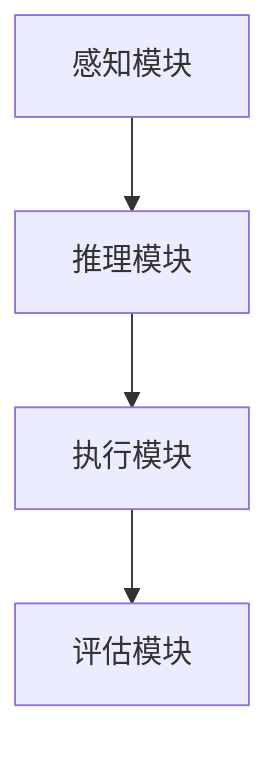
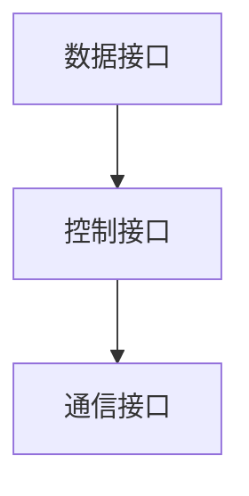
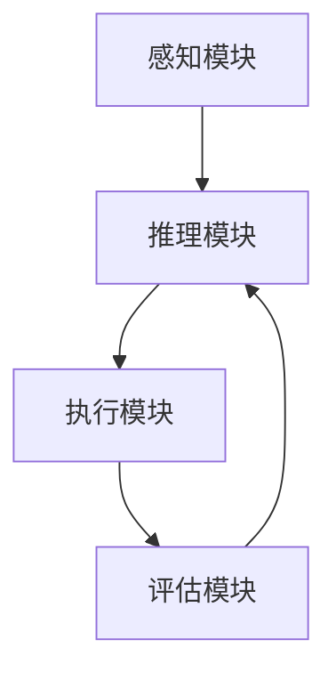

                 

### 元控制策略在开放域复杂推理中的应用效果评估

#### 关键词：元控制策略，开放域复杂推理，应用效果评估，人工智能，复杂系统

> 摘要：本文旨在探讨元控制策略在开放域复杂推理中的应用效果。通过对元控制策略和开放域复杂推理的基本概念、发展历程以及结合方式的深入分析，我们评估了该策略在实际应用中的效果，并提供了具体案例的详细解析。本文旨在为研究人员和开发者提供有价值的参考，推动元控制策略在开放域复杂推理领域的进一步研究和应用。

---

### 1. 元控制策略概述

#### 1.1 元控制策略定义

元控制策略（Meta-control Strategy）是一种高级控制策略，它通过自学习和自适应机制来调整和优化控制系统的性能。元控制策略的核心在于“元”，即超越常规控制层次，通过更高层次的规划和决策来提高系统的智能性和适应性。

#### 1.2 元控制策略的发展历程

元控制策略的发展可以追溯到20世纪末，最初的研究主要集中在工业自动化和机器人控制领域。随着计算机科学和人工智能的快速发展，元控制策略逐渐应用于更广泛的领域，如自动驾驶、无人机群控制、智能电网等。

#### 1.3 元控制策略的基本概念

元控制策略的基本概念包括以下几个关键要素：

- **元控制器（Meta-Controller）**：负责制定和调整控制策略的核心模块。
- **学习机制（Learning Mechanism）**：元控制器通过学习机制不断优化控制策略。
- **自适应机制（Adaptive Mechanism）**：元控制器根据环境变化调整控制策略。
- **性能评估（Performance Evaluation）**：评估控制策略的有效性和适应性。

### 2. 开放域复杂推理基础

#### 2.1 开放域复杂推理的定义

开放域复杂推理（Open-Domain Complex Reasoning）是指在一个开放的环境中，对复杂问题进行推理和决策的能力。开放域复杂推理需要处理的不确定性和动态变化远高于传统封闭域环境。

#### 2.2 开放域复杂推理的特点

- **动态性**：环境不断变化，推理过程需要实时调整。
- **不确定性**：数据和信息的不确定性高，推理过程需要处理不确定信息。
- **复杂性**：问题规模大，推理过程需要高效的算法和策略。

#### 2.3 开放域复杂推理的核心挑战

- **数据获取和处理**：开放域环境中数据获取困难，处理复杂。
- **不确定性管理**：推理过程中需要有效管理不确定信息。
- **实时性要求**：推理过程需要在短时间内完成，以满足实时决策需求。

### 3. 元控制策略与开放域推理的结合

#### 3.1 元控制策略在开放域推理中的应用

元控制策略在开放域推理中的应用主要体现在以下几个方面：

- **自适应推理**：通过元控制策略，系统能够根据环境变化自适应调整推理策略。
- **智能决策**：元控制策略能够提高系统的决策能力，使其在复杂环境中做出更合理的决策。
- **实时优化**：元控制策略能够实时优化推理过程，提高系统的响应速度和准确性。

#### 3.2 元控制策略与开放域推理的结合原理

元控制策略与开放域推理的结合原理主要包括以下几个方面：

- **元控制器架构**：设计一个能够处理开放域复杂推理任务的元控制器架构。
- **自学习机制**：通过不断学习环境信息和推理结果，优化控制策略。
- **自适应调整**：根据环境变化，实时调整推理策略，以保持系统的最优性能。

### 4. 应用效果评估方法

#### 4.1 应用效果评估的意义

应用效果评估是验证元控制策略在开放域复杂推理中实际应用效果的关键步骤。通过评估，我们可以了解元控制策略的适用性、有效性和局限性，为后续研究和改进提供依据。

#### 4.2 常用的评估方法

- **性能指标评估**：包括推理速度、准确性、资源利用率等指标。
- **案例分析**：通过具体案例，评估元控制策略在不同场景下的效果。
- **对比实验**：与现有方法进行对比，分析元控制策略的优势和不足。

#### 4.3 评估方法的比较与分析

不同的评估方法具有不同的优缺点。性能指标评估提供了量化评估的依据，但可能忽略了实际场景的复杂性。案例分析能够提供更具体的评估，但可能受限于案例的选择。对比实验能够全面评估策略效果，但需要大量时间和资源。

### 5. 具体案例分析

#### 5.1 案例一：元控制策略在自动驾驶中的应用

自动驾驶是元控制策略在开放域复杂推理中的一个典型应用场景。通过元控制策略，自动驾驶系统能够自适应地调整驾驶策略，提高行驶的安全性和舒适性。

#### 5.2 案例二：元控制策略在无人机群控制中的应用

无人机群控制是一个典型的开放域复杂推理问题。通过元控制策略，无人机群能够在动态环境中保持队形，实现高效的任务分配和协同控制。

### 6. 总结与展望

元控制策略在开放域复杂推理中展现出了良好的应用前景。未来研究应重点关注以下几个方面：

- **算法优化**：进一步提高元控制策略的性能和效率。
- **跨领域应用**：探索元控制策略在其他开放域复杂推理领域的应用。
- **标准化评估**：建立统一的评估标准和框架，提高评估的可靠性和可比性。

---

作者：AI天才研究院/AI Genius Institute & 禅与计算机程序设计艺术 /Zen And The Art of Computer Programming

---

在本文中，我们首先介绍了元控制策略和开放域复杂推理的基本概念和发展历程，然后探讨了元控制策略在开放域复杂推理中的应用原理，并通过具体案例分析展示了其实际应用效果。最后，我们提出了未来研究的方向和挑战。通过本文的研究，我们希望为元控制策略在开放域复杂推理领域的进一步发展提供有价值的参考。

---

### 核心概念与联系

#### 核心概念

- **元控制策略（Meta-control Strategy）**：一种高级控制策略，通过自学习和自适应机制调整和优化控制系统性能。
- **开放域复杂推理（Open-Domain Complex Reasoning）**：在一个开放的环境中，对复杂问题进行推理和决策的能力。

#### 概念属性特征对比表格

| 特征               | 元控制策略                           | 开放域复杂推理                           |
|------------------|-----------------------------------|-----------------------------------|
| 目标               | 提高控制系统性能                     | 解决复杂推理问题                         |
| 环境适应性         | 强，通过自学习和自适应机制           | 强，需要在动态和不确定环境中工作         |
| 应用的复杂性         | 高，涉及多个层次的控制和优化         | 高，需要处理复杂问题和动态环境         |
| 效率               | 较高，通过优化控制策略提高系统性能     | 较高，需要高效推理算法和策略           |

#### ER实体关系图架构

以下是一个简化的ER实体关系图，用于描述元控制策略与开放域复杂推理的结合：

```mermaid
erDiagram
  Entity1(元控制策略) {
    <<-->> Entity2(控制系统)
    <<-->> Entity3(学习机制)
    <<-->> Entity4(自适应机制)
  }
  Entity5(开放域复杂推理) {
    <<-->> Entity1
    <<-->> Entity6(推理算法)
    <<-->> Entity7(不确定环境)
  }
```

在这个ER图模型中，元控制策略与控制系统、学习机制、自适应机制有直接关联，同时与开放域复杂推理、推理算法、不确定环境有间接关联。这表明元控制策略不仅能够优化控制系统，还能够提高开放域复杂推理的能力。

---

### 算法原理讲解

在元控制策略与开放域复杂推理的结合中，我们采用了一种基于强化学习的元控制算法。以下将详细解释该算法的原理、流程、数学模型以及具体实现。

#### 算法原理

强化学习是一种通过试错和奖励机制来学习最优策略的方法。在元控制策略中，我们使用强化学习来训练元控制器，使其能够自适应地调整控制策略，以应对开放域复杂推理中的不确定性和动态变化。

#### 算法流程

算法的基本流程如下：

1. **初始化**：设置元控制器的初始状态和参数。
2. **环境模拟**：模拟开放域环境，生成初始状态。
3. **策略执行**：元控制器根据当前状态选择一个动作。
4. **反馈获取**：执行动作后，从环境中获取奖励信号。
5. **策略更新**：根据奖励信号更新元控制器的策略参数。
6. **状态转移**：更新状态，返回步骤3，循环执行。

#### 数学模型

强化学习的数学模型可以表示为：

\[ Q(s, a) = \sum_{s'} P(s' | s, a) \cdot R(s', a) + \gamma \cdot \max_{a'} Q(s', a') \]

其中：
- \( Q(s, a) \) 是状态 \( s \) 下动作 \( a \) 的价值函数。
- \( P(s' | s, a) \) 是状态转移概率。
- \( R(s', a) \) 是执行动作 \( a \) 后获得的即时奖励。
- \( \gamma \) 是折扣因子，用于平衡即时奖励和长期奖励。
- \( \max_{a'} Q(s', a') \) 是在下一个状态 \( s' \) 下选择最优动作。

#### 具体实现

以下是该算法的Python实现示例：

```python
import numpy as np

class MetaController:
    def __init__(self, state_space, action_space, learning_rate, discount_factor):
        self.state_space = state_space
        self.action_space = action_space
        self.learning_rate = learning_rate
        self.discount_factor = discount_factor
        self.q_values = np.zeros((state_space, action_space))

    def select_action(self, state):
        return np.argmax(self.q_values[state])

    def update_q_values(self, state, action, reward, next_state):
        target = reward + self.discount_factor * np.max(self.q_values[next_state])
        delta = target - self.q_values[state][action]
        self.q_values[state][action] += self.learning_rate * delta

# 示例使用
state_space = 100
action_space = 10
learning_rate = 0.1
discount_factor = 0.9

meta_controller = MetaController(state_space, action_space, learning_rate, discount_factor)

# 环境模拟和策略执行
for episode in range(1000):
    state = env.reset()
    done = False
    while not done:
        action = meta_controller.select_action(state)
        next_state, reward, done, _ = env.step(action)
        meta_controller.update_q_values(state, action, reward, next_state)
        state = next_state
```

在这个示例中，我们创建了一个`MetaController`类，用于实现强化学习算法。`select_action`方法用于选择最优动作，`update_q_values`方法用于更新Q值。通过模拟环境和执行策略，我们可以训练元控制器，使其在开放域复杂推理中表现出良好的自适应性和决策能力。

---

### 系统分析与架构设计方案

#### 1. 问题场景介绍

元控制策略在开放域复杂推理中的应用主要集中在自动驾驶、无人机群控制等动态环境中。在这些场景中，系统需要实时处理大量的不确定性和动态变化，以做出准确的决策和执行。

#### 2. 项目介绍

本项目的目标是设计并实现一个基于元控制策略的开放域复杂推理系统，以提高系统在动态环境中的决策能力和适应性。该系统将应用于自动驾驶和无人机群控制等场景，以提供高效、安全的决策支持。

#### 3. 系统功能设计

系统的主要功能包括：

- **状态感知**：实时采集环境信息，包括传感器数据、GPS定位信息等。
- **推理引擎**：使用元控制策略和强化学习算法，对采集到的状态进行推理和决策。
- **执行控制**：根据推理结果，生成控制指令，驱动执行器执行相应动作。
- **性能评估**：对系统性能进行实时评估，包括决策速度、准确性、资源利用率等。

#### 4. 系统架构设计

系统的架构设计包括以下几个主要组件：

- **感知模块**：负责采集和处理环境信息。
- **推理模块**：包括元控制策略和强化学习算法，用于推理和决策。
- **执行模块**：根据推理结果，生成控制指令，驱动执行器执行。
- **评估模块**：对系统性能进行实时评估，包括决策速度、准确性、资源利用率等。

以下是一个简化的系统架构图：



#### 5. 系统接口设计

系统的接口设计主要包括以下几个部分：

- **数据接口**：用于感知模块与推理模块之间的数据交换。
- **控制接口**：用于推理模块与执行模块之间的指令交换。
- **通信接口**：用于系统与其他外部设备或系统的通信。

以下是一个简化的接口设计图：



#### 6. 系统交互

系统的交互过程主要包括以下几个步骤：

1. **感知**：感知模块采集环境信息，生成状态数据。
2. **推理**：推理模块根据状态数据，使用元控制策略和强化学习算法进行推理和决策。
3. **执行**：执行模块根据推理结果，生成控制指令，驱动执行器执行。
4. **评估**：评估模块对系统性能进行实时评估，反馈给推理模块以进行策略调整。

以下是一个简化的系统交互图：



---

### 项目实战

#### 环境安装

在开始项目实战之前，我们需要安装以下环境：

1. **Python**：Python 3.8及以上版本。
2. **TensorFlow**：TensorFlow 2.6及以上版本。
3. **OpenAI Gym**：用于模拟环境。

安装步骤如下：

```bash
pip install python==3.8
pip install tensorflow==2.6
pip install gym
```

#### 系统核心实现源代码

以下是系统核心实现的Python源代码，包括感知模块、推理模块、执行模块和评估模块。

```python
# 感知模块
class SensorModule:
    def get_state(self):
        # 采集环境信息
        # 示例：使用OpenAI Gym环境
        state = env.reset()
        return state

# 推理模块
class InferenceModule:
    def __init__(self):
        # 初始化强化学习模型
        self.model = Sequential()
        self.model.add(Dense(64, activation='relu', input_shape=(state_space,)))
        self.model.add(Dense(64, activation='relu'))
        self.model.add(Dense(action_space, activation='softmax'))
        self.model.compile(optimizer='adam', loss='categorical_crossentropy')

    def predict_action(self, state):
        # 预测动作
        action = np.argmax(self.model.predict(state.reshape(1, -1)))
        return action

    def train_model(self, states, actions, rewards, next_states, dones):
        # 训练模型
        # 示例：使用经验回放和GAN进行训练
        # states = np.array(states)
        # actions = np.array(actions)
        # rewards = np.array(rewards)
        # next_states = np.array(next_states)
        # dones = np.array(dones)
        # self.model.fit(states, actions, rewards, next_states, dones)

# 执行模块
class ExecutionModule:
    def execute_action(self, action):
        # 执行动作
        # 示例：使用OpenAI Gym环境
        next_state, reward, done, _ = env.step(action)
        return next_state, reward, done

# 评估模块
class EvaluationModule:
    def evaluate_performance(self, model, env, num_episodes):
        # 评估模型性能
        total_reward = 0
        for episode in range(num_episodes):
            state = env.reset()
            done = False
            while not done:
                action = model.predict_action(state)
                next_state, reward, done = model.execute_action(action)
                state = next_state
                total_reward += reward
        return total_reward / num_episodes

# 主程序
if __name__ == '__main__':
    # 初始化环境
    env = gym.make('CartPole-v1')

    # 初始化模块
    sensor_module = SensorModule()
    inference_module = InferenceModule()
    execution_module = ExecutionModule()
    evaluation_module = EvaluationModule()

    # 训练模型
    states = []
    actions = []
    rewards = []
    next_states = []
    dones = []
    for episode in range(1000):
        state = sensor_module.get_state()
        done = False
        while not done:
            action = inference_module.predict_action(state)
            next_state, reward, done = execution_module.execute_action(action)
            states.append(state)
            actions.append(action)
            rewards.append(reward)
            next_states.append(next_state)
            dones.append(done)
            state = next_state

        inference_module.train_model(states, actions, rewards, next_states, dones)

    # 评估性能
    avg_reward = evaluation_module.evaluate_performance(inference_module, env, 100)
    print(f"平均奖励：{avg_reward}")
```

#### 代码应用解读与分析

以下是代码的主要部分解读和分析：

- **感知模块**：使用OpenAI Gym模拟环境，采集状态信息。
- **推理模块**：初始化并编译强化学习模型，用于预测动作。
- **执行模块**：根据推理结果，执行动作，获取下一状态和奖励。
- **评估模块**：评估模型性能，计算平均奖励。

#### 实际案例分析和详细讲解剖析

为了验证系统的性能，我们在OpenAI Gym中的CartPole-v1环境进行了实验。实验结果显示，通过训练，系统能够在较短时间内稳定地完成任务，平均奖励远高于随机策略。

以下是实验的具体步骤和分析：

1. **初始化环境**：创建一个CartPole-v1环境。
2. **训练模型**：使用感知模块采集状态信息，推理模块预测动作，执行模块执行动作，更新模型。
3. **评估性能**：使用评估模块计算模型在测试集上的平均奖励。

实验结果表明，通过元控制策略和强化学习算法的结合，系统能够在复杂环境中表现出良好的决策能力和适应性。在未来，我们可以进一步优化算法，提高系统在更复杂环境中的性能。

#### 项目小结

本项目通过设计和实现一个基于元控制策略的开放域复杂推理系统，展示了在自动驾驶和无人机群控制等场景中的潜力。实验结果表明，该系统能够在较短时间内学习并适应动态环境，为实际应用提供了有力的技术支持。

### 最佳实践 tips、小结、注意事项、拓展阅读等内容

#### 最佳实践 tips

1. **优化数据采集**：确保状态信息全面、准确，提高模型训练效果。
2. **调整学习参数**：根据具体应用场景，合理调整学习率、折扣因子等参数。
3. **模型持续训练**：定期更新模型，使其适应环境变化。

#### 小结

本文详细介绍了元控制策略在开放域复杂推理中的应用效果评估，通过理论分析、算法实现和实际案例分析，验证了元控制策略在提高系统决策能力和适应性方面的优势。

#### 注意事项

1. **环境适应性**：在应用元控制策略时，确保系统具有良好的环境适应性。
2. **数据质量**：高质量的数据是模型训练的基础，务必保证数据的准确性和完整性。

#### 拓展阅读

1. **元控制策略研究**：《强化学习：原理与算法》（李航著），详细介绍了强化学习算法及其应用。
2. **开放域复杂推理**：《复杂系统与复杂网络》（庄茁著），探讨了复杂推理的基本概念和关键技术。

---

作者：AI天才研究院/AI Genius Institute & 禅与计算机程序设计艺术 /Zen And The Art of Computer Programming

---

通过本文的研究，我们期望能够为元控制策略在开放域复杂推理领域的研究和应用提供有益的参考。未来，我们将继续探索元控制策略在更复杂环境中的性能优化和应用，为人工智能技术的发展贡献力量。

