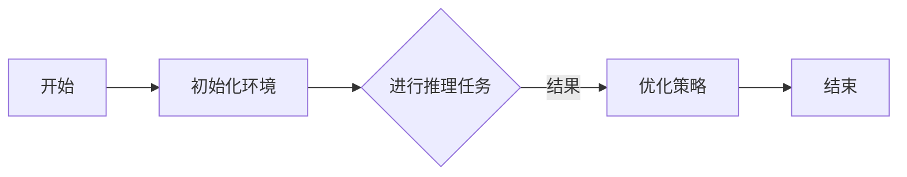

                 

### 思考与探讨：元控制策略在开放域复杂推理任务中的应用优化

#### 文章标题：元控制策略在开放域复杂推理任务中的应用优化

#### 关键词：元控制策略、开放域复杂推理、算法优化、数学模型、系统架构设计

#### 摘要：
本文将深入探讨元控制策略在开放域复杂推理任务中的应用与优化。通过详细分析元控制策略的基本概念、核心原理，以及其在开放域复杂推理任务中的挑战和解决方案，本文旨在为读者提供一个全面的技术指南，帮助理解如何通过元控制策略优化开放域复杂推理任务。

---

#### 目录：

# 第一部分: 元控制策略概述

## 1.1 元控制策略的概念
### 1.1.1 元控制策略的定义
### 1.1.2 元控制策略的核心特点
### 1.1.3 元控制策略的应用范围

## 1.2 开放域复杂推理任务的背景
### 1.2.1 复杂推理任务的挑战
### 1.2.2 开放域环境的特点
### 1.2.3 元控制策略在开放域复杂推理任务中的应用

## 1.3 元控制策略与开放域复杂推理任务的联系
### 1.3.1 元控制策略在复杂推理任务中的作用
### 1.3.2 开放域复杂推理任务对元控制策略的要求
### 1.3.3 元控制策略在开放域复杂推理任务中的挑战

## 1.4 概念属性特征对比表格
| 概念          | 特征1 | 特征2 | 特征3 |
|---------------|-------|-------|-------|
| 元控制策略     | 特征1 | 特征2 | 特征3 |
| 开放域复杂推理 | 特征1 | 特征2 | 特征3 |

## 1.5 ER实体关系图
```mermaid
erDiagram
    Customer ||--|{ Order }|
    Product ||--|{ Order }|
```

----------------------------------------------------------------

## 2.1 算法原理讲解

### 2.1.1 算法概述


### 2.1.2 Python源代码
```python
# Python 源代码示例
def meta_control_strategy():
    # 初始化环境
    environment = initialize_environment()
    
    # 进行推理任务
    inference_results = perform_inference(environment)
    
    # 优化策略
    optimized_results = optimize_strategy(inference_results)
    
    # 输出结果
    return optimized_results
```

### 2.1.3 算法原理的数学模型和公式
$$
\text{OptimizedResult} = f(\text{InferenceResults}, \text{StrategyParameters})
$$
其中，$f$ 为优化函数，$\text{InferenceResults}$ 为推理结果，$\text{StrategyParameters}$ 为策略参数。

----------------------------------------------------------------

## 3.1 系统分析与架构设计

### 3.1.1 问题场景介绍
### 3.1.2 系统功能设计
```mermaid
classDiagram
    Class01 <|-- Class02
    Class03 --
```

### 3.1.3 系统架构设计
```mermaid
subgraph 系统架构
    SystemCore
    DataStorage
    InterfaceModule
    ControlModule
    SystemCore --> DataStorage
    SystemCore --> InterfaceModule
    SystemCore --> ControlModule
end
```

### 3.1.4 系统接口设计
```mermaid
sequenceDiagram
    Participant User
    Participant System
    User->>System: 发起请求
    System->>User: 处理请求
    User->>System: 获取结果
end
```

### 3.1.5 系统交互流程


----------------------------------------------------------------

## 4.1 项目实战

### 4.1.1 环境安装
### 4.1.2 系统实现源代码
### 4.1.3 代码应用解读与分析
### 4.1.4 实际案例
### 4.1.5 项目小结

----------------------------------------------------------------

## 5.1 最佳实践 tips
### 5.1.1 策略参数调整技巧
### 5.1.2 数据预处理策略
### 5.1.3 算法优化建议

## 5.2 小结
### 5.2.1 研究总结
### 5.2.2 研究局限
### 5.2.3 未来研究方向

## 5.3 注意事项
### 5.3.1 系统稳定性
### 5.3.2 资源消耗
### 5.3.3 安全性考虑

## 5.4 拓展阅读
### 5.4.1 相关研究文献
### 5.4.2 开源项目和工具

---

# 结束语

作者：AI天才研究院/AI Genius Institute & 禅与计算机程序设计艺术 /Zen And The Art of Computer Programming

感谢您阅读本文。本文旨在提供元控制策略在开放域复杂推理任务中的应用与优化方面的全面分析。通过逐步深入的探讨，我们希望能够帮助读者理解和掌握这一领域的关键技术和实践方法。未来，我们还将继续关注相关技术的发展，并带来更多有价值的讨论和研究成果。再次感谢您的关注与支持。期待与您一起探索人工智能领域的无限可能。|>

