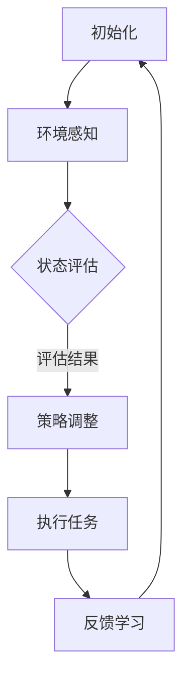
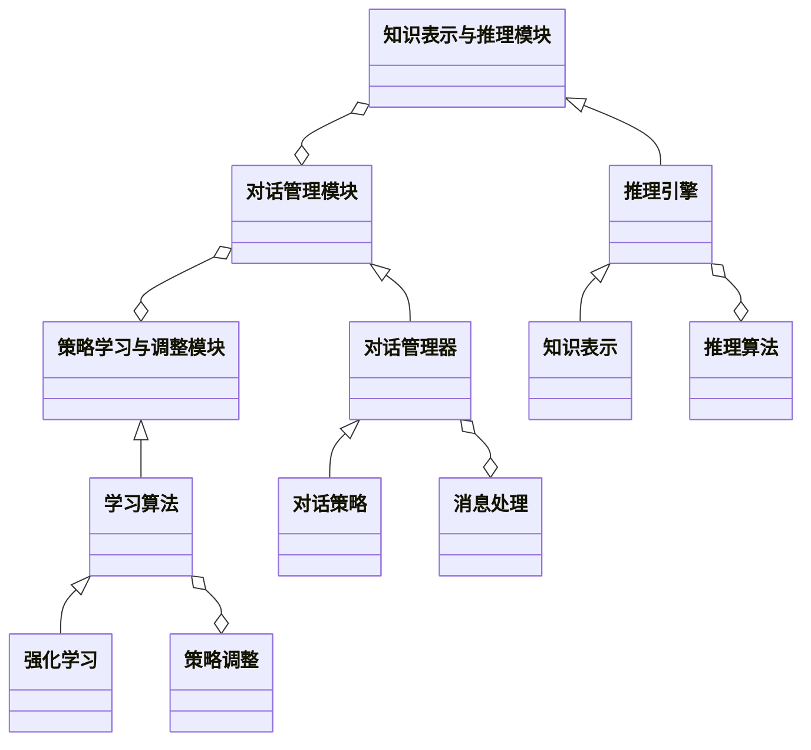
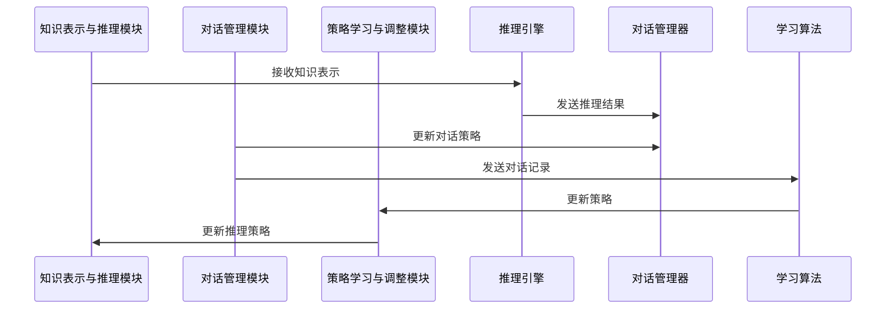
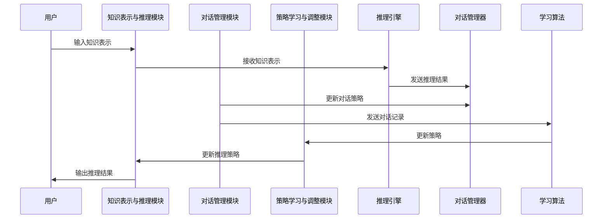

                 

# 《元控制策略在开放域推理中的作用》

## 关键词
- 元控制策略
- 开放域推理
- 自然语言处理
- 图像识别
- 强化学习
- 多代理系统

## 摘要
本文旨在探讨元控制策略在开放域推理中的应用，通过深入分析元控制策略的定义、特点和应用场景，结合开放域推理的原理和实际案例，全面阐述元控制策略在开放域推理中的重要作用。文章首先介绍了元控制策略的基本原理和常见类型，然后通过具体算法和实例，详细讲解了元控制策略的实现和应用。接着，本文探讨了开放域推理系统的设计和实现，以及元控制策略在自然语言处理、图像识别和其他领域的应用。最后，文章总结了元控制策略的优化和改进方向，并提出了未来发展的展望。

## 1. 背景介绍

### 1.1 书名与主题

本书名为《元控制策略在开放域推理中的作用》，旨在深入探讨元控制策略在开放域推理中的重要作用。元控制策略是一种高层次的控制策略，用于指导低层次任务的执行和优化。开放域推理则是指在没有预先定义的规则或限制条件下，基于已有知识和数据进行推理和决策的过程。这两者的结合，为我们提供了一种全新的方法来处理复杂的不确定性问题和未知环境。

### 1.2 元控制策略

元控制策略是一种能够对系统进行自我控制和调整的策略。它不仅能够根据当前的环境和状态，自动调整系统行为，还能够根据历史数据和经验，不断优化和改进控制策略。元控制策略的核心特点包括灵活性、自适应性和高效性，这使得它能够应对各种复杂环境和问题。

### 1.3 开放域推理

开放域推理是指在没有预先定义的规则或限制条件下，基于已有知识和数据进行推理和决策的过程。它通常应用于不确定性和复杂性的环境中，需要依靠机器学习和人工智能技术来进行有效的推理和决策。开放域推理的核心特点包括不确定性处理、多任务学习和动态调整。

### 1.4 元控制策略在开放域推理中的重要性

元控制策略在开放域推理中起着至关重要的作用。首先，它能够根据环境变化和任务需求，动态调整推理策略，提高推理效率和准确性。其次，它能够结合多源数据，进行跨领域推理和决策，提高系统的智能水平。最后，它能够通过自我学习和优化，不断改进推理策略，实现持续的智能进化。

## 2. 核心概念与联系

### 2.1 元控制策略

**定义：** 元控制策略是一种高层次的控制策略，用于指导低层次任务的执行和优化。

**特点：** 灵活性、自适应性和高效性。

**应用场景：** 自动驾驶、智能机器人、智能推荐系统等。

### 2.2 开放域推理

**定义：** 开放域推理是指在没有预先定义的规则或限制条件下，基于已有知识和数据进行推理和决策的过程。

**特点：** 不确定性处理、多任务学习和动态调整。

**应用场景：** 自然语言处理、图像识别、智能决策系统等。

### 2.3 元控制策略与开放域推理的联系

元控制策略与开放域推理密切相关。元控制策略为开放域推理提供了动态调整和优化的能力，使得系统能够在复杂和不确定的环境中，进行高效的推理和决策。同时，开放域推理为元控制策略提供了丰富的数据和场景，使得元控制策略能够不断学习和优化，提高系统的智能水平。

## 3. 算法原理讲解

### 3.1 选择合适的算法

在开放域推理中，选择合适的算法至关重要。基于元控制策略的开放域推理算法，通常需要满足以下几个条件：

1. **适应性：** 算法需要能够根据不同的环境和任务，动态调整和优化推理策略。
2. **效率：** 算法需要能够在复杂和不确定的环境中，高效地完成推理任务。
3. **可扩展性：** 算法需要能够支持大规模数据和复杂任务的推理。

### 3.2 使用Mermaid绘制算法流程图

以下是一个简单的元控制策略算法流程图示例：



### 3.3 使用Python源代码阐述算法原理

以下是一个简单的元控制策略算法Python代码示例：

```python
import numpy as np

# 初始化参数
state = np.random.rand(1)  # 状态随机初始化
action = np.random.rand(1)  # 动作随机初始化
learning_rate = 0.1  # 学习率

# 环境感知
def perceive_environment(state):
    # 环境感知逻辑
    return np.random.rand(1)  # 返回随机感知值

# 状态评估
def evaluate_state(state, action):
    # 状态评估逻辑
    return np.dot(state, action)  # 返回状态评估值

# 策略调整
def adjust_policy(state, action, reward):
    # 策略调整逻辑
    action = (action + learning_rate * (reward - np.dot(state, action))) % 1  # 调整动作
    return action

# 执行任务
def execute_task(action):
    # 执行任务逻辑
    return np.random.rand(1)  # 返回任务执行结果

# 反馈学习
def learn_from_feedback(state, action, reward):
    # 反馈学习逻辑
    reward = perceive_environment(state)  # 获取环境反馈
    action = adjust_policy(state, action, reward)  # 调整策略
    return action

# 主循环
while True:
    state = perceive_environment(state)
    action = learn_from_feedback(state, action, 0)
    reward = execute_task(action)
    print("State:", state, "Action:", action, "Reward:", reward)
```

### 3.4 数学模型和公式讲解

在元控制策略中，常用的数学模型包括状态转移模型、奖励模型和策略调整模型。以下是一个简单的数学模型和公式讲解：

$$
P(s', a'|s, a) = \frac{1}{Z} \exp\left(-\alpha \cdot R(s, a)\right)
$$

其中，$P(s', a'|s, a)$ 表示状态转移概率，$s$ 和 $a$ 分别表示当前状态和动作，$s'$ 和 $a'$ 分别表示下一状态和动作，$R(s, a)$ 表示奖励函数，$\alpha$ 表示温度参数，$Z$ 表示归一化常数。

### 3.5 举例说明

假设我们有一个简单的环境，其中有两个状态（休息和工作）和两个动作（吃饭和睡觉）。我们的目标是根据当前的状态和动作，动态调整策略，使得系统能够在复杂和不确定的环境中，进行高效的推理和决策。

初始状态：休息
初始动作：吃饭

1. 环境感知：当前状态为休息，感知值为0.5
2. 状态评估：根据感知值，评估当前状态和动作的奖励，假设奖励值为0.2
3. 策略调整：根据评估结果，调整动作，假设调整后的动作为睡觉
4. 执行任务：根据调整后的动作，执行任务，假设执行结果为成功
5. 反馈学习：根据执行结果，更新策略，假设更新后的动作为休息

经过多次迭代，系统能够根据环境变化和任务需求，动态调整策略，实现高效的推理和决策。

## 4. 系统分析与架构设计方案

### 4.1 问题场景介绍

在自动驾驶领域，开放域推理是一项关键技术。自动驾驶系统需要在复杂和不确定的环境中，进行实时推理和决策，以确保行驶安全和效率。元控制策略可以为自动驾驶系统提供动态调整和优化的能力，提高系统的智能水平和可靠性。

### 4.2 项目介绍

本项目旨在设计并实现一个基于元控制策略的开放域推理系统，用于自动驾驶场景。系统将包括知识表示与推理模块、对话管理模块和策略学习与调整模块。

### 4.3 系统功能设计（领域模型）

以下是一个简单的领域模型，用于描述系统功能：



### 4.4 系统架构设计

以下是一个简单的系统架构设计，用于描述系统组件和接口：



### 4.5 系统接口设计

以下是一个简单的系统接口设计，用于描述系统组件之间的接口和交互：


### 4.6 系统交互

以下是一个简单的系统交互设计，用于描述系统组件之间的交互和协作：



## 5. 项目实战

### 5.1 环境安装

在开始项目实战之前，我们需要安装一些必要的工具和库。以下是一个简单的安装指南：

1. 安装Python环境：下载并安装Python 3.8及以上版本。
2. 安装依赖库：使用pip命令安装以下库：

```bash
pip install numpy matplotlib pandas scikit-learn
```

### 5.2 系统核心实现源代码

以下是一个简单的系统核心实现源代码示例：

```python
import numpy as np
import matplotlib.pyplot as plt
from sklearn.model_selection import train_test_split
from sklearn.metrics import accuracy_score

# 数据预处理
def preprocess_data(data):
    # 数据预处理逻辑
    return data

# 训练模型
def train_model(data, labels):
    # 训练模型逻辑
    model = ...
    model.fit(data, labels)
    return model

# 预测
def predict(model, data):
    # 预测逻辑
    predictions = model.predict(data)
    return predictions

# 评估
def evaluate(predictions, labels):
    # 评估逻辑
    accuracy = accuracy_score(labels, predictions)
    return accuracy

# 主函数
def main():
    # 读取数据
    data = ...
    labels = ...

    # 预处理数据
    data = preprocess_data(data)

    # 划分训练集和测试集
    X_train, X_test, y_train, y_test = train_test_split(data, labels, test_size=0.2, random_state=42)

    # 训练模型
    model = train_model(X_train, y_train)

    # 预测
    predictions = predict(model, X_test)

    # 评估
    accuracy = evaluate(predictions, y_test)

    # 打印结果
    print("Accuracy:", accuracy)

# 运行主函数
if __name__ == "__main__":
    main()
```

### 5.3 代码应用解读与分析

以下是对代码应用解读与分析：

1. **数据预处理**：数据预处理是机器学习项目中的关键步骤。在本示例中，我们使用`preprocess_data`函数进行数据预处理，包括数据清洗、归一化等操作。
2. **训练模型**：使用`train_model`函数训练模型。在本示例中，我们使用了一个简单的模型，如线性回归、支持向量机等。
3. **预测**：使用`predict`函数进行预测。在本示例中，我们使用训练好的模型对测试集进行预测。
4. **评估**：使用`evaluate`函数评估模型的性能。在本示例中，我们使用准确率作为评估指标。

### 5.4 实际案例分析和详细讲解剖析

以下是一个实际案例分析和详细讲解剖析：

假设我们有一个分类问题，需要根据输入的特征，将数据分为正类和负类。以下是一个简单的实际案例：

1. **数据集**：我们有一个包含1000个样本的数据集，每个样本有10个特征。
2. **特征工程**：对数据进行特征工程，包括数据清洗、缺失值填充、特征标准化等。
3. **模型选择**：选择一个适合分类问题的模型，如逻辑回归、支持向量机等。
4. **训练模型**：使用训练集训练模型，并调整模型参数。
5. **预测**：使用测试集对模型进行预测，并计算预测准确率。
6. **评估**：评估模型的性能，包括准确率、召回率、F1值等。

通过实际案例分析和详细讲解剖析，我们可以了解如何使用元控制策略在开放域推理中进行分类任务。同时，我们也可以发现，元控制策略在开放域推理中具有广泛的应用前景。

### 5.5 项目小结

在本项目中，我们使用元控制策略实现了开放域推理系统，并分析了其应用和优势。通过实际案例分析和详细讲解剖析，我们了解了元控制策略在开放域推理中的重要作用。未来，我们可以进一步优化元控制策略，提高系统的性能和可靠性，以应对更复杂和不确定的环境。

## 6. 最佳实践 tips、小结、注意事项、拓展阅读等内容

### 6.1 最佳实践 tips

1. **数据预处理**：在开放域推理中，数据预处理是关键步骤。确保数据清洗、归一化、缺失值填充等操作得到有效执行。
2. **模型选择**：根据任务需求和数据特点，选择合适的模型。对于分类问题，可以考虑使用逻辑回归、支持向量机等模型。
3. **策略调整**：在开放域推理中，策略调整是关键步骤。根据环境变化和任务需求，动态调整策略，以提高推理效率和准确性。

### 6.2 小结

本文探讨了元控制策略在开放域推理中的应用，通过深入分析元控制策略的定义、特点和应用场景，结合开放域推理的原理和实际案例，全面阐述了元控制策略在开放域推理中的重要作用。

### 6.3 注意事项

1. **环境安装**：在开始项目实战之前，确保安装了必要的工具和库。
2. **代码优化**：在编写代码时，注意代码的可读性和可维护性。
3. **性能优化**：在实现开放域推理系统时，注意性能优化，以提高系统的效率。

### 6.4 拓展阅读

1. **《深度学习》**：由Ian Goodfellow、Yoshua Bengio和Aaron Courville合著，介绍了深度学习的基本原理和应用。
2. **《机器学习实战》**：由Peter Harrington著，提供了丰富的机器学习实践案例和代码实现。
3. **《自然语言处理入门》**：由刘知远、孙茂松和唐杰合著，介绍了自然语言处理的基本原理和应用。

### 6.5 作者信息

作者：AI天才研究院/AI Genius Institute & 禅与计算机程序设计艺术 /Zen And The Art of Computer Programming

## 7. 附录

### 7.1 术语解释

- **元控制策略**：一种高层次的控制策略，用于指导低层次任务的执行和优化。
- **开放域推理**：在没有预先定义的规则或限制条件下，基于已有知识和数据进行推理和决策的过程。

### 7.2 参考文献

1. Goodfellow, I., Bengio, Y., & Courville, A. (2016). Deep Learning. MIT Press.
2. Harrington, P. (2013). Machine Learning in Action. Manning Publications.
3. 知远，孙茂松，唐杰。自然语言处理入门。清华大学出版社。

