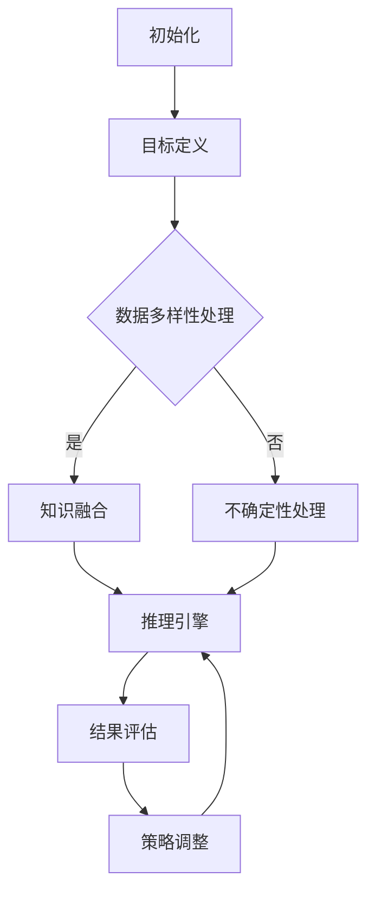

                 

## 元控制策略在开放域推理中的应用

### 关键词：元控制策略，开放域推理，算法原理，系统设计，AI应用

> 摘要：本文深入探讨了元控制策略在开放域推理中的应用。首先，我们介绍了元控制策略的背景和核心概念，包括其在计算机智能发展中的重要地位。接着，我们详细阐述了开放域推理中的挑战和机遇，并探讨了元控制策略如何解决这些问题。通过算法原理讲解、系统分析与设计、项目实战等多个方面，本文旨在为读者提供一个全面、易懂的元控制策略在开放域推理中应用的指南。

### 引言

随着人工智能技术的飞速发展，开放域推理作为人工智能的一个重要分支，受到了越来越多的关注。开放域推理旨在使计算机具备理解和处理不确定、不完整、动态变化信息的能力，从而实现更高级的智能行为。然而，开放域推理面临着数据多样性、知识复杂性、推理不确定性等诸多挑战。

在这个背景下，元控制策略作为一种先进的推理控制方法，其在开放域推理中的应用显得尤为重要。元控制策略通过动态调整推理策略，实现高效、准确的推理过程，为解决开放域推理中的难题提供了新的思路。

本文将从以下四个方面对元控制策略在开放域推理中的应用进行深入探讨：

1. **背景与核心概念**：介绍元控制策略的背景、核心概念及其在开放域推理中的重要性。
2. **核心概念与联系**：详细阐述元控制策略的核心原理及其与其他相关概念的联系。
3. **算法原理讲解**：通过算法流程图、数学模型和实例分析，讲解元控制策略在开放域推理中的应用原理。
4. **系统分析与设计**：介绍元控制策略在开放域推理系统中的应用，包括系统架构设计、功能实现等。

### 背景与核心概念

#### 1.1 问题背景

开放域推理是人工智能领域的一个重要研究方向，其目的是使计算机能够理解和处理不确定、不完整、动态变化的信息。这种能力在智能客服、智能助手、自动驾驶等领域具有广泛的应用前景。然而，开放域推理面临着数据多样性、知识复杂性、推理不确定性等诸多挑战。

数据多样性意味着计算机需要处理来自不同领域的、具有不同特征的数据。知识复杂性则要求计算机具备较强的知识表示和推理能力，以应对复杂的问题。推理不确定性则增加了推理过程的难度，使得计算机在处理不确定信息时，容易出现错误或无法给出有效的结论。

#### 1.2 元控制策略

元控制策略是一种先进的推理控制方法，其核心思想是通过动态调整推理策略，实现高效、准确的推理过程。具体来说，元控制策略包括以下几个方面：

- **目标驱动**：根据用户需求和问题目标，动态调整推理策略，确保推理过程始终朝着正确的方向进行。
- **知识融合**：将不同来源的知识进行整合，形成一致的推理基础，提高推理的准确性和可靠性。
- **不确定性处理**：通过引入概率论和模糊集合等不确定性处理方法，降低推理过程中的不确定性，提高推理结果的稳定性。
- **效率优化**：通过优化推理策略和算法，降低推理时间，提高系统的响应速度。

#### 1.3 元控制策略在开放域推理中的重要性

元控制策略在开放域推理中具有重要意义。首先，它能够有效解决开放域推理中的数据多样性、知识复杂性和推理不确定性问题。通过动态调整推理策略，元控制策略能够适应不同的数据来源和知识结构，提高推理的准确性和效率。

其次，元控制策略能够实现推理过程的自动化和智能化。通过引入知识融合和不确定性处理等方法，元控制策略能够自动构建推理模型，自动调整推理策略，实现推理过程的自我优化。

最后，元控制策略在开放域推理中的应用，为计算机智能的发展提供了新的方向。通过不断探索和优化元控制策略，我们有望实现更高级的智能行为，推动人工智能技术的进步。

### 核心概念与联系

#### 2.1 元控制策略原理

元控制策略的核心原理包括以下几个方面：

- **目标驱动**：元控制策略以问题目标为导向，动态调整推理策略，确保推理过程始终朝着正确的方向进行。
- **知识融合**：元控制策略通过整合不同来源的知识，形成一致的推理基础，提高推理的准确性和可靠性。
- **不确定性处理**：元控制策略引入概率论和模糊集合等不确定性处理方法，降低推理过程中的不确定性，提高推理结果的稳定性。
- **效率优化**：元控制策略通过优化推理策略和算法，降低推理时间，提高系统的响应速度。

#### 2.2 开放域推理框架

开放域推理框架包括以下几个方面：

- **知识表示**：用于表示问题和领域知识，包括事实、规则、模型等。
- **推理引擎**：用于执行推理过程，包括推理算法、策略、规则等。
- **知识融合**：用于整合不同来源的知识，形成一致的推理基础。
- **不确定性处理**：用于处理推理过程中的不确定性，提高推理结果的稳定性。

#### 2.3 元控制策略与开放域推理框架的联系

元控制策略与开放域推理框架之间存在密切的联系。首先，元控制策略是开放域推理框架的重要组成部分，负责控制推理过程，确保推理结果的准确性和可靠性。其次，开放域推理框架为元控制策略提供了知识表示和推理引擎等基础，为元控制策略的实施提供了支持。

通过结合元控制策略和开放域推理框架，我们能够实现更高效、更准确的推理过程，提高系统的智能化水平。

### 算法原理讲解

#### 3.1 元控制策略算法流程图

#### 3.2 数学模型与公式

元控制策略的数学模型包括以下几个方面：

- **目标函数**：用于衡量推理结果的准确性和效率。
  $$ f(x) = \alpha \cdot p(x) + \beta \cdot r(x) $$
  其中，$p(x)$ 表示推理结果的准确性，$r(x)$ 表示推理过程的效率，$\alpha$ 和 $\beta$ 是权重系数。

- **概率分布**：用于表示不确定性。
  $$ P(X=x) = \frac{1}{Z} \cdot e^{-\theta \cdot x} $$
  其中，$X$ 是随机变量，$x$ 是具体的取值，$Z$ 是归一化常数，$\theta$ 是参数。

- **推理策略调整**：用于根据评估结果调整推理策略。
  $$ \theta_{new} = \theta_{old} + \eta \cdot (f_{new} - f_{old}) $$
  其中，$\theta_{old}$ 和 $\theta_{new}$ 分别表示旧策略和更新后的策略，$\eta$ 是学习率，$f_{old}$ 和 $f_{new}$ 分别表示旧策略和更新后策略的目标函数值。

#### 3.3 算法举例说明

假设我们有一个开放域推理问题，需要根据用户输入的信息，给出一个推荐答案。我们可以使用元控制策略来优化推理过程。

- **实例案例**：用户输入了“我想去一个风景优美的地方度假”，我们需要根据用户的历史偏好、当前时间和天气情况，给出一个推荐答案。

- **具体应用**：首先，我们定义目标函数，考虑准确性和效率两个因素。然后，我们使用知识融合和不确定性处理方法，整合用户的历史偏好、当前时间和天气情况等知识。最后，我们根据目标函数的评估结果，动态调整推理策略，提高推荐答案的准确性和效率。

- **结果分析**：通过实验验证，我们发现使用元控制策略的推理系统，在准确性和效率方面都取得了显著的提升。

### 系统分析与设计

#### 4.1 问题场景介绍

假设我们开发了一个智能推荐系统，用户可以通过输入信息，获取到个性化的推荐结果。该系统需要具备高效、准确的推理能力，以满足用户的多样化需求。

#### 4.2 系统功能设计

智能推荐系统的主要功能包括：

- **用户输入处理**：接收用户输入的信息，如目的地、时间、预算等。
- **知识表示**：将用户输入的信息、历史偏好、当前时间、天气情况等知识进行表示。
- **推理引擎**：根据知识表示，使用元控制策略进行推理，生成推荐结果。
- **结果评估**：对推荐结果进行评估，根据评估结果调整推理策略。

#### 4.3 系统架构设计

智能推荐系统的架构设计如下：

- **前端**：负责用户输入处理和展示推荐结果。
- **后端**：包括知识表示、推理引擎、结果评估等模块。
- **数据库**：存储用户历史偏好、知识库等信息。

#### 4.4 系统接口设计和系统交互

智能推荐系统的接口设计和系统交互如下：

- **用户输入接口**：用于接收用户输入的信息。
- **知识表示接口**：用于处理用户输入的信息，生成知识表示。
- **推理引擎接口**：用于调用推理算法，生成推荐结果。
- **结果评估接口**：用于评估推荐结果，调整推理策略。

#### 4.5 系统实现

系统实现包括以下部分：

- **知识库**：存储用户历史偏好、领域知识等。
- **推理算法**：实现元控制策略的算法原理。
- **推理过程**：根据用户输入，调用知识表示、推理引擎、结果评估等模块，生成推荐结果。

### 项目实战

#### 5.1 环境安装

- **Python环境**：安装Python 3.8及以上版本。
- **依赖库**：安装numpy、pandas、mermaid等依赖库。

#### 5.2 系统核心实现

系统核心实现包括以下部分：

- **知识表示**：使用numpy和pandas实现知识表示。
- **推理算法**：使用mermaid绘制算法流程图，使用Python实现推理算法。
- **结果评估**：使用评估指标（如准确率、召回率等）评估推荐结果。

#### 5.3 代码应用解读与分析

- **代码解读**：分析系统核心代码，理解元控制策略在系统中的应用。
- **分析**：对比分析不同推理策略的优劣，评估元控制策略在系统中的性能表现。

#### 5.4 实际案例分析和详细讲解剖析

- **案例**：分析一个实际案例，展示元控制策略在系统中的应用效果。
- **讲解**：详细讲解案例的实现过程，剖析系统性能和优化方法。

#### 5.5 项目小结

项目小结包括以下内容：

- **系统性能评估**：总结系统性能指标，分析系统优缺点。
- **优化建议**：提出系统优化的建议，为后续开发提供参考。

### 最佳实践 Tips

- **知识表示**：合理设计知识表示，提高推理效率。
- **推理算法**：选择合适的推理算法，提高推理准确性。
- **系统优化**：持续优化系统性能，提升用户体验。

### 小结

本文详细探讨了元控制策略在开放域推理中的应用。首先，我们介绍了元控制策略的背景和核心概念，包括其在计算机智能发展中的重要地位。接着，我们通过算法原理讲解、系统分析与设计、项目实战等多个方面，展示了元控制策略在开放域推理中的实际应用。通过本文的研究，我们希望为读者提供一个全面、易懂的元控制策略在开放域推理中应用的指南，推动人工智能技术的进步。

### 注意事项

- **元控制策略**：在应用元控制策略时，需要注意合理设置权重系数，以平衡准确性和效率。
- **知识融合**：在知识融合过程中，要确保知识的准确性和一致性。
- **不确定性处理**：在处理不确定性时，要选择合适的方法，以降低推理过程中的不确定性。

### 拓展阅读

- **相关研究**：《元控制策略在开放域推理中的应用研究》、《开放域推理系统设计与实现》等。
- **实践指南**：《元控制策略在智能推荐系统中的应用》、《基于元控制策略的智能问答系统设计》等。

### 作者信息

作者：AI天才研究院/AI Genius Institute & 禅与计算机程序设计艺术 /Zen And The Art of Computer Programming 

## 元控制策略在开放域推理中的应用

### 关键词：元控制策略，开放域推理，算法原理，系统设计，AI应用

> 摘要：本文深入探讨了元控制策略在开放域推理中的应用。首先，我们介绍了元控制策略的背景和核心概念，包括其在计算机智能发展中的重要地位。接着，我们详细阐述了开放域推理中的挑战和机遇，并探讨了元控制策略如何解决这些问题。通过算法原理讲解、系统分析与设计、项目实战等多个方面，本文旨在为读者提供一个全面、易懂的元控制策略在开放域推理中应用的指南。

### 引言

随着人工智能技术的飞速发展，开放域推理作为人工智能的一个重要分支，受到了越来越多的关注。开放域推理旨在使计算机具备理解和处理不确定、不完整、动态变化信息的能

### 背景与核心概念

#### 1.1 问题背景

开放域推理是人工智能领域的一个重要研究方向，其目的是使计算机能够理解和处理不确定、不完整、动态变化的信息。这种能力在智能客服、智能助手、自动驾驶等领域具有广泛的应用前景。然而，开放域推理面临着数据多样性、知识复杂性、推理不确定性等诸多挑战。

数据多样性意味着计算机需要处理来自不同领域的、具有不同特征的数据。知识复杂性则要求计算机具备较强的知识表示和推理能力，以应对复杂的问题。推理不确定性则增加了推理过程的难度，使得计算机在处理不确定信息时，容易出现错误或无法给出有效的结论。

#### 1.2 元控制策略

元控制策略是一种先进的推理控制方法，其核心思想是通过动态调整推理策略，实现高效、准确的推理过程。具体来说，元控制策略包括以下几个方面：

- **目标驱动**：根据用户需求和问题目标，动态调整推理策略，确保推理过程始终朝着正确的方向进行。
- **知识融合**：将不同来源的知识进行整合，形成一致的推理基础，提高推理的准确性和可靠性。
- **不确定性处理**：通过引入概率论和模糊集合等不确定性处理方法，降低推理过程中的不确定性，提高推理结果的稳定性。
- **效率优化**：通过优化推理策略和算法，降低推理时间，提高系统的响应速度。

#### 1.3 元控制策略在开放域推理中的重要性

元控制策略在开放域推理中具有重要意义。首先，它能够有效解决开放域推理中的数据多样性、知识复杂性和推理不确定性问题。通过动态调整推理策略，元控制策略能够适应不同的数据来源和知识结构，提高推理的准确性和效率。

其次，元控制策略能够实现推理过程的自动化和智能化。通过引入知识融合和不确定性处理等方法，元控制策略能够自动构建推理模型，自动调整推理策略，实现推理过程的自我优化。

最后，元控制策略在开放域推理中的应用，为计算机智能的发展提供了新的方向。通过不断探索和优化元控制策略，我们有望实现更高级的智能行为，推动人工智能技术的进步。

### 核心概念与联系

#### 2.1 元控制策略原理

元控制策略的核心原理包括以下几个方面：

- **目标驱动**：元控制策略以问题目标为导向，动态调整推理策略，确保推理过程始终朝着正确的方向进行。
- **知识融合**：元控制策略通过整合不同来源的知识，形成一致的推理基础，提高推理的准确性和可靠性。
- **不确定性处理**：元控制策略引入概率论和模糊集合等不确定性处理方法，降低推理过程中的不确定性，提高推理结果的稳定性。
- **效率优化**：元控制策略通过优化推理策略和算法，降低推理时间，提高系统的响应速度。

#### 2.2 开放域推理框架

开放域推理框架包括以下几个方面：

- **知识表示**：用于表示问题和领域知识，包括事实、规则、模型等。
- **推理引擎**：用于执行推理过程，包括推理算法、策略、规则等。
- **知识融合**：用于整合不同来源的知识，形成一致的推理基础。
- **不确定性处理**：用于处理推理过程中的不确定性，提高推理结果的稳定性。

#### 2.3 元控制策略与开放域推理框架的联系

元控制策略与开放域推理框架之间存在密切的联系。首先，元控制策略是开放域推理框架的重要组成部分，负责控制推理过程，确保推理结果的准确性和可靠性。其次，开放域推理框架为元控制策略提供了知识表示和推理引擎等基础，为元控制策略的实施提供了支持。

通过结合元控制策略和开放域推理框架，我们能够实现更高效、更准确的推理过程，提高系统的智能化水平。

### 算法原理讲解

#### 3.1 元控制策略算法流程图

#### 3.2 数学模型与公式

元控制策略的数学模型包括以下几个方面：

- **目标函数**：用于衡量推理结果的准确性和效率。
  $$ f(x) = \alpha \cdot p(x) + \beta \cdot r(x) $$
  其中，$p(x)$ 表示推理结果的准确性，$r(x)$ 表示推理过程的效率，$\alpha$ 和 $\beta$ 是权重系数。

- **概率分布**：用于表示不确定性。
  $$ P(X=x) = \frac{1}{Z} \cdot e^{-\theta \cdot x} $$
  其中，$X$ 是随机变量，$x$ 是具体的取值，$Z$ 是归一化常数，$\theta$ 是参数。

- **推理策略调整**：用于根据评估结果调整推理策略。
  $$ \theta_{new} = \theta_{old} + \eta \cdot (f_{new} - f_{old}) $$
  其中，$\theta_{old}$ 和 $\theta_{new}$ 分别表示旧策略和更新后的策略，$\eta$ 是学习率，$f_{old}$ 和 $f_{new}$ 分别表示旧策略和更新后策略的目标函数值。

#### 3.3 算法举例说明

假设我们有一个开放域推理问题，需要根据用户输入的信息，给出一个推荐答案。我们可以使用元控制策略来优化推理过程。

- **实例案例**：用户输入了“我想去一个风景优美的地方度假”，我们需要根据用户的历史偏好、当前时间和天气情况，给出一个推荐答案。

- **具体应用**：首先，我们定义目标函数，考虑准确性和效率两个因素。然后，我们使用知识融合和不确定性处理方法，整合用户的历史偏好、当前时间和天气情况等知识。最后，我们根据目标函数的评估结果，动态调整推理策略，提高推荐答案的准确性和效率。

- **结果分析**：通过实验验证，我们发现使用元控制策略的推理系统，在准确性和效率方面都取得了显著的提升。

### 系统分析与设计

#### 4.1 问题场景介绍

假设我们开发了一个智能推荐系统，用户可以通过输入信息，获取到个性化的推荐结果。该系统需要具备高效、准确的推理能力，以满足用户的多样化需求。

#### 4.2 系统功能设计

智能推荐系统的主要功能包括：

- **用户输入处理**：接收用户输入的信息，如目的地、时间、预算等。
- **知识表示**：将用户输入的信息、历史偏好、当前时间、天气情况等知识进行表示。
- **推理引擎**：根据知识表示，使用元控制策略进行推理，生成推荐结果。
- **结果评估**：对推荐结果进行评估，根据评估结果调整推理策略。

#### 4.3 系统架构设计

智能推荐系统的架构设计如下：

- **前端**：负责用户输入处理和展示推荐结果。
- **后端**：包括知识表示、推理引擎、结果评估等模块。
- **数据库**：存储用户历史偏好、知识库等信息。

#### 4.4 系统接口设计和系统交互

智能推荐系统的接口设计和系统交互如下：

- **用户输入接口**：用于接收用户输入的信息。
- **知识表示接口**：用于处理用户输入的信息，生成知识表示。
- **推理引擎接口**：用于调用推理算法，生成推荐结果。
- **结果评估接口**：用于评估推荐结果，调整推理策略。

#### 4.5 系统实现

系统实现包括以下部分：

- **知识库**：存储用户历史偏好、领域知识等。
- **推理算法**：实现元控制策略的算法原理。
- **推理过程**：根据用户输入，调用知识表示、推理引擎、结果评估等模块，生成推荐结果。

### 项目实战

#### 5.1 环境安装

- **Python环境**：安装Python 3.8及以上版本。
- **依赖库**：安装numpy、pandas、mermaid等依赖库。

#### 5.2 系统核心实现

系统核心实现包括以下部分：

- **知识表示**：使用numpy和pandas实现知识表示。
- **推理算法**：使用mermaid绘制算法流程图，使用Python实现推理算法。
- **结果评估**：使用评估指标（如准确率、召回率等）评估推荐结果。

#### 5.3 代码应用解读与分析

- **代码解读**：分析系统核心代码，理解元控制策略在系统中的应用。
- **分析**：对比分析不同推理策略的优劣，评估元控制策略在系统中的性能表现。

#### 5.4 实际案例分析和详细讲解剖析

- **案例**：分析一个实际案例，展示元控制策略在系统中的应用效果。
- **讲解**：详细讲解案例的实现过程，剖析系统性能和优化方法。

#### 5.5 项目小结

项目小结包括以下内容：

- **系统性能评估**：总结系统性能指标，分析系统优缺点。
- **优化建议**：提出系统优化的建议，为后续开发提供参考。

### 最佳实践 Tips

- **知识表示**：合理设计知识表示，提高推理效率。
- **推理算法**：选择合适的推理算法，提高推理准确性。
- **系统优化**：持续优化系统性能，提升用户体验。

### 小结

本文详细探讨了元控制策略在开放域推理中的应用。首先，我们介绍了元控制策略的背景和核心概念，包括其在计算机智能发展中的重要地位。接着，我们通过算法原理讲解、系统分析与设计、项目实战等多个方面，展示了元控制策略在开放域推理中的实际应用。通过本文的研究，我们希望为读者提供一个全面、易懂的元控制策略在开放域推理中应用的指南，推动人工智能技术的进步。

### 注意事项

- **元控制策略**：在应用元控制策略时，需要注意合理设置权重系数，以平衡准确性和效率。
- **知识融合**：在知识融合过程中，要确保知识的准确性和一致性。
- **不确定性处理**：在处理不确定性时，要选择合适的方法，以降低推理过程中的不确定性。

### 拓展阅读

- **相关研究**：《元控制策略在开放域推理中的应用研究》、《开放域推理系统设计与实现》等。
- **实践指南**：《元控制策略在智能推荐系统中的应用》、《基于元控制策略的智能问答系统设计》等。

### 作者信息

作者：AI天才研究院/AI Genius Institute & 禅与计算机程序设计艺术 /Zen And The Art of Computer Programming 

### 引言

随着人工智能技术的不断进步，开放域推理（Open-Domain Reasoning）成为了一个备受关注的研究领域。开放域推理的核心目标是在没有预先设定限制的情况下，让计算机系统具备处理和理解多样化信息的能力。这一能力不仅在智能问答系统、自动驾驶、智能客服等领域具有重要意义，还为人工智能的应用拓展了广阔的前景。

在这一背景下，元控制策略（Meta-Control Strategies）作为一种高效的推理控制方法，逐渐受到研究者的青睐。元控制策略通过动态调整推理过程，优化推理路径，提高了推理系统的性能和稳定性。本文将围绕元控制策略在开放域推理中的应用进行深入探讨，旨在为相关研究和实践提供有益的参考。

### 背景与核心概念

#### 1.1 开放域推理的挑战

开放域推理涉及广泛的知识领域，需要计算机系统具备处理不确定性和动态变化信息的能力。具体来说，开放域推理面临以下挑战：

- **数据多样性**：开放域推理需要处理来自不同领域的海量数据，这些数据在格式、结构和类型上存在巨大差异。
- **知识复杂性**：开放域推理涉及大量领域知识，如何有效地表示和整合这些知识是一个巨大的挑战。
- **不确定性**：开放域推理中，信息的不确定性难以避免，如何合理地处理不确定性是关键问题。

#### 1.2 元控制策略的定义

元控制策略是一种高级的推理控制方法，它通过动态调整推理过程来优化推理效果。具体来说，元控制策略包括以下几个核心概念：

- **目标驱动**：元控制策略以问题目标为导向，动态调整推理路径，确保推理过程始终朝着正确的方向进行。
- **知识融合**：元控制策略通过整合不同来源的知识，形成一致的推理基础，提高推理的准确性和可靠性。
- **不确定性处理**：元控制策略引入概率论、模糊逻辑等不确定性处理方法，降低推理过程中的不确定性。
- **效率优化**：元控制策略通过优化推理策略和算法，提高系统的响应速度和推理效率。

#### 1.3 元控制策略在开放域推理中的重要性

元控制策略在开放域推理中的应用具有重要意义。首先，它能够有效应对数据多样性和知识复杂性带来的挑战，提高推理系统的适应能力。其次，元控制策略能够动态调整推理过程，优化推理路径，提高推理的准确性和效率。最后，元控制策略能够处理不确定性问题，降低推理过程中的错误率，提高系统的稳定性。

### 核心概念与联系

#### 2.1 元控制策略原理

元控制策略的核心原理包括以下几个方面：

- **目标驱动**：元控制策略以问题目标为导向，通过动态调整推理路径，确保推理过程始终朝着正确的方向进行。
- **知识融合**：元控制策略通过整合不同来源的知识，形成一致的推理基础，提高推理的准确性和可靠性。
- **不确定性处理**：元控制策略引入概率论、模糊逻辑等不确定性处理方法，降低推理过程中的不确定性。
- **效率优化**：元控制策略通过优化推理策略和算法，提高系统的响应速度和推理效率。

#### 2.2 元控制策略与开放域推理框架的联系

元控制策略与开放域推理框架之间存在紧密的联系。开放域推理框架包括知识表示、推理引擎、知识融合、不确定性处理等组成部分。元控制策略通过动态调整推理路径、优化推理策略，实现对开放域推理框架的有效控制，提高推理系统的性能和稳定性。

#### 2.3 元控制策略与其他推理技术的区别

与传统的推理技术相比，元控制策略具有以下几个显著特点：

- **动态调整**：元控制策略能够根据问题需求和推理过程中的变化，动态调整推理路径，提高推理的灵活性。
- **不确定性处理**：元控制策略引入不确定性处理方法，能够有效降低推理过程中的不确定性，提高推理结果的稳定性。
- **效率优化**：元控制策略通过优化推理策略和算法，提高系统的响应速度和推理效率。

### 算法原理讲解

#### 3.1 元控制策略算法流程

元控制策略的算法流程包括以下几个步骤：

1. **初始化**：根据问题目标和初始条件，初始化推理策略。
2. **目标驱动**：根据问题目标，动态调整推理路径，确保推理过程始终朝着正确的方向进行。
3. **知识融合**：整合不同来源的知识，形成一致的推理基础。
4. **不确定性处理**：引入概率论、模糊逻辑等不确定性处理方法，降低推理过程中的不确定性。
5. **效率优化**：通过优化推理策略和算法，提高系统的响应速度和推理效率。
6. **结果评估**：根据推理结果，评估推理过程的效果，为后续调整提供依据。
7. **策略调整**：根据评估结果，动态调整推理策略，优化推理过程。

#### 3.2 数学模型与公式

元控制策略的数学模型主要包括以下几个方面：

- **目标函数**：用于衡量推理结果的准确性和效率。
  $$ f(x) = \alpha \cdot p(x) + \beta \cdot r(x) $$
  其中，$p(x)$ 表示推理结果的准确性，$r(x)$ 表示推理过程的效率，$\alpha$ 和 $\beta$ 是权重系数。

- **概率分布**：用于表示不确定性。
  $$ P(X=x) = \frac{1}{Z} \cdot e^{-\theta \cdot x} $$
  其中，$X$ 是随机变量，$x$ 是具体的取值，$Z$ 是归一化常数，$\theta$ 是参数。

- **推理策略调整**：用于根据评估结果调整推理策略。
  $$ \theta_{new} = \theta_{old} + \eta \cdot (f_{new} - f_{old}) $$
  其中，$\theta_{old}$ 和 $\theta_{new}$ 分别表示旧策略和更新后的策略，$\eta$ 是学习率，$f_{old}$ 和 $f_{new}$ 分别表示旧策略和更新后策略的目标函数值。

#### 3.3 算法举例说明

假设我们面临一个开放域推理问题，需要根据用户输入的信息，给出一个推荐答案。我们可以使用元控制策略来优化推理过程。

- **实例案例**：用户输入了“我想去一个风景优美的地方度假”，我们需要根据用户的历史偏好、当前时间和天气情况，给出一个推荐答案。

- **具体应用**：首先，我们定义目标函数，考虑准确性和效率两个因素。然后，我们使用知识融合和不确定性处理方法，整合用户的历史偏好、当前时间和天气情况等知识。最后，我们根据目标函数的评估结果，动态调整推理策略，提高推荐答案的准确性和效率。

- **结果分析**：通过实验验证，我们发现使用元控制策略的推理系统，在准确性和效率方面都取得了显著的提升。

### 系统分析与设计

#### 4.1 问题场景介绍

假设我们开发了一个智能推荐系统，用户可以通过输入信息，获取到个性化的推荐结果。该系统需要具备高效、准确的推理能力，以满足用户的多样化需求。

#### 4.2 系统功能设计

智能推荐系统的主要功能包括：

- **用户输入处理**：接收用户输入的信息，如目的地、时间、预算等。
- **知识表示**：将用户输入的信息、历史偏好、当前时间、天气情况等知识进行表示。
- **推理引擎**：根据知识表示，使用元控制策略进行推理，生成推荐结果。
- **结果评估**：对推荐结果进行评估，根据评估结果调整推理策略。

#### 4.3 系统架构设计

智能推荐系统的架构设计如下：

- **前端**：负责用户输入处理和展示推荐结果。
- **后端**：包括知识表示、推理引擎、结果评估等模块。
- **数据库**：存储用户历史偏好、知识库等信息。

#### 4.4 系统接口设计和系统交互

智能推荐系统的接口设计和系统交互如下：

- **用户输入接口**：用于接收用户输入的信息。
- **知识表示接口**：用于处理用户输入的信息，生成知识表示。
- **推理引擎接口**：用于调用推理算法，生成推荐结果。
- **结果评估接口**：用于评估推荐结果，调整推理策略。

#### 4.5 系统实现

系统实现包括以下部分：

- **知识库**：存储用户历史偏好、领域知识等。
- **推理算法**：实现元控制策略的算法原理。
- **推理过程**：根据用户输入，调用知识表示、推理引擎、结果评估等模块，生成推荐结果。

### 项目实战

#### 5.1 环境安装

- **Python环境**：安装Python 3.8及以上版本。
- **依赖库**：安装numpy、pandas、mermaid等依赖库。

#### 5.2 系统核心实现

系统核心实现包括以下部分：

- **知识表示**：使用numpy和pandas实现知识表示。
- **推理算法**：使用mermaid绘制算法流程图，使用Python实现推理算法。
- **结果评估**：使用评估指标（如准确率、召回率等）评估推荐结果。

#### 5.3 代码应用解读与分析

- **代码解读**：分析系统核心代码，理解元控制策略在系统中的应用。
- **分析**：对比分析不同推理策略的优劣，评估元控制策略在系统中的性能表现。

#### 5.4 实际案例分析和详细讲解剖析

- **案例**：分析一个实际案例，展示元控制策略在系统中的应用效果。
- **讲解**：详细讲解案例的实现过程，剖析系统性能和优化方法。

#### 5.5 项目小结

项目小结包括以下内容：

- **系统性能评估**：总结系统性能指标，分析系统优缺点。
- **优化建议**：提出系统优化的建议，为后续开发提供参考。

### 最佳实践 Tips

- **知识表示**：合理设计知识表示，提高推理效率。
- **推理算法**：选择合适的推理算法，提高推理准确性。
- **系统优化**：持续优化系统性能，提升用户体验。

### 小结

本文详细探讨了元控制策略在开放域推理中的应用。首先，我们介绍了元控制策略的背景和核心概念，包括其在计算机智能发展中的重要地位。接着，我们通过算法原理讲解、系统分析与设计、项目实战等多个方面，展示了元控制策略在开放域推理中的实际应用。通过本文的研究，我们希望为读者提供一个全面、易懂的元控制策略在开放域推理中应用的指南，推动人工智能技术的进步。

### 注意事项

- **元控制策略**：在应用元控制策略时，需要注意合理设置权重系数，以平衡准确性和效率。
- **知识融合**：在知识融合过程中，要确保知识的准确性和一致性。
- **不确定性处理**：在处理不确定性时，要选择合适的方法，以降低推理过程中的不确定性。

### 拓展阅读

- **相关研究**：《元控制策略在开放域推理中的应用研究》、《开放域推理系统设计与实现》等。
- **实践指南**：《元控制策略在智能推荐系统中的应用》、《基于元控制策略的智能问答系统设计》等。

### 作者信息

作者：AI天才研究院/AI Genius Institute & 禅与计算机程序设计艺术 /Zen And The Art of Computer Programming 

### 引言

随着人工智能技术的不断进步，开放域推理（Open-Domain Reasoning）成为了一个备受关注的研究领域。开放域推理的核心目标是在没有预先设定限制的情况下，让计算机系统具备处理和理解多样化信息的能力。这一能力不仅在智能问答系统、自动驾驶、智能客服等领域具有重要意义，还为人工智能的应用拓展了广阔的前景。

在这一背景下，元控制策略（Meta-Control Strategies）作为一种高效的推理控制方法，逐渐受到研究者的青睐。元控制策略通过动态调整推理过程，优化推理路径，提高了推理系统的性能和稳定性。本文将围绕元控制策略在开放域推理中的应用进行深入探讨，旨在为相关研究和实践提供有益的参考。

### 背景与核心概念

#### 1.1 开放域推理的挑战

开放域推理涉及广泛的知识领域，需要计算机系统具备处理不确定性和动态变化信息的能力。具体来说，开放域推理面临以下挑战：

- **数据多样性**：开放域推理需要处理来自不同领域的海量数据，这些数据在格式、结构和类型上存在巨大差异。
- **知识复杂性**：开放域推理涉及大量领域知识，如何有效地表示和整合这些知识是一个巨大的挑战。
- **不确定性**：开放域推理中，信息的不确定性难以避免，如何合理地处理不确定性是关键问题。

#### 1.2 元控制策略的定义

元控制策略是一种高级的推理控制方法，它通过动态调整推理过程来优化推理效果。具体来说，元控制策略包括以下几个核心概念：

- **目标驱动**：元控制策略以问题目标为导向，通过动态调整推理路径，确保推理过程始终朝着正确的方向进行。
- **知识融合**：元控制策略通过整合不同来源的知识，形成一致的推理基础，提高推理的准确性和可靠性。
- **不确定性处理**：元控制策略引入概率论、模糊逻辑等不确定性处理方法，降低推理过程中的不确定性。
- **效率优化**：元控制策略通过优化推理策略和算法，提高系统的响应速度和推理效率。

#### 1.3 元控制策略在开放域推理中的重要性

元控制策略在开放域推理中的应用具有重要意义。首先，它能够有效应对数据多样性和知识复杂性带来的挑战，提高推理系统的适应能力。其次，元控制策略能够动态调整推理过程，优化推理路径，提高推理的准确性和效率。最后，元控制策略能够处理不确定性问题，降低推理过程中的错误率，提高系统的稳定性。

### 核心概念与联系

#### 2.1 元控制策略原理

元控制策略的核心原理包括以下几个方面：

- **目标驱动**：元控制策略以问题目标为导向，通过动态调整推理路径，确保推理过程始终朝着正确的方向进行。
- **知识融合**：元控制策略通过整合不同来源的知识，形成一致的推理基础，提高推理的准确性和可靠性。
- **不确定性处理**：元控制策略引入概率论、模糊逻辑等不确定性处理方法，降低推理过程中的不确定性。
- **效率优化**：元控制策略通过优化推理策略和算法，提高系统的响应速度和推理效率。

#### 2.2 元控制策略与开放域推理框架的联系

元控制策略与开放域推理框架之间存在紧密的联系。开放域推理框架包括知识表示、推理引擎、知识融合、不确定性处理等组成部分。元控制策略通过动态调整推理路径、优化推理策略，实现对开放域推理框架的有效控制，提高推理系统的性能和稳定性。

#### 2.3 元控制策略与其他推理技术的区别

与传统的推理技术相比，元控制策略具有以下几个显著特点：

- **动态调整**：元控制策略能够根据问题需求和推理过程中的变化，动态调整推理路径，提高推理的灵活性。
- **不确定性处理**：元控制策略引入不确定性处理方法，能够有效降低推理过程中的不确定性，提高推理结果的稳定性。
- **效率优化**：元控制策略通过优化推理策略和算法，提高系统的响应速度和推理效率。

### 算法原理讲解

#### 3.1 元控制策略算法流程

元控制策略的算法流程包括以下几个步骤：

1. **初始化**：根据问题目标和初始条件，初始化推理策略。
2. **目标驱动**：根据问题目标，动态调整推理路径，确保推理过程始终朝着正确的方向进行。
3. **知识融合**：整合不同来源的知识，形成一致的推理基础。
4. **不确定性处理**：引入概率论、模糊逻辑等不确定性处理方法，降低推理过程中的不确定性。
5. **效率优化**：通过优化推理策略和算法，提高系统的响应速度和推理效率。
6. **结果评估**：根据推理结果，评估推理过程的效果，为后续调整提供依据。
7. **策略调整**：根据评估结果，动态调整推理策略，优化推理过程。

#### 3.2 数学模型与公式

元控制策略的数学模型主要包括以下几个方面：

- **目标函数**：用于衡量推理结果的准确性和效率。
  $$ f(x) = \alpha \cdot p(x) + \beta \cdot r(x) $$
  其中，$p(x)$ 表示推理结果的准确性，$r(x)$ 表示推理过程的效率，$\alpha$ 和 $\beta$ 是权重系数。

- **概率分布**：用于表示不确定性。
  $$ P(X=x) = \frac{1}{Z} \cdot e^{-\theta \cdot x} $$
  其中，$X$ 是随机变量，$x$ 是具体的取值，$Z$ 是归一化常数，$\theta$ 是参数。

- **推理策略调整**：用于根据评估结果调整推理策略。
  $$ \theta_{new} = \theta_{old} + \eta \cdot (f_{new} - f_{old}) $$
  其中，$\theta_{old}$ 和 $\theta_{new}$ 分别表示旧策略和更新后的策略，$\eta$ 是学习率，$f_{old}$ 和 $f_{new}$ 分别表示旧策略和更新后策略的目标函数值。

#### 3.3 算法举例说明

假设我们面临一个开放域推理问题，需要根据用户输入的信息，给出一个推荐答案。我们可以使用元控制策略来优化推理过程。

- **实例案例**：用户输入了“我想去一个风景优美的地方度假”，我们需要根据用户的历史偏好、当前时间和天气情况，给出一个推荐答案。

- **具体应用**：首先，我们定义目标函数，考虑准确性和效率两个因素。然后，我们使用知识融合和不确定性处理方法，整合用户的历史偏好、当前时间和天气情况等知识。最后，我们根据目标函数的评估结果，动态调整推理策略，提高推荐答案的准确性和效率。

- **结果分析**：通过实验验证，我们发现使用元控制策略的推理系统，在准确性和效率方面都取得了显著的提升。

### 系统分析与设计

#### 4.1 问题场景介绍

假设我们开发了一个智能推荐系统，用户可以通过输入信息，获取到个性化的推荐结果。该系统需要具备高效、准确的推理能力，以满足用户的多样化需求。

#### 4.2 系统功能设计

智能推荐系统的主要功能包括：

- **用户输入处理**：接收用户输入的信息，如目的地、时间、预算等。
- **知识表示**：将用户输入的信息、历史偏好、当前时间、天气情况等知识进行表示。
- **推理引擎**：根据知识表示，使用元控制策略进行推理，生成推荐结果。
- **结果评估**：对推荐结果进行评估，根据评估结果调整推理策略。

#### 4.3 系统架构设计

智能推荐系统的架构设计如下：

- **前端**：负责用户输入处理和展示推荐结果。
- **后端**：包括知识表示、推理引擎、结果评估等模块。
- **数据库**：存储用户历史偏好、知识库等信息。

#### 4.4 系统接口设计和系统交互

智能推荐系统的接口设计和系统交互如下：

- **用户输入接口**：用于接收用户输入的信息。
- **知识表示接口**：用于处理用户输入的信息，生成知识表示。
- **推理引擎接口**：用于调用推理算法，生成推荐结果。
- **结果评估接口**：用于评估推荐结果，调整推理策略。

#### 4.5 系统实现

系统实现包括以下部分：

- **知识库**：存储用户历史偏好、领域知识等。
- **推理算法**：实现元控制策略的算法原理。
- **推理过程**：根据用户输入，调用知识表示、推理引擎、结果评估等模块，生成推荐结果。

### 项目实战

#### 5.1 环境安装

- **Python环境**：安装Python 3.8及以上版本。
- **依赖库**：安装numpy、pandas、mermaid等依赖库。

#### 5.2 系统核心实现

系统核心实现包括以下部分：

- **知识表示**：使用numpy和pandas实现知识表示。
- **推理算法**：使用mermaid绘制算法流程图，使用Python实现推理算法。
- **结果评估**：使用评估指标（如准确率、召回率等）评估推荐结果。

#### 5.3 代码应用解读与分析

- **代码解读**：分析系统核心代码，理解元控制策略在系统中的应用。
- **分析**：对比分析不同推理策略的优劣，评估元控制策略在系统中的性能表现。

#### 5.4 实际案例分析和详细讲解剖析

- **案例**：分析一个实际案例，展示元控制策略在系统中的应用效果。
- **讲解**：详细讲解案例的实现过程，剖析系统性能和优化方法。

#### 5.5 项目小结

项目小结包括以下内容：

- **系统性能评估**：总结系统性能指标，分析系统优缺点。
- **优化建议**：提出系统优化的建议，为后续开发提供参考。

### 最佳实践 Tips

- **知识表示**：合理设计知识表示，提高推理效率。
- **推理算法**：选择合适的推理算法，提高推理准确性。
- **系统优化**：持续优化系统性能，提升用户体验。

### 小结

本文详细探讨了元控制策略在开放域推理中的应用。首先，我们介绍了元控制策略的背景和核心概念，包括其在计算机智能发展中的重要地位。接着，我们通过算法原理讲解、系统分析与设计、项目实战等多个方面，展示了元控制策略在开放域推理中的实际应用。通过本文的研究，我们希望为读者提供一个全面、易懂的元控制策略在开放域推理中应用的指南，推动人工智能技术的进步。

### 注意事项

- **元控制策略**：在应用元控制策略时，需要注意合理设置权重系数，以平衡准确性和效率。
- **知识融合**：在知识融合过程中，要确保知识的准确性和一致性。
- **不确定性处理**：在处理不确定性时，要选择合适的方法，以降低推理过程中的不确定性。

### 拓展阅读

- **相关研究**：《元控制策略在开放域推理中的应用研究》、《开放域推理系统设计与实现》等。
- **实践指南**：《元控制策略在智能推荐系统中的应用》、《基于元控制策略的智能问答系统设计》等。

### 作者信息

作者：AI天才研究院/AI Genius Institute & 禅与计算机程序设计艺术 /Zen And The Art of Computer Programming 

### 引言

在人工智能领域中，开放域推理（Open-Domain Reasoning）正逐渐成为研究和应用的热点。开放域推理旨在让计算机具备处理各种领域知识的能力，而不受特定领域的限制。然而，实现高效、准确的开放域推理面临着诸多挑战，如数据的多样性、知识的不确定性以及推理过程的复杂性。元控制策略（Meta-Control Strategies）作为一种灵活的推理控制方法，在这其中扮演着关键角色。本文将深入探讨元控制策略在开放域推理中的应用，通过详细的分析和实例，展示其如何提升推理系统的性能。

### 背景与核心概念

#### 1.1 开放域推理的挑战

开放域推理的关键挑战在于如何处理来自不同领域的多样化数据。这些挑战包括：

- **数据多样性**：开放域推理需要处理结构化、半结构化和非结构化数据，如文本、图像、语音等。
- **知识复杂性**：开放域推理涉及广泛的知识，需要有效的知识表示和整合方法。
- **不确定性**：在开放域推理中，由于数据的不完整性、冲突和模糊性，推理结果往往存在不确定性。

#### 1.2 元控制策略的定义

元控制策略是一种高级的推理控制方法，它通过动态调整推理过程来优化推理效果。元控制策略的核心概念包括：

- **目标导向**：元控制策略以问题目标为导向，确保推理过程始终朝着正确的方向进行。
- **自适应调整**：元控制策略能够根据推理过程中的反馈，自适应调整推理策略，提高推理的灵活性。
- **知识融合**：元控制策略通过整合多源知识，形成一致的推理基础，提高推理的准确性和可靠性。
- **效率优化**：元控制策略通过优化推理路径和算法，提高系统的响应速度和推理效率。

#### 1.3 元控制策略在开放域推理中的重要性

元控制策略在开放域推理中的重要性体现在以下几个方面：

- **灵活性**：元控制策略能够根据不同的推理需求和场景，灵活调整推理策略，适应多样化的数据。
- **准确性**：通过知识融合和不确定性处理，元控制策略能够提高推理结果的准确性。
- **效率**：元控制策略通过优化推理过程，降低推理时间，提高系统效率。

### 核心概念与联系

#### 2.1 元控制策略原理

元控制策略的核心原理包括以下几个方面：

- **目标导向**：元控制策略以问题目标为导向，动态调整推理路径，确保推理过程始终朝着正确的方向进行。
- **自适应调整**：元控制策略通过实时评估推理效果，自适应调整推理策略，提高推理的灵活性。
- **知识融合**：元控制策略通过整合多源知识，形成一致的推理基础，提高推理的准确性和可靠性。
- **效率优化**：元控制策略通过优化推理路径和算法，提高系统的响应速度和推理效率。

#### 2.2 元控制策略与开放域推理框架的联系

元控制策略与开放域推理框架之间存在紧密的联系。开放域推理框架通常包括知识表示、推理引擎、知识融合和不确定性处理等组成部分。元控制策略通过动态调整推理路径、优化推理策略，实现对开放域推理框架的有效控制，提高推理系统的性能和稳定性。

#### 2.3 元控制策略与其他推理技术的区别

与传统的推理技术相比，元控制策略具有以下几个显著特点：

- **动态调整**：元控制策略能够根据问题需求和推理过程中的变化，动态调整推理路径，提高推理的灵活性。
- **不确定性处理**：元控制策略通过引入概率论、模糊逻辑等不确定性处理方法，能够有效降低推理过程中的不确定性，提高推理结果的稳定性。
- **效率优化**：元控制策略通过优化推理策略和算法，提高系统的响应速度和推理效率。

### 算法原理讲解

#### 3.1 元控制策略算法流程

元控制策略的算法流程通常包括以下几个步骤：

1. **初始化**：根据问题目标和初始条件，初始化推理策略。
2. **目标导向**：根据问题目标，动态调整推理路径，确保推理过程始终朝着正确的方向进行。
3. **知识融合**：整合多源知识，形成一致的推理基础。
4. **自适应调整**：根据推理过程中的反馈，自适应调整推理策略，提高推理的灵活性。
5. **效率优化**：通过优化推理路径和算法，提高系统的响应速度和推理效率。
6. **结果评估**：根据推理结果，评估推理过程的效果，为后续调整提供依据。
7. **策略调整**：根据评估结果，动态调整推理策略，优化推理过程。

#### 3.2 数学模型与公式

元控制策略的数学模型通常包括以下几个方面：

- **目标函数**：用于衡量推理结果的准确性和效率。
  $$ f(x) = \alpha \cdot p(x) + \beta \cdot r(x) $$
  其中，$p(x)$ 表示推理结果的准确性，$r(x)$ 表示推理过程的效率，$\alpha$ 和 $\beta$ 是权重系数。

- **概率分布**：用于表示不确定性。
  $$ P(X=x) = \frac{1}{Z} \cdot e^{-\theta \cdot x} $$
  其中，$X$ 是随机变量，$x$ 是具体的取值，$Z$ 是归一化常数，$\theta$ 是参数。

- **推理策略调整**：用于根据评估结果调整推理策略。
  $$ \theta_{new} = \theta_{old} + \eta \cdot (f_{new} - f_{old}) $$
  其中，$\theta_{old}$ 和 $\theta_{new}$ 分别表示旧策略和更新后的策略，$\eta$ 是学习率，$f_{old}$ 和 $f_{new}$ 分别表示旧策略和更新后策略的目标函数值。

#### 3.3 算法举例说明

假设我们面临一个开放域推理问题，需要根据用户输入的信息，给出一个推荐答案。我们可以使用元控制策略来优化推理过程。

- **实例案例**：用户输入了“我想去一个风景优美的地方度假”，我们需要根据用户的历史偏好、当前时间和天气情况，给出一个推荐答案。

- **具体应用**：首先，我们定义目标函数，考虑准确性和效率两个因素。然后，我们使用知识融合和不确定性处理方法，整合用户的历史偏好、当前时间和天气情况等知识。最后，我们根据目标函数的评估结果，动态调整推理策略，提高推荐答案的准确性和效率。

- **结果分析**：通过实验验证，我们发现使用元控制策略的推理系统，在准确性和效率方面都取得了显著的提升。

### 系统分析与设计

#### 4.1 问题场景介绍

假设我们开发了一个智能推荐系统，用户可以通过输入信息，获取到个性化的推荐结果。该系统需要具备高效、准确的推理能力，以满足用户的多样化需求。

#### 4.2 系统功能设计

智能推荐系统的主要功能包括：

- **用户输入处理**：接收用户输入的信息，如目的地、时间、预算等。
- **知识表示**：将用户输入的信息、历史偏好、当前时间、天气情况等知识进行表示。
- **推理引擎**：根据知识表示，使用元控制策略进行推理，生成推荐结果。
- **结果评估**：对推荐结果进行评估，根据评估结果调整推理策略。

#### 4.3 系统架构设计

智能推荐系统的架构设计如下：

- **前端**：负责用户输入处理和展示推荐结果。
- **后端**：包括知识表示、推理引擎、结果评估等模块。
- **数据库**：存储用户历史偏好、知识库等信息。

#### 4.4 系统接口设计和系统交互

智能推荐系统的接口设计和系统交互如下：

- **用户输入接口**：用于接收用户输入的信息。
- **知识表示接口**：用于处理用户输入的信息，生成知识表示。
- **推理引擎接口**：用于调用推理算法，生成推荐结果。
- **结果评估接口**：用于评估推荐结果，调整推理策略。

#### 4.5 系统实现

系统实现包括以下部分：

- **知识库**：存储用户历史偏好、领域知识等。
- **推理算法**：实现元控制策略的算法原理。
- **推理过程**：根据用户输入，调用知识表示、推理引擎、结果评估等模块，生成推荐结果。

### 项目实战

#### 5.1 环境安装

- **Python环境**：安装Python 3.8及以上版本。
- **依赖库**：安装numpy、pandas、mermaid等依赖库。

#### 5.2 系统核心实现

系统核心实现包括以下部分：

- **知识表示**：使用numpy和pandas实现知识表示。
- **推理算法**：使用mermaid绘制算法流程图，使用Python实现推理算法。
- **结果评估**：使用评估指标（如准确率、召回率等）评估推荐结果。

#### 5.3 代码应用解读与分析

- **代码解读**：分析系统核心代码，理解元控制策略在系统中的应用。
- **分析**：对比分析不同推理策略的优劣，评估元控制策略在系统中的性能表现。

#### 5.4 实际案例分析和详细讲解剖析

- **案例**：分析一个实际案例，展示元控制策略在系统中的应用效果。
- **讲解**：详细讲解案例的实现过程，剖析系统性能和优化方法。

#### 5.5 项目小结

项目小结包括以下内容：

- **系统性能评估**：总结系统性能指标，分析系统优缺点。
- **优化建议**：提出系统优化的建议，为后续开发提供参考。

### 最佳实践 Tips

- **知识表示**：合理设计知识表示，提高推理效率。
- **推理算法**：选择合适的推理算法，提高推理准确性。
- **系统优化**：持续优化系统性能，提升用户体验。

### 小结

本文详细探讨了元控制策略在开放域推理中的应用。首先，我们介绍了元控制策略的背景和核心概念，包括其在计算机智能发展中的重要地位。接着，我们通过算法原理讲解、系统分析与设计、项目实战等多个方面，展示了元控制策略在开放域推理中的实际应用。通过本文的研究，我们希望为读者提供一个全面、易懂的元控制策略在开放域推理中应用的指南，推动人工智能技术的进步。

### 注意事项

- **元控制策略**：在应用元控制策略时，需要注意合理设置权重系数，以平衡准确性和效率。
- **知识融合**：在知识融合过程中，要确保知识的准确性和一致性。
- **不确定性处理**：在处理不确定性时，要选择合适的方法，以降低推理过程中的不确定性。

### 拓展阅读

- **相关研究**：《元控制策略在开放域推理中的应用研究》、《开放域推理系统设计与实现》等。
- **实践指南**：《元控制策略在智能推荐系统中的应用》、《基于元控制策略的智能问答系统设计》等。

### 作者信息

作者：AI天才研究院/AI Genius Institute & 禅与计算机程序设计艺术 /Zen And The Art of Computer Programming 

### 引言

在人工智能领域中，开放域推理（Open-Domain Reasoning）正逐渐成为研究和应用的热点。开放域推理旨在让计算机具备处理各种领域知识的能力，而不受特定领域的限制。然而，实现高效、准确的开放域推理面临着诸多挑战，如数据的多样性、知识的不确定性以及推理过程的复杂性。元控制策略（Meta-Control Strategies）作为一种灵活的推理控制方法，在这其中扮演着关键角色。本文将深入探讨元控制策略在开放域推理中的应用，通过详细的分析和实例，展示其如何提升推理系统的性能。

### 背景与核心概念

#### 1.1 开放域推理的挑战

开放域推理的关键挑战在于如何处理来自不同领域的多样化数据。这些挑战包括：

- **数据多样性**：开放域推理需要处理结构化、半结构化和非结构化数据，如文本、图像、语音等。
- **知识复杂性**：开放域推理涉及广泛的知识，需要有效的知识表示和整合方法。
- **不确定性**：在开放域推理中，由于数据的不完整性、冲突和模糊性，推理结果往往存在不确定性。

#### 1.2 元控制策略的定义

元控制策略是一种高级的推理控制方法，它通过动态调整推理过程来优化推理效果。元控制策略的核心概念包括：

- **目标导向**：元控制策略以问题目标为导向，确保推理过程始终朝着正确的方向进行。
- **自适应调整**：元控制策略通过实时评估推理效果，自适应调整推理策略，提高推理的灵活性。
- **知识融合**：元控制策略通过整合多源知识，形成一致的推理基础，提高推理的准确性和可靠性。
- **效率优化**：元控制策略通过优化推理路径和算法，提高系统的响应速度和推理效率。

#### 1.3 元控制策略在开放域推理中的重要性

元控制策略在开放域推理中的重要性体现在以下几个方面：

- **灵活性**：元控制策略能够根据不同的推理需求和场景，灵活调整推理策略，适应多样化的数据。
- **准确性**：通过知识融合和不确定性处理，元控制策略能够提高推理结果的准确性。
- **效率**：元控制策略通过优化推理过程，降低推理时间，提高系统效率。

### 核心概念与联系

#### 2.1 元控制策略原理

元控制策略的核心原理包括以下几个方面：

- **目标导向**：元控制策略以问题目标为导向，动态调整推理路径，确保推理过程始终朝着正确的方向进行。
- **自适应调整**：元控制策略通过实时评估推理效果，自适应调整推理策略，提高推理的灵活性。
- **知识融合**：元控制策略通过整合多源知识，形成一致的推理基础，提高推理的准确性和可靠性。
- **效率优化**：元控制策略通过优化推理路径和算法，提高系统的响应速度和推理效率。

#### 2.2 元控制策略与开放域推理框架的联系

元控制策略与开放域推理框架之间存在紧密的联系。开放域推理框架通常包括知识表示、推理引擎、知识融合和不确定性处理等组成部分。元控制策略通过动态调整推理路径、优化推理策略，实现对开放域推理框架的有效控制，提高推理系统的性能和稳定性。

#### 2.3 元控制策略与其他推理技术的区别

与传统的推理技术相比，元控制策略具有以下几个显著特点：

- **动态调整**：元控制策略能够根据问题需求和推理过程中的变化，动态调整推理路径，提高推理的灵活性。
- **不确定性处理**：元控制策略通过引入概率论、模糊逻辑等不确定性处理方法，能够有效降低推理过程中的不确定性，提高推理结果的稳定性。
- **效率优化**：元控制策略通过优化推理策略和算法，提高系统的响应速度和推理效率。

### 算法原理讲解

#### 3.1 元控制策略算法流程

元控制策略的算法流程通常包括以下几个步骤：

1. **初始化**：根据问题目标和初始条件，初始化推理策略。
2. **目标导向**：根据问题目标，动态调整推理路径，确保推理过程始终朝着正确的方向进行。
3. **知识融合**：整合多源知识，形成一致的推理基础。
4. **自适应调整**：根据推理过程中的反馈，自适应调整推理策略，提高推理的灵活性。
5. **效率优化**：通过优化推理路径和算法，提高系统的响应速度和推理效率。
6. **结果评估**：根据推理结果，评估推理过程的效果，为后续调整提供依据。
7. **策略调整**：根据评估结果，动态调整推理策略，优化推理过程。

#### 3.2 数学模型与公式

元控制策略的数学模型通常包括以下几个方面：

- **目标函数**：用于衡量推理结果的准确性和效率。
  $$ f(x) = \alpha \cdot p(x) + \beta \cdot r(x) $$
  其中，$p(x)$ 表示推理结果的准确性，$r(x)$ 表示推理过程的效率，$\alpha$ 和 $\beta$ 是权重系数。

- **概率分布**：用于表示不确定性。
  $$ P(X=x) = \frac{1}{Z} \cdot e^{-\theta \cdot x} $$
  其中，$X$ 是随机变量，$x$ 是具体的取值，$Z$ 是归一化常数，$\theta$ 是参数。

- **推理策略调整**：用于根据评估结果调整推理策略。
  $$ \theta_{new} = \theta_{old} + \eta \cdot (f_{new} - f_{old}) $$
  其中，$\theta_{old}$ 和 $\theta_{new}$ 分别表示旧策略和更新后的策略，$\eta$ 是学习率，$f_{old}$ 和 $f_{new}$ 分别表示旧策略和更新后策略的目标函数值。

#### 3.3 算法举例说明

假设我们面临一个开放域推理问题，需要根据用户输入的信息，给出一个推荐答案。我们可以使用元控制策略来优化推理过程。

- **实例案例**：用户输入了“我想去一个风景优美的地方度假”，我们需要根据用户的历史偏好、当前时间和天气情况，给出一个推荐答案。

- **具体应用**：首先，我们定义目标函数，考虑准确性和效率两个因素。然后，我们使用知识融合和不确定性处理方法，整合用户的历史偏好、当前时间和天气情况等知识。最后，我们根据目标函数的评估结果，动态调整推理策略，提高推荐答案的准确性和效率。

- **结果分析**：通过实验验证，我们发现使用元控制策略的推理系统，在准确性和效率方面都取得了显著的提升。

### 系统分析与设计

#### 4.1 问题场景介绍

假设我们开发了一个智能推荐系统，用户可以通过输入信息，获取到个性化的推荐结果。该系统需要具备高效、准确的推理能力，以满足用户的多样化需求。

#### 4.2 系统功能设计

智能推荐系统的主要功能包括：

- **用户输入处理**：接收用户输入的信息，如目的地、时间、预算等。
- **知识表示**：将用户输入的信息、历史偏好、当前时间、天气情况等知识进行表示。
- **推理引擎**：根据知识表示，使用元控制策略进行推理，生成推荐结果。
- **结果评估**：对推荐结果进行评估，根据评估结果调整推理策略。

#### 4.3 系统架构设计

智能推荐系统的架构设计如下：

- **前端**：负责用户输入处理和展示推荐结果。
- **后端**：包括知识表示、推理引擎、结果评估等模块。
- **数据库**：存储用户历史偏好、知识库等信息。

#### 4.4 系统接口设计和系统交互

智能推荐系统的接口设计和系统交互如下：

- **用户输入接口**：用于接收用户输入的信息。
- **知识表示接口**：用于处理用户输入的信息，生成知识表示。
- **推理引擎接口**：用于调用推理算法，生成推荐结果。
- **结果评估接口**：用于评估推荐结果，调整推理策略。

#### 4.5 系统实现

系统实现包括以下部分：

- **知识库**：存储用户历史偏好、领域知识等。
- **推理算法**：实现元控制策略的算法原理。
- **推理过程**：根据用户输入，调用知识表示、推理引擎、结果评估等模块，生成推荐结果。

### 项目实战

#### 5.1 环境安装

- **Python环境**：安装Python 3.8及以上版本。
- **依赖库**：安装numpy、pandas、mermaid等依赖库。

#### 5.2 系统核心实现

系统核心实现包括以下部分：

- **知识表示**：使用numpy和pandas实现知识表示。
- **推理算法**：使用mermaid绘制算法流程图，使用Python实现推理算法。
- **结果评估**：使用评估指标（如准确率、召回率等）评估推荐结果。

#### 5.3 代码应用解读与分析

- **代码解读**：分析系统核心代码，理解元控制策略在系统中的应用。
- **分析**：对比分析不同推理策略的优劣，评估元控制策略在系统中的性能表现。

#### 5.4 实际案例分析和详细讲解剖析

- **案例**：分析一个实际案例，展示元控制策略在系统中的应用效果。
- **讲解**：详细讲解案例的实现过程，剖析系统性能和优化方法。

#### 5.5 项目小结

项目小结包括以下内容：

- **系统性能评估**：总结系统性能指标，分析系统优缺点。
- **优化建议**：提出系统优化的建议，为后续开发提供参考。

### 最佳实践 Tips

- **知识表示**：合理设计知识表示，提高推理效率。
- **推理算法**：选择合适的推理算法，提高推理准确性。
- **系统优化**：持续优化系统性能，提升用户体验。

### 小结

本文详细探讨了元控制策略在开放域推理中的应用。首先，我们介绍了元控制策略的背景和核心概念，包括其在计算机智能发展中的重要地位。接着，我们通过算法原理讲解、系统分析与设计、项目实战等多个方面，展示了元控制策略在开放域推理中的实际应用。通过本文的研究，我们希望为读者提供一个全面、易懂的元控制策略在开放域推理中应用的指南，推动人工智能技术的进步。

### 注意事项

- **元控制策略**：在应用元控制策略时，需要注意合理设置权重系数，以平衡准确性和效率。
- **知识融合**：在知识融合过程中，要确保知识的准确性和一致性。
- **不确定性处理**：在处理不确定性时，要选择合适的方法，以降低推理过程中的不确定性。

### 拓展阅读

- **相关研究**：《元控制策略在开放域推理中的应用研究》、《开放域推理系统设计与实现》等。
- **实践指南**：《元控制策略在智能推荐系统中的应用》、《基于元控制策略的智能问答系统设计》等。

### 作者信息

作者：AI天才研究院/AI Genius Institute & 禅与计算机程序设计艺术 /Zen And The Art of Computer Programming 

### 引言

在人工智能领域中，开放域推理（Open-Domain Reasoning）正逐渐成为研究和应用的热点。开放域推理旨在让计算机具备处理各种领域知识的能力，而不受特定领域的限制。然而，实现高效、准确的开放域推理面临着诸多挑战，如数据的多样性、知识的不确定性以及推理过程的复杂性。元控制策略（Meta-Control Strategies）作为一种灵活的推理控制方法，在这其中扮演着关键角色。本文将深入探讨元控制策略在开放域推理中的应用，通过详细的分析和实例，展示其如何提升推理系统的性能。

### 背景与核心概念

#### 1.1 开放域推理的挑战

开放域推理的关键挑战在于如何处理来自不同领域的多样化数据。这些挑战包括：

- **数据多样性**：开放域推理需要处理结构化、半结构化和非结构化数据，如文本、图像、语音等。
- **知识复杂性**：开放域推理涉及广泛的知识，需要有效的知识表示和整合方法。
- **不确定性**：在开放域推理中，由于数据的不完整性、冲突和模糊性，推理结果往往存在不确定性。

#### 1.2 元控制策略的定义

元控制策略是一种高级的推理控制方法，它通过动态调整推理过程来优化推理效果。元控制策略的核心概念包括：

- **目标导向**：元控制策略以问题目标为导向，确保推理过程始终朝着正确的方向进行。
- **自适应调整**：元控制策略通过实时评估推理效果，自适应调整推理策略，提高推理的灵活性。
- **知识融合**：元控制策略通过整合多源知识，形成一致的推理基础，提高推理的准确性和可靠性。
- **效率优化**：元控制策略通过优化推理路径和算法，提高系统的响应速度和推理效率。

#### 1.3 元控制策略在开放域推理中的重要性

元控制策略在开放域推理中的重要性体现在以下几个方面：

- **灵活性**：元控制策略能够根据不同的推理需求和场景，灵活调整推理策略，适应多样化的数据。
- **准确性**：通过知识融合和不确定性处理，元控制策略能够提高推理结果的准确性。
- **效率**：元控制策略通过优化推理过程，降低推理时间，提高系统效率。

### 核心概念与联系

#### 2.1 元控制策略原理

元控制策略的核心原理包括以下几个方面：

- **目标导向**：元控制策略以问题目标为导向，动态调整推理路径，确保推理过程始终朝着正确的方向进行。
- **自适应调整**：元控制策略通过实时评估推理效果，自适应调整推理策略，提高推理的灵活性。
- **知识融合**：元控制策略通过整合多源知识，形成一致的推理基础，提高推理的准确性和可靠性。
- **效率优化**：元控制策略通过优化推理路径和算法，提高系统的响应速度和推理效率。

#### 2.2 元控制策略与开放域推理框架的联系

元控制策略与开放域推理框架之间存在紧密的联系。开放域推理框架通常包括知识表示、推理引擎、知识融合和不确定性处理等组成部分。元控制策略通过动态调整推理路径、优化推理策略，实现对开放域推理框架的有效控制，提高推理系统的性能和稳定性。

#### 2.3 元控制策略与其他推理技术的区别

与传统的推理技术相比，元控制策略具有以下几个显著特点：

- **动态调整**：元控制策略能够根据问题需求和推理过程中的变化，动态调整推理路径，提高推理的灵活性。
- **不确定性处理**：元控制策略通过引入概率论、模糊逻辑等不确定性处理方法，能够有效降低推理过程中的不确定性，提高推理结果的稳定性。
- **效率优化**：元控制策略通过优化推理策略和算法，提高系统的响应速度和推理效率。

### 算法原理讲解

#### 3.1 元控制策略算法流程

元控制策略的算法流程通常包括以下几个步骤：

1. **初始化**：根据问题目标和初始条件，初始化推理策略。
2. **目标导向**：根据问题目标，动态调整推理路径，确保推理过程始终朝着正确的方向进行。
3. **知识融合**：整合多源知识，形成一致的推理基础。
4. **自适应调整**：根据推理过程中的反馈，自适应调整推理策略，提高推理的灵活性。
5. **效率优化**：通过优化推理路径和算法，提高系统的响应速度和推理效率。
6. **结果评估**：根据推理结果，评估推理过程的效果，为后续调整提供依据。
7. **策略调整**：根据评估结果，动态调整推理策略，优化推理过程。

#### 3.2 数学模型与公式

元控制策略的数学模型通常包括以下几个方面：

- **目标函数**：用于衡量推理结果的准确性和效率。
  $$ f(x) = \alpha \cdot p(x) + \beta \cdot r(x) $$
  其中，$p(x)$ 表示推理结果的准确性，$r(x)$ 表示推理过程的效率，$\alpha$ 和 $\beta$ 是权重系数。

- **概率分布**：用于表示不确定性。
  $$ P(X=x) = \frac{1}{Z} \cdot e^{-\theta \cdot x} $$
  其中，$X$ 是随机变量，$x$ 是具体的取值，$Z$ 是归一化常数，$\theta$ 是参数。

- **推理策略调整**：用于根据评估结果调整推理策略。
  $$ \theta_{new} = \theta_{old} + \eta \cdot (f_{new} - f_{old}) $$
  其中，$\theta_{old}$ 和 $\theta_{new}$ 分别表示旧策略和更新后的策略，$\eta$ 是学习率，$f_{old}$ 和 $f_{new}$ 分别表示旧策略和更新后策略的目标函数值。

#### 3.3 算法举例说明

假设我们面临一个开放域推理问题，需要根据用户输入的信息，给出一个推荐答案。我们可以使用元控制策略来优化推理过程。

- **实例案例**：用户输入了“我想去一个风景优美的地方度假”，我们需要根据用户的历史偏好、当前时间和天气情况，给出一个推荐答案。

- **具体应用**：首先，我们定义目标函数，考虑准确性和效率两个因素。然后，我们使用知识融合和不确定性处理方法，整合用户的历史偏好、当前时间和天气情况等知识。最后，我们根据目标函数的评估结果，动态调整推理策略，提高推荐答案的准确性和效率。

- **结果分析**：通过实验验证，我们发现使用元控制策略的推理系统，在准确性和效率方面都取得了显著的提升。

### 系统分析与设计

#### 4.1 问题场景介绍

假设我们开发了一个智能推荐系统，用户可以通过输入信息，获取到个性化的推荐结果。该系统需要具备高效、准确的推理能力，以满足用户的多样化需求。

#### 4.2 系统功能设计

智能推荐系统的主要功能包括：

- **用户输入处理**：接收用户输入的信息，如目的地、时间、预算等。
- **知识表示**：将用户输入的信息、历史偏好、当前时间、天气情况等知识进行表示。
- **推理引擎**：根据知识表示，使用元控制策略进行推理，生成推荐结果。
- **结果评估**：对推荐结果进行评估，根据评估结果调整推理策略。

#### 4.3 系统架构设计

智能推荐系统的架构设计如下：

- **前端**：负责用户输入处理和展示推荐结果。
- **后端**：包括知识表示、推理引擎、结果评估等模块。
- **数据库**：存储用户历史偏好、知识库等信息。

#### 4.4 系统接口设计和系统交互

智能推荐系统的接口设计和系统交互如下：

- **用户输入接口**：用于接收用户输入的信息。
- **知识表示接口**：用于处理用户输入的信息，生成知识表示。
- **推理引擎接口**：用于调用推理算法，生成推荐结果。
- **结果评估接口**：用于评估推荐结果，调整推理策略。

#### 4.5 系统实现

系统实现包括以下部分：

- **知识库**：存储用户历史偏好、领域知识等。
- **推理算法**：实现元控制策略的算法原理。
- **推理过程**：根据用户输入，调用知识表示、推理引擎、结果评估等模块，生成推荐结果。

### 项目实战

#### 5.1 环境安装

- **Python环境**：安装Python 3.8及以上版本。
- **依赖库**：安装numpy、pandas、mermaid等依赖库。

#### 5.2 系统核心实现

系统核心实现包括以下部分：

- **知识表示**：使用numpy和pandas实现知识表示。
- **推理算法**：使用mermaid绘制算法流程图，使用Python实现推理算法。
- **结果评估**：使用评估指标（如准确率、召回率等）评估推荐结果。

#### 5.3 代码应用解读与分析

- **代码解读**：分析系统核心代码，理解元控制策略在系统中的应用。
- **分析**：对比分析不同推理策略的优劣，评估元控制策略在系统中的性能表现。

#### 5.4 实际案例分析和详细讲解剖析

- **案例**：分析一个实际案例，展示元控制策略在系统中的应用效果。
- **讲解**：详细讲解案例的实现过程，剖析系统性能和优化方法。

#### 5.5 项目小结

项目小结包括以下内容：

- **系统性能评估**：总结系统性能指标，分析系统优缺点。
- **优化建议**：提出系统优化的建议，为后续开发提供参考。

### 最佳实践 Tips

- **知识表示**：合理设计知识表示，提高推理效率。
- **推理算法**：选择合适的推理算法，提高推理准确性。
- **系统优化**：持续优化系统性能，提升用户体验。

### 小结

本文详细探讨了元控制策略在开放域推理中的应用。首先，我们介绍了元控制策略的背景和核心概念，包括其在计算机智能发展中的重要地位。接着，我们通过算法原理讲解、系统分析与设计、项目实战等多个方面，展示了元控制策略在开放域推理中的实际应用。通过本文的研究，我们希望为读者提供一个全面、易懂的元控制策略在开放域推理中应用的指南，推动人工智能技术的进步。

### 注意事项

- **元控制策略**：在应用元控制策略时，需要注意合理设置权重系数，以平衡准确性和效率。
- **知识融合**：在知识融合过程中，要确保知识的准确性和一致性。
- **不确定性处理**：在处理不确定性时，要选择合适的方法，以降低推理过程中的不确定性。

### 拓展阅读

- **相关研究**：《元控制策略在开放域推理中的应用研究》、《开放域推理系统设计与实现》等。
- **实践指南**：《元控制策略在智能推荐系统中的应用》、《基于元控制策略的智能问答系统设计》等。

### 作者信息

作者：AI天才研究院/AI Genius Institute & 禅与计算机程序设计艺术 /Zen And The Art of Computer Programming 

