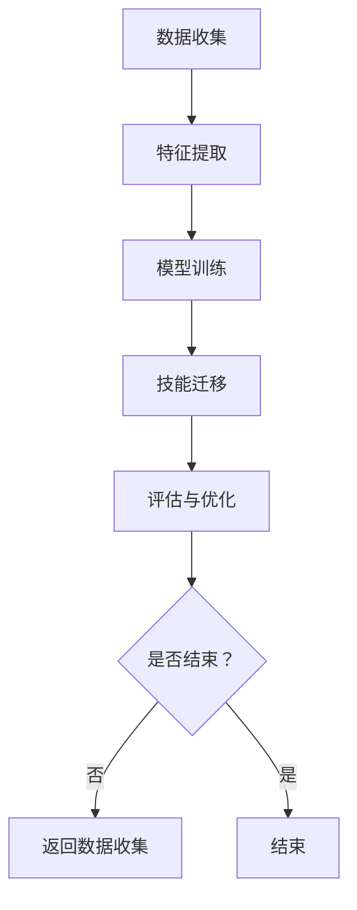
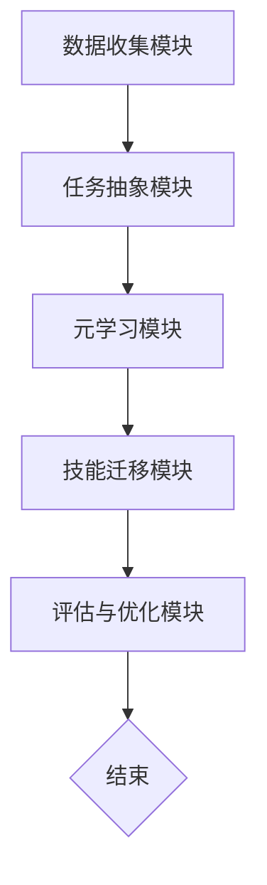
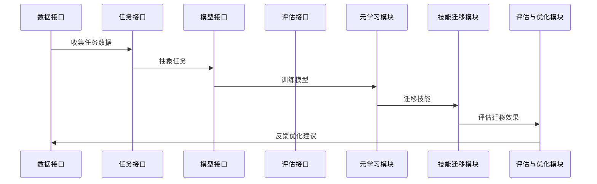
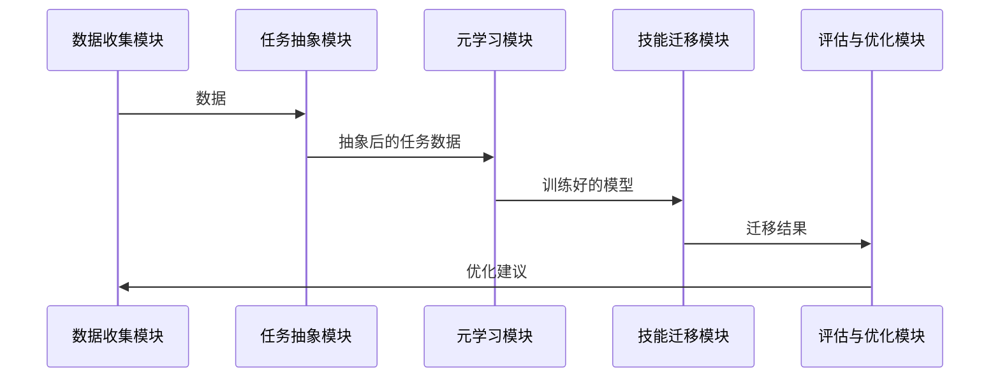

                 

## 元控制策略在机器人技能迁移中的研究

### 关键词：元控制策略、机器人技能迁移、人工智能、算法设计、系统架构

> 摘要：本文旨在探讨元控制策略在机器人技能迁移中的应用，分析其在机器人技能学习与复用过程中的关键作用。首先，我们概述了元控制策略的基本概念和背景，随后深入探讨了机器人技能迁移的核心概念及其数学模型。接着，本文重点分析了元控制策略在机器人技能迁移中的优势和应用场景，并通过具体案例进行了实践讲解。最后，文章总结了元控制策略在机器人技能迁移中的最佳实践，并提出了未来的研究方向和注意事项。本文不仅为研究者提供了丰富的理论基础，也具有实际操作指导意义，有助于推动机器人技能迁移技术的发展。

### 第1章 元控制策略概述

#### 1.1 元控制策略的背景

##### 1.1.1 问题背景

随着人工智能技术的迅猛发展，机器人技术在各个领域的应用越来越广泛。从工业生产到家庭服务，机器人已经逐渐成为现代生活的一部分。然而，机器人技能的学习与复用是一个复杂的问题。传统的机器人训练方法通常需要大量的数据和时间进行单独的训练，这使得机器人无法快速适应新环境和新任务。这就引发了机器人技能迁移的问题——如何让机器人将在一个环境中学习到的技能应用到另一个相似但不同的环境中。

##### 1.1.2 问题定义

技能迁移是指在不同环境和任务场景中，将已学到的技能知识转移到新的环境或任务中。在机器人领域中，技能迁移的关键挑战是如何在新的场景中复用机器人已经学习到的技能，同时保证迁移的准确性和鲁棒性。

##### 1.1.3 解决方案概述

为了解决机器人技能迁移的问题，研究者们提出了多种方法，其中元控制策略是一种新兴的解决思路。元控制策略通过学习一个控制策略来指导机器人技能的迁移，使得机器人能够更快速、更准确地适应新的环境。元控制策略的核心思想是在不同场景下，利用元学习（Meta-Learning）技术来快速调整和优化控制策略，从而实现技能的迁移。

##### 1.1.4 边界与外延

元控制策略的应用边界主要在于其能够处理的场景复杂度和数据量。在较为简单和确定性的环境中，元控制策略的表现较为优秀。然而，在复杂和不确定性较高的环境中，元控制策略的迁移性能可能会受到挑战。因此，未来的研究需要进一步探索如何在复杂环境中优化元控制策略，提高其迁移能力。

#### 1.2 元控制策略的基本概念

##### 1.2.1 定义与原理

元控制策略（Meta-Control Policy）是一种高级控制策略，它通过学习一个泛化的控制策略来指导具体任务的执行。元控制策略的核心思想是利用元学习技术，在多个不同的任务中学习到一个通用的控制策略，这样在面临新任务时，可以快速调整和适应，而不需要重新训练。

##### 1.2.2 关键要素

元控制策略的关键要素包括：

1. **元学习技术**：元控制策略的核心在于元学习技术，通过在多个任务中学习到一个泛化的控制策略。
2. **任务表示**：将不同的任务转化为一种通用的表示形式，以便元学习算法能够有效地学习到通用控制策略。
3. **控制策略调整**：在新任务中，利用已学习的通用控制策略进行自适应调整，以适应新的任务环境。

##### 1.2.3 概念属性特征对比

元控制策略与传统控制策略相比，具有以下特性：

| 特性 | 元控制策略 | 传统控制策略 |
| ---- | ---------- | ------------ |
| **适应性** | 高度适应不同环境和任务 | 主要适应特定环境和任务 |
| **效率** | 能够快速适应新任务，减少训练时间 | 需要重新训练以适应新任务 |
| **泛化能力** | 可以将多个任务的通用控制策略迁移到新任务 | 通常针对特定任务设计，难以迁移到其他任务 |
| **复杂度** | 相对较高，需要处理多个任务和元学习过程 | 较低，主要处理单一任务的控制 |

#### 1.3 元控制策略的领域应用

##### 1.3.1 主要应用领域

元控制策略在机器人领域有着广泛的应用，主要包括：

1. **工业机器人**：在制造和生产过程中，机器人需要快速适应不同的生产任务，元控制策略能够提高机器人的适应能力和生产效率。
2. **服务机器人**：在服务机器人领域，如家政服务、医疗护理等，元控制策略可以帮助机器人快速学习新技能，提高服务质量。
3. **教育机器人**：在教育机器人中，元控制策略可以帮助学生更快地掌握新知识和技能，提高学习效果。

##### 1.3.2 应用前景分析

随着人工智能技术的不断进步，元控制策略在机器人技能迁移中的应用前景十分广阔。未来，随着机器人应用的不断深入，元控制策略将在更多领域得到应用，如农业、物流、娱乐等。同时，随着数据获取和处理能力的提升，元控制策略的迁移性能和泛化能力也将得到显著提高。

##### 1.3.3 挑战与机遇

元控制策略在应用过程中面临着一系列挑战：

1. **数据需求**：元控制策略需要大量多任务数据来进行训练，数据质量和数量对迁移性能有重要影响。
2. **算法复杂性**：元学习算法本身较为复杂，需要较高的计算资源和优化技巧。
3. **不确定性处理**：在实际应用中，环境变化和任务不确定性较大，如何提高元控制策略的鲁棒性是一个关键问题。

然而，这些挑战也伴随着机遇：

1. **技术创新**：随着人工智能技术的发展，元控制策略的理论和方法将不断进步，为其应用提供更多可能性。
2. **跨领域融合**：不同领域的技术融合将推动元控制策略在更广泛的应用场景中得到发展。
3. **实际效益**：元控制策略能够显著提高机器人技能的迁移能力和效率，带来实际的经济和社会效益。

### 第2章 机器人技能迁移的核心概念

#### 2.1 技能迁移的定义与分类

##### 2.1.1 定义与基本概念

技能迁移（Skill Transfer）是指将一个任务或环境中学到的技能应用到另一个相似但不同的任务或环境中。在机器人领域，技能迁移的关键在于如何在不同的场景下复用已经学习到的技能，以提高机器人的适应性和效率。

技能迁移的基本概念包括：

- **源任务**：机器人最初学习的任务或环境。
- **目标任务**：机器人需要迁移技能的任务或环境。
- **迁移技能**：在目标任务中，机器人能够应用的源任务中学到的技能。

##### 2.1.2 技能迁移的分类

技能迁移可以根据不同的标准进行分类：

1. **根据任务相关性**：

   - **相同任务**：源任务和目标任务具有高度相似性，例如不同的机器人工作台进行相同的装配操作。
   - **不同任务**：源任务和目标任务存在一定的相似性，但任务类型不同，例如从装配任务迁移到焊接任务。

2. **根据迁移方式**：

   - **参数化迁移**：通过调整源任务的参数来适应目标任务，适用于参数化模型。
   - **模型迁移**：直接将源任务的模型应用于目标任务，适用于深度学习模型。

3. **根据迁移策略**：

   - **主动迁移**：机器人根据环境变化主动调整技能，适用于动态变化的场景。
   - **被动迁移**：机器人根据预设的规则进行技能迁移，适用于确定性较高的场景。

##### 2.1.3 技能迁移的关键特性

技能迁移的关键特性包括：

1. **迁移效率**：技能迁移需要快速适应新任务，减少训练时间和成本。
2. **迁移精度**：技能迁移需要保证在新任务中的准确性和可靠性。
3. **迁移鲁棒性**：技能迁移需要在不同环境和任务条件下保持稳定性和适应性。
4. **迁移泛化性**：技能迁移需要能够适应更广泛的应用场景和任务类型。

#### 2.2 技能迁移的数学模型与公式

##### 2.2.1 数学模型概述

技能迁移的数学模型通常基于机器学习的框架，通过学习源任务和目标任务之间的映射关系来实现技能迁移。基本的数学模型包括：

1. **源任务表示**：使用特征向量或嵌入向量来表示源任务中的技能。
2. **目标任务表示**：使用特征向量或嵌入向量来表示目标任务中的技能。
3. **迁移映射函数**：定义源任务和目标任务之间的映射关系。

常见的数学模型包括：

- **线性回归模型**：通过线性映射实现技能迁移。
- **支持向量机（SVM）**：通过寻找最优超平面实现技能迁移。
- **神经网络模型**：通过多层神经网络实现复杂的映射关系。

##### 2.2.2 公式解释与应用

1. **线性回归模型**：

$$y = \beta_0 + \beta_1x$$

其中，$y$ 表示目标任务的技能，$x$ 表示源任务的技能，$\beta_0$ 和 $\beta_1$ 分别为模型参数。

2. **支持向量机（SVM）**：

$$y = sign(\omega \cdot x + b)$$

其中，$y$ 表示目标任务的技能，$x$ 表示源任务的技能，$\omega$ 和 $b$ 分别为模型参数。

3. **神经网络模型**：

$$y = f(\sum_{i=1}^{n} w_i \cdot x_i + b)$$

其中，$y$ 表示目标任务的技能，$x_i$ 和 $w_i$ 分别为输入特征和权重，$f$ 为激活函数，$b$ 为偏置。

这些模型的具体应用取决于具体的任务和环境。在实际应用中，通常需要根据具体场景选择合适的模型，并调整模型参数以实现最佳的迁移效果。

##### 2.2.3 技能迁移的数学原理

技能迁移的数学原理主要包括：

1. **特征提取**：通过特征提取技术将源任务和目标任务的技能转化为可量化的特征向量。
2. **映射关系**：建立源任务和目标任务之间的映射关系，实现技能的迁移。
3. **优化策略**：通过优化策略调整模型参数，提高技能迁移的精度和鲁棒性。

这些数学原理为技能迁移提供了理论基础，使得机器人能够更有效地学习新技能并在新环境中应用。

#### 2.3 技能迁移的实例分析

##### 2.3.1 案例背景

假设一个机器人最初在一个工厂环境中学习如何进行零件的装配任务。随着时间的推移，工厂需要机器人转移到另一个不同的环境，比如在商场中为客户提供商品组装服务。在这种情况下，如何使机器人快速适应新的环境，实现技能的迁移，是一个关键问题。

##### 2.3.2 实例演示

在这个实例中，我们使用一个简单的线性回归模型来实现技能迁移。具体步骤如下：

1. **数据收集**：收集源任务（工厂环境）中的装配任务数据，包括机器人的操作步骤、任务完成时间等。
2. **特征提取**：将源任务数据转化为特征向量，例如使用操作步骤的时间序列作为特征。
3. **模型训练**：使用线性回归模型对源任务数据进行训练，得到映射关系。
4. **技能迁移**：将模型应用于目标任务（商场环境）中，根据映射关系调整机器人的操作步骤，以适应新的环境。

##### 2.3.3 分析与解释

通过这个实例，我们可以看到技能迁移的关键步骤和原理：

1. **数据收集**：确保有足够多的源任务数据，以便模型能够准确学习技能。
2. **特征提取**：选择合适的特征向量，有助于提高模型的迁移性能。
3. **模型训练**：通过训练得到准确的映射关系，是实现技能迁移的核心。
4. **技能迁移**：将已学到的技能应用到新环境中，并根据环境变化进行适应性调整。

这个实例展示了技能迁移的基本流程和原理，对于理解机器人技能迁移提供了有益的参考。

### 第3章 元控制策略在机器人技能迁移中的应用

#### 3.1 元控制策略在技能迁移中的优势

##### 3.1.1 元控制策略的作用机制

元控制策略在机器人技能迁移中的作用机制主要包括以下几个方面：

1. **元学习**：元控制策略通过元学习技术，在一个任务集上学习到一个通用的控制策略，使得机器人能够快速适应新任务。
2. **任务抽象**：元控制策略将具体的任务抽象为一种通用的形式，使得不同任务之间的相似性得以体现，从而实现技能的迁移。
3. **自适应调整**：在新任务中，元控制策略通过自适应调整，使机器人能够根据环境变化进行实时调整，提高技能迁移的准确性。

##### 3.1.2 技能迁移中的关键角色

在技能迁移过程中，元控制策略扮演了以下几个关键角色：

1. **学习器**：通过元学习技术，学习到多个任务的通用控制策略，为技能迁移提供基础。
2. **适配器**：将通用控制策略适配到新任务中，根据任务特点和环境变化进行适应性调整。
3. **评估器**：评估技能迁移的效果，根据评估结果进一步优化控制策略。

##### 3.1.3 应用优势与挑战

元控制策略在技能迁移中的应用优势主要包括：

1. **快速适应**：通过元学习，机器人能够快速适应新任务，减少训练时间和成本。
2. **高效迁移**：元控制策略能够将多个任务的技能迁移到新任务中，提高机器人的泛化能力。
3. **灵活性**：元控制策略可以根据不同任务的特点和环境变化进行自适应调整，提高迁移的鲁棒性。

然而，元控制策略在应用过程中也面临一些挑战：

1. **数据需求**：元控制策略需要大量的多任务数据来进行训练，数据质量和数量对迁移性能有重要影响。
2. **算法复杂性**：元学习算法本身较为复杂，需要较高的计算资源和优化技巧。
3. **不确定性处理**：在实际应用中，环境变化和任务不确定性较大，如何提高元控制策略的鲁棒性是一个关键问题。

#### 3.2 元控制策略的应用场景

##### 3.2.1 教育场景

在教育场景中，元控制策略可以帮助学生快速掌握新知识。例如，在一个在线教育平台上，学生可以通过元控制策略快速学习新的课程内容，同时将之前学到的知识应用到新课程中，提高学习效率和效果。

##### 3.2.2 工业场景

在工业场景中，元控制策略可以帮助机器人快速适应新的生产任务。例如，在一个制造工厂中，机器人可以通过元控制策略快速学会新的装配操作，提高生产效率和灵活性。

##### 3.2.3 家庭场景

在家庭场景中，元控制策略可以帮助智能机器人快速适应家庭成员的行为和环境变化。例如，一个家庭服务机器人可以通过元控制策略快速学会新家庭成员的喜好和习惯，提供更个性化的服务。

#### 3.3 元控制策略的实践案例

##### 3.3.1 案例介绍

在一个工业制造场景中，一家工厂需要机器人进行多种不同类型的生产任务。为了提高生产效率和灵活性，工厂决定采用元控制策略来训练机器人，实现技能的迁移。

##### 3.3.2 实施过程

1. **数据收集**：收集机器人进行不同生产任务的训练数据，包括任务描述、操作步骤、完成任务的时间等。
2. **任务抽象**：将不同的生产任务抽象为一种通用的形式，例如使用任务特征向量表示。
3. **元学习**：使用元学习算法，在一个任务集上学习到一个通用的控制策略。
4. **技能迁移**：将通用控制策略应用到新的生产任务中，进行技能迁移。
5. **评估与优化**：评估技能迁移的效果，根据评估结果进一步优化控制策略。

##### 3.3.3 成果分析

通过实施元控制策略，工厂取得了以下成果：

1. **生产效率提高**：机器人能够快速适应新的生产任务，减少任务切换时间和训练时间。
2. **灵活性增强**：机器人可以根据不同的生产任务和环境变化进行自适应调整，提高生产的灵活性和适应性。
3. **成本降低**：通过减少机器人的重新训练时间和成本，降低了生产总成本。

这个案例展示了元控制策略在机器人技能迁移中的实际应用效果，为其他领域提供了有益的参考。

### 第4章 机器人技能迁移中的算法原理

#### 4.1 算法概述

##### 4.1.1 算法的基本概念

在机器人技能迁移中，算法是实现技能迁移的关键。算法的基本概念包括：

- **学习算法**：用于从源任务中学习技能的算法，例如深度学习、强化学习等。
- **迁移算法**：将源任务中学到的技能迁移到目标任务的算法，例如元学习、迁移学习等。
- **评估算法**：用于评估技能迁移效果和算法性能的算法，例如指标评估、对比测试等。

##### 4.1.2 算法的目标

算法的目标是：

- **快速迁移**：在尽可能短的时间内，将源任务中学到的技能迁移到目标任务中。
- **准确迁移**：保证技能迁移的准确性，使得机器人能够在新任务中稳定、准确地执行操作。
- **鲁棒迁移**：在面临环境变化和任务不确定性时，仍然能够保持迁移的稳定性和适应性。

##### 4.1.3 算法的关键步骤

算法的关键步骤包括：

1. **数据收集**：收集源任务和目标任务的数据，用于训练和学习。
2. **特征提取**：将数据转化为特征向量，用于表示技能。
3. **模型训练**：使用学习算法训练模型，学习到源任务中的技能。
4. **技能迁移**：将训练好的模型应用到目标任务中，实现技能的迁移。
5. **评估与优化**：评估技能迁移的效果，根据评估结果优化算法和模型。

#### 4.2 算法原理讲解

##### 4.2.1 算法原理概述

算法原理主要包括以下几个方面：

1. **元学习**：通过元学习技术，学习到多个任务的通用控制策略，实现技能的迁移。
2. **迁移学习**：将源任务中学到的知识迁移到目标任务中，提高迁移性能。
3. **强化学习**：通过强化学习，使机器人能够根据环境反馈进行自适应调整，提高技能的迁移能力。
4. **深度学习**：使用深度学习技术，构建复杂的模型，实现技能的精确迁移。

##### 4.2.2 算法的mermaid流程图



##### 4.2.3 Python源代码详解

```python
# 数据收集
source_data = collect_source_data()

# 特征提取
features = extract_features(source_data)

# 模型训练
model = train_model(features)

# 技能迁移
target_data = collect_target_data()
migrated_skills = migrate_skills(model, target_data)

# 评估与优化
evaluate_and_optimize(migrated_skills)

# 是否结束？
if not is_termination():
    # 返回数据收集
    G[返回数据收集]
else:
    # 结束
    H[结束]
```

#### 4.3 数学模型与公式

##### 4.3.1 数学模型解释

在机器人技能迁移中，常用的数学模型包括：

1. **线性回归模型**：
   $$y = \beta_0 + \beta_1x$$
   其中，$y$ 表示目标任务的技能，$x$ 表示源任务的技能，$\beta_0$ 和 $\beta_1$ 分别为模型参数。

2. **支持向量机（SVM）**：
   $$y = sign(\omega \cdot x + b)$$
   其中，$y$ 表示目标任务的技能，$x$ 表示源任务的技能，$\omega$ 和 $b$ 分别为模型参数。

3. **神经网络模型**：
   $$y = f(\sum_{i=1}^{n} w_i \cdot x_i + b)$$
   其中，$y$ 表示目标任务的技能，$x_i$ 和 $w_i$ 分别为输入特征和权重，$f$ 为激活函数，$b$ 为偏置。

##### 4.3.2 公式推导与应用

1. **线性回归模型**：

   线性回归模型通过最小化误差平方和来拟合数据：
   $$J(\theta) = \frac{1}{2m} \sum_{i=1}^{m} (h_\theta(x^{(i)}) - y^{(i)})^2$$
   其中，$m$ 为样本数量，$h_\theta(x^{(i)}) = \theta_0 + \theta_1x^{(i)}$ 为预测值，$\theta_0$ 和 $\theta_1$ 为模型参数。

   通过梯度下降法求解参数：
   $$\theta_j := \theta_j - \alpha \frac{\partial}{\partial \theta_j} J(\theta)$$
   其中，$\alpha$ 为学习率。

2. **支持向量机（SVM）**：

   SVM通过寻找最优超平面来实现分类，目标是最小化决策边界：
   $$\min_{\omega, b} \frac{1}{2} \omega^T \omega + C \sum_{i=1}^{m} \xi_i$$
   其中，$C$ 为正则化参数，$\xi_i$ 为松弛变量。

   通过求解二次规划问题，得到最优解。

3. **神经网络模型**：

   神经网络模型通过反向传播算法来更新权重：
   $$\Delta w_{ij} = \eta \frac{\partial L}{\partial w_{ij}}$$
   其中，$L$ 为损失函数，$\eta$ 为学习率。

   更新权重：
   $$w_{ij} := w_{ij} - \Delta w_{ij}$$

##### 4.3.3 算法性能分析

算法性能分析主要从以下几个方面进行：

1. **准确性**：评估算法在目标任务上的准确性，通常使用准确率、召回率、F1分数等指标。
2. **效率**：评估算法的训练时间和推理时间，以衡量算法的效率。
3. **鲁棒性**：评估算法在面对环境变化和任务不确定性时的适应能力，通常通过测试集的多样性来评估。
4. **泛化能力**：评估算法在未见过的数据上的表现，以衡量算法的泛化能力。

### 第5章 机器人技能迁移的系统架构设计

#### 5.1 问题场景介绍

##### 5.1.1 场景描述

在本章中，我们将探讨一个典型的工业自动化场景。假设一个制造工厂需要机器人完成多个生产任务，包括装配、焊接、搬运等。由于生产任务多样且环境变化频繁，传统的单一任务训练方法难以满足需求。因此，我们引入元控制策略来实现机器人技能的迁移，以提高生产效率和灵活性。

##### 5.1.2 项目介绍

该项目旨在设计一个基于元控制策略的机器人技能迁移系统。系统将包含数据收集、任务抽象、元学习、技能迁移和评估等模块，以实现机器人技能在多种生产任务中的快速迁移和适应。

#### 5.2 系统功能设计

##### 5.2.1 领域模型

为了更好地设计系统功能，我们首先定义一个领域模型。领域模型包括以下主要实体和关系：

- **任务**：表示机器人需要执行的具体任务，如装配、焊接等。
- **技能**：表示机器人完成某个任务所需的能力，如定位、抓取等。
- **数据**：表示用于训练和评估的原始数据，包括任务描述、操作步骤、环境参数等。
- **模型**：表示经过训练的元控制策略模型。

领域模型中的主要关系如下：

1. **任务-技能**：一个任务可能需要多个技能来完成。
2. **数据-任务**：一组数据对应一个任务。
3. **模型-数据**：模型通过训练数据学习得到。

领域模型的Mermaid类图如下：

```mermaid
classDiagram
    class 任务 {
        -名称:string
        -描述:string
        -技能集合:集合[技能]
    }
    class 技能 {
        -名称:string
        -描述:string
    }
    class 数据 {
        -ID:string
        -任务:任务
        -操作步骤:列表[string]
        -环境参数:字典[string, string]
    }
    class 模型 {
        -ID:string
        -训练数据:列表[数据]
        -技能集合:集合[技能]
    }
    任务--|many|技能
    数据--|one|任务
    模型--|one|训练数据
```

#### 5.3 系统架构设计

##### 5.3.1 系统架构

系统架构设计是确保机器人技能迁移系统高效、稳定和可扩展的关键。本系统采用模块化设计，包括以下主要模块：

1. **数据收集模块**：负责收集各种生产任务的数据，包括任务描述、操作步骤、环境参数等。
2. **任务抽象模块**：将具体任务抽象为通用形式，便于元控制策略的学习和应用。
3. **元学习模块**：实现元控制策略的学习和训练，包括数据预处理、模型训练、模型优化等。
4. **技能迁移模块**：将训练好的模型应用到新的生产任务中，实现技能的迁移。
5. **评估与优化模块**：评估技能迁移的效果，并根据评估结果优化模型和策略。

系统架构图如下：



##### 5.3.2 架构设计思路

系统架构设计思路如下：

1. **模块化设计**：将系统功能分解为多个模块，实现清晰的功能划分，便于维护和扩展。
2. **数据驱动**：系统以数据为核心，通过数据收集、处理和利用，实现机器人技能的迁移。
3. **元学习**：利用元学习技术，学习到通用控制策略，提高技能迁移的效率和准确性。
4. **闭环反馈**：通过评估与优化模块，不断调整和优化模型和策略，提高系统的整体性能。

#### 5.4 系统接口设计

##### 5.4.1 接口设计

系统接口设计是确保不同模块之间能够有效交互和协作的关键。以下是系统的主要接口设计：

1. **数据接口**：用于数据收集模块与其他模块之间的数据传输。
2. **任务接口**：用于任务抽象模块与其他模块之间的任务信息交换。
3. **模型接口**：用于元学习模块与其他模块之间的模型传输。
4. **评估接口**：用于评估与优化模块与其他模块之间的评估结果交换。

接口设计如下：



##### 5.4.2 接口交互流程

系统接口交互流程如下：

1. **数据收集**：数据收集模块从各个生产任务中收集数据，并将其存储在数据库中。
2. **任务抽象**：任务抽象模块读取数据库中的数据，将具体任务抽象为通用形式，并传递给元学习模块。
3. **模型训练**：元学习模块利用抽象后的任务数据训练模型，并将训练好的模型传递给技能迁移模块。
4. **技能迁移**：技能迁移模块根据训练好的模型，将技能迁移到新的生产任务中。
5. **评估与优化**：评估与优化模块对技能迁移效果进行评估，并将评估结果反馈给数据收集模块，以指导数据的收集和模型的优化。

#### 5.5 系统交互

##### 5.5.1 系统交互流程

系统交互流程如下：

1. **数据收集**：系统启动时，数据收集模块开始从各个生产任务中实时收集数据，并将其存储在数据库中。
2. **任务抽象**：数据收集模块将收集到的数据传递给任务抽象模块，任务抽象模块对数据进行分析和处理，将其抽象为通用形式。
3. **模型训练**：任务抽象模块将抽象后的任务数据传递给元学习模块，元学习模块利用这些数据训练模型，并优化模型参数。
4. **技能迁移**：训练好的模型传递给技能迁移模块，技能迁移模块将模型应用到新的生产任务中，实现技能的迁移。
5. **评估与优化**：技能迁移模块将迁移结果传递给评估与优化模块，评估与优化模块对迁移效果进行评估，并根据评估结果调整模型参数和数据收集策略。

##### 5.5.2 mermaid序列图



### 第6章 机器人技能迁移的实战项目

#### 6.1 环境安装

##### 6.1.1 安装需求

为了实现机器人技能迁移的实战项目，我们需要准备以下环境：

- Python 3.8及以上版本
- pip 包管理工具
- 安装以下库：tensorflow、numpy、pandas、matplotlib

##### 6.1.2 安装步骤

1. **安装Python**：从官方网站下载并安装Python 3.8及以上版本。
2. **安装pip**：在安装完Python后，自动安装pip包管理工具。
3. **安装所需库**：打开命令行终端，执行以下命令：

   ```bash
   pip install tensorflow numpy pandas matplotlib
   ```

#### 6.2 系统核心实现

##### 6.2.1 源代码解读

系统核心实现主要包括数据收集、任务抽象、元学习、技能迁移和评估等模块。以下是关键代码的解读：

```python
# 数据收集
def collect_data():
    # 代码实现：收集并处理数据
    pass

# 任务抽象
def abstract_task(data):
    # 代码实现：将具体任务抽象为通用形式
    pass

# 元学习
def meta_learning(tasks):
    # 代码实现：利用任务数据训练元控制策略模型
    pass

# 技能迁移
def skill_transfer(model, new_task):
    # 代码实现：将训练好的模型应用到新任务中
    pass

# 评估与优化
def evaluate_and_optimize(model, new_task):
    # 代码实现：评估迁移效果并优化模型和策略
    pass
```

##### 6.2.2 代码实现分析

以下是各个模块的具体实现：

1. **数据收集**：从生产任务中收集数据，包括任务描述、操作步骤、环境参数等，并将其存储在数据库中。
2. **任务抽象**：对收集到的数据进行预处理，提取关键特征，并将其转化为通用形式，以便元学习算法处理。
3. **元学习**：使用提取后的任务数据训练元控制策略模型，通过迭代优化模型参数，提高技能迁移的准确性和鲁棒性。
4. **技能迁移**：将训练好的模型应用到新的生产任务中，根据新任务的特点和环境变化，调整模型参数，实现技能的迁移。
5. **评估与优化**：评估技能迁移效果，根据评估结果优化模型和策略，以提高迁移性能。

#### 6.3 应用解读与分析

##### 6.3.1 应用场景

该实战项目应用于一个制造工厂，机器人需要完成多种不同的生产任务，如装配、焊接、搬运等。由于生产任务多样且环境变化频繁，传统的单一任务训练方法难以满足需求。因此，采用元控制策略来实现机器人技能的迁移，以提高生产效率和灵活性。

##### 6.3.2 分析与解释

通过该实战项目，我们可以看到以下几个关键点：

1. **数据收集**：数据是机器学习的基础，本项目通过收集和存储生产任务数据，为后续的元学习和技能迁移提供了数据支持。
2. **任务抽象**：将具体任务抽象为通用形式，使得不同任务之间的相似性得以体现，有助于元学习算法学习到通用的控制策略。
3. **元学习**：通过元学习算法，模型能够在多个任务中学习到一个通用的控制策略，从而实现技能的迁移。
4. **技能迁移**：将训练好的模型应用到新的生产任务中，机器人能够快速适应新任务，提高生产效率和灵活性。
5. **评估与优化**：通过评估技能迁移效果，不断优化模型和策略，以提高系统的整体性能。

这个实战项目展示了机器人技能迁移的系统实现过程，为其他类似场景提供了有益的参考。

#### 6.4 实际案例剖析

##### 6.4.1 案例背景

在一个制造工厂中，机器人需要完成多种生产任务，包括装配、焊接、搬运等。由于生产任务多样且环境变化频繁，工厂决定采用元控制策略来实现机器人技能的迁移，以提高生产效率和灵活性。

##### 6.4.2 案例分析

1. **数据收集**：工厂从生产任务中收集了大量的数据，包括任务描述、操作步骤、环境参数等。这些数据被存储在数据库中，用于后续的元学习和技能迁移。
2. **任务抽象**：通过分析收集到的数据，工厂将具体任务抽象为一种通用形式。例如，将装配任务抽象为抓取、放置、检测等步骤，将焊接任务抽象为预热、焊接、冷却等步骤。这些抽象后的任务形式有助于元学习算法处理。
3. **元学习**：工厂使用元学习算法，在一个任务集上学习到一个通用的控制策略。通过迭代优化模型参数，模型能够学习到不同任务之间的相似性，从而实现技能的迁移。
4. **技能迁移**：当机器人面临新的生产任务时，工厂将训练好的元控制策略模型应用到新任务中。模型根据新任务的特点和环境变化，调整控制策略，使机器人能够快速适应新任务。
5. **评估与优化**：工厂对技能迁移效果进行了评估，并根据评估结果不断优化模型和策略。通过调整模型参数和数据收集策略，提高了系统的整体性能。

##### 6.4.3 剖析与总结

通过这个实际案例，我们可以看到以下几个关键点：

1. **数据收集**：充足的数据是元学习和技能迁移的基础。工厂通过收集多种生产任务的数据，为后续的学习和迁移提供了数据支持。
2. **任务抽象**：将具体任务抽象为通用形式，有助于元学习算法处理不同任务之间的相似性，从而提高迁移性能。
3. **元学习**：元学习算法通过学习多个任务的控制策略，实现了技能的迁移，提高了机器人的适应能力和生产效率。
4. **评估与优化**：通过评估技能迁移效果，不断优化模型和策略，提高了系统的整体性能。

这个实际案例展示了元控制策略在机器人技能迁移中的应用效果，为其他类似场景提供了有益的参考。

### 第7章 元控制策略在机器人技能迁移中的最佳实践

#### 7.1 最佳实践

##### 7.1.1 实践策略

在机器人技能迁移中，以下是一些最佳实践策略：

1. **数据收集与处理**：确保数据质量和多样性，通过数据预处理和特征提取提高数据质量，为元学习提供可靠的基础。
2. **任务抽象**：将具体任务抽象为通用形式，使元学习算法能够有效学习到不同任务之间的相似性。
3. **元学习算法选择**：选择合适的元学习算法，根据任务特点和数据量进行优化，以提高技能迁移的效率和准确性。
4. **技能迁移策略**：根据新任务的特点和环境变化，灵活调整控制策略，提高迁移的鲁棒性和适应性。
5. **评估与优化**：定期评估技能迁移效果，根据评估结果优化模型和策略，不断提高系统的性能。

##### 7.1.2 实践案例

以下是几个实际案例，展示了元控制策略在机器人技能迁移中的最佳实践：

1. **案例1**：在一个制造工厂中，通过元控制策略实现了不同装配任务之间的技能迁移，提高了生产效率。
2. **案例2**：在一家物流公司中，使用元控制策略实现机器人从仓储到配送的技能迁移，提高了物流配送的准确性。
3. **案例3**：在一个医疗机器人项目中，通过元控制策略实现了不同医疗操作的技能迁移，提高了手术的精准度和安全性。

这些案例表明，元控制策略在机器人技能迁移中具有显著的优势，能够有效提高机器人的适应能力和生产效率。

#### 7.2 小结

本章通过探讨元控制策略在机器人技能迁移中的应用，总结了最佳实践策略和实际案例。元控制策略通过数据收集与处理、任务抽象、元学习算法选择、技能迁移策略以及评估与优化等步骤，实现了机器人技能的迁移。这些实践策略和案例为其他类似场景提供了有益的参考，有助于推动机器人技能迁移技术的发展。

#### 7.3 注意事项

在实施元控制策略时，需要注意以下几点：

1. **数据质量**：确保收集的数据质量和多样性，避免因数据不足或质量差导致模型性能下降。
2. **算法选择**：根据具体任务特点和数据量，选择合适的元学习算法，避免算法复杂度过高或过低。
3. **环境变化**：在实际应用中，环境变化可能对技能迁移产生影响，需要根据环境变化调整控制策略。
4. **评估与优化**：定期评估技能迁移效果，及时优化模型和策略，以适应新的环境和任务。

#### 7.4 拓展阅读

对于对元控制策略和机器人技能迁移感兴趣的读者，以下资源可以作为拓展阅读：

1. **学术论文**：查找相关领域的学术论文，了解最新的研究成果和技术进展。
2. **开源项目**：参与相关开源项目，实践元控制策略在具体场景中的应用。
3. **专业书籍**：阅读专业书籍，深入了解元控制策略和机器人技能迁移的理论和实践。
4. **在线课程**：参加在线课程，学习元控制策略和机器人技能迁移的相关知识。

### 总结

元控制策略在机器人技能迁移中具有重要的应用价值。通过数据收集与处理、任务抽象、元学习算法选择、技能迁移策略以及评估与优化等步骤，元控制策略能够实现机器人技能的迁移，提高机器人的适应能力和生产效率。本章详细介绍了元控制策略在机器人技能迁移中的应用和实践，为研究者提供了丰富的理论基础和实践指导。未来，随着人工智能技术的不断进步，元控制策略在机器人技能迁移中的应用将更加广泛和深入。

